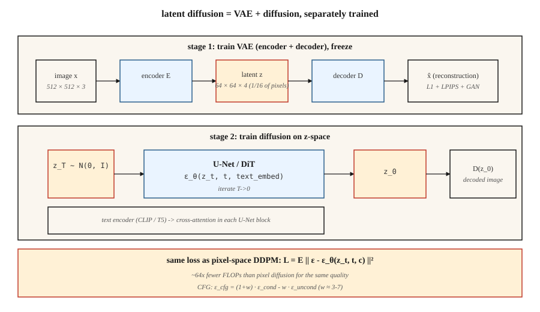

# 潜在扩散与 Stable Diffusion

> 在 512×512 图像上做像素空间扩散,是算力上的战争罪行。Rombach et al.(2022)注意到:生成一张图像,你并不需要全部 78.6 万个维度——你只需要够捕获语义结构的维度,剩下的交给一个单独的解码器。把扩散搬进 VAE 的潜在空间里跑。这一个想法,就是 Stable Diffusion。

**类型:** 动手构建
**编程语言:** Python
**前置要求:** 第 8 阶段第 02 课(VAE)、第 8 阶段第 06 课(DDPM)、第 7 阶段第 09 课(ViT)
**预计耗时:** 约 75 分钟

## 问题

512² 的像素空间扩散,意味着 U-Net 要跑 `[B, 3, 512, 512]` 形状的张量。5 亿参数的 U-Net,每个采样步约 100 GFLOPS,50 步就是每张图 5 TFLOPS。在十亿张图上训练,算力账单是天文数字。

这些 FLOPs 大部分花在把感知上不重要的细节推过网络——那些高频纹理,一个有损 VAE 就能压缩掉。Rombach 的想法:只训一次 VAE(*第一阶段*),冻结它,然后把扩散整个搬进 4 通道 64×64 的潜在空间(*第二阶段*)。U-Net 不变,像素数 1/16,同等质量下 FLOPs 省约 64 倍。

这就是 Stable Diffusion 配方。SD 1.x / 2.x 在 `64×64×4` 潜在表示上用 8.6 亿参数 U-Net;SDXL 在 `128×128×4` 上用 26 亿参数 U-Net;SD3 把 U-Net 换成扩散 Transformer(DiT)配 flow matching;Flux.1-dev(Black Forest Labs, 2024)交付的是 120 亿参数的 DiT-MMDiT。全都跑在同一个两阶段地基上。

## 概念



**两个阶段,分开训练。**

1. **第一阶段 —— VAE。** 编码器 `E(x) → z`,解码器 `D(z) → x`。目标压缩率:每个空间轴降采样 8 倍,再调通道数,让潜在张量总大小约为像素数的 1/16。损失 = 重建(L1 + LPIPS 感知)+ KL(小权重——不把 `z` 逼得太高斯,因为我们不需要从 `z` 精确采样)。通常再加对抗损失,让解码图像锐利。

2. **第二阶段 —— 在 `z` 上扩散。** 把 `z = E(x_real)` 当数据,训练 U-Net(或 DiT)给 `z_t` 去噪。推理时:用扩散采出 `z_0`,再 `x = D(z_0)`。

**文本条件化。** 两个额外部件。一个冻结的文本编码器(SD 1.x 用 CLIP-L,SD 2/XL 用 CLIP-L+OpenCLIP-G,SD3 和 Flux 用 T5-XXL)。一个交叉注意力注入:每个 U-Net block 以 `[Q = 图像特征, K = V = 文本 token]` 做注意力混合。文本影响图像,只走这一条路。

**损失函数与第 06 课完全相同。** 同样的 DDPM / flow matching 噪声 MSE,只是换了数据域。

## 架构变体

| 模型 | 年份 | 骨干 | 潜在形状 | 文本编码器 | 参数量 |
|-------|------|----------|--------------|--------------|--------|
| SD 1.5 | 2022 | U-Net | 64×64×4 | CLIP-L(77 token) | 8.6 亿 |
| SD 2.1 | 2022 | U-Net | 64×64×4 | OpenCLIP-H | 8.65 亿 |
| SDXL | 2023 | U-Net + refiner | 128×128×4 | CLIP-L + OpenCLIP-G | 26 亿 + 66 亿 |
| SDXL-Turbo | 2023 | 蒸馏版 | 128×128×4 | 同上 | 1–4 步采样 |
| SD3 | 2024 | MMDiT(多模态 DiT) | 128×128×16 | T5-XXL + CLIP-L + CLIP-G | 20 亿 / 80 亿 |
| Flux.1-dev | 2024 | MMDiT | 128×128×16 | T5-XXL + CLIP-L | 120 亿 |
| Flux.1-schnell | 2024 | MMDiT 蒸馏版 | 128×128×16 | T5-XXL + CLIP-L | 120 亿,1–4 步 |

趋势:U-Net 换 DiT(对潜在 patch 的 Transformer),放大文本编码器(提示遵循度上 T5 胜过 CLIP),加潜在通道(4 → 16,给细节留余量)。

```figure
noise-schedule
```

## 动手构建

`code/main.py` 在第 06 课的 DDPM 之上,叠一个玩具 1 维"VAE"(恒等编码器+解码器,仅作演示;真 VAE 该是卷积网络),并加上带 classifier-free guidance 的类条件。它展示:同一个扩散损失,跑在原始 1 维值上还是编码值上都行——这就是关键洞察。

### 第 1 步:编码器/解码器

```python
def encode(x):    return x * 0.5          # toy "compression" to smaller scale
def decode(z):    return z * 2.0
```

真 VAE 有训练出来的权重。教学上,这个线性映射足以证明:扩散在 `z` 上运行,不关心原始数据空间。

### 第 2 步:在 `z` 空间里扩散

与第 06 课相同的 DDPM。网络看到的数据是 `z = E(x)`。采出 `z_0` 后,用 `D(z_0)` 解码。

### 第 3 步:classifier-free guidance

训练时以 10% 概率丢弃类标签(换成 null token)。推理时同时算 `ε_cond` 和 `ε_uncond`,然后:

```python
eps_cfg = (1 + w) * eps_cond - w * eps_uncond
```

`w = 0` = 无引导(多样性最大),`w = 3` = 默认,`w = 7+` = 过饱和 / 过锐。

### 第 4 步:文本条件化(讲概念,不写码)

把类标签换成冻结文本编码器的输出,通过交叉注意力把文本嵌入喂给 U-Net:

```python
h = h + CrossAttention(Q=h, K=text_embed, V=text_embed)
```

这就是类条件扩散模型与 Stable Diffusion 之间唯一实质的区别。

## 陷阱

- **VAE 缩放对不上。** SD 1.x 的 VAE 编码后要乘一个缩放常数(`scaling_factor ≈ 0.18215`)。忘了它,U-Net 就会在方差离谱的潜在表示上训练。每个检查点都带这个常数。
- **文本编码器悄悄用错。** SD3 需要 T5-XXL 且 token 数 ≥128,退回只用 CLIP 是有损的。永远检查 `use_t5=True`,否则提示保真度崩盘。
- **混用潜在空间。** SDXL、SD3、Flux 的 VAE 各不相同。在 SDXL 潜在空间上训的 LoRA,到 SD3 上不能用。Hugging Face diffusers 0.30+ 会直接拒绝加载不匹配的检查点。
- **CFG 太高。** `w > 10` 产出饱和、油腻的图,牺牲多样性过拟合提示词。甜点位是 `w = 3-7`。
- **负面提示泄漏。** 空负面提示变成 null token;填了内容的负面提示变成 `ε_uncond`。两者不是一回事;有些流水线会静默默认用 null。

## 投入使用

2026 年生产栈:

| 目标 | 推荐骨干 |
|--------|----------------------|
| 窄领域、有成对数据、从零训模型 | SDXL 微调(LoRA / 全量)——交付最快 |
| 开放域文生图、开放权重 | Flux.1-dev(120 亿,Apache / 非商用)或 SD3.5-Large |
| 最快推理、开放权重 | Flux.1-schnell(1–4 步,Apache)或 SDXL-Lightning |
| 最强提示遵循、托管服务 | GPT-Image / DALL-E 3(仍是)、Midjourney v7、Imagen 4 |
| 编辑工作流 | Flux.1-Kontext(2024 年 12 月)——原生接受 图像 + 文本 |
| 研究基线 | SD 1.5——老但研究得最透 |

## 交付

保存 `outputs/skill-sd-prompter.md`。技能输入:文本提示 + 目标风格;输出:模型 + 检查点、CFG 强度、采样器、负面提示、分辨率、可选 ControlNet/IP-Adapter 组合,以及逐步骤 QA 清单。

## 练习

1. **易。** 用引导强度 `w ∈ {0, 1, 3, 7, 15}` 跑 `code/main.py`。按类记录样本均值。`w` 到多少时,类均值偏离真实数据均值?
2. **中。** 把玩具线性编码器换成带重建损失的 tanh-MLP 编码器/解码器对。在新潜在表示上重训扩散。样本质量有变化吗?
3. **难。** 用 diffusers 搭一个真实的 Stable Diffusion 推理:加载 `sdxl-base`,Euler 30 步、CFG=7,计时。再换 `sdxl-turbo`,4 步、CFG=0。同一主体,质量不同——描述变化并解释原因。

## 关键术语

| 术语 | 人们常说的是 | 实际含义是 |
|------|-----------------|-----------------------|
| 第一阶段 | "那个 VAE" | 训好的编码器/解码器对;把 512² 压到 64²。 |
| 第二阶段 | "那个 U-Net" | 潜在空间上的扩散模型。 |
| CFG | "引导强度" | `(1+w)·ε_cond - w·ε_uncond`;调节条件强度。 |
| Null token | "空提示嵌入" | 用于 `ε_uncond` 的无条件嵌入。 |
| 交叉注意力 | "文本怎么进来的" | 每个 U-Net block 以文本 token 为 K、V 做注意力。 |
| DiT | "扩散 Transformer" | 用对潜在 patch 的 Transformer 取代 U-Net;扩展性更好。 |
| MMDiT | "多模态 DiT" | SD3 的架构:文本流与图像流做联合注意力。 |
| VAE 缩放因子 | "那个魔法数字" | 把潜在表示除以约 5.4,让扩散跑在单位方差空间。 |

## 生产注记:在 8GB 消费级 GPU 上跑 Flux-12B

参考的 Flux 集成方案,是"我只有消费级 GPU,能交付吗?"这个问题的标准答案。技巧仍是生产推理文献里那套三旋钮配方,只是用在扩散 DiT 上:

1. **错峰加载。** Flux 有三(四)个从不需要同时待在显存里的网络:T5-XXL 文本编码器(fp32 约 10 GB)、CLIP-L(很小)、120 亿参数 MMDiT、VAE。先编码提示词,*删掉*编码器,加载 DiT,去噪,*删掉* DiT,加载 VAE,解码。8GB 消费卡一次只装得下一个阶段。
2. **bitsandbytes 4 位量化。** 对 T5 编码器和 DiT 都用 `BitsAndBytesConfig(load_in_4bit=True, bnb_4bit_compute_dtype=torch.bfloat16)`。显存省 8 倍;按 Aritra 的基准(见配套 notebook),文生图质量损失不可感知。
3. **CPU 卸载。** `pipe.enable_model_cpu_offload()` 随前向推进自动在 CPU 与 GPU 之间 swap 模块。多 10–20% 延迟,但流水线好歹能跑。

显存账:量化后 `10 GB T5 / 8 = 1.25 GB`,量化 DiT `120 亿参数 × 0.5 字节 ≈ 6 GB`,外加激活。用 stas00 的话说,这是 TP=1 推理的极限端——不做模型并行,量化拉满。生产环境你会在 H100 上跑 TP=2 或 TP=4;单台开发笔记本,这就是配方。

## 延伸阅读

- [Rombach et al. (2022). High-Resolution Image Synthesis with Latent Diffusion Models](https://arxiv.org/abs/2112.10752) — Stable Diffusion。
- [Podell et al. (2023). SDXL: Improving Latent Diffusion Models for High-Resolution Image Synthesis](https://arxiv.org/abs/2307.01952) — SDXL。
- [Peebles & Xie (2023). Scalable Diffusion Models with Transformers (DiT)](https://arxiv.org/abs/2212.09748) — DiT。
- [Esser et al. (2024). Scaling Rectified Flow Transformers for High-Resolution Image Synthesis](https://arxiv.org/abs/2403.03206) — SD3,MMDiT。
- [Ho & Salimans (2022). Classifier-Free Diffusion Guidance](https://arxiv.org/abs/2207.12598) — CFG。
- [Labs (2024). Flux.1 — Black Forest Labs announcement](https://blackforestlabs.ai/announcing-black-forest-labs/) — Flux.1 家族。
- [Hugging Face Diffusers docs](https://huggingface.co/docs/diffusers/index) — 以上所有检查点的参考实现。
