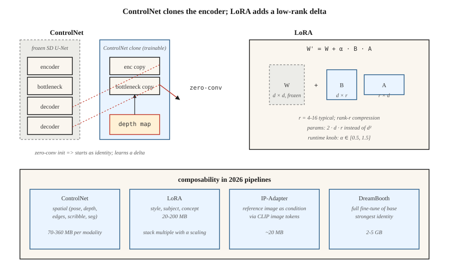

# ControlNet、LoRA 与条件化

> 单靠文本,是个笨拙的控制信号。ControlNet 让你克隆一个预训练扩散模型,用深度图、姿态骨架、涂鸦或边缘图来驾驶它。LoRA 让你只训练 1000 万参数,就能微调一个 20 亿参数的模型。两者合力,把 Stable Diffusion 从玩具变成了 2026 年每个创意机构都在用的图像流水线。

**类型:** 动手构建
**编程语言:** Python
**前置要求:** 第 8 阶段第 07 课(潜在扩散)、第 10 阶段(从零构建 LLM——LoRA 基础)
**预计耗时:** 约 75 分钟

## 问题

"一个穿红裙的女人在繁忙街道上遛狗"这样的提示词,没有告诉模型狗在*哪里*、女人是*什么姿态*、街道是*什么透视*。文本只能钉死图像所需信息量的 10%,其余都是视觉信息,无法用文字高效描述。

为每种信号(姿态、深度、canny 边缘、分割)从零训练新的条件模型,成本不可承受。你要的是:冻结 26 亿参数的 SDXL 骨干,挂一个读取条件的小侧网络,让它去微调骨干的中间特征。这就是 ControlNet。

你还想教模型新概念(你的脸、你的产品、你的风格),又不想重训整个模型。你要一个小 100 倍的增量。这就是 LoRA——插进现有注意力权重的低秩适配器。

ControlNet + LoRA + 文本 = 2026 年从业者的工具箱。多数生产图像流水线,是在 SDXL / SD3 / Flux 基座上叠 2–5 个 LoRA、1–3 个 ControlNet,再加一个 IP-Adapter。

## 概念



### ControlNet(Zhang et al., 2023)

拿一个预训练 SD,*克隆* U-Net 的编码器那一半,冻结原网络,训练克隆体接受额外的条件输入(边缘、深度、姿态),再用*零卷积*跳跃连接把克隆体接回原网络的解码器一半(1×1 卷积初始化为零——开局是恒等操作,逐渐学出增量)。

```
SD U-Net decoder:   ... ← orig_enc_features + zero_conv(controlnet_enc(condition))
```

零卷积初始化意味着 ControlNet 开局等于不存在——没训练前也无害。用标准扩散损失,在 100 万(提示词, 条件, 图像)三元组上训练。

每种模态的 ControlNet 都是小侧模型(SDXL 约 3.6 亿参数,SD 1.5 约 7000 万)。推理时可以组合:

```
features += weight_a * control_a(depth) + weight_b * control_b(pose)
```

### LoRA(Hu et al., 2021)

对模型中任意线性层 `W ∈ R^{d×d}`,冻结 `W`,加一个低秩增量:

```
W' = W + ΔW,  ΔW = B @ A,  A ∈ R^{r×d},  B ∈ R^{d×r}
```

`r << d`。注意力层常用秩 4–16,重微调用 64–128。新增参数量:`2 · d · r` 而非 `d²`。SDXL 注意力 `d=640`、`r=16` 时,每个适配器 2 万参数,而不是 41 万——缩减 20 倍。全模型算下来:一个 LoRA 通常 20–200MB,基座是 5GB。

推理时可以缩放 LoRA:`W' = W + α · B @ A`。`α = 0.5-1.5` 都正常。多个 LoRA 可加性堆叠(注意它们会以非线性方式相互影响)。

### IP-Adapter(Ye et al., 2023)

一个小适配器,接受*图像*作为条件(与文本并列)。用 CLIP 图像编码器产出图像 token,与文本 token 一起注入交叉注意力。每个基座模型约 20MB。不用 LoRA,就能做"按这张参考图的风格生成"。

## 可组合性矩阵

| 工具 | 控制什么 | 体积 | 何时用 |
|------|------------------|------|-------------|
| ControlNet | 空间结构(姿态、深度、边缘) | 70–360MB | 精确布局、构图 |
| LoRA | 风格、主体、概念 | 20–200MB | 个性化、风格 |
| IP-Adapter | 参考图的风格或主体 | 20MB | 文字形容不出来的感觉 |
| Textual Inversion | 单个概念变成一个新 token | 10KB | 过时,基本被 LoRA 取代 |
| DreamBooth | 对某主体全量微调 | 2–5GB | 强身份保持,算力消耗大 |
| T2I-Adapter | 更轻的 ControlNet 替代 | 70MB | 边缘设备、推理预算紧 |

ControlNet ≈ 管空间,LoRA ≈ 管语义。两个都用。

```figure
v4-controlnet-zero
```

## 动手构建

`code/main.py` 在 1 维上模拟这两种机制:

1. **LoRA。** 一个预训练好的线性层 `W`,冻结,训练低秩 `B @ A`,使 `W + BA` 匹配某个目标线性层。展示 `r = 1` 就足以完美学会一个秩 1 修正。

2. **ControlNet 简版。** 一个"冻结基座"预测器加一个读取额外信号的"侧网络"。侧网络输出乘以一个初始化为零的可学习标量门(我们的零卷积版本)。训练并观察门逐渐爬升。

### 第 1 步:LoRA 数学

```python
def lora(W, A, B, x, alpha=1.0):
    # W is frozen; A, B are the trainable low-rank factors.
    return [W[i][j] * x[j] for i, j in ...] + alpha * (B @ (A @ x))
```

### 第 2 步:零初始化侧网络

```python
side_out = control_net(x, condition)
gated = gate * side_out  # gate initialized to 0
h = base(x) + gated
```

第 0 步时输出与基座完全一致。训练早期 `gate` 更新缓慢——没有灾难性漂移。

## 陷阱

- **LoRA 缩放过头。** `α = 2` 或 `α = 3` 是常见的"再强一点"野路子,产出过度风格化甚至崩坏的图。保持 `α ≤ 1.5`。
- **ControlNet 权重打架。** 姿态 ControlNet 权重 1.0 叠深度 ControlNet 权重 1.0,通常会过头。权重之和 ≈ 1.0 是安全默认。
- **LoRA 装错基座。** SDXL 的 LoRA 在 SD 1.5 上静默失效,因为注意力维度对不上。diffusers 0.30+ 会告警。
- **Textual Inversion 漂移。** 在一个检查点上训的 token,换到另一个上漂移严重。LoRA 可移植性好得多。
- **LoRA 融合与存储。** 可以把 LoRA 烘焙进基座权重换取更快推理(免运行时加法),但会失去运行时调 `α` 的能力。两个版本都留。

## 投入使用

| 目标 | 2026 年流水线 |
|------|---------------|
| 复现品牌艺术风格 | 约 30 张精选图训练 rank 32 的 LoRA |
| 把我的脸放进生成图 | DreamBooth,或 LoRA + IP-Adapter-FaceID |
| 指定姿态 + 提示词 | ControlNet-Openpose + SDXL + 文本 |
| 深度感知构图 | ControlNet-Depth + SD3 |
| 参考图 + 提示词 | IP-Adapter + 文本 |
| 精确布局 | ControlNet-Scribble 或 ControlNet-Canny |
| 换背景 | ControlNet-Seg + 局部重绘(第 09 课) |
| 一步快速风格化 | SDXL-Turbo 上的 LCM-LoRA |

## 交付

保存 `outputs/skill-sd-toolkit-composer.md`。技能输入:任务(可用素材:提示词、可选参考图、可选姿态、可选深度、可选涂鸦);输出:工具栈、各组件权重,以及可复现的种子协议。

## 练习

1. **易。** 在 `code/main.py` 里把 LoRA 秩 `r` 从 1 变到 4。秩为多少时,LoRA 能精确匹配一个秩 2 的目标增量?
2. **中。** 对两个目标变换分别训练两个 LoRA,一起加载,观察它们的加性相互作用。什么时候相互作用破坏线性?
3. **难。** 用 diffusers 堆叠:SDXL-base + Canny-ControlNet(权重 0.8)+ 风格 LoRA(α 0.8)+ IP-Adapter(权重 0.6)。变动栈内各权重,测量 FID 与提示遵循度的此消彼长。

## 关键术语

| 术语 | 人们常说的是 | 实际含义是 |
|------|-----------------|-----------------------|
| ControlNet | "空间控制" | 克隆编码器 + 零卷积跳跃;读取条件图像。 |
| 零卷积 | "开局即恒等" | 初始化为零的 1×1 卷积;ControlNet 开局是无操作。 |
| LoRA | "低秩适配器" | `W + B @ A`,`r << d`;比全量微调少 100 倍参数。 |
| 秩 r | "那个旋钮" | LoRA 的压缩率;典型 4–16,重个性化用 64+。 |
| α | "LoRA 强度" | LoRA 增量的运行时缩放。 |
| IP-Adapter | "参考图" | 经 CLIP 图像 token 做图像条件化的小适配器。 |
| DreamBooth | "主体全量微调" | 用约 30 张主体图像微调整个模型。 |
| Textual Inversion | "新 token" | 只学一个新词嵌入;过时,基本已被取代。 |

## 生产注记:LoRA 热换、ControlNet 通道、多租户服务

真实的文生图 SaaS,在同一个基座检查点上服务数百个 LoRA 和一打 ControlNet。这个服务问题很像 LLM 多租户(生产文献在连续批处理和 LoRAX / S-LoRA 条目下讨论 LLM 的情形):

- **热换 LoRA,不要融合。** 把 `W' = W + α·B·A` 融进基座,每步推理快约 3–5%,但 `α` 和基座都锁死了。让 LoRA 以秩 r 增量的形式常驻显存;diffusers 提供 `pipe.load_lora_weights()` + `pipe.set_adapters([...], adapter_weights=[...])` 做按请求激活。换载成本是 `2 · d · r · 层数` 的权重——MB 级,亚秒。
- **ControlNet 是第二条注意力通道。** 克隆编码器与基座并行跑。两个权重 1.0 的 ControlNet = 每步多两次前向,而不是合并成一次。批次余量二次方下降。每个激活的 ControlNet,按约 1.5 倍单步成本做预算。
- **LoRA 也要量化。** 如果基座做了量化(见第 07 课,8GB 上跑 Flux),LoRA 增量也能干净地量化到 8 位或 4 位。QLoRA 式加载,让你在 4 位 Flux 基座上叠 5–10 个 LoRA 而不爆显存。

Flux 专属:Niels 的 Flux-on-8GB notebook 把基座量化到 4 位;在该量化基座上叠风格 LoRA(`pipe.load_lora_weights("user/style-lora")`,`weight_name="pytorch_lora_weights.safetensors"`)依然有效。这就是 2026 年大多数 SaaS 机构交付的配方。

## 延伸阅读

- [Zhang, Rao, Agrawala (2023). Adding Conditional Control to Text-to-Image Diffusion Models](https://arxiv.org/abs/2302.05543) — ControlNet。
- [Hu et al. (2021). LoRA: Low-Rank Adaptation of Large Language Models](https://arxiv.org/abs/2106.09685) — LoRA(原为 LLM 提出;移植到扩散)。
- [Ye et al. (2023). IP-Adapter: Text Compatible Image Prompt Adapter](https://arxiv.org/abs/2308.06721) — IP-Adapter。
- [Mou et al. (2023). T2I-Adapter: Learning Adapters to Dig Out More Controllable Ability](https://arxiv.org/abs/2302.08453) — 更轻的 ControlNet 替代。
- [Ruiz et al. (2023). DreamBooth: Fine Tuning Text-to-Image Diffusion Models for Subject-Driven Generation](https://arxiv.org/abs/2208.12242) — DreamBooth。
- [HuggingFace Diffusers — ControlNet / LoRA / IP-Adapter docs](https://huggingface.co/docs/diffusers/training/controlnet) — 参考流水线。
