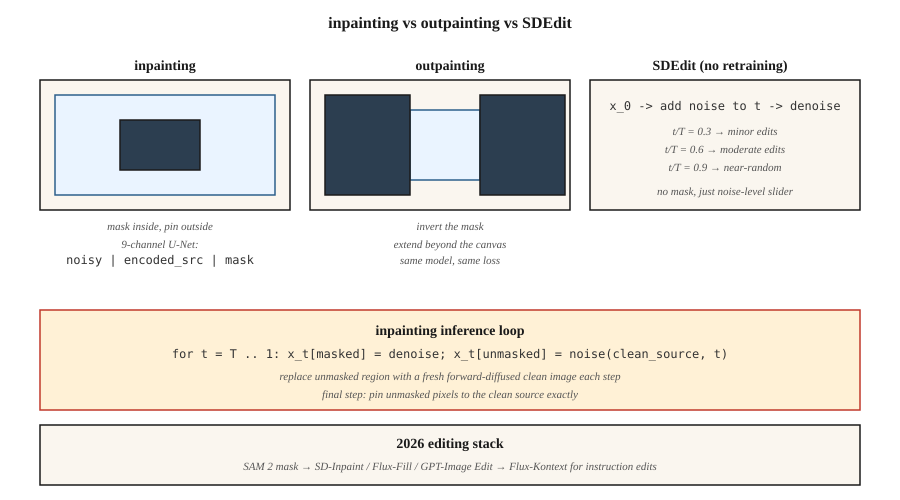

# 局部重绘、扩图与图像编辑

> 文生图造新东西,局部重绘修旧东西。生产环境里,70% 可计费的图像工作是编辑——换背景、去 logo、扩画布、重画一只手。局部重绘,是扩散模型挣饭吃的地方。

**类型:** 动手构建
**编程语言:** Python
**前置要求:** 第 8 阶段第 07 课(潜在扩散)、第 8 阶段第 08 课(ControlNet 与 LoRA)
**预计耗时:** 约 75 分钟

## 问题

客户发来一张完美的产品照片,只是背景里有块碍眼的招牌。你要抹掉招牌,其余部分逐像素保持原样。从零跑文生图是不行的——结果颜色会变、光照会变、产品角度会变。你要只重生成*掩码内*的区域,而且重生成要尊重周围上下文。

这就是局部重绘(inpainting)。变体:

- **局部重绘(Inpainting)。** 重生成掩码内部,外部像素保留。
- **扩图(Outpainting)。** 重生成掩码外部(或画布之外),内部保留。
- **图像编辑。** 整张图都重生成,但保持对原图的语义或结构保真(SDEdit、InstructPix2Pix)。

2026 年每条扩散流水线都带重绘模式:Flux.1-Fill、Stable Diffusion Inpaint、SDXL-Inpaint、DALL-E 3 Edit。原理相同。

## 概念



### 朴素做法(以及为什么不对)

跑标准文生图,带个掩码。每个采样步,把带噪潜在表示中未掩码的区域,替换成干净图像前向加噪后的版本。能跑……但效果差。边界伪影会渗出来,因为模型对掩码区域里该有什么一无所知。

### 正规的重绘模型

训练一个改造过的 U-Net,输入从 4 通道变 9 通道:

```
input = concat([ noisy_latent (4ch), encoded_image (4ch), mask (1ch) ], dim=channel)
```

多出来的通道,是 VAE 编码后的源图像副本加一个单通道掩码。训练时随机遮住图像的一些区域,训练模型只给掩码区域去噪,同时把未掩码区域作为干净的条件信号喂给它。推理时,模型能"看见"掩码周围的内容,产出连贯的补全。

SD-Inpaint、SDXL-Inpaint、Flux-Fill 都用这种 9 通道(或类似)输入。diffusers 里是 `StableDiffusionInpaintPipeline`、`FluxFillPipeline`。

### SDEdit(Meng et al., 2022)—— 免费编辑

给源图像加噪到某个中间时刻 `t`,再用新提示词从 `t` 反向走到 0。无需重训。起始 `t` 的选择,是在保真度与创作自由度之间做交易:

- `t/T = 0.3` → 与源图几乎一致,小的风格变化
- `t/T = 0.6` → 中等编辑,保住粗略结构
- `t/T = 0.9` → 从接近纯噪声生成,源图保留极少

### InstructPix2Pix(Brooks et al., 2023)

在 `(输入图像, 指令, 输出图像)` 三元组上微调扩散模型。推理时同时以输入图像和文本指令为条件("变成日落"、"加一条龙")。两个 CFG 强度:图像强度和文本强度。

### RePaint(Lugmayr et al., 2022)

保留标准的无条件扩散模型。每个反向步做重采样——偶尔跳回更噪的状态重新生成。避免边界伪影。没有训练好的重绘模型时用。

```figure
inpaint-mask-reinject
```

## 动手构建

`code/main.py` 在 5 维数据上实现玩具重绘方案。我们在 5 维混合数据上训 DDPM,每个样本是来自两簇之一的 5 个浮点数。推理时"遮住"5 维中的 2 维,每一步把未遮的 3 维以其前向加噪版本回注,只重生成被遮的维度。

### 第 1 步:5 维 DDPM 数据

```python
def sample_data(rng):
    cluster = rng.choice([0, 1])
    center = [-1.0] * 5 if cluster == 0 else [1.0] * 5
    return [c + rng.gauss(0, 0.2) for c in center], cluster
```

### 第 2 步:在全 5 维上训去噪器

标准 DDPM。网络对 5 维带噪输入,输出 5 维噪声预测。

### 第 3 步:推理时的掩码感知反向

```python
def inpaint_step(x_t, mask, clean_image, alpha_bars, t, rng):
    # replace unmasked dims with a freshly noised version of the clean source
    a_bar = alpha_bars[t]
    for i in range(len(x_t)):
        if not mask[i]:
            x_t[i] = math.sqrt(a_bar) * clean_image[i] + math.sqrt(1 - a_bar) * rng.gauss(0, 1)
    # ...then run the normal reverse step on x_t
```

这就是朴素做法,在玩具 1 维数据上能跑通。真实图像重绘用 9 通道输入,因为纹理连贯性更要紧。

### 第 4 步:扩图

扩图就是掩码取反的重绘:遮住新增的(原本不存在的)画布区域,其余填入原图。训练目标完全相同。

## 陷阱

- **接缝。** 朴素做法留下可见边界,因为梯度信息不跨掩码流动。修复:掩码膨胀 8–16 像素,或用正规重绘模型。
- **掩码泄漏。** 条件图像的未掩码区域若质量差或有噪,会污染掩码内的生成。先轻微去噪或模糊。
- **CFG 与掩码大小相互作用。** 小掩码配高 CFG = 一块饱和补丁。小编辑就降 CFG。
- **SDEdit 保真悬崖。** 从 `t/T = 0.5` 到 `t/T = 0.6`,主体身份可能就丢了。扫参数并存检查点。
- **提示词不匹配。** 提示词要描述*整张图*,不只是新内容。写"一只猫坐在椅子上",而不是"一只猫"。

## 投入使用

| 任务 | 流水线 |
|------|----------|
| 移除物体,小掩码 | SD-Inpaint 或 Flux-Fill,常规提示 |
| 换天空 | SD-Inpaint + "日落时分的蓝天" |
| 扩画布 | SDXL 扩图模式(8px 羽化)或 Flux-Fill 配扩图掩码 |
| 重画手 / 脸 | SD-Inpaint,提示词重新描述主体 + ControlNet-Openpose |
| 改局部风格 | 掩码区域上 SDEdit,`t/T=0.5` |
| "变成日落" | InstructPix2Pix 或 Flux-Kontext |
| 换背景 | SAM 出掩码 → SD-Inpaint |
| 超高保真 | 最难的情形上 Flux-Fill 或 GPT-Image(托管) |

SAM(Meta 的 Segment Anything, 2023)+ 扩散重绘,是 2026 年的背景移除流水线。SAM 2(2024)支持视频。

## 交付

保存 `outputs/skill-editing-pipeline.md`。技能输入:原图 + 编辑描述 + 可选掩码(或 SAM 提示);输出:掩码生成方案、基座模型、CFG 强度(图像 + 文本)、SDEdit-t 或重绘模式,以及 QA 清单。

## 练习

1. **易。** 在 `code/main.py` 里把被遮维度比例从 0.2 变到 0.8。比例为多少时,重绘质量(被遮维度的残差)与无条件生成持平?
2. **中。** 实现 RePaint:每第 10 个反向步,回跳 5 步(加噪)重新去噪。测量它是否降低了掩码边缘的边界残差。
3. **难。** 用 Hugging Face diffusers 对比:SD 1.5 Inpaint + ControlNet-Openpose vs Flux.1-Fill,跑 20 个脸部重画任务。分别给姿态遵循度和身份保持打分。

## 关键术语

| 术语 | 人们常说的是 | 实际含义是 |
|------|-----------------|-----------------------|
| 局部重绘 | "补洞" | 重生成掩码内部;外部像素保留。 |
| 扩图 | "扩画布" | 重生成画布之外;内部保留。 |
| 9 通道 U-Net | "正规重绘模型" | 输入为 `带噪 \| 编码源图 \| 掩码` 的 U-Net。 |
| SDEdit | "带噪声档位的 img2img" | 加噪到时刻 `t`,再用新提示去噪。 |
| InstructPix2Pix | "纯文字编辑" | 在(图像, 指令, 输出)三元组上微调的扩散模型。 |
| RePaint | "免重训" | 反向过程中周期性重新加噪,减少接缝。 |
| SAM | "分割一切" | 靠点选或框选生成掩码;与重绘搭配。 |
| Flux-Kontext | "带上下文编辑" | 接受参考图 + 指令做编辑的 Flux 变体。 |

## 生产注记:编辑流水线对延迟敏感

编辑图像的用户,期望 5 秒内拿到结果。1024² 的 30 步 SDXL-Inpaint 在 L4 上要 3–4 秒,外加 SAM 生成掩码(约 200ms)和 VAE 编解码(合计约 500ms)。按生产框架,这是 TTFT 受限而非吞吐受限的场景——批次 1、低并发、每个阶段都要抠:

- **SAM-H 是慢的那个。** 1024² 下 SAM-H 约 200ms;SAM-ViT-B 约 40ms,质量损失很小。SAM 2(视频版)有时序开销,单图编辑别用它。
- **能省编码就省。** `pipe.image_processor.preprocess(img)` 做的是到潜在表示的编码。如果你手上已有上一轮生成的潜在表示(迭代编辑 UI 里的典型情况),直接通过 `latents=...` 传入,省掉一次 VAE 编码。
- **掩码膨胀也影响吞吐。** 掩码小,意味着 U-Net 前向大部分是白跑(未掩码像素反正会被钳回去)。`diffusers` 的 `StableDiffusionInpaintPipeline` 无论掩码大小都跑完整 U-Net;只有 9 通道的正规重绘变体能利用掩码稀疏计算。
- **Flux-Kontext 是 2025 年的答案。** 对 `(源图, 指令)` 单次前向——不用单独掩码,不用 SDEdit 扫噪声档。H100 上约 1.5 秒交付一次编辑。架构上的教训:把阶段合并掉。

## 延伸阅读

- [Lugmayr et al. (2022). RePaint: Inpainting using Denoising Diffusion Probabilistic Models](https://arxiv.org/abs/2201.09865) — 免训练重绘。
- [Meng et al. (2022). SDEdit: Guided Image Synthesis and Editing with Stochastic Differential Equations](https://arxiv.org/abs/2108.01073) — SDEdit。
- [Brooks, Holynski, Efros (2023). InstructPix2Pix](https://arxiv.org/abs/2211.09800) — 文本指令编辑。
- [Kirillov et al. (2023). Segment Anything](https://arxiv.org/abs/2304.02643) — SAM,掩码来源。
- [Ravi et al. (2024). SAM 2: Segment Anything in Images and Videos](https://arxiv.org/abs/2408.00714) — 视频版 SAM。
- [Hertz et al. (2022). Prompt-to-Prompt Image Editing with Cross-Attention Control](https://arxiv.org/abs/2208.01626) — 注意力级编辑。
- [Black Forest Labs (2024). Flux.1-Fill and Flux.1-Kontext](https://blackforestlabs.ai/flux-1-tools/) — 2024 年工具。
