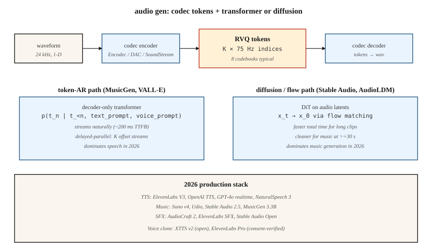

# 音频生成

> 音频是 16–48 kHz 的 1 维信号。5 秒片段就是 8 万到 24 万个采样点。没有 Transformer 能直接 attend 这么长的序列。2026 年每个生产音频模型的解法都一样:神经编解码器(Encodec、SoundStream、DAC)把音频压成 50–75 Hz 的离散 token,再由 Transformer 或扩散模型生成 token。

**类型:** 动手构建
**编程语言:** Python
**前置要求:** 第 6 阶段第 02 课(音频特征)、第 6 阶段第 04 课(ASR)、第 8 阶段第 06 课(DDPM)
**预计耗时:** 约 45 分钟

## 问题

三类音频生成任务:

1. **文本转语音(TTS)。** 给定文本,产出语音。干净语音是窄带的、有强语音结构——token Transformer 解决得很好。VALL-E(微软)、NaturalSpeech 3、ElevenLabs、OpenAI TTS。
2. **音乐生成。** 给定提示(文本、旋律、和弦进行、曲风),产出音乐。分布宽得多。MusicGen(Meta)、Stable Audio 2.5、Suno v4、Udio、Riffusion。
3. **音效 / 声音设计。** 给定提示,产出环境声或拟音(Foley)。AudioGen、AudioLDM 2、Stable Audio Open。

三者跑在同一块地基上:神经音频编解码器 + token 自回归或扩散生成器。

## 概念



### 神经音频编解码器

Encodec(Meta, 2022)、SoundStream(Google, 2021)、Descript Audio Codec(DAC, 2023)。卷积编码器把波形压成逐时间步向量;残差向量量化(RVQ)把每个向量变成 K 级码本索引的级联;解码器做逆变换。24 kHz 音频、2 kbps 码率,用 8 级 75 Hz 的 RVQ 码本 = 每秒 600 个 token。

```
waveform (16000 samples/sec)
    └─ encoder conv ─┐
                     ├─ RVQ layer 1 → indices at 75 Hz
                     ├─ RVQ layer 2 → indices at 75 Hz
                     ├─ ...
                     └─ RVQ layer 8
```

### 上面的两种生成范式

**token 自回归。** 把 RVQ token 展平成序列,跑 decoder-only Transformer。MusicGen 用"延迟并行"(delayed parallel),按逐流偏移并行发出 K 路码本流。VALL-E 从文本提示 + 3 秒语音样本生成语音 token。

**潜在扩散。** 把编解码器 token 当连续潜在表示打包,或用类别扩散建模。Stable Audio 2.5 在连续音频潜在表示上用 flow matching;AudioLDM 2 用 文本→梅尔谱→音频 的扩散。

2024–2026 年的趋势:音乐上 flow matching 正在赢(推理更快、样本更干净);语音上 token 自回归仍占主导,因为它天然因果、利于流式。

## 生产格局

| 系统 | 任务 | 骨干 | 延迟 |
|--------|------|----------|---------|
| ElevenLabs V3 | TTS | token 自回归 + 神经声码器 | 首 token 约 300ms |
| OpenAI GPT-4o audio | 全双工语音 | 端到端多模态自回归 | 约 200ms |
| NaturalSpeech 3 | TTS | 潜在 flow matching | 非流式 |
| Stable Audio 2.5 | 音乐 / 音效 | DiT + 音频潜在 flow matching | 1 分钟片段约 10s |
| Suno v4 | 完整歌曲 | 未公开;疑似 token 自回归 | 每首约 30s |
| Udio v1.5 | 完整歌曲 | 未公开 | 每首约 30s |
| MusicGen 3.3B | 音乐 | Encodec 32kHz 上 token 自回归 | 实时 |
| AudioCraft 2 | 音乐 + 音效 | flow matching | 5 秒片段约 5s |
| Riffusion v2 | 音乐 | 频谱图扩散 | 约 10s |

```figure
score-matching
```

## 动手构建

`code/main.py` 模拟核心思想:在合成的"音频 token"序列上训练一个迷你 next-token Transformer,序列由两种不同"风格"生成(风格 A:高低 token 交替;风格 B:单调递升)。以风格为条件采样。

### 第 1 步:合成音频 token

```python
def make_tokens(style, length, vocab_size, rng):
    if style == 0:  # "speech-like": alternating
        return [i % vocab_size for i in range(length)]
    # "music-like": ramp
    return [(i * 3) % vocab_size for i in range(length)]
```

### 第 2 步:训练迷你 token 预测器

一个以风格为条件的 bigram 式预测器。重点是这个模式:编解码器 token → 交叉熵训练 → 自回归采样。

### 第 3 步:条件采样

给定风格 token 和起始 token,从预测分布中采下一个 token。连续采 20–40 个。

## 陷阱

- **编解码器质量封顶输出质量。** 编解码器表示不了的声音,生成器再强也没用。DAC 是当前开放最强。
- **RVQ 误差累积。** 每级 RVQ 建模前一级的残差,第 1 级的误差会向下传。对高层用温度 0 采样有缓解。
- **音乐结构。** 75 Hz 下,30 秒 token 就是 2 万+ 个。对 Transformer 很吃力。MusicGen 用滑窗 + 提示续写;Stable Audio 用更短片段 + 交叉淡化。
- **边界伪影。** 生成片段间的交叉淡化,需要小心的重叠相加(overlap-add)。
- **对干净数据的胃口。** 音乐生成器需要数万小时授权音乐。Suno / Udio 与 RIAA 的官司(2024)把这事摆上了台面。
- **声音克隆伦理。** 3 秒样本加一段文本提示,VALL-E / XTTS / ElevenLabs 就能克隆声音。每个生产模型都需要滥用检测 + 退出名单。

## 投入使用

| 任务 | 2026 年技术栈 |
|------|------------|
| 商用 TTS | ElevenLabs、OpenAI TTS 或 Azure Neural |
| 声音克隆(已验证授权) | XTTS v2(开放)或 ElevenLabs Pro |
| 快速背景音乐 | Stable Audio 2.5 API、Suno 或 Udio |
| 带歌词的音乐 | Suno v4 或 Udio v1.5 |
| 音效 / 拟音 | AudioCraft 2、ElevenLabs SFX 或 Stable Audio Open |
| 实时语音智能体 | GPT-4o realtime 或 Gemini Live |
| 开放权重音乐研究 | MusicGen 3.3B、Stable Audio Open 1.0、AudioLDM 2 |
| 配音 / 翻译 | HeyGen、ElevenLabs Dubbing |

## 交付

保存 `outputs/skill-audio-brief.md`。技能输入:音频需求(任务、时长、风格、声音、授权);输出:模型 + 托管、提示格式(曲风标签、风格描述词、结构标记)、编解码器 + 生成器 + 声码器链路、种子协议、评估方案(MOS / CLAP 分数 / TTS 的 CER / 用户 A/B)。

## 练习

1. **易。** 跑 `code/main.py`,显式指定风格。验证生成序列符合该风格的模式。
2. **中。** 加延迟并行解码:模拟两路必须保持 1 步偏移的 token 流,训练联合预测器。
3. **难。** 用 HuggingFace transformers 在本地跑 MusicGen-small。用三个不同提示各生成 10 秒片段,A/B 对比风格遵循度。

## 关键术语

| 术语 | 人们常说的是 | 实际含义是 |
|------|-----------------|-----------------------|
| 编解码器 | "神经压缩" | 音频的编码器/解码器;典型输出 50–75 Hz token。 |
| RVQ | "残差 VQ" | K 级量化器级联;每级建模前一级的残差。 |
| Token | "一个编解码符号" | 码本中的离散索引;典型 1024 或 2048。 |
| 延迟并行 | "错位码本" | 按交错偏移发出 K 路 token 流,缩短序列长度。 |
| Flow matching | "2024 年音频的胜利" | 扩散的直线路径替代;采样更快。 |
| 声音提示 | "3 秒样本" | 驱动克隆声音的说话人嵌入或 token 前缀。 |
| 梅尔频谱图 | "那张图" | 对数幅度感知频谱图;许多 TTS 系统在用。 |
| 声码器 | "梅尔到波形" | 把梅尔频谱图还原成音频的神经组件。 |

## 生产注记:音频是流式问题

音频是唯一一种用户期望*边生成边到达*的输出模态,而不是一次性全给。按生产术语,这意味着 TPOT(每输出 token 时间)要紧,因为目标吞吐是用户的*聆听*速度,而不是阅读速度。对按约 75 token/秒分词的 16kHz 音频(Encodec),服务器必须每用户每秒生成 ≥75 个 token,播放才流畅。

两个架构推论:

- **flow matching 音频模型没法平凡地流式。** Stable Audio 2.5 和 AudioCraft 2 一次性渲染定长片段。要流式,就得把片段切块、边界重叠——滑窗扩散的思路——比编解码器 AR 模型多 100–300ms 延迟开销。

如果产品是"实时语音聊天"或"实时音乐续写",选编解码器 AR 路线;如果是"提交后渲染 30 秒片段",flow matching 在质量和总延迟上胜出。

## 延伸阅读

- [Défossez et al. (2022). Encodec: High Fidelity Neural Audio Compression](https://arxiv.org/abs/2210.13438) — 编解码器标准。
- [Zeghidour et al. (2021). SoundStream](https://arxiv.org/abs/2107.03312) — 第一个广泛使用的神经音频编解码器。
- [Kumar et al. (2023). High-Fidelity Audio Compression with Improved RVQGAN (DAC)](https://arxiv.org/abs/2306.06546) — DAC。
- [Wang et al. (2023). Neural Codec Language Models are Zero-Shot Text to Speech Synthesizers (VALL-E)](https://arxiv.org/abs/2301.02111) — VALL-E。
- [Copet et al. (2023). Simple and Controllable Music Generation (MusicGen)](https://arxiv.org/abs/2306.05284) — MusicGen。
- [Liu et al. (2023). AudioLDM 2: Learning Holistic Audio Generation with Self-supervised Pretraining](https://arxiv.org/abs/2308.05734) — AudioLDM 2。
- [Stability AI (2024). Stable Audio 2.5](https://stability.ai/news/introducing-stable-audio-2-5) — 2025 年文生音乐,flow matching。
