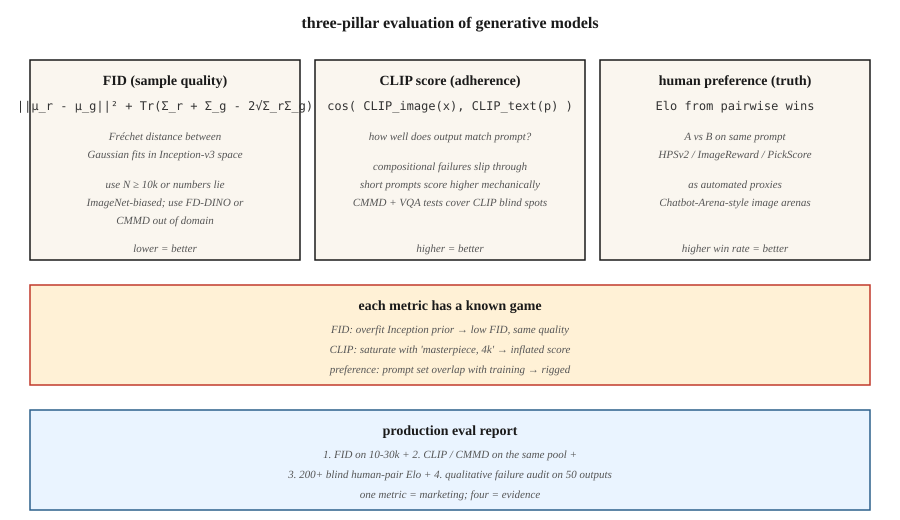

# 评估 —— FID、CLIP 分数与人类偏好

> 每个生成模型排行榜都在引用 FID、CLIP 分数和人类偏好竞技场的胜率。每个数字都有失败模式,而一个铁了心的研究者总能钻空子刷分。不懂失败模式,你就分不清真正的改进和刷分的实验。

**类型:** 动手构建
**编程语言:** Python
**前置要求:** 第 8 阶段第 01 课(分类法)、第 2 阶段第 04 课(评估指标)
**预计耗时:** 约 45 分钟

## 问题

评价生成模型看两样:*样本质量*和*条件遵循度*。两者都没有闭式度量。你的模型要渲染 1 万张图,得有个东西给它们打分,而你得跨模型家族、跨分辨率、跨架构地信任这些分数。三个指标活过了 2014–2026 年的淘汰:

- **FID(Fréchet Inception Distance)。** 真实与生成两个分布在 Inception 网络特征空间中的距离。越低越好。
- **CLIP 分数。** 生成图像的 CLIP 图像嵌入与提示词的 CLIP 文本嵌入之间的余弦相似度。越高越好。度量提示遵循度。
- **人类偏好。** 同一提示词下让两个模型正面交锋,由人类(或 GPT-4 级模型)选更好的那个,聚合成 Elo 分。

你还会见到:IS(Inception score,基本退役)、KID、CMMD、ImageReward、PickScore、HPSv2、MJHQ-30k。每一个都在修前一个的某处失败。

## 概念



### FID —— 样本质量

Heusel et al.(2017)。步骤:

1. 对 N 张真实图像和 N 张生成图像提取 Inception-v3 特征(2048 维)。
2. 各自拟合高斯:算均值 `μ_r, μ_g` 与协方差 `Σ_r, Σ_g`。
3. FID = `||μ_r - μ_g||² + Tr(Σ_r + Σ_g - 2 · (Σ_r · Σ_g)^0.5)`。

解读:特征空间中两个多元高斯之间的 Fréchet 距离。越低 = 分布越相似。

失败模式:

- **小 N 有偏。** FID 是特征分布上的均方——N 小会低估协方差,给出虚假的低 FID。永远用 N ≥ 10,000。
- **依赖 Inception。** Inception-v3 在 ImageNet 上训练。远离 ImageNet 的领域(人脸、艺术、文字图像)产出的 FID 没有意义。换领域特定的特征提取器。
- **可刷分。** 过拟合 Inception 先验,能在视觉质量没提升的情况下拿到低 FID。用 CMMD(见下)破解。

### CLIP 分数 —— 提示遵循度

Radford et al.(2021)。对一张生成图 + 提示词:

```
clip_score = cos_sim( CLIP_image(x_gen), CLIP_text(prompt) )
```

在 3 万张生成图上取平均,得到模型间可比的标量。

失败模式:

- **CLIP 自己的盲区。** CLIP 的组合推理很弱("蓝色球上的红色立方体"经常翻车)。模型可以在 CLIP 分数上排名靠前,却并不真正遵循复杂提示。
- **短提示偏好。** 短提示在真实数据里的 CLIP 图像匹配更多;长提示的 CLIP 分数机械性偏低。
- **提示刷分。** 提示里塞"high quality, 4k, masterpiece",能在不改善图文绑定的情况下抬高 CLIP 分数。

CMMD(Jayasumana et al., 2024)修掉其中一些:用 CLIP 特征替代 Inception,用最大均值差异(MMD)替代 Fréchet。对细微质量差异更敏感。

### 人类偏好 —— 真值

选一批提示词,用模型 A 和模型 B 各生成,成对展示给人类(或强 LLM 评委),把胜负聚合成 Elo 或 Bradley-Terry 分。基准:

- **PartiPrompts(Google)**:1,600 个多样提示词,12 个类别。
- **HPSv2**:10.7 万条人类标注,广泛用作自动化代理。
- **ImageReward**:13.7 万对 提示-图像 偏好对,MIT 授权。
- **PickScore**:在 Pick-a-Pic 的 260 万偏好上训练。
- **Chatbot-Arena 式图像竞技场**:https://imagearena.ai/ 等。

失败模式:

- **评委方差。** 非专家的偏好与专家不同。两类都用。
- **提示分布。** 精心挑选的提示词偏向某个家族。永远记录在案。
- **LLM 评委被奖励黑客。** GPT-4 评委会被"漂亮但不对"的输出骗过。与人类结果三角互证。

## 组合使用

一份生产评估报告应包含:

1. 对留出真实分布,在 1–3 万样本上的 FID(样本质量)。
2. 同样本对各自提示词的 CLIP 分数 / CMMD(遵循度)。
3. 盲测竞技场中对上一版模型的胜率(整体偏好)。
4. 失败模式分析:随机抽 50 个输出,按已知问题打标(手部结构、文字渲染、物体数量一致性)。

任何单一指标都是谎言。三个互证指标 + 定性评审,才算一个论断。

```figure
gx-fid-distributions
```

## 动手构建

`code/main.py` 在合成"特征向量"上实现 FID、类 CLIP 分数和 Elo 聚合(用 4 维向量充当 Inception 特征)。你会看到:

- 小 N 与大 N 下的 FID 计算——偏差显现。
- "CLIP 分数"作为特征池间的余弦相似度。
- 来自合成偏好流的 Elo 更新规则。

### 第 1 步:四行 FID

```python
def fid(real_features, gen_features):
    mu_r, cov_r = mean_and_cov(real_features)
    mu_g, cov_g = mean_and_cov(gen_features)
    mean_diff = sum((a - b) ** 2 for a, b in zip(mu_r, mu_g))
    trace_term = trace(cov_r) + trace(cov_g) - 2 * sqrt_cov_product(cov_r, cov_g)
    return mean_diff + trace_term
```

### 第 2 步:CLIP 式余弦相似度

```python
def clip_like(image_feat, text_feat):
    dot = sum(a * b for a, b in zip(image_feat, text_feat))
    norm = math.sqrt(dot_self(image_feat) * dot_self(text_feat))
    return dot / max(norm, 1e-8)
```

### 第 3 步:Elo 聚合

```python
def elo_update(r_a, r_b, winner, k=32):
    expected_a = 1 / (1 + 10 ** ((r_b - r_a) / 400))
    actual_a = 1.0 if winner == "a" else 0.0
    r_a_new = r_a + k * (actual_a - expected_a)
    r_b_new = r_b - k * (actual_a - expected_a)
    return r_a_new, r_b_new
```

## 陷阱

- **N=1000 的 FID。** N<1 万时估计不可靠。报低 N FID 的论文是在刷分。
- **跨分辨率比 FID。** Inception 的 299×299 resize 会改变特征分布。只在相同分辨率下比较。
- **只报一个种子。** 至少跑 3 个种子,报标准差。
- **靠负面提示抬 CLIP 分数。** 有些流水线靠过拟合提示词推高 CLIP。检查画面是否过饱和。
- **提示词重叠污染 Elo。** 如果两个模型训练时都见过基准提示词,Elo 就没意义。用留出提示集。
- **付费众包的人类评估偏差。** Prolific、MTurk 标注员偏年轻/偏技术圈。混入招募来的艺术/设计专家。

## 投入使用

2026 年生产评估协议:

| 支柱 | 最低配置 | 推荐配置 |
|--------|---------|-------------|
| 样本质量 | 1 万样本对留出真值的 FID | + 5 千 CMMD + 分类别子集 FID |
| 提示遵循 | 3 万 CLIP 分数 | + HPSv2 + ImageReward + VQA 式问答 |
| 偏好 | 200 对盲测对基线 | + 2000 对人类 + LLM 评委 + Chatbot Arena |
| 失败分析 | 50 个手工打标 | 500 个手工打标 + 自动安全分类器 |

四支柱齐聚一份报告 = 论断。只有一根 = 营销。

## 交付

保存 `outputs/skill-eval-report.md`。技能输入:新模型检查点 + 基线;输出:完整评估计划——样本量、指标、失败模式探针、验收标准。

## 练习

1. **易。** 跑 `code/main.py`。在同一组合成分布上,对比 N=100 与 N=1000 的 FID。报告偏差大小。
2. **中。** 用合成 CLIP 式特征实现 CMMD(公式见 Jayasumana et al., 2024)。对比它与 FID 对质量差异的敏感度。
3. **难。** 复刻 HPSv2 设置:从 Pick-a-Pic 子集取 1000 对 图-提示,在偏好上微调一个小的 CLIP 打分器,测量它与留出集的一致率。

## 关键术语

| 术语 | 人们常说的是 | 实际含义是 |
|------|-----------------|-----------------------|
| FID | "Fréchet Inception Distance" | 真实与生成 Inception 特征高斯拟合之间的 Fréchet 距离。 |
| CLIP 分数 | "图文相似度" | CLIP 图像嵌入与文本嵌入的余弦相似度。 |
| CMMD | "FID 的替代" | CLIP 特征 MMD;偏差更小,无高斯假设。 |
| IS | "Inception score" | exp KL(p(y\|x) \|\| p(y));与现代模型相关性差,已退役。 |
| HPSv2 / ImageReward / PickScore | "学出来的偏好代理" | 在人类偏好上训练的小模型;当自动评委用。 |
| Elo | "国际象棋等级分" | 成对胜负的 Bradley-Terry 聚合。 |
| PartiPrompts | "那个基准提示集" | Google 精选的 1,600 个提示词,跨 12 类。 |
| FD-DINO | "自监督替代" | 用 DINOv2 特征算 FD;更适合 ImageNet 之外的领域。 |

## 生产注记:评估本身也是推理负载

在 1 万样本上算 FID,意味着要生成 1 万张图。50 步 SDXL 基座、1024²、单张 L4,约 11 小时单请求推理。评估预算是真金白银,框架上这正是离线推理场景(吞吐最大化,无视 TTFT):

- **批次拉满,忘掉延迟。** 离线评估 = 按显存能容纳的最大尺寸做静态批处理。80GB H100 上 `pipe(...).images` 配 `num_images_per_prompt=8`,墙钟时间比单请求快 4–6 倍。
- **缓存真实特征。** 对真实参考集的 Inception(FID)或 CLIP(CLIP 分数、CMMD)特征提取*只跑一次*,存成 `.npz`。不要每次评估重算。

CI / 回归门禁:每个 PR 在 500 样本子集上跑 FID + CLIP 分数(约 30 分钟);每晚跑完整 1 万 FID + HPSv2 + Elo。

## 延伸阅读

- [Heusel et al. (2017). GANs Trained by a Two Time-Scale Update Rule Converge to a Local Nash Equilibrium (FID)](https://arxiv.org/abs/1706.08500) — FID 论文。
- [Jayasumana et al. (2024). Rethinking FID: Towards a Better Evaluation Metric for Image Generation (CMMD)](https://arxiv.org/abs/2401.09603) — CMMD。
- [Radford et al. (2021). Learning Transferable Visual Models from Natural Language Supervision (CLIP)](https://arxiv.org/abs/2103.00020) — CLIP。
- [Wu et al. (2023). HPSv2: A Comprehensive Human Preference Score](https://arxiv.org/abs/2306.09341) — HPSv2。
- [Xu et al. (2023). ImageReward: Learning and Evaluating Human Preferences for Text-to-Image Generation](https://arxiv.org/abs/2304.05977) — ImageReward。
- [Yu et al. (2023). Scaling Autoregressive Models for Content-Rich Text-to-Image Generation (Parti + PartiPrompts)](https://arxiv.org/abs/2206.10789) — PartiPrompts。
- [Stein et al. (2023). Exposing flaws of generative model evaluation metrics](https://arxiv.org/abs/2306.04675) — 失败模式综述。
