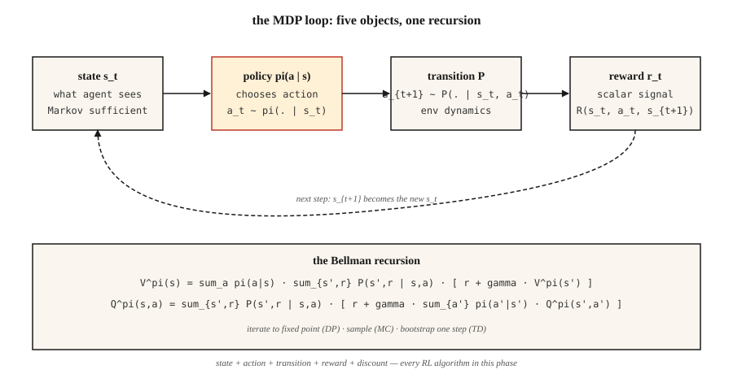

# MDP、状态、动作与奖励

> 一个马尔可夫决策过程(MDP)就是五样东西:状态、动作、转移、奖励、折扣。强化学习里的一切——Q-learning、PPO、DPO、GRPO——都是在这个结构上优化。学会它一次,整个强化学习从此畅读无阻。

**类型:** 学习
**编程语言:** Python
**前置要求:** 第 1 阶段 · 06(概率与分布)、第 2 阶段 · 01(机器学习分类学)
**预计耗时:** 约 45 分钟

## 问题

你在写一个象棋机器人,或者一个库存规划器,或者一个交易智能体,又或者训练推理模型的那段 PPO 循环。四个不同的领域,一个惊人的事实:它们全都坍缩成同一个数学对象。

监督学习给你 `(x, y)` 对,让你拟合一个函数;强化学习不给你标签——只有一条状态流、你采取的动作,和一个标量奖励。这步棋赢下这局了吗?这次补货省钱了吗?这笔交易赚钱了吗?LLM 刚吐出的这个 token,让裁判模型打出更高的分了吗?

不把这股数据流形式化,你就无法从中学习。"我看到了什么""我做了什么""接下来发生了什么""这有多好"——每一件都必须变成一个可以推理的对象。这个形式化就是马尔可夫决策过程。本阶段的每一个 RL 算法,包括末尾的 RLHF 和 GRPO 循环,都是在这个结构上优化。

## 概念



**五个对象。**

- **状态** `S`。智能体做决策所需的一切信息。GridWorld 里是格子,象棋里是棋盘,LLM 里是上下文窗口加上所有记忆。
- **动作** `A`。可做的选择。上/下/左/右移动,落一子,吐出一个 token。
- **转移** `P(s' | s, a)`。给定状态 `s` 和动作 `a`,下一状态的分布。象棋里是确定性的,库存里是随机的,LLM 解码里几乎是确定性的。
- **奖励** `R(s, a, s')`。标量信号。赢 = +1,输 = -1;营收减成本;GRPO 里的对数似然比项。
- **折扣** `γ ∈ [0, 1)`。未来奖励相对当下值多少。`γ = 0.99` 意味着约 100 步的视野;`γ = 0.9` 约 10 步。

**马尔可夫性质** `P(s_{t+1} | s_t, a_t) = P(s_{t+1} | s_0, a_0, …, s_t, a_t)`。未来只依赖当前状态。若不成立,那是状态表示不完整——不是方法的失败,是状态的失败。

**策略与回报。** 策略 `π(a | s)` 把状态映射到动作分布。回报 `G_t = r_t + γ r_{t+1} + γ² r_{t+2} + …` 是未来奖励的折扣和。价值 `V^π(s) = E[G_t | s_t = s]` 是从 `s` 出发、按策略 `π` 行事的期望回报。Q 值 `Q^π(s, a) = E[G_t | s_t = s, a_t = a]` 是先执行特定动作后的期望回报。每个 RL 算法都在估计这两者之一,然后据此改进 `π`。

**贝尔曼方程。** 本阶段一切都要用到的不动点方程:

`V^π(s) = Σ_a π(a|s) Σ_{s', r} P(s', r | s, a) [r + γ V^π(s')]`
`Q^π(s, a) = Σ_{s', r} P(s', r | s, a) [r + γ Σ_{a'} π(a'|s') Q^π(s', a')]`

它们把期望回报拆成"这一步的奖励"加上"落点价值的折扣"。递归。第 9 阶段 的每个算法,要么迭代这个方程直到收敛(动态规划),要么从中采样(蒙特卡洛),要么单步自举(时序差分)。

```figure
discount-horizon
```

## 动手构建

### 第 1 步:一个迷你的确定性 MDP

一个 4×4 GridWorld:智能体从左上出发,终点在右下,每步奖励 -1,动作 `{up, down, left, right}`。见 `code/main.py`。

```python
GRID = 4
TERMINAL = (3, 3)
ACTIONS = {"up": (-1, 0), "down": (1, 0), "left": (0, -1), "right": (0, 1)}

def step(state, action):
    if state == TERMINAL:
        return state, 0.0, True
    dr, dc = ACTIONS[action]
    r, c = state
    nr = min(max(r + dr, 0), GRID - 1)
    nc = min(max(c + dc, 0), GRID - 1)
    return (nr, nc), -1.0, (nr, nc) == TERMINAL
```

五行。这就是整个环境:确定性转移、恒定步惩罚、吸收性终止状态。

### 第 2 步:展开一个策略

策略是从状态到动作分布的函数。最简单的:均匀随机。

```python
def uniform_policy(state):
    return {a: 0.25 for a in ACTIONS}

def rollout(policy, max_steps=200):
    s, total, steps = (0, 0), 0.0, 0
    for _ in range(max_steps):
        a = sample(policy(s))
        s, r, done = step(s, a)
        total += r
        steps += 1
        if done:
            break
    return total, steps
```

把随机策略跑 1000 次:这块 4×4 棋盘的平均回报大约在 -60 到 -80。最优回报是 -6(直下再右的直线路径)。弥合这个差距,就是 第 9 阶段 的全部内容。

### 第 3 步:用贝尔曼方程精确计算 `V^π`

对小 MDP,贝尔曼方程就是一个线性方程组。枚举状态、套用期望、迭代到值不再变化。

```python
def policy_evaluation(policy, gamma=0.99, tol=1e-6):
    V = {s: 0.0 for s in all_states()}
    while True:
        delta = 0.0
        for s in all_states():
            if s == TERMINAL:
                continue
            v = 0.0
            for a, pi_a in policy(s).items():
                s_next, r, _ = step(s, a)
                v += pi_a * (r + gamma * V[s_next])
            delta = max(delta, abs(v - V[s]))
            V[s] = v
        if delta < tol:
            return V
```

这就是迭代式策略评估。它是 Sutton & Barto 书里的第一个算法,也是之后一切 RL 方法的理论地基。

### 第 4 步:`γ` 是有物理意义的超参数

有效视野约为 `1 / (1 - γ)`。`γ = 0.9` → 10 步;`γ = 0.99` → 100 步;`γ = 0.999` → 1000 步。

太低,智能体目光短浅;太高,信用分配变得嘈杂——许多早期步骤都要为遥远未来的奖励分担责任。LLM 的 RLHF 通常用 `γ = 1`,因为回合短且有界;控制任务用 `0.95–0.99`;长视野的策略游戏用 `0.999`。

## 常见坑

- **状态不满足马尔可夫性。** 如果你需要最近三帧观测才能决策,那"状态"就不只是当前观测。修法:堆帧(DQN 玩 Atari 堆 4 帧)或用循环状态(在观测上跑 LSTM/GRU)。
- **奖励稀疏。** 只有赢才有奖励,在大状态空间里几乎学不动。做奖励塑形(给中间信号),或用模仿学习先热启动(第 9 阶段 · 09)。
- **奖励黑客(reward hacking)。** 优化代理奖励,常常产出病态行为。OpenAI 的赛艇智能体不去冲线,而是原地转圈无限刷道具。永远从目标结果出发定义奖励,不要用代理指标。
- **折扣设置错误。** 无限视野任务上用 `γ = 1`,所有价值都是无穷。要么用有限视野封顶,要么 `γ < 1`。
- **奖励尺度。** {+100, -100} 与 {+1, -1} 给出相同的最优策略,梯度幅度却天差地别。接进 PPO/DQN 前,先归一化到 [-1, 1] 附近。

## 投入使用

2026 年的做法是:写任何代码之前,先把每条 RL 流水线规约成一个 MDP:

| 场景 | 状态 | 动作 | 奖励 | γ |
|-----------|-------|--------|--------|---|
| 控制(行走、抓取) | 关节角度 + 速度 | 连续力矩 | 任务特定的塑形奖励 | 0.99 |
| 游戏(象棋、围棋、扑克) | 棋盘 + 历史 | 合法着法 | 赢=+1 / 输=-1 | 1.0(有限) |
| 库存 / 定价 | 库存 + 需求 | 订货量 | 营收 − 成本 | 0.95 |
| LLM 的 RLHF | 上下文 token | 下一个 token | 末尾奖励模型打分 | 1.0(回合约 200 token) |
| 推理的 GRPO | 提示 + 部分回答 | 下一个 token | 末尾验证器 0/1 | 1.0 |

写训练循环之前,先写出这五元组。大多数"RL 不 work"的 bug 报告,追到根上都是纸面上的 MDP 建模就错了。

## 交付

保存为 `outputs/skill-mdp-modeler.md`:

```markdown
---
name: mdp-modeler
description: Given a task description, produce a Markov Decision Process spec and flag formulation risks before training.
version: 1.0.0
phase: 9
lesson: 1
tags: [rl, mdp, modeling]
---

Given a task (control / game / recommendation / LLM fine-tuning), output:

1. State. Exact feature vector or tensor spec. Justify Markov property.
2. Action. Discrete set or continuous range. Dimensionality.
3. Transition. Deterministic, stochastic-with-known-model, or sample-only.
4. Reward. Function and source. Sparse vs shaped. Terminal vs per-step.
5. Discount. Value and horizon justification.

Refuse to ship any MDP where the state is non-Markovian without explicit mention of frame-stacking or recurrent state. Refuse any reward that was not defined in terms of the target outcome. Flag any `γ ≥ 1.0` on an infinite-horizon task. Flag any reward range >100x the typical step reward as a likely gradient-explosion source.
```

## 练习

1. **易。** 在 `code/main.py` 中实现 4×4 GridWorld 和随机策略展开。跑 10,000 个回合,报告回报的均值和标准差,与最优回报(-6)对比。
2. **中。** 对均匀随机策略,分别用 `γ ∈ {0.5, 0.9, 0.99}` 运行 `policy_evaluation`,把每个 `V` 打印成 4×4 网格。解释为什么 γ 越大,靠近终点的状态值增长越快。
3. **难。** 把 GridWorld 改成随机的:每个动作以 `p = 0.1` 的概率滑向相邻方向。重新评估均匀策略。`V[start]` 变好了还是变坏了?为什么?

## 关键术语

| 术语 | 人们常说的 | 实际含义 |
|------|-----------------|-----------------------|
| MDP | "强化学习的设定" | 满足马尔可夫性质的五元组 `(S, A, P, R, γ)` |
| 状态 | "智能体看到的东西" | 在所选策略类下,足以决定未来动态的统计量 |
| 策略 | "智能体的行为" | 条件分布 `π(a \| s)`,或确定性映射 `s → a` |
| 回报 | "总奖励" | 从当前步起的折扣和 `Σ γ^t r_t` |
| 价值 | "一个状态有多好" | 从 `s` 出发、按 `π` 行事的期望回报 |
| Q 值 | "一个动作有多好" | 从 `s` 出发、先做动作 `a` 再按 `π` 行事的期望回报 |
| 贝尔曼方程 | "动态规划递归" | 把价值 / Q 值分解为单步奖励加后继折扣价值的不动点方程 |
| 折扣 `γ` | "未来 vs 当下" | 远未来奖励的几何权重;有效视野约 `1/(1-γ)` |

## 延伸阅读

- [Sutton & Barto(2018),《强化学习导论》第 2 版](http://incompleteideas.net/book/RLbook2020.pdf) —— 教科书。第 3 章讲 MDP 与贝尔曼方程;第 1 章阐述奖励假说——后续每一课的地基。
- [Bellman(1957),《Dynamic Programming》](https://press.princeton.edu/books/paperback/9780691146683/dynamic-programming) —— 贝尔曼方程的源头。
- [OpenAI Spinning Up —— 第 1 部分:关键概念](https://spinningup.openai.com/en/latest/spinningup/rl_intro.html) —— 从深度 RL 视角写的简明 MDP 入门。
- [Puterman(2005),《Markov Decision Processes》](https://onlinelibrary.wiley.com/doi/book/10.1002/9780470316887) —— 运筹学视角的 MDP 与精确求解方法参考书。
- [Littman(1996),《序贯决策算法》(博士论文)](https://www.cs.rutgers.edu/~mlittman/papers/thesis-main.pdf) —— 把 MDP 推导为动态规划特例的最干净的写法。
