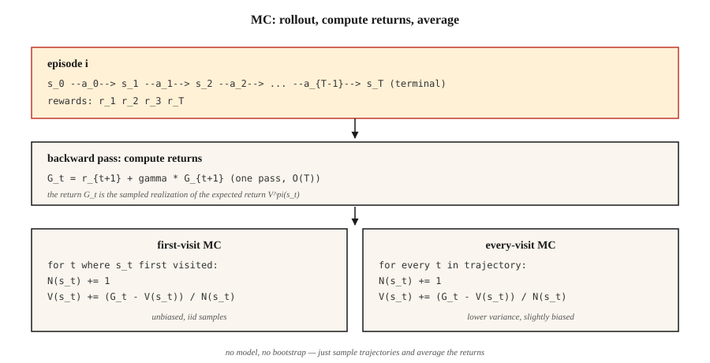

# 蒙特卡洛方法 —— 从完整回合中学习

> 动态规划需要模型,蒙特卡洛除了回合什么都不需要。跑一遍策略,看着回报,求平均。这是 RL 里最朴素的想法——也是解锁下游一切的那把钥匙。

**类型:** 动手构建
**编程语言:** Python
**前置要求:** 第 9 阶段 · 01(MDP)、第 9 阶段 · 02(动态规划)
**预计耗时:** 约 75 分钟

## 问题

动态规划很优雅,但它假设你能对每个状态和动作查询 `P(s' | s, a)`。真实世界几乎没什么是这样的:机器人无法解析地算出施加关节力矩后相机像素的分布;定价算法无法对每一种顾客反应积分;LLM 无法枚举一个 token 之后的所有可能续写。

你需要一种只要求能*采样*的方法:跑策略,得到一条轨迹 `s_0, a_0, r_1, s_1, a_1, r_2, …, s_T`,用它来估计价值。这就是蒙特卡洛。

从 DP 到 MC 的转向在哲学上很重要:我们从"已知模型 + 精确备份"走向"采样展开 + 平均回报"。方差飙升,但适用范围爆炸。本课之后的每一个 RL 算法——TD、Q-learning、REINFORCE、PPO、GRPO——骨子里都是蒙特卡洛估计器,只是有的在上面叠了自举。

## 概念



**核心思想一句话:** `V^π(s) = E_π[G_t | s_t = s] ≈ (1/N) Σ_i G^{(i)}(s)`,其中 `G^{(i)}(s)` 是按策略 `π` 访问 `s` 之后观测到的回报。

**首次访问 vs 每次访问 MC。** 一个回合多次访问状态 `s` 时,首次访问 MC 只用第一次访问后的回报,每次访问 MC 则全都用。两者在极限下都无偏:首次访问更好分析(样本独立同分布);每次访问每个回合用到更多数据,实践中通常收敛更快。

**增量式均值。** 不存所有回报,更新滑动平均:

`V_n(s) = V_{n-1}(s) + (1/n) [G_n - V_{n-1}(s)]`

改写一下:`V_new = V_old + α · (target - V_old)`,`α = 1/n`。把 `1/n` 换成常数步长 `α ∈ (0, 1)`,就得到一个能跟踪 `π` 变化的非平稳 MC 估计器。这一步,就是从 MC 到 TD、再到每个现代 RL 算法的全部跳跃。

**探索现在成了问题。** DP 靠枚举覆盖每个状态,MC 只能看到策略访问的状态。若 `π` 是确定性的,整片整片的状态空间永远采不到,它们的价值估计永远是零。三个修法,按历史顺序:

1. **探索性起点(exploring starts)。** 每个回合从随机 (s, a) 对开始。保证覆盖;现实中不现实(你没法把机器人"重置"到任意状态)。
2. **ε-greedy。** 对当前 Q 取贪心,但以 `ε` 的概率选随机动作。渐近地,所有状态-动作对都会被采到。
3. **离策略 MC。** 在行为策略 `μ` 下收数据,用重要性采样学习目标策略 `π`。方差高,但它是通往 DQN 这类回放缓冲区方法的桥。

**蒙特卡洛控制。** 评估 → 改进 → 评估,和策略迭代一样,只是评估改成了采样:

1. 跑 `π`,得到一个回合。
2. 用观测回报更新 `Q(s, a)`。
3. 让 `π` 对 `Q` 取 ε-greedy。
4. 重复。

在宽松条件下(每对都被无限次访问、`α` 满足 Robbins-Monro 条件),以概率 1 收敛到 `Q*` 和 `π*`。

```figure
epsilon-greedy
```

## 动手构建

### 第 1 步:展开 → (s, a, r) 列表

```python
def rollout(env, policy, max_steps=200):
    trajectory = []
    s = env.reset()
    for _ in range(max_steps):
        a = policy(s)
        s_next, r, done = env.step(s, a)
        trajectory.append((s, a, r))
        s = s_next
        if done:
            break
    return trajectory
```

没有模型,只有 `env.reset()` 和 `env.step(s, a)`。接口与 gym 环境相同,只是精简了。

### 第 2 步:计算回报(反向扫描)

```python
def returns_from(trajectory, gamma):
    returns = []
    G = 0.0
    for _, _, r in reversed(trajectory):
        G = r + gamma * G
        returns.append(G)
    return list(reversed(returns))
```

一趟 `O(T)`。反向递推 `G_t = r_{t+1} + γ G_{t+1}`,避免重复求和。

### 第 3 步:首次访问 MC 评估

```python
def mc_policy_evaluation(env, policy, episodes, gamma=0.99):
    V = defaultdict(float)
    counts = defaultdict(int)
    for _ in range(episodes):
        trajectory = rollout(env, policy)
        returns = returns_from(trajectory, gamma)
        seen = set()
        for t, ((s, _, _), G) in enumerate(zip(trajectory, returns)):
            if s in seen:
                continue
            seen.add(s)
            counts[s] += 1
            V[s] += (G - V[s]) / counts[s]
    return V
```

干活的就三行:首次访问时标记状态、计数加一、更新滑动均值。

### 第 4 步:ε-greedy MC 控制(在策略)

```python
def mc_control(env, episodes, gamma=0.99, epsilon=0.1):
    Q = defaultdict(lambda: {a: 0.0 for a in ACTIONS})
    counts = defaultdict(lambda: {a: 0 for a in ACTIONS})

    def policy(s):
        if random() < epsilon:
            return choice(ACTIONS)
        return max(Q[s], key=Q[s].get)

    for _ in range(episodes):
        trajectory = rollout(env, policy)
        returns = returns_from(trajectory, gamma)
        seen = set()
        for (s, a, _), G in zip(trajectory, returns):
            if (s, a) in seen:
                continue
            seen.add((s, a))
            counts[s][a] += 1
            Q[s][a] += (G - Q[s][a]) / counts[s][a]
    return Q, policy
```

### 第 5 步:与 DP 黄金标准对比

当回合数 → ∞,你对 `V^π` 的 MC 估计应与第 02 课的 DP 结果一致。实践上:4×4 GridWorld 跑 50,000 个回合,误差能进 `~0.1`。

## 常见坑

- **回合不终止。** MC 要求回合*会结束*。若策略可能永远循环,设 `max_steps` 上限,并把触顶视为隐式失败。GridWorld 配随机策略经常超时——这正常,只要计数方式正确。
- **方差。** MC 用整段回报。长回合下方差巨大——末尾一个倒霉的奖励会等幅地挪动 `V(s_0)`。TD 方法(第 04 课)用自举削掉这块方差。
- **状态覆盖。** 对带平局的新 Q 做贪心 MC,永远只会试一个动作。你*必须*探索(ε-greedy、探索性起点、UCB)。
- **策略非平稳。** 若 `π` 在变(MC 控制正是如此),旧回报来自另一个策略。常数 α 的 MC 能处理;样本平均的 MC 处理不了。
- **离策略重要性采样。** 权重 `π(a|s)/μ(a|s)` 沿轨迹连乘,方差随视野爆炸。用逐决策加权 IS 封顶,或者干脆换 TD。

## 投入使用

2026 年蒙特卡洛方法的角色:

| 用途 | 为什么用 MC |
|----------|--------|
| 短视野游戏(21 点、扑克) | 回合自然终止,回报干净 |
| 已记录策略的离线评估 | 对存储的轨迹求折扣回报的平均 |
| 蒙特卡洛树搜索(AlphaZero) | 从树叶子出发的 MC 展开指导选择 |
| LLM RL 评估 | 对给定策略的采样补全求平均奖励 |
| PPO 的基线估计 | 优势目标 `A_t = G_t - V(s_t)` 用的是 MC 的 `G_t` |
| 教 RL | 真正管用的最简算法——剥掉自举,看清核心 |

现代深度 RL 算法(PPO、SAC)通过 `n` 步回报或 GAE,在纯 MC(整段回报)与纯 TD(单步自举)之间插值。两个端点是同一估计器的两个实例。

## 交付

保存为 `outputs/skill-mc-evaluator.md`:

```markdown
---
name: mc-evaluator
description: Evaluate a policy via Monte Carlo rollouts and produce a convergence report with DP-comparison if available.
version: 1.0.0
phase: 9
lesson: 3
tags: [rl, monte-carlo, evaluation]
---

Given an environment (episodic, with reset+step API) and a policy, output:

1. Method. First-visit vs every-visit MC. Reason.
2. Episode budget. Target number, variance diagnostic, expected standard error.
3. Exploration plan. ε schedule (if needed) or exploring starts.
4. Gold-standard comparison. DP-optimal V* if tabular; otherwise a bound from a Q-learning / PPO baseline.
5. Termination check. Max-step cap, timeouts, handling of non-terminating trajectories.

Refuse to run MC on non-episodic tasks without a finite horizon cap. Refuse to report V^π estimates from fewer than 100 episodes per state for tabular tasks. Flag any policy with zero-variance actions as an exploration risk.
```

## 练习

1. **易。** 在 4×4 GridWorld 上实现均匀随机策略的首次访问 MC 评估。跑 10,000 个回合,画出 `V(0,0)` 随回合数变化的曲线,对照 DP 答案。
2. **中。** 实现 `ε ∈ {0.01, 0.1, 0.3}` 的 ε-greedy MC 控制。对比 20,000 回合后的平均回报。曲线长什么样?偏差-方差权衡落在哪?
3. **难。** 实现带重要性采样的*离策略* MC:在均匀随机策略 `μ` 下收数据,估计确定性最优策略 `π` 的 `V^π`。对比朴素 IS、逐决策 IS、加权 IS。哪个方差最低?

## 关键术语

| 术语 | 人们常说的 | 实际含义 |
|------|-----------------|-----------------------|
| 蒙特卡洛 | "随机采样" | 对来自分布的独立同分布样本求平均,以估计期望 |
| 回报 `G_t` | "未来奖励" | 从第 `t` 步到回合结束的折扣奖励和:`Σ_{k≥0} γ^k r_{t+k+1}` |
| 首次访问 MC | "每个状态只数一次" | 一个回合里只有第一次访问计入价值估计 |
| 每次访问 MC | "每次访问都算" | 每次访问都计入;略有偏但样本效率更高 |
| ε-greedy | "探索噪声" | 以 `1-ε` 概率选贪心动作,以 `ε` 概率随机选 |
| 重要性采样 | "纠正采错分布" | 用 `π(a\|s)/μ(a\|s)` 的连乘积对回报加权,从 `μ` 的数据估计 `V^π` |
| 在策略 | "用自己的数据学" | 目标策略 = 行为策略。朴素 MC、PPO、SARSA |
| 离策略 | "用别人的数据学" | 目标策略 ≠ 行为策略。重要性采样 MC、Q-learning、DQN |

## 延伸阅读

- [Sutton & Barto(2018),第 5 章 —— 蒙特卡洛方法](http://incompleteideas.net/book/RLbook2020.pdf) —— 经典讲解。
- [Singh & Sutton(1996),《带替换资格迹的强化学习》](https://link.springer.com/article/10.1007/BF00114726) —— 首次访问 vs 每次访问的分析。
- [Precup、Sutton、Singh(2000),《离策略策略评估的资格迹》](http://incompleteideas.net/papers/PSS-00.pdf) —— 离策略 MC 与方差控制。
- [Mahmood 等(2014),《离策略学习的加权重要性采样》](https://arxiv.org/abs/1404.6362) —— 现代低方差 IS 估计器。
- [Tesauro(1995),《TD-Gammon:一个自我教学的双陆棋程序》](https://dl.acm.org/doi/10.1145/203330.203343) —— 首次大规模实证 MC/TD 自我对弈收敛到超人水平;本阶段后半程每一课的思想先声。
