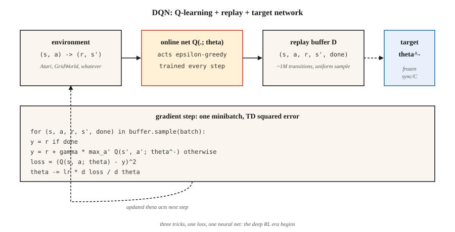

# 深度 Q 网络(DQN)

> 2013 年:Mnih 用一个 Q-learning 网络直接从原始像素学起,在 7 款 Atari 游戏上击败所有经典 RL 智能体;2015 年:扩展到 49 款游戏,登上 Nature,点燃深度 RL 时代。DQN 就是 Q-learning 加三个让函数逼近稳定下来的技巧。

**类型:** 动手构建
**编程语言:** Python
**前置要求:** 第 3 阶段 · 03(反向传播)、第 9 阶段 · 04(Q-learning、SARSA)
**预计耗时:** 约 75 分钟

## 问题

表格 Q-learning 要为每个(状态, 动作)对存一个 Q 值。棋盘有约 10⁴³ 种状态,一帧 Atari 画面是 210×160×3 = 100,800 个特征。表格 RL 在几千个状态时就死了,遑论几十亿。

事后看,解法显而易见:用神经网络换掉 Q 表,`Q(s, a; θ)`。但这个"事后显而易见"花了几十年。朴素的函数逼近配 Q-learning 会发散——这就是"致命三合一":函数逼近 + 自举 + 离策略学习。Mnih 等(2013、2015)找到三个让训练稳定下来的工程技巧:

1. **经验回放(experience replay)** 去除转移之间的相关性。
2. **目标网络(target network)** 冻结自举目标。
3. **奖励截断(reward clipping)** 归一化梯度幅度。

Atari 上的 DQN,第一次让同一套架构、同一组超参数,从原始像素出发解决了几十个控制问题。此后一切"深度 RL"——DDQN、Rainbow、Dueling、Distributional、R2D2、Agent57——都叠在这三个技巧的基座上。

## 概念



**目标。** DQN 在神经 Q 函数上最小化单步 TD 损失:

`L(θ) = E_{(s,a,r,s')~D} [ (r + γ max_{a'} Q(s', a'; θ^-) - Q(s, a; θ))² ]`

`θ` = 在线网络,每步做梯度下降;`θ^-` = 目标网络,定期从 `θ` 拷贝(约每 10,000 步);`D` = 历史转移的回放缓冲区。

**三个技巧,按重要性排序:**

**经验回放。** 一个约 10⁶ 条转移的环形缓冲区,每个训练步均匀随机采一个小批量。它打破时间相关性(相邻帧几乎一模一样),让网络能从稀有的高奖励转移里反复学习,还去相关了相邻的梯度更新。没有它,神经网络的在策略 TD 在 Atari 上会发散。

**目标网络。** 在贝尔曼方程两边都用同一个网络 `Q(·; θ)`,目标每次更新都在动——"追自己的尾巴"。修法:留第二个网络 `Q(·; θ^-)`,权重冻结,每 `C` 步把 `θ → θ^-` 拷贝一次。这让回归目标一次稳定几千个梯度步。软更新 `θ^- ← τ θ + (1-τ) θ^-`(DDPG、SAC 在用)是更平滑的变体。

**奖励截断。** Atari 各游戏的奖励幅度从 1 到 1000+ 不等,截断到 `{-1, 0, +1}` 防止任何单个游戏主导梯度。当奖励幅度本身重要时这是错的;但 Atari 上只有符号要紧,所以没问题。

**Double DQN。** Hasselt(2016)修复最大化偏差:用在线网络*选*动作,用目标网络*估*动作。

`target = r + γ Q(s', argmax_{a'} Q(s', a'; θ); θ^-)`

即插即用的替换,稳定地更好。默认就该用它。

**其他改进(Rainbow,2017):** 优先回放(多采 TD 误差大的转移)、dueling 架构(分开的 `V(s)` 头与优势头)、噪声网络(学习型探索)、n 步回报、分布式 Q(C51/QR-DQN)、多步自举。每项提升几个百分点,收益大致可加。

```figure
f3-dqn-stability
```

## 动手构建

这里的代码只用标准库、不用 numpy——我们用一个手写的单隐层 MLP 跑一个迷你的连续 GridWorld,每个训练步只要几微秒。算法与 Atari 规模的 DQN 一模一样。

### 第 1 步:回放缓冲区

```python
class ReplayBuffer:
    def __init__(self, capacity):
        self.buf = []
        self.capacity = capacity
    def push(self, s, a, r, s_next, done):
        if len(self.buf) == self.capacity:
            self.buf.pop(0)
        self.buf.append((s, a, r, s_next, done))
    def sample(self, batch, rng):
        return rng.sample(self.buf, batch)
```

Atari 用约 50,000 容量;我们的玩具环境 5,000 就够。

### 第 2 步:迷你 Q 网络(手写 MLP)

```python
class QNet:
    def __init__(self, n_in, n_hidden, n_actions, rng):
        self.W1 = [[rng.gauss(0, 0.3) for _ in range(n_in)] for _ in range(n_hidden)]
        self.b1 = [0.0] * n_hidden
        self.W2 = [[rng.gauss(0, 0.3) for _ in range(n_hidden)] for _ in range(n_actions)]
        self.b2 = [0.0] * n_actions
    def forward(self, x):
        h = [max(0.0, sum(w * xi for w, xi in zip(row, x)) + b) for row, b in zip(self.W1, self.b1)]
        q = [sum(w * hi for w, hi in zip(row, h)) + b for row, b in zip(self.W2, self.b2)]
        return q, h
```

前向传播:线性 → ReLU → 线性。整个网络就这些。

### 第 3 步:DQN 更新

```python
def train_step(online, target, batch, gamma, lr):
    grads = zeros_like(online)
    for s, a, r, s_next, done in batch:
        q, h = online.forward(s)
        if done:
            y = r
        else:
            q_next, _ = target.forward(s_next)
            y = r + gamma * max(q_next)
        td_error = q[a] - y
        accumulate_grads(grads, online, s, h, a, td_error)
    apply_sgd(online, grads, lr / len(batch))
```

形态与第 04 课的 Q-learning 相同,两处区别:(a) 对可微的 `Q(·; θ)` 做反向传播,而不是索引一张表;(b) 目标用 `Q(·; θ^-)`。

### 第 4 步:外层循环

每个回合:按 `Q(·; θ)` 做 ε-greedy 动作,把转移推入缓冲区,采一个小批量,走一步梯度,定期同步 `θ^- ← θ`。模式如下:

```python
for episode in range(N):
    s = env.reset()
    while not done:
        a = epsilon_greedy(online, s, epsilon)
        s_next, r, done = env.step(s, a)
        buffer.push(s, a, r, s_next, done)
        if len(buffer) >= batch:
            train_step(online, target, buffer.sample(batch), gamma, lr)
        if steps % sync_every == 0:
            target = copy(online)
        s = s_next
```

在我们这个 16 维 one-hot 状态的迷你 GridWorld 上,智能体约 500 回合就能学到近最优策略。放到 Atari 上,就是扩到 2 亿帧、再加一个 CNN 特征提取器。

## 常见坑

- **致命三合一。** 函数逼近 + 离策略 + 自举可能发散。DQN 靠目标网络 + 回放缓解,一个都不能少。
- **探索。** ε 必须衰减,通常在训练前 ~10% 里从 1.0 降到 0.01。早期探索不够,Q 网络会收敛到局部盆地。
- **高估。** 对有噪的 Q 取 `max` 向上偏。生产环境一律用 Double DQN。
- **奖励尺度。** 截断或归一化奖励;梯度幅度与奖励幅度成正比。
- **回放缓冲区冷启动。** 缓冲区攒到几千条转移之前不要开训——只有 ~20 条样本时的早期梯度会过拟合。
- **目标同步频率。** 太频繁 ≈ 没有目标网络;太少 ≈ 目标陈旧。Atari DQN 用 10,000 环境步。经验法则:每约 1/100 训练周期同步一次。
- **观测预处理。** Atari DQN 堆 4 帧让状态满足马尔可夫性。任何带速度信息的环境都需要堆帧或循环状态。

## 投入使用

2026 年,DQN 很少是 SOTA,但仍是离策略算法的参照系:

| 任务 | 首选方法 | 为什么不用 DQN? |
|------|------------------|--------------|
| 离散动作的类 Atari 任务 | Rainbow DQN 或 Muesli | 同一框架,更多技巧 |
| 连续控制 | SAC / TD3(第 9 阶段 · 07) | DQN 没有策略网络 |
| 在策略 / 高吞吐 | PPO(第 9 阶段 · 08) | 无回放缓冲,更容易扩展 |
| 离线 RL | CQL / IQL / Decision Transformer | 保守 Q 目标,无自举爆炸 |
| 大离散动作空间(推荐系统) | 带动作嵌入的 DQN,或 IMPALA | 可以用;讲究的是装修 |
| LLM RL | PPO / GRPO | 序列级而非步骤级;损失不同 |

经验依然通用:回放和目标网络出现在 SAC、TD3、DDPG、SAC-X、AlphaZero 的自我对弈缓冲区、以及每个离线 RL 方法里;奖励截断以 PPO 中优势归一化的形态活着。这套架构就是蓝图。

## 交付

保存为 `outputs/skill-dqn-trainer.md`:

```markdown
---
name: dqn-trainer
description: Produce a DQN training config (buffer, target sync, ε schedule, reward clipping) for a discrete-action RL task.
version: 1.0.0
phase: 9
lesson: 5
tags: [rl, dqn, deep-rl]
---

Given a discrete-action environment (observation shape, action count, horizon, reward scale), output:

1. Network. Architecture (MLP / CNN / Transformer), feature dim, depth.
2. Replay buffer. Capacity, minibatch size, warmup size.
3. Target network. Sync strategy (hard every C steps or soft τ).
4. Exploration. ε start / end / schedule length.
5. Loss. Huber vs MSE, gradient clip value, reward clipping rule.
6. Double DQN. On by default unless explicit reason to disable.

Refuse to ship a DQN with no target network, no replay buffer, or ε held at 1. Refuse continuous-action tasks (route to SAC / TD3). Flag any reward range > 10× per-step mean as needing clipping or scale normalization.
```

## 练习

1. **易。** 运行 `code/main.py`,画出逐回合回报曲线。多少回合后滑动均值超过 -10?
2. **中。** 禁用目标网络(贝尔曼目标两侧都用在线网络)。测量训练不稳定性——回报会震荡还是发散?
3. **难。** 加上 Double DQN:在线网络选 `argmax a'`,目标网络估值。在带噪奖励的 GridWorld 上,对比有无 Double DQN 时 1,000 回合后 `Q(s_0, best_a)` 相对真实 `V*(s_0)` 的偏差。

## 关键术语

| 术语 | 人们常说的 | 实际含义 |
|------|-----------------|-----------------------|
| DQN | "深度 Q-learning" | 用神经 Q 函数、回放缓冲区和目标网络的 Q-learning |
| 经验回放 | "打乱的转移" | 环形缓冲区,每个梯度步均匀采样;去除数据相关性 |
| 目标网络 | "冻结的自举" | 周期性拷贝的 Q,用于贝尔曼目标;稳定训练 |
| 致命三合一 | "RL 为什么会发散" | 函数逼近 + 自举 + 离策略 = 没有收敛保证 |
| Double DQN | "最大化偏差的修复" | 在线网络选动作,目标网络评估动作 |
| Dueling DQN | "V 头与 A 头" | 分解 Q = V + A − mean(A);输出相同,梯度流更好 |
| Rainbow | "所有技巧打包" | DDQN + PER + dueling + n 步 + 噪声网络 + 分布式 Q 合一 |
| PER | "优先回放" | 按 TD 误差大小成比例地采样转移 |

## 延伸阅读

- [Mnih 等(2013),《用深度强化学习玩 Atari》](https://arxiv.org/abs/1312.5602) —— 点燃深度 RL 的 2013 NeurIPS workshop 论文。
- [Mnih 等(2015),《通过深度强化学习达到人类水平控制》](https://www.nature.com/articles/nature14236) —— Nature 论文,49 游戏 DQN。
- [Hasselt、Guez、Silver(2016),《用 Double Q-learning 做深度强化学习》](https://arxiv.org/abs/1509.06461) —— DDQN。
- [Wang 等(2016),《Dueling 网络架构》](https://arxiv.org/abs/1511.06581) —— dueling DQN。
- [Hessel 等(2018),《Rainbow:组合深度 RL 的各项改进》](https://arxiv.org/abs/1710.02298) —— 技巧叠加论文。
- [OpenAI Spinning Up —— DQN](https://spinningup.openai.com/en/latest/algorithms/dqn.html) —— 清晰的现代讲解。
- [Sutton & Barto(2018),第 9 章 —— 带逼近的在策略预测](http://incompleteideas.net/book/RLbook2020.pdf) —— 教科书对"致命三合一"(函数逼近 + 自举 + 离策略)的处理,DQN 的目标网络和回放缓冲区正是为驯服它而设计。
- [CleanRL 的 DQN 实现](https://docs.cleanrl.dev/rl-algorithms/dqn/) —— 消融研究常用的单文件参考实现;适合与本课的从零版本对照阅读。
