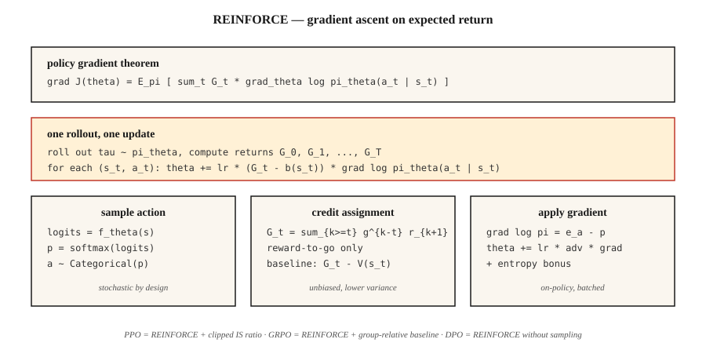

# 策略梯度 —— 从零实现 REINFORCE

> 别再估计价值了:直接参数化策略,算出期望回报的梯度,向上爬。Williams(1992)用一个定理写完它。PPO、GRPO 和每一个 LLM RL 循环之所以存在,都是因为它。

**类型:** 动手构建
**编程语言:** Python
**前置要求:** 第 3 阶段 · 03(反向传播)、第 9 阶段 · 03(蒙特卡洛)、第 9 阶段 · 04(TD 学习)
**预计耗时:** 约 75 分钟

## 问题

Q-learning 和 DQN 参数化的是*价值*函数,你靠 `argmax Q` 选动作。离散动作、离散状态时这没问题;动作连续时(10 维力矩上怎么取 `argmax`?)或者你想要随机策略时(`argmax` 构造上就是确定性的),它就垮了。

策略梯度改为参数化*策略*:`π_θ(a | s)` 是一个输出动作分布的神经网络,从中采样来行动,计算期望回报对 `θ` 的梯度,向上爬。没有 `argmax`,没有贝尔曼递归,只是对 `J(θ) = E_{π_θ}[G]` 做梯度上升。

REINFORCE 定理(Williams 1992)告诉你这个梯度是可算的:`∇J(θ) = E_π[ G · ∇_θ log π_θ(a | s) ]`。跑一个回合,算回报,每一步乘上 `∇ log π_θ(a | s)`,求平均,梯度上升。完事。

2026 年每一个 LLM-RL 算法——PPO、DPO、GRPO——都是 REINFORCE 的改良。把它练到指尖有感觉,是本阶段余下课程、以及 第 10 阶段 · 07(RLHF 实现)和 第 10 阶段 · 08(DPO)的先决条件。

## 概念



**策略梯度定理。** 对任何以 `θ` 参数化的策略 `π_θ`:

`∇J(θ) = E_{τ ~ π_θ}[ Σ_{t=0}^{T} G_t · ∇_θ log π_θ(a_t | s_t) ]`

其中 `G_t = Σ_{k=t}^{T} γ^{k-t} r_{k+1}` 是从第 `t` 步起的折扣回报,期望取自 `π_θ` 采出的完整轨迹 `τ`。

**证明很短。** 在期望号下对 `J(θ) = Σ_τ P(τ; θ) G(τ)` 求导,用 `∇P(τ; θ) = P(τ; θ) ∇ log P(τ; θ)`(对数导数技巧),把 `log P(τ; θ) = Σ log π_θ(a_t | s_t) + 不依赖 θ 的环境项` 拆开,环境项消失。两行代数,定理到手。

**降方差技巧。** 朴素 REINFORCE 的方差大得吓人——回报有噪声,`∇ log π` 有噪声,两者乘积噪声更大。两个标准修法:

1. **基线相减。** 把 `G_t` 换成 `G_t - b(s_t)`,其中 `b(s_t)` 是任何不依赖 `a_t` 的基线。无偏,因为 `E[b(s_t) · ∇ log π(a_t | s_t)] = 0`。典型选择:`b(s_t) = V̂(s_t)`,由 critic 学出——这就是 actor-critic(第 07 课)。
2. **此后回报(reward-to-go)。** 把 `Σ_t G_t · ∇ log π_θ(a_t | s_t)` 换成 `Σ_t G_t^{from t} · ∇ log π_θ(a_t | s_t)`。一个动作只对未来回报负责——过去的奖励只贡献零均值噪声。

两者合体:

`∇J ≈ (1/N) Σ_{i=1}^{N} Σ_{t=0}^{T_i} [ G_t^{(i)} - V̂(s_t^{(i)}) ] · ∇_θ log π_θ(a_t^{(i)} | s_t^{(i)})`

这就是带基线的 REINFORCE——A2C(第 07 课)和 PPO(第 08 课)的直系祖先。

**softmax 策略参数化。** 离散动作的标准选择:

`π_θ(a | s) = exp(f_θ(s, a)) / Σ_{a'} exp(f_θ(s, a'))`

其中 `f_θ` 是任意为每个动作输出一个分数的神经网络。梯度形式干净:

`∇_θ log π_θ(a | s) = ∇_θ f_θ(s, a) - Σ_{a'} π_θ(a' | s) ∇_θ f_θ(s, a')`

即:所选动作的分数,减去它在策略下的期望。

**连续动作用高斯策略。** `π_θ(a | s) = N(μ_θ(s), σ_θ(s))`,`∇ log N(a; μ, σ)` 有闭式解。这就是 第 9 阶段 · 07 的 SAC 所需的全部。

```figure
policy-gradient-landscape
```

## 动手构建

### 第 1 步:softmax 策略网络

```python
def policy_logits(theta, state_features):
    return [dot(theta[a], state_features) for a in range(N_ACTIONS)]

def softmax(logits):
    m = max(logits)
    exps = [exp(l - m) for l in logits]
    Z = sum(exps)
    return [e / Z for e in exps]
```

表格环境用线性策略(每个动作一个权重向量)。Atari 就换成 CNN,softmax 头保留。

### 第 2 步:采样与对数概率

```python
def sample_action(probs, rng):
    x = rng.random()
    cum = 0
    for a, p in enumerate(probs):
        cum += p
        if x <= cum:
            return a
    return len(probs) - 1

def log_prob(probs, a):
    return log(probs[a] + 1e-12)
```

### 第 3 步:带回对数概率的展开

```python
def rollout(theta, env, rng, gamma):
    trajectory = []
    s = env.reset()
    while not done:
        logits = policy_logits(theta, s)
        probs = softmax(logits)
        a = sample_action(probs, rng)
        s_next, r, done = env.step(s, a)
        trajectory.append((s, a, r, probs))
        s = s_next
    return trajectory
```

### 第 4 步:REINFORCE 更新

```python
def reinforce_step(theta, trajectory, gamma, lr, baseline=0.0):
    returns = compute_returns(trajectory, gamma)
    for (s, a, _, probs), G in zip(trajectory, returns):
        advantage = G - baseline
        grad_log_pi_a = [-p for p in probs]
        grad_log_pi_a[a] += 1.0
        for i in range(N_ACTIONS):
            for j in range(len(s)):
                theta[i][j] += lr * advantage * grad_log_pi_a[i] * s[j]
```

梯度 `∇ log π(a|s) = e_a - π(·|s)`(`a` 的 one-hot 减去概率)是 softmax 策略梯度的心脏,把它烙进肌肉记忆。

### 第 5 步:基线

用近期回合 `G` 的滑动均值当基线,就足以让 4×4 GridWorld 跑起来——约 500 回合收敛。把基线升级成学习出的 `V̂(s)`,你就得到了 actor-critic。

## 常见坑

- **梯度爆炸。** 回报可能巨大。乘 `∇ log π` 之前,永远先把批内 `G` 归一化到约 `N(0, 1)`。
- **熵坍缩。** 策略过早收敛到近确定性动作,停止探索,卡死。修法:目标里加熵奖励 `β · H(π(·|s))`。
- **高方差。** 朴素 REINFORCE 需要数千回合。critic 基线(第 07 课)或 TRPO/PPO 的信任域(第 08 课)是标准解法。
- **样本低效。** 在策略意味着每条转移用一次就扔。用重要性采样做离策略修正能把数据捡回来,代价是方差(PPO 的比率就是截断过的 IS 权重)。
- **梯度非平稳。** 100 个回合前算出的梯度用的是旧 `π`。在策略方法每隔几次展开就更新,正是为此。
- **信用分配。** 不用 reward-to-go,过去的奖励就贡献噪声。永远用 reward-to-go。

## 投入使用

2026 年,REINFORCE 很少直接上场,但它的梯度公式无处不在:

| 用途 | 衍生方法 |
|----------|---------------|
| 连续控制 | 高斯策略的 PPO / SAC |
| LLM RLHF | 带 KL 惩罚的 PPO,跑在 token 级策略上 |
| LLM 推理(DeepSeek) | GRPO —— 用组内相对基线的 REINFORCE,无 critic |
| 多智能体 | 集中式 critic 的 REINFORCE(MADDPG、COMA) |
| 离散动作机器人 | A2C、A3C、PPO |
| 只有偏好的场景 | DPO —— 把 REINFORCE 改写成偏好似然损失,无需采样 |

当你在 2026 年的训练脚本里读到 `loss = -advantage * log_prob`,那就是带基线的 REINFORCE。整篇整篇的论文(DPO、GRPO、RLOO)都是在这一行之上做方差削减。

## 交付

保存为 `outputs/skill-policy-gradient-trainer.md`:

```markdown
---
name: policy-gradient-trainer
description: Produce a REINFORCE / actor-critic / PPO training config for a given task and diagnose variance issues.
version: 1.0.0
phase: 9
lesson: 6
tags: [rl, policy-gradient, reinforce]
---

Given an environment (discrete / continuous actions, horizon, reward stats), output:

1. Policy head. Softmax (discrete) or Gaussian (continuous) with parameter counts.
2. Baseline. None (vanilla), running mean, learned `V̂(s)`, or A2C critic.
3. Variance controls. Reward-to-go on by default, return normalization, gradient clip value.
4. Entropy bonus. Coefficient β and decay schedule.
5. Batch size. Episodes per update; on-policy data freshness contract.

Refuse REINFORCE-no-baseline on horizons > 500 steps. Refuse continuous-action control with a softmax head. Flag any run with `β = 0` and observed policy entropy < 0.1 as entropy-collapsed.
```

## 练习

1. **易。** 在 4×4 GridWorld 上用线性 softmax 策略实现 REINFORCE,不带基线训 1,000 回合。画学习曲线,测方差(回报的标准差)。
2. **中。** 加滑动均值基线,再训。与朴素版对比样本效率和方差。基线把收敛所需步数降了多少?
3. **难。** 加熵奖励 `β · H(π)`,扫 `β ∈ {0, 0.01, 0.1, 1.0}`。画最终回报与策略熵。这个任务上的甜点位在哪?

## 关键术语

| 术语 | 人们常说的 | 实际含义 |
|------|-----------------|-----------------------|
| 策略梯度 | "直接训策略" | `∇J(θ) = E[G · ∇ log π_θ(a\|s)]`;由对数导数技巧推出 |
| REINFORCE | "最早的 PG 算法" | Williams(1992);蒙特卡洛回报乘对数策略梯度 |
| 对数导数技巧 | "得分函数估计器" | `∇P(τ;θ) = P(τ;θ) · ∇ log P(τ;θ)`;让期望的梯度变得可算 |
| 基线 | "降方差" | 从 `G` 中减去的任意 `b(s)`;无偏,因为 `E[b · ∇ log π] = 0` |
| 此后回报 | "只有未来回报算数" | 用 `G_t^{from t}` 而非整段 `G_0`;正确且方差更低 |
| 熵奖励 | "鼓励探索" | `+β · H(π(·\|s))` 项防止策略坍缩 |
| 在策略 | "用刚看到的数据训练" | 梯度期望相对当前策略而取——旧数据不能直接用 |
| 优势 | "比平均好多少" | `A(s, a) = G(s, a) - V(s)`;带基线 REINFORCE 乘上的那个带符号的量 |

## 延伸阅读

- [Williams(1992),《用于联结主义强化学习的简单统计梯度跟踪算法》](https://link.springer.com/article/10.1007/BF00992696) —— REINFORCE 原始论文。
- [Sutton 等(2000),《带函数逼近的强化学习策略梯度方法》](https://papers.nips.cc/paper_files/1999/hash/464d828b85b0bed98e80ade0a5c43b0f-Abstract.html) —— 函数逼近版的现代策略梯度定理。
- [Sutton & Barto(2018),第 13 章 —— 策略梯度方法](http://incompleteideas.net/book/RLbook2020.pdf) —— 教科书讲解。
- [OpenAI Spinning Up —— VPG / REINFORCE](https://spinningup.openai.com/en/latest/algorithms/vpg.html) —— 清晰的教学讲解,附 PyTorch 代码。
- [Peters & Schaal(2008),《用策略梯度学习运动技能》](https://homes.cs.washington.edu/~todorov/courses/amath579/reading/PolicyGradient.pdf) —— 方差削减与自然梯度视角,把 REINFORCE 连接到信任域家族(TRPO、PPO)。
