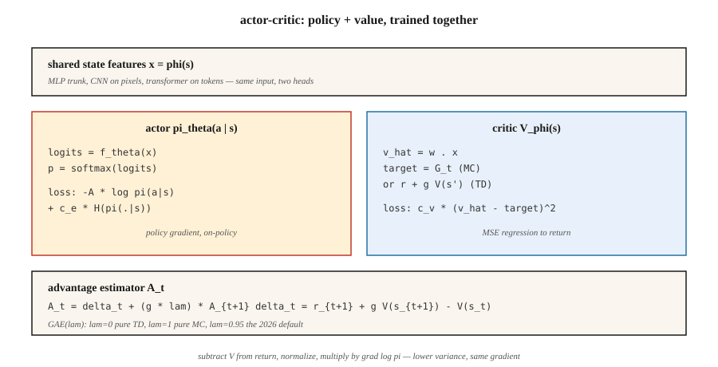

# Actor-Critic —— A2C 与 A3C

> REINFORCE 噪声太大。加一个学 `V̂(s)` 的 critic,从回报里减掉它,得到的"优势"期望不变、方差大降。这就是 actor-critic。A2C 同步地跑,A3C 跨线程地跑。两者是每个现代深度 RL 方法的心智模型。

**类型:** 动手构建
**编程语言:** Python
**前置要求:** 第 9 阶段 · 04(TD 学习)、第 9 阶段 · 06(REINFORCE)
**预计耗时:** 约 75 分钟

## 问题

朴素 REINFORCE 能用,但方差惨不忍睹。蒙特卡洛回报 `G_t` 在回合之间能摆动 10 倍,把这种噪声乘上 `∇ log π` 再求平均,得到的梯度估计器要几千个回合才能把策略推动一点点——同样的距离,DQN 用少得多的更新就能走到。

方差来自用了原始回报。减一个基线 `b(s_t)`——任何状态的函数,包括学出来的价值——期望不变,方差下降。最好的可算基线是 `V̂(s_t)`。此时乘在 `∇ log π` 上的量就是*优势*:

`A(s, a) = G - V̂(s)`

动作高于平均回报就是好,低于就是坏。带学习 critic 的 REINFORCE 就是 *actor-critic*:critic 给 actor 当了一个低方差的老师。2015 年之后每一个深度策略方法(A2C、A3C、PPO、SAC、IMPALA)都是它。

## 概念



**两个网络,一个联合损失:**

- **Actor** `π_θ(a | s)`:策略,采样来行动,用策略梯度训练。
- **Critic** `V_φ(s)`:估计状态的期望回报,以最小化 `(V_φ(s) - target)²` 训练。

**优势。** 两种标准形式:

- *MC 优势:* `A_t = G_t - V_φ(s_t)`。无偏,方差较高。
- *TD 优势:* `A_t = r_{t+1} + γ V_φ(s_{t+1}) - V_φ(s_t)`。有偏(用了 `V_φ`),方差低得多。也叫 *TD 残差* `δ_t`。

**n 步优势。** 在两者之间插值:

`A_t^{(n)} = r_{t+1} + γ r_{t+2} + … + γ^{n-1} r_{t+n} + γ^n V_φ(s_{t+n}) - V_φ(s_t)`

`n = 1` 是纯 TD,`n = ∞` 是 MC。大多数实现 Atari 用 `n = 5`,PPO 在 MuJoCo 上用 `n = 2048`。

**广义优势估计(GAE)。** Schulman 等(2016)提出对所有 n 步优势做指数加权平均:

`A_t^{GAE} = Σ_{l=0}^{∞} (γλ)^l δ_{t+l}`

`λ ∈ [0, 1]`。`λ = 0` 是 TD(低方差,高偏差),`λ = 1` 是 MC(高方差,无偏)。`λ = 0.95` 是 2026 年的默认值——拧到你想要的偏差/方差位置。

**A2C:同步优势 actor-critic。** 在 `N` 个并行环境上各采 `T` 步,算每步优势,在合并批次上更新 actor 和 critic,重复。比 A3C 更简单、更好扩展的兄弟。

**A3C:异步优势 actor-critic。** Mnih 等(2016)。开 `N` 个 worker 线程,各跑一个环境;每个 worker 在自己的展开上本地算梯度,再异步施加到共享参数服务器。不需要回放缓冲区——worker 跑不同轨迹,天然去相关。A3C 证明了在 CPU 上也能大规模训练。2026 年,基于 GPU 的 A2C(批量并行环境)占主导,因为 GPU 喜欢大批量。

**联合损失。**

`L(θ, φ) = -E[ A_t · log π_θ(a_t | s_t) ]  +  c_v · E[(V_φ(s_t) - G_t)²]  -  c_e · E[H(π_θ(·|s_t))]`

三项:策略梯度损失、价值回归、熵奖励。`c_v ~ 0.5`、`c_e ~ 0.01` 是经典起点。

```figure
actor-critic
```

## 动手构建

### 第 1 步:一个 critic

线性 critic `V_φ(s) = w · features(s)`,用 MSE 更新:

```python
def critic_update(w, x, target, lr):
    v_hat = dot(w, x)
    err = target - v_hat
    for j in range(len(w)):
        w[j] += lr * err * x[j]
    return v_hat
```

表格环境上,critic 几百回合收敛。Atari 上,把线性 critic 换成共享 CNN 主干 + 价值头。

### 第 2 步:n 步优势

给定一条长 `T` 的展开和末端自举的 `V(s_T)`:

```python
def compute_advantages(rewards, values, gamma=0.99, lam=0.95, last_value=0.0):
    advantages = [0.0] * len(rewards)
    gae = 0.0
    for t in reversed(range(len(rewards))):
        next_v = values[t + 1] if t + 1 < len(values) else last_value
        delta = rewards[t] + gamma * next_v - values[t]
        gae = delta + gamma * lam * gae
        advantages[t] = gae
    returns = [a + v for a, v in zip(advantages, values)]
    return advantages, returns
```

`returns` 是 critic 的目标,`advantages` 是乘在 `∇ log π` 上的东西。

### 第 3 步:联合更新

```python
for step_i, (x, a, _r, probs) in enumerate(traj):
    adv = advantages[step_i]
    target_v = returns[step_i]

    # critic
    critic_update(w, x, target_v, lr_v)

    # actor
    for i in range(N_ACTIONS):
        grad_logpi = (1.0 if i == a else 0.0) - probs[i]
        for j in range(N_FEAT):
            theta[i][j] += lr_a * adv * grad_logpi * x[j]
```

在策略,每次展开更新一次,actor 与 critic 用各自的学习率。

### 第 4 步:并行化(A3C vs A2C)

- **A3C:** 起 `N` 个线程,各跑各的环境和前向,周期性地把梯度推到共享主节点。主节点不加锁——竞争没关系,只是加点噪声。
- **A2C:** 单进程跑 `N` 个环境实例,观测堆成 `[N, obs_dim]` 批次,批量前向、批量反向。GPU 利用率更高,确定性,更好推理。2026 年的默认。

我们的玩具代码为清晰起见是单线程;改成批量 A2C 只要三行 numpy。

## 常见坑

- **critic 没准备好,actor 先吃梯度。** critic 还是随机的时,基线毫无信息量,等于在纯噪声上训练。先预热 critic 几百步再开策略梯度,或给 actor 用慢学习率。
- **优势归一化。** 每批把优势归一化到零均值、单位标准差。几乎零成本,稳定性大幅提升。
- **共享主干。** 图像输入时,actor 与 critic 共享特征提取器,各自独立头。共享特征白嫖两份损失。
- **在策略契约。** A2C 的数据只复用一次更新。再多,梯度就有偏(PPO 加的重要性采样修正正是为此)。
- **熵坍缩。** 没有 `c_e > 0`,策略几百次更新后就接近确定性,停止探索。
- **奖励尺度。** 优势幅度依赖奖励尺度。归一化奖励(如除以滑动标准差),让各任务的梯度幅度一致。

## 投入使用

2026 年,A2C/A3C 很少是最终选择,但它们是后来一切方法改良的架构:

| 方法 | 与 A2C 的关系 |
|--------|----------------|
| PPO | A2C + 截断重要性比率,支持多轮更新 |
| IMPALA | A3C + V-trace 离策略修正 |
| SAC(第 9 阶段 · 07) | 离策略 A2C,critic 是软价值(下一课) |
| GRPO(第 9 阶段 · 12) | 去掉 critic 的 A2C——组内相对优势 |
| DPO | A2C 坍缩成偏好排序损失,无采样 |
| AlphaStar / OpenAI Five | A2C + 联赛训练 + 模仿预训练 |

在 2026 年的论文里看到 "advantage",就想 actor-critic。

## 交付

保存为 `outputs/skill-actor-critic-trainer.md`:

```markdown
---
name: actor-critic-trainer
description: Produce an A2C / A3C / GAE configuration for a given environment, with advantage estimation and loss weights specified.
version: 1.0.0
phase: 9
lesson: 7
tags: [rl, actor-critic, gae]
---

Given an environment and compute budget, output:

1. Parallelism. A2C (GPU batched) vs A3C (CPU async) and the number of workers.
2. Rollout length T. Steps per env per update.
3. Advantage estimator. n-step or GAE(λ); specify λ.
4. Loss weights. `c_v` (value), `c_e` (entropy), gradient clip.
5. Learning rates. Actor and critic (separate if using).

Refuse single-worker A2C on environments with horizon > 1000 (too on-policy, too slow). Refuse to ship without advantage normalization. Flag any run with `c_e = 0` and observed entropy < 0.1 as entropy-collapsed.
```

## 练习

1. **易。** 用 MC 优势(`G_t - V(s_t)`)在 4×4 GridWorld 上训练 actor-critic。与第 06 课带滑动均值基线的 REINFORCE 对比样本效率。
2. **中。** 换成 TD 残差优势(`r + γ V(s') - V(s)`)。测量优势批次的方差。降了多少?
3. **难。** 实现 GAE(λ)。扫 `λ ∈ {0, 0.5, 0.9, 0.95, 1.0}`,画最终回报 vs 样本效率。这个任务的偏差/方差甜点在哪?

## 关键术语

| 术语 | 人们常说的 | 实际含义 |
|------|-----------------|-----------------------|
| Actor | "策略网络" | `π_θ(a\|s)`,用策略梯度更新 |
| Critic | "价值网络" | `V_φ(s)`,以对回报/TD 目标的 MSE 回归更新 |
| 优势 | "比平均好多少" | `A(s, a) = Q(s, a) - V(s)` 或其估计器。乘在 `∇ log π` 上的因子 |
| TD 残差 | "δ" | `δ_t = r + γ V(s') - V(s)`;单步优势估计 |
| GAE | "插值旋钮" | 以 `λ` 为参数,对所有 n 步优势做指数加权和 |
| A2C | "同步 actor-critic" | 跨环境组批;每次展开一步梯度 |
| A3C | "异步 actor-critic" | worker 线程把梯度推到共享参数服务器。原始论文;2026 年少用 |
| 自举 | "在视野尽头用 V" | 截断展开,补上 `γ^n V(s_{t+n})` 让求和闭合 |

## 延伸阅读

- [Mnih 等(2016),《深度强化学习的异步方法》](https://arxiv.org/abs/1602.01783) —— A3C,异步 actor-critic 原始论文。
- [Schulman 等(2016),《用广义优势估计做高维连续控制》](https://arxiv.org/abs/1506.02438) —— GAE。
- [Sutton & Barto(2018),第 13 章 —— Actor-Critic 方法](http://incompleteideas.net/book/RLbook2020.pdf) —— 基础; critic 是神经网络时,配合第 9 章函数逼近一起读。
- [Espeholt 等(2018),《IMPALA》](https://arxiv.org/abs/1802.01561) —— 可扩展的分布式 actor-critic,带 V-trace 离策略修正。
- [OpenAI Baselines / Stable-Baselines3](https://stable-baselines3.readthedocs.io/) —— 值得一读的生产级 A2C/PPO 实现。
- [Konda & Tsitsiklis(2000),《Actor-Critic 算法》](https://papers.nips.cc/paper/1786-actor-critic-algorithms) —— 双时间尺度 actor-critic 分解的奠基性收敛结果。
