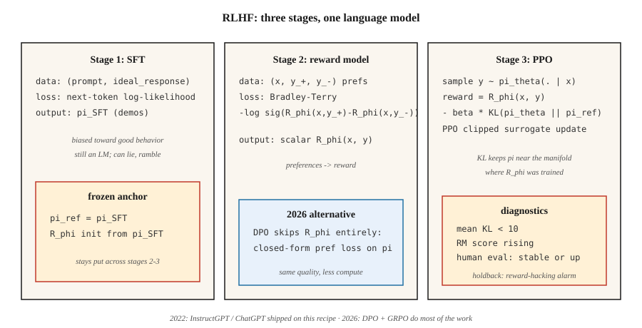

# 奖励建模与 RLHF

> 人类写不出"好的助手回答"的奖励函数,但他们能比较两个回答、挑出更好的那个。把这些比较拟合成一个奖励模型,再用 RL 拿它优化语言模型。Christiano 2017,InstructGPT 2022。正是这套配方把 GPT-3 变成了 ChatGPT。2026 年,它大半正被 DPO 取代——但心智模型不变。

**类型:** 动手构建
**编程语言:** Python
**前置要求:** 第 5 阶段 · 05(情感分析)、第 9 阶段 · 08(PPO)
**预计耗时:** 约 45 分钟

## 问题

你用下一 token 预测目标训出了一个语言模型。它英文语法流利,但也会撒谎、啰嗦、该拒时不拒。靠更多预训练修不好——网页文本本身就是病根,不是解药。

你想要的是一个*标量奖励*,能说出"对指令 X,回答 A 比回答 B 好"。手写这样的奖励函数不可能:"有帮助"不是 token 上的闭式表达。但人类能比较两个输出、标出偏好——这可以低成本大规模收集。

RLHF(Christiano 等 2017;Ouyang 等 2022)把偏好转成奖励模型,再用 PPO 对着这个奖励优化 LM。三步:SFT → RM → PPO。ChatGPT、Claude、Gemini 和 2023–2025 年每一个对齐 LLM,都是这套配方交付的。

2026 年,PPO 这一步大多被 DPO(第 10 阶段 · 08)取代——更便宜,对齐调优的效果几乎一样好。但*奖励模型*这一块,仍垫在每个 Best-of-N 采样器、每条"可验证奖励 RL"流水线、每个用过程奖励模型的推理模型底下。理解 RLHF,就理解了整个对齐技术栈。

## 概念



**第 1 阶段:监督微调(SFT)。** 从预训练基座出发,在人类撰写的目标行为示范(遵循指令的回答、有帮助的回复等)上微调。结果:`π_SFT`——一个*偏向良好行为*、但动作空间仍无界的模型。

**第 2 阶段:奖励模型训练。**

- 收集对提示 `x` 的回答对 `(y_+, y_-)`,由人类标注"y_+ 优于 y_-"。
- 训练奖励模型 `R_φ(x, y)`,给 `y_+` 打更高的分。
- 损失:**Bradley-Terry 成对逻辑损失**:

  `L(φ) = -E[ log σ(R_φ(x, y_+) - R_φ(x, y_-)) ]`

  σ 是 sigmoid。奖励之差蕴含偏好的对数几率。BT 自 1952 年(Bradley-Terry)起就是标准,至今是现代 RLHF 的主流选择。

- `R_φ` 通常从 SFT 模型初始化,顶部加一个标量头:同一个 Transformer 主干,一个线性层输出奖励。

**第 3 阶段:带 KL 惩罚、对着 RM 跑 PPO。**

- 可训练策略 `π_θ` 从 `π_SFT` 初始化;保留一个冻结的*参考* `π_ref = π_SFT`。
- 回答 `y` 结束时的奖励:

  `r_total(x, y) = R_φ(x, y) - β · KL(π_θ(·|x) || π_ref(·|x))`

  KL 惩罚防止 `π_θ` 无约束地漂离 `π_SFT`——它是*正则项*,不是硬信任域。`β` 通常取 `0.01`–`0.05`。
- 用这个奖励跑 PPO(第 08 课)。优势在 token 级轨迹上计算,但 RM 只给完整回答打分。

**为什么要 KL?** 没有它,PPO 会高高兴兴找到奖励黑客策略——RM 只在分布内的补全上训练过,一个分布外的回答可能拿到比任何人类回答更高的分。KL 把 `π_θ` 拴在 RM 训练过的流形附近。它是 RLHF 里最重要的一个旋钮。

**2026 年现状:**

- **DPO**(Rafailov 2023):闭式代数把第 2+3 阶段坍缩成偏好数据上的单个监督损失。无 RM,无 PPO。对齐基准上质量相当,算力只要零头。第 10 阶段 · 08 讲。
- **GRPO**(DeepSeek 2024–2025):用组内相对基线代替 critic 的 PPO,奖励来自*验证器*(代码能跑通 / 数学答案对得上)而非人类训练的 RM。推理模型的主流。第 9 阶段 · 12 讲。
- **过程奖励模型(PRM):** 给部分解答(每个推理步)打分,用于推理场景的 RLHF 与 GRPO 变体。
- **Constitutional AI / RLAIF:** 用对齐的 LLM 代替人类生成偏好,把偏好预算扩到更大规模。

```figure
reward-model
```

## 动手构建

本课用迷你的合成"提示"和"回答"(字符串表示),RM 是词袋表示上的线性打分器。没有真 LLM——重要的是流水线的*形状*,不是规模。见 `code/main.py`。

### 第 1 步:合成偏好数据

```python
PROMPTS = ["help me", "answer me", "explain this"]
GOOD_WORDS = {"clear", "specific", "kind", "thorough"}
BAD_WORDS = {"vague", "rude", "wrong", "short"}

def make_pair(rng):
    x = rng.choice(PROMPTS)
    y_good = rng.choice(list(GOOD_WORDS)) + " " + rng.choice(list(GOOD_WORDS))
    y_bad = rng.choice(list(BAD_WORDS)) + " " + rng.choice(list(BAD_WORDS))
    return (x, y_good, y_bad)
```

真实 RLHF 里,这里换成人类标注员。形状——`(prompt, preferred_response, rejected_response)`——一模一样。

### 第 2 步:Bradley-Terry 奖励模型

线性打分:`R(x, y) = w · bag(y)`。训练目标是最小化 BT 成对 log 损失:

```python
def rm_train_step(w, x, y_pos, y_neg, lr):
    r_pos = dot(w, bag(y_pos))
    r_neg = dot(w, bag(y_neg))
    p = sigmoid(r_pos - r_neg)
    for tok, cnt in bag(y_pos).items():
        w[tok] += lr * (1 - p) * cnt
    for tok, cnt in bag(y_neg).items():
        w[tok] -= lr * (1 - p) * cnt
```

几百次更新后,`w` 给好词正权重、坏词负权重。

### 第 3 步:RM 之上的类 PPO 策略

我们的玩具策略从词表中产出单个 token。用 RM 给 token 打分,计算 `log π_θ(token | prompt)`,加上对参考的 KL 惩罚,再施加 PPO 截断代理。

```python
def rlhf_step(theta, ref, w, prompt, rng, eps=0.2, beta=0.1, lr=0.05):
    logits_theta = policy_logits(theta, prompt)
    probs = softmax(logits_theta)
    token = sample(probs, rng)
    logits_ref = policy_logits(ref, prompt)
    probs_ref = softmax(logits_ref)
    reward = dot(w, bag([token])) - beta * kl(probs, probs_ref)
    # ppo-style update on theta, treating reward as the return
    ...
```

### 第 4 步:监控 KL

每次更新跟踪平均 `KL(π_θ || π_ref)`。若它爬过 `~5-10`,说明策略已漂得离 `π_SFT` 太远——`β` 该调大,或者奖励黑客已经开始。这是真实 RLHF 里的头号诊断。

### 第 5 步:用 TRL 的生产配方

看懂玩具流水线后,这是真实库用户写下的同一个循环。Hugging Face 的 [TRL](https://huggingface.co/docs/trl) 是参考实现——第 2 阶段用 `RewardTrainer`,第 3 阶段用 `PPOTrainer`(内置对参考的 KL)。

```python
# Stage 2: reward model from pairwise preferences
from trl import RewardTrainer, RewardConfig
from transformers import AutoModelForSequenceClassification, AutoTokenizer

tok = AutoTokenizer.from_pretrained("meta-llama/Llama-3.1-8B-Instruct")
rm = AutoModelForSequenceClassification.from_pretrained(
    "meta-llama/Llama-3.1-8B-Instruct", num_labels=1
)

# dataset rows: {"prompt", "chosen", "rejected"} — Bradley-Terry format
trainer = RewardTrainer(
    model=rm,
    tokenizer=tok,
    train_dataset=preference_data,
    args=RewardConfig(output_dir="./rm", num_train_epochs=1, learning_rate=1e-5),
)
trainer.train()
```

```python
# Stage 3: PPO against the RM with KL penalty to the SFT reference
from trl import PPOTrainer, PPOConfig, AutoModelForCausalLMWithValueHead

policy = AutoModelForCausalLMWithValueHead.from_pretrained("./sft-checkpoint")
ref    = AutoModelForCausalLMWithValueHead.from_pretrained("./sft-checkpoint")  # frozen

ppo = PPOTrainer(
    config=PPOConfig(learning_rate=1.41e-5, batch_size=64, init_kl_coef=0.05,
                     target_kl=6.0, adap_kl_ctrl=True),
    model=policy, ref_model=ref, tokenizer=tok,
)

for batch in dataloader:
    responses = ppo.generate(batch["query_ids"], max_new_tokens=128)
    rewards   = rm(torch.cat([batch["query_ids"], responses], dim=-1)).logits[:, 0]
    stats     = ppo.step(batch["query_ids"], responses, rewards)
    # stats includes: mean_kl, clip_frac, value_loss — the three PPO diagnostics
```

库替你做的三件事:`adap_kl_ctrl=True` 实现自适应 β 日程——观测 KL 超过 `target_kl` 则 β 翻倍,低于一半则减半;参考模型按惯例冻结——绝不能意外与 `policy` 共享参数;价值头与策略挂在同一主干上(`AutoModelForCausalLMWithValueHead` 附加一个标量 MLP 头),所以 TRL 把 `policy/kl` 和 `value/loss` 分开报告。

## 常见坑

- **过度优化 / 奖励黑客。** RM 不完美,`π_θ` 会找到得分高但实际糟糕的对抗性补全。症状:奖励一路爬升而人工评测停滞或下降。修法:早停、调大 `β`、扩充 RM 训练数据。
- **长度黑客。** 在"有帮助回答"上训练的 RM 常常隐式奖励长度,策略于是学会灌水。补救:长度归一化奖励,或带长度感知 RM 的 RLAIF。
- **RM 太小。** RM 至少要和策略一样大。小 RM 无法忠实地给策略的输出打分。
- **KL 调参。** β 太低 → 漂移与奖励黑客;β 太高 → 策略几乎不动。标准技巧是用*自适应* β,锚定每步的目标 KL。
- **偏好数据噪声。** 约 30% 的人类标注有噪声或有歧义。用一致性过滤后的数据训 RM,或给 BT 加温度。
- **离策略问题。** 第一轮之后,PPO 数据就轻微离策略。按第 08 课监控截断比例。

## 投入使用

2026 年的 RLHF 是分层的:

| 层 | 目标 | 方法 |
|-------|--------|--------|
| 遵循指令、有帮助、无害 | 对齐 | DPO(第 10 阶段 · 08)优先于 RLHF-PPO |
| 推理正确性(数学、代码) | 能力 | 带验证器奖励的 GRPO(第 9 阶段 · 12) |
| 长视野多步任务 | 智能体 | PPO / GRPO 配按步打分的过程奖励模型 |
| 安全 / 拒答行为 | 安全 | RLHF-PPO 配独立安全 RM,或 Constitutional AI |
| 推理时 Best-of-N | 快速对齐 | 解码时用 RM,无需训练策略 |
| 奖励蒸馏 | 推理算力 | 在冻结 LM 上训一个小"奖励头" |

RLHF 是 2022–2024 年的*那个*方法。2026 年,生产对齐流水线 DPO 优先,PPO 只留给 RM 密集或安全攸关的环节。

## 交付

保存为 `outputs/skill-rlhf-architect.md`:

```markdown
---
name: rlhf-architect
description: Design an RLHF / DPO / GRPO alignment pipeline for a language model, including RM, KL, and data strategy.
version: 1.0.0
phase: 9
lesson: 9
tags: [rl, rlhf, alignment, llm]
---

Given a base LM, a target behavior (alignment / reasoning / refusal / agent), and a preference or verifier budget, output:

1. Stage. SFT? RM? DPO? GRPO? With justification.
2. Preference or verifier source. Humans, AI feedback, rule-based, unit-test-pass, or reward distillation.
3. KL strategy. Fixed β, adaptive β, or DPO (implicit KL).
4. Diagnostics. Mean KL, reward stability, over-optimization guard (holdout human eval).
5. Safety gate. Red-team set, refusal rate, safety RM separate from helpfulness RM.

Refuse to ship RLHF-PPO without a KL monitor. Refuse to use an RM smaller than the target policy. Refuse length-only rewards. Flag any pipeline that does not hold back a blind human-eval set as lacking over-optimization protection.
```

## 练习

1. **易。** 在 `code/main.py` 中用 500 对合成偏好训练 Bradley-Terry 奖励模型。在留出的 100 对上测成对准确率,应超过 90%。
2. **中。** 用 `β ∈ {0.0, 0.1, 1.0}` 跑玩具 PPO-RLHF 循环。每组画出 RM 分数 vs 对参考 KL 随更新的变化。哪几组发生了奖励黑客?
3. **难。** 在同一偏好数据上实现 DPO(闭式偏好似然损失),与 RLHF-PPO 流水线对比算力消耗和最终 RM 分数。

## 关键术语

| 术语 | 人们常说的 | 实际含义 |
|------|-----------------|-----------------------|
| RLHF | "对齐 RL" | SFT + RM + PPO 三段流水线(Christiano 2017,Ouyang 2022) |
| 奖励模型(RM) | "打分网络" | 通过 Bradley-Terry 拟合成对偏好的学习标量函数 |
| Bradley-Terry | "成对逻辑损失" | `P(y_+ ≻ y_-) = σ(R(y_+) - R(y_-))`;标准 RM 目标 |
| KL 惩罚 | "待在参考附近" | 奖励中的 `β · KL(π_θ \|\| π_ref)`;抗奖励黑客的正则项 |
| 奖励黑客 | "古德哈特定律" | 策略钻 RM 的空子;症状:奖励升、人工评测平 |
| RLAIF | "AI 标注的偏好" | 标签来自另一个 LM 而非人类的 RLHF |
| PRM | "过程奖励模型" | 给部分推理步打分;用于推理流水线 |
| Constitutional AI | "Anthropic 的方法" | 由显式规则引导的 AI 生成偏好 |

## 延伸阅读

- [Christiano 等(2017),《从人类偏好做深度强化学习》](https://arxiv.org/abs/1706.03741) —— 开创 RLHF 的论文。
- [Ouyang 等(2022),《InstructGPT —— 用人类反馈训练语言模型遵循指令》](https://arxiv.org/abs/2203.02155) —— ChatGPT 背后的配方。
- [Stiennon 等(2020),《用人类反馈学习摘要》](https://arxiv.org/abs/2009.01325) —— 更早的摘要场景 RLHF。
- [Rafailov 等(2023),《直接偏好优化》](https://arxiv.org/abs/2305.18290) —— DPO;2026 年后 RLHF 时代的默认。
- [Bai 等(2022),《Constitutional AI:来自 AI 反馈的无害性》](https://arxiv.org/abs/2212.08073) —— RLAIF 与自我批评循环。
- [Anthropic RLHF 论文(Bai 等,2022),《训练有用且无害的助手》](https://arxiv.org/abs/2204.05862) —— HH 论文。
- [Hugging Face TRL 库](https://huggingface.co/docs/trl) —— 生产级 `RewardTrainer` 与 `PPOTrainer`。读 trainer 源码可见自适应 KL 与价值头细节。
- [Hugging Face ——《图解 RLHF》](https://huggingface.co/blog/rlhf),Lambert、Castricato、von Werra、Havrilla 著 —— 三段流水线的经典图解导览。
- [von Werra 等(2020),《TRL:Transformer 强化学习》](https://github.com/huggingface/trl) —— 该库;`examples/` 有 Llama、Mistral、Qwen 的端到端 RLHF 脚本。
- [Sutton & Barto(2018),第 17.4 节 —— 设计奖励信号](http://incompleteideas.net/book/RLbook2020.pdf) —— 奖励假说视角;思考奖励黑客的必读先修。
