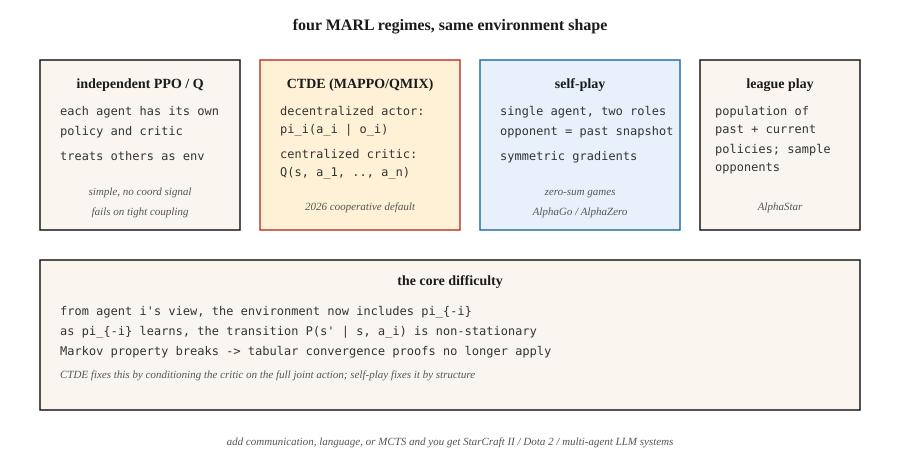

# 多智能体强化学习

> 单智能体 RL 假设环境是平稳的。把两个会学习的智能体放进同一个世界,这个假设就破了:每个智能体都是对方环境的一部分,而双方都在变。多智能体 RL,就是在马尔可夫假设不再成立时,让学习依然收敛的那一套技巧。

**类型:** 动手构建
**编程语言:** Python
**前置要求:** 第 9 阶段 · 04(Q-learning)、第 9 阶段 · 06(REINFORCE)、第 9 阶段 · 07(Actor-Critic)
**预计耗时:** 约 45 分钟

## 问题

一个学走路的机器人是单智能体 RL 问题。一支足球队不是;AlphaStar 对阵星际对手不是;一群竞价智能体组成的市场不是;两辆车在四岔路口协商谁先走不是。凡是"多对多"的真实问题,都不是。

在每个多智能体场景中,从任一智能体的视角看,其他智能体*就是*环境的一部分。它们在学习、在改变行为,环境就变成非平稳的。马尔可夫性质——"下一状态只依赖当前状态和我的动作"——被违反了,因为下一状态还取决于*其他*智能体选了什么,而它们的策略是移动的靶子。

这打破了表格方法的收敛证明(Q-learning 的保证以环境平稳为前提),也打破了朴素的深度 RL:智能体互相追逐兜圈,永远收敛不到稳定策略。你需要多智能体专门的技术:集中训练/分布执行、反事实基线、联赛、自我对弈。

2026 年的应用:机器人集群、交通路由、自动驾驶车队、市场模拟器、多智能体 LLM 系统(第 16 阶段),以及任何有多于一个聪明玩家的游戏。

## 概念



**形式化:马尔可夫博弈。** MDP 的推广:状态 `S`,联合动作 `a = (a_1, …, a_n)`,转移 `P(s' | s, a)`,逐智能体奖励 `R_i(s, a, s')`。每个智能体 `i` 在自己的策略 `π_i` 下最大化自己的回报。奖励全同是**完全合作**;零和是**对抗**;混合是**一般和**。

**核心挑战:**

- **非平稳性。** 从智能体 `i` 的视角,`P(s' | s, a_i)` 取决于正在变化的 `π_{-i}`。
- **信用分配。** 共享奖励到手,是哪个智能体的功劳?
- **探索协调。** 智能体们应探索互补的策略,而不是重复探索同一个状态。
- **可扩展性。** 联合动作空间随 `n` 指数增长。
- **部分可观测。** 每个智能体只看到自己的观测,全局状态是隐藏的。

**四种主流范式:**

**1. 独立 Q-learning / 独立 PPO(IQL、IPPO)。** 每个智能体各学各的 Q 或策略,把其他智能体当环境。简单,有时管用(尤其经验回放顺带起到了平滑对手建模的作用)。理论收敛保证:没有。实践:松耦合任务还行,紧耦合任务糟糕。

**2. 集中训练、分布执行(CTDE)。** 当今最常见的范式。每个智能体有自己的*策略* `π_i`,只以局部观测 `o_i` 为条件——部署时标准地分布执行;*训练*时,一个集中式 critic `Q(s, a_1, …, a_n)` 以完整全局状态和联合动作为条件。例子:
- **MADDPG**(Lowe 等,2017):每个智能体一个集中式 critic 的 DDPG。
- **COMA**(Foerster 等,2017):反事实基线——问"如果我当初选了动作 `a'`,奖励会是多少?"——隔离出我的贡献。
- **MAPPO** / 带共享 critic 的 **IPPO**(Yu 等,2022):集中式价值函数的 PPO。2026 年合作型 MARL 的主流。
- **QMIX**(Rashid 等,2018):价值分解——`Q_tot(s, a) = f(Q_1(s, a_1), …, Q_n(s, a_n))`,混合函数单调。

**3. 自我对弈(self-play)。** 同一智能体的两个副本互相对弈,对手的策略*就是*我过去某个快照的策略。AlphaGo / AlphaZero / MuZero、OpenAI Five。最适合零和博弈;训练信号对称。

**4. 联赛(league play)。** 自我对弈在一般和/对抗环境的推广:保留一个由过去与当前策略组成的种群,从联赛中抽对手来训练。加入"剥削者"(专攻打败当前最强)和"主剥削者"(专攻打败剥削者)。AlphaStar(星际争霸 II)。当博弈存在"石头剪刀布"式策略循环时是必需品。

**通信。** 允许智能体互发学习出来的消息 `m_i`,合作场景中有效。Foerster 等(2016)证明可微的智能体间通信可以端到端训练。今天的 LLM 多智能体系统(第 16 阶段),本质上就是在用自然语言通信。

```figure
f3-marl-orbit
```

## 动手构建

本课用一个 6×6 GridWorld,两个合作智能体从对角出发,必须共同到达共享目标。共享奖励:任一智能体仍在移动时每步 `-1`,两个都到达时 `+10`。见 `code/main.py`。

### 第 1 步:多智能体环境

```python
class CoopGridWorld:
    def __init__(self):
        self.size = 6
        self.goal = (5, 5)

    def reset(self):
        return ((0, 0), (5, 0))  # two agents

    def step(self, state, actions):
        a1, a2 = state
        new1 = move(a1, actions[0])
        new2 = move(a2, actions[1])
        done = (new1 == self.goal) and (new2 == self.goal)
        reward = 10.0 if done else -1.0
        return (new1, new2), reward, done
```

*联合*动作空间是 `|A|² = 16`,全局状态是两个位置。

### 第 2 步:独立 Q-learning

每个智能体跑自己的 Q 表,以联合状态为键。每一步:两者各自 ε-greedy 选动作,收集联合转移,各自用共享奖励更新自己的 Q。

```python
def independent_q(env, episodes, alpha, gamma, epsilon):
    Q1, Q2 = defaultdict(default_q), defaultdict(default_q)
    for _ in range(episodes):
        s = env.reset()
        while not done:
            a1 = epsilon_greedy(Q1, s, epsilon)
            a2 = epsilon_greedy(Q2, s, epsilon)
            s_next, r, done = env.step(s, (a1, a2))
            target1 = r + gamma * max(Q1[s_next].values())
            target2 = r + gamma * max(Q2[s_next].values())
            Q1[s][a1] += alpha * (target1 - Q1[s][a1])
            Q2[s][a2] += alpha * (target2 - Q2[s][a2])
            s = s_next
```

这个任务上能 work,因为奖励稠密且目标一致。在紧耦合任务上会失败(比如一个智能体必须*等*另一个的场景)。

### 第 3 步:集中式 Q 加分解值更新

用联合动作上的单个 Q:`Q(s, a_1, a_2)`,用共享奖励更新。执行时通过边缘化去中心化:`π_i(s) = argmax_{a_i} max_{a_{-i}} Q(s, a_1, a_2)`。用指数级的联合动作空间,换*正确的*全局视角。

### 第 4 步:简单自我对弈(对抗双智能体)

同一智能体,两个角色。A 对 B 训练;每 `K` 回合,把 A 的权重拷给 B。对称训练,稳定进步。微缩版 AlphaZero 配方。

## 常见坑

- **回放的非平稳性。** 独立智能体配经验回放,比单智能体更糟——旧转移是由早已过时的对手产生的。修法:重打标签,或按时间新近度加权。
- **信用分配模糊。** 长回合结束才有一笔共享奖励,说不清是谁的贡献。修法:反事实基线(COMA),或逐智能体奖励塑形。
- **策略漂移 / 互相追逐。** 每个智能体的最优应对随对方每次更新而变。修法:集中式 critic、慢学习率,或轮流冻结。
- **协调性奖励黑客。** 智能体找到设计者没预料到的合谋漏洞:拍卖智能体会收敛到全体出价零。修法:仔细的奖励设计、行为约束。
- **探索冗余。** 两个智能体探索同样的状态-动作对。修法:逐智能体熵奖励,或角色条件化。
- **联赛循环。** 纯自我对弈可能卡在克制循环里。修法:对手多样化的联赛。
- **样本爆炸。** `n` 个智能体 × 状态空间 × 联合动作。用函数逼近来近似;动作空间做分解(每个智能体一个策略输出头)。

## 投入使用

2026 年 MARL 应用地图:

| 领域 | 方法 | 备注 |
|--------|--------|-------|
| 合作导航 / 抓取 | MAPPO / QMIX | CTDE;共享 critic + 分布式 actor |
| 双人博弈(象棋、围棋、扑克) | 自我对弈 + MCTS(AlphaZero) | 零和;对称训练 |
| 复杂多人(Dota、星际) | 联赛 + 模仿预训练 | OpenAI Five、AlphaStar |
| 自动驾驶车队 | CTDE MAPPO / 带注意力的 PPO | 部分可观测;队伍规模可变 |
| 拍卖市场 | 博弈论均衡 + RL | `n` → ∞ 时用平均场 RL |
| LLM 多智能体系统(第 16 阶段) | 自然语言通信 + 角色条件化 | RL 循环在智能体规划层 |

2026 年,MARL 最大的增长领域是 LLM 方向:成群的语言模型智能体在协商、辩论、写软件。RL 以*轨迹级*输出的偏好优化形态出现,而不是 token 级(第 16 阶段 · 03)。

## 交付

保存为 `outputs/skill-marl-architect.md`:

```markdown
---
name: marl-architect
description: Pick the right multi-agent RL regime (IPPO, CTDE, self-play, league) for a given task.
version: 1.0.0
phase: 9
lesson: 10
tags: [rl, multi-agent, marl, self-play]
---

Given a task with `n` agents, output:

1. Regime classification. Cooperative / adversarial / general-sum. Justify.
2. Algorithm. IPPO / MAPPO / QMIX / self-play / league. Reason tied to coupling tightness and reward structure.
3. Information access. Centralized training (what global info goes to the critic)? Decentralized execution?
4. Credit assignment. Counterfactual baseline, value decomposition, or reward shaping.
5. Exploration plan. Per-agent entropy, population-based training, or league.

Refuse independent Q-learning on tightly-coupled cooperative tasks. Refuse to recommend self-play for general-sum with cycle risks. Flag any MARL pipeline without a fixed-opponent eval (cherry-picked self-play numbers are common).
```

## 练习

1. **易。** 在双智能体合作 GridWorld 上训练独立 Q-learning。多少回合后平均回报 > 0?画出联合学习曲线。
2. **中。** 加一个"协调"任务:只有两个智能体在同一回合同时踩上目标才算到达。独立 Q 还能收敛吗?什么坏了?
3. **难。** 为 MAPPO 式训练实现一个集中式 critic,在协调任务上与独立 PPO 对比收敛速度。

## 关键术语

| 术语 | 人们常说的 | 实际含义 |
|------|-----------------|-----------------------|
| 马尔可夫博弈 | "多智能体 MDP" | `(S, A_1, …, A_n, P, R_1, …, R_n)`;每个智能体有自己的奖励 |
| CTDE | "集中训练、分布执行" | 训练时用联合 critic;每个智能体的策略只用局部观测 |
| IPPO | "独立 PPO" | 每个智能体单独跑 PPO。简单基线;常被低估 |
| MAPPO | "多智能体 PPO" | 以全局状态为条件的集中式价值函数的 PPO |
| QMIX | "单调价值分解" | `Q_tot = f_monotone(Q_1, …, Q_n)`,允许分布式 argmax |
| COMA | "反事实多智能体" | 优势 = 我的 Q 减去对我动作边缘化后的期望 Q |
| 自我对弈 | "和过去的自己打" | 单一智能体,两个角色;零和博弈的标准做法 |
| 联赛 | "种群训练" | 缓存历史策略,从池中抽对手;应对策略循环 |

## 延伸阅读

- [Lowe 等(2017),《混合合作-竞争环境的多智能体 Actor-Critic(MADDPG)》](https://arxiv.org/abs/1706.02275) —— 带集中式 critic 的 CTDE。
- [Foerster 等(2017),《反事实多智能体策略梯度(COMA)》](https://arxiv.org/abs/1705.08926) —— 信用分配的反事实基线。
- [Rashid 等(2018),《QMIX:单调价值函数分解》](https://arxiv.org/abs/1803.11485) —— 带单调性的价值分解。
- [Yu 等(2022),《PPO 在合作多智能体博弈中惊人的有效性(MAPPO)》](https://arxiv.org/abs/2103.01955) —— PPO 在 MARL 上出奇地强。
- [Vinyals 等(2019),《用多智能体强化学习达到星际争霸 II 宗师水平(AlphaStar)》](https://www.nature.com/articles/s41586-019-1724-z) —— 规模化的联赛。
- [Silver 等(2017),《无需人类知识掌握围棋(AlphaGo Zero)》](https://www.nature.com/articles/nature24270) —— 零和博弈中的纯自我对弈。
- [Sutton & Barto(2018),第 15 章 —— 神经科学、第 17 章 —— 前沿](http://incompleteideas.net/book/RLbook2020.pdf) —— 含教科书对多智能体设定与非平稳性问题的简要讨论——CTDE 正是为解决它而设计。
- [Zhang、Yang 与 Başar(2021),《多智能体强化学习:选择性综述》](https://arxiv.org/abs/1911.10635) —— 覆盖合作、竞争与混合 MARL 及收敛结果的综述。
