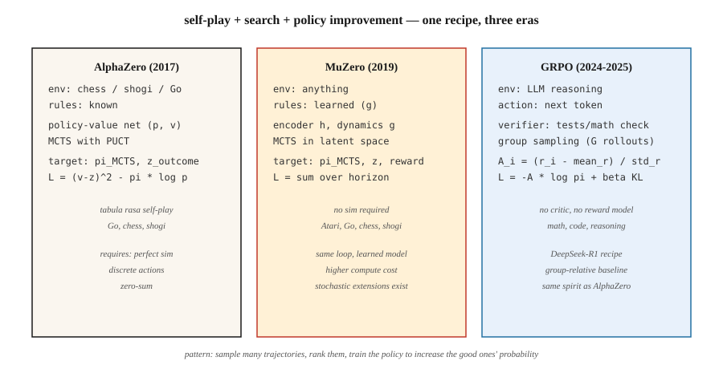

# 游戏 RL —— AlphaZero、MuZero 与 LLM 推理时代

> 1992 年:TD-Gammon 凭纯 TD 击败双陆棋人类冠军。2016 年:AlphaGo 击败李世石。2017 年:AlphaZero 从零横扫国际象棋、将棋和围棋。2024 年:DeepSeek-R1 证明同一套配方——把 PPO 换成 GRPO——在推理上同样有效。游戏是驱动本阶段每一次突破的试金石。

**类型:** 动手构建
**编程语言:** Python
**前置要求:** 第 9 阶段 · 05(DQN)、第 9 阶段 · 08(PPO)、第 9 阶段 · 09(RLHF)、第 9 阶段 · 10(MARL)
**预计耗时:** 约 120 分钟

## 问题

游戏拥有 RL 想要的一切:干净的奖励(赢/输)、无限的回合(自我对弈可以重置)、完美的模拟(游戏本身*就是*模拟器)、离散或小规模连续的动作空间,以及逼出对抗鲁棒性的多智能体结构。

而 RL 的每一次重大突破,都是在游戏上验证的:TD-Gammon(双陆棋,1992)、Atari-DQN(2013)、AlphaGo(2016)、AlphaZero(2017)、OpenAI Five(Dota 2,2019)、AlphaStar(星际争霸 II,2019)、MuZero(学习型模型,2019)、AlphaTensor(矩阵乘法,2022)、AlphaDev(排序算法,2023)、DeepSeek-R1(数学推理,2025)——最新一次证明:游戏 RL 技术在文本上同样有效。

本收官课用一个统一视角巡览三座里程碑架构——AlphaZero、MuZero、GRPO:**自我对弈 + 搜索 + 策略改进**。每一个都是对前一个的推广;GRPO 尤其如此——它就是 AlphaZero 的配方用在 LLM 推理上:token 是动作,数学验证是胜利信号。

## 概念



**统一循环。**

```
while True:
    trajectory = self_play(current_policy, search)     # play game against self
    policy_target = search.improved_policy(trajectory) # search improves raw policy
    policy_net.update(policy_target, value_target)     # supervised on search output
```

**AlphaZero(2017)。** Silver 等。给定规则已知的游戏(国际象棋、将棋、围棋):

- 策略-价值网络:一个塔 `f_θ(s) → (p, v)`。`p` 是合法着法上的先验,`v` 是期望的对局结果。
- 蒙特卡洛树搜索(MCTS):每步展开一棵可能后续的树,用 `(p, v)` 当先验 + 自举。按 UCB(PUCT)选节点:`a* = argmax Q(s, a) + c · p(a|s) · √N(s) / (1 + N(s, a))`。
- 自我对弈:智能体对智能体下棋。第 `t` 步,MCTS 的访问分布 `π_t` 成为策略训练目标。
- 损失:`L = (v - z)² - π · log p + c · ||θ||²`。`z` 是对局结果(+1 / 0 / -1)。

零人类知识,零手工启发式。同一套配方,在各几千万局自我对弈后,精通了国际象棋、将棋和围棋。

**MuZero(2019)。** Schrittwieser 等。去掉了"规则已知"的要求。

- 不用固定环境,而是学一个*潜空间动力学模型* `(h, g, f)`:
  - `h(s)`:把观测编码成潜状态。
  - `g(s_latent, a)`:预测下一潜状态 + 奖励。
  - `f(s_latent)`:预测策略先验 + 价值。
- MCTS 在*学出来的潜空间*里跑。同样的搜索,同样的训练循环。
- 在围棋、国际象棋、将棋*和* Atari 上都有效——一个算法,无需任何规则知识。

**随机 MuZero(2022)。** 加入随机动力学和机会节点,扩展到双陆棋一类游戏。

**Muesli、Gumbel MuZero(2022–2024)。** 在样本效率和确定性搜索上的改进。

**GRPO(2024–2025)。** DeepSeek-R1 的配方。同一个 AlphaZero 形状的循环,用在语言模型推理上:

- "游戏":回答一道数学 / 编程 / 推理题。"赢" = 验证器(测试用例通过、数值答案吻合)返回 1。
- 策略:LLM。动作:token。状态:提示 + 已生成的部分回答。
- 没有 critic(PPO 式的 V_φ)。改为:对每个提示,从策略采 `G` 个补全,各算奖励,用**组内相对优势** `A_i = (r_i - mean_r) / std_r` 作为 REINFORCE 式更新的信号。
- 对参考策略的 KL 惩罚,防漂移(同 RLHF)。
- 完整损失:

  `L_GRPO(θ) = -E_{q, {o_i}} [ (1/G) Σ_i A_i · log π_θ(o_i | q) ] + β · KL(π_θ || π_ref)`

没有奖励模型,没有 critic,没有 MCTS。组内相对基线一顶三。在推理基准上追平或超过 PPO-RLHF 的质量,算力只要零头。

**R1 配方全貌。** DeepSeek-R1(DeepSeek 2025)是一篇论文里的两个模型:

- **R1-Zero。** 从 DeepSeek-V3 基座出发,不做 SFT,直接上 GRPO,奖励两个成分:*准确率奖励*(基于规则——最终答案能否解析成正确数字 / 代码能否通过单测)和*格式奖励*(补全是否把思维链包在 `<think>…</think>` 标签里)。数千步后,平均回答长度从约 100 token 涨到约 10,000,数学基准分数逼近 o1-preview 水平。模型从零学会了推理。代价:思维链常常读不下去、混用语言、缺乏文体修饰。
- **R1。** 用四段流水线修掉 R1-Zero 的可读性问题:
  1. **冷启动 SFT。** 收集几千条格式干净的长思维链示范,对基座做监督微调,得到一个可读的起点。
  2. **推理导向 GRPO。** 用准确率 + 格式奖励做 GRPO,再加*语言一致性*奖励防止混用语言。
  3. **拒绝采样 + 第二轮 SFT。** 从 RL 检查点采约 60 万条推理轨迹,只留最终答案正确且思维链可读的,混入约 20 万条非推理 SFT 样本(写作、问答、自我认知),再次微调基座。
  4. **全谱 GRPO。** 再来一轮 RL,同时覆盖推理(规则奖励)与通用对齐(有用性/无害性偏好奖励)。

结果:开放权重下在 AIME 和 MATH-500 上追平 o1,且小到可以蒸馏。论文还发布了六个蒸馏稠密模型(Qwen-1.5B 到 Llama-70B)——用 R1 的推理轨迹做 SFT 得到,学生端完全没跑 RL。在学生这个规模上,蒸馏强 RL 教师稳定胜过从零 RL。

**为什么推理用 GRPO 而非 PPO。** DeepSeekMath 论文(2024 年 2 月)给了三条理由:(1) 不用训价值网络,显存减半;(2) 组基线天然应对推理任务那种"轨迹末尾才有"的稀疏奖励;(3) 逐提示归一化让难度天差地别的题目之间的优势可比——PPO 的单一 critic 做不到。

**无搜索 vs 有搜索。** 游戏领域已经分叉:

- *长视野完全信息博弈*(围棋、国际象棋):仍有搜索。AlphaZero / MuZero 统治。
- *LLM 推理*:生产中尚无 MCTS;GRPO 跑完整展开,推理算力靠 best-of-N。过程奖励模型(PRM)预示着步骤级搜索正在被加回来。

```figure
f3-selfplay-ladder
```

## 动手构建

`code/main.py` 中的代码实现了**微缩版 GRPO**——一个带多组采样的老虎机。算法与 LLM 上的完全相同,只是策略和环境更简单。它教的是*损失*和*组内相对优势*——2025 年的创新点。

### 第 1 步:迷你验证器环境

```python
QUESTIONS = [
    {"prompt": "q1", "correct": 3},
    {"prompt": "q2", "correct": 1},
]

def verify(prompt_idx, answer_token):
    return 1.0 if answer_token == QUESTIONS[prompt_idx]["correct"] else 0.0
```

真实 GRPO 里,验证器跑单元测试或检查数学等式。

### 第 2 步:策略——每个提示上对 K 个回答 token 的 softmax

```python
def policy_probs(theta, p_idx):
    return softmax(theta[p_idx])
```

等价于 LLM 在给定提示下最后一层的输出。

### 第 3 步:组采样与组内相对优势

```python
def grpo_step(theta, p_idx, G=8, beta=0.01, lr=0.1, rng=None):
    probs = policy_probs(theta, p_idx)
    samples = [sample(probs, rng) for _ in range(G)]
    rewards = [verify(p_idx, s) for s in samples]
    mean_r = sum(rewards) / G
    std_r = stddev(rewards) + 1e-8
    advs = [(r - mean_r) / std_r for r in rewards]

    for a, A in zip(samples, advs):
        grad = onehot(a) - probs
        for i in range(len(probs)):
            theta[p_idx][i] += lr * A * grad[i]
    # KL penalty: pull theta toward reference
    for i in range(len(probs)):
        theta[p_idx][i] -= beta * (theta[p_idx][i] - reference[p_idx][i])
```

组内相对优势就是 2024 年 DeepSeek 的技巧。不需要 critic:"基线"是组内均值,归一化用组内标准差。

### 第 4 步:与 REINFORCE 基线(无价值)对比

同样设置、同样算力,跑朴素 REINFORCE。GRPO 收敛更快、更稳。

### 第 5 步:观察熵与 KL

与 RLHF 相同的诊断:对参考的平均 KL、策略熵、奖励随时间变化。这些一稳定,训练就完成了。

## 常见坑

- **靠玩弄验证器的奖励黑客。** GRPO 继承了 RLHF 的风险:验证器若有错或可被钻空子,LLM 一定会找到那个空子。健壮的验证器(多测试用例、形式化证明)很要紧。
- **组太小。** 组基线的方差按 `1/√G` 走。`G < 4` 时优势信号噪声大;标准选择是 `G = 8` 到 `64`。
- **长度偏差。** 不同长度的 LLM 补全对数概率不同。按 token 数归一化,或用序列级对数概率,或截断到最大长度。
- **纯自我对弈循环。** AlphaZero 式训练在一般和博弈上可能卡进克制循环。靠对手池多样化缓解(联赛,第 10 课)。
- **搜索-策略不匹配。** AlphaZero 训练策略去模仿搜索输出。策略网络太小、装不下搜索的分布时,训练就会停滞。
- **算力下限。** MuZero / AlphaZero 需要海量算力,一次消融常常上百 GPU 小时。学习用途有微缩演示(如四子棋上的 AlphaZero)。
- **验证器覆盖。** 带 bug 的解法也能通过的单元测试,会把 bug 强化进去。设计能抓边角案例的验证器。

## 投入使用

2026 年游戏 RL 版图,按领域分:

| 领域 | 主流方法 |
|--------|-----------------|
| 双人零和棋类(围棋、国际象棋、将棋) | AlphaZero / MuZero / KataGo |
| 非完美信息牌类(扑克) | CFR + 深度学习(DeepStack、Libratus、Pluribus) |
| Atari / 像素游戏 | Muesli / MuZero / IMPALA-PPO |
| 大型多人策略(Dota、星际) | PPO + 自我对弈 + 联赛(OpenAI Five、AlphaStar) |
| LLM 数学/代码推理 | GRPO(DeepSeek-R1、Qwen-RL 及各开源复现) |
| LLM 对齐 | DPO / RLHF-PPO(不用 GRPO;那里验证器是偏好而非可验证) |
| 机器人 | PPO + DR(不算游戏 RL,但用同一套策略梯度工具) |
| 组合问题 | AlphaZero 变体(AlphaTensor、AlphaDev) |

这套*配方*——自我对弈、搜索增强的改进、策略蒸馏——横跨文本、像素和物理控制。GRPO 是最年轻的一个实例,更多还在路上。

## 交付

保存为 `outputs/skill-game-rl-designer.md`:

```markdown
---
name: game-rl-designer
description: Design a game-RL or reasoning-RL training pipeline (AlphaZero / MuZero / GRPO) for a given domain.
version: 1.0.0
phase: 9
lesson: 12
tags: [rl, alphazero, muzero, grpo, self-play]
---

Given a target (perfect-info game / imperfect-info / Atari / LLM reasoning / combinatorial), output:

1. Environment fit. Known rules? Markov? Stochastic? Multi-agent? Informs AlphaZero vs MuZero vs GRPO.
2. Search strategy. MCTS (PUCT with learned prior), Gumbel-sampled, best-of-N, or none.
3. Self-play plan. Symmetric self-play / league / offline data / verifier-generated.
4. Target signal. Game outcome / verifier reward / preference / learned model. Include robustness plan.
5. Diagnostics. Win rate vs baseline, ELO curve, verifier pass rate, KL to reference.

Refuse AlphaZero on imperfect-info games (route to CFR). Refuse GRPO without a trusted verifier. Refuse any game-RL pipeline without a fixed baseline opponent set (self-play ELO is uncalibrated otherwise).
```

## 练习

1. **易。** 实现 `code/main.py` 中的 GRPO 老虎机。在 2 个提示 × 各 4 个回答 token 上训练,`G=8` 时应 < 1,000 次更新收敛。
2. **中。** 接入 PPO(截断版)和朴素 REINFORCE。在同一老虎机上与 GRPO 对比样本效率和奖励方差。
3. **难。** 扩展到长度 2 的"推理链":智能体吐两个 token,验证器给这一对打分。测量 GRPO 如何处理两步序列上的信用分配。(提示:按*完整序列*算组优势,传播到两个 token 位置。)

## 关键术语

| 术语 | 人们常说的 | 实际含义 |
|------|-----------------|-----------------------|
| MCTS | "带学习网络的树搜索" | 蒙特卡洛树搜索;用学到的 `(p, v)` 先验做 UCB1/PUCT 选择 |
| AlphaZero | "自我对弈 + MCTS" | 训练策略-价值网络去拟合 MCTS 访问分布与对局结果 |
| MuZero | "带学习模型的 AlphaZero" | 同一个循环,但在潜空间里、用学到的动力学跑 |
| GRPO | "无 critic 的 PPO" | 组相对策略优化;组均值基线 + KL 的 REINFORCE |
| PUCT | "AlphaZero 的 UCB" | `Q + c · p · √N / (1 + N_a)` —— 平衡价值估计与先验 |
| 自我对弈 | "和过去的自己打" | 零和的标准做法;训练信号对称 |
| 联赛 | "基于种群的自我对弈" | 历史 + 当前 + 剥削者策略混抽当对手 |
| 验证器奖励 | "可验证 RL" | 奖励来自确定性检查器(测试通过、答案吻合) |
| 过程奖励 | "PRM" | 给每个推理步打分,不只看最终答案 |

## 延伸阅读

- [Silver 等(2017),《无需人类知识掌握围棋(AlphaGo Zero)》](https://www.nature.com/articles/nature24270)。
- [Silver 等(2018),《通过自我对弈精通国际象棋、将棋与围棋的通用强化学习算法(AlphaZero)》](https://www.science.org/doi/10.1126/science.aar6404)。
- [Schrittwieser 等(2020),《用学习模型规划,精通 Atari、围棋、国际象棋与将棋(MuZero)》](https://www.nature.com/articles/s41586-020-03051-4)。
- [Vinyals 等(2019),《星际争霸 II 宗师水平(AlphaStar)》](https://www.nature.com/articles/s41586-019-1724-z)。
- [DeepSeek-AI(2024),《DeepSeekMath:挑战开放语言模型数学推理的极限(GRPO)》](https://arxiv.org/abs/2402.03300) —— 提出 GRPO 与组内相对基线的论文。
- [DeepSeek-AI(2025),《DeepSeek-R1:通过强化学习激发 LLM 的推理能力》](https://arxiv.org/abs/2501.12948) —— 完整四段 R1 配方及 R1-Zero 消融。
- [Brown 等(2019),《多人扑克的超人 AI(Pluribus)》](https://www.science.org/doi/10.1126/science.aay2400) —— 规模化的 CFR + 深度学习。
- [Tesauro(1995),《时序差分学习与 TD-Gammon》](https://dl.acm.org/doi/10.1145/203330.203343) —— 一切的开端。
- [Hugging Face TRL —— GRPOTrainer](https://huggingface.co/docs/trl/main/en/grpo_trainer) —— 用自定义奖励函数跑 GRPO 的生产参考。
- [Qwen 团队(2024),《Qwen2.5-Math —— GRPO 复现》](https://github.com/QwenLM/Qwen2.5-Math) —— R1 配方在多尺度上的开源复现。
- [Sutton & Barto(2018),第 17 章 —— 强化学习前沿](http://incompleteideas.net/book/RLbook2020.pdf) —— 教科书对自我对弈、搜索与"设计奖励"的框架,R1 正是在 LLM 规模上的实例化。
