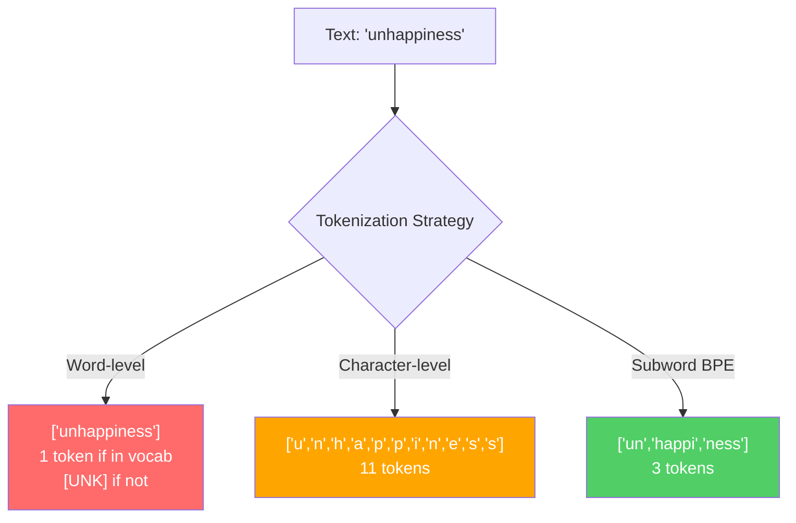
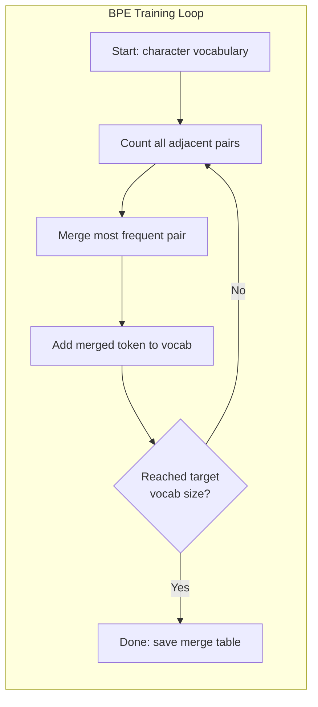
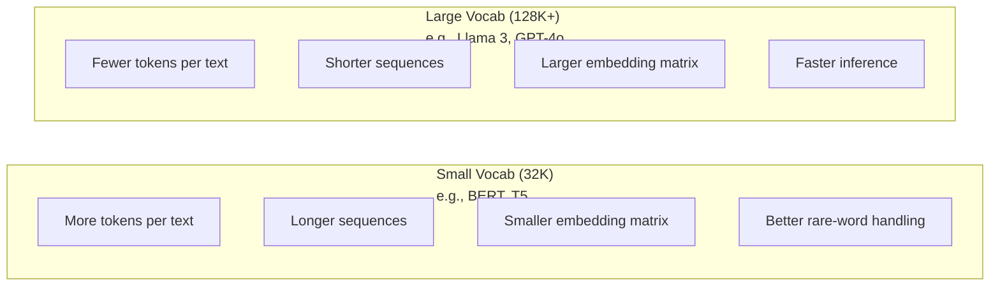

# 分词器:BPE、WordPiece、SentencePiece

> 你的 LLM 读的不是英语,是整数。这些整数承载意义还是浪费意义,由分词器决定。

**类型:** 动手构建
**编程语言:** Python
**前置要求:** 第 05 阶段(NLP 基础)
**预计耗时:** 约 90 分钟

## 学习目标

- 从零实现 BPE、WordPiece 和 Unigram 分词算法,对比它们的合并策略
- 解释词表大小如何影响模型效率:太小则序列变长,太大则浪费嵌入参数
- 分析分词器在不同语言和代码上的表现,找出特定分词器崩掉的地方
- 用 tiktoken 和 sentencepiece 库分词,并检查产出的 token ID

## 问题

你的 LLM 读的不是英语。它什么语言都不读。它读的是数字。

"Hello, world!" 和 [15496, 11, 995, 0] 之间的鸿沟,就是分词器。每个词、每个空格、每个标点,都必须先转成整数,模型才能处理。这个转换不是中立的——它把假设焊死在模型里,事后无法撤销。

搞错了,模型就要浪费容量,用多个 token 编码常见词:"unfortunately" 变成四个 token 而不是一个。对多音节词密集的文本,你的 128K 上下文窗口直接缩水 75%。搞对了,同一个上下文窗口能装下两倍的意义。"这个模型代码写得好"和"这个模型一见 Python 就噎住",差别往往就出在分词器是怎么训练的。

你调 GPT-4 或 Claude 的每一次 API 都按 token 计费,模型生成的每个 token 都烧算力。表示同样输出用的 token 越少,端到端推理越快。分词不是预处理,是架构。

## 概念

### 三种失败的路线(以及胜出的那一种)

把文本变成数字,有三种显然的做法。其中两种在规模化之后不成立。

**词级分词**按空格和标点切。"The cat sat" 变成 ["The", "cat", "sat"]。简单。但 "tokenization" 怎么办?"GPT-4o" 怎么办?德语复合词 "Geschwindigkeitsbegrenzung" 怎么办?词级分词需要巨大词表才能覆盖每种语言的每个词。漏掉一个词,就得到那个可怕的 `[UNK]` token——模型在说"我不认识这玩意"。光英语就有一百多万种词形,再加上代码、URL、科学记数法和另外 100 种语言,你需要无穷大的词表。

**字符级分词**走向另一个极端。"hello" 变成 ["h", "e", "l", "l", "o"]。词表极小(几百个字符),永远没有未知 token。但序列变得极长:词级 10 个 token 的句子,字符级要 50 个。模型还得自己去学 "t"、"h"、"e" 凑在一起是 "the"——把宝贵的注意力容量烧在人类三岁就会的事情上。

**子词分词**找到了甜点位。常见词保持完整:"the" 是一个 token;生词拆成有意义的片段:"unhappiness" 变成 ["un", "happi", "ness"]。词表可控(3 万到 12.8 万 token),序列保持短,未知 token 基本绝迹,因为任何词都能用子词片段拼出来。

每一个现代 LLM 都用子词分词:GPT-2、GPT-4、BERT、Llama 3、Claude,无一例外。问题只剩用哪种算法。



### BPE:字节对编码

BPE 是一个被挪来做分词的贪心压缩算法。核心思想小到能写在一张卡片上。

从单个字符开始,统计训练语料里所有相邻对,把最高频的一对合并成新 token,重复,直到达到目标词表大小。

```figure
tokenizer-bpe
```

下面是在一个只含 "lower"、"lowest"、"newest" 的小语料上跑 BPE 的过程:

```
Corpus (with word frequencies):
  "lower"  x5
  "lowest" x2
  "newest" x6

Step 0 -- Start with characters:
  l o w e r       (x5)
  l o w e s t     (x2)
  n e w e s t     (x6)

Step 1 -- Count adjacent pairs:
  (e,s): 8    (s,t): 8    (l,o): 7    (o,w): 7
  (w,e): 13   (e,r): 5    (n,e): 6    ...

Step 2 -- Merge most frequent pair (w,e) -> "we":
  l o we r        (x5)
  l o we s t      (x2)
  n e we s t      (x6)

Step 3 -- Recount and merge (e,s) -> "es":
  l o we r        (x5)
  l o we s t      (x2)    <- 'es' only forms from 'e'+'s', not 'we'+'s'
  n e we s t      (x6)    <- wait, the 'e' before 'we' and 's' after 'we'

Actually tracking this precisely:
  After "we" merge, remaining pairs:
  (l,o): 7   (o,we): 7   (we,r): 5   (we,s): 8
  (s,t): 8   (n,e): 6    (e,we): 6

Step 3 -- Merge (we,s) -> "wes" or (s,t) -> "st" (tied at 8, pick first):
  Merge (we,s) -> "wes":
  l o we r        (x5)
  l o wes t       (x2)
  n e wes t       (x6)

Step 4 -- Merge (wes,t) -> "west":
  l o we r        (x5)
  l o west        (x2)
  n e west        (x6)

...continue until target vocab size reached.
```

合并表就是分词器。编码新文本时,按学到的顺序应用合并。训练语料决定存在哪些合并——这个选择永久地塑造了模型看到的世界。



### 字节级 BPE(GPT-2、GPT-3、GPT-4)

标准 BPE 作用于 Unicode 字符,字节级 BPE 作用于原始字节(0-255)。这样基础词表恰好是 256,任何语言、任何编码都能处理,而且永远不会有未知 token。

GPT-2 引入了这个做法:基础词表覆盖所有可能的字节,BPE 合并在其上构建。OpenAI 的 tiktoken 库实现的就是字节级 BPE,词表大小如下:

- GPT-2:50,257 个 token
- GPT-3.5/GPT-4:约 100,256 个 token(cl100k_base 编码)
- GPT-4o:200,019 个 token(o200k_base 编码)

### WordPiece(BERT)

WordPiece 看起来和 BPE 很像,但选合并的方式不同。它不看原始频率,而是最大化训练数据的似然:

```
BPE merge criterion:      count(A, B)
WordPiece merge criterion: count(AB) / (count(A) * count(B))
```

BPE 问:"哪一对出现得最多?"WordPiece 问:"哪一对的共现频率超出随机的预期?"这个微妙差别产出不同的词表:WordPiece 偏爱那些共现得"出人意料"的合并,而不只是频繁。

WordPiece 还用 "##" 前缀标记续接子词:

```
"unhappiness" -> ["un", "##happi", "##ness"]
"embedding"   -> ["em", "##bed", "##ding"]
```

"##" 前缀告诉你这个片段接在前一个 token 后面。BERT 用 WordPiece,词表 30,522。注意:RoBERTa 的分词器其实是 BPE,但 BERT 本尊是 WordPiece。

### SentencePiece(Llama、T5)

SentencePiece 把输入当作原始 Unicode 字符流,连空白也算在内。不做预分词,不用任何语言的词边界规则。这让它真正语言无关——中文、日语、泰语这些不用空格分词的语言都能处理。

SentencePiece 支持两种算法:
- **BPE 模式**:与标准 BPE 相同的合并逻辑,作用于原始字符序列
- **Unigram 模式**:从一个大词表出发,迭代删除"删掉后对整体似然影响最小"的 token。和 BPE 反着来——不是合并,是剪枝。

Llama 2 用 SentencePiece BPE,词表 32,000;T5 用 SentencePiece Unigram,词表 32,000。注意:Llama 3 换成了基于 tiktoken 的字节级 BPE 分词器,词表 128,256。

### 词表大小的权衡

这是一个有可测量后果的真实工程决策。



算笔账:128K 词表、4,096 维嵌入,光嵌入矩阵就是 128,000 x 4,096 = 5.24 亿参数;32K 词表则是 1.31 亿。仅分词器这一个选择,就差出 4 亿参数。

但更大的词表压缩文本更狠。同一段英文,32K 词表要 100 个 token,128K 词表可能只要 70 个。生成时前向传播少 30%。对日服务百万请求的模型来说,这是实打实的算力节省。

趋势很清楚:词表在变大。GPT-2 用 50,257,GPT-4 用约 100K,Llama 3 用 128K,GPT-4o 用 200K。

| 模型 | 词表大小 | 分词器类型 | 每个英文词的平均 token 数 |
|-------|-----------|----------------|---------------------------|
| BERT | 30,522 | WordPiece | ~1.4 |
| GPT-2 | 50,257 | 字节级 BPE | ~1.3 |
| Llama 2 | 32,000 | SentencePiece BPE | ~1.4 |
| GPT-4 | ~100,256 | 字节级 BPE | ~1.2 |
| Llama 3 | 128,256 | 字节级 BPE(tiktoken) | ~1.1 |
| GPT-4o | 200,019 | 字节级 BPE | ~1.0 |

### 多语言税

主要用英文训练的分词器,对其他语言极其残忍。韩语文本在 GPT-2 分词器下平均每词 2-3 个 token,中文可能更糟。这意味着韩语用户的有效上下文窗口只有英语用户的一半——花同样的钱,信息密度减半。

这就是 Llama 3 把词表从 32K 扩到 128K 的原因。更多 token 分给非英语文字,各语言的压缩才公平。

```figure
tokenizer-tradeoff
```

## 动手构建

### 第 1 步:字符级分词器

从地基开始。字符级分词器把每个字符映射到它的 Unicode 码点。不用训练,没有未知 token,直接映射。

```python
class CharTokenizer:
    def encode(self, text):
        return [ord(c) for c in text]

    def decode(self, tokens):
        return "".join(chr(t) for t in tokens)
```

"hello" 变成 [104, 101, 108, 108, 111]。每个字符自成一个 token。这是我们要改进的基线。

### 第 2 步:从零实现 BPE 分词器

真正的实现。像 GPT-2 一样在原始字节上训练:数对、合并最高频、按顺序记录每次合并。合并表就是分词器。

```python
from collections import Counter

class BPETokenizer:
    def __init__(self):
        self.merges = {}
        self.vocab = {}

    def _get_pairs(self, tokens):
        pairs = Counter()
        for i in range(len(tokens) - 1):
            pairs[(tokens[i], tokens[i + 1])] += 1
        return pairs

    def _merge_pair(self, tokens, pair, new_token):
        merged = []
        i = 0
        while i < len(tokens):
            if i < len(tokens) - 1 and tokens[i] == pair[0] and tokens[i + 1] == pair[1]:
                merged.append(new_token)
                i += 2
            else:
                merged.append(tokens[i])
                i += 1
        return merged

    def train(self, text, num_merges):
        tokens = list(text.encode("utf-8"))
        self.vocab = {i: bytes([i]) for i in range(256)}

        for i in range(num_merges):
            pairs = self._get_pairs(tokens)
            if not pairs:
                break
            best_pair = max(pairs, key=pairs.get)
            new_token = 256 + i
            tokens = self._merge_pair(tokens, best_pair, new_token)
            self.merges[best_pair] = new_token
            self.vocab[new_token] = self.vocab[best_pair[0]] + self.vocab[best_pair[1]]

        return self

    def encode(self, text):
        tokens = list(text.encode("utf-8"))
        for pair, new_token in self.merges.items():
            tokens = self._merge_pair(tokens, pair, new_token)
        return tokens

    def decode(self, tokens):
        byte_sequence = b"".join(self.vocab[t] for t in tokens)
        return byte_sequence.decode("utf-8", errors="replace")
```

训练循环是 BPE 的核心:数对、合并胜者、重复。每次合并都减少总 token 数。`num_merges` 轮之后,词表从 256(基础字节)长到 256 + num_merges。

编码时必须严格按学到的顺序应用合并。这很关键:如果第 1 次合并造出 "th",第 5 次合并造出 "the",编码时必须先做第 1 次,"the" 才能在第 5 次由 "th" + "e" 合成。

解码是逆操作:查每个 token ID 对应的字节,拼接,按 UTF-8 解码。

### 第 3 步:编码-解码往返

```python
corpus = (
    "The cat sat on the mat. The cat ate the rat. "
    "The dog sat on the log. The dog ate the frog. "
    "Natural language processing is the study of how computers "
    "understand and generate human language. "
    "Tokenization is the first step in any NLP pipeline."
)

tokenizer = BPETokenizer()
tokenizer.train(corpus, num_merges=40)

test_sentences = [
    "The cat sat on the mat.",
    "Natural language processing",
    "tokenization pipeline",
    "unhappiness",
]

for sentence in test_sentences:
    encoded = tokenizer.encode(sentence)
    decoded = tokenizer.decode(encoded)
    raw_bytes = len(sentence.encode("utf-8"))
    ratio = len(encoded) / raw_bytes
    print(f"'{sentence}'")
    print(f"  Tokens: {len(encoded)} (from {raw_bytes} bytes) -- ratio: {ratio:.2f}")
    print(f"  Roundtrip: {'PASS' if decoded == sentence else 'FAIL'}")
```

压缩率告诉你分词器有多高效。比率 0.50 意味着 token 数只有原始字节数的一半,越低越好。在训练语料上,比率会很好看;在分布外的文本上(比如语料里没出现过的 "unhappiness"),比率会变差——对没见过的模式,分词器只能退回字符级编码。

### 第 4 步:与 tiktoken 对比

```python
import tiktoken

enc = tiktoken.get_encoding("cl100k_base")

texts = [
    "The cat sat on the mat.",
    "unhappiness",
    "Hello, world!",
    "def fibonacci(n): return n if n < 2 else fibonacci(n-1) + fibonacci(n-2)",
    "Geschwindigkeitsbegrenzung",
]

for text in texts:
    our_tokens = tokenizer.encode(text)
    tiktoken_tokens = enc.encode(text)
    tiktoken_pieces = [enc.decode([t]) for t in tiktoken_tokens]
    print(f"'{text}'")
    print(f"  Our BPE:   {len(our_tokens)} tokens")
    print(f"  tiktoken:  {len(tiktoken_tokens)} tokens -> {tiktoken_pieces}")
```

tiktoken 用的是一模一样的算法,只是训练语料是几百 GB 文本、合并 10 万次。算法相同,差别在训练数据和合并次数。你在一段话上合 40 次练出的分词器,当然打不过 tiktoken 在庞大语料上的 10 万次合并。但机制是一样的。

### 第 5 步:词表分析

```python
def analyze_vocabulary(tokenizer, test_texts):
    total_tokens = 0
    total_chars = 0
    token_usage = Counter()

    for text in test_texts:
        encoded = tokenizer.encode(text)
        total_tokens += len(encoded)
        total_chars += len(text)
        for t in encoded:
            token_usage[t] += 1

    print(f"Vocabulary size: {len(tokenizer.vocab)}")
    print(f"Total tokens across all texts: {total_tokens}")
    print(f"Total characters: {total_chars}")
    print(f"Avg tokens per character: {total_tokens / total_chars:.2f}")

    print(f"\nMost used tokens:")
    for token_id, count in token_usage.most_common(10):
        token_bytes = tokenizer.vocab[token_id]
        display = token_bytes.decode("utf-8", errors="replace")
        print(f"  Token {token_id:4d}: '{display}' (used {count} times)")

    unused = [t for t in tokenizer.vocab if t not in token_usage]
    print(f"\nUnused tokens: {len(unused)} out of {len(tokenizer.vocab)}")
```

这会揭示你词表里的 Zipf 分布:少数 token 称王(空格、"the"、"e"),绝大多数 token 难得一见。生产分词器就是针对这个分布优化的——常见模式拿短 token ID,罕见模式拿长表示。

## 投入使用

你的手搓 BPE 能用了。再看看生产级工具长什么样。

### tiktoken(OpenAI)

```python
import tiktoken

enc = tiktoken.get_encoding("cl100k_base")

text = "Tokenizers convert text to integers"
tokens = enc.encode(text)
print(f"Tokens: {tokens}")
print(f"Pieces: {[enc.decode([t]) for t in tokens]}")
print(f"Roundtrip: {enc.decode(tokens)}")
```

tiktoken 用 Rust 编写、Python 绑定,每秒编码数百万 token。同一个 BPE 算法,工业级实现。

### Hugging Face tokenizers

```python
from tokenizers import Tokenizer
from tokenizers.models import BPE
from tokenizers.trainers import BpeTrainer
from tokenizers.pre_tokenizers import ByteLevel

tokenizer = Tokenizer(BPE())
tokenizer.pre_tokenizer = ByteLevel()

trainer = BpeTrainer(vocab_size=1000, special_tokens=["<pad>", "<eos>", "<unk>"])
tokenizer.train(["corpus.txt"], trainer)

output = tokenizer.encode("The cat sat on the mat.")
print(f"Tokens: {output.tokens}")
print(f"IDs: {output.ids}")
```

Hugging Face 的 tokenizers 库底层也是 Rust,GB 级语料几秒钟训完 BPE。自己训练模型时就该用它。

### 加载 Llama 的分词器

```python
from transformers import AutoTokenizer

tokenizer = AutoTokenizer.from_pretrained("meta-llama/Llama-3.1-8B")

text = "Tokenizers are the unsung heroes of LLMs"
tokens = tokenizer.encode(text)
print(f"Token IDs: {tokens}")
print(f"Tokens: {tokenizer.convert_ids_to_tokens(tokens)}")
print(f"Vocab size: {tokenizer.vocab_size}")

multilingual = ["Hello world", "Hola mundo", "Bonjour le monde"]
for text in multilingual:
    ids = tokenizer.encode(text)
    print(f"'{text}' -> {len(ids)} tokens")
```

Llama 3 的 128K 词表对非英文文本的压缩,明显好于 GPT-2 的 50K。你可以自己验证:用多种语言编码同一句话,数 token。

## 交付

本课产出 `outputs/prompt-tokenizer-analyzer.md` —— 一条可复用的提示词,分析任意文本与模型组合的分词效率。喂给它一段文本样本,它告诉你哪个模型的分词器处理得最好。

## 练习

1. 修改 BPE 分词器,在每次合并时打印词表。观察 "t" + "h" 如何变成 "th","th" + "e" 又如何变成 "the"。追踪常见英文单词是怎样一片一片拼起来的。

2. 给 BPE 分词器加特殊 token(`<pad>`、`<eos>`、`<unk>`),分配 ID 0、1、2,其余 token 顺移。实现一个预分词步骤:在跑 BPE 之前先按空白切分。

3. 实现 WordPiece 的合并准则(似然比代替频率)。在同一语料、同样合并次数下分别训练 BPE 和 WordPiece,对比产出的词表——哪个产出的子词在语言学上更有意义?

4. 搭一个多语言分词效率基准:取英语、西语、中文、韩语、阿拉伯语各 10 个句子,用 tiktoken(cl100k_base)分词,测每种语言的平均每字符 token 数,量化各语言的"多语言税"。

5. 在更大的语料上训练你的 BPE 分词器(下载一篇维基百科文章),调节合并次数,让同一段文本上的压缩率进入 tiktoken 的 10% 以内。这会逼你理解语料规模、合并次数和压缩质量之间的关系。

## 关键术语

| 术语 | 大家嘴里的说法 | 实际含义 |
|------|----------------|----------------------|
| Token | "一个词" | 模型词表里的一个单位——可能是字符、子词、词,甚至多词片段 |
| BPE | "某种压缩的东西" | 字节对编码——迭代合并最高频的相邻 token 对,直到达到目标词表大小 |
| WordPiece | "BERT 的分词器" | 类似 BPE,但合并按似然比 count(AB)/(count(A)*count(B)) 而不是原始频率 |
| SentencePiece | "一个分词库" | 语言无关的分词器,不做预分词、直接吃原始 Unicode,支持 BPE 和 Unigram 两种算法 |
| 词表大小 | "它认识多少词" | 唯一 token 的总数:GPT-2 是 50,257,BERT 是 30,522,Llama 3 是 128,256 |
| 繁殖率(Fertility) | "没听过分词器有这词" | 每个词的平均 token 数——衡量分词器跨语言效率(1.0 完美,3.0 意味着模型要多干三倍的活) |
| 字节级 BPE | "GPT 的分词器" | 作用于原始字节(0-255)而非 Unicode 字符的 BPE,保证任何输入都没有未知 token |
| 合并表 | "那个分词器文件" | 训练中学到的有序合并列表——这就是分词器本体,顺序至关重要 |
| 预分词 | "按空格切" | 子词分词之前应用的规则:空白切分、数字分离、标点处理 |
| 压缩率 | "分词器的效率" | 产出 token 数除以输入字节数——越低压缩越好、推理越快 |

## 延伸阅读

- [Sennrich et al., 2016 -- "Neural Machine Translation of Rare Words with Subword Units"](https://arxiv.org/abs/1508.07909) —— 把 BPE 引入 NLP 的论文,让一个 1994 年的压缩算法变成现代分词的基石
- [Kudo & Richardson, 2018 -- "SentencePiece: A simple and language independent subword tokenizer"](https://arxiv.org/abs/1808.06226) —— 语言无关分词,让多语言模型变得实用
- [OpenAI tiktoken 仓库](https://github.com/openai/tiktoken) —— Rust 编写、Python 绑定的生产级 BPE 实现,GPT-3.5/4/4o 在用
- [Hugging Face Tokenizers 文档](https://huggingface.co/docs/tokenizers) —— Rust 性能的生产级分词器训练
