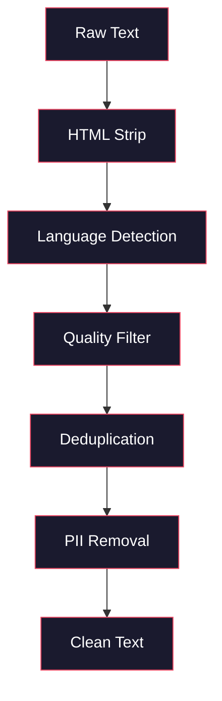
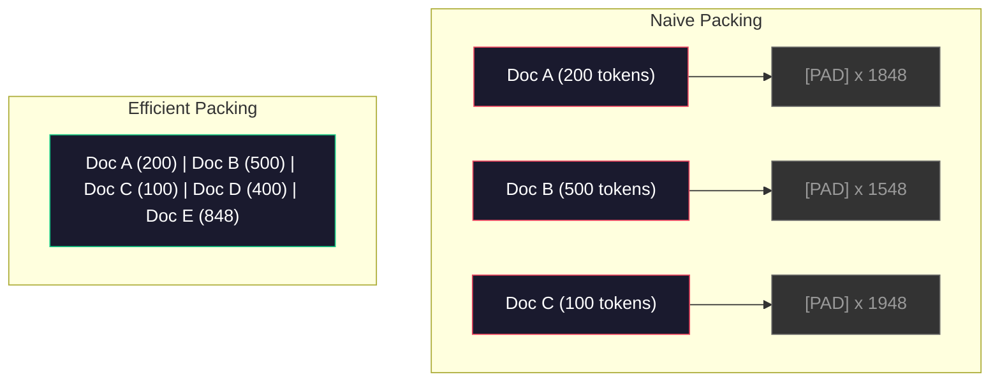

# 预训练数据流水线

> 模型是一面镜子，喂什么数据就照出什么。喂垃圾，它能用完美的流畅度把垃圾反射回来。

**类型：** Build
**编程语言：** Python
**前置要求：** 第 10 阶段 第 01-02 课（分词器、构建分词器）
**预计耗时：** 约 90 分钟

## 学习目标

- 构建流式数据流水线：分词、切块、打乱、组批，处理 TB 级文本而不全量载入内存
- 实现真实预训练流水线里的数据质量过滤（去重、语言识别、内容过滤）
- 创建定长训练序列，处理好注意力掩码和文档边界
- 剖析流水线吞吐，确保 dataloader 跟得上 GPU 训练速度

## 问题

你有了分词器。现在需要数据。

不是一个数据集，不是一个 CSV 文件。是 TB 级的文本——清洗、去重、按质量过滤、切成定长序列，再以随机批次供出来，快到你的 8 卡 GPU 集群永远不用干等下一批。

大多数人以为训练 LLM 的关键在模型架构。不是。Llama 3 用了 15.6 万亿 token,GPT-3 用了 3000 亿，DeepSeek-V2 用了 8.1 万亿。三家的架构大致相同：堆叠的 Transformer 块，注意力加前馈。输出质量的差距，压倒性地来自数据。

DeepMind 的 Chinchilla 论文把这件事量化了：给定算力预算，模型参数量和训练 token 数存在一个最优配比。Chinchilla 证明 2022 年的大多数模型严重训练不足——参数量相对于见过的数据太多了。一个按 Chinchilla 最优训练的 70B 模型（1.4 万亿 token)，赢了只用 3000 亿 token 训练的 280B 模型（Gopher)。

你的数据流水线，决定模型学到的是语言还是噪声。

## 概念

### 数据从哪来

每个大语言模型都训练在混合来源的数据上。确切配方是大多数实验室的顶级机密，但我们知道的已足够理解这些类别。

| 来源 | 规模 | 质量 | 使用者 |
|--------|------|---------|---------|
| Common Crawl | 约 250 TB 原始 | 低（需要重度过滤） | GPT-3、Llama、大多数开源模型 |
| 维基百科 | 约 20 GB | 高 | 所有主流 LLM |
| GitHub 代码 | 1 TB+ | 中（大量重复、死代码） | StarCoder、CodeLlama、DeepSeek-Coder |
| 书籍（BookCorpus、Pile) | 约 100 GB | 高 | GPT-2、GPT-3、早期模型 |
| 学术论文（arXiv、S2ORC) | 约 100 GB | STEM 领域高 | Llama、Galactica |
| StackOverflow、Reddit | 约 100 GB | 中 | Llama、Falcon |
| 精编网页（C4、RefinedWeb) | 约 5 TB | 中高（预过滤） | T5、Falcon |

Llama 3 公布了它的数据配比：约 50% 网页数据、25% 代码、13% 书籍和学术论文、8% 数学数据、4% 多语言网页数据。总量 15.6 万亿 token，来自超过 5 TB 的原始文本。

配比和总量一样重要。网页数据太多，模型变成 Reddit 复读机；代码太少，不会编程；数学太少，推理拉胯。调好这个配比是训练 LLM 最难的部分之一，没有公式，只能靠实验和评估。

### 数据清洗

原始网页数据脏得离谱。一份典型的 Common Crawl dump 里含有：

- HTML 标签和 JavaScript
- 样板页眉、页脚、导航菜单
- 重复页面（完全重复和近似重复）
- 机器生成的垃圾内容
- 个人可识别信息（PII)
- 低质量文本（关键词堆砌、SEO 垃圾）
- 编码成文本的非文本内容

清洗不是可选项。它决定了模型生成的是连贯段落，还是 HTML 标签夹杂着商品列表。



每一步消灭一类噪声：

**剥 HTML:** 移除全部标记，只留可见文本。`trafilatura` 或 `readability` 这类库能提取正文，丢弃导航、广告和样板。

**语言识别：** 用 fastText 的语言识别模型（lid.176.bin）给每篇文档分类，过滤出目标语言。一篇被判为英语但置信度低于 0.8 的文档，多半不是干净的英语。

**质量过滤：** 这里开始有意思了。RefinedWeb(Falcon 背后的数据集）用基于困惑度的过滤：先在维基百科上训一个小语言模型，再给每篇文档打分。困惑度高，说明文档不像维基百科——很可能是垃圾信息、关键词堆砌或机器生成。超过阈值的文档直接删。

**去重：** 影响最大的单步清洗。Common Crawl 里有海量重复页面——法律声明、cookie 提示、服务条款。在重复数据上训练浪费算力，还会让模型逐字背诵特定段落。

**PII 清除：** 姓名、邮箱、电话、社保号。结构化 PII 用正则检测，上下文里的人名用 NER 模型。

### 用 MinHash 去重

精确去重很容易：给每篇文档算哈希，删掉重复。但近似重复才是真正的麻烦。同一篇新闻的两个副本，周围广告略有不同，内容 95% 一致，但逐字节不一样。

MinHash + 局部敏感哈希（LSH）高效解决这个问题。


思路：

1. **Shingling（碎化）:** 把每篇文档变成 n-gram 集合（比如 5 个词一组）。"the quick brown fox" 按 3 词碎化得到 {"the quick brown", "quick brown fox"}。

2. **MinHash:** 对每篇文档的碎化集合，计算 k 个哈希值。每个哈希值是在一个不同哈希函数下所有碎化的最小哈希。这个定长"签名"可以近似任意两篇文档的 Jaccard 相似度。

3. **LSH:** 按 MinHash 签名的分段把文档分桶。同桶文档是近似重复候选。这样不用两两全对比，只比候选对。

4. **验证：** 对每个候选对算精确 Jaccard 相似度，超过阈值（通常 0.8）就删掉一份。

Llama 团队报告，去重删掉了约 38% 的网页数据。这不是小数目——Common Crawl 超过三分之一是重复或近似重复内容。

### 序列打包

模型要定长输入序列，而文档是变长的：有的 50 token，有的 5 万 token。

朴素做法：把每篇文档填充到最大序列长度。这会把巨量算力浪费在对学习毫无贡献的填充 token 上。

更好的做法：把多篇文档打包进一条序列，用序列结束符分隔。一条 2048 token 的序列，可能装着三篇用 [EOS] 隔开的短文档。



注意力掩码必须设对：同一条打包序列里，文档 A 的 token 不应该注意到文档 B 的 token。这需要块对角的注意力掩码。

超长文档会被截断或在序列边界处切开。切点有讲究：句中切断，模型看到的就是残缺的思路。有些流水线会尽量把切点对齐到段落或句子边界。

### Chinchilla 缩放定律

固定算力预算 C（以 FLOP 计），最优模型规模 N 和数据规模 D 满足：

```
N_opt ~ C^0.5
D_opt ~ C^0.5
```

实践中这意味着模型规模和数据规模应该大致同比例放大。参数量放大 10 倍，要达到同样的损失，训练 token 也得大约多 10 倍。

| 模型 | 参数量 | 训练 token | 符合 Chinchilla 最优？ |
|-------|-----------|----------------|-------------------|
| GPT-3 | 175B | 300B | 否（训练不足 3-4 倍） |
| Chinchilla | 70B | 1.4T | 是（按设计） |
| Llama 2 | 70B | 2T | 过度训练（有意为之） |
| Llama 3 | 70B | 15T | 重度过度训练 |

Llama 3 是故意违反 Chinchilla 定律的。Meta 发现：远超算力最优配比的过度训练，能产出推理时更好的模型。多付的训练成本只付一次，而更小的模型以后每次推理都便宜。这被称为"推理最优"缩放路线，2024 年起已成为行业标准。

```figure
l5-data-pipeline
```

## 动手构建

### 第 1 步：文本清洗

剥 HTML、归一化空白、去掉非文本内容。我们用一段公共领域文本（Project Gutenberg）当小语料。

```python
import re

def clean_text(text):
    text = re.sub(r"<[^>]+>", "", text)
    text = re.sub(r"http\S+", "", text)
    text = re.sub(r"[^\x20-\x7E\n]", "", text)
    text = re.sub(r"\n{3,}", "\n\n", text)
    text = re.sub(r" {2,}", " ", text)
    return text.strip()

def quality_filter(text, min_words=50, max_ratio_caps=0.3, max_ratio_special=0.1):
    words = text.split()
    if len(words) < min_words:
        return False
    caps_ratio = sum(1 for w in words if w.isupper()) / len(words)
    if caps_ratio > max_ratio_caps:
        return False
    special_chars = sum(1 for c in text if not c.isalnum() and not c.isspace())
    if special_chars / max(len(text), 1) > max_ratio_special:
        return False
    return True
```

质量过滤器能抓出 SEO 垃圾（全大写）、机器生成的噪声（特殊字符比例高）和残篇（太短）。仅这三项检查，就能从网页抓取数据里删掉惊人数量的垃圾。

### 第 2 步：MinHash 去重

从零实现 MinHash。不用外部库，只要 `hashlib`。

```python
import hashlib
from collections import defaultdict

def get_shingles(text, k=5):
    words = text.lower().split()
    if len(words) < k:
        return set()
    return {" ".join(words[i:i+k]) for i in range(len(words) - k + 1)}

def minhash_signature(shingles, num_hashes=128):
    signature = []
    for i in range(num_hashes):
        min_hash = float("inf")
        for shingle in shingles:
            h = int(hashlib.sha256(f"{i}:{shingle}".encode()).hexdigest(), 16)
            min_hash = min(min_hash, h)
        signature.append(min_hash)
    return signature

def lsh_buckets(signature, bands=16):
    rows_per_band = len(signature) // bands
    buckets = []
    for b in range(bands):
        start = b * rows_per_band
        band_data = tuple(signature[start:start + rows_per_band])
        bucket_hash = hashlib.md5(str(band_data).encode()).hexdigest()
        buckets.append((b, bucket_hash))
    return buckets

def deduplicate(documents, threshold=0.8, num_hashes=128, bands=16):
    signatures = []
    shingle_sets = []
    for doc in documents:
        shingles = get_shingles(doc)
        shingle_sets.append(shingles)
        signatures.append(minhash_signature(shingles, num_hashes))

    bucket_map = defaultdict(list)
    for doc_idx, sig in enumerate(signatures):
        for band_id, bucket_hash in lsh_buckets(sig, bands):
            bucket_map[(band_id, bucket_hash)].append(doc_idx)

    duplicate_pairs = set()
    for bucket_docs in bucket_map.values():
        if len(bucket_docs) < 2:
            continue
        for i in range(len(bucket_docs)):
            for j in range(i + 1, len(bucket_docs)):
                duplicate_pairs.add((bucket_docs[i], bucket_docs[j]))

    removed = set()
    for i, j in duplicate_pairs:
        if i in removed or j in removed:
            continue
        s1, s2 = shingle_sets[i], shingle_sets[j]
        if not s1 or not s2:
            continue
        jaccard = len(s1 & s2) / len(s1 | s2)
        if jaccard >= threshold:
            removed.add(j)

    return [doc for idx, doc in enumerate(documents) if idx not in removed], len(removed)
```

`num_hashes=128` 和 `bands=16` 这两个参数控制精确率-召回率的权衡。哈希越多，相似度估计越准；分段越多，召回越高（抓到的重复越多），但假阳性也越多。这组值对典型网页文本效果不错。

### 第 3 步：分词并打包序列

把清洗去重后的文本分词，打包成定长训练序列。

```python
def tokenize_corpus(documents, tokenizer):
    all_tokens = []
    for doc in documents:
        tokens = tokenizer.encode(doc)
        all_tokens.extend(tokens)
        all_tokens.append(tokenizer.eos_id)
    return all_tokens

def pack_sequences(token_ids, seq_length, pad_id=0):
    sequences = []
    attention_masks = []
    for i in range(0, len(token_ids), seq_length):
        seq = token_ids[i:i + seq_length]
        mask = [1] * len(seq)
        if len(seq) < seq_length:
            pad_count = seq_length - len(seq)
            seq = seq + [pad_id] * pad_count
            mask = mask + [0] * pad_count
        sequences.append(seq)
        attention_masks.append(mask)
    return sequences, attention_masks
```

### 第 4 步：训练用 DataLoader

产出随机打乱的打包序列批次。训练循环消费的就是它。

```python
import random

class PreTrainingDataLoader:
    def __init__(self, sequences, attention_masks, batch_size, shuffle=True):
        self.sequences = sequences
        self.attention_masks = attention_masks
        self.batch_size = batch_size
        self.shuffle = shuffle

    def __len__(self):
        return (len(self.sequences) + self.batch_size - 1) // self.batch_size

    def __iter__(self):
        indices = list(range(len(self.sequences)))
        if self.shuffle:
            random.shuffle(indices)
        for start in range(0, len(indices), self.batch_size):
            batch_idx = indices[start:start + self.batch_size]
            batch_seqs = [self.sequences[i] for i in batch_idx]
            batch_masks = [self.attention_masks[i] for i in batch_idx]
            yield batch_seqs, batch_masks
```

### 第 5 步：数据集统计

算出要紧的数字：总 token 数、唯一 token 数、压缩率、文档长度分布。

```python
from collections import Counter

def compute_statistics(documents, token_ids, sequences, tokenizer_vocab_size):
    total_chars = sum(len(d) for d in documents)
    total_tokens = len(token_ids)
    unique_tokens = len(set(token_ids))
    compression_ratio = total_chars / total_tokens

    doc_lengths = [len(d.split()) for d in documents]
    avg_doc_length = sum(doc_lengths) / max(len(doc_lengths), 1)
    max_doc_length = max(doc_lengths) if doc_lengths else 0
    min_doc_length = min(doc_lengths) if doc_lengths else 0

    token_counts = Counter(token_ids)
    top_tokens = token_counts.most_common(10)

    non_pad_tokens = sum(sum(1 for t in seq if t != 0) for seq in sequences)
    total_positions = sum(len(seq) for seq in sequences)
    utilization = non_pad_tokens / max(total_positions, 1)

    stats = {
        "total_documents": len(documents),
        "total_characters": total_chars,
        "total_tokens": total_tokens,
        "unique_tokens": unique_tokens,
        "vocab_utilization": unique_tokens / tokenizer_vocab_size,
        "compression_ratio": compression_ratio,
        "avg_doc_length_words": avg_doc_length,
        "max_doc_length_words": max_doc_length,
        "min_doc_length_words": min_doc_length,
        "num_sequences": len(sequences),
        "sequence_utilization": utilization,
        "top_10_tokens": top_tokens,
    }
    return stats
```

压缩率告诉你分词器在这个语料上的效率。英文文本通常压到每 token 3-4 个字符；如果你看到 1.5，说明分词器切得太碎；8+ 则说明它学到了非常领域特定的合并。

序列利用率告诉你打包序列里真实数据占多少、填充占多少。低于 90% 说明打包效率不行——你在往填充 token 上白烧算力。

## 投入使用

### 与 HuggingFace Datasets 对比

用 HuggingFace 的 datasets 库加载同一语料，对比流水线速度。

```python
from datasets import load_dataset
from transformers import AutoTokenizer

ds = load_dataset("wikitext", "wikitext-2-raw-v1", split="train")
tokenizer = AutoTokenizer.from_pretrained("meta-llama/Meta-Llama-3-8B")

import time

start = time.time()
tokenized = ds.map(
    lambda x: tokenizer(x["text"], truncation=True, max_length=2048),
    batched=True,
    num_proc=4,
)
hf_time = time.time() - start
total_tokens = sum(len(t) for t in tokenized["input_ids"])
print(f"HuggingFace: {total_tokens:,} tokens in {hf_time:.2f}s ({total_tokens/hf_time:,.0f} tokens/sec)")
```

HuggingFace 流水线底层是 Rust 分词器加 4 核并行。你的纯 Python 流水线会慢 10-50 倍。这个差距就是生产团队用编译型分词器的原因。算法一样，差的是实现语言。

## 交付

本课产出一条用于验证和调试 LLM 训练流水线数据质量的提示词，见 `outputs/prompt-data-quality-checker.md`。

## 练习

1. **入门：** 给清洗流水线加上语言识别，用简单启发式（字符集分析），只留英文文档，测量会删掉多少文档。
2. **进阶：** 在 MinHash 近似去重之外，实现基于 SHA-256 的精确去重。在网页抓取的语料上对比两种方法各自抓到的重复数。
3. **挑战：** 构建基于困惑度的质量过滤器：在维基文本上训一个小型二元语言模型，给每篇文档打困惑度分，删掉最高的 20%。对比用过滤前后数据训练出的模型输出质量。

## 关键术语

| 术语 | 大家嘴里的说法 | 实际含义 |
|------|----------------|----------------------|
| Common Crawl | "整个互联网" | 一个每月爬取网页的非营利组织——约 250TB 原始数据，大多数 LLM 训练数据的起点 |
| MinHash | "某种哈希技巧" | 用定长签名估计集合间 Jaccard 相似度的技术——让大规模近似重复检测成为可能 |
| LSH | "局部敏感哈希" | 把相似项分进同一桶的方法——把两两对比从 O(n^2) 降到接近线性 |
| 序列打包 | "把文档接起来" | 把多篇文档装进定长序列并配好注意力掩码——消灭填充浪费 |
| Chinchilla 缩放 | "多喂点数据" | 固定算力预算下，最优性能要求模型规模和训练 token 大致同比例放大 |
| 繁殖率（Fertility) | "每词 token 数" | 每词平均 token 数——GPT-4 英文约 1.3，非拉丁文字更高 |
| 数据配比 | "挑训练数据" | 代码、文本、数学、多语言数据的比例——没有公式，只能实验 |
| 困惑度过滤 | "质量打分" | 用小语言模型给文档打分——困惑度高说明文本不像干净的参考数据 |
| 去重 | "删掉复制品" | 消除精确重复和近似重复文档——通常能删掉原始网页数据的 30-40% |
| 注意力掩码 | "该看哪些 token" | 一个二值掩码，防止打包序列里跨文档边界的注意力 |

## 延伸阅读

- [Hoffmann et al., 2022 -- Training Compute-Optimal Large Language Models(Chinchilla)](https://arxiv.org/abs/2203.15556) —— 改变我们对数据规模认知的论文
- [Penedo et al., 2023 -- The RefinedWeb Dataset for Falcon LLM](https://arxiv.org/abs/2306.01116) —— 怎么把 Common Crawl 过滤到高质量
- [Touvron et al., 2023 -- Llama 2: Open Foundation and Fine-Tuned Chat Models](https://arxiv.org/abs/2307.09288) —— Llama 2 的数据流水线细节
- [Lee et al., 2022 -- Deduplicating Training Data Makes Language Models Better](https://arxiv.org/abs/2107.06499) —— 去重为什么比你想的更重要
- [Broder, 1997 -- On the Resemblance and Containment of Documents](https://ieeexplore.ieee.org/document/666900) —— MinHash 原始论文
- [Meta, 2024 -- Llama 3 技术报告](https://arxiv.org/abs/2407.21783) —— 15.6 万亿 token、数据配比、过滤流水线
