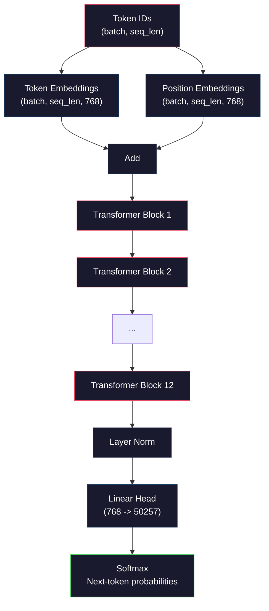
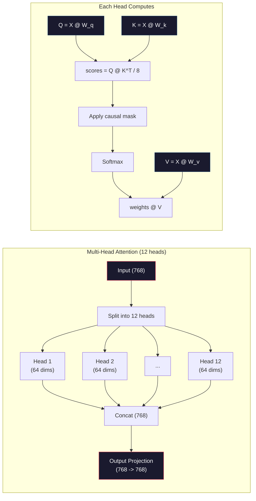
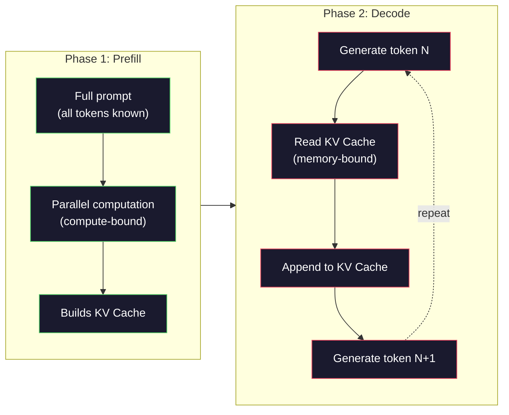

# 预训练一个迷你 GPT(1.24 亿参数)

> GPT-2 Small 有 1.24 亿参数：12 层 Transformer、12 个注意力头、768 维嵌入。用一张 GPU 几小时就能从零训出来。大多数人永远不会去做——他们直接用预训练检查点。但不亲手训一个，你就没有真正理解你拿来搭产品的那个模型内部在发生什么。

**类型：** Build
**编程语言：** Python（用 numpy)
**前置要求：** 第 10 阶段 第 01-03 课（分词器、构建分词器、数据流水线）
**预计耗时：** 约 120 分钟

## 学习目标

- 从零实现完整的 GPT-2 架构（1.24 亿参数）:token 嵌入、位置嵌入、Transformer 块和语言模型头
- 用下一 token 预测和交叉熵损失，在文本语料上训练 GPT 模型
- 实现带 temperature 采样和 top-k/top-p 过滤的自回归文本生成
- 监控训练损失曲线，验证模型学到了连贯的语言模式

## 问题

你知道 Transformer 是什么。你看过那些结构图。你能背出 "attention is all you need"，能在白板上画出标着 "Multi-Head Attention" 的方框。

这些都不等于你理解模型生成文本时发生了什么。

GPT-2 Small 里有 124,438,272 个参数（含权重共享）。其中每一个，都是训练循环跑出来的：前向传播、算损失、反向传播、更新权重。12 个 Transformer 块，每块 12 个注意力头，768 维嵌入空间，50,257 个 token 的词表。模型每生成一个 token，全部 1.24 亿参数都参与同一条矩阵乘法链：吃进一串 token ID，吐出下一个 token 的概率分布。

如果你从没亲手搭过它，你面对的就是一个黑盒。你会调 API，会微调。但当事情不对劲时——模型产生幻觉、原地复读、拒绝听指令——你没有一个能解释*为什么*的心智模型。

本课从零搭建 GPT-2 Small。不用 PyTorch，用 numpy。每一次矩阵乘法都摆在明处，每一个梯度都由你的代码算出。你会亲眼看到 1.24 亿个数字如何合谋预测下一个词。

## 概念

### GPT 架构

GPT 是自回归语言模型。"自回归"的意思是：一次生成一个 token，每个都以前面所有 token 为条件。架构就是一叠 Transformer 解码器块。

从 token ID 到下一 token 概率的完整计算图：

1. token ID 进来，形状：(batch_size, seq_len)。
2. token 嵌入查表：每个 ID 映射到一个 768 维向量，形状：(batch_size, seq_len, 768)。
3. 位置嵌入查表：每个位置（0, 1, 2, ...）映射到一个 768 维向量，形状相同。
4. token 嵌入 + 位置嵌入，相加。
5. 过 12 个 Transformer 块。
6. 最后的层归一化。
7. 线性投影到词表大小，形状：(batch_size, seq_len, vocab_size)。
8. softmax 得到概率。

这就是整个模型。没有卷积，没有循环。就是嵌入、注意力、前馈网络和层归一化，叠 12 层。



### Transformer 块

12 个块都遵循同一个模式。Pre-norm 架构（GPT-2 用 pre-norm，而不是原始 Transformer 的 post-norm):

1. LayerNorm
2. 多头自注意力
3. 残差连接（把输入加回来）
4. LayerNorm
5. 前馈网络（MLP)
6. 残差连接（把输入加回来）

残差连接至关重要。没有它，反向传播到第 1 块时梯度早就消失殆尽了。有了它，梯度可以沿"捷径"从损失直达任何一层。这就是为什么你能叠 12 层、32 层，甚至 96 层（据传 GPT-4 用了 120 层）。

### 注意力：核心机制

自注意力让每个 token 都能看到它之前的所有 token，并决定对每个分配多少注意力。数学如下。

对每个 token 位置，从输入算三个向量：
- **查询（Q):** "我在找什么？"
- **键（K):** "我装着什么？"
- **值（V):** "我携带什么信息？"

```
Q = input @ W_q    (768 -> 768)
K = input @ W_k    (768 -> 768)
V = input @ W_v    (768 -> 768)

attention_scores = Q @ K^T / sqrt(d_k)
attention_scores = mask(attention_scores)   # causal mask: -inf for future positions
attention_weights = softmax(attention_scores)
output = attention_weights @ V
```

因果掩码（causal mask）是让 GPT 成为自回归模型的关键：位置 5 可以注意位置 0-5，但不能注意 6、7、8……这防止模型在训练时"偷看"未来的 token。

**多头注意力**把 768 维空间切成 12 个头，每个 64 维。每个头学一种不同的注意力模式：一个头可能追踪句法关系（主谓一致），一个头追踪语义相似（同义词），还有一个追踪位置邻近（附近的词）。12 个头的输出拼接起来，再投影回 768 维。



除以 sqrt(d_k)——sqrt(64) = 8——是缩放。没有它，高维向量的点积会很大，把 softmax 推进梯度接近零的区域。这是《Attention Is All You Need》原始论文的关键洞察之一。

### KV 缓存：推理为什么快

训练时，整条序列一次处理完。推理时，一次只生成一个 token。不做优化的话，生成第 N 个 token 需要把前 N-1 个 token 的注意力全部重算：每个 token 是 O(N²)，整条长度为 N 的序列就是 O(N³)。

KV 缓存解决这个问题：每个 token 的 K 和 V 算完就存起来。生成第 N+1 个 token 时，只需为新 token 计算 Q，再查之前所有 token 缓存的 K 和 V。K 和 V 的计算成本从每 token O(N) 降到 O(1)。注意力分数计算仍是 O(N)（毕竟要注意所有历史位置），但输入上的冗余矩阵乘法省掉了。

GPT-2 有 12 层、12 头，KV 缓存每个 token 要存 2(K+V)× 12 层 × 12 头 × 64 维 = 18,432 个值。1024 token 的序列，FP32 下约 75MB。而 Llama 3 405B 有 128 层，单条序列的 KV 缓存能超过 10GB。这就是为什么长上下文推理是内存带宽受限的。

### Prefill 与 Decode：推理的两个阶段

你给 LLM 发一个提示词，推理分两个截然不同的阶段。

**Prefill（预填）** 并行处理整个提示词。所有 token 都已知，模型可以同时为所有位置计算注意力。这个阶段是算力受限的——GPU 满吞吐地做矩阵乘法。1000 token 的提示词，在 A100 上 prefill 大约 20-50ms。

**Decode（解码）** 一次生成一个 token，每个新 token 依赖之前所有 token。这个阶段是内存受限的——瓶颈在于从 GPU 显存读模型权重和 KV 缓存，而不是矩阵运算本身。GPU 的计算核心大多在干等内存读取。对 GPT-2 来说，不管矩阵乘法需要多少 FLOP，每步 decode 耗时都差不多，因为内存带宽才是约束。

这个区分对生产系统很重要：prefill 吞吐随 GPU 算力涨（FLOPS 越多 prefill 越快）;decode 吞吐随内存带宽涨（内存越快 decode 越快）。NVIDIA H100 相对 A100 主攻内存带宽提升，原因就在此——它直接加速 token 生成。



### 训练循环

训练 LLM 就是下一 token 预测：给定 token [0, 1, 2, ..., N-1]，预测 token [1, 2, 3, ..., N]。损失函数是模型预测的概率分布与真实下一 token 之间的交叉熵。

一步训练：

1. **前向传播：** 批次过完 12 个块，拿到每个位置的 logits(softmax 之前的分数）。
2. **计算损失：** logits 与目标 token（输入右移一位）之间的交叉熵。
3. **反向传播：** 用反向传播算法计算全部 1.24 亿参数的梯度。
4. **优化器步进：** 更新权重。GPT-2 用 Adam，带学习率预热和余弦衰减。

学习率调度的重要性超乎想象。GPT-2 在前 2,000 步从 0 预热到峰值学习率，然后按余弦曲线衰减。一开始就用高学习率会让模型发散；一直保持高学习率会让训练后期震荡。预热后衰减的模式，所有主流 LLM 都在用。

### GPT-2 Small：参数账本

| 组件 | 形状 | 参数量 |
|-----------|-------|------------|
| token 嵌入 | (50257, 768) | 38,597,376 |
| 位置嵌入 | (1024, 768) | 786,432 |
| 每块注意力（W_q, W_k, W_v, W_out) | 4 x (768, 768) | 2,359,296 |
| 每块 FFN（升维 + 降维） | (768, 3072) + (3072, 768) | 4,718,592 |
| 每块 LayerNorm(2 个） | 2 x 768 x 2 | 3,072 |
| 最终 LayerNorm | 768 x 2 | 1,536 |
| **每块合计** | | **7,080,960** |
| **总计（12 块）** | | **85,054,464 + 39,383,808 = 124,438,272** |

输出投影（logits 头）与 token 嵌入矩阵共享权重。这叫权重共享（weight tying)——省掉 3800 万参数，还提升性能，因为它强迫模型在输入和输出上使用同一表示空间。

## 动手构建

### 第 1 步：嵌入层

token 嵌入把 50,257 个可能的 token 各映射到一个 768 维向量；位置嵌入加入每个 token 在序列中位置的信息。两者相加。

```python
import numpy as np

class Embedding:
    def __init__(self, vocab_size, embed_dim, max_seq_len):
        self.token_embed = np.random.randn(vocab_size, embed_dim) * 0.02
        self.pos_embed = np.random.randn(max_seq_len, embed_dim) * 0.02

    def forward(self, token_ids):
        seq_len = token_ids.shape[-1]
        tok_emb = self.token_embed[token_ids]
        pos_emb = self.pos_embed[:seq_len]
        return tok_emb + pos_emb
```

初始化标准差 0.02 来自 GPT-2 论文。太大，初始前向传播会产生极端值，让训练失稳；太小，所有输入的初始输出几乎一样，早期梯度信号形同虚设。

### 第 2 步：带因果掩码的自注意力

先实现单头注意力。因果掩码在 softmax 之前把未来位置设为负无穷，保证每个位置只能注意到自己和更早的位置。

```python
def attention(Q, K, V, mask=None):
    d_k = Q.shape[-1]
    scores = Q @ K.transpose(0, -1, -2 if Q.ndim == 4 else 1) / np.sqrt(d_k)
    if mask is not None:
        scores = scores + mask
    weights = np.exp(scores - scores.max(axis=-1, keepdims=True))
    weights = weights / weights.sum(axis=-1, keepdims=True)
    return weights @ V
```

softmax 实现里先减最大值再取指数。不做这一步，exp（大数）会溢出成无穷。这是数值稳定性技巧，不改变输出，因为对任意常数 c 都有 softmax(x - c) = softmax(x)。

### 第 3 步：多头注意力

把 768 维输入切成 12 个头、每个 64 维，各自独立计算注意力，拼接结果再投影回 768 维。

```python
class MultiHeadAttention:
    def __init__(self, embed_dim, num_heads):
        self.num_heads = num_heads
        self.head_dim = embed_dim // num_heads
        self.W_q = np.random.randn(embed_dim, embed_dim) * 0.02
        self.W_k = np.random.randn(embed_dim, embed_dim) * 0.02
        self.W_v = np.random.randn(embed_dim, embed_dim) * 0.02
        self.W_out = np.random.randn(embed_dim, embed_dim) * 0.02

    def forward(self, x, mask=None):
        batch, seq_len, d = x.shape
        Q = (x @ self.W_q).reshape(batch, seq_len, self.num_heads, self.head_dim).transpose(0, 2, 1, 3)
        K = (x @ self.W_k).reshape(batch, seq_len, self.num_heads, self.head_dim).transpose(0, 2, 1, 3)
        V = (x @ self.W_v).reshape(batch, seq_len, self.num_heads, self.head_dim).transpose(0, 2, 1, 3)

        scores = Q @ K.transpose(0, 1, 3, 2) / np.sqrt(self.head_dim)
        if mask is not None:
            scores = scores + mask
        weights = np.exp(scores - scores.max(axis=-1, keepdims=True))
        weights = weights / weights.sum(axis=-1, keepdims=True)
        attn_out = weights @ V

        attn_out = attn_out.transpose(0, 2, 1, 3).reshape(batch, seq_len, d)
        return attn_out @ self.W_out
```

reshape-transpose-reshape 这套动作是多头注意力最容易绕晕的地方。过程是：(batch, seq_len, 768) 变成 (batch, seq_len, 12, 64)，再变成 (batch, 12, seq_len, 64)——现在 12 个头各自拿着一个 (seq_len, 64) 的矩阵跑注意力。注意力算完再逆着变回去：(batch, 12, seq_len, 64) → (batch, seq_len, 12, 64) → (batch, seq_len, 768)。

### 第 4 步：Transformer 块

一个完整的 Transformer 块：LayerNorm → 带残差的多头注意力 → LayerNorm → 带残差的前馈网络。

```python
class LayerNorm:
    def __init__(self, dim, eps=1e-5):
        self.gamma = np.ones(dim)
        self.beta = np.zeros(dim)
        self.eps = eps

    def forward(self, x):
        mean = x.mean(axis=-1, keepdims=True)
        var = x.var(axis=-1, keepdims=True)
        return self.gamma * (x - mean) / np.sqrt(var + self.eps) + self.beta


class FeedForward:
    def __init__(self, embed_dim, ff_dim):
        self.W1 = np.random.randn(embed_dim, ff_dim) * 0.02
        self.b1 = np.zeros(ff_dim)
        self.W2 = np.random.randn(ff_dim, embed_dim) * 0.02
        self.b2 = np.zeros(embed_dim)

    def forward(self, x):
        h = x @ self.W1 + self.b1
        h = np.maximum(0, h)  # GELU approximation: ReLU for simplicity
        return h @ self.W2 + self.b2


class TransformerBlock:
    def __init__(self, embed_dim, num_heads, ff_dim):
        self.ln1 = LayerNorm(embed_dim)
        self.attn = MultiHeadAttention(embed_dim, num_heads)
        self.ln2 = LayerNorm(embed_dim)
        self.ffn = FeedForward(embed_dim, ff_dim)

    def forward(self, x, mask=None):
        x = x + self.attn.forward(self.ln1.forward(x), mask)
        x = x + self.ffn.forward(self.ln2.forward(x))
        return x
```

前馈网络把 768 维输入升到 3,072 维（4 倍），过非线性，再投回 768。这个"扩张-收缩"模式让模型在每个位置上有一个"更宽"的内部表示可用。GPT-2 用 GELU 激活，这里为简单起见用 ReLU——对理解架构来说差别不大。

### 第 5 步：完整 GPT 模型

堆 12 个 Transformer 块，前面接嵌入层，后面接输出投影。

```python
class MiniGPT:
    def __init__(self, vocab_size=50257, embed_dim=768, num_heads=12,
                 num_layers=12, max_seq_len=1024, ff_dim=3072):
        self.embedding = Embedding(vocab_size, embed_dim, max_seq_len)
        self.blocks = [
            TransformerBlock(embed_dim, num_heads, ff_dim)
            for _ in range(num_layers)
        ]
        self.ln_f = LayerNorm(embed_dim)
        self.vocab_size = vocab_size
        self.embed_dim = embed_dim

    def forward(self, token_ids):
        seq_len = token_ids.shape[-1]
        mask = np.triu(np.full((seq_len, seq_len), -1e9), k=1)

        x = self.embedding.forward(token_ids)
        for block in self.blocks:
            x = block.forward(x, mask)
        x = self.ln_f.forward(x)

        logits = x @ self.embedding.token_embed.T
        return logits

    def count_parameters(self):
        total = 0
        total += self.embedding.token_embed.size
        total += self.embedding.pos_embed.size
        for block in self.blocks:
            total += block.attn.W_q.size + block.attn.W_k.size
            total += block.attn.W_v.size + block.attn.W_out.size
            total += block.ffn.W1.size + block.ffn.b1.size
            total += block.ffn.W2.size + block.ffn.b2.size
            total += block.ln1.gamma.size + block.ln1.beta.size
            total += block.ln2.gamma.size + block.ln2.beta.size
        total += self.ln_f.gamma.size + self.ln_f.beta.size
        return total
```

注意权重共享：`logits = x @ self.embedding.token_embed.T`。输出投影复用 token 嵌入矩阵（转置）。这不只是省参数的技巧——它意味着模型用同一个向量空间来理解 token（嵌入）和预测 token（输出）。

### 第 6 步：训练循环

真要训练 1.24 亿参数的模型，你需要 GPU 和 PyTorch。这个训练循环用一个能在纯 numpy 里跑的小模型来演示机制：4 层、4 头、128 维，这样才跑得动。

```python
def cross_entropy_loss(logits, targets):
    batch, seq_len, vocab_size = logits.shape
    logits_flat = logits.reshape(-1, vocab_size)
    targets_flat = targets.reshape(-1)

    max_logits = logits_flat.max(axis=-1, keepdims=True)
    log_softmax = logits_flat - max_logits - np.log(
        np.exp(logits_flat - max_logits).sum(axis=-1, keepdims=True)
    )

    loss = -log_softmax[np.arange(len(targets_flat)), targets_flat].mean()
    return loss


def train_mini_gpt(text, vocab_size=256, embed_dim=128, num_heads=4,
                   num_layers=4, seq_len=64, num_steps=200, lr=3e-4):
    tokens = np.array(list(text.encode("utf-8")[:2048]))
    model = MiniGPT(
        vocab_size=vocab_size, embed_dim=embed_dim, num_heads=num_heads,
        num_layers=num_layers, max_seq_len=seq_len, ff_dim=embed_dim * 4
    )

    print(f"Model parameters: {model.count_parameters():,}")
    print(f"Training tokens: {len(tokens):,}")
    print(f"Config: {num_layers} layers, {num_heads} heads, {embed_dim} dims")
    print()

    for step in range(num_steps):
        start_idx = np.random.randint(0, max(1, len(tokens) - seq_len - 1))
        batch_tokens = tokens[start_idx:start_idx + seq_len + 1]

        input_ids = batch_tokens[:-1].reshape(1, -1)
        target_ids = batch_tokens[1:].reshape(1, -1)

        logits = model.forward(input_ids)
        loss = cross_entropy_loss(logits, target_ids)

        if step % 20 == 0:
            print(f"Step {step:4d} | Loss: {loss:.4f}")

    return model
```

损失起点在 ln(vocab_size) 附近——256 个 token 的字节级词表，就是 ln(256) = 5.55。随机模型对每个 token 给相同概率。训练推进，损失下降，因为模型学会了预测常见模式："t" 后面常跟 "h"，句号后面常跟空格，诸如此类。

生产环境你会用 Adam 优化器，配梯度累积、学习率预热和梯度裁剪。"前向-损失-反向-更新"的循环一模一样，只是优化器更讲究。

### 第 7 步：文本生成

生成就是用训好的模型一次预测一个 token。每个预测从输出分布里采样（或者贪心取 argmax)。

```python
def generate(model, prompt_tokens, max_new_tokens=100, temperature=0.8):
    tokens = list(prompt_tokens)
    seq_len = model.embedding.pos_embed.shape[0]

    for _ in range(max_new_tokens):
        context = np.array(tokens[-seq_len:]).reshape(1, -1)
        logits = model.forward(context)
        next_logits = logits[0, -1, :]

        next_logits = next_logits / temperature
        probs = np.exp(next_logits - next_logits.max())
        probs = probs / probs.sum()

        next_token = np.random.choice(len(probs), p=probs)
        tokens.append(next_token)

    return tokens
```

temperature 控制随机性。1.0 用原始分布；0.5 让分布变尖（更确定——模型更常选头部选项）;1.5 让分布变平（更随机——低概率 token 机会变大）;0.0 是贪心解码（永远选概率最高的 token)。

`tokens[-seq_len:]` 这个窗口是必须的，因为模型有最大上下文长度（GPT-2 是 1024)。超过它，就得丢掉最老的 token。这就是大家天天挂在嘴边的"上下文窗口"。

```figure
sampling-decoder
```

## 投入使用

### 完整的训练与生成演示

```python
corpus = """The transformer architecture has revolutionized natural language processing.
Attention mechanisms allow the model to focus on relevant parts of the input.
Self-attention computes relationships between all pairs of positions in a sequence.
Multi-head attention splits the representation into multiple subspaces.
Each attention head can learn different types of relationships.
The feedforward network provides nonlinear transformations at each position.
Residual connections enable gradient flow through deep networks.
Layer normalization stabilizes training by normalizing activations.
Position embeddings give the model information about token ordering.
The causal mask ensures autoregressive generation during training.
Pre-training on large text corpora teaches the model general language understanding.
Fine-tuning adapts the pre-trained model to specific downstream tasks."""

model = train_mini_gpt(corpus, num_steps=200)

prompt = list("The transformer".encode("utf-8"))
output_tokens = generate(model, prompt, max_new_tokens=100, temperature=0.8)
generated_text = bytes(output_tokens).decode("utf-8", errors="replace")
print(f"\nGenerated: {generated_text}")
```

小语料配小模型，生成的文本最多算半连贯。它能学到训练文本里的一些字节级模式，但没法像 GPT-2 那样泛化——人家是 40GB 训练数据加完整的 1.24 亿参数架构。重点不是输出质量，而是你能追踪每一步：嵌入查找、注意力计算、前馈变换、logit 投影、softmax、采样。每个操作都摆在明处。

## 交付

本课产出 `outputs/prompt-gpt-architecture-analyzer.md` —— 一条分析任意 GPT 式模型架构选择的提示词。喂给它一份模型卡或技术报告，它会拆解参数分配、注意力设计和缩放决策。

## 练习

1. 把模型改成 24 层、16 头（原来是 12/12)，数一遍参数。深度翻倍和宽度（嵌入维度）翻倍，各是什么效果？

2. 实现 GELU 激活函数（GELU(x) = x * 0.5 * (1 + erf(x / sqrt(2))))，换掉前馈网络里的 ReLU。两种激活各训 500 步，对比最终损失。

3. 给生成函数加 KV 缓存：第一次前向传播后存下每层的 K、V 张量，后续 token 复用。测加速比：各生成 200 个 token，对比有无缓存的墙上时钟时间。

4. 实现 top-k 采样（只考虑概率最高的 k 个 token）和 top-p 采样（核采样：考虑累积概率超过 p 的最小 token 集合）。在 temperature 0.8 下对比 top-k=50 与 top-p=0.95 的输出质量。

5. 做一个训练损失曲线绘图器。训 1000 步，画出损失随步数的变化。认出三个阶段：初期速降（学常见字节）、中期缓降（学字节模式）、平台期（在小语料上过拟合）。这条曲线的形状，无论你训 128 维的小模型还是 GPT-4，都是一样的。

## 关键术语

| 术语 | 大家嘴里的说法 | 实际含义 |
|------|----------------|----------------------|
| 自回归 | "一个词一个词地生成" | 每个输出 token 以前面所有 token 为条件——模型预测 P(token_n \| token_0, ..., token_{n-1}) |
| 因果掩码 | "看不见未来" | 一个上三角的负无穷矩阵，训练时阻止对未来位置的注意力 |
| 多头注意力 | "多种注意力模式" | 把 Q、K、V 切成并行多头（GPT-2 是 12 头、每头 64 维），让每个头学不同类型的关系 |
| KV 缓存 | "提速用的缓存" | 存下之前 token 算好的 Key 和 Value 张量，避免自回归生成时的冗余计算 |
| Prefill | "处理提示词" | 推理第一阶段，所有提示词 token 并行处理——受 GPU 算力限制 |
| Decode | "生成 token" | 推理第二阶段，一次生成一个 token——受 GPU 内存带宽限制 |
| 权重共享 | "共享嵌入" | 输入 token 嵌入和输出投影头用同一个矩阵——GPT-2 省下 3800 万参数 |
| 残差连接 | "跳连" | 把输入直接加到子层输出上（x + sublayer(x))——让梯度在深网里流动 |
| 层归一化 | "归一化激活值" | 在特征维度上归一化到均值 0、方差 1，带可学习的缩放和偏置参数 |
| 交叉熵损失 | "预测错得有多离谱" | 正确下一 token 被赋予概率的负对数，对所有位置取平均——LLM 的标准训练目标 |

## 延伸阅读

- [Radford et al., 2019 -- "Language Models are Unsupervised Multitask Learners"(GPT-2)](https://cdn.openai.com/better-language-models/language_models_are_unsupervised_multitask_learners.pdf) —— 推出 1.24 亿到 15 亿参数家族的 GPT-2 论文
- [Vaswani et al., 2017 -- "Attention Is All You Need"](https://arxiv.org/abs/1706.03762) —— 原始 Transformer 论文，提出缩放点积注意力和多头注意力
- [Llama 3 技术报告](https://arxiv.org/abs/2407.21783) —— Meta 如何把 GPT 架构用 1.6 万张 GPU 扩到 4050 亿参数
- [Pope et al., 2022 -- "Efficiently Scaling Transformer Inference"](https://arxiv.org/abs/2211.05102) —— 把 prefill/decode 两阶段和 KV 缓存分析形式化的论文
