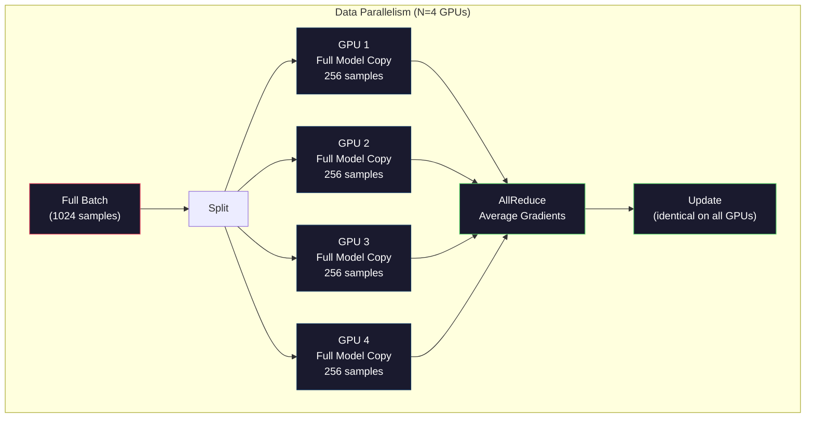
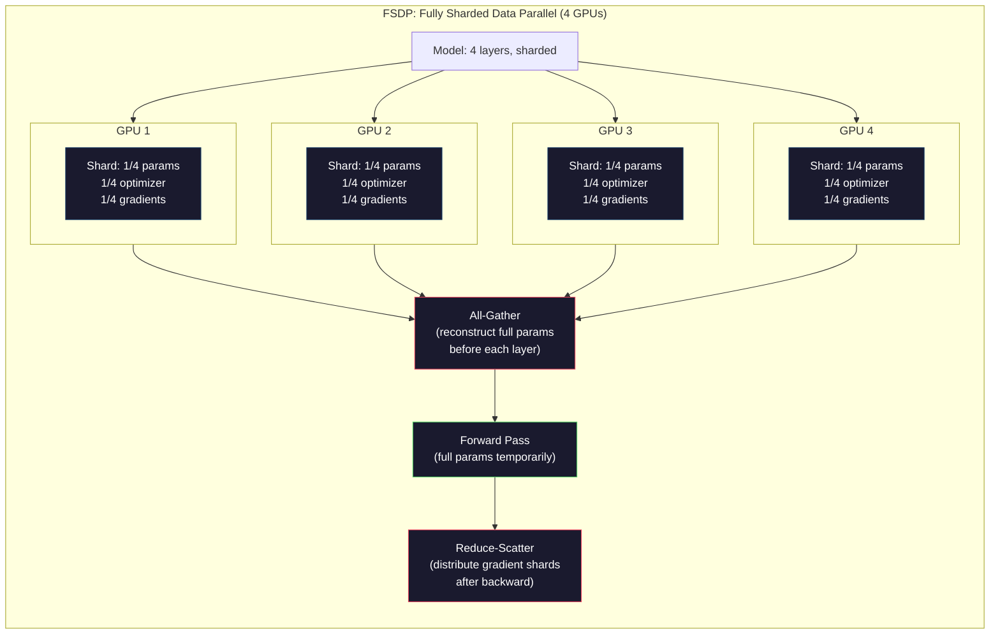
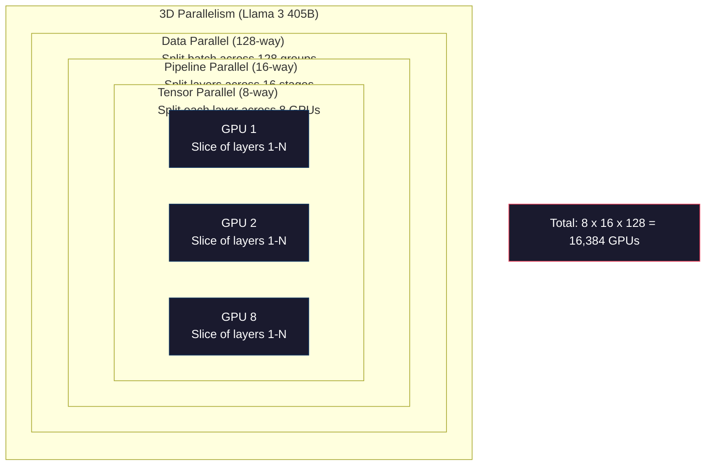

# 规模化：分布式训练、FSDP、DeepSpeed

> 你的 1.24 亿参数模型在一张 GPU 上训出来了。现在试试 70 亿参数：模型放不进显存，数据在单机上要跑几周。在这个规模上，分布式训练不是可选项，是唯一的路。

**类型：** Build
**编程语言：** Python
**前置要求：** 第 10 阶段 第 04 课（预训练迷你 GPT)
**预计耗时：** 约 120 分钟

## 学习目标

- 讲清三种并行（数据、张量、流水线）各自的适用场景——按模型和集群规模判断
- 用 PyTorch DDP 实现数据并行训练，跨多 GPU 同步梯度
- 为给定模型规模算内存账（权重 + 优化器状态 + 梯度 + 激活值），确定最低硬件配置
- 配置 FSDP 或 DeepSpeed ZeRO 各阶段，把模型状态分片到多卡，装进超过单卡显存的模型

## 问题

一个 7B 参数的模型，FP16 下光权重就要 14GB。Adam 优化器还要为每个参数多存两份副本（一阶和二阶动量估计），又是 28GB。反向传播的梯度再加 14GB。还没存任何激活值，已经 56GB 了。

一张 NVIDIA A100 有 80GB 显存。

80GB 用掉 56GB，剩下 24GB 给激活值——前向传播算出的中间值，必须留着给反向传播用。2048 token 的序列、4096 维的模型，单层激活约 64MB,32 层就是每样本 2GB。批次 8 要 16GB，你有 24GB；批次 12，直接爆。

再试 70B 参数。光权重：FP16 下 140GB，一张 GPU 放不下。至少要 2 张 A100(2 x 80GB = 160GB）才装得下权重。加上优化器状态和梯度，需求远不止：最低 3 张卡，按分片策略实际要 8-16 张。

Llama 3 405B 是在 16,384 张 NVIDIA H100 上训练的，训练算力成本估计 1 亿美元。DeepSeek V3 靠架构和训练效率上的巧劲，把同等级的模型训到了约 560 万美元（混合专家架构意味着每个 token 只激活一小部分参数）。

本课讲让大规模训练成为可能的四种策略：数据并行、张量并行、流水线并行和完全分片数据并行（FSDP)。你会先用纯 Python 把每一种模拟一遍，搞清楚机制，再去碰分布式训练框架。

## 概念

### 为什么必须分布式

这是真实模型的内存账。每个数字都是算出来的，不是估的。

| 模型 | 参数量 | 权重（FP16) | Adam 状态 | 梯度（FP16) | 合计（不含激活） |
|-------|--------|----------------|-------------|------------------|----------------------|
| GPT-2 Small | 124M | 248 MB | 992 MB | 248 MB | 1.5 GB |
| Llama 3 8B | 8B | 16 GB | 64 GB | 16 GB | 96 GB |
| Llama 3 70B | 70B | 140 GB | 560 GB | 140 GB | 840 GB |
| Llama 3 405B | 405B | 810 GB | 3,240 GB | 810 GB | 4,860 GB |

"Adam 状态"那一列才是杀手。Adam 为每个参数存一个滑动均值（m）和一个滑动方差（v)，都是 FP32。70B 模型就是 70B x 4 字节 x 2 = 560GB。光优化器就要 7 张 A100。

一张 H100 有 80GB。Llama 3 405B 光装权重、优化器和梯度，就至少要 61 张 H100，再加激活值还得更多。Meta 用了 16,384 张 GPU，不是想炫，是没得选。

### 数据并行

最简单的分布式策略。把整个模型复制到 N 张 GPU，每批训练数据切成 N 等份，每张 GPU 在自己的数据分片上前向、反向各跑一遍。反向传播结束后，把所有 GPU 的梯度取平均，每张 GPU 用同一份平均梯度更新自己的权重副本，保持所有副本同步。

**好处：** 吞吐线性增长，N 张卡每步处理 N 倍数据。通信只有梯度平均这一项，还能和计算重叠。

**坏处：** 每张 GPU 都持有完整的模型、优化器状态和梯度副本。70B 模型每张卡要 840GB。数据并行对降低单卡内存毫无帮助，只缩短训练时间。

**算账：** 有效批次大小 = 每卡批次 x N。64 张卡、每卡批次 16，有效批次就是 1,024。Llama 3 用的有效批次大小是每步 1600 万 token。



### 张量并行

把单一层切开，分到多张 GPU。一次矩阵乘法由多张 GPU 分担，各算结果的一部分。

考虑前馈层里一个 (8192, 8192) 的权重矩阵。4 路张量并行下，每张 GPU 持有 (8192, 2048) 的分片，各自用输入乘自己的分片，得到部分结果，再通过 all-reduce 或 all-gather 拼出完整输出。

**好处：** 降低单卡的模型权重内存。70B 模型切到 8 张卡，每卡只持有约 8.75B 参数的权重。

**坏处：** 每层之后都要快速的卡间通信，每次矩阵乘法后的 all-reduce 增加延迟。在 NVLink（同节点 GPU 间 900 GB/s）上表现好，跨节点的 InfiniBand(400 Gb/s，约 50 GB/s）上就很糟。张量并行几乎都限制在单节点内（8 张卡）。

**真实用法：** Megatron-LM 开创了张量并行。Llama 3 405B 在每个节点内用 8 路张量并行。

### 流水线并行

按层切模型。GPU 1 跑第 1-8 层，GPU 2 跑第 9-16 层，GPU 3 跑第 17-24 层，GPU 4 跑第 25-32 层。数据在流水线里流动：GPU 1 算完自己的层，把激活值发给 GPU 2,GPU 2 算完发给 GPU 3，依此类推。

**好处：** 卡间通信极少——只有层边界的激活值，相比梯度或权重小得多。带宽要求低，跨节点也行。

**坏处：** 流水线气泡。GPU 4 在给微批次 1 做前向时，GPU 1、2、3 是闲着的（它们那部分早算完了）。反向传播时反过来。朴素流水线里，N 级流水线的 GPU 利用率只有 1/N。

**GPipe 和 PipeDream** 用微批次切分解决气泡问题：GPU 1 一发完微批次 1，立刻开始微批次 2，让各级计算重叠。M 个微批次、N 级流水，气泡占比降到 (N-1)/M。16 个微批次配 4 级，气泡就是 3/16 = 18.75% 的空转时间。

### FSDP：完全分片数据并行

FSDP 把数据并行的可扩展性和分片的内存效率结合起来。每张 GPU 不再持有完整模型副本，只持有 1/N 的参数、梯度和优化器状态。

每层前向传播之前，FSDP 做一次 **all-gather**，把完整参数从所有 GPU 收集到每张卡的显存里；前向算完，各卡丢掉非本地参数。反向传播时再 all-gather 一次重建参数来算梯度；反向算完，**reduce-scatter** 把梯度分片分发出去，每张卡只存 1/N 的梯度。

**70B 模型、8 张卡的账：**

| 组件 | 不用 FSDP | 用 FSDP |
|-----------|-------------|-----------|
| 权重（FP16) | 每卡 140 GB | 每卡 17.5 GB |
| Adam 状态（FP32) | 每卡 560 GB | 每卡 70 GB |
| 梯度（FP16) | 每卡 140 GB | 每卡 17.5 GB |
| **合计** | **每卡 840 GB** | **每卡 105 GB** |

不用 FSDP,70B 模型塞不进一张 80GB 的卡。8 卡 FSDP，每卡 105GB——等等，还是塞不下。至少要 16 张卡才能压到每卡 80GB 以下，或者把 FSDP 和激活检查点（activation checkpointing，反向时重算激活而不是存下来）组合使用。

通信成本比普通数据并行高（每层前都要 all-gather)，但省下的内存让原本不可能的训练跑了起来。



### DeepSpeed ZeRO

DeepSpeed 的 ZeRO(Zero Redundancy Optimizer）和 FSDP 概念相同，是微软独立提出的。它定义三个阶段，分片逐级激进：

| 阶段 | 分片内容 | 内存节省 | 通信 |
|-------|--------|---------------|---------------|
| ZeRO-1 | 只分优化器状态 | 约 4 倍 | 与数据并行相同 |
| ZeRO-2 | + 梯度 | 约 8 倍 | 略多 |
| ZeRO-3 | + 参数 | 约 N 倍（N 张卡） | 每层 all-gather |

ZeRO-3 等价于 FSDP。名字不同，机制一样。DeepSpeed 先验证了概念，PyTorch 随后把 FSDP 做成了原生实现。

DeepSpeed 还推出了 ZeRO-Offload（把优化器状态卸载到更便宜更大的 CPU 内存）和 ZeRO-Infinity（卸载到 NVMe SSD)。这是拿计算速度换内存容量：卸载操作更慢，但腾出了 GPU 显存。

### 混合精度训练

现代训练同时用好几种浮点格式：

- **前向传播：** FP16 或 BF16(16 位），内存是 FP32 的一半，矩阵乘在 Tensor Core 上快 2 倍。
- **主权重：** FP32(32 位），由优化器维护，保证权重更新的数值精度。
- **损失缩放：** 反向传播前把损失乘一个大常数，防止 FP16 梯度下溢成零；优化器步进前再除以同一个常数。

BF16(Brain Float 16）指数范围和 FP32 一样（8 位指数），但精度更低（7 位尾数，FP32 是 23 位）。它能表示和 FP32 相同的数值范围，所以基本不需要损失缩放。FP16 是 5 位指数、10 位尾数——细粒度好，但极端数值会溢出/下溢。

Google TPU 原生用 BF16,NVIDIA A100、H100 两种都支持。行业基本转到了 BF16，因为它消灭了损失缩放的麻烦。

**7B 模型的内存对比：**

| 精度 | 权重 | 优化器 | 梯度 | 合计 |
|-----------|---------|-----------|-----------|-------|
| 全 FP32 | 28 GB | 56 GB | 28 GB | 112 GB |
| 混合（BF16 + FP32 主权重） | 14 GB | 56 GB | 14 GB | 84 GB |

混合精度在这个模型上省 28GB。优化器状态无论如何都是 FP32——大头在这儿。

### Megatron-LM 与 3D 并行

真实的大规模训练把三种并行组合起来：

- **数据并行**跨节点组（放大批次）
- **张量并行**在节点内（把层切到 8 张卡）
- **流水线并行**跨节点（把层组切到多台机器）

Llama 3 405B 在 16,384 张 H100 上：
- 节点内 8 路张量并行（每节点 8 卡）
- 跨节点 16 路流水线并行（16 个流水级）
- 剩余维度 128 路数据并行（16,384 / 8 / 16 = 128)

这个 3D 分解（8 x 16 x 128 = 16,384）就是扩到成千上万张卡的方法。每张 GPU 看到不同的数据分片（数据并行）、持有每层的一个切片（张量并行）、计算不同的一组层（流水线并行）。

DeepSeek V3 走了另一条路。他们的混合专家架构每个 token 只激活 671B 参数中的 37B，意味着每张 GPU 只需为活跃参数计算（并保存激活值）。他们只用了 2,048 张 H800——不到 Meta 卡数的八分之一——560 万美元对 Meta 约 1 亿美元。



```figure
paged-kv-cache
```

## 动手构建

### 第 1 步：模拟数据并行

把一批数据切到模拟的 GPU 上，每张"卡"在自己的分片上前向一遍，平均"梯度"（我们用损失值模拟）。

```python
import numpy as np

def simulate_data_parallelism(data, num_gpus, model_fn):
    batch_size = len(data)
    shard_size = batch_size // num_gpus
    remainder = batch_size % num_gpus

    gpu_losses = []
    gpu_gradients = []

    offset = 0
    for gpu_id in range(num_gpus):
        extra = 1 if gpu_id < remainder else 0
        shard = data[offset:offset + shard_size + extra]
        offset += shard_size + extra

        loss, grad = model_fn(shard)
        gpu_losses.append(loss)
        gpu_gradients.append(grad)

    avg_loss = np.mean(gpu_losses)
    avg_gradient = np.mean(gpu_gradients, axis=0)

    return avg_loss, avg_gradient
```

all-reduce（平均梯度）是数据并行里唯一的通信。实际用的是 NVIDIA GPU 上的 NCCL 库，实现的是环形 all-reduce：每张卡把 1/N 的梯度发给邻居、从另一个邻居收 1/N,N-1 步之后每张卡都拿到完整平均值。总通信量：2 x 梯度大小 x (N-1)/N,N 大时趋近梯度大小的 2 倍。

### 第 2 步：模拟张量并行

把权重矩阵切到多张"卡"上，各算一部分矩阵乘法，再拼起来。

```python
def simulate_tensor_parallelism(input_data, weight_matrix, num_gpus):
    d_in, d_out = weight_matrix.shape
    assert d_out % num_gpus == 0, f"d_out {d_out} not divisible by num_gpus {num_gpus}"
    shard_size = d_out // num_gpus

    partial_results = []
    for gpu_id in range(num_gpus):
        start = gpu_id * shard_size
        end = start + shard_size
        weight_shard = weight_matrix[:, start:end]

        partial = input_data @ weight_shard
        partial_results.append(partial)

    full_output = np.concatenate(partial_results, axis=-1)

    direct_output = input_data @ weight_matrix
    error = np.abs(full_output - direct_output).max()

    return full_output, error
```

误差应该恰好为零（或机器精度）。张量并行在数学上是精确的——和单卡算完整矩阵乘法结果相同。切分沿输出维度，每张卡产出不同的一段列，拼接即还原。

列并行线性层（切输出维度）用拼接；行并行（切输入维度）用求和。Transformer 的 FFN 里，第一个线性层（扩张）用列并行，第二个（收缩）用行并行，这样两层之间就省掉一次 all-reduce。

### 第 3 步：模拟流水线并行

把模型的层切到虚拟 GPU 上，展示气泡问题：后级在算的时候，前级闲着。

```python
def simulate_pipeline_parallelism(num_layers, num_stages, num_microbatches):
    layers_per_stage = num_layers // num_stages

    timeline = {}
    clock = 0

    for mb in range(num_microbatches):
        for stage in range(num_stages):
            start_time = max(
                timeline.get((stage, mb - 1, "fwd"), (0, 0))[1] if mb > 0 else 0,
                timeline.get((stage - 1, mb, "fwd"), (0, 0))[1] if stage > 0 else 0,
            )
            end_time = start_time + layers_per_stage
            timeline[(stage, mb, "fwd")] = (start_time, end_time)

    last_fwd_end = max(v[1] for v in timeline.values())

    for mb in range(num_microbatches - 1, -1, -1):
        for stage in range(num_stages - 1, -1, -1):
            deps = [last_fwd_end]
            if mb < num_microbatches - 1 and (stage, mb + 1, "bwd") in timeline:
                deps.append(timeline[(stage, mb + 1, "bwd")][1])
            if stage < num_stages - 1 and (stage + 1, mb, "bwd") in timeline:
                deps.append(timeline[(stage + 1, mb, "bwd")][1])
            start_time = max(deps)
            end_time = start_time + layers_per_stage
            timeline[(stage, mb, "bwd")] = (start_time, end_time)

    total_time = max(v[1] for v in timeline.values())
    compute_time = num_microbatches * num_stages * layers_per_stage * 2
    bubble_fraction = 1.0 - compute_time / (total_time * num_stages)

    return timeline, total_time, bubble_fraction
```

4 级流水、1 个微批次，气泡占比 75%——任何时刻四分之三的 GPU 在空转。16 个微批次，降到约 19%。消灭气泡的代价是内存：所有在途微批次的激活值都得同时存着。

### 第 4 步：内存计算器

精确计算任意规模模型的训练内存需求。

```python
def memory_calculator(
    params_billions,
    precision_bytes=2,
    optimizer="adam",
    num_gpus=1,
    sharding="none",
    sequence_length=2048,
    batch_size_per_gpu=1,
    hidden_dim=None,
    num_layers=None,
):
    params = params_billions * 1e9

    weight_memory = params * precision_bytes

    if optimizer == "adam":
        optimizer_memory = params * 4 * 2
    elif optimizer == "sgd":
        optimizer_memory = params * 4
    else:
        optimizer_memory = 0

    gradient_memory = params * precision_bytes

    total_no_activation = weight_memory + optimizer_memory + gradient_memory

    if hidden_dim and num_layers:
        activation_per_layer = (
            sequence_length * batch_size_per_gpu * hidden_dim * precision_bytes * 4
        )
        activation_memory = activation_per_layer * num_layers
    else:
        activation_memory = params * precision_bytes * 0.5

    if sharding == "fsdp" or sharding == "zero3":
        weight_memory /= num_gpus
        optimizer_memory /= num_gpus
        gradient_memory /= num_gpus
    elif sharding == "zero2":
        optimizer_memory /= num_gpus
        gradient_memory /= num_gpus
    elif sharding == "zero1":
        optimizer_memory /= num_gpus

    per_gpu_total = weight_memory + optimizer_memory + gradient_memory + activation_memory

    return {
        "params_billions": params_billions,
        "weights_gb": weight_memory / 1e9,
        "optimizer_gb": optimizer_memory / 1e9,
        "gradients_gb": gradient_memory / 1e9,
        "activations_gb": activation_memory / 1e9,
        "per_gpu_total_gb": per_gpu_total / 1e9,
        "total_across_gpus_gb": per_gpu_total * num_gpus / 1e9,
        "fits_on_80gb": per_gpu_total / 1e9 <= 80,
        "num_gpus": num_gpus,
        "sharding": sharding,
    }
```

这个计算器回答每个 ML 工程师都问的问题："我需要几张卡？"喂给它模型规模，看装不装得下；调整分片策略，直到每卡总量低于 80GB。

### 第 5 步：混合精度模拟

对比 FP32、FP16 和混合精度训练的内存占用。

```python
def mixed_precision_comparison(params_billions):
    params = params_billions * 1e9

    fp32_weights = params * 4
    fp32_optimizer = params * 4 * 2
    fp32_gradients = params * 4
    fp32_total = fp32_weights + fp32_optimizer + fp32_gradients

    fp16_weights = params * 2
    fp16_master = params * 4
    fp16_optimizer = params * 4 * 2
    fp16_gradients = params * 2
    fp16_total = fp16_weights + fp16_master + fp16_optimizer + fp16_gradients

    mixed_weights = params * 2
    mixed_optimizer = params * 4 * 2
    mixed_gradients = params * 2
    mixed_total = mixed_weights + mixed_optimizer + mixed_gradients

    return {
        "fp32_total_gb": fp32_total / 1e9,
        "fp16_with_master_gb": fp16_total / 1e9,
        "mixed_bf16_gb": mixed_total / 1e9,
        "savings_vs_fp32": 1 - mixed_total / fp32_total,
    }
```

大多数人最意外的一点：混合精度并不省一半内存。优化器状态（Adam 的 m 和 v）无论如何都是 FP32。7B 模型，FP32 训练要 112GB，混合精度 84GB——省 25%，不是 50%。优化器才是大头。

## 投入使用

### 跑全部模拟

```python
def run_all_demos():
    print("=" * 70)
    print("DATA PARALLELISM SIMULATION")
    print("=" * 70)

    np.random.seed(42)
    data = np.random.randn(64, 32)
    weight = np.random.randn(32, 16)

    def model_fn(batch):
        output = batch @ weight
        loss = np.mean(output ** 2)
        grad = 2 * batch.T @ (batch @ weight) / len(batch)
        return loss, grad

    for n_gpus in [1, 2, 4, 8]:
        loss, grad = simulate_data_parallelism(data, n_gpus, model_fn)
        print(f"  {n_gpus} GPUs: loss={loss:.4f}, grad_norm={np.linalg.norm(grad):.4f}")

    print()
    print("=" * 70)
    print("TENSOR PARALLELISM SIMULATION")
    print("=" * 70)

    x = np.random.randn(4, 8192)
    W = np.random.randn(8192, 8192)

    for n_gpus in [1, 2, 4, 8]:
        output, error = simulate_tensor_parallelism(x, W, n_gpus)
        print(f"  {n_gpus} GPUs: output_shape={output.shape}, max_error={error:.2e}")

    print()
    print("=" * 70)
    print("PIPELINE PARALLELISM SIMULATION")
    print("=" * 70)

    for n_mb in [1, 4, 8, 16, 32]:
        _, total_t, bubble = simulate_pipeline_parallelism(32, 4, n_mb)
        print(f"  {n_mb:2d} micro-batches: total_time={total_t:4d}, bubble={bubble:.1%}")

    print()
    print("=" * 70)
    print("MEMORY CALCULATOR")
    print("=" * 70)

    configs = [
        (7, "none", 1),
        (7, "fsdp", 8),
        (70, "none", 1),
        (70, "fsdp", 8),
        (70, "fsdp", 16),
        (405, "fsdp", 64),
        (405, "fsdp", 128),
    ]

    print(f"  {'Model':>8} {'Sharding':>8} {'GPUs':>5} {'Per-GPU':>10} {'Fits 80GB':>10}")
    print("  " + "-" * 50)
    for params, shard, gpus in configs:
        result = memory_calculator(params, num_gpus=gpus, sharding=shard)
        fits = "Yes" if result["fits_on_80gb"] else "No"
        print(f"  {params:>6}B {shard:>8} {gpus:>5} {result['per_gpu_total_gb']:>8.1f}GB {fits:>10}")

    print()
    print("=" * 70)
    print("MIXED PRECISION COMPARISON")
    print("=" * 70)

    for params_b in [7, 13, 70, 405]:
        result = mixed_precision_comparison(params_b)
        print(f"  {params_b}B: FP32={result['fp32_total_gb']:.0f}GB, "
              f"Mixed BF16={result['mixed_bf16_gb']:.0f}GB, "
              f"Savings={result['savings_vs_fp32']:.0%}")
```

## 交付

本课产出 `outputs/prompt-distributed-training-planner.md` —— 一条输入模型规模和可用硬件、产出完整分布式训练方案的提示词：并行策略、内存预算、通信开销和预期吞吐。

## 练习

1. 给内存计算器加上激活检查点：开启后只在每第 K 层存激活（典型 K=1，即全部重算）。展示内存-算力权衡：检查点省多少内存，拖慢多少训练（全量检查点约多 33% 计算量）?

2. 扩展流水线并行模拟，实现 PipeDream 用的 1F1B（一次前向、一次反向）调度。对 4 级流水、8 个微批次，对比它和朴素调度的气泡占比。1F1B 更早开始反向传播，峰值内存应该更小。

3. 实现梯度累积模拟器：不在每个微批次后 all-reduce，而是本地累积 K 步再 all-reduce。展示它如何把通信减少 K 倍，而最终梯度完全相同（训练结果因此相同）。

4. 做一个成本估算器：输入模型规模、目标 token 数、GPU 型号（A100 $2/小时、H100 $3.50/小时）和并行策略，估算训练总成本（美元）。用已知成本校验：Llama 3 405B 据报道约 1 亿美元，DeepSeek V3 约 560 万美元。

5. 给内存计算器加 ZeRO-Offload：假设每节点 CPU 内存 512GB、NVMe 2TB。展示把优化器状态卸载到 CPU 后，70B 模型如何用 4 张卡（而不是 16 张）训练，代价是优化器步进慢 30-50%。

## 关键术语

| 术语 | 大家嘴里的说法 | 实际含义 |
|------|----------------|----------------------|
| 数据并行 | "把模型复制到每张卡" | 每张 GPU 处理不同的数据分片，每步之后用 all-reduce 平均梯度 |
| 张量并行 | "把一层切到多卡" | 切分权重矩阵，每张 GPU 算矩阵乘的一部分，需要 NVLink 高速互联 |
| 流水线并行 | "把层切到多卡" | 每张 GPU 跑不同的一组层，数据沿流水线流动，用微批次减少气泡 |
| FSDP | "全都分片" | 完全分片数据并行——每张 GPU 只持有 1/N 的权重、梯度和优化器状态，计算前 all-gather |
| ZeRO | "DeepSpeed 版 FSDP" | Zero Redundancy Optimizer，三个阶段：分优化器（1 阶）、加梯度（2 阶）、加参数（3 阶） |
| All-reduce | "跨卡取平均" | 集合通信操作，每张 GPU 最终拿到所有 GPU 输入的和（或平均）——典型实现是环形 all-reduce |
| All-gather | "从所有卡收集" | 集合通信操作，每张 GPU 最终拿到所有 GPU 数据的拼接——FSDP 用它重建完整参数 |
| Reduce-scatter | "求和再分发" | 集合通信操作，先归约（求和）再把不同块散到不同 GPU——FSDP 用它做梯度分片 |
| 混合精度 | "半精度训练" | 前向/反向用 FP16/BF16，优化器状态用 FP32——省约 25% 内存，不是 50%，因为优化器是大头 |
| 流水线气泡 | "流水线里的空转" | GPU 干等上一级数据的时间占比——增加微批次可以降低 |

## 延伸阅读

- [Rajbhandari et al., 2020 -- "ZeRO: Memory Optimizations Toward Training Trillion Parameter Models"](https://arxiv.org/abs/1910.02054) —— 定义三个分片阶段的 DeepSpeed ZeRO 论文
- [Shoeybi et al., 2020 -- "Megatron-LM: Training Multi-Billion Parameter Language Models Using Model Parallelism"](https://arxiv.org/abs/1909.08053) —— NVIDIA 的 Transformer 张量并行
- [Narayanan et al., 2021 -- "Efficient Large-Scale Language Model Training on GPU Clusters Using Megatron-LM"](https://arxiv.org/abs/2104.04473) —— 数据、张量、流水线三合一的 3D 并行
- [Zhao et al., 2023 -- "PyTorch FSDP: Experiences on Scaling Fully Sharded Data Parallel"](https://arxiv.org/abs/2304.11277) —— PyTorch 原生 FSDP 实现
- [Llama 3 技术报告](https://arxiv.org/abs/2407.21783) —— 16,384 张 GPU、3D 并行细节
- [DeepSeek-V3 技术报告](https://arxiv.org/abs/2412.19437) —— MoE 架构如何把训练成本压低一个数量级
