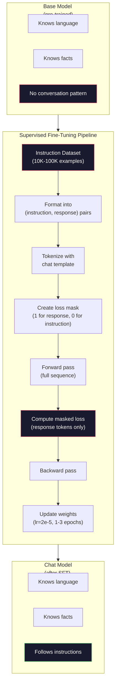

# 指令微调（SFT)

> 基座模型只会预测下一个 token，仅此而已。它不会听从指令、回答问题，也不会拒绝有害请求。SFT 是 token 预测器与好用助手之间的桥梁。你聊过的每一个模型——Claude、GPT、Llama Chat——都走过这一步。

**类型：** Build
**编程语言：** Python（用 numpy)
**前置要求：** 第 10 阶段 第 04 课（预训练迷你 GPT)
**预计耗时：** 约 90 分钟

## 学习目标

- 实现监督微调（SFT)，把基座语言模型变成听从指令的助手
- 用带 system、user、assistant 角色的对话模板格式化训练数据，并对非 assistant 的 token 屏蔽损失
- 解释 SFT 为什么必要：基座模型只会续写文本，不会回答问题
- 在留出的指令集上对比基座模型和微调模型的回答，评估 SFT 质量

## 问题

你在第 04 课训练了一个模型。给它一个序列，它能预测下一个 token。喂它 "The transformer architecture"，它可能接上 "has revolutionized natural language processing"。对一个下一 token 预测器来说，这很了不起。

现在试试：喂它 "What is the capital of France?" 基座模型不会回答 "Paris"。它只会延续模式——可能产出 "What is the capital of Germany? What is the capital of Spain?"，因为它在满是问题列表的文档上训练过；也可能产出 "is a question that many people ask"，因为这是个合理的续写。模型没有*回答*的概念，它只懂*续写*。

这就是 GPT-3（基座模型，2020 年 6 月发布）和 ChatGPT（指令微调，2022 年 11 月发布）之间的差距。同样的架构，同样的预训练。区别是 2 万到 10 万条精心制作的（指令， 回答）对，它们教会了模型对话的模式。

斯坦福 Alpaca 证明了你不需要几百万条样本。2023 年 3 月，他们只用 GPT-3.5 生成的 5.2 万条指令-回答对微调了 Llama 7B，总成本 600 美元。结果是一个能听指令、答问题、聊起来的聊天机器人。不如 ChatGPT，但 600 美元加几小时训练就能逼近到那个程度，令人震惊。

Meta 的 Llama 2 Chat 第一阶段 SFT 只用了约 2.7 万条高质量样本。关键洞察：质量比数量重要。熟练标注员写的 2.7 万条，胜过从互联网刮来的 100 万条噪声样本。

## 概念

### SFT 到底做了什么

监督微调延续预训练那个训练循环——前向传播、算损失、反向传播、更新权重——只是数据换了一种。不再用原始文本，而是结构化的对话：

```json
{
  "system": "You are a helpful assistant.",
  "user": "What is the capital of France?",
  "assistant": "The capital of France is Paris."
}
```

模型早就知道巴黎是法国首都——预训练时它在维基百科、教科书和网页上学过了。SFT 不教模型新事实，它教模型一种新*行为*：看到问题，给出回答；看到指令，给出执行结果；看到有害请求，给出拒绝。

这么说吧：预训练给模型知识，SFT 给模型教养。

### 数据格式

三种格式统治业界。它们编码的信息一样——谁说了什么——只是分隔符不同。

**Alpaca 格式**（斯坦福，2023 年 3 月）:

```json
{
  "instruction": "Summarize the following article in 3 sentences.",
  "input": "The European Central Bank raised interest rates...",
  "output": "The ECB increased rates by 25 basis points..."
}
```

简单，用得广。`input` 字段可选——很多指令不需要额外上下文。斯坦福用这个格式发布了 5.2 万条样本，GPT-3.5 生成，成本 600 美元。开源指令微调运动由此引爆。

**ShareGPT 格式**（社区，2023):

```json
{
  "conversations": [
    {"from": "system", "value": "You are a helpful assistant."},
    {"from": "human", "value": "What causes tides?"},
    {"from": "gpt", "value": "Tides are caused by the gravitational pull of the Moon..."},
    {"from": "human", "value": "How often do they occur?"},
    {"from": "gpt", "value": "Most coastal areas experience two high tides and two low tides per day..."}
  ]
}
```

支持多轮对话。"from" 字段按惯例用 "human" 和 "gpt"，不管实际是什么模型。Vicuna 就是用从用户分享的 ChatGPT 对话记录里刮来的 7 万条 ShareGPT 对话训练的。

**ChatML 格式**（OpenAI，被很多开源模型采用）:

```
<|im_start|>system
You are a helpful assistant.<|im_end|>
<|im_start|>user
What is the capital of France?<|im_end|>
<|im_start|>assistant
The capital of France is Paris.<|im_end|>
```

用特殊 token(`<|im_start|>`、`<|im_end|>`）分隔角色。这些 token 在微调时加进分词器词表。Qwen、Yi 等许多模型用 ChatML。

三种格式殊途同归：告诉模型"这是指令，这是回答，学这个模式"。

### 为什么有效

模型在预训练时已经学会了语言。它见过几十亿个"问题后面跟回答""指令后面跟执行""人和人对话"的例子。这些模式本来就编码在权重里。

SFT 做的是把这种潜伏的能力集中激发出来。模型不再需要根据上下文猜"我该回答问题还是续写文档"——SFT 直接在对话模式上训练。几千条样本之后，模型就学会了：看到 assistant 角色标记，就给出有用的回答。

这就是为什么 2.7 万条样本就够。你不是在教它英语，不是在教它世界知识。你在教它一个单纯的行为：回应指令。知识早就在那里了。

### 掩码损失（Masked Loss)

这是 SFT 里最重要的技术细节，而大多数教程都跳过了它。

预训练时，你对每个 token 计算损失，模型学着预测序列里每一个下一个 token。SFT 时，你只对*回答*部分的 token 计算损失。指令 token 在那里提供上下文，但模型不会因为"预测"错它们而受罚。

为什么？因为你不希望模型学会*生成*指令，你希望它学会*回应*指令。如果对指令 token 也计算损失，你就是在训练模型去预测 "What is the capital of France?"——好像它是提问的那个人。这既浪费梯度信号，还会让模型搞不清自己的角色。

实践中，你创建一个损失掩码：回答 token 为 1，指令 token 为 0。把每个 token 的损失乘上这个掩码，再取平均。

```
Tokens:    [SYS] You are helpful [USER] What is the capital? [ASST] Paris is the capital [EOS]
Loss mask:   0    0    0     0      0     0   0  0     0       1     1    1   1     1      1
```

只有 `[ASST]` 之后的 token 贡献损失。前向传播时模型看到完整对话（它需要指令才能给出正确回答），但权重更新只取决于它对回答预测得有多好。

### 训练超参数

SFT 的超参数和预训练截然不同。你不是从零训练，而是在调整一个已经能用的模型。

| 参数 | 预训练（Llama 2 7B) | SFT(Llama 2 Chat) |
|-----------|---------------------------|---------------------|
| 学习率 | 3e-4（峰值） | 2e-5 |
| epoch 数 | 1（数据过一遍） | 2 |
| 批次大小 | 400 万 token | 64 条样本 |
| 预热步数 | 2,000 | 0-100 |
| 权重衰减 | 0.1 | 0.0-0.1 |
| 数据规模 | 2 万亿 token | 2.7 万条样本 |

SFT 的学习率低了 15 倍。这很关键：微调时用高学习率会摧毁预训练的知识。模型会"忘记"学过的东西，过拟合到小小的微调数据集上。这就是灾难性遗忘（catastrophic forgetting)。

两个 epoch 意味着模型把每条训练样本看两遍。小数据集上超过 3 个 epoch 就会走向死记——模型开始逐字复述训练样本，而不是泛化。

### 灾难性遗忘

微调可能摧毁通用能力。在指令数据上训太久，模型会丢掉写代码、做数学、创作文本的能力。它变得只擅长训练数据的那种特定格式，其他一塌糊涂。

三种缓解手段：

1. **低学习率。** 1e-5 到 5e-5。更新越小，对预训练特征的破坏越小。

2. **短训练。** 1-3 个 epoch。在过拟合之前收手。

3. **混入预训练数据。** Llama 2 Chat 在 SFT 数据里掺了一小部分（2-5%）原始预训练数据。这在学习新的指令行为的同时，"提醒"模型别忘了通用能力。

### 真实数字

在单张 NVIDIA A100 80GB 上，用 1 万条高质量指令对微调一个 7B 模型，大约 1 小时。账这么算：

- 1 万条样本 x 平均 512 token = 512 万 token
- 2 个 epoch = 总共 1,024 万 token
- A100 微调 7B 模型的吞吐：约 3,000 token/秒
- 1,024 万 / 3,000 ≈ 3,400 秒 ≈ 57 分钟

对我们的迷你 GPT(4 层、128 维）来说，训练几乎是瞬时的。重点是搞懂机制，不是规模。



```figure
loss-masking
```

## 动手构建

### 第 1 步：指令数据集

造一个合成指令数据集。生产环境里，Scale AI、Anthropic 这类公司雇人类标注员来写。我们以编程方式生成，用来演示格式。

```python
import numpy as np

INSTRUCTION_DATA = [
    {
        "instruction": "What is the capital of France?",
        "response": "The capital of France is Paris."
    },
    {
        "instruction": "Explain gravity in one sentence.",
        "response": "Gravity is the force that attracts objects with mass toward each other."
    },
    {
        "instruction": "Write a haiku about the ocean.",
        "response": "Waves crash on the shore, salt and foam beneath the sun, endless blue expanse."
    },
    {
        "instruction": "What is 15 multiplied by 7?",
        "response": "15 multiplied by 7 is 105."
    },
    {
        "instruction": "Name three programming languages.",
        "response": "Three programming languages are Python, Rust, and TypeScript."
    },
    {
        "instruction": "Summarize photosynthesis.",
        "response": "Photosynthesis converts sunlight, water, and carbon dioxide into glucose and oxygen."
    },
    {
        "instruction": "What year did World War II end?",
        "response": "World War II ended in 1945."
    },
    {
        "instruction": "Define machine learning.",
        "response": "Machine learning is a field where algorithms learn patterns from data to make predictions."
    },
]
```

8 条样本确实少得可怜，斯坦福 Alpaca 用了 5.2 万条。但机制一模一样，不管你有 8 条还是 5.2 万条：分词、掩码、只对回答算损失。

### 第 2 步：用对话模板分词

把指令-回答对转成带角色标记的 token 序列。标记告诉模型指令在哪里结束、回答从哪里开始。

```python
SPECIAL_TOKENS = {
    "INST_START": 253,
    "INST_END": 254,
    "RESP_START": 255,
}


def tokenize_instruction_pair(instruction, response, vocab_size=256):
    inst_tokens = list(instruction.encode("utf-8"))
    resp_tokens = list(response.encode("utf-8"))

    inst_tokens = [min(t, vocab_size - 4) for t in inst_tokens]
    resp_tokens = [min(t, vocab_size - 4) for t in resp_tokens]

    tokens = (
        [SPECIAL_TOKENS["INST_START"]]
        + inst_tokens
        + [SPECIAL_TOKENS["INST_END"]]
        + [SPECIAL_TOKENS["RESP_START"]]
        + resp_tokens
    )

    return tokens


def create_loss_mask(tokens):
    mask = np.zeros(len(tokens), dtype=np.float32)
    in_response = False

    for i, token in enumerate(tokens):
        if token == SPECIAL_TOKENS["RESP_START"]:
            in_response = True
            continue
        if in_response:
            mask[i] = 1.0

    return mask
```

损失掩码在指令 token 上全为 0，在回答 token 上全为 1。`RESP_START` 这个 token 本身的掩码是 0，因为它是分隔符，不是回答内容。

### 第 3 步：掩码交叉熵损失

标准交叉熵，乘上损失掩码。只有回答 token 贡献梯度。

```python
def masked_cross_entropy_loss(logits, targets, loss_mask):
    batch, seq_len, vocab_size = logits.shape
    logits_flat = logits.reshape(-1, vocab_size)
    targets_flat = targets.reshape(-1)
    mask_flat = loss_mask.reshape(-1)

    max_logits = logits_flat.max(axis=-1, keepdims=True)
    log_softmax = logits_flat - max_logits - np.log(
        np.exp(logits_flat - max_logits).sum(axis=-1, keepdims=True)
    )

    per_token_loss = -log_softmax[np.arange(len(targets_flat)), targets_flat]

    masked_loss = per_token_loss * mask_flat
    num_response_tokens = mask_flat.sum()
    if num_response_tokens == 0:
        return 0.0
    loss = masked_loss.sum() / num_response_tokens

    return loss
```

分母是 `num_response_tokens`，不是 `seq_len`。如果除以总序列长度，指令越长，梯度信号就被稀释得越厉害。除以回答 token 数，才能保证不管指令多长，每个回答 token 权重相等。

### 第 4 步：SFT 训练循环

复用第 04 课的 MiniGPT。训练循环看起来和预训练几乎一样，只是多了指令格式化和掩码损失。

```python
import sys
import os
sys.path.insert(0, os.path.join(os.path.dirname(__file__), "..", "..", "04-pre-training-mini-gpt", "code"))
from main import MiniGPT, LayerNorm, FeedForward, MultiHeadAttention, TransformerBlock, Embedding


def sft_train(model, dataset, num_epochs=2, lr=2e-5, seq_len=64):
    formatted_data = []
    for example in dataset:
        tokens = tokenize_instruction_pair(example["instruction"], example["response"])
        mask = create_loss_mask(tokens)
        formatted_data.append((tokens, mask))

    print(f"SFT Training: {len(formatted_data)} examples, {num_epochs} epochs, lr={lr}")
    print(f"Total tokens: {sum(len(t) for t, _ in formatted_data):,}")
    print()

    losses = []

    for epoch in range(num_epochs):
        epoch_loss = 0.0
        num_batches = 0

        indices = np.random.permutation(len(formatted_data))

        for idx in indices:
            tokens, mask = formatted_data[idx]

            if len(tokens) < 3:
                continue
            if len(tokens) > seq_len:
                tokens = tokens[:seq_len]
                mask = mask[:seq_len]

            input_ids = np.array(tokens[:-1]).reshape(1, -1)
            target_ids = np.array(tokens[1:]).reshape(1, -1)
            loss_mask = np.array(mask[1:]).reshape(1, -1)

            logits = model.forward(input_ids)
            loss = masked_cross_entropy_loss(logits, target_ids, loss_mask)

            batch_size, s_len, v_size = logits.shape
            probs = np.exp(logits - logits.max(axis=-1, keepdims=True))
            probs = probs / probs.sum(axis=-1, keepdims=True)
            dlogits = probs.copy()
            dlogits[np.arange(batch_size)[:, None], np.arange(s_len), target_ids] -= 1.0

            mask_expanded = loss_mask[:, :, np.newaxis]
            num_resp = loss_mask.sum()
            if num_resp > 0:
                dlogits = dlogits * mask_expanded / num_resp

            for block in model.blocks:
                block.ffn.W1 -= lr * np.random.randn(*block.ffn.W1.shape) * 0.01
                block.ffn.W2 -= lr * np.random.randn(*block.ffn.W2.shape) * 0.01
                block.ffn.b1 -= lr * np.random.randn(*block.ffn.b1.shape) * 0.01
                block.ffn.b2 -= lr * np.random.randn(*block.ffn.b2.shape) * 0.01

            epoch_loss += loss
            num_batches += 1
            losses.append(loss)

        avg_loss = epoch_loss / max(num_batches, 1)
        print(f"Epoch {epoch + 1}/{num_epochs} | Avg Loss: {avg_loss:.4f}")

    return model, losses
```

学习率 2e-5，和 Llama 2 Chat 一致。对比预训练的 3e-4——小了 15 倍。梯度是带掩码的：指令 token 产生零梯度，只有回答 token 推动权重。

### 第 5 步：对比基座与 SFT 模型

SFT 的全部意义在于行为改变。我们来量一下：看模型对指令格式的输入如何回应，而不是裸文本续写。

```python
def generate_response(model, prompt_tokens, max_new_tokens=50, temperature=0.8):
    tokens = list(prompt_tokens)
    seq_len = model.embedding.pos_embed.shape[0]

    for _ in range(max_new_tokens):
        context = np.array(tokens[-seq_len:]).reshape(1, -1)
        logits = model.forward(context)
        next_logits = logits[0, -1, :]

        next_logits = next_logits / max(temperature, 1e-8)
        probs = np.exp(next_logits - next_logits.max())
        probs = probs / probs.sum()
        probs = np.clip(probs, 1e-10, 1.0)
        probs = probs / probs.sum()

        next_token = np.random.choice(len(probs), p=probs)
        tokens.append(int(next_token))

    return tokens


def evaluate_instruction_following(model, instructions):
    print("Evaluating instruction following:")
    print("-" * 50)

    for instruction in instructions:
        tokens = (
            [SPECIAL_TOKENS["INST_START"]]
            + [min(t, 252) for t in list(instruction.encode("utf-8"))]
            + [SPECIAL_TOKENS["INST_END"]]
            + [SPECIAL_TOKENS["RESP_START"]]
        )

        output = generate_response(model, tokens, max_new_tokens=30, temperature=0.6)
        response_start = len(tokens)
        response_tokens = output[response_start:]
        response_bytes = bytes([t for t in response_tokens if t < 128])
        response_text = response_bytes.decode("utf-8", errors="replace")

        print(f"  Q: {instruction}")
        print(f"  A: {response_text[:80]}")
        print()
```

小模型配 8 条样本，回答不会有实际意义——这是预期之中的。重要的是*结构*：模型学会了在回答标记之后产出内容，而不是继续生成更多指令。

### 第 6 步：测量灾难性遗忘

对比 SFT 前后模型的下一 token 预测能力。如果 SFT 损害了通用能力，原始文本上的损失会上升。

```python
def measure_forgetting(model, test_text, seq_len=64):
    tokens = np.array(list(test_text.encode("utf-8")[:512]))

    total_loss = 0.0
    num_windows = 0

    for start in range(0, len(tokens) - seq_len - 1, seq_len):
        input_ids = tokens[start:start + seq_len].reshape(1, -1)
        target_ids = tokens[start + 1:start + seq_len + 1].reshape(1, -1)

        logits = model.forward(input_ids)

        batch, s_len, vocab_size = logits.shape
        logits_flat = logits.reshape(-1, vocab_size)
        targets_flat = target_ids.reshape(-1)

        max_logits = logits_flat.max(axis=-1, keepdims=True)
        log_softmax = logits_flat - max_logits - np.log(
            np.exp(logits_flat - max_logits).sum(axis=-1, keepdims=True)
        )

        loss = -log_softmax[np.arange(len(targets_flat)), targets_flat].mean()
        total_loss += loss
        num_windows += 1

    return total_loss / max(num_windows, 1)
```

真实微调中，你会全程跟踪这个指标。原始文本损失上涨超过 10-15%，说明你的 SFT 太猛了：降学习率，或者减少 epoch 数。

## 投入使用

### 完整 SFT 流水线演示

```python
if __name__ == "__main__":
    np.random.seed(42)

    test_text = """The transformer architecture processes sequences through self-attention.
Each layer applies multi-head attention followed by a feedforward network.
Residual connections and layer normalization stabilize deep networks.
The model learns to predict the next token given all previous tokens."""

    print("=" * 70)
    print("INSTRUCTION TUNING (SFT) DEMO")
    print("=" * 70)
    print()

    model = MiniGPT(
        vocab_size=256, embed_dim=128, num_heads=4,
        num_layers=4, max_seq_len=128, ff_dim=512
    )
    print(f"Model: {model.count_parameters():,} parameters")
    print(f"Config: 4 layers, 4 heads, 128 dims (mini GPT from Lesson 04)")
    print()

    print("PRE-SFT: Measuring base model loss on raw text")
    base_loss = measure_forgetting(model, test_text)
    print(f"  Base model loss: {base_loss:.4f}")
    print()

    print("=" * 70)
    print("SFT TRAINING")
    print("=" * 70)

    model, losses = sft_train(
        model, INSTRUCTION_DATA, num_epochs=3, lr=2e-5, seq_len=128
    )

    print()
    print("POST-SFT: Measuring fine-tuned model loss on raw text")
    sft_loss = measure_forgetting(model, test_text)
    print(f"  SFT model loss: {sft_loss:.4f}")
    print(f"  Change: {((sft_loss - base_loss) / base_loss * 100):+.1f}%")
    if abs(sft_loss - base_loss) / base_loss < 0.15:
        print("  Minimal forgetting (< 15% change)")
    else:
        print("  Significant forgetting detected")
    print()

    print("=" * 70)
    print("INSTRUCTION FOLLOWING EVALUATION")
    print("=" * 70)
    print()

    test_instructions = [
        "What is the capital of France?",
        "Name a programming language.",
        "Define gravity.",
    ]
    evaluate_instruction_following(model, test_instructions)

    print("=" * 70)
    print("DATA FORMAT EXAMPLES")
    print("=" * 70)
    print()

    for i, example in enumerate(INSTRUCTION_DATA[:3]):
        tokens = tokenize_instruction_pair(example["instruction"], example["response"])
        mask = create_loss_mask(tokens)
        resp_count = int(mask.sum())
        total_count = len(tokens)
        print(f"  Example {i + 1}: {total_count} tokens, {resp_count} response tokens ({resp_count/total_count:.0%} of sequence)")
        print(f"    Instruction: {example['instruction']}")
        print(f"    Response: {example['response']}")
        print()

    print("=" * 70)
    print("TRAINING LOSS CURVE")
    print("=" * 70)
    print()

    if losses:
        window = max(1, len(losses) // 5)
        for i in range(0, len(losses), window):
            chunk = losses[i:i + window]
            avg = sum(chunk) / len(chunk)
            print(f"  Steps {i:3d}-{i + len(chunk) - 1:3d}: avg loss = {avg:.4f}")
```

## 交付

本课产出 `outputs/prompt-sft-data-curator.md` —— 一条帮你设计和策划 SFT 指令数据集的提示词。给定目标能力（代码生成、数学、对话），它产出一份数据收集方案，含格式规范、质量标准和多样性要求。

## 练习

1. 加上系统提示词支持：修改 `tokenize_instruction_pair`，接受一条系统消息并放在指令之前。用不同的系统提示词（"You are a poet"、"You are a math tutor"）造 5 条样本，验证模型训练时能看到不同的系统提示词。

2. 实现数据混合：写一个函数，接受 SFT 数据集和原始文本语料，产出这样的训练批次——5% 的样本是原始文本（不掩码）,95% 是指令对（掩码）。跑 3 个 epoch，对比它和纯 SFT 训练的遗忘指标。

3. 做一个数据质量打分器：对每对指令-回答，计算 (a) 回答的 token 长度，(b) 指令与回答的长度比，(c) 词汇多样性（唯一 token / 总 token)。过滤掉回答短于 10 token 或多样性低于 0.3 的样本，展示过滤对最终损失的影响。

4. 实现多轮对话训练：扩展分词以处理三轮对话（user-assistant-user-assistant-user-assistant)，损失掩码应覆盖全部三个 assistant 轮次。打印一条样本的 token-掩码对齐，验证掩码正确。

5. 对比学习率：同一模型分别用 lr=1e-4、2e-5、1e-6 训三次，画出损失曲线。1e-4 应该初期速降但最终损失更高（过拟合）;1e-6 应该几乎不动；2e-5 应该是甜点位。

## 关键术语

| 术语 | 大家嘴里的说法 | 实际含义 |
|------|----------------|----------------------|
| SFT | "在对话上微调" | 监督微调：在（指令， 回答）对上继续训练，损失只算回答 token |
| 指令微调 | "教模型听指令" | 在显式的指令-回答对上训练，让基座模型学会对话模式，而不是学新知识 |
| 损失掩码 | "忽略提示词" | 把指令 token 的损失设为零，让梯度只来自回答 token 的预测 |
| ChatML | "对话标记语言" | 一种用 `<\|im_start\|>` 和 `<\|im_end\|>` 分隔符标记对话中说话人角色的 token 格式 |
| Alpaca 格式 | "斯坦福的格式" | 带 instruction/input/output 字段的 JSON 格式，用于那 5.2 万条成本 600 美元的 GPT-3.5 生成样本 |
| 灾难性遗忘 | "模型变笨了" | 微调摧毁了预训练能力——梯度更新用任务特定模式覆盖了通用知识 |
| 权重共享 | "共享嵌入" | 输入 token 嵌入和输出预测头用同一个矩阵，省参数还提升连贯性 |
| 对话模板 | "怎么格式化提示词" | 为模型把对话结构化的特定 token 序列（角色标记、分隔符） |

## 延伸阅读

- [Ouyang et al., 2022 -- "Training language models to follow instructions with human feedback"(InstructGPT)](https://arxiv.org/abs/2203.02155) —— OpenAI 提出指令微调 + RLHF 的论文
- [Taori et al., 2023 -- "Stanford Alpaca: An Instruction-following LLaMA Model"](https://github.com/tatsu-lab/stanford_alpaca) —— 600 美元的 5.2 万条指令样本，证明小数据集上 SFT 可行
- [Touvron et al., 2023 -- "Llama 2: Open Foundation and Fine-Tuned Chat Models"](https://arxiv.org/abs/2307.09288) —— Meta 的 SFT + RLHF 流水线，2.7 万条高质量样本
- [Chiang et al., 2023 -- "Vicuna: An Open-Source Chatbot Impressing GPT-4"](https://lmsys.org/blog/2023-03-30-vicuna/) —— 在 7 万条 ShareGPT 对话上训练
- [Zhou et al., 2023 -- "LIMA: Less Is More for Alignment"](https://arxiv.org/abs/2305.11206) —— 证明 1,000 条精心策划的样本可以媲美大数据集上的 SFT
