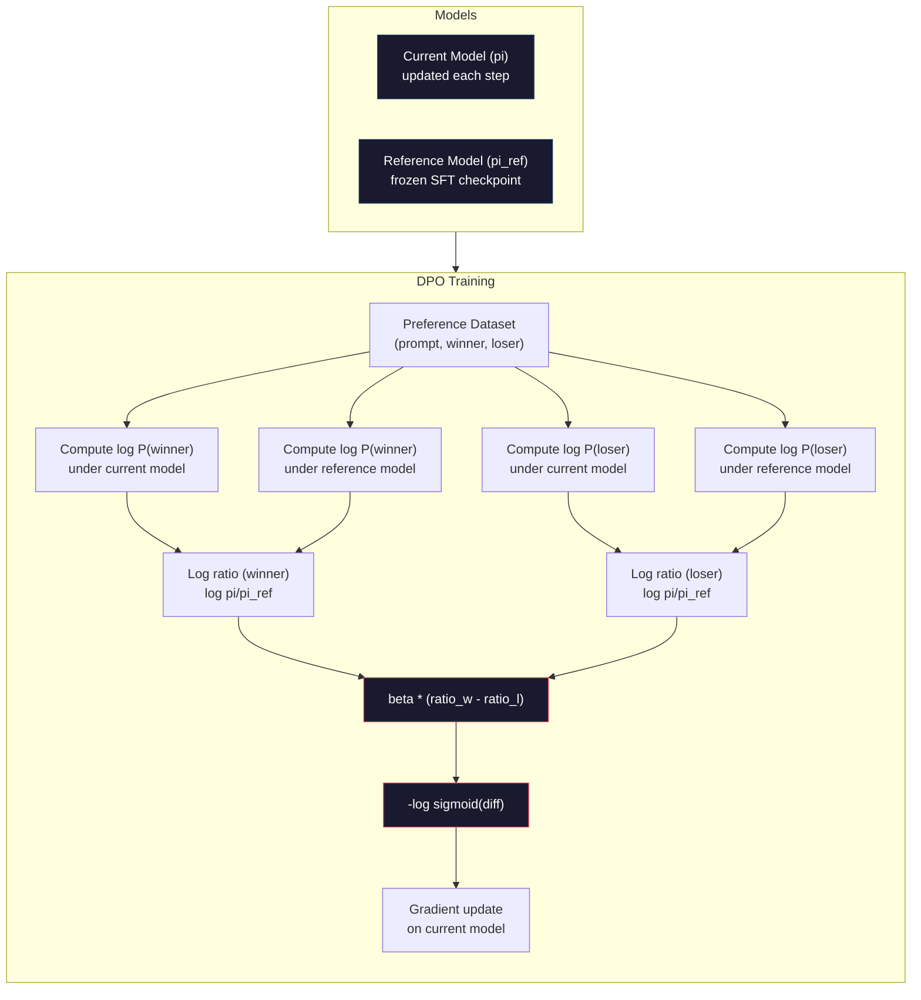

# DPO:直接偏好优化

> RLHF 有效,但它要训练三个模型(SFT、奖励模型、策略),要对付 PPO 的不稳定,还要调 KL 惩罚。DPO 问:如果这些全都可以跳过呢?DPO 直接在偏好对上优化语言模型——没有奖励模型,没有 PPO,一条训练循环,同样的效果。

**类型:** 动手构建
**编程语言:** Python(含 numpy)
**前置要求:** 第 10 阶段,第 07 课(RLHF)
**预计耗时:** 约 90 分钟

## 学习目标

- 实现 DPO 训练:不需要独立的奖励模型,直接在偏好对上优化语言模型
- 推导 DPO 损失函数,解释它如何通过策略的对数概率隐式地表示一个奖励模型
- 从训练稳定性、算力成本和所需模型数量三个维度比较 DPO 与 RLHF
- 调节 beta 参数,控制训练出的策略与参考模型之间的偏离程度

## 问题

第 07 课你搭了一条 RLHF 流水线:三个阶段、三个模型——SFT 模型、奖励模型,以及用 PPO 优化的策略模型。仅奖励模型就需要数千对人类偏好对和一条独立的训练循环;PPO 则需要仔细调节 KL 系数、学习率、截断比率和 epoch 数。

实践中,PPO 训练出了名地不稳定:超参数稍微一动,训练就发散。奖励模型是人类偏好的不完美代理,策略总能找到办法利用它的弱点。KL 惩罚有帮助,但它自己也要调——太低会奖励破解,太高模型又几乎学不到东西。

正是这份复杂,让 InstructGPT 发表后的好几年里,大多数开源模型都搞不定 RLHF。三阶段流水线太脆弱:每个阶段各有失效模式,误差还会层层叠加。

2023 年 5 月,斯坦福的 Rafael Rafailov、Archit Sharma 及同事发表了《Direct Preference Optimization: Your Language Model is Secretly a Reward Model》。关键洞见:你不需要独立的奖励模型——最优奖励函数由语言模型自身的 token 概率数学地决定。你可以完全跳过奖励模型,直接在偏好对上优化语言模型。

DPO 把 RLHF 压缩成一步监督学习:一个模型、一个损失函数、一条训练循环、零强化学习。最早大规模使用 DPO 的模型之一 Zephyr-7B,在多个基准上追平甚至超过用完整 RLHF 训练的模型;Meta 把 DPO 用进了 Llama 3 的对齐流水线;Anthropic 在对齐研究中也引用了 DPO 风格的方法。

## 概念

### 关键洞见

RLHF 优化的目标是:

```
maximize: E[R(x, y)] - beta * KL(pi || pi_ref)
```

其中 R 是奖励模型,pi 是策略,pi_ref 是参考模型,beta 是 KL 系数。

DPO 论文证明了这个目标有闭式最优解:对任意奖励函数 R,最优策略是

```
pi*(y | x) = pi_ref(y | x) * exp(R(x, y) / beta) / Z(x)
```

其中 Z(x) 是归一化常数。移项得:

```
R(x, y) = beta * log(pi*(y | x) / pi_ref(y | x)) + beta * log Z(x)
```

突破就在这里:奖励完全由策略模型的概率和参考模型的概率表达,不需要训练独立的奖励模型——奖励*隐含*在概率之比中。

把它代入 Bradley-Terry 偏好模型:

```
P(y_w > y_l | x) = sigmoid(R(x, y_w) - R(x, y_l))
                  = sigmoid(beta * (log pi(y_w|x)/pi_ref(y_w|x) - log pi(y_l|x)/pi_ref(y_l|x)))
```

Z(x) 项消掉了,因为两个回答都条件于同一个提示 x。剩下的只是:策略模型与参考模型在被偏好和被拒绝回答上的对数概率的函数。

### DPO 损失

```
L_DPO = -log(sigmoid(beta * (log pi(y_w|x)/pi_ref(y_w|x) - log pi(y_l|x)/pi_ref(y_l|x))))
```

逐个拆解:

- **y_w** = 被偏好的(胜出)回答
- **y_l** = 被拒绝的(落败)回答
- **x** = 提示
- **pi** = 当前模型(训练中的)
- **pi_ref** = 参考模型(冻结的 SFT 检查点)
- **beta** = 控制偏离参考程度的温度参数(通常 0.1 到 0.5)

比率 `log pi(y|x) / pi_ref(y|x)` 是对数概率比:为正,说明当前模型给回答 y 的概率高于参考模型;为负,说明更低。

DPO 损失推动模型拉高被偏好回答的对数概率比、压低被拒绝回答的。beta 控制模型可以偏离参考多激进——beta 小,允许的偏离大;beta 大,模型被拴在参考附近。



### DPO 为什么更简单

| 方面 | RLHF(PPO) | DPO |
|--------|-----------|-----|
| 要训练的模型 | 3 个(SFT + 奖励 + 策略) | 1 个(仅策略) |
| 训练循环 | 3 条(SFT、RM 训练、PPO) | 2 条(SFT、DPO) |
| 超参数 | lr、KL 系数、截断比、RM lr、epoch x3 | lr、beta、epoch |
| 奖励模型 | 必需(独立训练) | 隐含在模型概率中 |
| RL 算法 | PPO(复杂、不稳定) | 监督学习(稳定) |
| GPU 显存 | PPO 期间 3–4 个模型 | 2 个模型(当前 + 参考) |
| 训练稳定性 | 对超参数敏感 | 健壮,接近 SFT |

DPO 训练时内存里只需要两个模型:当前模型和冻结的参考模型。RLHF 需要三到四个:策略、参考、奖励模型,以及可选的价值函数基线。70B 模型每个副本在 FP16 下占 140GB——省掉奖励模型,显存节省相当可观。

### DPO 何时胜过 RLHF

**小数据集。** 5,000–20,000 个偏好对时,DPO 常常追平或超过 RLHF。RLHF 的奖励模型需要足够数据才能泛化,数据有限时它会过拟合、产出不可靠的奖励信号;DPO 根本不需要奖励模型,绕开了这个问题。

**算力有限。** DPO 的算力需求大约是完整 RLHF 的三分之一(一条训练循环对三条)。没有大 GPU 集群的团队,这是务实之选。

**快速迭代。** 想试 10 个不同的偏好数据集,看哪个训出的模型最好?DPO 让你几小时跑完一组实验;RLHF 每个数据集都得重训奖励模型。

### RLHF 何时胜过 DPO

**大规模训练。** 到了 GPT-4 或 Claude 这个量级,RLHF 的独立奖励模型能捕捉更细腻的偏好信号——它是一个会学习的损失函数,能适应复杂的质量标准。

**复杂的奖励信号。** 当"更好"涉及多个维度(有用、无害、诚实)时,奖励模型可以学出这种多目标权衡。DPO 把每个偏好对当成二值信号——一个好一个差——并不建模为什么。

**迭代式对齐。** RLHF 流水线可以用当前策略生成新回答、让人类评分、再重训奖励模型,形成在线循环;DPO 只能在一个固定的偏好对数据集上工作。Constitutional AI(Anthropic 的方法)大量利用了 RLHF 的这种迭代特性。

### DPO 之后:KTO、ORPO、SimPO

DPO 启发了一整个简化对齐方法的家族。

**KTO(Kahneman-Tversky Optimization,2024):** 连"对"都可以不要。KTO 用不成对的反馈:只给每个回答标"好"或"坏",不需要和另一个候选比较。这大幅简化了数据收集——不再给标注员看两个回答问"哪个更好",而是看一个回答问"这个好吗"。损失函数引入前景理论中的损失厌恶:坏回答受的惩罚大于好回答得的奖励。

**ORPO(Odds Ratio Preference Optimization,2024):** 把 SFT 和对齐合并进一个训练步。不再先 SFT 再 DPO,ORPO 直接改造 SFT 损失,把偏好信号加进去:损失有两项——被偏好回答上的标准下一 token 预测损失,加上一个拉大被偏好与被拒绝回答概率差距的 odds ratio 项。一条训练循环代替两条。

**SimPO(Simple Preference Optimization,2024):** 连参考模型都省了。不再对冻结参考计算对数概率比,SimPO 用回答的平均对数概率(按长度归一化)作为隐式奖励。省内存(不需要参考模型)、简化训练;长度归一化还防止模型偏爱更短的回答。

| 方法 | 年份 | 内存中模型数 | 需要成对? | 需要参考? | 训练循环 |
|--------|------|-----------------|-------------|-----------------|----------------|
| RLHF | 2022 | 3–4 | 是(RM 用) | 是 | 3 |
| DPO | 2023 | 2 | 是 | 是 | 2 |
| KTO | 2024 | 2 | 否(不成对) | 是 | 2 |
| ORPO | 2024 | 1 | 是 | 否 | 1 |
| SimPO | 2024 | 1 | 是 | 否 | 1 |

趋势一目了然:每种方法再砍掉一份复杂。RLHF 需要奖励模型和 PPO;DPO 砍掉了这两个;KTO 砍掉了成对数据;ORPO 砍掉了独立的 SFT 阶段;SimPO 砍掉了参考模型。对齐税——把基座模型变成对齐模型所需的算力与复杂度成本——一直在降。

### 真实的 DPO 部署

**Zephyr-7B(HuggingFace,2023 年 10 月):** Mistral 7B 基座,先在 UltraChat(20 万条)上做 SFT,再在 UltraFeedback(6 万个偏好对)上做 DPO。MT-Bench 得分 6.47——当时最强的 7B 模型。作为对比,Llama 2 Chat 70B 得分 6.86:Zephyr 只用 DPO 对齐,就追到了 10 倍大的模型的 6% 以内。

**Llama 3(Meta,2024 年 4 月):** 在最初的 RLHF 阶段之后使用 DPO。这种组合说明 DPO 和 RLHF 可以互补——RLHF 做粗对齐,DPO 做精细打磨。

**Neural Magic / nm-chat(2024):** 把 DPO 应用到多个开源模型上,相对纯 SFT 基线,在对齐基准上稳定提升 5–15%。

```figure
dpo-loss
```

## 动手构建

### 第 1 步:偏好数据集

与 RLHF 相同的格式:(prompt, preferred, rejected) 三元组。DPO 直接消费这些数据,不需要中间的奖励模型。

```python
import numpy as np
import sys
import os
sys.path.insert(0, os.path.join(os.path.dirname(__file__), "..", "..", "04-pre-training-mini-gpt", "code"))
from main import MiniGPT, LayerNorm, Embedding, TransformerBlock

PREFERENCE_DATA = [
    {
        "prompt": "What is the capital of France?",
        "preferred": "The capital of France is Paris.",
        "rejected": "France is a country in Europe. It has many cities. The capital is Paris. Paris is known for the Eiffel Tower.",
    },
    {
        "prompt": "Explain gravity in one sentence.",
        "preferred": "Gravity is the force that attracts objects with mass toward each other.",
        "rejected": "Gravity is something that makes things fall down when you drop them.",
    },
    {
        "prompt": "What is 15 times 7?",
        "preferred": "15 times 7 is 105.",
        "rejected": "Let me think about this. 15 times 7. Well, 10 times 7 is 70, and 5 times 7 is 35, so the answer might be around 105.",
    },
    {
        "prompt": "Name three programming languages.",
        "preferred": "Python, Rust, and TypeScript.",
        "rejected": "There are many programming languages. Some popular ones include various languages like Python and others.",
    },
    {
        "prompt": "What year did World War II end?",
        "preferred": "World War II ended in 1945.",
        "rejected": "World War II was a major global conflict. It involved many countries. The war ended in the mid-1940s, specifically in 1945.",
    },
    {
        "prompt": "Define machine learning.",
        "preferred": "Machine learning is a field where algorithms learn patterns from data to make predictions without being explicitly programmed.",
        "rejected": "Machine learning is a type of AI. AI stands for artificial intelligence. Machine learning uses data to learn.",
    },
]
```

### 第 2 步:序列对数概率

DPO 损失需要计算给定提示时回答的总对数概率:把模型跑在完整的(提示 + 回答)序列上,把每个回答 token 的对数概率加起来。

```python
def tokenize_sequence(text, vocab_size=256):
    return [min(t, vocab_size - 1) for t in list(text.encode("utf-8"))]


def compute_sequence_log_prob(model, prompt_tokens, response_tokens, max_seq_len=128):
    full_sequence = prompt_tokens + response_tokens
    if len(full_sequence) > max_seq_len:
        full_sequence = full_sequence[:max_seq_len]

    if len(full_sequence) < 2:
        return 0.0

    input_ids = np.array(full_sequence[:-1]).reshape(1, -1)
    target_ids = np.array(full_sequence[1:])

    logits = model.forward(input_ids)
    logits = logits[0]

    max_logits = logits.max(axis=-1, keepdims=True)
    log_probs = logits - max_logits - np.log(
        np.exp(logits - max_logits).sum(axis=-1, keepdims=True)
    )

    prompt_len = len(prompt_tokens)
    response_start = max(0, prompt_len - 1)
    response_end = len(target_ids)

    if response_start >= response_end:
        return 0.0

    response_log_probs = log_probs[response_start:response_end, :]
    response_targets = target_ids[response_start:response_end]

    total_log_prob = 0.0
    for i, target in enumerate(response_targets):
        total_log_prob += response_log_probs[i, target]

    return total_log_prob
```

这个函数是 DPO 的老黄牛:每个偏好对它要跑四次——当前模型在被偏好回答上、当前模型在被拒绝回答上、参考模型在被偏好回答上、参考模型在被拒绝回答上。每个训练样本 4 次前向传播,对比 RLHF 的生成 + 奖励打分 + 价值估计 + PPO 更新:更简单、更快、更稳。

### 第 3 步:DPO 损失

论文核心写成代码:一个函数、一个损失、零奖励模型。

```python
def sigmoid(x):
    return np.where(
        x >= 0,
        1.0 / (1.0 + np.exp(-x)),
        np.exp(x) / (1.0 + np.exp(x))
    )


def dpo_loss(policy_logprob_preferred, policy_logprob_rejected,
             ref_logprob_preferred, ref_logprob_rejected, beta=0.1):
    preferred_ratio = policy_logprob_preferred - ref_logprob_preferred
    rejected_ratio = policy_logprob_rejected - ref_logprob_rejected

    logit = beta * (preferred_ratio - rejected_ratio)

    loss = -np.log(sigmoid(logit) + 1e-8)

    preferred_reward = beta * preferred_ratio
    rejected_reward = beta * rejected_ratio

    return loss, {
        "preferred_ratio": float(preferred_ratio),
        "rejected_ratio": float(rejected_ratio),
        "logit": float(logit),
        "implicit_preferred_reward": float(preferred_reward),
        "implicit_rejected_reward": float(rejected_reward),
        "reward_margin": float(preferred_reward - rejected_reward),
    }
```

`preferred_ratio` 和 `rejected_ratio` 就是 DPO 推导中的对数概率比。当前模型(相对参考)给被偏好回答更高概率、给被拒绝回答更低概率时,logit 为正、损失很低。训练信号正是把模型往这个方向推。

`implicit_preferred_reward` 和 `implicit_rejected_reward` 是 DPO 损失隐式赋予的奖励。你可以把它们取出来验证训练是否有效——被偏好与被拒绝奖励之间的差距应随训练增大。

### 第 4 步:DPO 训练循环

一条标准的监督训练循环:没有 PPO,没有奖励模型,只有前向传播和梯度更新。

```python
def copy_model_weights(source, target):
    target.embedding.token_embed = source.embedding.token_embed.copy()
    target.embedding.pos_embed = source.embedding.pos_embed.copy()
    target.ln_f.gamma = source.ln_f.gamma.copy()
    target.ln_f.beta = source.ln_f.beta.copy()
    for s_block, t_block in zip(source.blocks, target.blocks):
        t_block.attn.W_q = s_block.attn.W_q.copy()
        t_block.attn.W_k = s_block.attn.W_k.copy()
        t_block.attn.W_v = s_block.attn.W_v.copy()
        t_block.attn.W_out = s_block.attn.W_out.copy()
        t_block.ffn.W1 = s_block.ffn.W1.copy()
        t_block.ffn.W2 = s_block.ffn.W2.copy()
        t_block.ffn.b1 = s_block.ffn.b1.copy()
        t_block.ffn.b2 = s_block.ffn.b2.copy()
        t_block.ln1.gamma = s_block.ln1.gamma.copy()
        t_block.ln1.beta = s_block.ln1.beta.copy()
        t_block.ln2.gamma = s_block.ln2.gamma.copy()
        t_block.ln2.beta = s_block.ln2.beta.copy()


def dpo_train(policy_model, reference_model, preference_data,
              num_epochs=5, lr=5e-6, beta=0.1, max_seq_len=128):
    print(f"DPO Training: {len(preference_data)} pairs, {num_epochs} epochs, "
          f"lr={lr}, beta={beta}")
    print()

    losses = []
    margins = []

    for epoch in range(num_epochs):
        epoch_loss = 0.0
        epoch_margin = 0.0
        num_examples = 0

        indices = np.random.permutation(len(preference_data))

        for idx in indices:
            pair = preference_data[idx]

            prompt_tokens = tokenize_sequence(pair["prompt"])
            preferred_tokens = tokenize_sequence(pair["preferred"])
            rejected_tokens = tokenize_sequence(pair["rejected"])

            pi_logprob_w = compute_sequence_log_prob(
                policy_model, prompt_tokens, preferred_tokens, max_seq_len
            )
            pi_logprob_l = compute_sequence_log_prob(
                policy_model, prompt_tokens, rejected_tokens, max_seq_len
            )
            ref_logprob_w = compute_sequence_log_prob(
                reference_model, prompt_tokens, preferred_tokens, max_seq_len
            )
            ref_logprob_l = compute_sequence_log_prob(
                reference_model, prompt_tokens, rejected_tokens, max_seq_len
            )

            loss, metrics = dpo_loss(
                pi_logprob_w, pi_logprob_l,
                ref_logprob_w, ref_logprob_l, beta
            )

            update_direction = 1.0 if metrics["logit"] < 0 else -0.1
            for block in policy_model.blocks:
                block.ffn.W1 += lr * update_direction * np.random.randn(*block.ffn.W1.shape) * 0.01
                block.ffn.W2 += lr * update_direction * np.random.randn(*block.ffn.W2.shape) * 0.01

            epoch_loss += loss
            epoch_margin += metrics["reward_margin"]
            num_examples += 1
            losses.append(float(loss))
            margins.append(metrics["reward_margin"])

        avg_loss = epoch_loss / max(num_examples, 1)
        avg_margin = epoch_margin / max(num_examples, 1)

        print(f"  Epoch {epoch + 1}/{num_epochs} | Loss: {avg_loss:.4f} | "
              f"Avg Margin: {avg_margin:.4f}")

    return policy_model, losses, margins
```

与 RLHF 相比,这个训练循环简单得清爽:对每个偏好对,算四个对数概率(两个模型、两个回答),代入 DPO 损失,算梯度,更新策略。没有生成步骤,没有奖励模型推理,没有优势估计,没有截断。

### 第 5 步:对比 DPO 与 RLHF

测量隐式奖励差距和对数概率偏移,对比 DPO 和第 07 课的 RLHF 模型。

```python
def evaluate_preference_accuracy(model, reference_model, preference_data, beta=0.1, max_seq_len=128):
    correct = 0
    total = 0

    for pair in preference_data:
        prompt_tokens = tokenize_sequence(pair["prompt"])
        preferred_tokens = tokenize_sequence(pair["preferred"])
        rejected_tokens = tokenize_sequence(pair["rejected"])

        pi_w = compute_sequence_log_prob(model, prompt_tokens, preferred_tokens, max_seq_len)
        pi_l = compute_sequence_log_prob(model, prompt_tokens, rejected_tokens, max_seq_len)
        ref_w = compute_sequence_log_prob(reference_model, prompt_tokens, preferred_tokens, max_seq_len)
        ref_l = compute_sequence_log_prob(reference_model, prompt_tokens, rejected_tokens, max_seq_len)

        preferred_reward = beta * (pi_w - ref_w)
        rejected_reward = beta * (pi_l - ref_l)

        if preferred_reward > rejected_reward:
            correct += 1
        total += 1

    return correct / max(total, 1)


def analyze_implicit_rewards(model, reference_model, preference_data, beta=0.1, max_seq_len=128):
    print("Implicit Reward Analysis:")
    print("-" * 65)
    print(f"  {'Prompt':<30} {'Pref Reward':>12} {'Rej Reward':>12} {'Margin':>10}")
    print("  " + "-" * 60)

    for pair in preference_data:
        prompt_tokens = tokenize_sequence(pair["prompt"])
        preferred_tokens = tokenize_sequence(pair["preferred"])
        rejected_tokens = tokenize_sequence(pair["rejected"])

        pi_w = compute_sequence_log_prob(model, prompt_tokens, preferred_tokens, max_seq_len)
        pi_l = compute_sequence_log_prob(model, prompt_tokens, rejected_tokens, max_seq_len)
        ref_w = compute_sequence_log_prob(reference_model, prompt_tokens, preferred_tokens, max_seq_len)
        ref_l = compute_sequence_log_prob(reference_model, prompt_tokens, rejected_tokens, max_seq_len)

        pref_reward = beta * (pi_w - ref_w)
        rej_reward = beta * (pi_l - ref_l)
        margin = pref_reward - rej_reward

        truncated = pair["prompt"][:28] + ".." if len(pair["prompt"]) > 30 else pair["prompt"]
        print(f"  {truncated:<30} {pref_reward:>12.4f} {rej_reward:>12.4f} {margin:>10.4f}")

    print()
```

### 第 6 步:beta 敏感性分析

beta 参数相当于 RLHF 里的 KL 系数,控制模型能偏离参考多远。这个实验展示它的影响。

```python
def beta_sensitivity_analysis(sft_model, preference_data, betas, max_seq_len=128):
    print("Beta Sensitivity Analysis")
    print("-" * 60)
    print(f"  {'Beta':>8} {'Final Loss':>12} {'Final Margin':>14} {'Accuracy':>10}")
    print("  " + "-" * 55)

    results = []

    for beta in betas:
        policy = MiniGPT(
            vocab_size=256, embed_dim=128, num_heads=4,
            num_layers=4, max_seq_len=max_seq_len, ff_dim=512
        )
        reference = MiniGPT(
            vocab_size=256, embed_dim=128, num_heads=4,
            num_layers=4, max_seq_len=max_seq_len, ff_dim=512
        )
        copy_model_weights(sft_model, policy)
        copy_model_weights(sft_model, reference)

        policy, losses, margins_list = dpo_train(
            policy, reference, preference_data,
            num_epochs=3, lr=5e-6, beta=beta, max_seq_len=max_seq_len
        )

        accuracy = evaluate_preference_accuracy(
            policy, reference, preference_data, beta, max_seq_len
        )

        final_loss = losses[-1] if losses else 0
        final_margin = margins_list[-1] if margins_list else 0

        print(f"  {beta:>8.3f} {final_loss:>12.4f} {final_margin:>14.4f} {accuracy:>10.1%}")
        results.append({
            "beta": beta,
            "final_loss": final_loss,
            "final_margin": final_margin,
            "accuracy": accuracy,
        })

        print()

    return results
```

小 beta(0.01)让模型自由偏离参考——学得快,但有退化解的风险;大 beta(1.0)把模型拴在参考附近——稳但学得慢。大多数应用的甜区在 0.1 到 0.3。

## 投入使用

### 完整 DPO 流水线演示

```python
if __name__ == "__main__":
    np.random.seed(42)

    print("=" * 70)
    print("DPO: DIRECT PREFERENCE OPTIMIZATION")
    print("=" * 70)
    print()

    print("STEP 1: Initialize SFT Model (from Lesson 06)")
    print("-" * 50)
    sft_model = MiniGPT(
        vocab_size=256, embed_dim=128, num_heads=4,
        num_layers=4, max_seq_len=128, ff_dim=512
    )
    print(f"  Parameters: {sft_model.count_parameters():,}")
    print()

    print("STEP 2: DPO Training")
    print("-" * 50)

    policy_model = MiniGPT(
        vocab_size=256, embed_dim=128, num_heads=4,
        num_layers=4, max_seq_len=128, ff_dim=512
    )
    reference_model = MiniGPT(
        vocab_size=256, embed_dim=128, num_heads=4,
        num_layers=4, max_seq_len=128, ff_dim=512
    )
    copy_model_weights(sft_model, policy_model)
    copy_model_weights(sft_model, reference_model)

    policy_model, losses, margins = dpo_train(
        policy_model, reference_model, PREFERENCE_DATA,
        num_epochs=5, lr=5e-6, beta=0.1
    )
    print()

    print("=" * 70)
    print("STEP 3: Evaluate")
    print("=" * 70)
    print()

    pre_accuracy = evaluate_preference_accuracy(
        sft_model, reference_model, PREFERENCE_DATA, beta=0.1
    )
    post_accuracy = evaluate_preference_accuracy(
        policy_model, reference_model, PREFERENCE_DATA, beta=0.1
    )

    print(f"  Preference accuracy (pre-DPO):  {pre_accuracy:.1%}")
    print(f"  Preference accuracy (post-DPO): {post_accuracy:.1%}")
    print()

    analyze_implicit_rewards(policy_model, reference_model, PREFERENCE_DATA, beta=0.1)

    print("=" * 70)
    print("STEP 4: Training Dynamics")
    print("=" * 70)
    print()

    if losses:
        print("  Loss curve:")
        window = max(1, len(losses) // 5)
        for i in range(0, len(losses), window):
            chunk = losses[i:i + window]
            avg = sum(chunk) / len(chunk)
            print(f"    Steps {i:3d}-{i + len(chunk) - 1:3d}: loss = {avg:.4f}")
        print()

    if margins:
        print("  Reward margin curve:")
        window = max(1, len(margins) // 5)
        for i in range(0, len(margins), window):
            chunk = margins[i:i + window]
            avg = sum(chunk) / len(chunk)
            print(f"    Steps {i:3d}-{i + len(chunk) - 1:3d}: margin = {avg:.4f}")
        print()

    print("=" * 70)
    print("STEP 5: Beta Sensitivity")
    print("=" * 70)
    print()

    beta_results = beta_sensitivity_analysis(
        sft_model, PREFERENCE_DATA, betas=[0.01, 0.1, 0.3, 1.0]
    )

    print("=" * 70)
    print("DPO vs RLHF COMPARISON")
    print("=" * 70)
    print()
    print("  DPO advantages:")
    print("    - 1 training loop (vs 3 for RLHF)")
    print("    - 2 models in memory (vs 3-4 for RLHF)")
    print("    - Supervised learning (vs RL, more stable)")
    print("    - No reward model to train or maintain")
    print()
    print("  RLHF advantages:")
    print("    - Separate reward model captures complex preferences")
    print("    - Online learning: generate, rate, retrain")
    print("    - Better for multi-objective alignment")
    print("    - Proven at largest scales (GPT-4, Claude)")
    print()
    print("  Practical guidance:")
    print("    - Start with DPO. It's simpler and often sufficient.")
    print("    - Switch to RLHF if DPO plateaus on your eval metrics.")
    print("    - Many production systems use both: RLHF first, DPO to refine.")
```

## 交付

本课产出 `outputs/prompt-alignment-method-selector.md`——一个帮你为用例选择对齐方法(SFT、RLHF、DPO、KTO、ORPO、SimPO)的提示词。给定你的数据可得性、算力预算和对齐目标,它会推荐方法与训练计划。

## 练习

1. 实现 KTO(Kahneman-Tversky Optimization)。KTO 不需要成对数据——只给每个回答标"好"或"坏"。好回答的损失是 `-log(sigmoid(beta * log_ratio))`,坏回答的损失是 `-log(1 - sigmoid(beta * log_ratio))`,并在坏回答损失上乘以损失厌恶系数(通常 1.5x)。在同样的数据上训练(把 preferred 独立地当"好"、rejected 独立地当"坏"),与 DPO 对比准确率。

2. 实现长度归一化的 DPO:不用原始对数概率,而是除以回答 token 数:`normalized_logprob = total_logprob / num_tokens`。这能防止模型偏爱更短的回答(短回答总对数概率更高)。对比归一化前后的隐式奖励差距。

3. 构建 ORPO 风格的组合损失:在 DPO 损失上加上被偏好回答的标准下一 token 预测损失:`L = L_sft(preferred) + alpha * L_dpo`。尝试 alpha 取 0.1、0.5、1.0。组合损失应让模型既会遵循指令(来自 SFT 项)又偏好更好的回答(来自 DPO 项),从而不再需要独立的 SFT 阶段。

4. 实现迭代 DPO:先跑 3 个 epoch 的 DPO,然后用训好的模型生成新回答,把它们与原来的被偏好回答组成新的偏好对,再跑一轮 DPO。做两轮这种"自我对弈",对比第 1 轮与第 2 轮后的偏好准确率,看迭代打磨是否有帮助。

5. 用不同的参考模型对比 DPO:不用 SFT 检查点作参考,改用 (a) 基座模型(SFT 之前)、(b) DPO 第 1 个 epoch 的检查点、(c) 策略模型的指数滑动平均。报告哪种参考带来最高的偏好准确率和最稳的训练曲线。

## 关键术语

| 术语 | 别人的说法 | 实际含义 |
|------|----------------|----------------------|
| DPO | "不要 RL 的 RLHF" | 直接偏好优化:一种监督学习算法,直接在偏好对上优化语言模型,绕开奖励模型和 PPO |
| 隐式奖励(Implicit reward) | "奖励就在模型里" | 奖励函数由策略模型与参考模型的对数概率比决定,不需要独立的奖励模型 |
| beta(DPO) | "那个温度" | 控制策略能偏离参考模型多远:beta 小允许大偏离,beta 大把模型拴在附近 |
| 对数概率比(Log-probability ratio) | "模型变了多少" | log pi(y\|x) - log pi_ref(y\|x):为正说明当前模型赋予的概率高于参考 |
| 参考模型(Reference model) | "冻结的检查点" | 权重永不改变的 SFT 模型副本,计算概率比的锚点 |
| KTO | "不要成对的 DPO" | Kahneman-Tversky Optimization:用不成对的"好/坏"标签,代替偏好对 |
| ORPO | "一步对齐" | Odds Ratio Preference Optimization:往 SFT 损失里加偏好项,把 SFT 与对齐合并进一条训练循环 |
| SimPO | "不需要参考" | Simple Preference Optimization:用按长度归一化的平均对数概率作隐式奖励,彻底省掉参考模型 |
| 对齐税(Alignment tax) | "让模型变安全的成本" | 从基座模型到对齐模型所需的额外算力、数据与复杂度——DPO 大幅降低了它 |

## 延伸阅读

- [Rafailov et al., 2023 -- "Direct Preference Optimization: Your Language Model is Secretly a Reward Model"](https://arxiv.org/abs/2305.18290)——把对齐从 RLHF 简化为监督学习的 DPO 论文
- [Tunstall et al., 2023 -- "Zephyr: Direct Distillation of LM Alignment"](https://arxiv.org/abs/2310.16944)——Zephyr-7B,证明 UltraFeedback 上的 DPO 能在基准上追平 RLHF
- [Ethayarajh et al., 2024 -- "KTO: Model Alignment as Prospect Theoretic Optimization"](https://arxiv.org/abs/2402.01306)——消除对成对偏好的需求
- [Hong et al., 2024 -- "ORPO: Monolithic Preference Optimization without Reference Model"](https://arxiv.org/abs/2403.07691)——把 SFT 与对齐合成一步
- [Meng et al., 2024 -- "SimPO: Simple Preference Optimization with a Reference-Free Reward"](https://arxiv.org/abs/2405.14734)——彻底消除参考模型
- [Llama 3 Technical Report](https://arxiv.org/abs/2407.21783)——Meta 结合 RLHF 与 DPO 的对齐流水线
