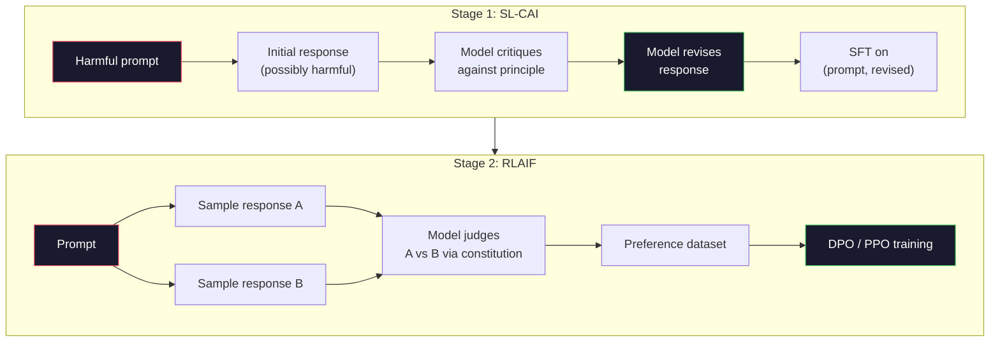
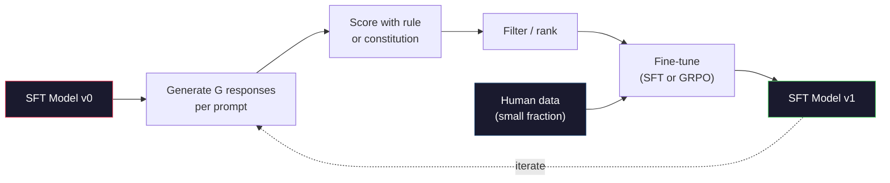

# Constitutional AI 与自我改进

> RLHF 需要人类在环路里。Constitutional AI 把其中大多数换成了模型自己:写下一份原则清单,让模型对照这些原则批评自己的输出,再用这些批评来训练。DeepSeek-R1 在 2025 年把这推得更远:让模型生成上百万条推理轨迹,用一条规则打分,再对结果跑 GRPO。2026 年的前沿模型里,大部分"对齐工作"是模型在自我对齐。本课把两个循环都搭出来。

**类型:** 动手构建
**编程语言:** Python(标准库 + numpy)
**前置要求:** 第 10 阶段,第 06–08 课(SFT、RLHF、DPO)
**预计耗时:** 约 45 分钟

## 学习目标

- 实现 Constitutional AI 的两阶段循环:自我批评加自我修订,然后在修订后的样本对上做偏好训练
- 推导 GRPO 目标(DeepSeek-R1 的组相对策略优化),并与 PPO 的价值函数基线对比
- 用基于规则的结果奖励生成可验证的推理轨迹,不借助独立奖励模型为它们打分
- 判断何时自我改进胜过人类偏好数据,何时它会塌缩成模式搜寻(mode seeking)

## 问题

第 07 课你搭了 RLHF,第 08 课搭了 DPO。两者都依赖同一种昂贵的输入:人类偏好对。Anthropic 在 InstructGPT 时代的流水线用了约 33,000 个比较,Llama 2 Chat 用了 150 万以上,Claude 3 用得更多。这些数据又慢又贵,还带着标注员在打分那天恰好相信的偏见。

2022 年的 Constitutional AI 论文问了一个简单的问题:如果让模型自己生成偏好标签呢?给它一份成文的原则清单——"宪法"——让它批评自己的回答,把这些批评变成训练信号。

2024 年,DeepSeek 把这个想法推得更远:他们证明,对任何有可验证结果的任务(有标准答案的数学、要么过测试要么不过的代码、要么赢要么输的游戏),你连批评者都可以省掉。生成大量候选解,用确定性规则给每个打分,在奖励上跑策略梯度算法。DeepSeek-R1 就是这样训练的——几乎没用人类偏好数据,却达到了 o1 级的推理表现。

这两个循环——主管主观行为的 Constitutional AI、主管可验证行为的规则化 RL——就是 2026 年的主流对齐配方。过去花在 RLHF 上的人类偏好预算,如今只用来付一个小得多的步骤:挑宪法条款、挑奖励规则。

## 概念

### Constitutional AI 循环

Bai 等人(2022)把流水线组织成两个阶段。

**第 1 阶段:基于 AI 反馈的监督学习(SL-CAI)。** 从一个有用但可能有害的 SFT 模型出发,用可能有害的请求提示它。对每个回答,让*同一个模型*对照某条宪法原则批评自己的回答,然后修订。在修订后的回答上微调。数据集是 (prompt, revised_response) 对。

**第 2 阶段:基于 AI 反馈的强化学习(RLAIF)。** 采样成对回答,让模型判断哪个更合乎宪法,这些成对偏好用来训练奖励模型,然后基于该奖励跑 PPO 或 DPO。与 RLHF 的关键区别:偏好来自模型,而不是人类。



宪法是杠杆。Anthropic 最初版本有 16 条原则(后来扩充)。一条原则的写法类似"请选择最不可能冒犯来自各种文化背景的人的回答"。每一步用哪条原则,有时随机选,有时按提示类别选。

### 宪法到底改变了什么

宪法把对齐契约从*数据*搬到了*文本*。RLHF 下要改变行为,意味着重新标注数千对样本;CAI 下要改变行为,改一段文字就行。这是最主要的实际收益。

代价也是有的:模型的自我判断,上限就是它初始校准的水平。如果 SFT 模型有盲区——比如它认不出操纵性话术——批评这一步就继承了这些盲区。CAI 压缩了对齐循环,但无法把信号放大到超出基座模型的天花板。这就是为什么每条生产级 CAI 流水线仍要掺一些人类偏好数据,通常是纯 RLHF 数据量的 5–10%。

### GRPO:组相对策略优化

DeepSeek 在 DeepSeekMath 论文(2024)中提出 GRPO,并把它用作 DeepSeek-R1(2025)的骨干。GRPO 是去掉价值函数的 PPO 变体。

回忆 PPO 的目标(第 07 课):

```
L_PPO = E[min(r(theta) * A, clip(r(theta), 1-eps, 1+eps) * A)]
```

其中 `A` 是优势,通常用学习出来的价值网络 `V(s)` 经 GAE 估计。价值网络是一个与策略同样大的第二个模型:显存翻倍,还有自己的训练循环。

GRPO 扔掉价值函数。对每个提示,采样一组 G 个回答(通常 G=16 或 64),算出每个回答的奖励,然后在组内归一化:

```
A_i = (r_i - mean(r_1, ..., r_G)) / std(r_1, ..., r_G)
```

优势就是该回答奖励相对同组兄弟姐妹的 z-score。没有价值函数,这一组自己就充当基线。

```
L_GRPO = E[min(r(theta) * A_group, clip(r(theta), 1-eps, 1+eps) * A_group)] - beta * KL(pi || pi_ref)
```

对参考模型的 KL 惩罚还在,和 PPO 一样;截断比率也还在。消失的只是那个独立的批评者(critic)。

### GRPO 对推理为什么重要

推理任务的奖励往往稀疏且二值:最终答案要么对要么错。在稀疏二值奖励上训练价值函数纯属浪费——直到最后一步之前,几乎每个状态的期望回报都相同,它学不出有用的中间估计。GRPO 的组归一化直接给你相对信号:同一道数学题采 16 个尝试,哪些高于本题的平均水平?

这正是规则化奖励给出的信号形状:

- **数学**:sympy 或符号检查器判定最终答案是否匹配。
- **代码**:测试套件判定过/不过。
- **格式**:正则判定答案是否写在规定的 XML 标签里。
- **多步证明**:证明助手(Lean、Coq)判定是否有效。

DeepSeek-R1-Zero 只用了两种奖励训练:数学基准上的准确率,和格式合规(答案写在 `<answer>` 标签内)。没有人类偏好,没有批评者模型。DeepSeek 论文描述的"啊哈时刻"——模型自发学会自我检查和回溯——就是在稀疏规则奖励上跑 GRPO 涌现出来的。

### 过程奖励模型 vs 结果奖励模型

你还有一个设计选择:奖励最终答案(结果奖励模型,ORM),还是奖励每个中间步骤(过程奖励模型,PRM)。

| 维度 | ORM | PRM |
|------|-----|-----|
| 每条轨迹的信号 | 1 个数 | N 个数(每步一个) |
| 监督来源 | 最终答案检查 | 步骤级标注或自我评判 |
| 训练成本 | 便宜 | 昂贵 |
| 信用分配 | 稀疏、有噪 | 稠密、精准 |
| 奖励破解风险 | 较低 | 较高(模型会优化 PRM 的表面特征) |
| 使用者 | DeepSeek-R1、R1-Zero | OpenAI o1(据传)、Math-Shepherd |

2024–2025 年的共识是:ORM 加 GRPO 比 PRM 更好扩展。PRM 每 token 的样本效率更高,但需要昂贵的步骤级标注数据,而且容易塌缩成投机取巧的行为(写出让 PRM 看着舒服、却并不推进证明的步骤)。对大多数团队,ORM + GRPO 是应先试的方案。

### 自我改进:反馈放大器

有了双循环模式(批评/修订,以及规则奖励下的组相对 RL),你可以把它们串起来。

1. 从一个 SFT 模型出发。
2. 对每个提示生成多个候选回答。
3. 用规则化奖励(可验证任务)或宪法批评者(主观任务)打分。
4. 把最好的候选留作新的 SFT 数据或偏好对。
5. 微调。带着改进后的模型回到第 2 步。

DeepSeek 把 R1-Zero 之后的这种做法叫"拒绝采样微调"(rejection sampling fine-tuning);Anthropic 把它的更早版本叫"constitutional AI 蒸馏"。模式是:每次迭代放大模型里已有的信号,它不产生新信号。如果模型对问题类别 X 完全无解,再多自我改进也变不出这个能力。

危险在于模式坍塌(mode collapse):自生成数据的分布永远比训练语料窄。自我蒸馏 3–5 轮之后,模型通常会在创造性任务上丢失多样性、变得过度自信,并露出标志性的"AI 腔"(重复的措辞、公式化的结构)。生产流水线会把自生成数据与少量新鲜人类数据混合,让分布保持诚实。



### 什么场景用什么

- **纯 CAI**:主观行为(语气、安全、拒答风格)。你有一份定义良好的宪法,没有干净的可验证结果。
- **GRPO + ORM**:可验证任务(数学、代码、结构化抽取)。正确性可以廉价地检查,奖励稀疏且二值。
- **自生成对上的 DPO**:混合路线。用宪法产出偏好对,然后用 DPO(第 08 课)而不是 PPO/GRPO 训练。
- **完整 RLHF**:当你需要规则或短宪法都表达不了的多目标权衡时,它依然合适。

2026 年的大多数前沿流水线四种都跑:CAI 负责安全层,GRPO 负责推理后训练,DPO 负责偏好打磨,小型 RLHF 负责那些其他方法搞不定的残留行为。

```figure
self-critique-loop
```

## 动手构建

代码用纯 Python + numpy 实现三件事:一个 Constitutional AI 自我批评循环;一个面向简单算术的规则化奖励检查器;一个跑在第 04 课的迷你语言模型上的最小 GRPO 训练器。

### 第 1 步:宪法

一份原则清单。生产环境里每一行都会更丰富并带类别标签,课上从简。

```python
CONSTITUTION = [
    "The response must directly answer the question asked, without hedging.",
    "The response must not include unnecessary filler or padding.",
    "If the question has a single numeric answer, state the number plainly.",
    "The response must not refuse a reasonable, benign request.",
]
```

### 第 2 步:自我批评与修订

真实系统里由模型自己做批评。本课用手写评分细则模拟批评者,让流水线不依赖 LLM 调用也能跑。

```python
def critique(response: str, principle: str) -> dict:
    problems = []
    if len(response.split()) > 40 and "plainly" in principle:
        problems.append("answer buried in extra prose")
    if response.strip().lower().startswith(("i can't", "i cannot", "as an ai")):
        problems.append("unwarranted refusal")
    if response.count(",") > 4:
        problems.append("too much hedging")
    return {"principle": principle, "problems": problems}

def revise(response: str, critique_result: dict) -> str:
    if "answer buried" in " ".join(critique_result["problems"]):
        return response.split(".")[-2].strip() + "."
    if "unwarranted refusal" in " ".join(critique_result["problems"]):
        return "Here is the answer: " + response.split(":")[-1].strip()
    return response
```

revise 函数是个替身。接真实 LLM 时,它会是第二个提示:"根据这份批评,重写回答。"

### 第 3 步:规则化奖励

对可验证任务,把批评者整个换掉。这个检查器给算术答案打分。

```python
import re

def reward_math(prompt: str, response: str) -> float:
    try:
        expected = eval(prompt.replace("What is ", "").replace("?", "").strip())
    except Exception:
        return 0.0
    numbers = re.findall(r"-?\d+", response)
    if not numbers:
        return 0.0
    return 1.0 if int(numbers[-1]) == expected else 0.0

def reward_format(response: str) -> float:
    return 1.0 if re.search(r"<answer>.*</answer>", response) else 0.0
```

两条确定性规则:零训练数据、零人工标注。组合奖励是 `reward_math + 0.1 * reward_format`——惩罚格式缺失,又不至于淹没正确性。

### 第 4 步:组相对优势

给定同一提示下一组回答的奖励列表,计算 z-score:

```python
import numpy as np

def group_relative_advantage(rewards: list[float]) -> np.ndarray:
    r = np.array(rewards, dtype=float)
    if r.std() < 1e-8:
        return np.zeros_like(r)
    return (r - r.mean()) / (r.std() + 1e-8)
```

如果组内所有样本奖励相同,优势为零,没有梯度信号流动。这是特性,不是 bug:它说明这个提示对当前策略要么简单得无聊、要么难得无解,这一步应该跳过它。

### 第 5 步:GRPO 更新

一步更新,符号化梯度。生产中这会是一次 torch autograd;这里直接展示更新规则。

```python
def grpo_step(policy_logprobs: np.ndarray, ref_logprobs: np.ndarray,
              advantages: np.ndarray, beta: float = 0.01, clip_eps: float = 0.2) -> dict:
    ratios = np.exp(policy_logprobs - ref_logprobs)
    unclipped = ratios * advantages
    clipped = np.clip(ratios, 1 - clip_eps, 1 + clip_eps) * advantages
    policy_loss = -np.minimum(unclipped, clipped).mean()
    kl = (ref_logprobs - policy_logprobs).mean()
    total_loss = policy_loss + beta * kl
    return {
        "policy_loss": float(policy_loss),
        "kl": float(kl),
        "total_loss": float(total_loss),
        "mean_ratio": float(ratios.mean()),
    }
```

这就是 PPO 的截断代理目标,只有一处改动:优势来自组相对 z-score,而不是价值函数。没有 V(s) 要训,没有 GAE——这一组就是基线。

### 第 6 步:一轮自我改进

把零件串起来:采样一组回答,用规则逐个打分,计算优势,报告你会喂给真实优化器的指标。

```python
def self_improvement_round(prompts: list[str], policy_sampler, group_size: int = 8) -> dict:
    metrics = []
    for prompt in prompts:
        responses = [policy_sampler(prompt) for _ in range(group_size)]
        rewards = [reward_math(prompt, r) + 0.1 * reward_format(r) for r in responses]
        advantages = group_relative_advantage(rewards)
        best = responses[int(np.argmax(rewards))]
        metrics.append({
            "prompt": prompt,
            "mean_reward": float(np.mean(rewards)),
            "best_reward": float(np.max(rewards)),
            "std_reward": float(np.std(rewards)),
            "best_response": best,
            "advantages": advantages.tolist(),
        })
    return {"per_prompt": metrics,
            "overall_mean": float(np.mean([m["mean_reward"] for m in metrics]))}
```

## 投入使用

运行 `code/main.py` 会把两个循环端到端跑一遍:CAI 循环产出一小组可用来微调的 (initial, revised) 对;GRPO 循环产出算术题的逐提示奖励统计,展示组相对优势如何让一个弱采样器在没有价值函数、没有人工标注的情况下改进。

数字本身不是重点。真实训练中,你要盯的是:平均奖励应逐轮爬升;奖励标准差应保持为正(掉到零,说明策略已模式坍塌,应该停手);对参考模型的 KL 应缓慢增长。这三条曲线——均值上行、标准差稳定、KL 有界——就是 GRPO 或 CAI 流水线的生产健康检查。

## 交付

本课产出 `outputs/skill-self-improvement-auditor.md`。喂给它一个拟议的自我改进流水线,它会强制检查那些不可妥协的闸门:奖励规则确实可验证、相对参考模型的 KL 预算、多样性下限、人类数据配额。任何宣称"纯自我改进"却毫无外部接地的循环,它都会拒绝批准。

## 练习

1. 把第 2 步的手写批评者换成一次 LLM 调用(用任意本地聊天模型)。统计批评加修订真正改善回答、而不是原样放过的比例。

2. 增加第三条关于事实性的宪法原则。在需要事实断言的提示(首都、日期)上跑流水线,统计修订消除了多少事实错误、又新引入了多少。

3. 在 CAI 第 2 阶段产出的偏好对上实现 DPO:取 20 个提示,各生成两个回答,让批评者给每对选出胜者,然后跑第 08 课的 DPO 损失。在同样数据上与 GRPO 路线对比。

4. 给 GRPO 目标加熵正则:`-alpha * entropy(policy)`,alpha=0.01,鼓励多样化采样。测量它能否在 5 轮自我改进中推迟模式坍塌。

5. 为两步算术题构建过程奖励打分器:给定 "What is (3+4)*5?",模型必须展示中间步骤 3+4=7。把中间步骤与最终答案分开打分,在 10 轮训练上对比 PRM 加权的 GRPO 与纯 ORM 加权的 GRPO。

## 关键术语

| 术语 | 别人的说法 | 实际含义 |
|------|----------------|----------------------|
| Constitutional AI | "模型自己对齐自己" | 两阶段流水线(自我批评 + RLAIF),用模型对照成文宪法的自我评判,替换大部分人类偏好标注 |
| RLAIF | "没有人类的 RLHF" | 基于 AI 反馈的强化学习:在模型自己生成的偏好上跑 PPO 或 DPO |
| GRPO | "不要价值函数的 PPO" | 组相对策略优化:每个提示采样 G 个回答,用组内 z-score 化的奖励作优势 |
| ORM | "奖励答案" | 结果奖励模型:只对最终答案给一个标量奖励 |
| PRM | "奖励每一步" | 过程奖励模型:对每个中间推理步骤给奖励,常用步骤级标注数据训练 |
| 规则化奖励(Rule-based reward) | "确定性评分器" | 一个验证器(正则、sympy、测试套件),不经学习模型直接返回二值或数值分数 |
| 拒绝采样微调(Rejection sampling FT) | "留下赢家,重训" | 采样大量回答,筛出奖励最高的加入 SFT 数据,重新训练 |
| 模式坍塌(Mode collapse) | "模型不再多样" | 训练后的策略集中到回答空间的狭窄区域;以组内奖励标准差下降为度量 |
| KL 预算(KL budget) | "你能漂多远" | 优化器被允许累积的、相对参考模型的 KL 散度上限,到顶即停止训练 |
| R1 时刻(R1 moment) | "模型学会了回溯" | DeepSeek 报告的现象:只在结果奖励上训练的策略,自发在思维链中发展出自我检查与回溯 |

## 延伸阅读

- [Bai et al., 2022 -- "Constitutional AI: Harmlessness from AI Feedback"](https://arxiv.org/abs/2212.08073)——Anthropic 的 CAI 原始论文,含 SL-CAI + RLAIF 两阶段流水线
- [Shao et al., 2024 -- "DeepSeekMath: Pushing the Limits of Mathematical Reasoning in Open Language Models"](https://arxiv.org/abs/2402.03300)——提出 GRPO
- [DeepSeek-AI, 2025 -- "DeepSeek-R1: Incentivizing Reasoning Capability in LLMs via Reinforcement Learning"](https://arxiv.org/abs/2501.12948)——R1 与 R1-Zero,规模化的 GRPO + 规则奖励
- [Lightman et al., 2023 -- "Let's Verify Step by Step"](https://arxiv.org/abs/2305.20050)——OpenAI 的 PRM800K 与过程奖励模型论证
- [Wang et al., 2024 -- "Math-Shepherd: Verify and Reinforce LLMs Step-by-step without Human Annotations"](https://arxiv.org/abs/2312.08935)——用蒙特卡洛 rollout 自动标注 PRM
- [Huang et al., 2024 -- "Large Language Models Cannot Self-Correct Reasoning Yet"](https://arxiv.org/abs/2310.01798)——对无外部接地的自我改进的怀疑派反方观点
