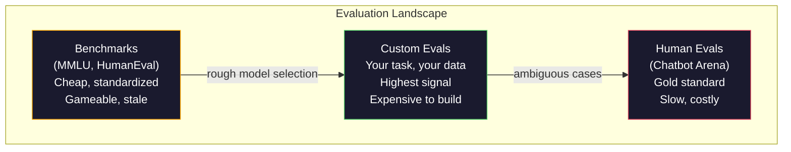
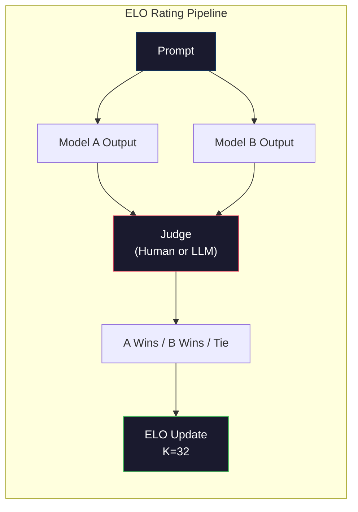

# 评估:基准、Eval 与 LM Harness

> 古德哈特定律:一项度量一旦变成目标,它就不再是好的度量。每个前沿实验室都在刷榜——MMLU 分数节节高,模型却连 "strawberry" 里有几个 R 都数不对。唯一要紧的 eval,是*你的* eval:在你的任务上、用你的数据。

**类型:** 动手构建
**编程语言:** Python
**前置要求:** 第 10 阶段,第 01–05 课(从零构建 LLM)
**预计耗时:** 约 90 分钟

## 学习目标

- 构建一个自定义评估框架,对语言模型跑选择题和开放式基准
- 解释标准基准(MMLU、HumanEval)为什么会饱和,并不再能区分前沿模型
- 用恰当的指标实现任务特定 eval:精确匹配、F1、BLEU 和 LLM 裁判打分
- 面向你的具体用例设计自定义评估套件,而不是只依赖公开榜单

## 问题

MMLU 于 2020 年发布,覆盖 57 个学科、15,908 道题。三年内,前沿模型把它打满了:GPT-4 得 86.4%,Claude 3 Opus 得 86.8%,Llama 3 405B 得 88.6%。榜单被压缩进 3 分的区间里,其中的差异是统计噪声,不是真实的能力差距。

而同样是这些模型,会在 10 岁孩子不假思索就能做的事上翻车:在 MMLU 上拿 88.7% 的 Claude 3.5 Sonnet,最初数不清 "strawberry" 里有几个字母——这个任务不需要任何世界知识、不需要任何推理,只是逐字符遍历。HumanEval 用 164 道题测代码生成,模型拿 90%+,却依然写出在任何初级开发者都能看出的边缘情况上崩溃的代码。

基准表现与真实世界可靠性之间的鸿沟,是 LLM 评估的核心问题。基准告诉你模型在基准上表现如何;它对模型在*你的*任务、*你的*数据、*你的*失效模式下的表现几乎只字不提。你在做客服机器人,MMLU 与你无关;你在做代码助手,HumanEval 只覆盖函数级生成——它对调试、重构、跨文件解释代码无话可说。

你需要自定义 eval。不是因为基准没用——粗略选型时它们有用——而是因为最终评估必须与部署条件严格一致。

## 概念

### 评估版图

评估有三类,成本和信号质量各不相同。

**基准(Benchmarks)** 是标准化测试套件:MMLU、HumanEval、SWE-bench、MATH、ARC、HellaSwag。让模型跑一遍,拿个分数。优点是人人用同一套题,模型之间可比;缺点是这些基准正被模型和训练数据不断污染——实验室的训练数据里混入了基准题,分数涨了,能力未必涨。

**自定义 eval** 是你为自己的用例构建的测试套件:输入、期望输出、打分函数全由你定义。法律文档摘要器就在法律文档上评,SQL 生成器就在你的数据库 schema 上评。构建成本高,但它们是唯一能预测生产表现的评估。

**人工 eval** 付费请标注员,按有用性、正确性、流畅度、安全性等标准评判模型输出。开放式任务上自动打分失效时,这是黄金标准。Chatbot Arena 已在 100 多个模型上收集了超过 200 万票人类偏好。缺点:成本(每次评判 $0.10–$2.00)和速度(几小时到几天)。



### 基准为什么会失灵

三种机制让基准分数不再反映真实能力。

**数据污染。** 训练语料从互联网上抓取,基准题就活在互联网上,模型在训练中见过答案。这不是传统意义上的作弊——实验室并非故意收录基准数据,但互联网规模的抓取让排除它几乎不可能。

**应试教育。** 实验室会对着基准表现优化训练配比:训练配比里若有 5% 是 MMLU 风格的选择题,模型就学会了这个格式和答案分布。MMLU 是四选一,模型学到答案在 A/B/C/D 上近似均匀分布——即便不知道答案,这条知识也有帮助。

**饱和。** 当每个前沿模型都在一个基准上拿 85–90%,基准就失去了区分度。剩下那 10–15% 的题可能有歧义、标错了,或者需要冷僻的领域知识。MMLU 从 87% 提到 89%,可能只是模型多背了两道冷题,而不是变聪明了。

### 困惑度:快速体检

困惑度(perplexity)衡量模型对一段 token 序列有多"意外"。形式上,它是平均负对数似然的指数:

```
PPL = exp(-1/N * sum(log P(token_i | context)))
```

困惑度为 10,意味着模型在每个 token 位置上的不确定程度,平均相当于在 10 个候选里均匀乱猜。越低越好:GPT-2 在 WikiText-103 上困惑度约 30,GPT-3 约 20,Llama 3 8B 约 7。

困惑度适合在同一测试集上比较模型,但它有盲区:模型可以靠擅长预测常见模式拿到低困惑度,同时在罕见但重要的模式上很糟;它也对指令遵循、推理和事实准确性只字不提。把它当健全性检查,别当最终判决。

### LLM 裁判

用一个强模型评估较弱模型的输出。想法很简单:让 GPT-4o 或 Claude Sonnet 按 1–5 分给回答的正确性、有用性、安全性打分。用 GPT-4o-mini 每次评判成本约 $0.01,而与人类判断的相关性好得出人意料——大多数任务上吻合度约 80%。

评分提示词比模型本身更重要。模糊的提示("给这个回答打个分")产出噪声分数;带评分细则的结构化提示("答案事实正确且引用了来源给 5 分,正确但无来源给 4 分,部分正确给 3 分……")产出一致、可复现的分数。

失效模式:裁判模型有位置偏置(成对比较中偏爱第一个回答)、啰嗦偏置(偏爱更长的回答)和自我偏爱(GPT-4 给 GPT-4 输出的评分高于同水平的 Claude 输出)。缓解:随机交换顺序、按长度归一化、用与被评模型不同的裁判。

### 成对比较的 ELO 评级

Chatbot Arena 的做法:把不同模型对同一提示的两个回答摆在一起,让人(或 LLM 裁判)挑更好的一个。从成千上万次这样的比较中,为每个模型算出 ELO 评级——和国际象棋用的是同一套系统。

ELO 的优点:相对排名比绝对打分更可靠;优雅处理平局;比给每个输出独立打分收敛得更快。截至 2026 年初,Chatbot Arena 榜单上 GPT-4o、Claude 3.5 Sonnet 和 Gemini 1.5 Pro 在顶端相差不到 20 个 ELO 分。



### 评估框架

**lm-evaluation-harness**(EleutherAI):标准的开源 eval 框架,支持 200 多个基准,一条命令让任何 Hugging Face 模型跑 MMLU、HellaSwag、ARC 等。Open LLM Leaderboard 用的就是它。

**RAGAS**:专为 RAG 流水线设计的评估框架,衡量忠实性(答案与检索到的上下文一致吗?)、相关性(检索到的上下文与问题相关吗?)和答案正确性。

**promptfoo**:配置驱动的提示词工程 eval。用 YAML 定义测试用例,对多个模型跑,拿到通过/失败报告。适合给提示词做回归测试——确保一次提示词改动没有弄坏既有用例。

### 构建自定义 eval

生产中唯一要紧的 eval。流程:

1. **定义任务。** 模型到底该做什么?要精确。"回答问题"太模糊;"给定一封客户投诉邮件,抽取产品名、问题类别和情感倾向"才是可评估的任务。

2. **创建测试用例。** 原型 eval 至少 50 条,生产 eval 至少 200 条。每条是一个 (input, expected_output) 对。要含边缘情况:空输入、对抗输入、歧义输入、其他语言的输入。

3. **定义打分。** 结构化输出用精确匹配;文本相似度用 BLEU/ROUGE;开放式质量用 LLM 裁判;抽取任务用 F1。按权重组合多种指标。

4. **自动化。** 每条 eval 一条命令跑完,零手工步骤。结果存成可跨时间对比的格式。

5. **跨时间追踪。** 孤立的 eval 分数没有意义,你需要趋势线:上次改提示词后分数涨了吗?换模型后退了吗?把 eval 和提示词一起纳入版本管理。

| Eval 类型 | 单次评判成本 | 与人类吻合度 | 最适用 |
|-----------|------------------|----------------------|----------|
| 精确匹配 | ~$0 | 100%(适用时) | 结构化输出、分类 |
| BLEU/ROUGE | ~$0 | ~60% | 翻译、摘要 |
| LLM 裁判 | ~$0.01 | ~80% | 开放式生成 |
| 人工 eval | $0.10–$2.00 | 不适用(本身就是真值) | 模糊、高风险任务 |

```figure
perplexity-loss
```

## 动手构建

### 第 1 步:最小评估框架

定义核心抽象:一个 eval 用例有输入、期望输出和可选的元数据字典;一个打分器接收预测与参考,返回 0 到 1 之间的分数。

```python
import json
from collections import Counter

class EvalCase:
    def __init__(self, input_text, expected, metadata=None):
        self.input_text = input_text
        self.expected = expected
        self.metadata = metadata or {}

class EvalSuite:
    def __init__(self, name, cases, scorers):
        self.name = name
        self.cases = cases
        self.scorers = scorers

    def run(self, model_fn):
        results = []
        for case in self.cases:
            prediction = model_fn(case.input_text)
            scores = {}
            for scorer_name, scorer_fn in self.scorers.items():
                scores[scorer_name] = scorer_fn(prediction, case.expected)
            results.append({
                "input": case.input_text,
                "expected": case.expected,
                "prediction": prediction,
                "scores": scores,
            })
        return results
```

### 第 2 步:打分函数

构建精确匹配、token F1 和一个模拟的 LLM 裁判打分器。

```python
def exact_match(prediction, expected):
    return 1.0 if prediction.strip().lower() == expected.strip().lower() else 0.0

def token_f1(prediction, expected):
    pred_tokens = set(prediction.lower().split())
    exp_tokens = set(expected.lower().split())
    if not pred_tokens or not exp_tokens:
        return 0.0
    common = pred_tokens & exp_tokens
    precision = len(common) / len(pred_tokens)
    recall = len(common) / len(exp_tokens)
    if precision + recall == 0:
        return 0.0
    return 2 * (precision * recall) / (precision + recall)

def llm_judge_simulated(prediction, expected):
    pred_words = set(prediction.lower().split())
    exp_words = set(expected.lower().split())
    if not exp_words:
        return 0.0
    overlap = len(pred_words & exp_words) / len(exp_words)
    length_penalty = min(1.0, len(prediction) / max(len(expected), 1))
    return round(overlap * 0.7 + length_penalty * 0.3, 3)
```

### 第 3 步:ELO 评级系统

实现带 ELO 更新的成对比较——这正是 Chatbot Arena 给模型排名用的系统。

```python
class ELOTracker:
    def __init__(self, k=32, initial_rating=1500):
        self.ratings = {}
        self.k = k
        self.initial_rating = initial_rating
        self.history = []

    def _ensure_player(self, name):
        if name not in self.ratings:
            self.ratings[name] = self.initial_rating

    def expected_score(self, rating_a, rating_b):
        return 1 / (1 + 10 ** ((rating_b - rating_a) / 400))

    def record_match(self, player_a, player_b, outcome):
        self._ensure_player(player_a)
        self._ensure_player(player_b)

        ea = self.expected_score(self.ratings[player_a], self.ratings[player_b])
        eb = 1 - ea

        if outcome == "a":
            sa, sb = 1.0, 0.0
        elif outcome == "b":
            sa, sb = 0.0, 1.0
        else:
            sa, sb = 0.5, 0.5

        self.ratings[player_a] += self.k * (sa - ea)
        self.ratings[player_b] += self.k * (sb - eb)

        self.history.append({
            "a": player_a, "b": player_b,
            "outcome": outcome,
            "rating_a": round(self.ratings[player_a], 1),
            "rating_b": round(self.ratings[player_b], 1),
        })

    def leaderboard(self):
        return sorted(self.ratings.items(), key=lambda x: -x[1])
```

### 第 4 步:困惑度计算

用 token 概率计算困惑度。实践中概率来自模型的 logits;这里用概率分布模拟。

```python
import numpy as np

def perplexity(log_probs):
    if not log_probs:
        return float("inf")
    avg_neg_log_prob = -np.mean(log_probs)
    return float(np.exp(avg_neg_log_prob))

def token_log_probs_simulated(text, model_quality=0.8):
    np.random.seed(hash(text) % 2**31)
    tokens = text.split()
    log_probs = []
    for i, token in enumerate(tokens):
        base_prob = model_quality
        if len(token) > 8:
            base_prob *= 0.6
        if i == 0:
            base_prob *= 0.7
        prob = np.clip(base_prob + np.random.normal(0, 0.1), 0.01, 0.99)
        log_probs.append(float(np.log(prob)))
    return log_probs
```

### 第 5 步:汇总结果

对一次 eval 运行计算摘要统计:均值、中位数、阈值通过率和分指标拆解。

```python
def summarize_results(results, threshold=0.8):
    all_scores = {}
    for r in results:
        for metric, score in r["scores"].items():
            all_scores.setdefault(metric, []).append(score)

    summary = {}
    for metric, scores in all_scores.items():
        arr = np.array(scores)
        summary[metric] = {
            "mean": round(float(np.mean(arr)), 3),
            "median": round(float(np.median(arr)), 3),
            "std": round(float(np.std(arr)), 3),
            "min": round(float(np.min(arr)), 3),
            "max": round(float(np.max(arr)), 3),
            "pass_rate": round(float(np.mean(arr >= threshold)), 3),
            "n": len(scores),
        }
    return summary

def print_summary(summary, suite_name="Eval"):
    print(f"\n{'=' * 60}")
    print(f"  {suite_name} Summary")
    print(f"{'=' * 60}")
    for metric, stats in summary.items():
        print(f"\n  {metric}:")
        print(f"    Mean:      {stats['mean']:.3f}")
        print(f"    Median:    {stats['median']:.3f}")
        print(f"    Std:       {stats['std']:.3f}")
        print(f"    Range:     [{stats['min']:.3f}, {stats['max']:.3f}]")
        print(f"    Pass rate: {stats['pass_rate']:.1%} (threshold >= 0.8)")
        print(f"    N:         {stats['n']}")
```

### 第 6 步:跑通完整流水线

把一切接起来:定义任务、创建测试用例、模拟两个模型、跑 eval、从成对比较计算 ELO、打印榜单。

```python
def demo_model_good(prompt):
    responses = {
        "What is the capital of France?": "Paris",
        "What is 2 + 2?": "4",
        "Who wrote Hamlet?": "William Shakespeare",
        "What language is PyTorch written in?": "Python and C++",
        "What is the boiling point of water?": "100 degrees Celsius",
    }
    return responses.get(prompt, "I don't know")

def demo_model_bad(prompt):
    responses = {
        "What is the capital of France?": "Paris is the capital city of France",
        "What is 2 + 2?": "The answer is four",
        "Who wrote Hamlet?": "Shakespeare",
        "What language is PyTorch written in?": "Python",
        "What is the boiling point of water?": "212 Fahrenheit",
    }
    return responses.get(prompt, "Unknown")

cases = [
    EvalCase("What is the capital of France?", "Paris"),
    EvalCase("What is 2 + 2?", "4"),
    EvalCase("Who wrote Hamlet?", "William Shakespeare"),
    EvalCase("What language is PyTorch written in?", "Python and C++"),
    EvalCase("What is the boiling point of water?", "100 degrees Celsius"),
]

suite = EvalSuite(
    name="General Knowledge",
    cases=cases,
    scorers={
        "exact_match": exact_match,
        "token_f1": token_f1,
        "llm_judge": llm_judge_simulated,
    },
)

results_good = suite.run(demo_model_good)
results_bad = suite.run(demo_model_bad)

print_summary(summarize_results(results_good), "Model A (concise)")
print_summary(summarize_results(results_bad), "Model B (verbose)")
```

"好"模型给精确答案,"坏"模型给啰嗦的转述。精确匹配会严惩啰嗦模型;token F1 和 LLM 裁判更宽容。这说明了指标选择为何重要:同一个模型,换个打分方式,表现可以从优秀变成糟糕。

### 第 7 步:ELO 锦标赛

在多个轮次中对模型做成对比较。

```python
elo = ELOTracker(k=32)

for case in cases:
    pred_a = demo_model_good(case.input_text)
    pred_b = demo_model_bad(case.input_text)

    score_a = token_f1(pred_a, case.expected)
    score_b = token_f1(pred_b, case.expected)

    if score_a > score_b:
        outcome = "a"
    elif score_b > score_a:
        outcome = "b"
    else:
        outcome = "tie"

    elo.record_match("model_a_concise", "model_b_verbose", outcome)

print("\nELO Leaderboard:")
for name, rating in elo.leaderboard():
    print(f"  {name}: {rating:.0f}")
```

### 第 8 步:困惑度对比

比较不同质量水平"模型"的困惑度。

```python
test_text = "The quick brown fox jumps over the lazy dog in the garden"

for quality, label in [(0.9, "Strong model"), (0.7, "Medium model"), (0.4, "Weak model")]:
    log_probs = token_log_probs_simulated(test_text, model_quality=quality)
    ppl = perplexity(log_probs)
    print(f"  {label} (quality={quality}): perplexity = {ppl:.2f}")
```

## 投入使用

### lm-evaluation-harness(EleutherAI)

在任何模型上跑基准的标准工具。

```python
# pip install lm-eval
# Command line:
# lm_eval --model hf --model_args pretrained=meta-llama/Llama-3.1-8B --tasks mmlu --batch_size 8

# Python API:
# import lm_eval
# results = lm_eval.simple_evaluate(
#     model="hf",
#     model_args="pretrained=meta-llama/Llama-3.1-8B",
#     tasks=["mmlu", "hellaswag", "arc_easy"],
#     batch_size=8,
# )
# print(results["results"])
```

### promptfoo

配置驱动的提示词工程 eval。用 YAML 定义测试,对多个提供方运行。

```yaml
# promptfoo.yaml
providers:
  - openai:gpt-4o-mini
  - anthropic:claude-3-haiku

prompts:
  - "Answer in one word: {{question}}"

tests:
  - vars:
      question: "What is the capital of France?"
    assert:
      - type: contains
        value: "Paris"
  - vars:
      question: "What is 2 + 2?"
    assert:
      - type: equals
        value: "4"
```

### 用 RAGAS 评估 RAG

```python
# pip install ragas
# from ragas import evaluate
# from ragas.metrics import faithfulness, answer_relevancy, context_precision
#
# result = evaluate(
#     dataset,
#     metrics=[faithfulness, answer_relevancy, context_precision],
# )
# print(result)
```

RAGAS 测量的是通用 eval 漏掉的东西:模型的答案是否接地于检索到的上下文,而不只是答案抽象意义上"对不对"。

## 交付

本课产出 `outputs/prompt-eval-designer.md`——一个可复用的提示词,能为任何任务设计自定义 eval 套件:给它任务描述,它生成测试用例、打分函数和通过阈值的建议。

还产出 `outputs/skill-llm-evaluation.md`——一个按任务类型、预算和延迟要求选择评估策略的决策框架。

## 练习

1. 加一个"一致性"打分器:同一输入跑模型 5 次,统计输出一致的比例。确定性输入上答案不一致,说明提示词脆弱或温度设得太高。

2. 扩展 ELO 追踪器,支持多个评判函数(精确匹配、F1、LLM 裁判)并加权。对比重精确匹配与重 F1 时榜单如何变化。

3. 为一个具体任务构建 eval 套件:把邮件分成 5 类。创建 100 条测试用例,涵盖多样样本和边缘情况(可能属于多个类别的邮件、空邮件、其他语言的邮件)。测量不同"模型"(规则法、关键词匹配、模拟 LLM)的表现。

4. 实现污染检测:给定一组 eval 题和一个训练语料,检查多大比例的 eval 题(或高度近似的改写)出现在训练数据中。这正是研究者审计基准有效性的方法。

5. 构建一个"模型 diff"工具:输入两个模型版本的 eval 结果,高亮哪些测试用例变好了、哪些退步了、哪些没变。这是 eval 版的代码 diff——搞清一次改动究竟是帮了还是害了,离不开它。

## 关键术语

| 术语 | 别人的说法 | 实际含义 |
|------|----------------|----------------------|
| MMLU | "那个基准" | 大规模多任务语言理解:57 个学科 15,908 道选择题,2025 年在 88% 以上饱和 |
| HumanEval | "代码 eval" | OpenAI 的 164 道 Python 函数补全题,只测孤立的函数生成 |
| SWE-bench | "真实代码 eval" | 来自 12 个 Python 仓库的 2,294 个 GitHub issue,端到端测修 bug,含测试生成 |
| 困惑度(Perplexity) | "模型有多糊涂" | exp(-avg(log P(token_i given context))):越低说明模型给真实 token 的概率越高 |
| ELO 评级(ELO rating) | "模型的象棋排名" | 从成对胜负记录算出的相对技能评级,Chatbot Arena 用它给 100 多个模型排名 |
| LLM 裁判(LLM-as-judge) | "用 AI 给 AI 打分" | 用强模型按评分细则给较弱模型的输出打分,每次约 $0.01,与人类裁判吻合度约 80% |
| 数据污染(Data contamination) | "模型见过考题" | 训练数据包含基准题,分数虚高而真实能力未涨 |
| eval 套件(Eval suite) | "一堆测试" | 一组纳入版本管理的 (input, expected_output, scorer) 三元组,测量某项具体能力 |
| 通过率(Pass rate) | "答对百分之几" | 得分高于阈值的用例占比——比均分更可行动,因为它测的是可靠性 |
| Chatbot Arena | "模型排名网站" | LMSYS 平台,收集 200 万+人类偏好票,用 ELO 评级产出最受信任的 LLM 榜单 |

## 延伸阅读

- [Hendrycks et al., 2021 -- "Measuring Massive Multitask Language Understanding"](https://arxiv.org/abs/2009.03300)——MMLU 论文,尽管已饱和,仍是被引最多的 LLM 基准
- [Chen et al., 2021 -- "Evaluating Large Language Models Trained on Code"](https://arxiv.org/abs/2107.03374)——OpenAI 的 HumanEval 论文,确立了代码生成评估方法论
- [Zheng et al., 2023 -- "Judging LLM-as-a-Judge"](https://arxiv.org/abs/2306.05685)——对"用 LLM 评 LLM"的系统性分析,含位置偏置与啰嗦偏置的发现
- [LMSYS Chatbot Arena](https://chat.lmsys.org/)——众包模型对比平台,200 万+投票,最受信任的真实世界 LLM 排名
