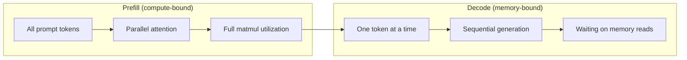
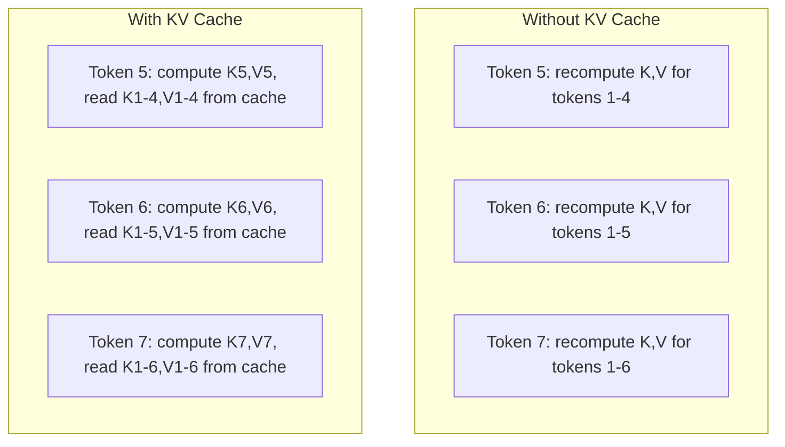
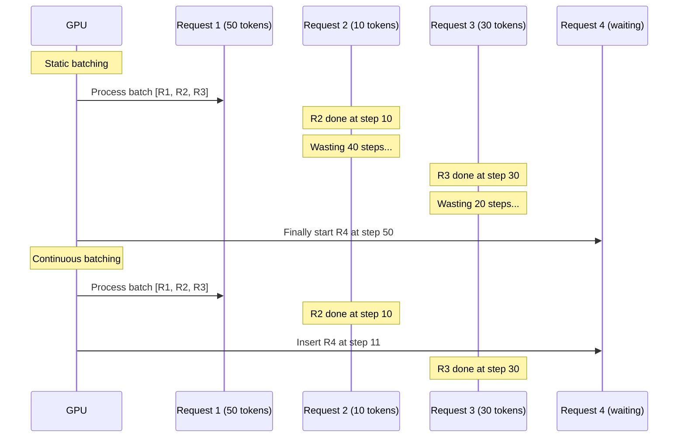
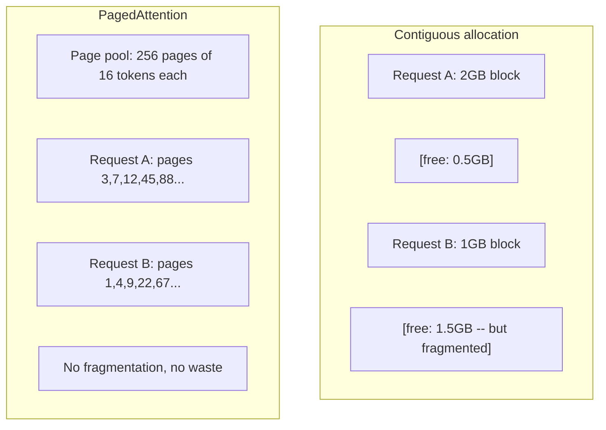
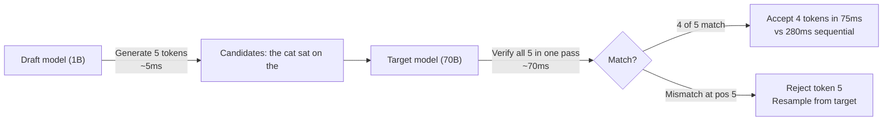

# 推理优化

> LLM 推理由两个阶段定义。Prefill 并行处理你的 prompt——瓶颈在算力;Decode 一次生成一个 token——瓶颈在显存带宽。每一种优化,瞄准的都是其中之一,或两者。

**类型:** 动手构建
**编程语言:** Python
**前置要求:** 第 10 阶段第 01–08 课(Transformer 架构、注意力)
**预计耗时:** 约 120 分钟

## 学习目标

- 实现 KV 缓存,消除自回归 token 生成中的冗余计算
- 解释 LLM 推理的 prefill 与 decode 两个阶段,以及为什么两者瓶颈不同(算力受限 vs 带宽受限)
- 实现连续批处理与 PagedAttention 的概念,在并发请求下最大化 GPU 利用率
- 比较各种推理优化技术(KV 缓存、投机解码、Flash Attention)及其吞吐/延迟权衡

## 问题

你把 Llama 3 70B 部署在 4 块 A100 上。单个用户每秒拿到约 50 个 token,感觉很快。然后 100 个用户同时打到端点上,吞吐掉到每人每秒 3 个 token。每月 25,000 美元的 GPU 账单,服务的响应速度比人打字还慢。

1 个用户和 100 个用户之间,模型本身没有任何变化。同样的权重,同样的架构,同样的数学。变的是你调度工作的方式。朴素推理浪费了 90% 以上的可用 GPU 算力:一个等第 47 个 token 的用户占着一整个批次槽位,而 GPU 的显存总线在矩阵乘法之间空转。与此同时,一个新用户 2,000 token 的 prompt,本可以用有效计算填满这段死时间。

这不是扩展问题,是调度问题。本课的技术——KV 缓存、连续批处理、PagedAttention、投机解码、前缀缓存——就是同样流量下,每月 25k 美元推理账单与每月 5k 美元账单之间的差别。

vLLM 在 4 块 A100-80GB 上服务 Llama 3 70B:低并发时约 50 token/秒/用户,100 并发时通过连续批处理和 PagedAttention 维持在 15–25 TPS/用户。没有这些优化,同样的硬件在该并发下只有 5 TPS/用户。同样的 GPU,同样的模型,4 倍吞吐。

## 概念

### Prefill vs Decode

每个 LLM 推理请求都有两个截然不同的阶段。

**Prefill** 处理整段输入 prompt。所有 token 都已知,注意力可以在整条序列上并行计算。这是一次大矩阵乘法——GPU 核心全程忙碌。瓶颈在算力:你的硬件每秒能交付多少 FLOPS。一块 A100 是 312 TFLOPS(BF16)。70B 模型处理 4,096 token 的 prompt,单块 A100 上 prefill 约 400ms。

**Decode** 一次生成一个输出 token。每个新 token 要关注之前所有 token,但每次前向只产出一个 token。权重矩阵和 prefill 时一样大,但你乘的是一个向量而不是一个矩阵。GPU 核心几微秒就干完了,然后干等下一批权重从显存到来。瓶颈在显存带宽:模型权重从 HBM 流到计算单元有多快。A100 的带宽是 2 TB/s,FP16 的 70B 模型是 140 GB,完整读一遍要 70ms——这就是单个 decode 步的下限。



**ops:byte 比值**(也叫算术强度,arithmetic intensity)刻画了这个权衡:每从显存读一个字节,你做多少次运算。

```
ops:byte ratio = FLOPs per token / bytes read from memory
```

prefill 时,一个 4,096 token 的批次,每读入一个权重约做 4,096 次乘加。比值高——算力受限。decode 时,batch size 为 1,每读入一个权重约做 1 次运算。比值低——带宽受限。

核心洞见:*decode 是带宽受限的,因为你为了产出一个 token 要读完整个模型*。下面的每一种优化,要么是减少读的量,要么是让一次读服务更多 token,要么是干脆不读。

### KV 缓存

注意力中,每个 token 的 query 要关注之前所有 token 的 key 和 value 向量。没有缓存时,生成第 N 个 token 需要重算前 N-1 个 token 的 key 和 value 投影。token 1 在生成 token 2 时被投影一次,生成 token 3 时又一次,token 4 时再一次。到第 1,000 个 token,token 1 已经被投影了 999 次。

KV 缓存把之前所有 token 的 key 和 value 投影存下来。生成第 N 个 token 时,只计算它的 K 和 V,再与缓存中 token 1 到 N-1 的 K/V 拼接。



**KV 缓存的显存公式:**

```
KV cache size = 2 * num_layers * num_kv_heads * head_dim * seq_len * bytes_per_param
```

Llama 3 70B(80 层、GQA 8 个 KV 头、head_dim=128、BF16):

```
per token: 2 * 80 * 8 * 128 * 2 bytes = 327,680 bytes = 320 KB
at 4,096 tokens: 320 KB * 4,096 = 1.28 GB
at 128K tokens: 320 KB * 131,072 = 40 GB
```

一段 128K 上下文的 Llama 3 70B 对话,KV 缓存就要吃掉 40 GB——半块 A100。100 个并发用户每人 4K token,仅 KV 缓存就要 128 GB。这就是为什么 KV 缓存管理是推理优化的核心难题。

### 连续批处理

静态批处理等凑够 N 个请求才一起处理,而且要等*全部*完成才接收新请求。一个请求要 500 个 token,另一个只要 10 个,短的那个完成之后,要空等 490 个 decode 步。

连续批处理(也叫迭代级批处理,iteration-level batching):任何请求一完成,立刻把新请求插入批次。每个 decode 步都重新评估批次。10 个 token 就完成的请求,马上被等待中的请求顶替。



吞吐提升多少,取决于输出长度的参差程度。长度一致时,连续批处理与静态批处理打平;长度不一(常见情况)时,连续批处理能带来 2–5 倍吞吐,因为 GPU 槽位永不闲置。

### PagedAttention

每个请求的 KV 缓存是一块连续显存。请求来了又走,显存就会碎裂——和操作系统里的内存碎片一模一样。一个 4K token 的请求要 1.28 GB 连续空间。即使你总共有 2 GB 空闲,也可能凑不出*连续的* 1.28 GB。要么浪费显存,要么拒绝请求。

PagedAttention(来自 vLLM)把操作系统式的虚拟内存搬到 KV 缓存上。不再为每个请求分配一整块连续空间,而是分配固定大小的"页"(通常每页 16 个 token)。页可以落在物理 GPU 显存的任何位置,一张页表把每个请求的逻辑序列位置映射到物理页。



PagedAttention 还能为共享前缀做**写时复制(copy-on-write)**。50 个请求共享同一个系统提示词,这段提示词的 KV 缓存页只存一份,50 个请求共同引用。只有当某个请求分叉(用户消息不同)时,它才拿到自己的页。对共享系统提示词的应用,这能大幅砍显存。

vLLM 报告通过 PagedAttention 把显存浪费压到接近零(约 4%,而朴素分配是 60–80%)。

### 投机解码

decode 慢,是因为它是串行的——生成一个 token,喂回去,再生成下一个。但如果你能便宜地猜出接下来 5 个 token,然后一次性全部验证呢?

投机解码用一个小而快的**草稿模型(draft model)**生成 K 个候选 token。**目标模型(target model)**再把全部 K 个候选放进一次前向里处理(这看起来就像一次 prefill——并行、算力受限、高效)。目标模型同意草稿的预测,你就用一次目标模型前向的时间收下全部 K 个 token;在位置 j 处不同意,就收下前 j-1 个,丢掉剩下的。



加速比取决于**接受率**——草稿模型的预测与目标模型一致的频率。Llama 3 8B 给 Llama 3 70B 当草稿,自然语言上接受率典型为 70–85%,对应 2–3 倍 decode 加速。

投机解码的三条路线:

| 方法 | 草稿来源 | 接受率 | 开销 |
|--------|-------------|-----------------|----------|
| 草稿—目标(Leviathan 等人) | 独立小模型 | 70–85% | 草稿模型显存 |
| EAGLE(Li 等人) | 目标模型上的轻量头 | 75–90% | 约 1% 额外参数 |
| N-gram 查找 | token n-gram 表 | 40–60% | 可忽略 |

**EAGLE** 在目标模型的隐状态上训练一个小型自回归头,用目标模型倒数第二层的特征预测下一个 token 的嵌入。因为它工作在目标模型自己的表示上(而不是另一个模型的),接受率更高,额外显存极少。EAGLE-2 加了动态草稿树,按上下文调整候选数量。

**N-gram 投机解码**维护一张 n-gram 续写表,来自当前上下文或预建语料。如果草稿与同一对话中先前出现过的内容匹配(重复模式、代码、结构化输出),它零神经网络开销就能触发。平均接受率较低,但每次投机的成本几乎为零。

投机解码是*数学上精确的*——输出分布与目标模型的分布完全相同。它不是近似。验证步骤保证每个被接受的 token,恰好具有目标模型本会赋予的概率。

### 前缀缓存

很多请求共享相同的前缀:聊天机器人的系统提示词、RAG 的上下文块、一组 few-shot 示例。没有前缀缓存,每个请求都要为这些共享 token 从头重算 KV 缓存。

前缀缓存把公共前缀的 KV 缓存存下来,跨请求复用。带着已知前缀的新请求到来时,系统复制(或引用)缓存的 KV 项,只计算独有后缀的 KV。

所有请求共享一段 2,000 token 的系统提示词时,前缀缓存为每个请求省下约 400ms 的 prefill。每秒 100 个请求,就是每秒省 40 秒 GPU 算力——超过一块 GPU 的全部产出。

SGLang 的 RadixAttention 用基数树(radix tree,trie)实现前缀缓存,按 token 内容索引前缀。任何匹配已存前缀的请求,免费拿到那段 KV 缓存。树结构支持部分前缀匹配——你与缓存项共享 2,000 个前缀 token 中的 1,500 个,就复用这 1,500 个,只重算 500 个。

### 推理引擎

生产级 LLM 服务由三个引擎主导:

| 引擎 | 关键创新 | 适用场景 |
|--------|---------------|----------|
| vLLM | PagedAttention、连续批处理 | 通用服务,兼容性最好 |
| SGLang | RadixAttention(前缀缓存)、结构化生成 | 多轮聊天、约束解码 |
| TensorRT-LLM | NVIDIA kernel 融合、FP8 量化 | NVIDIA 硬件上的单卡极限吞吐 |

**vLLM** 是默认起点。支持的模型最广,能跑在任何 GPU 厂商(NVIDIA、AMD、Intel)上,通过 PagedAttention + 连续批处理拿到强吞吐。OpenAI 兼容的 API 意味着它可以无缝替换任何 OpenAI API 调用。

**SGLang** 与 vLLM 同一地基,但加了 RadixAttention 前缀缓存和一套面向结构化 LLM 程序的领域专用语言。如果你的负载涉及多轮对话、工具调用或约束解码(JSON 输出、正则引导生成),SGLang 靠前缀复用常常比 vLLM 快 2–5 倍。

**TensorRT-LLM** 把模型编译成优化过的 NVIDIA GPU kernel。它融合算子(注意力 + 线性 + 激活在一个 kernel 里),在 H100 上用 FP8,并与 NVIDIA Triton Inference Server 集成做生产部署。它在 NVIDIA 硬件上拿到最高的单卡吞吐,但配置更麻烦,而且只支持 NVIDIA GPU。

Llama 3 70B 的实测数字(4 块 A100-80GB,BF16):

| 指标 | vLLM | SGLang | TensorRT-LLM |
|--------|------|--------|---------------|
| 吞吐(1 用户) | ~50 TPS | ~55 TPS | ~65 TPS |
| 吞吐(100 用户) | ~2,500 总 TPS | ~3,200 总 TPS | ~3,000 总 TPS |
| 首 token 延迟 | ~400ms | ~300ms(前缀命中) | ~350ms |
| 最大上下文 | 128K | 128K | 128K |

### Ops:Byte 框架

不测量就谈不上优化。ops:byte 比值告诉你是算力受限还是带宽受限,而这决定了哪种优化管用。

```
Compute roof: peak FLOPS of the GPU
Memory roof:  peak bandwidth * ops:byte ratio
```

ops:byte 低时(decode、小批次),你撞上的是带宽屋顶。加算力(更高主频、更多核心)没用。你得减少显存读取(量化、KV 缓存压缩),或者加大批次,让一次读摊到更多有效工作上。

ops:byte 高时(prefill、大批次),你撞上的是算力屋顶。带宽优化没用。你需要更快的 GPU、kernel 融合,或更低精度来挤出更多 FLOPS。

| 场景 | ops:byte | 受限类型 | 优化手段 |
|----------|----------|-------|---------------|
| Prefill,batch=1 | ~4,096 | 算力 | kernel 融合、FP8 |
| Decode,batch=1 | ~1 | 带宽 | 量化、KV 压缩 |
| Decode,batch=32 | ~32 | 带宽 | 更大批次、连续批处理 |
| Decode,batch=256 | ~256 | 过渡区 | 两者都重要 |
| Decode,batch=1024 | ~1,024 | 算力 | kernel 融合、张量并行 |

A100 上的临界点在 ops:byte ≈ 156(312 TFLOPS / 2 TB/s)。低于 156 带宽受限,高于 156 算力受限。连续批处理通过每次迭代塞进更多 token,把 decode 推向这个临界点。

```figure
context-window-slide
```

## 动手构建

### 第 1 步:从零实现 KV 缓存

构建一个多头 KV 缓存,按层、按头存储 key 和 value 投影,并演示其显存增长模式。

```python
import numpy as np

class KVCache:
    def __init__(self, num_layers, num_heads, head_dim, max_seq_len, dtype=np.float16):
        self.num_layers = num_layers
        self.num_heads = num_heads
        self.head_dim = head_dim
        self.max_seq_len = max_seq_len
        self.dtype = dtype

        self.k_cache = np.zeros(
            (num_layers, num_heads, max_seq_len, head_dim), dtype=dtype
        )
        self.v_cache = np.zeros(
            (num_layers, num_heads, max_seq_len, head_dim), dtype=dtype
        )
        self.seq_len = 0

    def update(self, layer_idx, new_keys, new_values):
        num_new = new_keys.shape[1]
        end = self.seq_len + num_new
        self.k_cache[layer_idx, :, self.seq_len:end, :] = new_keys
        self.v_cache[layer_idx, :, self.seq_len:end, :] = new_values
        return (
            self.k_cache[layer_idx, :, :end, :],
            self.v_cache[layer_idx, :, :end, :]
        )

    def advance(self, num_tokens):
        self.seq_len += num_tokens

    def memory_bytes(self):
        return self.k_cache.nbytes + self.v_cache.nbytes

    def used_bytes(self):
        per_token = 2 * self.num_layers * self.num_heads * self.head_dim * np.dtype(self.dtype).itemsize
        return per_token * self.seq_len
```

### 第 2 步:带 KV 缓存的注意力

一个简化版多头注意力,在 decode 步使用 KV 缓存。

```python
def scaled_dot_product_attention(query, keys, values):
    head_dim = query.shape[-1]
    scores = np.matmul(query, keys.transpose(0, 1, 3, 2)) / np.sqrt(head_dim)
    seq_len_q = scores.shape[-2]
    seq_len_k = scores.shape[-1]
    if seq_len_q > 1:
        mask = np.triu(np.ones((seq_len_q, seq_len_k), dtype=np.float32), k=seq_len_k - seq_len_q + 1)
        scores = scores + mask * (-1e9)
    max_scores = np.max(scores, axis=-1, keepdims=True)
    exp_scores = np.exp(scores - max_scores)
    attn_weights = exp_scores / np.sum(exp_scores, axis=-1, keepdims=True)
    return np.matmul(attn_weights, values)


class MultiHeadAttention:
    def __init__(self, d_model, num_heads):
        self.num_heads = num_heads
        self.head_dim = d_model // num_heads
        scale = np.sqrt(2.0 / d_model)
        self.W_q = np.random.randn(d_model, d_model).astype(np.float32) * scale
        self.W_k = np.random.randn(d_model, d_model).astype(np.float32) * scale
        self.W_v = np.random.randn(d_model, d_model).astype(np.float32) * scale
        self.W_o = np.random.randn(d_model, d_model).astype(np.float32) * scale

    def forward(self, x, kv_cache=None, layer_idx=0):
        batch, seq_len, d_model = x.shape
        Q = np.matmul(x, self.W_q).reshape(batch, seq_len, self.num_heads, self.head_dim).transpose(0, 2, 1, 3)
        K = np.matmul(x, self.W_k).reshape(batch, seq_len, self.num_heads, self.head_dim).transpose(0, 2, 1, 3)
        V = np.matmul(x, self.W_v).reshape(batch, seq_len, self.num_heads, self.head_dim).transpose(0, 2, 1, 3)

        if kv_cache is not None:
            K_full, V_full = kv_cache.update(layer_idx, K[0], V[0])
            K = K_full[np.newaxis, :, :, :]
            V = V_full[np.newaxis, :, :, :]
            if seq_len == 1:
                kv_cache.advance(1)

        attn_out = scaled_dot_product_attention(Q, K, V)
        attn_out = attn_out.transpose(0, 2, 1, 3).reshape(batch, -1, d_model)
        return np.matmul(attn_out, self.W_o)
```

### 第 3 步:连续批处理模拟器

模拟静态批处理与连续批处理的调度差异。

```python
import heapq

class Request:
    def __init__(self, request_id, prompt_tokens, output_tokens, arrival_step):
        self.request_id = request_id
        self.prompt_tokens = prompt_tokens
        self.output_tokens = output_tokens
        self.arrival_step = arrival_step
        self.tokens_generated = 0
        self.start_step = None
        self.end_step = None

    def is_done(self):
        return self.tokens_generated >= self.output_tokens


def simulate_static_batching(requests, batch_size):
    step = 0
    completed = []
    queue = list(requests)
    queue.sort(key=lambda r: r.arrival_step)

    while queue:
        batch = []
        while queue and len(batch) < batch_size:
            r = queue.pop(0)
            r.start_step = max(step, r.arrival_step)
            batch.append(r)

        if batch:
            step = max(step, max(r.start_step for r in batch))
            max_output = max(r.output_tokens for r in batch)
            for r in batch:
                r.tokens_generated = r.output_tokens
                r.end_step = step + max_output
            step += max_output
            completed.extend(batch)

    return completed


def simulate_continuous_batching(requests, batch_size):
    step = 0
    completed = []
    queue = sorted(requests, key=lambda r: r.arrival_step)
    queue_idx = 0
    active = []
    waiting = []

    while queue_idx < len(queue) or active or waiting:
        while queue_idx < len(queue) and queue[queue_idx].arrival_step <= step:
            waiting.append(queue[queue_idx])
            queue_idx += 1

        while waiting and len(active) < batch_size:
            r = waiting.pop(0)
            r.start_step = step
            active.append(r)

        if not active:
            if waiting:
                step += 1
                continue
            elif queue_idx < len(queue):
                step = queue[queue_idx].arrival_step
                continue
            else:
                break

        for r in active:
            r.tokens_generated += 1

        done = [r for r in active if r.is_done()]
        for r in done:
            r.end_step = step + 1
            completed.append(r)
        active = [r for r in active if not r.is_done()]

        step += 1

    return completed


def batching_stats(completed):
    latencies = [r.end_step - r.arrival_step for r in completed]
    total_time = max(r.end_step for r in completed) - min(r.arrival_step for r in completed)
    total_tokens = sum(r.output_tokens for r in completed)
    return {
        "avg_latency": np.mean(latencies),
        "p50_latency": np.median(latencies),
        "p99_latency": np.percentile(latencies, 99),
        "total_time": total_time,
        "throughput": total_tokens / total_time if total_time > 0 else 0,
    }
```

### 第 4 步:前缀缓存

基于 trie 的前缀缓存,为共享前缀存储 KV 项。

```python
class TrieNode:
    def __init__(self):
        self.children = {}
        self.kv_data = None
        self.hit_count = 0


class PrefixCache:
    def __init__(self, max_entries=1000):
        self.root = TrieNode()
        self.max_entries = max_entries
        self.total_entries = 0
        self.hits = 0
        self.misses = 0

    def _walk(self, token_ids):
        node = self.root
        depth = 0
        for tid in token_ids:
            if tid not in node.children:
                break
            node = node.children[tid]
            depth += 1
        return node, depth

    def lookup(self, token_ids):
        node, depth = self._walk(token_ids)
        if depth > 0:
            self.hits += 1
            current = self.root
            for tid in token_ids[:depth]:
                current = current.children[tid]
                current.hit_count += 1
            kv_entries = []
            current = self.root
            for tid in token_ids[:depth]:
                current = current.children[tid]
                if current.kv_data is not None:
                    kv_entries.append(current.kv_data)
            return depth, kv_entries
        self.misses += 1
        return 0, []

    def insert(self, token_ids, kv_per_token):
        node = self.root
        for i, tid in enumerate(token_ids):
            if tid not in node.children:
                if self.total_entries >= self.max_entries:
                    return i
                node.children[tid] = TrieNode()
                self.total_entries += 1
            node = node.children[tid]
            if i < len(kv_per_token):
                node.kv_data = kv_per_token[i]
        return len(token_ids)

    def hit_rate(self):
        total = self.hits + self.misses
        return self.hits / total if total > 0 else 0.0
```

### 第 5 步:投机解码模拟器

模拟接受率可配置的"草稿—目标"投机解码。

```python
class DraftModel:
    def __init__(self, vocab_size, acceptance_rate=0.8):
        self.vocab_size = vocab_size
        self.acceptance_rate = acceptance_rate

    def generate(self, context, num_tokens):
        tokens = np.random.randint(0, self.vocab_size, size=num_tokens)
        return tokens

    def get_probs(self, context, token):
        probs = np.random.dirichlet(np.ones(self.vocab_size))
        return probs


class TargetModel:
    def __init__(self, vocab_size):
        self.vocab_size = vocab_size

    def get_probs(self, context, tokens=None):
        if tokens is not None:
            return [np.random.dirichlet(np.ones(self.vocab_size)) for _ in tokens]
        return np.random.dirichlet(np.ones(self.vocab_size))


def speculative_decode(draft_model, target_model, context, num_speculative=5,
                       draft_cost=1.0, target_cost=10.0, verify_cost=12.0):
    total_tokens = 0
    total_cost = 0.0
    accepted_counts = []
    context = list(context)

    max_tokens = 100

    while total_tokens < max_tokens:
        draft_tokens = draft_model.generate(context, num_speculative)
        total_cost += draft_cost * num_speculative

        target_probs = target_model.get_probs(context, draft_tokens)
        total_cost += verify_cost

        accepted = 0
        for i, token in enumerate(draft_tokens):
            draft_p = draft_model.get_probs(context + list(draft_tokens[:i]), token)
            target_p = target_probs[i]

            r = np.random.random()
            acceptance_prob = min(1.0, target_p[token] / (draft_p[token] + 1e-10))

            if r < draft_model.acceptance_rate:
                accepted += 1
                context.append(token)
                total_tokens += 1
            else:
                new_token = np.random.choice(draft_model.vocab_size, p=target_p)
                context.append(new_token)
                total_tokens += 1
                break

        accepted_counts.append(accepted)

        if accepted == num_speculative:
            bonus_probs = target_model.get_probs(context)
            bonus_token = np.random.choice(draft_model.vocab_size, p=bonus_probs)
            context.append(bonus_token)
            total_tokens += 1

    sequential_cost = total_tokens * target_cost
    return {
        "total_tokens": total_tokens,
        "speculative_cost": total_cost,
        "sequential_cost": sequential_cost,
        "speedup": sequential_cost / total_cost if total_cost > 0 else 1.0,
        "avg_accepted": np.mean(accepted_counts),
        "acceptance_rate": np.mean(accepted_counts) / num_speculative,
    }


def compare_speculation_strategies(vocab_size=1000, num_trials=20):
    results = {}

    for name, acceptance_rate, spec_tokens in [
        ("Draft-target (8B->70B)", 0.78, 5),
        ("EAGLE", 0.85, 6),
        ("N-gram", 0.50, 4),
        ("No speculation", 0.0, 0),
    ]:
        if spec_tokens == 0:
            results[name] = {
                "speedup": 1.0,
                "acceptance_rate": 0.0,
                "avg_accepted": 0.0,
            }
            continue

        trial_results = []
        for _ in range(num_trials):
            draft = DraftModel(vocab_size, acceptance_rate=acceptance_rate)
            target = TargetModel(vocab_size)
            context = list(np.random.randint(0, vocab_size, size=10))
            result = speculative_decode(draft, target, context, num_speculative=spec_tokens)
            trial_results.append(result)

        results[name] = {
            "speedup": np.mean([r["speedup"] for r in trial_results]),
            "acceptance_rate": np.mean([r["acceptance_rate"] for r in trial_results]),
            "avg_accepted": np.mean([r["avg_accepted"] for r in trial_results]),
        }

    return results
```

### 第 6 步:KV 缓存显存分析器

计算真实模型配置的 KV 缓存显存需求。

```python
MODEL_CONFIGS = {
    "Llama-3-8B": {
        "num_layers": 32, "num_kv_heads": 8, "head_dim": 128,
        "model_params_b": 8, "gqa": True,
    },
    "Llama-3-70B": {
        "num_layers": 80, "num_kv_heads": 8, "head_dim": 128,
        "model_params_b": 70, "gqa": True,
    },
    "Llama-3-405B": {
        "num_layers": 126, "num_kv_heads": 8, "head_dim": 128,
        "model_params_b": 405, "gqa": True,
    },
    "Mistral-7B": {
        "num_layers": 32, "num_kv_heads": 8, "head_dim": 128,
        "model_params_b": 7, "gqa": True,
    },
    "GPT-4-est": {
        "num_layers": 120, "num_kv_heads": 96, "head_dim": 128,
        "model_params_b": 1800, "gqa": False,
    },
}


def kv_cache_memory(config, seq_len, dtype_bytes=2):
    per_token = 2 * config["num_layers"] * config["num_kv_heads"] * config["head_dim"] * dtype_bytes
    total = per_token * seq_len
    return {
        "per_token_bytes": per_token,
        "per_token_kb": per_token / 1024,
        "total_bytes": total,
        "total_mb": total / (1024 ** 2),
        "total_gb": total / (1024 ** 3),
    }


def memory_budget(config, gpu_memory_gb, model_dtype_bytes=2, kv_dtype_bytes=2):
    model_memory_gb = config["model_params_b"] * 1e9 * model_dtype_bytes / (1024 ** 3)
    overhead_gb = gpu_memory_gb * 0.1
    available_for_kv = gpu_memory_gb - model_memory_gb - overhead_gb

    if available_for_kv <= 0:
        return {"error": "Model does not fit in GPU memory", "model_memory_gb": model_memory_gb}

    per_token = 2 * config["num_layers"] * config["num_kv_heads"] * config["head_dim"] * kv_dtype_bytes
    max_tokens = int(available_for_kv * (1024 ** 3) / per_token)

    return {
        "gpu_memory_gb": gpu_memory_gb,
        "model_memory_gb": round(model_memory_gb, 1),
        "overhead_gb": round(overhead_gb, 1),
        "available_for_kv_gb": round(available_for_kv, 1),
        "max_total_tokens": max_tokens,
        "max_users_at_2k": max_tokens // 2048,
        "max_users_at_4k": max_tokens // 4096,
        "max_users_at_32k": max_tokens // 32768,
    }
```

## 投入使用

用 vLLM:

```python
from vllm import LLM, SamplingParams

llm = LLM(
    model="meta-llama/Llama-3-70B-Instruct",
    tensor_parallel_size=4,
    enable_prefix_caching=True,
    max_model_len=8192,
    gpu_memory_utilization=0.9,
)

params = SamplingParams(temperature=0.7, max_tokens=256)
outputs = llm.generate(["Explain inference optimization in one paragraph."], params)
```

用 SGLang 做前缀缓存 + 结构化输出:

```python
import sglang as sgl

@sgl.function
def classify(s, text):
    s += sgl.system("You are a classifier. Output JSON only.")
    s += sgl.user(f"Classify this text: {text}")
    s += sgl.assistant(sgl.gen("result", regex=r'\{"label": "(positive|negative|neutral)"\}'))

runtime = sgl.Runtime(model_path="meta-llama/Llama-3-70B-Instruct", tp_size=4)
sgl.set_default_backend(runtime)

results = classify.run_batch([
    {"text": "This product is amazing!"},
    {"text": "Terrible experience."},
    {"text": "It was okay I guess."},
])
```

用 TensorRT-LLM:

```python
import tensorrt_llm
from tensorrt_llm.runtime import ModelRunner

runner = ModelRunner.from_dir("./llama-70b-trt-engine/", rank=0)

outputs = runner.generate(
    batch_input_ids=[tokenizer.encode("Explain KV caching.")],
    max_new_tokens=256,
    temperature=0.7,
)
```

## 交付

本课会产出:
- `outputs/skill-inference-optimization.md` ——一个用于诊断和优化 LLM 推理服务的技能

## 练习

1. 扩展 KV 缓存分析器,对比 FP16、FP8、INT4 三种 KV 缓存量化。对 4K 上下文的 Llama 3 70B,计算 4 块 A100-80GB 上各自的最大并发用户数。INT4 量化应能把用户容量提升约 4 倍。

2. 扩展连续批处理模拟器,跟踪 GPU 利用率(每步被填满的批次槽位比例)。输出长度服从 Pareto 分布(shape=1.5, scale=20)的 50 个请求,画出两种批处理的利用率曲线。连续批处理应保持 >80% 的利用率。

3. 实现分组查询注意力(GQA)版本的 KV 缓存:`num_kv_heads < num_query_heads`。Llama 3 70B 用 64 个查询头但只有 8 个 KV 头。计算相对完整多头注意力的显存节省(KV 缓存缩小 8 倍)。

4. 构建带 LRU 淘汰的前缀缓存。max_entries 设为 500,生成 1,000 个请求,其中 60% 共享 5 个公共前缀之一。测量命中率并与无限缓存对比。淘汰策略得当,命中率应保持在 55% 以上。

5. 扩展投机解码模拟器,实现树形投机(EAGLE-2 风格):不再是单链 K 个草稿 token,而是生成候选树(如 3 层每层 2 分支 = 8 个叶候选)。对比每轮验证接受的总 token 数与线性投机。

## 关键术语

| 术语 | 人们常说的 | 实际含义 |
|------|----------------|----------------------|
| Prefill | "处理 prompt" | 并行计算所有输入 token 的注意力——算力受限,因为完整矩阵乘法让 GPU 核心全程忙碌 |
| Decode | "生成 token" | 每次前向产出一个 token,每次都读完整个模型权重——带宽受限,因为算完了下一批权重还没到 |
| KV 缓存(KV cache) | "缓存注意力状态" | 存下之前所有 token 的 key 和 value 投影,decode 时不再重算——用显存换算力 |
| 连续批处理(Continuous batching) | "动态批处理" | 任何请求一完成就把新请求插进运行中的批次,每次 decode 迭代都评估,而不是等整批结束 |
| PagedAttention | "KV 缓存的虚拟内存" | KV 缓存按固定大小的页分配而不是连续块,消除碎片,还能对共享前缀写时复制 |
| 投机解码(Speculative decoding) | "草稿加验证" | 快速草稿模型提议多个 token,目标模型一次前向全部验证——数学上精确,2–3 倍加速 |
| EAGLE | "自我投机解码" | 在目标模型自己的隐状态上训练轻量头的投机解码变体,接受率高于独立草稿模型 |
| 前缀缓存(Prefix caching) | "复用系统提示词的 KV" | 为公共前缀(系统提示词、few-shot 示例)存储算好的 KV 项,跨请求复用,跳过重复 prefill |
| Ops:byte 比值 | "算术强度" | 运算次数与读取显存字节数之比——决定工作负载是算力受限(比值高)还是带宽受限(比值低) |
| 首 token 延迟(TTFT) | "TTFT" | 从收到请求到产出第一个输出 token 的延迟——长 prompt 时由 prefill 主导 |

## 延伸阅读

- Kwon et al., "Efficient Memory Management for Large Language Model Serving with PagedAttention" (2023) ——提出分页 KV 缓存管理的 vLLM 论文,如今推理服务的行业标准
- Leviathan et al., "Fast Inference from Transformers via Speculative Decoding" (2023) ——奠基论文,证明"草稿—验证"投机产出与目标模型完全相同的分布,同时加速 2–3 倍
- Li et al., "EAGLE: Speculative Sampling Requires Rethinking Feature Uncertainty" (2024) ——在目标模型自身特征上训练头部而非使用独立草稿模型,接受率更高
- Zheng et al., "SGLang: Efficient Execution of Structured Language Model Programs" (2024) ——提出用于前缀缓存的 RadixAttention 和多调用 LLM 程序的编程模型
- Williams et al., "Roofline: An Insightful Visual Performance Model for Multicore Architectures" (2009) ——原始 roofline 论文,把用于分析算力 vs 带宽瓶颈的 ops:byte 框架形式化
