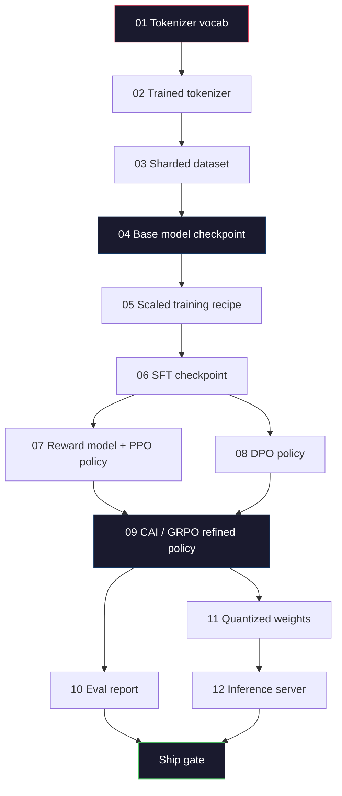
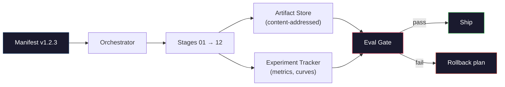

# 构建完整的 LLM 流水线

> 第 01 到 12 课,合起来只是一条流水线里的各个环节。本课是把这些环节接成一次端到端运行的脚手架:分词、预训练、扩规模、SFT、对齐、评估、量化、上线。你不会在笔记本上训 70B 模型——你要产出的是编排层、清单(manifest)、评估闸门和回滚计划,也就是 2026 年前沿团队用来决定"什么能上线"的那套东西。这是毕业设计。

**类型:** 动手构建
**编程语言:** Python(标准库)
**前置要求:** 第 10 阶段第 01–12 课全部
**预计耗时:** 约 120 分钟

## 学习目标

- 把前面十一课(分词器、数据、预训练、扩规模、SFT、RLHF、DPO、CAI、评估、量化、推理)组合成一份可复现的流水线规格
- 定义环节之间的制品契约:每个环节消费什么、产出什么、下一个环节如何校验输入
- 构建一个编排器:跟踪实验、给制品算哈希、按评估阈值把守上线决策
- 设计回滚计划:哪些制品重跑便宜、哪些昂贵、一个损坏的检查点代价几何

## 问题

之前的每一课各自都能跑通。分词器训好了,迷你 GPT 预训练了,SFT 数据集组装了,奖励模型训了,DPO 跑了,评估测了,量化权重导出了,推理服务器起了。每一个都是一个 notebook,各有自己的约定、自己的输出路径、自己的随机种子。

但一次前沿训练不是 notebook。Llama 3 405B 烧了 3,000 万 H100 小时,历时约 54 天;DeepSeek-V3 用了约 280 万 H800 小时。在这段时间里,一个损坏的检查点、一次数据污染、一次评估回退,就能让团队赔上一周墙钟和一个月的 GPU 预算。团队能活下来,靠的是流水线卫生:每个环节都有确定的输入、确定的产出、一份清单、一个哈希、一道闸门。

这就是毕业设计。你不会在笔记本上端到端跑这条流水线。你要写的是:协调各环节的编排器、描述这次运行的清单、把守上线决策的校验器,以及让第三方能凭一个文件重跑你全部工作的重放计划。代码很小,纪律很大。

这套模式从 100M 到 1T 参数,形状不变。同样的四个部件——清单、编排器、评估闸门、制品仓库——既跑 Llama 3,也跑你的玩具 GPT。变的只是每个环节配置里数字的大小,不是流水线的形状。

## 概念

### 十二个环节

第 10 阶段的每一课就是一个环节。这是完整的依赖图。



环节 07 和 08 可以并行,其余都是硬依赖。环节 02(分词器)一变,下游所有制品作废;环节 10(评估)一变,只有上线决策作废。

### 清单(Manifest)

清单是一个把一次运行描述到足以重放的文件。流水线产出的任何东西,都不许依赖清单之外的状态。字段很无聊,但一个都不能少。

```
pipeline_version: 1.2.3
seed: 42
git_commit: a1b2c3d4
stages:
  01_tokenizer:
    recipe: bpe_32k
    input_hash: sha256:...
    output_hash: sha256:...
    wall_clock_sec: 3600
    cost_usd: 12
```

环节 N 的输出哈希,就是环节 N+1 的输入哈希。任何偏差,流水线立即停机。这是你尽早抓住数据损坏的办法,也是另一个大洲的队友验证"我重放出的制品和你那份相同"的办法。

实践中,团队用一个小型 YAML schema 加一个清单检查器,与上一次成功运行做 diff。预期字段(成本、墙钟)之外的任何 delta,都是红旗。

### 制品类型化

每个环节的产出是一个带类型的制品。不是一坨目录,不是一个 pickle,而是一个 schema 已知的命名类型。

| 环节 | 制品类型 | 关键字段 |
|-------|--------------|-----------|
| 01-02 | 分词器 | vocab.json、merges.txt、config.json、hash |
| 03 | 数据集 | shards[]、行数、token 数、去重统计 |
| 04-05 | 检查点 | weights.safetensors、config.json、优化器状态、步数 |
| 06 | SFT 模型 | 检查点 + SFT 配方 + 数据配比 |
| 07 | 奖励模型 | RM 检查点 + 偏好数据哈希 |
| 08-09 | 策略 | 检查点 + 参考模型哈希 + beta + 已消耗的 KL 预算 |
| 10 | 评估报告 | 基准分数 + 回退 diff + 评估数据哈希 |
| 11 | 量化模型 | 量化权重 + 校准数据 + 相对 FP16 的精度差 |
| 12 | 服务规格 | 端点 + 模型哈希 + 配置 + 可观测性钩子 |

类型化防的是最常见的翻车方式:把环节 08 的产出当成环节 06 的输入,把 DPO 训出的模型从 SFT 的路径上发出去。类型化制品加类型化环节签名,让这类错误在编译期就爆炸,而不是第五天。

### 评估闸门

上线不是"训练结束了",而是"训练结束了,并且评估闸门过了"。闸门在运行开始之前就定义好。

```
gates:
  mmlu:      >= baseline + 0.5   # no regression
  humaneval: >= baseline + 1.0
  truthfulqa: >= baseline         # no drop
  safety_refusal_rate: <= 0.05
  kl_from_reference: <= 25.0
  cost_total_usd: <= 50000
```

每道闸门都是一个数值阈值。没有"看起来不错"的闸门,没有主观签字。全部通过,制品标记为可交付;任何一道不过,运行挂起,等待指定评审人显式放行——放行本身也会记进清单。

两道闸门能拦住大多数灾难。*回退闸门*(新模型在核心基准上必须不输给旧模型)抓训练 bug;*KL 预算闸门*(对齐后的策略相对参考模型的漂移不许超过 X)抓对齐过度。每一条生产流水线,两道都有。

### 编排器

一小段代码:读清单、派发环节、跟踪制品、任何契约违约立即停机。这不是 Airflow,不是 Kubeflow。流水线卫生要的是你自己写的、无聊的东西。

编排器的职责很窄:

1. 从清单解析 DAG。
2. 对每个环节,检查正确哈希的预期产出是否已存在(存在就跳过)。
3. 运行环节,捕获 stdout/stderr,计量墙钟和成本。
4. 用下游环节的预期输入哈希校验本环节输出哈希。
5. 失败时,写出标明失败环节的部分清单,以非零码退出。

这就是 200 行 Python,长得就像本课的 `code/main.py`。在底层,真正的流水线用 `torchrun` 或 `ray` 在集群上执行单个环节,但编排器本身跑在一台机器上。

### 实验跟踪与制品存储

两个外部系统锚定整条流水线。

**实验跟踪器(wandb、neptune、mlflow)。** 按环节记录损失曲线、评估指标和系统遥测。三周后要对比 A 运行和 B 运行,就去这里。团队几乎总是用托管服务——自己写纯属浪费本该用于训练的时间。

**制品仓库(S3、R2、GCS)。** 存检查点、数据集、分词器、评估报告的不可变对象存储。制品按哈希寻址,不按文件名。`latest.pt` 这种文件名是给自己脚下埋枪;`ckpt-7b-step-20000-sha256:abc123.safetensors` 才是契约。

编排器两边都写。跟踪器是给人看图表的,制品仓库是给下一个环节查输入的。

### 成本核算

一次前沿运行挂着一个美元数字。预算纪律落实在两个地方。

**运行前估算。** 从清单算出预期 FLOPs(预训练:6 × 参数 × token)、预期 GPU 小时(FLOPs / 峰值吞吐 / 利用率),再按当前租赁价折成美元。估算超过预算闸门,流水线拒绝启动。

**运行中跟踪。** 逐环节的墙钟和成本记入清单。每个环节结束后,检查剩余预算。某个环节超支,下一个环节的闸门按新的剩余预算评估。不要等到投资人打来电话,才发现钱花光了。

Llama 3 公开的成本是 6,100 万美元,DeepSeek-V3 主预训练公开的是 560 万美元。这个比值主要来自硬件效率加混合专家——但具体数字之所以可见,是因为两支团队都按环节记账,而不是按运行记账。

### 可复现 vs 确定性

这两者不是一回事。*可复现(reproducible)*指:同一清单 + 同一代码 + 同一基础设施,产出下游指标等价的检查点。*确定性(deterministic)*指:输出逐位一致。

现代 LLM 训练可复现,但不确定。分布式训练的归约顺序、GPU kernel 的非确定性(cuBLAS、flash-attn)、混合精度舍入,叠加起来让两次运行的浮点数在 1e-5 量级上不同。这对最终指标毫无影响,指标不动;但如果你想按位 diff 来调试,这就是灾难。解法是:记录每个环节的输入哈希、输出哈希和头条指标——这些对上了,这次运行就算"复现"了,哪怕权重不是逐位一致。



### 回滚计划

运行开始之前,写下每个环节失败时怎么办。三类。

- **重跑便宜**(小时级):分词器、评估、量化、推理服务器。直接重跑。
- **中等**(天级):SFT、DPO、CAI。保住基座模型,只重跑对齐环节。
- **昂贵**(数周、数百万美元):预训练。这里的回滚计划不是"重跑",而是"用上一个好检查点,拿修订过的数据重跑便宜的下游环节"。

因为环节依赖是类型化且带哈希的,编排器可以自动计算回滚集合:让失败环节及其全部后代失效。环节 06(SFT)失败,作废 06、07、08、09、10、11、12;环节 11(量化)失败,只作废 11 和 12。事先说清楚,免得团队凌晨四点精疲力尽时临场发挥。

### 2026 年观察到的生产配方

大多数前沿团队收敛到了同一副骨架。

- 分词器:128k BPE,带字节回退。在一个小而均衡的多语种切片上训练。
- 预训练:10–20T token,网页 + 代码 + 合成数据为主。Muon 或 AdamW 优化器。FSDP2 或 DeepSpeed ZeRO-3。梯度检查点。BF16 权重,FP32 主权重。
- SFT:50 万到 200 万指令对,人工与合成混合,对评估集严格去重。
- 对齐:DPO 或 CAI + GRPO。只有当偏好信号维度多到 DPO 装不下时,才上 RLHF。
- 评估:MMLU-Pro、MATH、HumanEval+、GPQA、SWE-Bench Verified、LiveBench,外加一套公众永远看不到的私有留出集。
- 量化:服务用 4-bit GPTQ 或 AWQ;精度差敏感的安全评估用 8-bit。
- 服务:vLLM、TensorRT-LLM 或自研。连续批处理、投机解码、KV 缓存淘汰。

数字每半年一换,骨架不换。

```figure
beam-search
```

## 动手构建

本课的代码是一个编排器和一个清单检查器,而不是十二个训练脚本。每个环节用占位符模拟,产出形状和哈希都正确的制品。端到端跑通编排器,证明流水线的管道是好的——然后你才把 GPU 钱烧在真实环节上。

完整实现见 `code/main.py`。关键部件:

- `Manifest` dataclass:流水线版本、种子、git commit、环节、闸门。
- `Stage` dataclass:名称、类型、输入(哈希)、输出(哈希)、墙钟、成本。
- `Orchestrator.run()`:解析 DAG、派发环节、校验哈希、更新清单。
- `EvalGate.check()`:读阈值,与最新评估报告对比,返回通过/不通过。
- `ArtifactStore`(内存桩):按哈希存取,模拟 S3。
- `CostTracker`:逐环节与累计,超限即停机。

`main.py` 里的流水线跑十二个占位环节,产出一份清单,并故意触发一次评估闸门失败,展示一次被挂起的运行长什么样。把每个占位符换成对应课程的真实训练脚本,你就有了真实前沿流水线所用的骨架。

## 投入使用

标准工作流只有三条命令。

```
python code/main.py plan    # validate manifest, compute cost estimate, print DAG
python code/main.py run     # execute stages, writing to manifest.out.yaml
python code/main.py gate    # read manifest.out.yaml, apply eval gates, ship-or-hold
```

每次先跑 `plan`。大多数流水线 bug 在 plan 阶段就会现形——闸门阈值缺失、哈希过期、预算超支。跑 `plan` 是免费的,跑 `run` 是烧钱的。在便宜的一侧抓 bug,就是省钱。

`gate` 的输出是 `SHIP` 或 `HOLD: <reason>`。被挂起的运行不是失败,是决策点:指定评审人要么放行(放行会记档),要么批准回滚。

## 交付

本课会产出 `outputs/skill-llm-pipeline-reviewer.md`。喂给它一份流水线清单提案,它会检查所有契约:环节类型、哈希链、闸门、回滚计划、成本估算。缺少评估闸门、KL 预算无上限、评估数据与训练数据混用的清单,它一律拒绝批准。

## 练习

1. 扩展编排器,支持环节 07 和 08 并行执行(用标准库 `concurrent.futures`)。确认最终清单记录了两个环节的产出,且环节 09 的输入哈希是两者确定性组合的结果。

2. 加一道"污染检查"闸门。给定评估数据集哈希和训练数据集分片,计算重叠率(精确字符串匹配或 13-gram 匹配)。重叠超过 0.1% 则闸门不通过。喂给它一份被污染的训练集,确认闸门能挂住运行。

3. 从第一性原理实现成本估算器。对环节 04(预训练),按 6 × 参数 × token 估 FLOPs,假设 H100 上 BF16 989 TFLOPs、40% MFU(模型 FLOP 利用率)、每 GPU 小时 2.50 美元。报告 7B 模型训 2T token 的估算值,与公开的 Llama 2 数字对比。

4. 构建部分回滚。模拟环节 09(CAI)失败,然后重跑环节 09 到 12,保持 01–08 的缓存。编排器应通过哈希识别缓存制品并跳过。测量相比全量重跑省下的墙钟。

5. 加可观测性。为每个环节发出 OpenTelemetry span,属性包含参数量、已见 token 数、损失和成本,管道到本地 collector。重点不是仪表盘,而是每个环节的健康状况都能从单个 trace ID 追溯。

## 关键术语

| 术语 | 人们常说的 | 实际含义 |
|------|----------------|----------------------|
| 清单(Manifest) | "配方文件" | 描述流水线版本、种子、逐环节配置和闸门阈值的 YAML 或 JSON——足以重放一次运行 |
| 内容寻址(Content-addressed) | "按哈希不按名" | 制品按内容的 SHA-256 存储,永远不可能把 A 版和 B 版搞混 |
| 评估闸门(Eval gate) | "上线标准" | 基准指标和安全分数上的数值阈值,全过了制品才标记为可交付 |
| KL 预算 | "对齐漂了多远" | 对齐各环节累计 KL(policy ‖ reference) 的上限,以闸门形式强制 |
| MFU | "GPU 用出了几成" | 模型 FLOP 利用率——实际达成 FLOPs 除以理论峰值。70B 规模 40% 是常态,7B 能到 55% |
| 回滚计划(Rollback plan) | "崩了怎么办" | 预先写好的逐环节失败动作:重跑、回退、修订输入后重训 |
| 编排器(Orchestrator) | "指挥" | 读清单、派发环节、校验哈希、任何契约违约立即停机的进程 |
| 制品仓库(Artifact store) | "权重版 S3" | 不可变的内容寻址对象存储——检查点、数据集、评估报告的唯一事实来源 |
| 可复现(Reproducible) | "重放指标一致" | 权重逐位不同但下游指标等价——分布式 LLM 训练的现实目标 |
| 成本闸门(Cost gate) | "不许超过 X" | 运行前成本估算加运行中跟踪——估算超预算,流水线拒绝启动 |

## 延伸阅读

- [Dubey et al., 2024 -- "The Llama 3 Herd of Models"](https://arxiv.org/abs/2407.21783) ——对前沿流水线最详尽的公开描述,涵盖数据、训练、对齐、评估
- [DeepSeek-AI, 2024 -- "DeepSeek-V3 Technical Report"](https://arxiv.org/abs/2412.19437) ——效率优先的流水线,成本约为 Llama 3 级训练的十分之一
- [Kaplan et al., 2020 -- "Scaling Laws for Neural Language Models"](https://arxiv.org/abs/2001.08361) ——算力—数据—参数关系的原始论文
- [Hoffmann et al., 2022 -- "Training Compute-Optimal Large Language Models (Chinchilla)"](https://arxiv.org/abs/2203.15556) ——对 Kaplan 的修正,重新校准了现代数据预算
- [PyTorch FSDP2 documentation](https://pytorch.org/docs/stable/fsdp.html) ——PyTorch 2.4+ 中取代 FSDP1 的分布式训练原语
- [Weights & Biases LLM Reports](https://wandb.ai/site/llms) ——开源 LLM 运行的真实清单与实验跟踪输出,是可以照抄的模板
