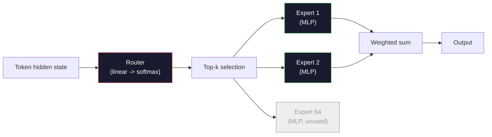

# 开放模型:架构巡礼

> 第 04 课你从零写过一个 GPT-2 Small。2026 年的前沿开放模型,是同一家族加上五六个具体改动:RMSNorm 换掉 LayerNorm,SwiGLU 换掉 GELU,RoPE 换掉学习的位置嵌入,GQA 或 MLA 换掉完整 MHA,规模化时上混合专家。你已经会的那点数学,能覆盖它们的 95%。本课把 Llama 3、DeepSeek-V3、Mixtral、Qwen、Gemma 并排摆开,点名每个架构在哪一行开始分岔。

**类型:** 学习
**编程语言:** Python(标准库)
**前置要求:** 第 10 阶段第 04、05、12 课(预训练、扩规模、推理)
**预计耗时:** 约 45 分钟

## 学习目标

- 读懂 Llama 3、Mistral、Mixtral、Gemma 2、Qwen 2.5、DeepSeek-V3 的 config.json,解释每个字段
- 点名每个模型相对 GPT-2 Small 做的具体架构改动,并从第一性原理说明理由
- 仅凭 config 计算任何开放模型的参数量、KV 缓存大小和激活显存
- 给定延迟、显存和能力约束,为部署目标选对开放模型

## 问题

第 04 课,你写了 350 行 numpy,得到一个 GPT-2 形状的模型。Llama 3 405B 有一份 200 页的技术报告。你的直觉会说这是两种不同的生物。不是。那 200 页描述的是同一个对象,加了五六个动机明确的改动,外加一千条规模化实现细节。骨架——嵌入、Transformer 块、注意力、MLP、归一化、头部——没有变。

本课就是一份 diff。对每个主要的开放模型家族,我们列出它相对 GPT-2 改了什么、为什么改、代价是什么。读完之后,看到一张新的模型卡,你就能在脑子里把它翻译回 GPT-2 基线。

实际的回报是:当 Meta 发布 Llama 5 或 DeepSeek 发布 V4 时,你不需要新的心智模型。看一眼 config,知道是哪几个著名的旋钮动了,下游影响就全清楚了。2026 年的架构是一个有限的工具箱,每个新模型只是挑了不同的子集。

## 概念

### 不变的核心

所有自回归开放模型共享:

- token 嵌入矩阵(vocab_size × hidden_dim)。
- N 个解码器块的堆叠:归一化、自注意力、残差、归一化、MLP、残差。
- 最后的归一化和投到 vocab_size 的线性头(常与嵌入共享权重)。
- 因果掩码,下一 token 交叉熵损失。

这就是形状。其余都是旋钮。

### 真正会动的六个旋钮

横跨每一个 2024–2026 前沿开放模型,反复被挑选的就是这六个设计决策:

1. **归一化。** LayerNorm → RMSNorm。
2. **位置编码。** 学习的绝对位置 → RoPE(及其变体:YaRN、NTK)。
3. **激活。** GELU → SwiGLU(或 GeGLU)。
4. **注意力头共享。** MHA → GQA → MQA → MLA。
5. **稠密 vs 稀疏 MLP。** 稠密 → 混合专家。
6. **Pre-norm 的位置。** Pre-norm 留下了,post-norm 没了。

其他一切(学习率调度、数据配比、批次大小、上下文长度)活在训练配置里,不在架构里。六个旋钮。

### 旋钮 1:RMSNorm

LayerNorm 减均值、除标准差、缩放、平移。RMSNorm 只留缩放:

```
RMSNorm(x) = x / sqrt(mean(x^2) + eps) * gamma
```

不减均值,没有偏置,每个 token 少一次矩阵乘。Zhang 和 Sennrich(2019)论证它在机器翻译上与 LayerNorm 打平,还快 10%。每一个现代开放模型都在用它。

代价:无。收益:吞吐小胜,代码更简。

### 旋钮 2:RoPE

学习的位置嵌入在 GPT-2 里是一张 1024 槽的查找表。第 1025 个位置就超出表外了——模型无法外推到训练长度之外。

旋转位置编码(RoPE,Su 等人 2021)在注意力点积之前,把 Q 和 K 向量按对儿旋转来注入位置。旋转角度是位置的确定性函数,所以没有可学的东西,也没有会"用完"的东西。配合缩放技巧(NTK 感知插值、YaRN),8k 上下文训练的模型,推理时能拉到 128k,精度损失有限。

```
q_rotated = rotate(q, angle(pos))
k_rotated = rotate(k, angle(pos))
score = q_rotated . k_rotated
```

每一个 Llama、Mistral、Qwen、DeepSeek、Gemma 都用 RoPE。Gemma 2 用混合方案(多数层 RoPE,另一些层用局部滑窗注意力)。

### 旋钮 3:SwiGLU

GPT-2 的 MLP 是 `x -> gelu(xW1 + b1) -> (...)W2 + b2`。SwiGLU(Shazeer 2020)把激活换成门控乘积:

```
SwiGLU(x) = (xW1) * sigmoid(xW1) * xV
```

两路并行投影,用 Swish 激活做门控。单位参数的困惑度实测更强。Llama 2 采纳之后,全员跟进。MLP 隐藏层大小通常设成让总参数量与原稠密 MLP 持平:GPT-2 用 `ff_dim = 4 * hidden`,SwiGLU 就用 `ff_dim = (2/3) * 4 * hidden = 8/3 * hidden`。

### 旋钮 4:注意力头共享

GPT-2 用**多头注意力(MHA)**:每个头有自己的 Q、K、V 投影。

**多查询注意力(MQA,Shazeer 2019)** 让所有头共享一份 K 和一份 V。KV 缓存缩小 num_heads 倍,典型模型上是 12 到 32 倍的缩减。困难基准上准确率略掉。

**分组查询注意力(GQA,Ainslie 等人 2023)** 是中间路线:G 组 Q 头共享一份 K 和一份 V。Llama 3 8B 用 32 个 Q 头配 8 个 KV 头的 GQA(G=8),KV 缓存比完整 MHA 缩 4 倍。

**多头潜在注意力(MLA,DeepSeek 2024)** 把 K 和 V 压进一个共享的低秩潜在表示,每个头再投影回去。进一步缩小 KV 缓存,同时保住逐头的表达能力。DeepSeek-V2 和 V3 的长上下文性能靠的就是它。

| 方案 | KV 头数 | KV 缓存 | 准确率 |
|--------|----------|----------|----------|
| MHA    | num_heads | 全量 | 最好 |
| GQA    | num_groups(G < num_heads) | 缩 num_heads / G 倍 | 接近 MHA |
| MQA    | 1 | 缩 num_heads 倍 | 略损 |
| MLA    | 潜在表示,逐头解压 | 比 MQA 还小 | 接近 MHA |

约 13B 参数以上的任何模型,GQA 或 MLA 实际上是必选项。规模化的完整 MHA 是 KV 缓存灾难。

### 旋钮 5:混合专家

稠密 MLP 对每个 token 激活全部参数。MoE MLP 每块有 K 个专家,路由器为每个 token 挑 top-k 个(典型 top-2)。只有被选专家的权重,为那个 token 跑前向。

```
router_logits = xW_r
indices, weights = top_k(router_logits, k=2)
output = sum_i weights[i] * expert[indices[i]](x)
```

吸引力在于:你可以有 64 个 7B 大小的专家(总参数量巨大),但每个 token 只跑其中 2 个(单 token 算力与稠密 7B 相当)。Mixtral 8x7B 总参数 47B,每 token 只激活 13B;DeepSeek-V3 总参数 671B,每 token 只激活 37B。



优点:同等算力,更多参数,更大容量。缺点:专家权重总得有个地方放(服务时显存比稠密等价物更大),路由器的负载均衡很难,对齐阶段微调路由器本身也还是个研究方向。

### 旋钮 6:Pre-norm 留下了

原始 Transformer 把层归一化放在每个子层*之后*。GPT-2 以来的每个开放模型都把它放在*之前*。深堆叠下,pre-norm 就是更好训练。没什么好争的。

### 逐模型 diff

让这一切落地的表格如下。

| 模型 | 年份 | 总参数 | 激活参数 | 归一化 | 激活 | 位置 | 注意力 | MoE | 上下文 |
|-------|------|-------------|---------------|------|-----------|----------|-----------|-----|---------|
| GPT-2 Small | 2019 | 124M | 124M | LayerNorm | GELU | 学习的 | MHA(12 头) | 无 | 1k |
| Llama 3 8B | 2024 | 8B | 8B | RMSNorm | SwiGLU | RoPE | GQA(32/8) | 无 | 128k |
| Llama 3 70B | 2024 | 70B | 70B | RMSNorm | SwiGLU | RoPE | GQA(64/8) | 无 | 128k |
| Llama 3 405B | 2024 | 405B | 405B | RMSNorm | SwiGLU | RoPE | GQA(128/16) | 无 | 128k |
| Mistral 7B | 2023 | 7.2B | 7.2B | RMSNorm | SwiGLU | RoPE | GQA | 无 | 32k |
| Mixtral 8x7B | 2023 | 47B | 13B | RMSNorm | SwiGLU | RoPE | GQA | 有(8 专家,top-2) | 32k |
| Gemma 2 9B | 2024 | 9B | 9B | RMSNorm(pre+post) | GeGLU | RoPE + 滑窗 | GQA | 无 | 8k |
| Qwen 2.5 72B | 2024 | 72B | 72B | RMSNorm | SwiGLU | RoPE(YaRN) | GQA(64/8) | 无 | 128k |
| DeepSeek V2 236B | 2024 | 236B | 21B | RMSNorm | SwiGLU | RoPE | MLA | 有(160 专家,top-6) | 128k |
| DeepSeek V3 | 2024 | 671B | 37B | RMSNorm | SwiGLU | RoPE | MLA | 有(256 专家,top-8) | 128k |

扫一遍各列。RMSNorm 全员一致。SwiGLU 或其表亲 GeGLU 全员一致。RoPE 全员一致。7B 以上,要么 GQA,要么换成 MLA。MoE 是顶端的分水岭。

### 读 config.json

Llama 3 8B 的 config:

```
{
  "hidden_size": 4096,
  "intermediate_size": 14336,
  "num_hidden_layers": 32,
  "num_attention_heads": 32,
  "num_key_value_heads": 8,
  "max_position_embeddings": 131072,
  "rope_theta": 500000.0,
  "rms_norm_eps": 1e-5,
  "vocab_size": 128256
}
```

每个字段都对应你已经实现过的东西。

- `hidden_size`:嵌入维度。
- `intermediate_size`:MLP 隐藏层大小(3.5 倍 hidden——SwiGLU 的账)。
- `num_hidden_layers`:堆叠深度。
- `num_attention_heads`:Q 头数。
- `num_key_value_heads`:KV 头数(GQA)。
- `max_position_embeddings`:训练上下文长度。
- `rope_theta`:RoPE 基频。Meta 把它从默认 10k 拉到 500k,服务长上下文外推。
- `rms_norm_eps`:数值稳定性。
- `vocab_size`:token 数。

仅凭这些,你就能算出总参数、KV 缓存和峰值激活显存。精确公式见 `code/main.py`。

### 激活显存预算

几十亿参数以上,训练显存的大头是激活。预训练(开梯度检查点)的经验公式:

```
activation_mem ~ batch_size * seq_len * hidden_size * num_layers * bytes_per_element
```

Llama 3 8B,batch 1、seq 8192、BF16、32 层、hidden 4096:开检查点约 8 GB 激活,不开 40 GB。这就是 Flash Attention 和 Ring Attention 的意义——它们重写注意力计算,让激活装得下。

### KV 缓存预算

最大上下文推理时:

```
kv_cache = 2 * num_layers * num_kv_heads * head_dim * max_seq_len * bytes_per_element
```

Llama 3 8B,128k 上下文,BF16,head_dim = hidden / num_heads = 128:
`2 * 32 * 8 * 128 * 131072 * 2 = 17.2 GB`,每条序列。

8B 权重在 BF16 下是 16 GB。一条 128k 序列的 KV 缓存,比权重还大。正是这股显存压力,驱动着 GQA、MLA 和 KV 缓存量化的研究。

### 各模型何时胜出

- **单块 80GB GPU,不要 MoE**:Llama 3 8B、Mistral 7B、Gemma 2 9B。好部署,工具链全。
- **单节点(8×80GB),大容量**:Llama 3 70B、Qwen 2.5 72B。稠密开放模型的能力天花板。
- **最大开放能力,接受 MoE 复杂度**:DeepSeek V3、Mixtral 8x22B。单位激活 FLOP 的能力最强。
- **长上下文需求**:Llama 3(RoPE 缩放到 128k)、DeepSeek(MLA 优势)。
- **低延迟服务**:Gemma 2 9B(滑窗砍掉长上下文算力)。

```figure
rmsnorm-vs-layernorm
```

## 动手构建

本课的代码是一个计算器。给定任何 config.json,它打印各部件参数量、最大上下文下的 KV 缓存、SwiGLU MLP 比例,以及一句架构结论(稠密 / GQA / MLA / MoE)。

```python
config = {
    "hidden_size": 4096, "intermediate_size": 14336,
    "num_hidden_layers": 32, "num_attention_heads": 32,
    "num_key_value_heads": 8, "vocab_size": 128256,
    "max_position_embeddings": 131072,
}
```

脚本逐字段走读架构,计算嵌入、注意力(含 GQA 缩减)、MLP(含 SwiGLU 扩展)、层归一化和头部的参数量,再算出给定上下文长度的 KV 缓存,打印总结。

实现见 `code/main.py`。

## 投入使用

对脚本里打包的 Llama 3 8B、Mistral 7B、Mixtral 8x7B 和 DeepSeek V3 配置运行计算器,对比参数拆解。注意:MoE 模型的总参数量碾压稠密模型,激活参数量却往往更小;DeepSeek V3 总参数比 Llama 3 405B 多,KV 缓存却更小——这就是 MLA 在干活。

然后代入你本地任何模型的 config,读总结,判断它装不装得下你的 GPU。

## 交付

本课会产出 `outputs/skill-open-model-picker.md`。给定部署目标(GPU 型号、显存、上下文长度、延迟预算)和任务画像(聊天、代码、推理、长上下文),它推荐一个开放模型、一套第 11 课的量化方案和一套第 12 课的推理栈,并围绕六个架构旋钮给出明确推理。

## 练习

1. 从 HuggingFace 读 Qwen 2.5 72B 的 config,从零计算总参数量。与 HF 报告值对比,找出任何差值的来源(head dim 取整、KV 共享因子等)。

2. DeepSeek V3 用 256 个专家、top-8 路由。计算激活专家与总专家的比值,并与 Mixtral 8x7B 的 8 选 2 对比。从稀疏(25%)到更稀疏(3%)的转变,对单位 FLOP 容量意味着什么?

3. 计算 Llama 3 405B 在 128k 上下文下 FP8 与 BF16 的 KV 缓存。FP8 是 BF16 的一半。在单台 8×H100 节点(每块 80GB,共 640GB,减去权重显存)上,你能并行服务多少条序列?

4. Gemma 2 交替使用全注意力层和滑窗注意力层。写出一半层用 4096 token 滑窗时的 KV 缓存公式。8k 总上下文下能省多少显存?

5. 找一个本课写成之后发布的前沿开放模型。指出它选了六个旋钮中的哪些,是否引入了第七个旋钮。课程在新架构发布的那一刻就会显得过时——目标是更新你的表格,而不是重建你的心智模型。

## 关键术语

| 术语 | 人们常说的 | 实际含义 |
|------|----------------|----------------------|
| RMSNorm | "不减均值的 LayerNorm" | 只按均方根归一化,加一个学习的缩放——更便宜,效果与 LayerNorm 相当 |
| RoPE | "旋转位置" | 把 Q 和 K 向量按二维对儿,按位置相关角度旋转——配合缩放技巧可外推超出训练长度 |
| SwiGLU | "新的 MLP 激活" | 带 Swish 的门控线性单元:`(xW1) * sigmoid(xW1) * xV`——2024 年后每个开放模型的标配 |
| GQA | "中间路线注意力" | 分组查询注意力:G 组 Q 头共享一个 K 和一个 V 头——缩小 KV 缓存,又不吃 MQA 的准确率亏 |
| MLA | "DeepSeek 的注意力" | 多头潜在注意力:K/V 压成共享低秩潜在表示,逐头解压——大模型中最小的 KV 缓存 |
| MoE | "稀疏专家" | 混合专家:每块 N 个 MLP,路由器逐 token 选 top-k——总参数巨大,激活参数很小 |
| Top-k 路由 | "每 token 选 k 个专家" | 路由器为每个专家打分,激活分数最高的 k 个——典型 k 为 2(Mixtral)到 8(DeepSeek) |
| YaRN | "拉长 RoPE" | 又一种 RoPE 扩展——插值旋转角度,推理时把上下文从 8k 拉到 128k+ |
| 滑窗注意力 | "不关注一切" | 每个 token 只关注最后 W 个 token——单 token 注意力成本封顶 O(W),Gemma 2 和早期 Mistral 使用 |
| 激活参数(Active params) | "每 token 实际跑的" | MoE 模型中,每个 token 实际参与前向的参数量(远小于总参数)——决定单 token FLOPs |

## 延伸阅读

- [Dubey et al., 2024 -- "The Llama 3 Herd of Models"](https://arxiv.org/abs/2407.21783) ——稠密 Llama 3 家族的架构与训练参考
- [DeepSeek-AI, 2024 -- "DeepSeek-V3 Technical Report"](https://arxiv.org/abs/2412.19437) ——MLA + 免辅助损失负载均衡 + 671B MoE
- [Jiang et al., 2024 -- "Mixtral of Experts"](https://arxiv.org/abs/2401.04088) ——经典的 MoE 开放模型论文
- [Su et al., 2021 -- "RoFormer: Enhanced Transformer with Rotary Position Embedding"](https://arxiv.org/abs/2104.09864) ——RoPE 论文
- [Shazeer, 2020 -- "GLU Variants Improve Transformer"](https://arxiv.org/abs/2002.05202) ——SwiGLU、GeGLU 及其家族
- [Ainslie et al., 2023 -- "GQA: Training Generalized Multi-Query Transformer Models"](https://arxiv.org/abs/2305.13245) ——GQA 论文
- [Gemma 2 Team, 2024 -- "Gemma 2: Improving Open Language Models at a Practical Size"](https://arxiv.org/abs/2408.00118) ——全注意力+滑窗混合,pre+post-norm
- [Qwen Team, 2024 -- "Qwen 2.5 Technical Report"](https://arxiv.org/abs/2412.15115) ——YaRN 上下文扩展与长上下文训练配方
