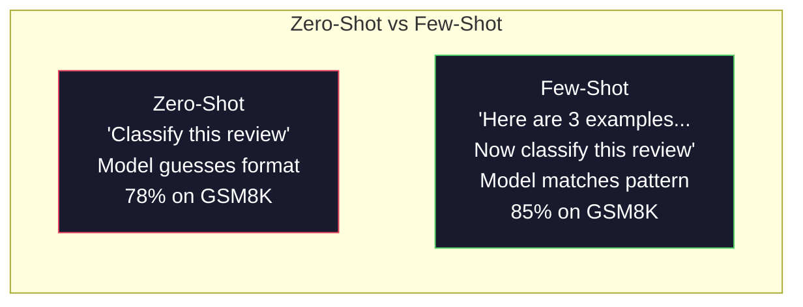
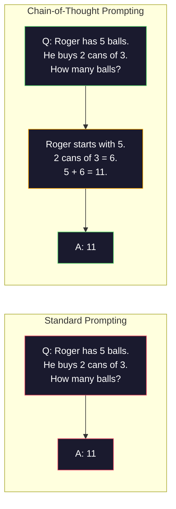
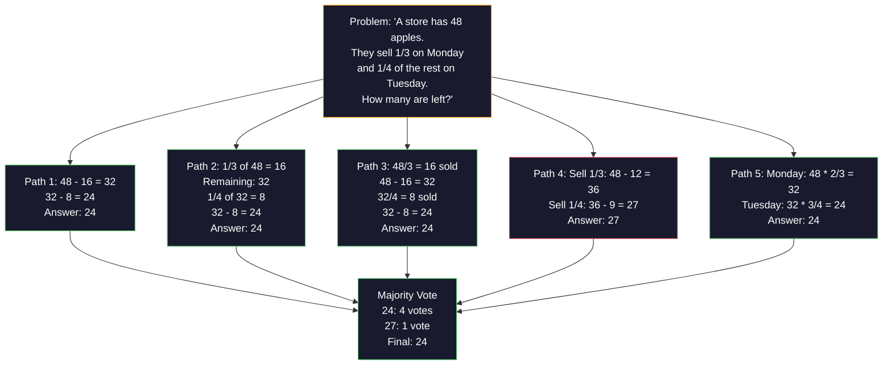
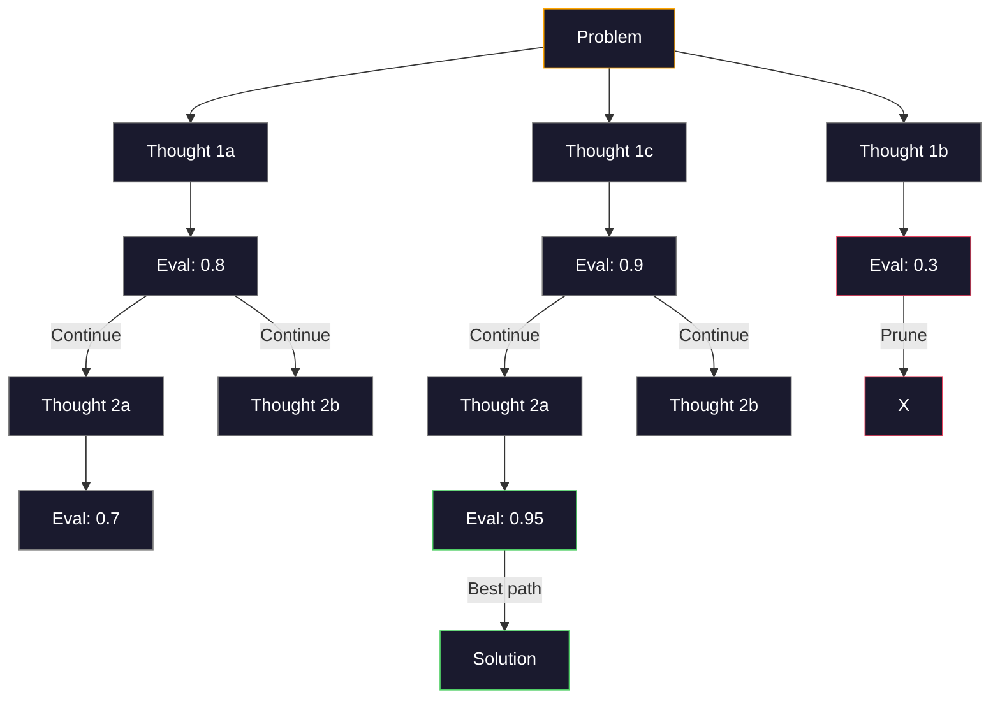

# 少样本、思维链、思维树

> 告诉模型做什么,是提示;教它怎么思考,才是工程。同一个模型、同一个任务、同一份数据,78% 与 91% 准确率之间的差距,不是更好的模型——是更好的推理策略。

**类型:** 动手构建
**编程语言:** Python
**前置要求:** 第 11.01 课(提示词工程)
**预计耗时:** 约 45 分钟

## 学习目标

- 实现少样本提示:挑选并格式化示例,最大化任务准确率
- 应用思维链(CoT)推理,提升多步问题(如数学应用题)的准确率
- 构建思维树提示:探索多条推理路径并选出最优
- 在标准基准上测量零样本 vs 少样本 vs CoT 的准确率提升

## 问题

你在做一个数学辅导应用。提示词写着:"解这道应用题。"GPT-5 在 GSM8K(小学数学标准基准)上正确率 94%。你以为已经到顶了——并没有,思维链还能再加 3–4 个点。

加五个词——"Let's think step by step"——准确率跳到 91%(对 GPT-4o 这类模型);再加几个带解答过程的示例,到 95%。同一个模型,同一个温度,同样的 API 费用。唯一的区别是:你给了模型一张草稿纸。

这不是取巧,这就是推理的运作方式。人类不会一个念头跨越多步问题,Transformer 也不会。当你迫使模型生成中间 token,这些 token 就成为下一个 token 的上下文。每一步推理喂给下一步。模型是实实在在地*算*到答案的。

但"一步一步想"只是起点,不是终点。如果采样五条推理路径再多数投票呢?如果让模型探索一棵可能性之树、边评估边剪枝呢?如果把推理和工具调用交织起来呢?这些都不是假设——它们是有实测数据的已发表技术,本课你将把它们全部建出来。

## 概念

### 零样本 vs 少样本:示例何时胜过指令

零样本提示只给任务,别的没有;少样本提示先给示例。

Wei 等(2022)在 8 个基准上测过:情感分类这类简单任务,零样本与少样本相差不到 2%;多步算术和符号推理这类复杂任务,少样本把准确率拉高 10–25%。

直觉是:示例就是压缩过的指令。与其描述输出格式,不如展示它;与其解释推理过程,不如演示它。模型对示例做模式匹配,比对抽象指令的理解可靠得多。



**少样本胜出的场景:** 格式敏感任务、分类、结构化抽取、领域黑话,以及任何需要模型贴合特定模式的任务。

**零样本胜出的场景:** 简单事实问题、示例会束缚创意的创意任务、找好示例比写好指令还难的任务。

### 示例选择:相似胜过随机

示例不是平等的。在分类任务上,挑与目标输入相似的示例比随机挑好 5–15%(Liu 等,2022)。三条原则:

1. **语义相似:** 挑嵌入空间里离输入最近的示例
2. **标签多样:** 示例覆盖所有输出类别
3. **难度匹配:** 与目标问题的复杂度相当

大多数任务的最优示例数是 3–5 个。少于 3 个,模型拿不到足够信号提炼模式;多于 5 个,收益递减还浪费上下文窗口。多标签分类,每个标签给一个示例。

### 思维链:给模型一张草稿纸

思维链(CoT)提示由 Wei 等(2022,Google Brain)提出。想法很简单:别只问模型要答案,让它先展示推理步骤。



为什么机制上有效?Transformer 生成的每个 token 都会成为下一个 token 的上下文。没有 CoT,模型必须把全部推理压缩进单次前向传播的隐状态里;有了 CoT,模型把中间计算外化成 token,每个推理 token 都在延长有效计算深度。

**GSM8K 基准(小学数学,8.5K 题):**

| 模型 | 零样本 | 零样本 CoT | 少样本 CoT |
|-------|-----------|---------------|--------------|
| GPT-4o | 78% | 91% | 95% |
| GPT-5 | 94% | 97% | 98% |
| o4-mini(推理) | 97% | — | — |
| Claude Opus 4.7 | 93% | 97% | 98% |
| Gemini 3 Pro | 92% | 96% | 98% |
| Llama 4 70B | 80% | 89% | 94% |
| DeepSeek-V3.1 | 89% | 94% | 96% |

**关于推理模型的说明。** OpenAI o 系列(o3、o4-mini)和 DeepSeek-R1 这类模型,在输出答案前会在内部跑思维链。给推理模型再加"Let's think step by step"是多余的,有时甚至适得其反——它们已经想过了。

两种 CoT:

**零样本 CoT**:在提示词末尾追加"Let's think step by step",无需示例。Kojima 等(2022)证明,这一句话就能提升算术、常识和符号推理任务的准确率。

**少样本 CoT**:提供带推理步骤的示例。比零样本 CoT 更有效,因为模型看到了你期望的确切推理格式。

**CoT 何时帮倒忙:** 简单事实回忆("法国首都是哪?")、单步分类,以及速度比准确率更要紧的任务。CoT 每次查询多产出 50–200 个推理 token。高吞吐、低复杂度的任务上,这是白花的成本。

### 自洽性:采样多次,投票一次

Wang 等(2023)提出自洽性(self-consistency)。洞察是:单条 CoT 路径可能含推理错误;但如果用 temperature > 0 采样 N 条独立推理路径,对最终答案多数投票,错误就相互抵消了。



在最初的 PaLM 540B 实验上,自洽性把 GSM8K 准确率从 56.5%(单条 CoT)提到 74.4%(N=40)。在 GPT-5 上提升很小(97% → 98%),因为基础准确率已经饱和。这个技术最出彩的区间,是基础 CoT 准确率在 60–85% 的模型——单路径错误频繁但不系统化的甜点位。对推理模型(o 系列、R1),自洽性已被内置的内部采样吸收了。

代价:N 次采样意味着 N 倍 API 费用和延迟。实践中 N=5 就能拿到大部分收益;N=3 是有意义投票的下限;大多数任务上 N > 10 收益递减。

### 思维树:分支探索

Yao 等(2023)提出思维树(ToT)。CoT 沿一条线性推理路径走,ToT 则探索多个分支,评估哪些最有前途,再继续。



ToT 有三个组件:

1. **思维生成:** 产出多个候选下一步
2. **状态评估:** 给每个候选打分(可以用 LLM 自己当评估器)
3. **搜索算法:** 在树上做 BFS 或 DFS,剪掉低分分支

在 24 点游戏(用算术把 4 个数凑成 24)上:GPT-4 标准提示解出 7.3%,CoT 只有 4.0%(这里 CoT 反而有害,因为搜索空间很宽),ToT 达到 74%。

ToT 很贵:树上每个节点都是一次 LLM 调用,分支因子 3、深度 3 的树最多要 39 次调用。只把它用在搜索空间大但可评估的问题上——规划、解谜、带约束的创造性问题求解。

### ReAct:边想边做

Yao 等(2022)把推理轨迹与动作结合:模型在"想"(生成推理)和"做"(调工具、搜索、计算)之间交替。

```mermaid
graph LR
    Q["Question:\nWhat is the\npopulation of the\ncountry where\nthe Eiffel Tower\nis located?"]
    T1["Thought: I need to\nfind which country\nhas the Eiffel Tower"]
    A1["Action: search\n'Eiffel Tower location'"]
    O1["Observation:\nParis, France"]
    T2["Thought: Now I need\nFrance's population"]
    A2["Action: search\n'France population 2024'"]
    O2["Observation:\n68.4 million"]
    T3["Thought: I have\nthe answer"]
    F["Answer:\n68.4 million"]

    Q --> T1 --> A1 --> O1 --> T2 --> A2 --> O2 --> T3 --> F

    style Q fill:#1a1a2e,stroke:#ffa500,color:#fff
    style T1 fill:#1a1a2e,stroke:#51cf66,color:#fff
    style A1 fill:#1a1a2e,stroke:#e94560,color:#fff
    style O1 fill:#1a1a2e,stroke:#808080,color:#fff
    style T2 fill:#1a1a2e,stroke:#51cf66,color:#fff
    style A2 fill:#1a1a2e,stroke:#e94560,color:#fff
    style O2 fill:#1a1a2e,stroke:#808080,color:#fff
    style T3 fill:#1a1a2e,stroke:#51cf66,color:#fff
    style F fill:#1a1a2e,stroke:#51cf66,color:#fff
```



ReAct 在知识密集任务上胜过纯 CoT,因为它能把推理落到真实数据上。HotpotQA(多跳问答)上,GPT-4 的 ReAct 取得 35.1% 精确匹配,纯 CoT 是 29.4%。真正的威力在于:推理错误会被观测纠正——模型能在执行中途更新计划。

ReAct 是现代 AI 智能体的地基。每个智能体框架(LangChain、CrewAI、AutoGen)实现的都是某种 Thought-Action-Observation 循环的变体。第 14 阶段 你会构建完整的智能体;本课只讲这个提示词模式。

### 结构化提示:XML 标签、分隔符、标题

提示词变复杂后,结构能防止模型混淆各部分。三种做法:

**XML 标签**(Claude 上效果最好,各家都行):
```
<context>
You are reviewing a pull request.
The codebase uses TypeScript and React.
</context>

<task>
Review the following diff for bugs, security issues, and style violations.
</task>

<diff>
{diff_content}
</diff>

<output_format>
List each issue with: file, line, severity (critical/warning/info), description.
</output_format>
```

**Markdown 标题**(通用):
```
## Role
Senior security engineer at a fintech company.

## Task
Analyze this API endpoint for vulnerabilities.

## Input
{api_code}

## Rules
- Focus on OWASP Top 10
- Rate each finding: critical, high, medium, low
- Include remediation steps
```

**分隔符**(极简但有效):
```
---INPUT---
{user_text}
---END INPUT---

---INSTRUCTIONS---
Summarize the above in 3 bullet points.
---END INSTRUCTIONS---
```

### 提示词链:顺序分解

有些任务复杂到单个提示词装不下。提示词链把它们拆成步骤,上一个提示词的输出是下一个的输入。


链式胜过单提示词,三个原因:

1. **每一步更简单:** 模型处理一个聚焦任务,不用同时 juggling 所有事
2. **中间输出可检查:** 步骤之间可以校验和纠正
3. **不同步骤可用不同模型:** 抽取用便宜模型,推理用贵模型

### 性能对比

| 技术 | 最适合 | GSM8K 准确率(GPT-5) | API 调用数 | token 开销 | 复杂度 |
|-----------|----------|------------------------|-----------|----------------|------------|
| 零样本 | 简单任务 | 94% | 1 | 无 | 极低 |
| 少样本 | 格式匹配 | 96% | 1 | 200–500 tokens | 低 |
| 零样本 CoT | 快速推理增强 | 97% | 1 | 50–200 tokens | 极低 |
| 少样本 CoT | 单次调用最高准确率 | 98% | 1 | 300–600 tokens | 低 |
| 自洽性(N=5) | 高风险推理 | 98.5% | 5 | 5 倍 token | 中 |
| 推理模型(o4-mini) | CoT 的即插即用替代 | 97% | 1 | 隐藏(内部 2–10 倍) | 极低 |
| 思维树 | 搜索/规划问题 | N/A(24 点游戏 74%) | 10–40+ | 10–40 倍 token | 高 |
| ReAct | 知识落地推理 | N/A(HotpotQA 35.1%) | 3–10+ | 可变 | 高 |
| 提示词链 | 复杂多步任务 | 96%(流水线) | 2–5 | 2–5 倍 token | 中 |

选哪种技术取决于三个因素:准确率要求、延迟预算、成本容忍度。对大多数生产系统,"少样本 CoT + 3 样本自洽性兜底"覆盖 90% 的场景。

```figure
few-shot-curve
```

## 动手构建

我们要建一个数学题求解器,把少样本提示、思维链推理和自洽性投票组合进一条流水线,然后为难题加上思维树。

完整实现在 `code/advanced_prompting.py`。以下是关键组件。

### 第 1 步:少样本示例库

第一个组件管理少样本示例,并为给定问题选出最相关的。

```python
GSM8K_EXAMPLES = [
    {
        "question": "Janet's ducks lay 16 eggs per day. She eats three for breakfast every morning and bakes muffins for her friends every day with four. She sells every egg at the farmers' market for $2. How much does she make every day at the farmers' market?",
        "reasoning": "Janet's ducks lay 16 eggs per day. She eats 3 and bakes 4, using 3 + 4 = 7 eggs. So she has 16 - 7 = 9 eggs left. She sells each for $2, so she makes 9 * 2 = $18 per day.",
        "answer": "18"
    },
    ...
]
```

每个示例三部分:问题、推理链、最终答案。正是推理链,把普通少样本示例变成了 CoT 少样本示例。

### 第 2 步:思维链提示词构建器

提示词构建器把系统消息、带推理链的少样本示例和目标问题组装成一个提示词。

```python
def build_cot_prompt(question, examples, num_examples=3):
    system = (
        "You are a math problem solver. "
        "For each problem, show your step-by-step reasoning, "
        "then give the final numerical answer on the last line "
        "in the format: 'The answer is [number]'."
    )

    example_text = ""
    for ex in examples[:num_examples]:
        example_text += f"Q: {ex['question']}\n"
        example_text += f"A: {ex['reasoning']} The answer is {ex['answer']}.\n\n"

    user = f"{example_text}Q: {question}\nA:"
    return system, user
```

格式约束("The answer is [number]")很关键。没有它,自洽性无法跨样本抽取和比较答案。

### 第 3 步:自洽性投票

采样 N 条推理路径,取多数答案。

```python
def self_consistency_solve(question, examples, client, model, n_samples=5):
    system, user = build_cot_prompt(question, examples)

    answers = []
    reasonings = []
    for _ in range(n_samples):
        response = client.chat.completions.create(
            model=model,
            messages=[
                {"role": "system", "content": system},
                {"role": "user", "content": user}
            ],
            temperature=0.7
        )
        text = response.choices[0].message.content
        reasonings.append(text)
        answer = extract_answer(text)
        if answer is not None:
            answers.append(answer)

    vote_counts = Counter(answers)
    best_answer = vote_counts.most_common(1)[0][0] if vote_counts else None
    confidence = vote_counts[best_answer] / len(answers) if best_answer else 0

    return best_answer, confidence, reasonings, vote_counts
```

温度 0.7 很重要。温度为 0 时,N 个样本完全一样,采样就失去了意义。你需要足够的随机性来产生多样推理路径,但又不能多到产出胡言乱语。

### 第 4 步:思维树求解器

线性推理失效的问题,ToT 探索多种思路并评估哪个方向最有前途。

```python
def tree_of_thought_solve(question, client, model, breadth=3, depth=3):
    thoughts = generate_initial_thoughts(question, client, model, breadth)
    scored = [(t, evaluate_thought(t, question, client, model)) for t in thoughts]
    scored.sort(key=lambda x: x[1], reverse=True)

    for current_depth in range(1, depth):
        next_thoughts = []
        for thought, score in scored[:2]:
            extensions = extend_thought(thought, question, client, model, breadth)
            for ext in extensions:
                ext_score = evaluate_thought(ext, question, client, model)
                next_thoughts.append((ext, ext_score))
        scored = sorted(next_thoughts, key=lambda x: x[1], reverse=True)

    best_thought = scored[0][0] if scored else ""
    return extract_answer(best_thought), best_thought
```

评估器本身就是一次 LLM 调用。你问模型:"从 0.0 到 1.0,这条推理路径对解决该问题有多大希望?"这就是 ToT 的关键洞察——让模型评估自己的部分解。

### 第 5 步:完整流水线

流水线把所有技术组合起来,带逐级升级策略。

```python
def solve_with_escalation(question, examples, client, model):
    system, user = build_cot_prompt(question, examples)
    single_response = call_llm(client, model, system, user, temperature=0.0)
    single_answer = extract_answer(single_response)

    sc_answer, confidence, _, _ = self_consistency_solve(
        question, examples, client, model, n_samples=5
    )

    if confidence >= 0.8:
        return sc_answer, "self_consistency", confidence

    tot_answer, _ = tree_of_thought_solve(question, client, model)
    return tot_answer, "tree_of_thought", None
```

升级逻辑:先试便宜的(单条 CoT)。自洽性置信度低于 0.8(5 个样本里达成一致不到 4 个)就升级到 ToT。这在成本与准确率之间取得平衡——大多数问题便宜地解决,难题才吃更多算力。

## 投入使用

### 模板驱动的少样本提示

LangChain 内置了提示词模板和输出解析支持,简化少样本和 CoT 模式:

```python
from langchain_core.prompts import FewShotPromptTemplate, PromptTemplate
from langchain_openai import ChatOpenAI

example_prompt = PromptTemplate(
    input_variables=["question", "reasoning", "answer"],
    template="Q: {question}\nA: {reasoning} The answer is {answer}."
)

few_shot_prompt = FewShotPromptTemplate(
    examples=examples,
    example_prompt=example_prompt,
    suffix="Q: {input}\nA: Let's think step by step.",
    input_variables=["input"]
)

llm = ChatOpenAI(model="gpt-4o", temperature=0.7)
chain = few_shot_prompt | llm
result = chain.invoke({"input": "If a train travels 120 km in 2 hours..."})
```

LangChain 还有按语义相似度选示例的 `ExampleSelector` 类:

```python
from langchain_core.example_selectors import SemanticSimilarityExampleSelector
from langchain_openai import OpenAIEmbeddings

selector = SemanticSimilarityExampleSelector.from_examples(
    examples,
    OpenAIEmbeddings(),
    k=3
)
```

### 编译式提示词

DSPy 把提示策略当作可优化的模块。不用手工打磨 CoT 提示词,你定义签名,让 DSPy 优化提示词:

```python
import dspy

dspy.configure(lm=dspy.LM("openai/gpt-4o", temperature=0.7))

class MathSolver(dspy.Module):
    def __init__(self):
        self.solve = dspy.ChainOfThought("question -> answer")

    def forward(self, question):
        return self.solve(question=question)

solver = MathSolver()
result = solver(question="Janet's ducks lay 16 eggs per day...")
```

DSPy 的 `ChainOfThought` 自动加入推理轨迹;`dspy.majority` 实现自洽性:

```python
result = dspy.majority(
    [solver(question=q) for _ in range(5)],
    field="answer"
)
```

### 对比:从零实现 vs 框架

| 特性 | 从零实现(本课) | LangChain | DSPy |
|---------|--------------------------|-----------|------|
| 提示词格式控制 | 完全 | 基于模板 | 自动 |
| 自洽性 | 手动投票 | 手动 | 内置(`dspy.majority`) |
| 示例选择 | 自定义逻辑 | `ExampleSelector` | `dspy.BootstrapFewShot` |
| 思维树 | 自定义树搜索 | 社区链 | 未内置 |
| 提示词优化 | 手动迭代 | 手动 | 自动编译 |
| 最适合 | 学习、自定义流水线 | 标准工作流 | 研究、优化 |

## 交付

本课产出两个文件。

**1. 推理链提示词**(`outputs/prompt-reasoning-chain.md`):生产可用的少样本 CoT + 自洽性提示词模板。插入你的示例和问题领域即可。

**2. CoT 模式选择技能**(`outputs/skill-cot-patterns.md`):一个决策框架,根据任务类型、准确率要求和成本约束选择合适的推理技术。

## 练习

1. **测量差距:** 取 10 道 GSM8K 题,分别用零样本、少样本、零样本 CoT、少样本 CoT 求解,记录各自准确率。在你的模型上,哪种技术提升最大?

2. **示例选择实验:** 同样 10 道题,对比随机选示例与手挑相似示例,测准确率差异。示例质量在什么点上开始比示例数量更重要?

3. **自洽性成本曲线:** 在 20 道 GSM8K 题上用 N=1、3、5、7、10 跑自洽性,画准确率 vs 成本(总 token)。你的模型曲线拐点在哪?

4. **构建 ReAct 循环:** 给流水线加一个计算器工具。模型生成数学表达式时,用 Python 的 `eval()`(在沙箱中)执行并把结果喂回去。测量工具落地的推理是否胜过纯 CoT。

5. **创意任务的 ToT:** 把思维树求解器改造成创意写作任务:"写一个又好笑又悲伤的六字故事。"用 LLM 当评估器。分支探索产出的创意成果比单次生成更好吗?

## 关键术语

| 术语 | 人们常说的 | 实际含义 |
|------|----------------|----------------------|
| 少样本提示 | "给它几个例子" | 在提示词中放入输入-输出示范,锚定模型的输出格式和行为 |
| 思维链 | "让它一步一步想" | 引出中间推理 token,在产出最终答案前延长模型的有效计算 |
| 自洽性 | "多跑几遍" | 以 temperature > 0 采样 N 条多样推理路径,对最终答案多数投票 |
| 思维树 | "让它探索选项" | 对推理分支做结构化搜索:评估每个部分解,只展开有前途的路径 |
| ReAct | "思考 + 工具使用" | 在 Thought-Action-Observation 循环中,把推理轨迹与外部动作(搜索、计算、API 调用)交织 |
| 提示词链 | "拆成步骤" | 把复杂任务分解成顺序提示词,每个输出喂给下一个输入 |
| 零样本 CoT | "就加一句'一步一步想'" | 不给任何示例,只在提示词后追加推理触发语,依靠模型潜在的推理能力 |

## 延伸阅读

- [《思维链提示激发大语言模型的推理能力》](https://arxiv.org/abs/2201.11903) —— Wei 等,2022。Google Brain 的 CoT 原始论文。核心结果读第 2–3 节。
- [《自洽性提升语言模型的思维链推理》](https://arxiv.org/abs/2203.11171) —— Wang 等,2023。自洽性论文,要的数据都在表 1。
- [《思维树:用大语言模型做审慎问题求解》](https://arxiv.org/abs/2305.10601) —— Yao 等,2023。ToT 论文,亮点在第 4 节的 24 点游戏结果。
- [《ReAct:协同语言模型中的推理与行动》](https://arxiv.org/abs/2210.03629) —— Yao 等,2022。现代 AI 智能体的基石。Thought-Action-Observation 循环见第 3 节。
- [《大语言模型是零样本推理者》](https://arxiv.org/abs/2205.11916) —— Kojima 等,2022。"Let's think step by step" 论文。如此简单却出奇有效。
- [《DSPy:把声明式语言模型调用编译成自我改进的流水线》](https://arxiv.org/abs/2310.03714) —— Khattab 等,2023。把提示词当作编译问题。想超越手工提示词工程就读它。
- [OpenAI —— 推理模型指南](https://platform.openai.com/docs/guides/reasoning) —— 厂商指南:思维链何时变成内置的、按 token 计费的"推理"模式,何时只是提示词技巧。
- [Lightman 等,《Let's Verify Step by Step》(2023)](https://arxiv.org/abs/2305.20050) —— 过程奖励模型(PRM)给链上每一步打分;继只看结果的奖励之后,接力推理监督的信号。
- [Snell 等,《最优地扩展 LLM 测试时算力》(2024)](https://arxiv.org/abs/2408.03314) —— 系统研究 CoT 长度、自洽性采样与 MCTS;当准确率比延迟更要紧时,"一步一步想"的下一站。
