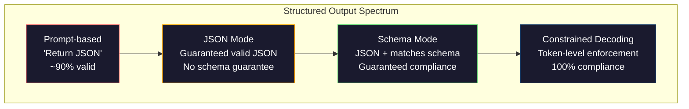
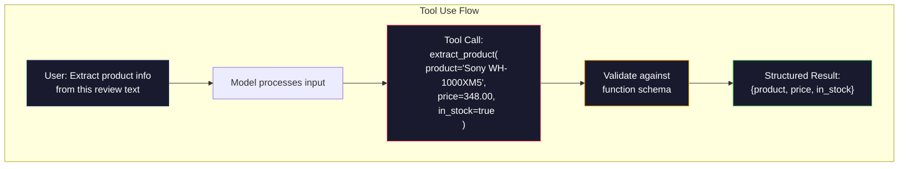

# 结构化输出:JSON、Schema 校验、约束解码

> LLM 返回的是字符串,你的应用需要的是 JSON。这道沟掀翻的生产系统,比任何模型幻觉都多。结构化输出就是自然语言与类型化数据之间的桥。搭对了,LLM 就是可靠的 API;搭错了,你就凌晨三点拿正则解析自由文本吧。

**类型:** 动手构建
**编程语言:** Python
**前置要求:** 第 10 阶段,第 01–05 课(从零构建 LLM)
**预计耗时:** 约 90 分钟
**相关:** 第 5 阶段 · 20(结构化输出与约束解码)讲解码器层的理论(FSM/CFG logit 处理器、Outlines、XGrammar)。本课聚焦生产 SDK 层面(OpenAI `response_format`、Anthropic 工具调用、Instructor)——想搞懂 API 之下发生了什么,先读 第 5 阶段 · 20。

## 学习目标

- 用 OpenAI 和 Anthropic 的 API 参数实现 JSON 模式与 schema 约束输出
- 构建一个 Pydantic 校验层:拒绝格式错误的 LLM 输出,并带错误反馈重试
- 解释约束解码如何在 token 级强制产出合法 JSON,无需后处理
- 设计健壮的抽取提示词,可靠地把非结构化文本转成类型化数据结构

## 问题

你问 LLM:"从这段文本中抽取产品名、价格和库存状态。"它回答:

```
The product is the Sony WH-1000XM5 headphones, which cost $348.00 and are currently in stock.
```

这回答完全正确,对你的应用也完全没用。你的库存系统要的是 `{"product": "Sony WH-1000XM5", "price": 348.00, "in_stock": true}`——一个键特定、类型特定、取值约束特定的 JSON 对象,不是一句话。

朴素解法:在提示词里加"用 JSON 回答"。90% 的时候管用。剩下 10%,模型把 JSON 包进 markdown 围栏,或者加一句"Here's the JSON:"开场白,或者括号提前闭合产出语法非法的 JSON。你的 JSON 解析器崩了,流水线断了。你加上 try/except 和重试循环,而重试有时产出不同的数据——现在你在解析问题之上又多了一致性问题。

这不是提示词工程问题,是解码问题。模型从左到右生成 token,每个位置都从 10 万+ 的词表里挑最可能的下一个 token。而在任意给定位置,大多数选项都会产出非法 JSON:模型刚吐出 `{"price":`,下一个 token 必须是数字、引号(字符串)、`null`、`true`、`false` 或负号——除此之外一切都是非法 JSON。没有约束,模型完全可能挑一个语义上很合理、语法上灾难性错误的英文单词。

## 概念

### 结构化输出的四个层级

结构化输出控制有四个层级,一级比一级可靠。



**提示词级**("用合法 JSON 回答"):没有强制。模型通常照办,有时不办。可靠性约 90%。失败模式:markdown 围栏、开场白、输出截断、结构错误。

**JSON 模式**:API 保证输出是合法 JSON。OpenAI 的 `response_format: { type: "json_object" }` 就是这个。输出一定能解析,但不一定匹配你期望的 schema——可能多键、类型错、字段缺失。

**Schema 模式**:API 接收一个 JSON Schema,保证输出与之匹配。2026 年每个主流提供商都原生支持:OpenAI 的 `response_format: { type: "json_schema", json_schema: {...} }`(或 `tool_choice="required"`)、Anthropic 的工具调用配 `input_schema`、Gemini 的 `response_schema` + `response_mime_type: "application/json"`。输出的键、类型、约束与你的指定完全一致。

**约束解码**:生成过程中,在每个 token 位置把会产出非法输出的 token 全部屏蔽。schema 要求数字而模型正要吐字母时,那个 token 的概率被置零。模型只能产出通往合法输出的 token。OpenAI 的结构化输出模式,以及 Outlines、Guidance 这类库,底层实现的都是它。

### JSON Schema:契约语言

JSON Schema 是你告诉模型(或校验层)"输出必须长什么样"的方式。每个主流结构化输出系统都用它。

```json
{
  "type": "object",
  "properties": {
    "product": { "type": "string" },
    "price": { "type": "number", "minimum": 0 },
    "in_stock": { "type": "boolean" },
    "categories": {
      "type": "array",
      "items": { "type": "string" }
    }
  },
  "required": ["product", "price", "in_stock"]
}
```

这个 schema 说:输出必须是一个对象,含字符串 `product`、非负数字 `price`、布尔 `in_stock`,以及可选的字符串数组 `categories`。任何不匹配的输出都会被拒绝。

schema 能处理硬骨头:嵌套对象、带类型元素的数组、枚举(把字符串约束到特定取值)、模式匹配(字符串上的正则),以及组合子(oneOf、anyOf、allOf,用于多态输出)。

### Pydantic 模式

在 Python 里,你不手写 JSON Schema——定义一个 Pydantic 模型,schema 自动生成。

```python
from pydantic import BaseModel

class Product(BaseModel):
    product: str
    price: float
    in_stock: bool
    categories: list[str] = []
```

这产出的就是上面那份 JSON Schema。Instructor 库(以及 OpenAI 的 SDK)直接接受 Pydantic 模型:传入模型类,拿回校验过的实例。LLM 输出不匹配时,Instructor 自动重试。

### 函数调用 / 工具调用

同一个问题的另一种接口:不让模型直接产 JSON,而是定义带类型参数的"工具"(函数),模型输出一次带结构化实参的函数调用。OpenAI 叫它"function calling",Anthropic 叫它"tool use"。结果相同:结构化数据。



当模型需要*选择调哪个函数*而不只是填参数时,工具调用更合适:你有 10 个不同的抽取 schema,模型必须按输入挑对那个——工具调用同时给你 schema 选择和结构化输出。

### 常见失败模式

即使有 schema 强制,结构化输出也会以微妙的方式失败。

**幻觉取值**:输出匹配 schema,但数据是编的。文本写的是 $348,模型产出 `{"price": 299.99}`。schema 校验抓不到——类型对,值错。

**枚举混淆**:你把字段约束到 `["in_stock", "out_of_stock", "preorder"]`,模型输出 `"available"`——语义对,但不在允许集合内。好的约束解码能防住,纯提示词的方法防不住。

**嵌套对象深度**:4 层以上的深嵌套 schema 出错更多。每多一层嵌套,就多一处模型跟丢结构的地方。

**数组长度**:模型可能产出过多或过少的数组元素。schema 支持 `minItems` 和 `maxItems`,但不是所有提供商都在解码层强制它们。

**可选字段省略**:技术上可选、但语义上对你的场景很重要的字段,模型会省略。即使数据有时缺失,也在 schema 里把它们设为 required——逼模型显式产出 `null`。

```figure
mx-schema-funnel
```

## 动手构建

### 第 1 步:JSON Schema 校验器

从零构建一个校验器,检查 Python 对象是否匹配 JSON Schema。这就是在输出侧验证合规性的那部分。

```python
import json

def validate_schema(data, schema):
    errors = []
    _validate(data, schema, "", errors)
    return errors

def _validate(data, schema, path, errors):
    schema_type = schema.get("type")

    if schema_type == "object":
        if not isinstance(data, dict):
            errors.append(f"{path}: expected object, got {type(data).__name__}")
            return
        for key in schema.get("required", []):
            if key not in data:
                errors.append(f"{path}.{key}: required field missing")
        properties = schema.get("properties", {})
        for key, value in data.items():
            if key in properties:
                _validate(value, properties[key], f"{path}.{key}", errors)

    elif schema_type == "array":
        if not isinstance(data, list):
            errors.append(f"{path}: expected array, got {type(data).__name__}")
            return
        min_items = schema.get("minItems", 0)
        max_items = schema.get("maxItems", float("inf"))
        if len(data) < min_items:
            errors.append(f"{path}: array has {len(data)} items, minimum is {min_items}")
        if len(data) > max_items:
            errors.append(f"{path}: array has {len(data)} items, maximum is {max_items}")
        items_schema = schema.get("items", {})
        for i, item in enumerate(data):
            _validate(item, items_schema, f"{path}[{i}]", errors)

    elif schema_type == "string":
        if not isinstance(data, str):
            errors.append(f"{path}: expected string, got {type(data).__name__}")
            return
        enum_values = schema.get("enum")
        if enum_values and data not in enum_values:
            errors.append(f"{path}: '{data}' not in allowed values {enum_values}")

    elif schema_type == "number":
        if not isinstance(data, (int, float)):
            errors.append(f"{path}: expected number, got {type(data).__name__}")
            return
        minimum = schema.get("minimum")
        maximum = schema.get("maximum")
        if minimum is not None and data < minimum:
            errors.append(f"{path}: {data} is less than minimum {minimum}")
        if maximum is not None and data > maximum:
            errors.append(f"{path}: {data} is greater than maximum {maximum}")

    elif schema_type == "boolean":
        if not isinstance(data, bool):
            errors.append(f"{path}: expected boolean, got {type(data).__name__}")

    elif schema_type == "integer":
        if not isinstance(data, int) or isinstance(data, bool):
            errors.append(f"{path}: expected integer, got {type(data).__name__}")
```

### 第 2 步:Pydantic 风格的模型转 Schema

构建一个极简的类到 schema 转换器:定义 Python 类,自动生成 JSON Schema。

```python
class SchemaField:
    def __init__(self, field_type, required=True, default=None, enum=None, minimum=None, maximum=None):
        self.field_type = field_type
        self.required = required
        self.default = default
        self.enum = enum
        self.minimum = minimum
        self.maximum = maximum

def python_type_to_schema(field):
    type_map = {
        str: "string",
        int: "integer",
        float: "number",
        bool: "boolean",
    }

    schema = {}

    if field.field_type in type_map:
        schema["type"] = type_map[field.field_type]
    elif field.field_type == list:
        schema["type"] = "array"
        schema["items"] = {"type": "string"}
    elif isinstance(field.field_type, dict):
        schema = field.field_type

    if field.enum:
        schema["enum"] = field.enum
    if field.minimum is not None:
        schema["minimum"] = field.minimum
    if field.maximum is not None:
        schema["maximum"] = field.maximum

    return schema

def model_to_schema(name, fields):
    properties = {}
    required = []

    for field_name, field in fields.items():
        properties[field_name] = python_type_to_schema(field)
        if field.required:
            required.append(field_name)

    return {
        "type": "object",
        "properties": properties,
        "required": required,
    }
```

### 第 3 步:约束 token 过滤器

模拟约束解码:给定一段部分 JSON 字符串和一份 schema,判断当前位置上哪些 token 类别合法。

```python
def next_valid_tokens(partial_json, schema):
    stripped = partial_json.strip()

    if not stripped:
        return ["{"]

    try:
        json.loads(stripped)
        return ["<EOS>"]
    except json.JSONDecodeError:
        pass

    last_char = stripped[-1] if stripped else ""

    if last_char == "{":
        return ['"', "}"]
    elif last_char == '"':
        if stripped.endswith('":'):
            return ['"', "0-9", "true", "false", "null", "[", "{"]
        return ["a-z", '"']
    elif last_char == ":":
        return [" ", '"', "0-9", "true", "false", "null", "[", "{"]
    elif last_char == ",":
        return [" ", '"', "{", "["]
    elif last_char in "0123456789":
        return ["0-9", ".", ",", "}", "]"]
    elif last_char == "}":
        return [",", "}", "]", "<EOS>"]
    elif last_char == "]":
        return [",", "}", "<EOS>"]
    elif last_char == "[":
        return ['"', "0-9", "true", "false", "null", "{", "[", "]"]
    else:
        return ["any"]

def demonstrate_constrained_decoding():
    partial_states = [
        '',
        '{',
        '{"product"',
        '{"product":',
        '{"product": "Sony"',
        '{"product": "Sony",',
        '{"product": "Sony", "price":',
        '{"product": "Sony", "price": 348',
        '{"product": "Sony", "price": 348}',
    ]

    print(f"{'Partial JSON':<45} {'Valid Next Tokens'}")
    print("-" * 80)
    for state in partial_states:
        valid = next_valid_tokens(state, {})
        display = state if state else "(empty)"
        print(f"{display:<45} {valid}")
```

### 第 4 步:抽取流水线

把一切组合成一条抽取流水线:定义 schema、模拟 LLM 产出结构化输出、校验输出、处理重试。

```python
def simulate_llm_extraction(text, schema, attempt=0):
    if "headphones" in text.lower() or "sony" in text.lower():
        if attempt == 0:
            return '{"product": "Sony WH-1000XM5", "price": 348.00, "in_stock": true, "categories": ["audio", "headphones"]}'
        return '{"product": "Sony WH-1000XM5", "price": 348.00, "in_stock": true}'

    if "laptop" in text.lower():
        return '{"product": "MacBook Pro 16", "price": 2499.00, "in_stock": false, "categories": ["computers"]}'

    return '{"product": "Unknown", "price": 0, "in_stock": false}'

def extract_with_retry(text, schema, max_retries=3):
    for attempt in range(max_retries):
        raw = simulate_llm_extraction(text, schema, attempt)

        try:
            data = json.loads(raw)
        except json.JSONDecodeError as e:
            print(f"  Attempt {attempt + 1}: JSON parse error -- {e}")
            continue

        errors = validate_schema(data, schema)
        if not errors:
            return data

        print(f"  Attempt {attempt + 1}: Schema validation errors -- {errors}")

    return None

product_schema = {
    "type": "object",
    "properties": {
        "product": {"type": "string"},
        "price": {"type": "number", "minimum": 0},
        "in_stock": {"type": "boolean"},
        "categories": {"type": "array", "items": {"type": "string"}},
    },
    "required": ["product", "price", "in_stock"],
}
```

### 第 5 步:运行完整流水线

```python
def run_demo():
    print("=" * 60)
    print("  Structured Output Pipeline Demo")
    print("=" * 60)

    print("\n--- Schema Definition ---")
    product_fields = {
        "product": SchemaField(str),
        "price": SchemaField(float, minimum=0),
        "in_stock": SchemaField(bool),
        "categories": SchemaField(list, required=False),
    }
    generated_schema = model_to_schema("Product", product_fields)
    print(json.dumps(generated_schema, indent=2))

    print("\n--- Schema Validation ---")
    test_cases = [
        ({"product": "Test", "price": 10.0, "in_stock": True}, "Valid object"),
        ({"product": "Test", "price": -5.0, "in_stock": True}, "Negative price"),
        ({"product": "Test", "in_stock": True}, "Missing price"),
        ({"product": "Test", "price": "ten", "in_stock": True}, "String as price"),
        ("not an object", "String instead of object"),
    ]

    for data, label in test_cases:
        errors = validate_schema(data, product_schema)
        status = "PASS" if not errors else f"FAIL: {errors}"
        print(f"  {label}: {status}")

    print("\n--- Constrained Decoding Simulation ---")
    demonstrate_constrained_decoding()

    print("\n--- Extraction Pipeline ---")
    texts = [
        "The Sony WH-1000XM5 headphones are priced at $348 and currently available.",
        "The new MacBook Pro 16-inch laptop costs $2499 but is sold out.",
        "This is a random sentence with no product info.",
    ]

    for text in texts:
        print(f"\n  Input: {text[:60]}...")
        result = extract_with_retry(text, product_schema)
        if result:
            print(f"  Output: {json.dumps(result)}")
        else:
            print(f"  Output: FAILED after retries")
```

## 投入使用

### OpenAI 结构化输出

```python
# from openai import OpenAI
# from pydantic import BaseModel
#
# client = OpenAI()
#
# class Product(BaseModel):
#     product: str
#     price: float
#     in_stock: bool
#
# response = client.beta.chat.completions.parse(
#     model="gpt-5-mini",
#     messages=[
#         {"role": "system", "content": "Extract product information."},
#         {"role": "user", "content": "Sony WH-1000XM5, $348, in stock"},
#     ],
#     response_format=Product,
# )
#
# product = response.choices[0].message.parsed
# print(product.product, product.price, product.in_stock)
```

OpenAI 的结构化输出模式内部用约束解码:模型生成的每个 token 都保证产出匹配 Pydantic schema 的输出。不用重试,不用校验——约束烙在解码过程里。

### Anthropic 工具调用

```python
# import anthropic
#
# client = anthropic.Anthropic()
#
# response = client.messages.create(
#     model="claude-opus-4-7",
#     max_tokens=1024,
#     tools=[{
#         "name": "extract_product",
#         "description": "Extract product information from text",
#         "input_schema": {
#             "type": "object",
#             "properties": {
#                 "product": {"type": "string"},
#                 "price": {"type": "number"},
#                 "in_stock": {"type": "boolean"},
#             },
#             "required": ["product", "price", "in_stock"],
#         },
#     }],
#     messages=[{"role": "user", "content": "Extract: Sony WH-1000XM5, $348, in stock"}],
# )
```

Anthropic 通过工具调用实现结构化输出:模型发出一次工具调用,实参匹配 input_schema。结果相同,API 表面不同。

### Instructor 库

```python
# pip install instructor
# import instructor
# from openai import OpenAI
# from pydantic import BaseModel
#
# client = instructor.from_openai(OpenAI())
#
# class Product(BaseModel):
#     product: str
#     price: float
#     in_stock: bool
#
# product = client.chat.completions.create(
#     model="gpt-5-mini",
#     response_model=Product,
#     messages=[{"role": "user", "content": "Sony WH-1000XM5, $348, in stock"}],
# )
```

Instructor 包装任意 LLM 客户端,加上自动重试与校验。第一次校验失败,它把错误作为上下文发回模型,让它修正输出。适用于任何提供商,不只 OpenAI。

## 交付

本课产出 `outputs/prompt-structured-extractor.md` —— 一个可复用的提示词模板:给定 schema 定义,从任何文本中抽取结构化数据。喂进一份 JSON Schema 和非结构化文本,拿回校验过的 JSON。

还产出 `outputs/skill-structured-outputs.md` —— 一个决策框架:根据提供商、可靠性要求和 schema 复杂度,选择合适的结构化输出策略。

## 练习

1. 扩展 schema 校验器支持 `oneOf`(数据必须恰好匹配多个 schema 之一)。这处理多态输出——比如一个字段可以是 `Product` 也可以是 `Service` 对象,两者形状不同。

2. 构建一个"schema diff"工具:对比两份 schema,识别破坏性变更(删除必填字段、改类型)与非破坏性变更(新增可选字段、放松约束)。这是生产环境给抽取 schema 做版本管理的必备品。

3. 实现一个更真实的约束解码模拟器:给定一份 JSON Schema 和 100 个 token 的词表(字母、数字、标点、关键字),一步步走生成过程,在每个位置屏蔽非法 token。测量每一步词表中有多大比例是合法的。

4. 构建一个抽取评估套件:造 50 条带人工标注 JSON 输出的产品描述,在全部 50 条上跑你的抽取流水线,测量完全匹配率、字段级准确率和类型合规率。找出哪些字段最难正确抽取。

5. 给抽取流水线加"置信度分数":对每个抽取字段,估计模型的置信度(基于 token 概率,或跑 3 次抽取测一致性)。低置信字段标记给人工复核。

## 关键术语

| 术语 | 人们常说的 | 实际含义 |
|------|----------------|----------------------|
| JSON 模式 | "返回 JSON" | 保证输出语法合法的 API 开关,但不强制任何特定 schema |
| 结构化输出 | "带类型的 JSON" | 匹配特定 JSON Schema 的输出:键、类型、约束全对 |
| 约束解码 | "引导式生成" | 在每个 token 位置屏蔽会产出非法输出的 token——保证 100% schema 合规 |
| JSON Schema | "JSON 模板" | 描述 JSON 数据结构、类型和约束的声明式语言(OpenAPI、JSON Forms 等都在用) |
| Pydantic | "Python dataclasses 加强版" | 带类型校验的 Python 数据模型库,FastAPI 和 Instructor 用它生成 JSON Schema |
| 函数调用 | "工具调用" | LLM 输出结构化函数调用(名称 + 带类型实参)而非自由文本——OpenAI 和 Anthropic 都支持 |
| Instructor | "LLM 界的 Pydantic" | 包装 LLM 客户端、返回校验过的 Pydantic 实例的 Python 库,校验失败自动重试 |
| token 屏蔽 | "过滤词表" | 生成时把特定 token 的概率置零,模型无法产出它们 |
| schema 合规 | "形状匹配" | 输出含全部必填字段、类型正确、取值在约束内、没有多余的不允许字段 |
| 重试循环 | "不行再来直到行" | 把校验错误发回模型请它修正输出——Instructor 自动做,次数可配 |

## 延伸阅读

- [OpenAI 结构化输出指南](https://platform.openai.com/docs/guides/structured-outputs) —— OpenAI API 基于 JSON Schema 的约束解码官方文档
- [Willard 与 Louf,2023 ——《大语言模型的高效引导式生成》](https://arxiv.org/abs/2307.09702) —— Outlines 论文:如何把 JSON Schema 编译成有限状态机,做 token 级约束
- [Instructor 文档](https://python.useinstructor.com/) —— 从任何 LLM 拿结构化输出的标准库,带 Pydantic 校验与重试
- [Anthropic 工具调用指南](https://docs.anthropic.com/en/docs/tool-use) —— Claude 如何通过带 JSON Schema input_schema 的工具调用实现结构化输出
- [JSON Schema 规范](https://json-schema.org/) —— 每个主流结构化输出系统都在用的 schema 语言完整规范
- [Outlines 库](https://github.com/outlines-dev/outlines) —— 开源约束生成:正则与 JSON Schema 编译成有限状态机
- [Dong 等,《XGrammar:面向大语言模型的灵活高效结构化生成引擎》(MLSys 2025)](https://arxiv.org/abs/2411.15100) —— 当前 SOTA 语法引擎;下推自动机编译,token 屏蔽约 100 ns/token
- [Beurer-Kellner 等,《提示即编程:大语言模型查询语言》(LMQL)](https://arxiv.org/abs/2212.06094) —— LMQL 论文,把约束解码框架化为带类型与值约束的查询语言
- [Microsoft Guidance(框架文档)](https://github.com/guidance-ai/guidance) —— 模板驱动的约束生成;Outlines 与 XGrammar 的厂商无关替代品
