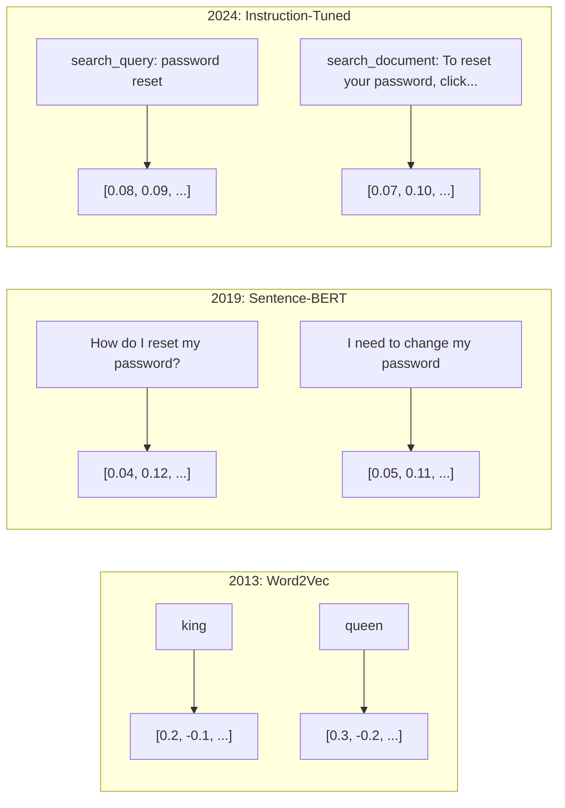
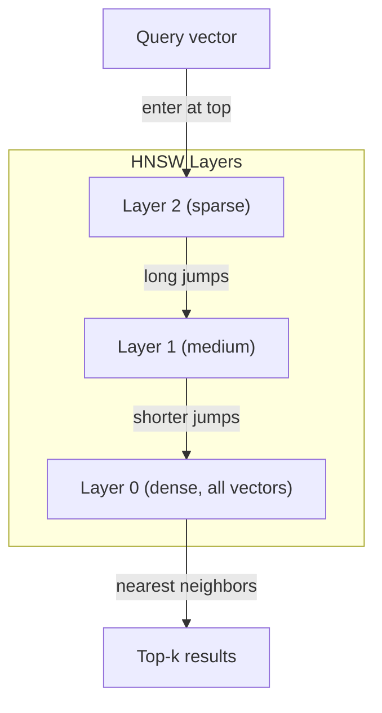

# 嵌入与向量表示

> 文本是离散的,数学是连续的。每当你让 LLM 找"相似"文档、比较含义、或做超越关键词的搜索,你都在依赖连接这两个世界的桥。这座桥就是嵌入(embedding)。不懂嵌入,你就不懂现代 AI——只是在用它而已。

**类型:** 动手构建
**编程语言:** Python
**前置要求:** 第 11 阶段,第 01 课(提示词工程)
**预计耗时:** 约 75 分钟
**相关:** 第 5 阶段 · 22(嵌入模型深入)讲稠密 vs 稀疏 vs 多向量、Matryoshka 截断和分轴选模型。本课聚焦生产流水线(向量数据库、HNSW、相似度数学)。选模型之前先读 第 5 阶段 · 22。

## 学习目标

- 用 API 提供商和开源模型生成文本嵌入,并计算它们之间的余弦相似度
- 解释为什么嵌入解决了关键词搜索无法处理的词汇不匹配问题
- 构建一个按含义而非精确关键词匹配来检索文档的语义搜索索引
- 用检索基准(precision@k、召回率)评估嵌入质量,并为你的任务选对嵌入模型

## 问题

你有 10,000 张客服工单。一个客户写道:"my payment didn't go through"(我的付款没成功)。你要找类似的既往工单。关键词搜索能找到含 "payment" 和 "didn't go through" 的工单,但找不到 "transaction failed"、"charge was declined" 和 "billing error"——这些工单描述的是完全相同的问题,用的却是完全不同的词。

这就是词汇不匹配问题。人类语言有几十种方式说同一件事,而关键词搜索把每个词当作没有含义的独立符号,它不可能知道 "declined" 和 "didn't go through" 指的是同一个概念。

你需要一种文本表示:决定相似度的是含义,不是拼写。你需要一种方法,把 "my payment didn't go through" 和 "transaction was declined" 在某个数学空间里放得近近的,同时把 "my payment arrived on time" 推得远远的——尽管它也含 "payment" 这个词。

这种表示就是嵌入。

## 概念

### 什么是嵌入?

嵌入是一个稠密的浮点数向量,表示文本的含义。"稠密"这个词很要紧——每个维度都携带信息,不像稀疏表示(词袋、TF-IDF)大多数维度是零。

"The cat sat on the mat" 会变成 `[0.023, -0.041, 0.087, ..., 0.012]` 这样的东西——768 到 3072 个数字,取决于模型。这些数字编码了含义。你从不直接查看它们,你比较它们。

### Word2Vec 的突破

2013 年,Tomas Mikolov 和 Google 的同事发表了 Word2Vec。核心洞察:训练一个神经网络,用邻居词预测当前词(或用当前词预测邻居词),隐藏层的权重就成为有意义的向量表示。

那个著名的结果:

```
king - man + woman = queen
```

词嵌入上的向量算术捕捉语义关系:"man" 到 "woman" 的方向,与 "king" 到 "queen" 的方向大致相同。就在那一刻,整个领域意识到:几何可以编码含义。

Word2Vec 产出 300 维向量,每个词一个向量,不看上下文。"river bank" 和 "bank account" 里的 "bank" 是同一个嵌入。这个局限驱动了此后十年的研究。

### 从词到句子

词嵌入表示单个 token,生产系统需要嵌入整个句子、段落或文档。出现了四条路线:

**平均法**:取句中所有词向量的均值。便宜、有损,对短文本出人意料地还行。完全丢失词序——"dog bites man" 和 "man bites dog" 的嵌入一模一样。

**CLS token**:Transformer 模型(BERT,2018)输出一个特殊的 [CLS] token 嵌入来代表整个输入。比平均好,但 [CLS] 当初是为下一句预测训练的,不是为相似度。

**对比学习**:显式训练模型,把相似对推近、不相似对推远。Sentence-BERT(Reimers 与 Gurevych,2019)用这个方法,成为现代嵌入模型的地基。给定 "How do I reset my password?" 和 "I need to change my password",模型学到它们应该有几乎相同的向量。

**指令微调嵌入**:最新的路线。E5、GTE 这类模型接受任务前缀("search_query:"、"search_document:"),告诉模型要产出哪种嵌入。一个模型 thus 服务多种任务。



### 现代嵌入模型

市场已经收敛到少数几个生产级选项(MTEB 分数为 2026 年初、MTEB v2):

| 模型 | 提供商 | 维度 | MTEB | 上下文 | 每百万 token 成本 |
|-------|----------|-----------|------|---------|------------------|
| Gemini Embedding 2 | Google | 3072(Matryoshka) | 67.7(检索) | 8192 | $0.15 |
| embed-v4 | Cohere | 1024(Matryoshka) | 65.2 | 128K | $0.12 |
| voyage-4 | Voyage AI | 1024/2048(Matryoshka) | 66.8 | 32K | $0.12 |
| text-embedding-3-large | OpenAI | 3072(Matryoshka) | 64.6 | 8192 | $0.13 |
| text-embedding-3-small | OpenAI | 1536(Matryoshka) | 62.3 | 8192 | $0.02 |
| BGE-M3 | BAAI | 1024(dense+sparse+ColBERT) | 63.0 多语言 | 8192 | 开放权重 |
| Qwen3-Embedding | 阿里 | 4096(Matryoshka) | 66.9 | 32K | 开放权重 |
| Nomic-embed-v2 | Nomic | 768(Matryoshka) | 63.1 | 8192 | 开放权重 |

MTEB(大规模文本嵌入基准)v2 覆盖检索、分类、聚类、重排序和摘要等 100+ 任务,越高越好。到 2026 年,开放权重模型(Qwen3-Embedding、BGE-M3)在大多数维度上追平或超过闭源托管模型:Gemini Embedding 2 领跑纯检索;Voyage/Cohere 领跑特定领域(金融、法律、代码)。下决心之前,永远先在你自己的查询上做基准。

### 相似度度量

给定两个嵌入向量,三种测量相似度的方式:

**余弦相似度**:两个向量夹角的余弦。范围 -1(相反)到 1(同向)。忽略模长——10 词的句子和 500 词的文档,只要方向相同就能得 1.0。90% 场景的默认选择。

```
cosine_sim(a, b) = dot(a, b) / (||a|| * ||b||)
```

**点积**:两个向量的原始内积。向量归一化(单位长度)时与余弦相似度等同,计算更快。OpenAI 的嵌入是归一化的,所以点积和余弦给出相同排序。

```
dot(a, b) = sum(a_i * b_i)
```

**欧氏(L2)距离**:向量空间中的直线距离,越小越相似。对模长差异敏感。当空间中的绝对位置(而不只是方向)重要时用它。

```
L2(a, b) = sqrt(sum((a_i - b_i)^2))
```

何时用哪个:

| 度量 | 何时用 | 何时避免 |
|--------|----------|------------|
| 余弦相似度 | 比较不同长度的文本;大多数检索任务 | 模长携带信息时 |
| 点积 | 嵌入已归一化;追求最快速度 | 向量模长不一时 |
| 欧氏距离 | 聚类;空间最近邻问题 | 比较长度悬殊的文档时 |

### 向量数据库与 HNSW

暴力相似度搜索要把查询与每个存储向量都比一遍。100 万个 1536 维向量,每次查询就是 15 亿次乘加运算。太慢。

向量数据库用近似最近邻(ANN)算法解决这个问题。主流算法是 HNSW(分层可导航小世界):

1. 构建一个多层向量图
2. 顶层稀疏——远距离簇之间的长程连接
3. 底层稠密——邻近向量之间的细粒度连接
4. 搜索从顶层开始,贪心逐层下降细化
5. 以 O(log n) 时间返回近似 top-k,而不是 O(n)

HNSW 用很小的精度损失(典型 95–99% 召回)换巨大的速度提升。1000 万向量:暴力要几秒,HNSW 只要几毫秒。



生产选项:

| 数据库 | 类型 | 最适合 | 最大规模 |
|----------|------|----------|-----------|
| Pinecone | 托管 SaaS | 零运维生产 | 数十亿 |
| Weaviate | 开源 | 自托管、混合搜索 | 1 亿+ |
| Qdrant | 开源 | 高性能、过滤 | 1 亿+ |
| ChromaDB | 嵌入式 | 原型、本地开发 | 100 万 |
| pgvector | Postgres 扩展 | 已在用 Postgres | 1000 万 |
| FAISS | 库 | 进程内、研究 | 10 亿+ |

### 分块策略

文档太长,没法嵌成单个向量。一份 50 页 PDF 覆盖几十个主题——它的嵌入会成为一切的平均,与任何具体内容都不像。你要把文档切成块,逐块嵌入。

**定长分块**:每 N 个 token 切一刀,重叠 M 个 token。简单可预测,文档没有清晰结构时好用。512 token 块、50 token 重叠:第 1 块是 token 0–511,第 2 块是 462–973。

**按句分块**:在句子边界切,把句子归组直到达到 token 上限。每块至少是一个完整句子。比定长好,因为你永远不会把一个想法拦腰截断。

**递归分块**:先按最大边界切(节标题),还大就按段落边界,再按句子边界,最后按字符上限。这就是 LangChain 的 `RecursiveCharacterTextSplitter`,混合格式语料上很好用。

**语义分块**:先嵌入每个句子,把嵌入相似的连续句子归为一组;相似度跌破阈值就开新块。贵(每个句子都要单独嵌入)但产出的块最连贯。

| 策略 | 复杂度 | 质量 | 最适合 |
|----------|-----------|---------|----------|
| 定长 | 低 | 尚可 | 无结构文本、日志 |
| 按句 | 低 | 好 | 文章、邮件 |
| 递归 | 中 | 好 | Markdown、HTML、混合文档 |
| 语义 | 高 | 最好 | 检索质量攸关的场景 |

大多数系统的甜点:256–512 token 的块,50 token 重叠。

### 双编码器 vs 交叉编码器

双编码器(bi-encoder)把查询和文档独立嵌入,再比较向量。快——查询只嵌一次,与预先算好的文档嵌入比较。检索用它。

交叉编码器(cross-encoder)把查询和文档合成单个输入,输出相关性分数。慢——每个查询-文档对都要完整过一遍模型。但准确得多,因为它能同时注意查询和文档的 token。

生产模式:双编码器检索 top-100 候选,交叉编码器重排序到 top-10。这就是"检索-重排"流水线。


重排序模型:Cohere Rerank 3.5(每 1000 次查询 $2)、BGE-reranker-v2(免费开源)、Jina Reranker v2(免费开源)。

### Matryoshka 嵌入

传统嵌入是要么全有要么全无:1536 维向量就用 1536 个浮点数,不重新训练就没法截断到 256 维。

Matryoshka 表示学习(Kusupati 等,2022)解决了这个问题。模型训练时就让前 N 个维度捕捉最重要的信息,像俄罗斯套娃。把 1536 维 Matryoshka 嵌入截断到 256 维,损失一些精度但仍可用。

OpenAI 的 text-embedding-3-small 和 text-embedding-3-large 通过 `dimensions` 参数支持 Matryoshka 截断。请求 256 维而非 1536 维,存储省 6 倍,MTEB 基准上精度损失约 3–5%。

### 二值量化

一个 1536 维嵌入用 float32 存要 6,144 字节。乘上 1000 万文档:光向量就 61 GB。

二值量化把每个浮点数压成单个比特:正变 1,负变 0。存储从 6,144 字节降到 192 字节——32 倍缩减。相似度用汉明距离(数不同比特的个数)计算,CPU 一条指令就能做完。

精度损失大约是检索召回降 5–10%。常见模式:先用二值量化在数百万向量上跑第一遍搜索,再用全精度向量给 top-1000 重打分。这样以 32 分之一的内存,拿到全精度 95%+ 的准确率。

```figure
cosine-similarity
```

## 动手构建

我们从零构建一个语义搜索引擎。不用向量数据库,不用外部嵌入 API,纯 Python 加 numpy 做数学。

### 第 1 步:文本分块

```python
def chunk_text(text, chunk_size=200, overlap=50):
    words = text.split()
    chunks = []
    start = 0
    while start < len(words):
        end = start + chunk_size
        chunk = " ".join(words[start:end])
        chunks.append(chunk)
        start += chunk_size - overlap
    return chunks


def chunk_by_sentences(text, max_chunk_tokens=200):
    sentences = text.replace("\n", " ").split(".")
    sentences = [s.strip() + "." for s in sentences if s.strip()]
    chunks = []
    current_chunk = []
    current_length = 0
    for sentence in sentences:
        sentence_length = len(sentence.split())
        if current_length + sentence_length > max_chunk_tokens and current_chunk:
            chunks.append(" ".join(current_chunk))
            current_chunk = []
            current_length = 0
        current_chunk.append(sentence)
        current_length += sentence_length
    if current_chunk:
        chunks.append(" ".join(current_chunk))
    return chunks
```

### 第 2 步:从零构建嵌入

我们用 TF-IDF 加 L2 归一化实现一个简单的稠密嵌入。这不是神经嵌入,但遵守同样的契约:文本进,定长向量出,相似文本产出相似向量。

```python
import math
import numpy as np
from collections import Counter

class SimpleEmbedder:
    def __init__(self):
        self.vocab = []
        self.idf = []
        self.word_to_idx = {}

    def fit(self, documents):
        vocab_set = set()
        for doc in documents:
            vocab_set.update(doc.lower().split())
        self.vocab = sorted(vocab_set)
        self.word_to_idx = {w: i for i, w in enumerate(self.vocab)}
        n = len(documents)
        self.idf = np.zeros(len(self.vocab))
        for i, word in enumerate(self.vocab):
            doc_count = sum(1 for doc in documents if word in doc.lower().split())
            self.idf[i] = math.log((n + 1) / (doc_count + 1)) + 1

    def embed(self, text):
        words = text.lower().split()
        count = Counter(words)
        total = len(words) if words else 1
        vec = np.zeros(len(self.vocab))
        for word, freq in count.items():
            if word in self.word_to_idx:
                tf = freq / total
                vec[self.word_to_idx[word]] = tf * self.idf[self.word_to_idx[word]]
        norm = np.linalg.norm(vec)
        if norm > 0:
            vec = vec / norm
        return vec
```

### 第 3 步:相似度函数

```python
def cosine_similarity(a, b):
    dot = np.dot(a, b)
    norm_a = np.linalg.norm(a)
    norm_b = np.linalg.norm(b)
    if norm_a == 0 or norm_b == 0:
        return 0.0
    return float(dot / (norm_a * norm_b))


def dot_product(a, b):
    return float(np.dot(a, b))


def euclidean_distance(a, b):
    return float(np.linalg.norm(a - b))
```

### 第 4 步:带暴力搜索的向量索引

```python
class VectorIndex:
    def __init__(self):
        self.vectors = []
        self.texts = []
        self.metadata = []

    def add(self, vector, text, meta=None):
        self.vectors.append(vector)
        self.texts.append(text)
        self.metadata.append(meta or {})

    def search(self, query_vector, top_k=5, metric="cosine"):
        scores = []
        for i, vec in enumerate(self.vectors):
            if metric == "cosine":
                score = cosine_similarity(query_vector, vec)
            elif metric == "dot":
                score = dot_product(query_vector, vec)
            elif metric == "euclidean":
                score = -euclidean_distance(query_vector, vec)
            else:
                raise ValueError(f"Unknown metric: {metric}")
            scores.append((i, score))
        scores.sort(key=lambda x: x[1], reverse=True)
        results = []
        for idx, score in scores[:top_k]:
            results.append({
                "text": self.texts[idx],
                "score": score,
                "metadata": self.metadata[idx],
                "index": idx
            })
        return results

    def size(self):
        return len(self.vectors)
```

### 第 5 步:语义搜索引擎

```python
class SemanticSearchEngine:
    def __init__(self, chunk_size=200, overlap=50):
        self.embedder = SimpleEmbedder()
        self.index = VectorIndex()
        self.chunk_size = chunk_size
        self.overlap = overlap

    def index_documents(self, documents, source_names=None):
        all_chunks = []
        all_sources = []
        for i, doc in enumerate(documents):
            chunks = chunk_text(doc, self.chunk_size, self.overlap)
            all_chunks.extend(chunks)
            name = source_names[i] if source_names else f"doc_{i}"
            all_sources.extend([name] * len(chunks))
        self.embedder.fit(all_chunks)
        for chunk, source in zip(all_chunks, all_sources):
            vec = self.embedder.embed(chunk)
            self.index.add(vec, chunk, {"source": source})
        return len(all_chunks)

    def search(self, query, top_k=5, metric="cosine"):
        query_vec = self.embedder.embed(query)
        return self.index.search(query_vec, top_k, metric)

    def search_with_scores(self, query, top_k=5):
        results = self.search(query, top_k)
        return [
            {
                "text": r["text"][:200],
                "source": r["metadata"].get("source", "unknown"),
                "score": round(r["score"], 4)
            }
            for r in results
        ]
```

### 第 6 步:对比相似度度量

```python
def compare_metrics(engine, query, top_k=3):
    results = {}
    for metric in ["cosine", "dot", "euclidean"]:
        hits = engine.search(query, top_k=top_k, metric=metric)
        results[metric] = [
            {"score": round(h["score"], 4), "preview": h["text"][:80]}
            for h in hits
        ]
    return results
```

## 投入使用

换生产级嵌入 API,架构完全一样,只换嵌入器:

```python
from openai import OpenAI

client = OpenAI()

def openai_embed(texts, model="text-embedding-3-small", dimensions=None):
    kwargs = {"model": model, "input": texts}
    if dimensions:
        kwargs["dimensions"] = dimensions
    response = client.embeddings.create(**kwargs)
    return [item.embedding for item in response.data]
```

OpenAI 的 Matryoshka 截断——同一个模型,更少维度,更低存储:

```python
full = openai_embed(["semantic search query"], dimensions=1536)
compact = openai_embed(["semantic search query"], dimensions=256)
```

256 维向量存储省 6 倍。1000 万文档:10 GB vs 61 GB。标准基准上精度损失约 3–5%。

用 Cohere 重排序:

```python
import cohere

co = cohere.ClientV2()

results = co.rerank(
    model="rerank-v3.5",
    query="What is the refund policy?",
    documents=["Full refund within 30 days...", "No refunds after 90 days..."],
    top_n=3
)
```

本地嵌入、无 API 依赖:

```python
from sentence_transformers import SentenceTransformer

model = SentenceTransformer("BAAI/bge-small-en-v1.5")
embeddings = model.encode(["semantic search query", "another document"])
```

我们构建的 VectorIndex 类与这些都兼容。换嵌入函数,搜索逻辑不动。

## 交付

本课产出:
- `outputs/prompt-embedding-advisor.md` —— 一个为具体场景选择嵌入模型与策略的提示词
- `outputs/skill-embedding-patterns.md` —— 一个教智能体在生产中有效使用嵌入的技能

## 练习

1. **度量对比:** 用余弦相似度、点积、欧氏距离,对示例文档跑同样 5 个查询,记录各自 top-3。哪些查询上三种度量结果不一致?为什么?

2. **块大小实验:** 分别用 50、100、200、500 词块大小索引示例文档,每组跑 5 个查询,记录 top-1 相似度分数。画出块大小与检索质量的关系,找到大块开始帮倒忙的拐点。

3. **Matryoshka 模拟:** 构建一个产出 500 维向量的 SimpleEmbedder,截断到 50、100、200、500 维,测量每档截断下检索召回的退化。这不需要真实训练技巧就能模拟 Matryoshka 行为。

4. **二值量化:** 取搜索引擎的嵌入,转成二值(正为 1,负为 0),实现汉明距离搜索。与全精度余弦相似度对比 top-10 结果,测量重叠百分比。

5. **按句分块:** 把定长分块换成 `chunk_by_sentences`,跑同样的查询并对比检索分数。尊重句子边界是否提升了结果?

## 关键术语

| 术语 | 人们常说的 | 实际含义 |
|------|----------------|----------------------|
| 嵌入 | "文本变数字" | 一种稠密向量,几何上的邻近编码语义上的相似 |
| Word2Vec | "嵌入鼻祖" | 2013 年通过预测上下文词学习词向量的模型;证明了向量算术能编码含义 |
| 余弦相似度 | "两个向量有多像" | 向量夹角的余弦:1 = 同向,0 = 正交,-1 = 反向 |
| HNSW | "快速向量搜索" | 分层可导航小世界图——多层结构,实现 O(log n) 近似最近邻搜索 |
| 双编码器 | "分开嵌入,快速比较" | 查询与文档独立编码成向量;可预计算,检索快 |
| 交叉编码器 | "慢但准的重排器" | 查询-文档对一起过完整模型;更准,但无法预计算 |
| Matryoshka 嵌入 | "可截断的向量" | 训练时让前 N 维捕捉最重要信息的嵌入,支持变长存储 |
| 二值量化 | "1 比特嵌入" | 把浮点向量转成二值(只留符号位),存储省 32 倍,用汉明距离搜索 |
| 分块 | "为嵌入切文档" | 把文档切成 256–512 token 的段,每段可独立嵌入和检索 |
| 向量数据库 | "嵌入的搜索引擎" | 为存储向量和大规模近似最近邻搜索优化的数据存储 |
| 对比学习 | "靠比较来训练" | 把相似对的嵌入推近、不相似对的嵌入推远的训练方法 |
| MTEB | "嵌入基准" | 大规模文本嵌入基准——8 类任务、56 个数据集;比较嵌入模型的标准 |

## 延伸阅读

- Mikolov 等,《Efficient Estimation of Word Representations in Vector Space》(2013)—— Word2Vec 论文,以 king-queen 类比开启了嵌入革命
- Reimers 与 Gurevych,《Sentence-BERT:用孪生 BERT 网络做句子嵌入》(2019)—— 如何为句级相似度训练双编码器,现代嵌入模型的地基
- Kusupati 等,《Matryoshka 表示学习》(2022)—— 变维嵌入背后的技术,OpenAI 在 text-embedding-3 中采用
- Malkov 与 Yashunin,《用分层可导航小世界图做高效鲁棒的近似最近邻》(2018)—— HNSW 论文,大多数生产向量搜索背后的算法
- OpenAI 嵌入指南(platform.openai.com/docs/guides/embeddings)—— text-embedding-3 模型的实用参考,含 Matryoshka 降维
- MTEB 排行榜(huggingface.co/spaces/mteb/leaderboard)—— 跨任务跨语言对比所有嵌入模型的实时基准
- [Muennighoff 等,《MTEB:大规模文本嵌入基准》(EACL 2023)](https://arxiv.org/abs/2210.07316) —— 定义了排行榜报告的 8 类任务(分类、聚类、成对分类、重排序、检索、STS、摘要、双语挖掘);信任任何单一 MTEB 分数之前先读它
- [Sentence Transformers 文档](https://www.sbert.net/) —— 双编码器 vs 交叉编码器、池化策略,以及本课实现的"摄取-切分-嵌入-存储"RAG 流水线的权威参考
