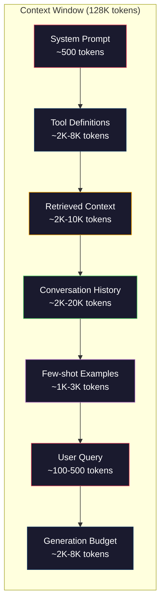
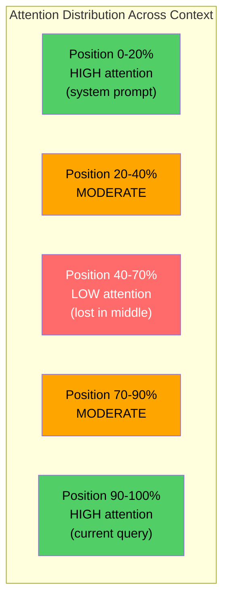
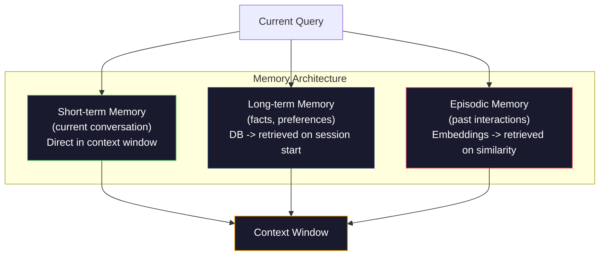

# 上下文工程:窗口、预算、记忆与检索

> 提示词工程是子集,上下文工程才是全局。提示词是你敲进去的一串字符,上下文是塞进模型窗口的一切:系统指令、检索到的文档、工具定义、对话历史、few-shot 示例,以及提示词本身。2026 年最好的 AI 工程师都是上下文工程师。他们决定什么进去、什么留在外面、按什么顺序排。

**类型:** 动手构建
**编程语言:** Python
**前置要求:** 第 10 阶段(从零构建 LLM)、第 11 阶段第 01-02 课
**预计耗时:** 约 90 分钟
**相关:** 第 11 阶段 · 15(提示词缓存)——缓存友好的布局是上下文工程的延伸;第 5 阶段 · 28(长上下文评测)讲如何用 NIAH/RULER 度量中间迷失。

## 学习目标

- 计算上下文窗口各组件(系统提示词、工具、历史、检索文档、生成余量)的 token 预算
- 实现上下文窗口管理策略:截断、摘要和对话历史滑动窗口
- 对上下文组件排定优先级和顺序,让模型的注意力集中在最相关的信息上
- 构建一个上下文组装器,根据查询类型和可用窗口空间动态分配 token

## 问题

Claude Opus 4.7 有 200K token 窗口(beta 版 1M),GPT-5 有 400K,Gemini 3 Pro 有 2M,Llama 4 号称 10M。这些数字听起来大得离谱——直到你把它填满。

看一个编程助手的真实分解。系统提示词:500 token;50 个工具的工具定义:8000 token;检索到的文档:4000 token;对话历史(10 轮):6000 token;当前用户查询:200 token;生成预算(最大输出):4000 token。合计:22700 token。这只占 128K 窗口的 18%。

但注意力并不随上下文长度线性扩展。128K token 上下文的模型要付二次方的注意力代价(朴素 Transformer 是 O(n^2),尽管多数生产模型用了高效注意力变体)。更重要的是,检索准确率会退化。"大海捞针"测试表明,模型难以找到放在长上下文中段的信息。Liu 等人(2023)的研究显示:LLM 检索长上下文开头和结尾的信息时准确率接近满分,但放在中段(上下文的 40-70% 位置)的信息,准确率掉 10-20%。这个"中间迷失"效应因模型而异,但影响当前所有架构。

实践教训:有 200K token 可用,不等于用满 200K token 就有效。一份精心策划的 10K token 上下文,常常胜过一股脑倒进去的 100K token。上下文工程,就是在上下文窗口内最大化信噪比的学问。

你放进窗口的每个 token,都在挤占一个本可以承载更相关信息的 token。每一个无关的工具定义、每一轮过期的对话、每一块答非所问的检索文本——都在让模型在这个任务上变差一点点。

## 概念

### 上下文窗口是稀缺资源

把上下文窗口当内存(RAM)想,别当硬盘想。它快、可直接访问,但容量有限。你装不下所有东西,必须做选择。



每个组件都在抢空间。多放工具定义,对话历史的空间就少了;多放检索上下文,few-shot 示例的空间就少了。上下文工程,就是分配这份预算、让任务表现最大化的艺术。

### 中间迷失

上下文工程里最重要的实证发现。模型对开头和结尾的信息注意力更好,中段的信息拿到的注意力分数更低,更容易被忽略。

Liu 等人(2023)系统地验证了这一点。他们把一篇相关文档放在 20 篇无关文档的不同位置,测量回答准确率。相关文档在最前或最后时,准确率 85-90%;在中间(20 篇里的第 10 位)时,准确率掉到 60-70%。

这对工程有直接指导意义:

- 最重要的信息放最前(系统提示词、关键指令)
- 当前查询和最相关的上下文放最后(近因偏好有帮助)
- 把上下文中段当作最低优先级区域
- 必须把信息放中段时,在结尾把要点重复一遍



### 上下文的组成部分

**系统提示词**:设定人设、约束和行为规则。放在最前,各轮之间保持不变。Claude Code 的系统提示词(含工具定义和行为指令)大约 6000 token。要精炼。系统提示词里的每个字,每次 API 调用都要重复一遍。

**工具定义**:每个工具占 50-200 token(名称、描述、参数 schema)。50 个工具、每个 150 token,对话还没开始就是 7500 token。动态工具选择——只纳入与当前查询相关的工具——能砍掉 60-80%。

**检索上下文**:来自向量数据库的文档、搜索结果、文件内容。检索质量直接决定回答质量。糟糕的检索比不检索更糟——它用噪声填满窗口, actively 误导模型。

**对话历史**:此前的每一条用户消息和助手回复。随对话长度线性增长。50 轮对话、每轮 200 token,就是 10000 token 的历史。其中大部分与当前查询无关。

**few-shot 示例**:演示期望行为的输入/输出对。两三个精选示例对输出质量的提升,常常胜过几千 token 的指令。但它们也占空间。

**生成预算**:为模型回答预留的 token。如果你把窗口塞满,模型就没有空间作答。至少预留 2000-4000 token 给生成。

### 上下文压缩策略

**历史摘要**:不再逐字保留所有旧轮次,而是定期总结对话。"我们讨论了 X、定了 Y、用户想要 Z",100 token 顶掉原本 2000 token 的 10 轮。历史超过阈值(如 5000 token)时就跑摘要。

**相关性过滤**:给每篇检索文档对当前查询打分,低于阈值的丢掉。检索回来 10 块但只有 3 块相关,就扔掉另外 7 块。3 块高度相关,胜过 10 块平庸。

**工具剪枝**:分类用户查询意图,只纳入与该意图相关的工具。代码问题不需要日历工具,日程问题不需要文件系统工具。这能把工具定义从 8000 token 压到 1000。

**递归摘要**:对超长文档,分阶段摘要。先摘要每一节,再摘要这些摘要。一份 50 页的文档变成 500 token 的 digest,留住要点。

### 记忆系统

上下文工程横跨三个时间尺度。

**短期记忆**:当前对话。直接存在上下文窗口里,每轮增长。用摘要和截断管理。

**长期记忆**:跨对话持久存在的事实和偏好。"用户偏好 TypeScript。""项目用 PostgreSQL。"存在数据库里,会话开始时检索出来。Claude Code 把它存在 CLAUDE.md 文件里,ChatGPT 存在它的 memory 功能里。

**情景记忆**:可能相关的具体过往交互。"上周二,我们在 auth 模块调过一个类似的 bug。"以嵌入形式存储,当前对话与某个过往情景相似时检索出来。



### 动态上下文组装

关键洞察:不同的查询需要不同的上下文。静态系统提示词 + 静态工具 + 静态历史是浪费。最好的系统按查询动态组装上下文。

1. 分类查询意图
2. 选择相关工具(不是全部工具)
3. 检索相关文档(不是固定集合)
4. 纳入相关历史轮次(不是全部历史)
5. 添加匹配任务类型的 few-shot 示例
6. 按重要性排序:关键的放最前,重要的放最后,可选的放中间

这就是好的 AI 应用与伟大的 AI 应用之间的分水岭。模型是同一个模型,上下文才是差异所在。

```figure
lost-in-the-middle
```

## 动手构建

### 第 1 步:token 计数器

不能度量,就不能预算。写一个简单的 token 计数器(用空白切分做近似,因为精确计数取决于 tokenizer)。

```python
import json
import numpy as np
from collections import OrderedDict

def count_tokens(text):
    if not text:
        return 0
    return int(len(text.split()) * 1.3)

def count_tokens_json(obj):
    return count_tokens(json.dumps(obj))
```

### 第 2 步:上下文预算管理器

核心抽象。预算管理器跟踪每个组件用了多少 token,并强制执行上限。

```python
class ContextBudget:
    def __init__(self, max_tokens=128000, generation_reserve=4000):
        self.max_tokens = max_tokens
        self.generation_reserve = generation_reserve
        self.available = max_tokens - generation_reserve
        self.allocations = OrderedDict()

    def allocate(self, component, content, max_tokens=None):
        tokens = count_tokens(content)
        if max_tokens and tokens > max_tokens:
            words = content.split()
            target_words = int(max_tokens / 1.3)
            content = " ".join(words[:target_words])
            tokens = count_tokens(content)

        used = sum(self.allocations.values())
        if used + tokens > self.available:
            allowed = self.available - used
            if allowed <= 0:
                return None, 0
            words = content.split()
            target_words = int(allowed / 1.3)
            content = " ".join(words[:target_words])
            tokens = count_tokens(content)

        self.allocations[component] = tokens
        return content, tokens

    def remaining(self):
        used = sum(self.allocations.values())
        return self.available - used

    def utilization(self):
        used = sum(self.allocations.values())
        return used / self.max_tokens

    def report(self):
        total_used = sum(self.allocations.values())
        lines = []
        lines.append(f"Context Budget Report ({self.max_tokens:,} token window)")
        lines.append("-" * 50)
        for component, tokens in self.allocations.items():
            pct = tokens / self.max_tokens * 100
            bar = "#" * int(pct / 2)
            lines.append(f"  {component:<25} {tokens:>6} tokens ({pct:>5.1f}%) {bar}")
        lines.append("-" * 50)
        lines.append(f"  {'Used':<25} {total_used:>6} tokens ({total_used/self.max_tokens*100:.1f}%)")
        lines.append(f"  {'Generation reserve':<25} {self.generation_reserve:>6} tokens")
        lines.append(f"  {'Remaining':<25} {self.remaining():>6} tokens")
        return "\n".join(lines)
```

### 第 3 步:中间迷失重排

实现重排策略:最重要的条目放最前和最后,最不重要的放中间。

```python
def reorder_lost_in_middle(items, scores):
    paired = sorted(zip(scores, items), reverse=True)
    sorted_items = [item for _, item in paired]

    if len(sorted_items) <= 2:
        return sorted_items

    first_half = sorted_items[::2]
    second_half = sorted_items[1::2]
    second_half.reverse()

    return first_half + second_half

def score_relevance(query, documents):
    query_words = set(query.lower().split())
    scores = []
    for doc in documents:
        doc_words = set(doc.lower().split())
        if not query_words:
            scores.append(0.0)
            continue
        overlap = len(query_words & doc_words) / len(query_words)
        scores.append(round(overlap, 3))
    return scores
```

### 第 4 步:对话历史压缩器

摘要旧的对话轮次,回收 token 预算。

```python
class ConversationManager:
    def __init__(self, max_history_tokens=5000):
        self.turns = []
        self.summaries = []
        self.max_history_tokens = max_history_tokens

    def add_turn(self, role, content):
        self.turns.append({"role": role, "content": content})
        self._compress_if_needed()

    def _compress_if_needed(self):
        total = sum(count_tokens(t["content"]) for t in self.turns)
        if total <= self.max_history_tokens:
            return

        while total > self.max_history_tokens and len(self.turns) > 4:
            old_turns = self.turns[:2]
            summary = self._summarize_turns(old_turns)
            self.summaries.append(summary)
            self.turns = self.turns[2:]
            total = sum(count_tokens(t["content"]) for t in self.turns)

    def _summarize_turns(self, turns):
        parts = []
        for t in turns:
            content = t["content"]
            if len(content) > 100:
                content = content[:100] + "..."
            parts.append(f"{t['role']}: {content}")
        return "Previous: " + " | ".join(parts)

    def get_context(self):
        parts = []
        if self.summaries:
            parts.append("[Conversation Summary]")
            for s in self.summaries:
                parts.append(s)
        parts.append("[Recent Conversation]")
        for t in self.turns:
            parts.append(f"{t['role']}: {t['content']}")
        return "\n".join(parts)

    def token_count(self):
        return count_tokens(self.get_context())
```

### 第 5 步:动态工具选择器

只纳入与当前查询相关的工具。先分类意图,再过滤。

```python
TOOL_REGISTRY = {
    "read_file": {
        "description": "Read contents of a file",
        "tokens": 120,
        "categories": ["code", "files"],
    },
    "write_file": {
        "description": "Write content to a file",
        "tokens": 150,
        "categories": ["code", "files"],
    },
    "search_code": {
        "description": "Search for patterns in codebase",
        "tokens": 130,
        "categories": ["code"],
    },
    "run_command": {
        "description": "Execute a shell command",
        "tokens": 140,
        "categories": ["code", "system"],
    },
    "create_calendar_event": {
        "description": "Create a new calendar event",
        "tokens": 180,
        "categories": ["calendar"],
    },
    "list_emails": {
        "description": "List recent emails",
        "tokens": 160,
        "categories": ["email"],
    },
    "send_email": {
        "description": "Send an email message",
        "tokens": 200,
        "categories": ["email"],
    },
    "web_search": {
        "description": "Search the web for information",
        "tokens": 140,
        "categories": ["research"],
    },
    "query_database": {
        "description": "Run a SQL query on the database",
        "tokens": 170,
        "categories": ["code", "data"],
    },
    "generate_chart": {
        "description": "Generate a chart from data",
        "tokens": 190,
        "categories": ["data", "visualization"],
    },
}

def classify_intent(query):
    query_lower = query.lower()

    intent_keywords = {
        "code": ["code", "function", "bug", "error", "file", "implement", "refactor", "debug", "test"],
        "calendar": ["meeting", "schedule", "calendar", "appointment", "event"],
        "email": ["email", "mail", "send", "inbox", "message"],
        "research": ["search", "find", "what is", "how does", "explain", "look up"],
        "data": ["data", "query", "database", "chart", "graph", "analytics", "sql"],
    }

    scores = {}
    for intent, keywords in intent_keywords.items():
        score = sum(1 for kw in keywords if kw in query_lower)
        if score > 0:
            scores[intent] = score

    if not scores:
        return ["code"]

    max_score = max(scores.values())
    return [intent for intent, score in scores.items() if score >= max_score * 0.5]

def select_tools(query, token_budget=2000):
    intents = classify_intent(query)
    relevant = {}
    total_tokens = 0

    for name, tool in TOOL_REGISTRY.items():
        if any(cat in intents for cat in tool["categories"]):
            if total_tokens + tool["tokens"] <= token_budget:
                relevant[name] = tool
                total_tokens += tool["tokens"]

    return relevant, total_tokens
```

### 第 6 步:完整的上下文组装流水线

把一切接起来。给定查询,动态组装最优上下文。

```python
class ContextEngine:
    def __init__(self, max_tokens=128000, generation_reserve=4000):
        self.budget = ContextBudget(max_tokens, generation_reserve)
        self.conversation = ConversationManager(max_history_tokens=5000)
        self.system_prompt = (
            "You are a helpful AI assistant. You have access to tools for "
            "code editing, file management, web search, and data analysis. "
            "Use the appropriate tools for each task. Be concise and accurate."
        )
        self.knowledge_base = [
            "Python 3.12 introduced type parameter syntax for generic classes using bracket notation.",
            "The project uses PostgreSQL 16 with pgvector for embedding storage.",
            "Authentication is handled by Supabase Auth with JWT tokens.",
            "The frontend is built with Next.js 15 using the App Router.",
            "API rate limits are set to 100 requests per minute per user.",
            "The deployment pipeline uses GitHub Actions with Docker multi-stage builds.",
            "Test coverage must be above 80% for all new modules.",
            "The codebase follows the repository pattern for data access.",
        ]

    def assemble(self, query):
        self.budget = ContextBudget(self.budget.max_tokens, self.budget.generation_reserve)

        system_content, _ = self.budget.allocate("system_prompt", self.system_prompt, max_tokens=1000)

        tools, tool_tokens = select_tools(query, token_budget=2000)
        tool_text = json.dumps(list(tools.keys()))
        tool_content, _ = self.budget.allocate("tools", tool_text, max_tokens=2000)

        relevance = score_relevance(query, self.knowledge_base)
        threshold = 0.1
        relevant_docs = [
            doc for doc, score in zip(self.knowledge_base, relevance)
            if score >= threshold
        ]

        if relevant_docs:
            doc_scores = [s for s in relevance if s >= threshold]
            reordered = reorder_lost_in_middle(relevant_docs, doc_scores)
            doc_text = "\n".join(reordered)
            doc_content, _ = self.budget.allocate("retrieved_context", doc_text, max_tokens=3000)

        history_text = self.conversation.get_context()
        if history_text.strip():
            history_content, _ = self.budget.allocate("conversation_history", history_text, max_tokens=5000)

        query_content, _ = self.budget.allocate("user_query", query, max_tokens=500)

        return self.budget

    def chat(self, query):
        self.conversation.add_turn("user", query)
        budget = self.assemble(query)
        response = f"[Response to: {query[:50]}...]"
        self.conversation.add_turn("assistant", response)
        return budget


def run_demo():
    print("=" * 60)
    print("  Context Engineering Pipeline Demo")
    print("=" * 60)

    engine = ContextEngine(max_tokens=128000, generation_reserve=4000)

    print("\n--- Query 1: Code task ---")
    budget = engine.chat("Fix the bug in the authentication module where JWT tokens expire too early")
    print(budget.report())

    print("\n--- Query 2: Research task ---")
    budget = engine.chat("What is the best approach for implementing vector search in PostgreSQL?")
    print(budget.report())

    print("\n--- Query 3: After conversation history builds up ---")
    for i in range(8):
        engine.conversation.add_turn("user", f"Follow-up question number {i+1} about the implementation details of the system")
        engine.conversation.add_turn("assistant", f"Here is the response to follow-up {i+1} with technical details about the architecture")

    budget = engine.chat("Now implement the changes we discussed")
    print(budget.report())

    print("\n--- Tool Selection Examples ---")
    test_queries = [
        "Fix the bug in auth.py",
        "Schedule a meeting with the team for Tuesday",
        "Show me the database query performance stats",
        "Search for best practices on error handling",
    ]

    for q in test_queries:
        tools, tokens = select_tools(q)
        intents = classify_intent(q)
        print(f"\n  Query: {q}")
        print(f"  Intents: {intents}")
        print(f"  Tools: {list(tools.keys())} ({tokens} tokens)")

    print("\n--- Lost-in-the-Middle Reordering ---")
    docs = ["Doc A (most relevant)", "Doc B (somewhat relevant)", "Doc C (least relevant)",
            "Doc D (relevant)", "Doc E (moderately relevant)"]
    scores = [0.95, 0.60, 0.20, 0.80, 0.50]
    reordered = reorder_lost_in_middle(docs, scores)
    print(f"  Original order: {docs}")
    print(f"  Scores:         {scores}")
    print(f"  Reordered:      {reordered}")
    print(f"  (Most relevant at start and end, least relevant in middle)")
```

## 投入使用

### Harness 托管的上下文

Claude Code 用分层方式管理上下文。系统提示词包含行为规则和工具定义(约 6K token)。你打开一个文件,它的内容被注入上下文;你做一次搜索,结果被加进来;旧的对话轮次被摘要;CLAUDE.md 提供跨会话持久的长期记忆。

关键的工程决策:Claude Code 不会把你的整个代码库倒进上下文。它按需检索相关文件。这就是实践中的上下文工程。

### 动态上下文加载

Cursor 把你的整个代码库索引成嵌入。你输入查询时,它用向量相似度检索最相关的文件和代码块,只有这些片段进入上下文窗口。50 万行的代码库,被压缩成最相关的 5-10 个代码块。

这就是那个模式:一切嵌入,按需检索,只放重要的。

### 助手的长期记忆

ChatGPT 把用户偏好和事实存为长期记忆。每次对话开始,相关记忆被检索出来放进系统提示词。"用户偏好 Python"只占 5 token,却在无数次对话中省下了几百 token 的重复说明。

### RAG 就是上下文工程

检索增强生成(RAG)是形式化的上下文工程。与其把知识塞进模型权重(训练)或系统提示词(静态上下文),不如在查询时检索相关文档、注入上下文窗口。整条 RAG 流水线——分块、嵌入、检索、重排——只为解决一个问题:把正确的信息放进上下文窗口。

## 交付

本课产出 `outputs/prompt-context-optimizer.md` —— 一个可复用的提示词,审计你的上下文组装策略并给出优化建议。喂给它你的系统提示词、工具数量、平均历史长度和检索策略,它会找出 token 浪费并提出改进。

还产出 `outputs/skill-context-engineering.md` —— 一个决策框架,根据任务类型、上下文窗口大小和延迟预算设计上下文组装流水线。

## 练习

1. 给 ContextBudget 类加一个"token 浪费检测器"。它应标记占用超过 30% 预算的组件,并针对各组件类型给出压缩建议(摘要历史、剪枝工具、重排文档)。

2. 为检索上下文实现语义去重。如果两篇检索文档相似度超过 80%(按词重叠或嵌入余弦相似度),只保留得分高的那篇。测量这能回收多少 token 预算。

3. 构建一个"上下文回放"工具。给定一段对话记录,让它在 ContextEngine 中重放,可视化预算分配逐轮的变化。画出每个组件的 token 用量随时间的曲线,找出上下文开始被压缩的那一轮。

4. 实现基于优先级的工具选择器。不做二元的纳入/排除,而是给每个工具对当前查询的相关性打分,按相关性降序纳入,直到工具预算耗尽。对比纳入 5、10、20、50 个工具时的任务表现。

5. 构建一个多策略上下文压缩器。实现三种压缩策略(截断、摘要、关键句抽取),在 20 篇文档上做基准。衡量压缩率与信息保留之间的取舍(压缩后的版本是否还包含查询的答案?)。

## 关键术语

| 术语 | 大家口头的说法 | 实际含义 |
|------|----------------|----------------------|
| 上下文窗口 | "模型能读多少" | 模型单次前向处理的最大 token 数(输入 + 输出)——GPT-5 为 400K,Claude Opus 4.7 为 200K(beta 1M),Gemini 3 Pro 为 2M |
| 上下文工程 | "高级提示词工程" | 决定什么进上下文窗口、按什么顺序、什么优先级的学问——涵盖检索、压缩、工具选择和记忆管理 |
| 中间迷失 | "模型会忘中段的东西" | 实证发现:LLM 对上下文开头和结尾注意力更好,放在中段的信息准确率掉 10-20% |
| token 预算 | "你还剩多少 token" | 把上下文窗口容量显式分配给各组件(系统提示词、工具、历史、检索、生成),并设每组件上限 |
| 动态上下文 | "临时加载东西" | 根据意图分类、相关工具选择和检索结果,为每个查询以不同方式组装上下文窗口 |
| 历史摘要 | "压缩对话" | 用简洁摘要替换逐字的旧对话轮次,在保留关键信息的同时降低 token 成本 |
| 工具剪枝 | "只放相关工具" | 分类查询意图,只纳入匹配的工具定义,把工具 token 成本降 60-80% |
| 长期记忆 | "跨会话记忆" | 存在数据库里、会话开始时检索的事实和偏好——CLAUDE.md、ChatGPT Memory 之类的系统 |
| 情景记忆 | "记住具体的往事" | 以嵌入存储的过往交互,当前查询与某段过往对话相似时检索出来 |
| 生成预算 | "给回答留的空间" | 为模型输出预留的 token——如果上下文把窗口塞满,模型就没有空间作答 |

## 延伸阅读

- [Liu et al., 2023 -- "Lost in the Middle: How Language Models Use Long Contexts"](https://arxiv.org/abs/2307.03172) -- 位置依赖注意力的权威研究,揭示模型在长上下文中段信息上的挣扎
- [Anthropic's Contextual Retrieval blog post](https://www.anthropic.com/news/contextual-retrieval) -- Anthropic 的上下文感知分块检索方法,检索失败率降低 49%
- [Simon Willison's "Context Engineering"](https://simonwillison.net/2025/Jun/27/context-engineering/) -- 为这门学科命名、并将它与提示词工程区分开的博文
- [LangChain documentation on RAG](https://python.langchain.com/docs/tutorials/rag/) -- 作为上下文工程模式的检索增强生成实战实现
- [Greg Kamradt's Needle in a Haystack test](https://github.com/gkamradt/LLMTest_NeedleInAHaystack) -- 揭示所有主流模型位置依赖检索失败的基准
- [Pope et al., "Efficiently Scaling Transformer Inference" (2022)](https://arxiv.org/abs/2211.05102) -- 为什么上下文长度驱动显存与延迟,以及 KV cache、MQA、GQA 如何改变预算计算
- [Agrawal et al., "SARATHI: Efficient LLM Inference by Piggybacking Decodes with Chunked Prefills" (2023)](https://arxiv.org/abs/2308.16369) -- 推理的两个阶段如何使长提示词在 TTFT 上昂贵、在 TPOT 上便宜;上下文打包取舍背后的真相
- [Ainslie et al., "GQA: Training Generalized Multi-Query Transformer Models from Multi-Head Checkpoints" (EMNLP 2023)](https://arxiv.org/abs/2305.13245) -- 分组查询注意力论文,在不损质量的前提下把生产解码器的 KV 显存砍了 8 倍
