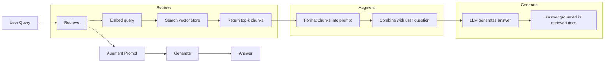
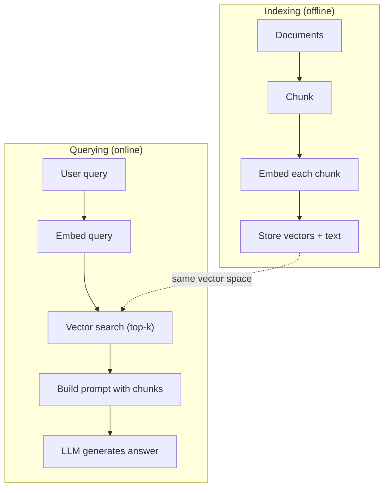

# RAG(检索增强生成)

> 你的 LLM 知道训练截止前的一切,却对你公司的文档、你的代码库、上周的会议纪要一无所知。RAG 的解法是:检索相关文档,塞进提示词。它是生产环境 AI 中部署最多的模式。这门课如果你只做一样东西,就做一条 RAG 流水线。

**类型:** 动手构建
**编程语言:** Python
**前置要求:** 第 10 阶段(从零构建 LLM)、第 11 阶段第 01-05 课
**预计耗时:** 约 90 分钟
**相关:** 第 5 阶段 · 23(RAG 分块策略)讲六种分块算法及各自胜场;第 5 阶段 · 22(嵌入模型深入)讲怎么挑嵌入器;第 11 阶段 · 07(高级 RAG)讲混合检索、重排和查询变换。

## 学习目标

- 构建完整的 RAG 流水线:文档加载、分块、嵌入、向量存储、检索和生成
- 用向量数据库(ChromaDB、FAISS 或 Pinecone)实现带正确索引的语义搜索
- 解释为什么知识型应用优先选 RAG 而非微调(成本、时效、可溯源)
- 用检索指标(精确率、召回率)和生成指标(忠实度、相关性)评估 RAG 质量

## 问题

你为公司搭了一个聊天机器人。客户问:"企业版套餐的退款政策是什么?"LLM 给了一个关于典型 SaaS 退款政策的泛泛回答。而真实政策埋在一份 200 页的内部 wiki 里:企业客户有 60 天窗口期、按使用比例退款。LLM 从没见过这份文档。它不可能知道训练数据里没有的东西。

微调是一种解法。拿 LLM,在你的内部文档上训练,部署更新后的模型。这能work,但问题严重:微调一次要烧掉几千到几万美元算力;文档一改,模型立刻过时;你无法知道模型的回答出自哪份资料;下个月公司收购一条新产品线,你就得再微调一遍。

RAG 是另一种解法。模型原封不动。问题进来时,在你的文档库里检索相关段落,把它们贴在问题之前放进提示词,让模型基于这些段落作答。文档库几分钟就能更新;你能清楚看到检索到了哪些文档;模型本身永远不变。这就是为什么 RAG 是生产环境的主流模式:更便宜、更新鲜、更可审计,而且与任何 LLM 都能搭配。

## 概念

### RAG 模式

整个模式四步走完:



查询 → 检索 → 增强提示词 → 生成。每个 RAG 系统都遵循这个模式。生产级 RAG 系统之间的差异,全在每一步的细节里:怎么分块、怎么嵌入、怎么搜索、怎么构造提示词。

### 为什么 RAG 胜过微调

| 关切 | 微调 | RAG |
|---------|------------|-----|
| 成本 | 每次训练 $1,000-$100,000+ | 每次查询 $0.01-$0.10(嵌入 + LLM) |
| 时效 | 重训之前就过时 | 重新索引文档,几分钟更新 |
| 可审计 | 无法溯源回答出处 | 能展示检索到的确切段落 |
| 幻觉 | 照样自由幻觉 | 锚定在检索到的文档上 |
| 数据隐私 | 训练数据烙进权重 | 文档留在你的向量库里 |

微调永久改变模型权重,RAG 临时改变模型上下文。对大多数应用来说,你要的是临时上下文。

微调唯一胜出的场景:你需要模型习得一种特定的风格、语气或推理模式,而光靠提示词做不到。至于事实性知识检索,RAG 每次都赢。

### 嵌入模型

嵌入模型把文本变成稠密向量。相似的文本在这个高维空间里产出相近的向量。"How do I reset my password?" 和 "I need to change my password" 几乎不共享词汇,却产出几乎相同的向量;"The cat sat on the mat" 产出的向量就截然不同。

常见嵌入模型(2026 阵容——完整分析见第 5 阶段 · 22):

| 模型 | 维度 | 厂商 | 备注 |
|-------|-----------|----------|-------|
| text-embedding-3-small | 1536(Matryoshka) | OpenAI | 大多数场景的性价比之王 |
| text-embedding-3-large | 3072(Matryoshka) | OpenAI | 精度更高,可截断到 256/512/1024 |
| Gemini Embedding 2 | 3072(Matryoshka) | Google | MTEB 检索榜首;8K 上下文 |
| voyage-4 | 1024/2048(Matryoshka) | Voyage AI | 领域变体(代码、金融、法律) |
| Cohere embed-v4 | 1024(Matryoshka) | Cohere | 多语言强,128K 上下文 |
| BGE-M3 | 1024(稠密 + 稀疏 + ColBERT) | BAAI(开放权重) | 一个模型三种视图 |
| Qwen3-Embedding | 4096(Matryoshka) | 阿里(开放权重) | 开放权重检索最高分 |
| all-MiniLM-L6-v2 | 384 | 开放权重(Sentence Transformers) | 原型基线 |

本课我们用 TF-IDF 自己造一个简易嵌入。不是因为生产系统用 TF-IDF,而是因为它让概念变得具体:文本进去,向量出来,相似文本产出相似向量。

### 向量相似度

给定两个向量,怎么度量相似?三种选择:

**余弦相似度**:两向量夹角的余弦。范围从 -1(相反)到 1(相同)。不看模长,只看方向。RAG 的默认选择。

```
cosine_sim(a, b) = dot(a, b) / (||a|| * ||b||)
```

**点积**:原始内积。模长大的向量得分更高。当模长本身携带信息时有用(更长的文档可能更相关)。

```
dot(a, b) = sum(a_i * b_i)
```

**L2(欧氏)距离**:向量空间中的直线距离。距离越小越相似。对模长差异敏感。

```
L2(a, b) = sqrt(sum((a_i - b_i)^2))
```

余弦相似度是标准。它按模长归一化,能优雅处理不同长度的文档。有人说"向量搜索",几乎总是指余弦相似度。

### 分块策略

文档太长,没法整个嵌成一个向量。一份 50 页的 PDF 包含几十个主题,整嵌效果很糟。所以把文档切成块,每块单独嵌入。

**定长分块**:每 N 个 token 切一刀。简单可预期。512 token 一块、50 token 重叠,意味着第 1 块是 token 0-511,第 2 块是 462-973,依此类推。重叠保证不会在不巧的边界上切断句子。

**语义分块**:在自然边界处切。段落、小节或 markdown 标题。每块是一个意义自洽的单元。实现更复杂,但检索效果更好。

**递归分块**:先尝试在最大边界切(节标题)。如果某节还是太大,改按段落边界切;段落还太大,再按句子边界切。这就是 LangChain RecursiveCharacterTextSplitter 的做法,实践中很好用。

块大小比人们想的更重要:

- 太小(64-128 token):每块缺上下文。"It increased 15% last quarter"——不知道 "it" 指什么,毫无意义。
- 太大(2048+ token):每块横跨多个主题,稀释相关性。你搜营收数据,返回的块 10% 讲营收、90% 讲人员编制。
- 甜点(256-512 token):上下文足够自洽,又足够聚焦。

大多数生产 RAG 系统用 256-512 token 块、50 token 重叠。Anthropic 的 RAG 指南也推荐这个区间。

### 向量数据库

有了嵌入,还需要地方存和搜。选项:

| 数据库 | 类型 | 适合 |
|----------|------|----------|
| FAISS | 库(进程内) | 原型、中小数据集 |
| Chroma | 轻量数据库 | 本地开发、小型部署 |
| Pinecone | 托管服务 | 不想操心的生产环境 |
| Weaviate | 开源数据库 | 自托管生产 |
| pgvector | Postgres 扩展 | 已经在用 Postgres |
| Qdrant | 开源数据库 | 高性能自托管 |

本课我们造一个简单的内存向量库:向量存在列表里,暴力做余弦相似度搜索。等价于 flat 索引的 FAISS,大约能撑到 10 万向量。生产系统用近似最近邻(ANN)算法如 HNSW,毫秒级搜几百万向量。

### 完整流水线



索引阶段每篇文档跑一次(或文档更新时)。查询阶段每个用户请求跑一次。生产环境中,索引可能要花几小时处理几百万文档,查询则必须在一秒内响应。

### 真实数字

大多数生产 RAG 系统用这些参数:

- **k = 5 到 10**,每次查询检索的块数
- **块大小 = 256 到 512 token**,50 token 重叠
- **上下文预算**:每次查询 2500-5000 token 的检索内容
- **总提示词**:约 8000-16000 token(系统提示词 + 检索块 + 对话历史 + 用户查询)
- **嵌入维度**:384-3072,取决于模型
- **索引吞吐**:API 嵌入下每秒 100-1000 篇文档
- **查询延迟**:检索 50-200ms,生成 500-3000ms

```figure
rag-chunking
```

## 动手构建

### 第 1 步:文档分块

```python
def chunk_text(text, chunk_size=200, overlap=50):
    words = text.split()
    chunks = []
    start = 0
    while start < len(words):
        end = start + chunk_size
        chunk = " ".join(words[start:end])
        chunks.append(chunk)
        start += chunk_size - overlap
    return chunks
```

### 第 2 步:TF-IDF 嵌入

我们来造一个简单的嵌入函数。TF-IDF(词频-逆文档频率)不是神经嵌入,但它能把文本变成捕捉词语重要性的向量。文档中频繁的词 TF 高,全语料中稀有的词 IDF 高。两者相乘,得到一个"重要且有区分度的词值高"的向量。

```python
import math
from collections import Counter

def build_vocabulary(documents):
    vocab = set()
    for doc in documents:
        vocab.update(doc.lower().split())
    return sorted(vocab)

def compute_tf(text, vocab):
    words = text.lower().split()
    count = Counter(words)
    total = len(words)
    return [count.get(word, 0) / total for word in vocab]

def compute_idf(documents, vocab):
    n = len(documents)
    idf = []
    for word in vocab:
        doc_count = sum(1 for doc in documents if word in doc.lower().split())
        idf.append(math.log((n + 1) / (doc_count + 1)) + 1)
    return idf

def tfidf_embed(text, vocab, idf):
    tf = compute_tf(text, vocab)
    return [t * i for t, i in zip(tf, idf)]
```

### 第 3 步:余弦相似度搜索

```python
def cosine_similarity(a, b):
    dot = sum(x * y for x, y in zip(a, b))
    norm_a = math.sqrt(sum(x * x for x in a))
    norm_b = math.sqrt(sum(x * x for x in b))
    if norm_a == 0 or norm_b == 0:
        return 0.0
    return dot / (norm_a * norm_b)

def search(query_embedding, stored_embeddings, top_k=5):
    scores = []
    for i, emb in enumerate(stored_embeddings):
        sim = cosine_similarity(query_embedding, emb)
        scores.append((i, sim))
    scores.sort(key=lambda x: x[1], reverse=True)
    return scores[:top_k]
```

### 第 4 步:提示词构造

这就是 RAG 里"增强"发生的地方。取检索到的块,格式化成提示词,让 LLM 基于提供的上下文作答。

```python
def build_rag_prompt(query, retrieved_chunks):
    context = "\n\n---\n\n".join(
        f"[Source {i+1}]\n{chunk}"
        for i, chunk in enumerate(retrieved_chunks)
    )
    return f"""Answer the question based ONLY on the following context.
If the context doesn't contain enough information, say "I don't have enough information to answer that."

Context:
{context}

Question: {query}

Answer:"""
```

### 第 5 步:完整的 RAG 流水线

```python
class RAGPipeline:
    def __init__(self):
        self.chunks = []
        self.embeddings = []
        self.vocab = []
        self.idf = []

    def index(self, documents):
        all_chunks = []
        for doc in documents:
            all_chunks.extend(chunk_text(doc))
        self.chunks = all_chunks
        self.vocab = build_vocabulary(all_chunks)
        self.idf = compute_idf(all_chunks, self.vocab)
        self.embeddings = [
            tfidf_embed(chunk, self.vocab, self.idf)
            for chunk in all_chunks
        ]

    def query(self, question, top_k=5):
        query_emb = tfidf_embed(question, self.vocab, self.idf)
        results = search(query_emb, self.embeddings, top_k)
        retrieved = [(self.chunks[i], score) for i, score in results]
        prompt = build_rag_prompt(
            question, [chunk for chunk, _ in retrieved]
        )
        return prompt, retrieved
```

### 第 6 步:生成(模拟)

生产环境中,这一步调用 LLM API。本课里,我们从检索上下文中抽取最相关的句子来模拟生成。

```python
def simple_generate(prompt, retrieved_chunks):
    query_words = set(prompt.lower().split("question:")[-1].split())
    best_sentence = ""
    best_score = 0
    for chunk in retrieved_chunks:
        for sentence in chunk.split("."):
            sentence = sentence.strip()
            if not sentence:
                continue
            words = set(sentence.lower().split())
            overlap = len(query_words & words)
            if overlap > best_score:
                best_score = overlap
                best_sentence = sentence
    return best_sentence if best_sentence else "I don't have enough information."
```

## 投入使用

换成真实的嵌入模型和 LLM,代码几乎不变:

```python
from openai import OpenAI

client = OpenAI()

def embed(text):
    response = client.embeddings.create(
        model="text-embedding-3-small",
        input=text
    )
    return response.data[0].embedding

def generate(prompt):
    response = client.chat.completions.create(
        model="gpt-4o-mini",
        messages=[{"role": "user", "content": prompt}],
        temperature=0
    )
    return response.choices[0].message.content
```

或者用 Anthropic:

```python
import anthropic

client = anthropic.Anthropic()

def generate(prompt):
    response = client.messages.create(
        model="claude-sonnet-5",
        max_tokens=1024,
        messages=[{"role": "user", "content": prompt}]
    )
    return response.content[0].text
```

流水线是同一条。换掉嵌入函数,换掉生成函数。检索逻辑、分块、提示词构造——不管你用哪个模型,全都一样。

向量存储上规模时,把暴力搜索换成正经的向量数据库:

```python
import chromadb

client = chromadb.Client()
collection = client.create_collection("my_docs")

collection.add(
    documents=chunks,
    ids=[f"chunk_{i}" for i in range(len(chunks))]
)

results = collection.query(
    query_texts=["What is the refund policy?"],
    n_results=5
)
```

Chroma 内部自己处理嵌入(默认用 all-MiniLM-L6-v2),向量存在本地数据库里。同样的模式,不同的管线。

## 交付

本课产出:
- `outputs/prompt-rag-architect.md` -- 一个为特定用例设计 RAG 系统的提示词
- `outputs/skill-rag-pipeline.md` -- 一个教智能体如何构建和调试 RAG 流水线的技能

## 练习

1. 把 TF-IDF 嵌入换成简单的词袋法(二元:词出现为 1,否则为 0)。在示例文档上对比检索质量。TF-IDF 应该更好,因为它给稀有词更高权重。

2. 实验块大小:在同一文档集上试 50、100、200、500 词。每个大小跑同样的 5 个查询,统计有多少查询在 top-3 里返回了相关块。找到检索质量的甜点。

3. 给每个块加元数据(来源文档名、块位置)。修改提示词模板,纳入来源标注,让 LLM 引用出处。

4. 实现一个简单评测:给定 10 个问答对,把每个问题过一遍 RAG 流水线,测量检索到的块中包含答案的比例。这就是 k 处的检索召回率。

5. 构建一个对话感知的 RAG 流水线:保留最近 3 轮问答,与检索块一起放进提示词。用跟进问题测试,比如问完定价后再问"企业版呢?"

## 关键术语

| 术语 | 大家口头的说法 | 实际含义 |
|------|----------------|----------------------|
| RAG | "会读你文档的 AI" | 检索相关文档,贴进提示词,生成锚定在这些文档上的回答 |
| 嵌入(Embedding) | "把文本变成数字" | 文本的稠密向量表示,相似的含义产出相似的向量 |
| 向量数据库 | "AI 的搜索引擎" | 为存储向量、按相似度找最近邻而优化的数据存储 |
| 分块(Chunking) | "把文档切成片" | 把文档拆成更小的段(典型 256-512 token),每段可独立嵌入和检索 |
| 余弦相似度 | "两个向量有多像" | 两向量夹角的余弦;1 = 同向,0 = 正交,-1 = 反向 |
| Top-k 检索 | "取最匹配的 k 个" | 从向量库返回与查询最相似的 k 个块 |
| 上下文窗口 | "LLM 能看到多少文本" | LLM 单次请求能处理的最大 token 数;检索块必须装得进去 |
| 增强生成 | "用给定上下文回答" | 以检索到的文档为上下文生成回答,而非只依赖训练获得的知识 |
| TF-IDF | "词语重要性打分" | 词频乘逆文档频率;按词在语料中的区分度加权 |
| 索引(Indexing) | "为搜索准备文档" | 离线进行的分块、嵌入、存储过程,供查询时检索 |

## 延伸阅读

- Lewis et al., "Retrieval-Augmented Generation for Knowledge-Intensive NLP Tasks" (2020) -- Facebook AI Research 的 RAG 原始论文,把"先检索后生成"模式形式化
- Anthropic's RAG documentation (docs.anthropic.com) -- 块大小、提示词构造和评测的实战指南
- Pinecone Learning Center, "What is RAG?" -- RAG 流水线清晰的可视化讲解,含生产考量
- Sentence-BERT: Reimers & Gurevych (2019) -- all-MiniLM 嵌入模型背后的论文,展示如何为语义相似度训练双编码器
- [Karpukhin et al., "Dense Passage Retrieval for Open-Domain Question Answering" (EMNLP 2020)](https://arxiv.org/abs/2004.04906) -- DPR 论文,证明稠密双编码器检索在开放域问答上胜过 BM25,奠定了现代 RAG 检索器的模式
- [LlamaIndex High-Level Concepts](https://docs.llamaindex.ai/en/stable/getting_started/concepts.html) -- 构建 RAG 流水线需要知道的主要概念:data loaders、node parsers、indices、retrievers、response synthesizers
- [LangChain RAG tutorial](https://python.langchain.com/docs/tutorials/rag/) -- 另一种风味的编排框架;以 runnable 链的视角看同一个"先检索后生成"模式
