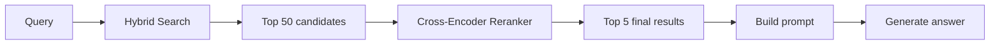
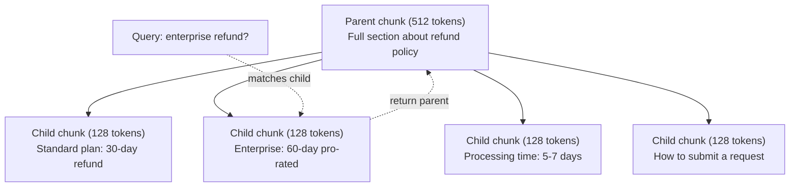
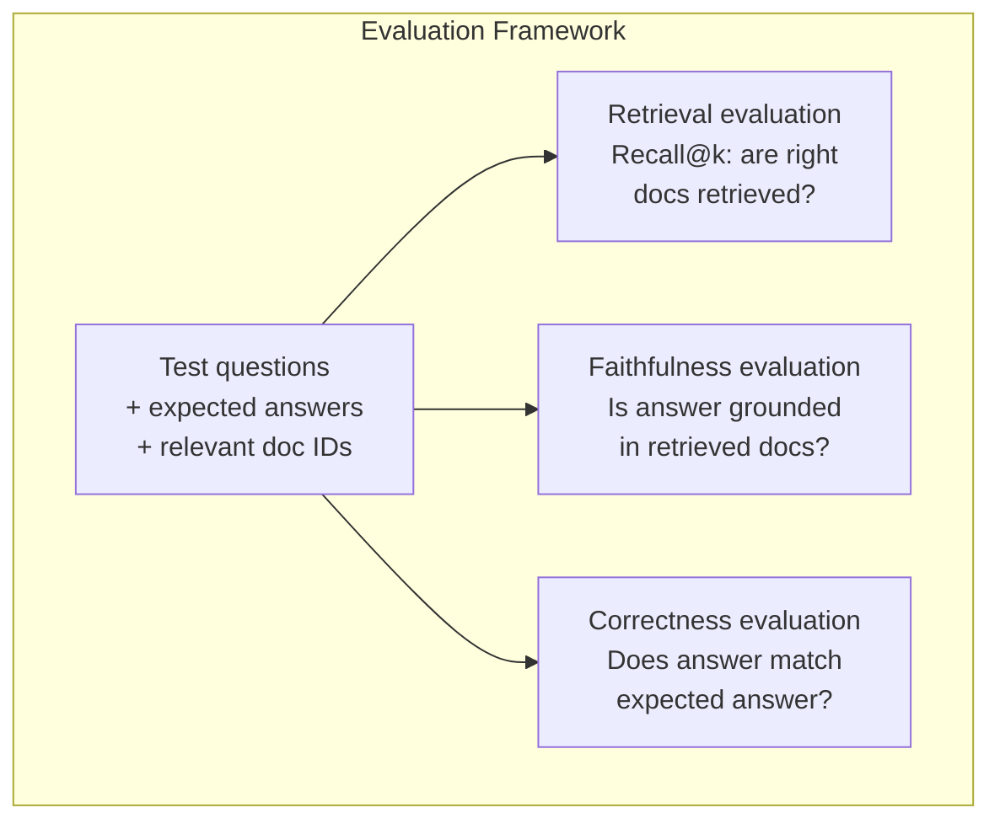

# 高级 RAG(分块、重排、混合搜索)

> 基础 RAG 检索最相似的前 k 个块。简单问题没问题,遇到多跳推理、歧义查询和大语料就散架。高级 RAG 就是"在 10 篇文档上能跑的 demo"与"在 1000 万篇文档上能跑的系统"之间的差别。

**类型:** 动手构建
**编程语言:** Python
**前置要求:** 第 11 阶段第 06 课(RAG)
**预计耗时:** 约 90 分钟
**相关:** 第 5 阶段 · 23(RAG 分块策略)覆盖全部六种分块算法——递归、语义、句子、父文档、late chunking、上下文检索——附 Vectara/Anthropic 基准。本课在此之上:混合搜索、重排、查询变换。

## 学习目标

- 实现保住文档结构与上下文的高级分块策略(语义、递归、父子)
- 构建把 BM25 关键词匹配与语义向量搜索及交叉编码器重排结合的混合搜索流水线
- 应用查询变换技术(HyDE、多查询、退一步提问)改善歧义或复杂问题的检索
- 诊断并修复常见 RAG 故障:检错块、答案不在上下文里、多跳推理断裂

## 问题

第 06 课你搭了基础 RAG 流水线。小语料上的直白问题没问题。现在试试这些:

**歧义查询**:"上季度营收是多少?"语义搜索返回关于营收战略、营收预测和 CFO 谈营收增长的块——都和 "revenue" 这个词语义相似,但没有一个带真实数字。正确的块写的是 "$47.2M in Q3 2025",用的是 "earnings" 而不是 "revenue"。嵌入模型认为 "revenue strategy" 比 "Q3 earnings were $47.2M" 更靠近查询。

**多跳问题**:"哪个团队的客户满意度提升最大?"这需要找到每个团队的满意度分数、相互比较、取最大值。没有任何单一一块包含答案。信息散落在各团队的报告里。

**大语料问题**:你有 200 万个块。正确答案在第 1,847,293 块。你的 top-5 检索拉回第 14、89,201、1,200,000、44、901,333 块——嵌入空间里都挺近,但没有一块有答案。这个规模下,近似最近邻搜索引入的误差足以把相关结果挤出 top-k。

基础 RAG 失败的原因:向量相似不等于相关。一个块可以与查询语义相似,却对回答它毫无用处。高级 RAG 用四项技术解决:混合搜索(加关键词匹配)、重排(更仔细地为候选打分)、查询变换(先修好查询再搜)和更好的分块(按正确的粒度检索)。

## 概念

### 混合搜索:语义 + 关键词

语义搜索(向量相似度)擅长理解含义。"How do I cancel my subscription?" 能匹配 "Steps to terminate your plan",尽管两者没有共同词汇。但它会漏掉精确匹配:"Error code E-4021" 可能匹配不上含有 "E-4021" 的块,如果嵌入模型把它当噪声处理。

关键词搜索(BM25)正好相反。它擅长精确匹配,"E-4021" 完美命中。但文档写 "terminate your plan" 时,"cancel my subscription" 返回零结果。

混合搜索两个都跑,再合并结果。

**BM25**(Best Matching 25)是标准关键词搜索算法,从上世纪 90 年代起就是搜索引擎的支柱。公式:

```
BM25(q, d) = sum over terms t in q:
    IDF(t) * (tf(t,d) * (k1 + 1)) / (tf(t,d) + k1 * (1 - b + b * |d| / avgdl))
```

其中 tf(t,d) 是 t 在文档 d 中的词频,IDF(t) 是逆文档频率,|d| 是文档长度,avgdl 是平均文档长度,k1 控制词频饱和(默认 1.2),b 控制长度归一化(默认 0.75)。

大白话:文档含有查询词(尤其是稀有词)时 BM25 分更高,但重复出现收益递减。一个出现 50 次 "revenue" 的文档,相关性不是只出现 1 次的 50 倍。

### 倒数排名融合(RRF)

你有两个排名列表:一个来自向量搜索,一个来自 BM25。怎么合并?倒数排名融合是标准做法。

```
RRF_score(d) = sum over rankings R:
    1 / (k + rank_R(d))
```

k 是常数(通常取 60),防止排名第一的结果一家独大。

某文档在向量搜索排第 1、在 BM25 排第 5,得分:1/(60+1) + 1/(60+5) = 0.0164 + 0.0154 = 0.0318

某文档在向量搜索排第 3、在 BM25 排第 2,得分:1/(60+3) + 1/(60+2) = 0.0159 + 0.0161 = 0.0320

RRF 天然平衡两个信号。在两个列表都排靠前的文档得分最高;在一个列表排第 1、另一个列表查无此文的文档得分中等。它用排名而不是原始分数,所以两套系统分数分布不同也无所谓——这就是它稳健的原因。

### 重排(Reranking)

检索(无论向量、关键词还是混合)快但不精。它用双编码器(bi-encoder):查询和每篇文档各自独立嵌入,再做比较。嵌入算一次就能缓存,可以扩展到几百万文档。

重排用交叉编码器(cross-encoder):查询和一个候选文档一起喂进模型,输出一个相关性分数。模型同时看到两段文本,能捕捉它们之间细粒度的交互。交叉编码器能明白 "What were Q3 earnings?" 与含 "$47.2M in Q3" 的块高度相关,即使双编码器错过了这层联系。

代价:交叉编码器比双编码器慢 100-1000 倍,因为它要联合处理查询-文档对。你没法为一百万文档预算交叉编码器分数。解法:先检索更大的候选集(混合搜索 top-50),再用交叉编码器重排出最终 top-5。



常见重排模型(2026 阵容):
- Cohere Rerank 3.5:托管 API,多语言,混合语料上召回提升最大
- Voyage rerank-2.5:托管 API,托管选项中延迟最低
- Jina-Reranker-v2 Multilingual:开放权重,100+ 种语言
- bge-reranker-v2-m3:开放权重,强力基线
- cross-encoder/ms-marco-MiniLM-L-6-v2:开放权重,CPU 上可跑,适合原型
- ColBERTv2 / Jina-ColBERT-v2:迟交互多向量重排器——打分时代价是 O(tokens) 而非 O(docs)

### 查询变换

有时候问题不在检索,而在查询本身。"What was that thing about the new policy change?" 是个糟糕的搜索查询:没有具体词项,嵌入含糊,什么检索系统都找不对文档。

**查询改写**:把用户的查询改写成更好的搜索查询。LLM 就能做:

```
User: "What was that thing about the new policy change?"
Rewritten: "Recent policy changes and updates"
```

**HyDE(假设文档嵌入)**:不用查询去搜,而是生成一个假设答案,嵌入它,搜与之相似的真实文档。

```
Query: "What is the refund policy for enterprise?"
Hypothetical answer: "Enterprise customers are eligible for a full refund
within 60 days of purchase. Refunds are pro-rated based on the remaining
subscription period and processed within 5-7 business days."
```

嵌入这个假设答案,搜与之相似的真实文档。直觉是:在嵌入空间里,假设答案与真实答案的距离,比原始查询与真实答案的距离更近。问题和答案的语言结构不同——生成假设答案,你就在嵌入中把"问题空间"与"答案空间"桥接了起来。

HyDE 在检索前多一次 LLM 调用,延迟增加 500-2000ms。当原始查询的检索质量差时,值得。

### 父子分块

标准分块逼你做取舍:小块检索精准,大块上下文充足。父子分块消除了这个取舍。

索引小块(128 token)用于检索;小块被检索到时,把它的父块(512 token)放进提示词。小块精确匹配查询,父块提供足够上下文让 LLM 生成好答案。



查询 "enterprise refund?" 精确命中子块 C2,但提示词拿到的是完整父块 P——包括处理时长和提交流程的上下文。

### 元数据过滤

跑向量搜索之前,先按元数据过滤语料:日期、来源、类别、作者、语言。这缩小了搜索空间,挡住不相关结果。

"上个月安全政策改了什么?"只应搜索安全类别下最近 30 天的文档。不做元数据过滤,你搜整个语料,可能拉回一篇恰好语义相似的两年前的安全文档。

生产 RAG 系统在每个块旁边存元数据:来源文档、创建日期、类别、作者、版本。向量数据库支持相似度搜索前按元数据预过滤——这对大规模性能至关重要。

### 评测

RAG 系统搭好了,怎么知道它行不行?三个指标:

**检索相关性(Recall@k)**:对一组已知相关文档的测试问题,相关文档出现在 top-k 结果中的比例?如果某问题的答案在第 47 块,第 47 块出现在 top-5 里了吗?

**忠实度(Faithfulness)**:生成的答案是否锚定在检索文档上?检索块说"60 天退款窗口",模型说"90 天退款窗口",这就是忠实度失败——上下文是对的,模型还是幻觉了。

**答案正确性**:生成的答案与预期答案一致吗?这是端到端指标,综合了检索质量与生成质量。

一个简单的忠实度检查:取生成答案中的每个论断,验证它(在实质上)出现在检索块中。答案含有任何检索块里没有的事实,就可能是幻觉。



```figure
agentic-rag-loop
```

## 动手构建

### 第 1 步:BM25 实现

```python
import math
from collections import Counter

class BM25:
    def __init__(self, k1=1.2, b=0.75):
        self.k1 = k1
        self.b = b
        self.docs = []
        self.doc_lengths = []
        self.avg_dl = 0
        self.doc_freqs = {}
        self.n_docs = 0

    def index(self, documents):
        self.docs = documents
        self.n_docs = len(documents)
        self.doc_lengths = []
        self.doc_freqs = {}

        for doc in documents:
            words = doc.lower().split()
            self.doc_lengths.append(len(words))
            unique_words = set(words)
            for word in unique_words:
                self.doc_freqs[word] = self.doc_freqs.get(word, 0) + 1

        self.avg_dl = sum(self.doc_lengths) / self.n_docs if self.n_docs else 1

    def score(self, query, doc_idx):
        query_words = query.lower().split()
        doc_words = self.docs[doc_idx].lower().split()
        doc_len = self.doc_lengths[doc_idx]
        word_counts = Counter(doc_words)
        score = 0.0

        for term in query_words:
            if term not in word_counts:
                continue
            tf = word_counts[term]
            df = self.doc_freqs.get(term, 0)
            idf = math.log((self.n_docs - df + 0.5) / (df + 0.5) + 1)
            numerator = tf * (self.k1 + 1)
            denominator = tf + self.k1 * (1 - self.b + self.b * doc_len / self.avg_dl)
            score += idf * numerator / denominator

        return score

    def search(self, query, top_k=10):
        scores = [(i, self.score(query, i)) for i in range(self.n_docs)]
        scores.sort(key=lambda x: x[1], reverse=True)
        return scores[:top_k]
```

### 第 2 步:倒数排名融合

```python
def reciprocal_rank_fusion(ranked_lists, k=60):
    scores = {}
    for ranked_list in ranked_lists:
        for rank, (doc_id, _) in enumerate(ranked_list):
            if doc_id not in scores:
                scores[doc_id] = 0.0
            scores[doc_id] += 1.0 / (k + rank + 1)
    fused = sorted(scores.items(), key=lambda x: x[1], reverse=True)
    return fused
```

### 第 3 步:混合搜索流水线

```python
def hybrid_search(query, chunks, vector_embeddings, vocab, idf, bm25_index, top_k=5, fusion_k=60):
    query_emb = tfidf_embed(query, vocab, idf)
    vector_results = search(query_emb, vector_embeddings, top_k=top_k * 3)
    bm25_results = bm25_index.search(query, top_k=top_k * 3)
    fused = reciprocal_rank_fusion([vector_results, bm25_results], k=fusion_k)
    return fused[:top_k]
```

### 第 4 步:简易重排器

生产中你会用交叉编码器模型。这里我们造一个用词重叠、词项重要性和短语匹配给查询-文档相关性打分的重排器。

```python
def rerank(query, candidates, chunks):
    query_words = set(query.lower().split())
    stop_words = {"the", "a", "an", "is", "are", "was", "were", "what", "how",
                  "why", "when", "where", "do", "does", "for", "of", "in", "to",
                  "and", "or", "on", "at", "by", "it", "its", "this", "that",
                  "with", "from", "be", "has", "have", "had", "not", "but"}
    query_terms = query_words - stop_words

    scored = []
    for doc_id, initial_score in candidates:
        chunk = chunks[doc_id].lower()
        chunk_words = set(chunk.split())

        term_overlap = len(query_terms & chunk_words)

        query_bigrams = set()
        q_list = [w for w in query.lower().split() if w not in stop_words]
        for i in range(len(q_list) - 1):
            query_bigrams.add(q_list[i] + " " + q_list[i + 1])
        bigram_matches = sum(1 for bg in query_bigrams if bg in chunk)

        position_boost = 0
        for term in query_terms:
            pos = chunk.find(term)
            if pos != -1 and pos < len(chunk) // 3:
                position_boost += 0.5

        rerank_score = (
            term_overlap * 1.0
            + bigram_matches * 2.0
            + position_boost
            + initial_score * 5.0
        )
        scored.append((doc_id, rerank_score))

    scored.sort(key=lambda x: x[1], reverse=True)
    return scored
```

### 第 5 步:HyDE(假设文档嵌入)

```python
def hyde_generate_hypothesis(query):
    templates = {
        "what": "The answer to '{query}' is as follows: Based on our documentation, {topic} involves specific policies and procedures that define how the process works.",
        "how": "To address '{query}': The process involves several steps. First, you need to initiate the request. Then, the system processes it according to the defined rules.",
        "default": "Regarding '{query}': Our records indicate specific details and policies related to this topic that provide a comprehensive answer."
    }
    query_lower = query.lower()
    if query_lower.startswith("what"):
        template = templates["what"]
    elif query_lower.startswith("how"):
        template = templates["how"]
    else:
        template = templates["default"]

    topic_words = [w for w in query.lower().split()
                   if w not in {"what", "is", "the", "how", "do", "does", "a", "an",
                                "for", "of", "to", "in", "on", "at", "by", "and", "or"}]
    topic = " ".join(topic_words) if topic_words else "this topic"

    return template.format(query=query, topic=topic)


def hyde_search(query, chunks, vector_embeddings, vocab, idf, top_k=5):
    hypothesis = hyde_generate_hypothesis(query)
    hypothesis_emb = tfidf_embed(hypothesis, vocab, idf)
    results = search(hypothesis_emb, vector_embeddings, top_k)
    return results, hypothesis
```

### 第 6 步:父子分块

```python
def create_parent_child_chunks(text, parent_size=200, child_size=50):
    words = text.split()
    parents = []
    children = []
    child_to_parent = {}

    parent_idx = 0
    start = 0
    while start < len(words):
        parent_end = min(start + parent_size, len(words))
        parent_text = " ".join(words[start:parent_end])
        parents.append(parent_text)

        child_start = start
        while child_start < parent_end:
            child_end = min(child_start + child_size, parent_end)
            child_text = " ".join(words[child_start:child_end])
            child_idx = len(children)
            children.append(child_text)
            child_to_parent[child_idx] = parent_idx
            child_start += child_size

        parent_idx += 1
        start += parent_size

    return parents, children, child_to_parent
```

### 第 7 步:忠实度评测

```python
def evaluate_faithfulness(answer, retrieved_chunks):
    answer_sentences = [s.strip() for s in answer.split(".") if len(s.strip()) > 10]
    if not answer_sentences:
        return 1.0, []

    grounded = 0
    ungrounded = []
    context = " ".join(retrieved_chunks).lower()

    for sentence in answer_sentences:
        words = set(sentence.lower().split())
        stop_words = {"the", "a", "an", "is", "are", "was", "were", "and", "or",
                      "to", "of", "in", "for", "on", "at", "by", "it", "this", "that"}
        content_words = words - stop_words
        if not content_words:
            grounded += 1
            continue

        matched = sum(1 for w in content_words if w in context)
        ratio = matched / len(content_words) if content_words else 0

        if ratio >= 0.5:
            grounded += 1
        else:
            ungrounded.append(sentence)

    score = grounded / len(answer_sentences) if answer_sentences else 1.0
    return score, ungrounded


def evaluate_retrieval_recall(queries_with_relevant, retrieval_fn, k=5):
    total_recall = 0.0
    results = []

    for query, relevant_indices in queries_with_relevant:
        retrieved = retrieval_fn(query, k)
        retrieved_indices = set(idx for idx, _ in retrieved)
        relevant_set = set(relevant_indices)
        hits = len(retrieved_indices & relevant_set)
        recall = hits / len(relevant_set) if relevant_set else 1.0
        total_recall += recall
        results.append({
            "query": query,
            "recall": recall,
            "hits": hits,
            "total_relevant": len(relevant_set)
        })

    avg_recall = total_recall / len(queries_with_relevant) if queries_with_relevant else 0
    return avg_recall, results
```

## 投入使用

用真实的交叉编码器重排:

```python
from sentence_transformers import CrossEncoder

reranker = CrossEncoder("cross-encoder/ms-marco-MiniLM-L-6-v2")

def rerank_with_cross_encoder(query, candidates, chunks, top_k=5):
    pairs = [(query, chunks[doc_id]) for doc_id, _ in candidates]
    scores = reranker.predict(pairs)
    scored = list(zip([doc_id for doc_id, _ in candidates], scores))
    scored.sort(key=lambda x: x[1], reverse=True)
    return scored[:top_k]
```

用 Cohere 的托管重排器:

```python
import cohere

co = cohere.Client()

def rerank_with_cohere(query, candidates, chunks, top_k=5):
    docs = [chunks[doc_id] for doc_id, _ in candidates]
    response = co.rerank(
        model="rerank-english-v3.0",
        query=query,
        documents=docs,
        top_n=top_k
    )
    return [(candidates[r.index][0], r.relevance_score) for r in response.results]
```

用真实 LLM 做 HyDE:

```python
import anthropic

client = anthropic.Anthropic()

def hyde_with_llm(query):
    response = client.messages.create(
        model="claude-sonnet-5",
        max_tokens=256,
        messages=[{
            "role": "user",
            "content": f"Write a short paragraph that would be a good answer to this question. Do not say you don't know. Just write what the answer would look like.\n\nQuestion: {query}"
        }]
    )
    return response.content[0].text
```

用 Weaviate 做生产级混合搜索:

```python
import weaviate

client = weaviate.connect_to_local()

collection = client.collections.get("Documents")
response = collection.query.hybrid(
    query="enterprise refund policy",
    alpha=0.5,
    limit=10
)
```

alpha 参数控制配比:0.0 = 纯关键词(BM25),1.0 = 纯向量,0.5 = 等权。多数生产系统用 0.3 到 0.7 之间的 alpha。

## 交付

本课产出:
- `outputs/prompt-advanced-rag-debugger.md` -- 一个诊断和修复 RAG 质量问题的提示词
- `outputs/skill-advanced-rag.md` -- 一个构建带混合搜索和重排的生产级 RAG 的技能

## 练习

1. 在示例文档上对比 BM25、向量搜索和混合搜索。对 5 个测试查询,记录哪种方法把最相关块放在了第 1 位。混合搜索至少应在 5 个里的 3 个上胜出。

2. 实现元数据过滤。给每篇文档加 "category" 字段(security、billing、api、product)。跑向量搜索前,把块过滤到相关类别。用 "What encryption is used?" 测试,验证它只搜索 security 类别的块。

3. 用第 06 课的简易生成函数搭一条完整的 HyDE 流水线。在全部 5 个测试查询上,对比直接查询搜索与 HyDE 搜索的检索质量(top-3 相关性)。HyDE 应该能改善模糊查询的结果。

4. 在示例文档上实现父子分块策略。取 child_size=30、parent_size=100。用子块搜索,但在提示词里返回父块。与 chunk_size=50 的标准分块对比生成答案。

5. 建一个评测集:10 个已知答案块的问题。对 (a) 纯向量搜索、(b) 纯 BM25、(c) 混合搜索、(d) 混合 + 重排,分别测量 Recall@3、Recall@5、Recall@10。画出结果,找出重排在何处帮助最大。

## 关键术语

| 术语 | 大家口头的说法 | 实际含义 |
|------|----------------|----------------------|
| BM25 | "关键词搜索" | 一种概率排名算法,按词频、逆文档频率和文档长度归一化为文档打分 |
| 混合搜索 | "两全其美" | 并行跑语义(向量)和关键词(BM25)搜索,再用排名融合合并结果 |
| 倒数排名融合 | "合并排名列表" | 对每篇文档在所有列表中的 1/(k + rank) 求和,合并多个排名列表 |
| 重排(Reranking) | "第二轮打分" | 用更贵的交叉编码器模型,对初检索出的候选集重新打分 |
| 交叉编码器 | "查询-文档联合模型" | 把查询和文档作为单个输入、产出相关性分数的模型;比双编码器准,但做全语料搜索太慢 |
| 双编码器 | "独立嵌入模型" | 查询与文档各自独立嵌入的模型;嵌入可预计算所以快,但不如交叉编码器准 |
| HyDE | "拿假答案去搜" | 为查询生成一个假设答案,嵌入它,搜与之相似的真实文档 |
| 父子分块 | "小块搜,大块答" | 索引小块做精准检索,返回更大的父块提供充足上下文 |
| 元数据过滤 | "先缩小再搜索" | 向量搜索前按属性(日期、来源、类别)过滤文档,缩小搜索空间 |
| 忠实度 | "有没有锚住" | 生成的答案是否有检索文档支撑,而不是凭模型训练数据幻觉出来的 |

## 延伸阅读

- Robertson & Zaragoza, "The Probabilistic Relevance Framework: BM25 and Beyond" (2009) -- BM25 的权威参考,解释公式背后的概率基础
- Cormack et al., "Reciprocal Rank Fusion Outperforms Condorcet and Individual Rank Learning Methods" (2009) -- RRF 原始论文,证明它胜过更复杂的融合方法
- Gao et al., "Precise Zero-Shot Dense Retrieval without Relevance Labels" (2022) -- HyDE 论文,证明假设文档嵌入在没有任何训练数据的情况下也能改善检索
- Nogueira & Cho, "Passage Re-ranking with BERT" (2019) -- 证明在 BM25 之上叠加交叉编码器重排显著提升检索质量
- [Khattab et al., "DSPy: Compiling Declarative Language Model Calls into Self-Improving Pipelines" (2023)](https://arxiv.org/abs/2310.03714) -- 把提示词构造与权重选择当作检索流水线上的优化问题;读这篇,学会"给 LLM 编程"而不是"给 LLM 写提示词"
- [Edge et al., "From Local to Global: A Graph RAG Approach to Query-Focused Summarization" (Microsoft Research 2024)](https://arxiv.org/abs/2404.16130) -- GraphRAG 论文:实体-关系抽取 + Leiden 社区检测,做查询聚焦的摘要;全局检索与局部检索之分
- [Asai et al., "Self-RAG: Learning to Retrieve, Generate, and Critique through Self-Reflection" (ICLR 2024)](https://arxiv.org/abs/2310.11511) -- 带反思 token 的自评 RAG;静态"先检索后生成"之外的智能体前沿
- [LangChain Query Construction blog](https://blog.langchain.dev/query-construction/) -- 如何把自然语言查询翻译成结构化数据库查询(Text-to-SQL、Cypher),作为检索前置步骤
