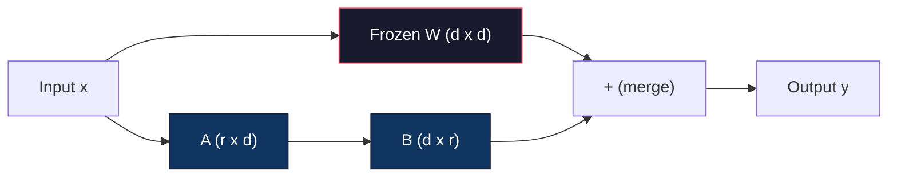
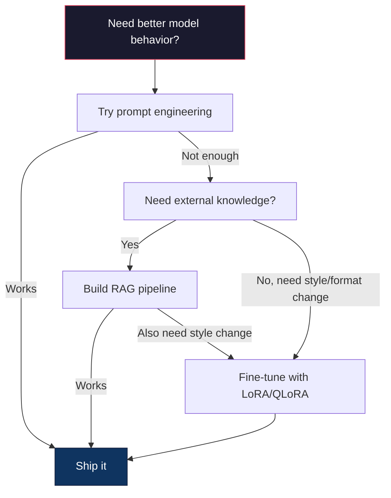

# 用 LoRA 与 QLoRA 微调

> 全量微调一个 7B 模型要 56GB 显存。你没有,大多数公司也没有。LoRA 让你在 6GB 里微调同一个模型——只训练不到 1% 的参数。这不是妥协:在大多数任务上,它能达到全量微调的质量。整个开源微调生态都跑在这一个技巧上。

**类型:** 动手构建
**编程语言:** Python
**前置要求:** 第 10 阶段第 06 课(指令微调 / SFT)
**预计耗时:** 约 75 分钟
**相关:** 第 10 阶段从零覆盖 SFT/DPO 循环。本课把它们接入 2026 年的 PEFT 工具箱(PEFT、TRL、Unsloth、Axolotl、LLaMA-Factory)。

## 学习目标

- 通过向预训练模型的注意力层注入低秩适配矩阵(A 和 B)实现 LoRA
- 计算 LoRA 与全量微调的参数节省:在 d_model 维、秩 r 下,训练 2*r*d 个参数而不是 d^2
- 用 QLoRA(4 比特量化基座 + LoRA 适配器)微调模型,塞进消费级 GPU 显存
- 把 LoRA 权重合并回基座模型用于部署,对比有无适配器的推理速度

## 问题

你有一个基座模型,Llama 3 8B。你想让它用你公司的口吻回答客服工单。SFT 是答案,但 SFT 有成本问题。

全量微调更新模型里的每一个参数。Llama 3 8B 有 80 亿参数,fp16 下每个参数 2 字节,光加载权重就是 16GB。训练时还要梯度(16GB)、Adam 的优化器状态(动量 + 方差,32GB)和激活值。合计:单个 8B 模型约 56GB 显存。

一张 A100 80GB 勉强塞下。云厂商两张 A100 每小时 $3-4。5 万样本训 3 个 epoch 要 6-10 小时,每次实验 $30-40。调对超参要跑 10 次实验,还没部署就花了 $400。

放大到 Llama 3 70B,数字就离谱了:光权重 140GB,你得要一个集群,每次实验 $100+。

还有个更深的问题。全量微调改动模型里的每一个权重。用客服数据微调,可能损害模型的通用能力——这叫灾难性遗忘(catastrophic forgetting)。模型在你的任务上变强,在其他一切上变弱。

你需要一种训练参数更少、显存更省、还不摧毁模型既有知识的方法。

## 概念

### LoRA:低秩适配

2021 年 6 月,微软的 Edward Hu 和同事们发表了 LoRA。论文的洞察是:微调时的权重更新具有低内在秩。一个 4096x4096 的权重矩阵有 1670 万参数,但你不需要全更新——更新中的有效信息,用一个秩 16 或 32 的矩阵就能捕获。

数学如下。标准线性层计算:

```
y = Wx
```

W 是 d_out x d_in 的矩阵。4096x4096 的注意力投影,就是 16,777,216 个参数。

LoRA 冻结 W,加一个低秩分解:

```
y = Wx + BAx
```

B 是 (d_out x r),A 是 (r x d_in)。秩 r 远小于 d——通常取 8、16 或 32。

r=16、4096x4096 的层:
- 原始参数:4096 x 4096 = 16,777,216
- LoRA 参数:(4096 x 16) + (16 x 4096) = 65,536 + 65,536 = 131,072
- 缩减:131,072 / 16,777,216 = 0.78%

训练 0.78% 的参数,拿到 95-100% 的质量。



A 用随机高斯初始化,B 初始化为零。这意味着 LoRA 的贡献从零开始——模型从原始行为出发训练,逐步学会适配。

### 缩放因子:Alpha

LoRA 引入缩放因子 alpha,控制低秩更新对输出的影响:

```
y = Wx + (alpha / r) * BAx
```

alpha = r 时,缩放为 1 倍;alpha = 2r(常见默认)时,缩放为 2 倍。这个超参数让 LoRA 路径的学习率可以独立于基础学习率控制。

实践建议:
- alpha = 2 * rank 是社区惯例(原论文多数实验用 alpha = rank)
- alpha = rank 给 1 倍缩放,保守但稳定
- alpha 越高,每步更新越大,可能加速收敛,也可能引起不稳定

### LoRA 加在哪里

Transformer 里有很多线性层,不必全加。原论文测过不同组合:

| 目标层 | 可训练参数(7B) | 质量 |
|--------------|----------------------|---------|
| 仅 q_proj | 4.7M | 好 |
| q_proj + v_proj | 9.4M | 更好 |
| q_proj + k_proj + v_proj + o_proj | 18.9M | 注意力最佳 |
| 全部线性层(注意力 + MLP) | 37.7M | 提升甚微,参数翻倍 |

大多数任务的甜点:q_proj + v_proj。它针对自注意力中的查询和值投影——控制模型注意什么、提取什么信息。加上 MLP 层对代码生成这类复杂任务有帮助,但对简单任务,参数翻倍、收益递减。

### 秩的选择

秩 r 控制适配的表达能力:

| 秩 | 可训练参数(每层) | 适合 |
|------|---------------------------|----------|
| 4 | 32,768 | 简单分类、情感分析 |
| 8 | 65,536 | 单领域问答、摘要 |
| 16 | 131,072 | 多领域任务、指令跟随 |
| 32 | 262,144 | 复杂推理、代码生成 |
| 64 | 524,288 | 大多数任务收益递减 |
| 128 | 1,048,576 | 很少有正当理由 |

Hu 等人证明,简单任务上 r=4 就能捕获大部分适配。实践中 r=8 和 r=16 最常见。超过 r=64 很少再提升质量,还开始丢掉 LoRA 的显存优势。

### QLoRA:4 比特量化 + LoRA

2023 年 5 月,华盛顿大学的 Tim Dettmers 和同事们发表了 QLoRA。想法:把冻结的基座模型量化到 4 比特精度,再在上面挂 fp16 的 LoRA 适配器。

显存方程被彻底改写:

| 方法 | 权重显存(7B) | 训练显存(7B) | 所需 GPU |
|--------|-------------------|---------------------|-------------|
| 全量微调(fp16) | 14GB | ~56GB | 1x A100 80GB |
| LoRA(fp16 基座) | 14GB | ~18GB | 1x A100 40GB |
| QLoRA(4 比特基座) | 3.5GB | ~6GB | 1x RTX 3090 24GB |

QLoRA 有三项技术贡献:

**NF4(正态浮点 4 比特)**:一种为神经网络权重专门设计的数据类型。神经网络权重大致服从正态分布,NF4 把 16 个量化级放在标准正态分布的分位点上。对正态分布数据来说,这是信息论最优——比均匀 4 比特量化(INT4)或标准 Float4 损失的信息更少。

**双重量化**:量化常数本身也占显存。每 64 个权重一块,需要一个 fp32 缩放因子(4 字节)。7B 模型就是额外 0.4GB。双重量化把这些常数量化到 fp8,开销降到 0.1GB。量小,但积少成多。

**分页优化器**:训练中,优化器状态(Adam 的动量和方差)在长序列上可能超出 GPU 显存。分页优化器利用 NVIDIA 统一内存,显存耗尽时自动把优化器状态分页到 CPU 内存,需要时再分页回来。以一些吞吐为代价,防止 OOM 崩溃。

### 质量问题

减参数或量化基座,会伤质量吗?多篇论文的结果:

| 方法 | MMLU(5-shot) | MT-Bench | HumanEval |
|--------|--------------|----------|-----------|
| 全量微调(Llama 2 7B) | 48.3 | 6.72 | 14.6 |
| LoRA r=16 | 47.9 | 6.68 | 14.0 |
| QLoRA r=16(NF4) | 47.5 | 6.61 | 13.4 |
| QLoRA r=64(NF4) | 48.1 | 6.70 | 14.2 |

LoRA r=16 在大多数基准上与全量微调相差不到 1%。QLoRA r=16 再损失零点几个百分点。QLoRA r=64 基本追平全量微调,显存却省 90%。

### 真实世界成本

在 5 万样本上微调 Llama 3 8B(3 个 epoch):

| 方法 | GPU | 时间 | 成本 |
|--------|-----|------|------|
| 全量微调 | 2x A100 80GB | 8 小时 | ~$32 |
| LoRA r=16 | 1x A100 40GB | 4 小时 | ~$8 |
| QLoRA r=16 | 1x RTX 4090 24GB | 6 小时 | ~$5 |
| QLoRA r=16(Unsloth) | 1x RTX 4090 24GB | 2.5 小时 | ~$2 |
| QLoRA r=16 | 1x T4 16GB | 12 小时 | ~$4 |

单张消费级 GPU 上的 QLoRA,成本不到一顿午饭。这就是 2023 年开放权重微调社区爆发的原因,也是 2026 年下列每个训练框架都默认自带 QLoRA 的原因。

### 2026 年的 PEFT 技术栈

| 框架 | 是什么 | 何时选 |
|-----------|-----------|-----------|
| **Hugging Face PEFT** | 权威的 LoRA/QLoRA/DoRA/IA3 库 | 你要原始控制力,训练循环已经在 `transformers.Trainer` 上 |
| **TRL** | HF 的反馈强化训练器(SFT、DPO、GRPO、PPO、ORPO) | SFT 之后还要 DPO/GRPO;构建在 PEFT 之上 |
| **Unsloth** | 用 Triton 内核重写前向/反向传播 | 你要 2-5 倍加速 + 一半显存,精度无损;Llama/Mistral/Qwen 家族 |
| **Axolotl** | PEFT + TRL + DeepSpeed + Unsloth 的 YAML 配置封装 | 你要可复现、可版本控制的训练运行 |
| **LLaMA-Factory** | PEFT + TRL 的 GUI/CLI/API | 你要零代码微调;支持 100+ 模型家族 |
| **torchtune** | 原生 PyTorch 配方,无 `transformers` 依赖 | 你要最小依赖,组织已经标准化在 PyTorch 上 |

经验法则:研究用途或一次性实验 → PEFT;可重复的生产流水线 → Axolotl 开 Unsloth 内核;一次性原型 → LLaMA-Factory。

### 合并适配器

训练完,你手上有两样东西:冻结的基座模型和一个小小的 LoRA 适配器(通常 10-100MB)。你可以:

1. **保持分离**:加载基座模型,再在上面加载适配器。不同任务换不同适配器。一个基座模型服务多个微调变体,就是这么做的。

2. **永久合并**:计算 W' = W + (alpha/r) * BA,把结果存为一个新的完整模型。合并后的模型与原始模型一样大。无推理开销,没有适配器要管理。

要服务多个任务(客服适配器、代码适配器、翻译适配器),保持分离;要部署单一专用模型,合并。

组合多个适配器的高级合并技术:

- **TIES-Merging**(Yadav et al. 2023):修剪小幅值参数、解决符号冲突,再合并。减少适配器之间的干扰。
- **DARE**(Yu et al. 2023):合并前随机丢弃适配器参数并 rescale 其余。组合能力的效果出奇地好。
- **任务算术**:简单地加减适配器权重。把"代码"适配器和"数学"适配器相加,常常得到一个两样都行的模型。

### 什么时候不该微调

微调是第三选择,不是第一选择。

**第一:提示词工程。** 写个更好的系统提示词,加 few-shot 示例,用思维链。零成本,几分钟搞定。如果提示词能走 80% 的路,你大概率不需要微调。

**第二:RAG。** 如果模型需要知道你的专属数据(文档、知识库、产品目录),检索比烙进权重更便宜、更好维护。见第 06 课。

**第三:微调。** 当你需要模型习得一种提示词做不到的风格、格式或推理模式时用它。当你需要稳定的结构化输出时用它。当你需要把大模型蒸馏进小模型时用它。当延迟要紧、你付不起 few-shot 提示词的额外 token 时用它。



```figure
lora-params
```

## 动手构建

我们用纯 PyTorch 从零实现 LoRA。不用库,没有魔法。你会构建 LoRA 层、注入模型、训练它、再把权重合并回去。

### 第 1 步:LoRA 层

```python
import torch
import torch.nn as nn
import math

class LoRALayer(nn.Module):
    def __init__(self, in_features, out_features, rank=8, alpha=16):
        super().__init__()
        self.rank = rank
        self.alpha = alpha
        self.scaling = alpha / rank

        self.A = nn.Parameter(torch.randn(in_features, rank) * (1 / math.sqrt(rank)))
        self.B = nn.Parameter(torch.zeros(rank, out_features))

    def forward(self, x):
        return (x @ self.A @ self.B) * self.scaling
```

A 用缩放后的随机值初始化,B 初始化为零。乘积 BA 从零开始,模型从原始行为起步。

### 第 2 步:LoRA 包装的线性层

```python
class LinearWithLoRA(nn.Module):
    def __init__(self, linear, rank=8, alpha=16):
        super().__init__()
        self.linear = linear
        self.lora = LoRALayer(
            linear.in_features, linear.out_features, rank, alpha
        )

        for param in self.linear.parameters():
            param.requires_grad = False

    def forward(self, x):
        return self.linear(x) + self.lora(x)
```

原线性层被冻结。只有 LoRA 参数(A 和 B)可训练。

### 第 3 步:把 LoRA 注入模型

```python
def inject_lora(model, target_modules, rank=8, alpha=16):
    for param in model.parameters():
        param.requires_grad = False

    lora_layers = {}
    for name, module in model.named_modules():
        if isinstance(module, nn.Linear):
            if any(t in name for t in target_modules):
                parent_name = ".".join(name.split(".")[:-1])
                child_name = name.split(".")[-1]
                parent = dict(model.named_modules())[parent_name]
                lora_linear = LinearWithLoRA(module, rank, alpha)
                setattr(parent, child_name, lora_linear)
                lora_layers[name] = lora_linear
    return lora_layers
```

先冻结模型里所有参数。然后遍历模型树,找到名字匹配目标的线性层,换成 LoRA 包装版。整个模型里,只有 LoRA 的 A 和 B 矩阵可训练。

### 第 4 步:数参数

```python
def count_parameters(model):
    total = sum(p.numel() for p in model.parameters())
    trainable = sum(p.numel() for p in model.parameters() if p.requires_grad)
    frozen = total - trainable
    return {
        "total": total,
        "trainable": trainable,
        "frozen": frozen,
        "trainable_pct": 100 * trainable / total if total > 0 else 0
    }
```

### 第 5 步:合并权重回去

```python
def merge_lora_weights(model):
    for name, module in model.named_modules():
        if isinstance(module, LinearWithLoRA):
            with torch.no_grad():
                merged = (
                    module.lora.A @ module.lora.B
                ) * module.lora.scaling
                module.linear.weight.data += merged.T
            parent_name = ".".join(name.split(".")[:-1])
            child_name = name.split(".")[-1]
            if parent_name:
                parent = dict(model.named_modules())[parent_name]
            else:
                parent = model
            setattr(parent, child_name, module.linear)
```

合并后,LoRA 层消失。模型大小与原始一致,适配烙进了权重。没有推理开销。

### 第 6 步:模拟 QLoRA 量化

```python
def quantize_to_nf4(tensor, block_size=64):
    blocks = tensor.reshape(-1, block_size)
    scales = blocks.abs().max(dim=1, keepdim=True).values / 7.0
    scales = torch.clamp(scales, min=1e-8)
    quantized = torch.round(blocks / scales).clamp(-8, 7).to(torch.int8)
    return quantized, scales

def dequantize_from_nf4(quantized, scales, original_shape):
    dequantized = quantized.float() * scales
    return dequantized.reshape(original_shape)
```

这通过把权重映射到 64 一块内的 16 个离散级来模拟 4 比特量化。生产 QLoRA 用 bitsandbytes 库在 GPU 上做真 NF4。

### 第 7 步:训练循环

```python
def train_lora(model, data, epochs=5, lr=1e-3, batch_size=4):
    optimizer = torch.optim.AdamW(
        [p for p in model.parameters() if p.requires_grad], lr=lr
    )
    criterion = nn.MSELoss()

    losses = []
    for epoch in range(epochs):
        epoch_loss = 0.0
        n_batches = 0
        indices = torch.randperm(len(data["inputs"]))

        for i in range(0, len(indices), batch_size):
            batch_idx = indices[i:i + batch_size]
            x = data["inputs"][batch_idx]
            y = data["targets"][batch_idx]

            output = model(x)
            loss = criterion(output, y)

            optimizer.zero_grad()
            loss.backward()
            optimizer.step()

            epoch_loss += loss.item()
            n_batches += 1

        avg_loss = epoch_loss / n_batches
        losses.append(avg_loss)

    return losses
```

### 第 8 步:完整演示

```python
def demo():
    torch.manual_seed(42)
    d_model = 256
    n_classes = 10

    model = nn.Sequential(
        nn.Linear(d_model, 512),
        nn.ReLU(),
        nn.Linear(512, 512),
        nn.ReLU(),
        nn.Linear(512, n_classes),
    )

    n_samples = 500
    x = torch.randn(n_samples, d_model)
    y = torch.randint(0, n_classes, (n_samples,))
    y_onehot = torch.zeros(n_samples, n_classes).scatter_(1, y.unsqueeze(1), 1.0)

    data = {"inputs": x, "targets": y_onehot}

    params_before = count_parameters(model)

    lora_layers = inject_lora(
        model, target_modules=["0", "2"], rank=8, alpha=16
    )

    params_after = count_parameters(model)

    losses = train_lora(model, data, epochs=20, lr=1e-3)

    merge_lora_weights(model)
    params_merged = count_parameters(model)

    return {
        "params_before": params_before,
        "params_after": params_after,
        "params_merged": params_merged,
        "losses": losses,
    }
```

演示创建一个小模型,给两层注入 LoRA,训练,再把权重合并回去。LoRA 训练期间,可训练参数从全量降到约 1%;合并后,架构恢复原样。

## 投入使用

用 Hugging Face 生态,在真实模型上做 LoRA 大约 20 行:

```python
from transformers import AutoModelForCausalLM, AutoTokenizer
from peft import LoraConfig, get_peft_model, TaskType

model = AutoModelForCausalLM.from_pretrained("meta-llama/Llama-3.1-8B")
tokenizer = AutoTokenizer.from_pretrained("meta-llama/Llama-3.1-8B")

lora_config = LoraConfig(
    task_type=TaskType.CAUSAL_LM,
    r=16,
    lora_alpha=32,
    lora_dropout=0.05,
    target_modules=["q_proj", "v_proj"],
)

model = get_peft_model(model, lora_config)
model.print_trainable_parameters()
```

QLoRA 再加 bitsandbytes 量化:

```python
from transformers import BitsAndBytesConfig

bnb_config = BitsAndBytesConfig(
    load_in_4bit=True,
    bnb_4bit_quant_type="nf4",
    bnb_4bit_compute_dtype=torch.bfloat16,
    bnb_4bit_use_double_quant=True,
)

model = AutoModelForCausalLM.from_pretrained(
    "meta-llama/Llama-3.1-8B",
    quantization_config=bnb_config,
    device_map="auto",
)

model = get_peft_model(model, lora_config)
```

就这些。同样的训练循环,同样的数据管线。基座模型活在 4 比特里,LoRA 适配器用 fp16 训练,整个东西塞进 6GB。

用 Hugging Face Trainer 训练:

```python
from transformers import TrainingArguments, Trainer
from datasets import load_dataset

dataset = load_dataset("tatsu-lab/alpaca", split="train[:5000]")

training_args = TrainingArguments(
    output_dir="./lora-llama",
    num_train_epochs=3,
    per_device_train_batch_size=4,
    gradient_accumulation_steps=4,
    learning_rate=2e-4,
    fp16=True,
    logging_steps=10,
    save_strategy="epoch",
    optim="paged_adamw_8bit",
)

trainer = Trainer(
    model=model,
    args=training_args,
    train_dataset=dataset,
)

trainer.train()

model.save_pretrained("./lora-adapter")
```

保存下来的适配器 10-100MB,基座模型原封未动。你可以把适配器分享到 Hugging Face Hub,不必重新分发完整模型。

## 交付

本课产出:
- `outputs/prompt-lora-advisor.md` -- 一个帮你为特定任务决定 LoRA 秩、目标模块和超参数的提示词
- `outputs/skill-fine-tuning-guide.md` -- 一个教智能体何时、如何微调的决策树技能

## 练习

1. **秩消融研究。** 以秩 2、4、8、16、32、64 跑演示。画出最终损失随秩变化的曲线。找到收益递减点——秩翻倍不再让损失减半的位置。256 维特征的简单分类任务上,应该在 r=8-16 左右。

2. **目标模块对比。** 修改 inject_lora,分别只注入第 "0" 层、只第 "2" 层、只第 "4" 层和全部三层。每个变体训 20 个 epoch,对比收敛速度和最终损失。这复刻了真实决策:选 q_proj、v_proj 还是全部线性层。

3. **量化误差分析。** 取训练好的模型权重矩阵,比较 quantize_to_nf4 / dequantize_from_nf4 前后的差异。计算均方误差、最大绝对误差,以及原始与重建权重的相关性。试验 block_size 取 32、64、128、256。

4. **多适配器服务。** 在数据的不同子集(偶数下标 vs 奇数下标)上训练两个 LoRA 适配器,都保存。基座模型只加载一次,换适配器,验证同一输入产生不同输出。生产系统用一个基座服务多个微调模型,就是这么做的。

5. **合并 vs 未合并推理。** 在同一批 100 个输入上,对比 merge_lora_weights 前后 LoRA 模型的输出。验证输出一致(浮点容差 1e-5 内)。然后给两者做推理速度基准——合并的应该略快,因为是一次矩阵乘而不是两次。

## 关键术语

| 术语 | 大家口头的说法 | 实际含义 |
|------|----------------|----------------------|
| LoRA | "高效微调" | 低秩适配:冻结基座权重,训练两个小矩阵 A 和 B,其乘积近似完整的权重更新 |
| QLoRA | "笔记本上微调" | 量化 LoRA:基座模型加载为 4 比特 NF4,上面训练 fp16 的 LoRA 适配器,6GB 显存微调 7B |
| 秩(r) | "模型能学多少" | A 和 B 矩阵的内维;控制表达能力与参数量的取舍 |
| Alpha | "LoRA 学习率" | 作用于 LoRA 输出的缩放因子;alpha/r 决定适配对最终输出的贡献 |
| NF4 | "4 比特量化" | Normal Float 4:量化级放在正态分布分位点上的 4 比特数据类型,对神经网络权重最优 |
| 适配器(Adapter) | "训练出来的那一小块" | 单独存成文件的 LoRA A、B 矩阵(10-100MB),可加载到基座模型的任何副本上 |
| 目标模块 | "哪些层加 LoRA" | 注入 LoRA 适配器的具体线性层(q_proj、v_proj 等) |
| 合并(Merging) | "烙进去" | 计算 W + (alpha/r) * BA 并替换原始权重,消除推理时的适配器开销 |
| 分页优化器 | "训练不 OOM" | GPU 显存耗尽时,把优化器状态(Adam 动量、方差)卸载到 CPU |
| 灾难性遗忘 | "微调把别的都搞坏了" | 更新全部权重导致模型丢失先前习得的能力 |

## 延伸阅读

- Hu et al., "LoRA: Low-Rank Adaptation of Large Language Models" (2021) -- 提出低秩分解方法的原始论文,在 GPT-3 175B 上测试,秩低至 4
- Dettmers et al., "QLoRA: Efficient Finetuning of Quantized Language Models" (2023) -- 提出 NF4、双重量化和分页优化器,单张 48GB GPU 微调 65B
- PEFT library documentation (huggingface.co/docs/peft) -- Hugging Face 生态中 LoRA、QLoRA 及其他参数高效方法的标准库
- Yadav et al., "TIES-Merging: Resolving Interference When Merging Models" (2023) -- 在不损质量的前提下组合多个 LoRA 适配器的技术
- [Rafailov et al., "Direct Preference Optimization: Your Language Model is Secretly a Reward Model" (NeurIPS 2023)](https://arxiv.org/abs/2305.18290) -- DPO 推导;SFT 之后的偏好调优阶段,无需奖励模型
- [TRL documentation](https://huggingface.co/docs/trl/) -- `SFTTrainer`、`DPOTrainer`、`KTOTrainer` 及与 PEFT/bitsandbytes/Unsloth 集成面的官方参考
- [Unsloth documentation](https://docs.unsloth.ai/) -- 微调吞吐翻倍、显存减半的融合内核;TRL 之下的性能层
- [Axolotl documentation](https://axolotl-ai-cloud.github.io/axolotl/) -- YAML 配置的多 GPU SFT/DPO/QLoRA 训练器;手写脚本之外的配置即代码选择
