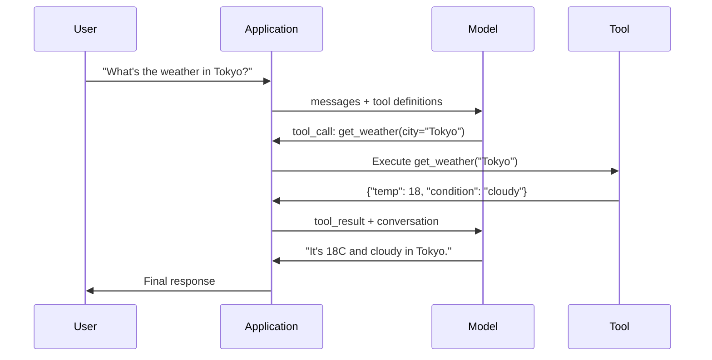

# 函数调用与工具使用

> LLM 什么都做不了。它们只会生成文本,这就是全部能力。它们查不了天气、查不了数据库、发不了邮件、跑不了代码、读不了文件。你见过的每一个"AI 智能体",都是一个在生成"该调用哪个函数"的 JSON 的 LLM——然后是你的代码真正去调用它。模型是大脑,工具是双手,函数调用是连接它们的神经系统。

**类型:** 动手构建
**编程语言:** Python
**前置要求:** 第 11 阶段第 03 课(结构化输出)
**预计耗时:** 约 75 分钟
**相关:** 第 11 阶段 · 14(模型上下文协议 MCP)——当一个工具要跨宿主共享时,从内联函数调用升级到 MCP 服务器。本课讲内联情形,MCP 讲协议情形。

## 学习目标

- 实现函数调用循环:定义工具 schema、解析模型的工具调用 JSON、执行函数并返回结果
- 设计带清晰描述和类型化参数的工具 schema,让模型能可靠调用
- 构建多轮智能体循环,串联多次函数调用来回答复杂查询
- 处理函数调用的边角情况:并行工具调用、错误传播、防止无限工具循环

## 问题

你搭了一个聊天机器人。用户问:"东京现在天气怎么样?"

模型回答:"我无法访问实时天气数据,但根据这个季节,东京可能在 15 摄氏度左右……"

这是披着免责声明外衣的幻觉。模型不知道天气,也永远不会知道。天气每小时都在变,模型的训练数据是几个月前的。

正确答案需要调用 OpenWeatherMap API、拿到当前温度、返回真实数字。模型调不了 API,你的代码可以。缺的那块是:一个结构化协议,让模型能说"我需要带这些参数调用天气 API",让你的代码执行它并把结果喂回去。

这就是函数调用。模型输出结构化 JSON,描述要调用哪个函数、带什么参数;你的应用执行函数;结果回到对话里;模型用结果产出最终答案。

没有函数调用,LLM 是百科全书。有了它,LLM 成为智能体。

## 概念

### 函数调用循环

每次工具使用交互都遵循同样的 5 步循环。



第 1 步:用户发消息。第 2 步:模型收到消息和工具定义(描述可用函数的 JSON Schema)。第 3 步:模型不用文本回答,而是输出一个工具调用——带函数名和参数的结构化 JSON 对象。第 4 步:你的代码执行函数、拿到结果。第 5 步:结果回到模型,模型现在有了真实数据,产出最终答案。

模型从不执行任何东西。它只决定调什么、带什么参数。你的代码才是执行者。

### 工具定义:JSON Schema 契约

每个工具由一个 JSON Schema 定义,告诉模型这个函数做什么、接收什么参数、参数必须是什么类型。

```json
{
  "type": "function",
  "function": {
    "name": "get_weather",
    "description": "Get current weather for a city. Returns temperature in Celsius and conditions.",
    "parameters": {
      "type": "object",
      "properties": {
        "city": {
          "type": "string",
          "description": "City name, e.g. 'Tokyo' or 'San Francisco'"
        },
        "units": {
          "type": "string",
          "enum": ["celsius", "fahrenheit"],
          "description": "Temperature units"
        }
      },
      "required": ["city"]
    }
  }
}
```

`description` 字段至关重要。模型靠读它来决定何时、如何使用这个工具。含糊的描述如 "gets weather",工具选择效果就远不如 "Get current weather for a city. Returns temperature in Celsius and conditions."。描述就是工具选择的提示词。

### 厂商对比

每个主流厂商都支持函数调用,但 API 表面不同。

| 厂商 | API 参数 | 工具调用格式 | 并行调用 | 强制调用 |
|----------|--------------|-----------------|---------------|----------------|
| OpenAI(GPT-5、o4) | `tools` | `tool_calls[].function` | 支持(单轮多个) | `tool_choice="required"` |
| Anthropic(Claude 4.6/4.7) | `tools` | `content[].type="tool_use"` | 支持(多个块) | `tool_choice={"type":"any"}` |
| Google(Gemini 3) | `function_declarations` | `functionCall` | 支持 | `function_calling_config` |
| 开放权重(Llama 4、Qwen3、DeepSeek-V3) | Llama 4 原生 `tools`;其他用 Hermes 或 ChatML | 不一 | 视模型而定 | 基于提示词,或支持时 `tool_choice` |

到 2026 年,三家闭源厂商已经收敛到几乎相同的 JSON-Schema 格式。Llama 4 自带与 OpenAI 形状一致的原生 `tools` 字段。开放权重微调模型仍不统一——Hermes 格式(NousResearch)是第三方微调里最常见的。要跨宿主共享工具,优先 MCP(第 11 阶段 · 14)而非内联函数调用——对所有客户端,服务器都是同一个。

### 工具选择:Auto、Required、Specific

你控制模型何时使用工具。

**Auto(默认)**:模型自己决定是调用工具还是直接回答。"2+2 等于几?"——直接答。"天气怎么样?"——调工具。

**Required**:模型必须至少调用一个工具。当你知道用户意图一定需要工具时用。防止模型瞎猜而不是去查真实数据。

**指定函数**:强制模型调用某个特定函数。`tool_choice={"type":"function", "function": {"name": "get_weather"}}` 保证天气工具被调用,无论查询是什么。用于路由——上游逻辑已经确定了需要哪个工具时。

### 并行函数调用

GPT-4o 和 Claude 能在单轮里调用多个函数。用户问:"东京和纽约的天气怎么样?"模型同时输出两个工具调用:

```json
[
  {"name": "get_weather", "arguments": {"city": "Tokyo"}},
  {"name": "get_weather", "arguments": {"city": "New York"}}
]
```

你的代码执行两个(最好并发),返回两个结果,模型综合成一个回答。往返从 2 次减到 1 次。对每查询要调 5-10 次工具的智能体,并行调用能降 60-80% 延迟。

### 结构化输出 vs 函数调用

第 03 课讲了结构化输出。函数调用用的是同一套 JSON Schema 机制,但目的不同。

**结构化输出**:强制模型按特定形状产出数据。输出就是最终产物。例:从文本抽取商品信息为 `{name, price, in_stock}`。

**函数调用**:模型声明一个要执行动作的意图。输出是中间步骤。例:`get_weather(city="Tokyo")`——模型在请求一个动作,而不是产出最终答案。

要数据抽取,用结构化输出;要让模型与外部系统交互,用函数调用。

### 安全:不可妥协的规则

函数调用是你能给 LLM 的最危险的能力。模型选择执行什么。你的工具集里有数据库查询,模型就会构造查询;有 shell 命令,模型就会写命令。

**规则 1:永远不要把模型生成的 SQL 直接送进数据库。** 模型能够、也确实会生成 DROP TABLE、UNION 注入或返回全表每一行的查询。永远参数化,永远校验,永远用操作白名单。

**规则 2:函数白名单。** 模型只能调用你显式定义的函数。永远不要做一个通用的"按名字执行任意函数"的工具。你有 50 个内部函数,只暴露用户需要的那 5 个。

**规则 3:校验参数。** 模型可能传入城市名 `"; DROP TABLE users; --"`。执行前,对照期望的类型、范围和格式校验每个参数。

**规则 4:净化工具结果。** 如果工具返回敏感数据(API 密钥、PII、内部错误),送回模型之前先过滤。模型会把工具结果原样搬进它的回答。

**规则 5:限制工具调用速率。** 循环里的模型可能调用工具几百次。设个上限(每次对话 10-20 次是合理的),打断无限循环。

### 错误处理

工具会失败。API 会超时。数据库会挂。文件会不存在。模型需要知道工具何时失败、为何失败。

把错误作为结构化工具结果返回,而不是异常:

```json
{
  "error": true,
  "message": "City 'Toky' not found. Did you mean 'Tokyo'?",
  "code": "CITY_NOT_FOUND"
}
```

模型读到这个,调整参数,重试。模型很擅长从结构化错误消息中自我纠正,却很不会从空响应或泛泛的"something went wrong"中恢复。

### MCP:模型上下文协议

MCP 是 Anthropic 的工具互操作开放标准。不再让每个应用各定义各的工具,MCP 提供通用协议:工具由 MCP 服务器提供,由 MCP 客户端(如 Claude Code、Cursor 或你的应用)消费。

一个 MCP 服务器可以把工具暴露给任何兼容客户端。一个 Postgres MCP 服务器让任何 MCP 兼容智能体获得数据库访问;一个 GitHub MCP 服务器让任何智能体获得仓库访问。工具定义一次,到处可用。

MCP 之于函数调用,如同 HTTP 之于网络。它标准化了传输层,让工具变得可移植。

```figure
mx-tool-call-loop
```

## 动手构建

### 第 1 步:定义工具注册表

建一个注册表,存工具定义和它们的实现。每个工具有一个 JSON Schema 定义(模型看到的)和一个 Python 函数(你的代码执行的)。

```python
import json
import math
import time
import hashlib


TOOL_REGISTRY = {}


def register_tool(name, description, parameters, function):
    TOOL_REGISTRY[name] = {
        "definition": {
            "type": "function",
            "function": {
                "name": name,
                "description": description,
                "parameters": parameters,
            },
        },
        "function": function,
    }
```

### 第 2 步:实现 5 个工具

构建计算器、天气查询、网页搜索模拟器、文件读取器和代码运行器。

```python
def calculator(expression, precision=2):
    allowed = set("0123456789+-*/.() ")
    if not all(c in allowed for c in expression):
        return {"error": True, "message": f"Invalid characters in expression: {expression}"}
    try:
        result = eval(expression, {"__builtins__": {}}, {"math": math})
        return {"result": round(float(result), precision), "expression": expression}
    except Exception as e:
        return {"error": True, "message": str(e)}


WEATHER_DB = {
    "tokyo": {"temp_c": 18, "condition": "cloudy", "humidity": 72, "wind_kph": 14},
    "new york": {"temp_c": 22, "condition": "sunny", "humidity": 45, "wind_kph": 8},
    "london": {"temp_c": 12, "condition": "rainy", "humidity": 88, "wind_kph": 22},
    "san francisco": {"temp_c": 16, "condition": "foggy", "humidity": 80, "wind_kph": 18},
    "sydney": {"temp_c": 25, "condition": "sunny", "humidity": 55, "wind_kph": 10},
}


def get_weather(city, units="celsius"):
    key = city.lower().strip()
    if key not in WEATHER_DB:
        suggestions = [c for c in WEATHER_DB if c.startswith(key[:3])]
        return {
            "error": True,
            "message": f"City '{city}' not found.",
            "suggestions": suggestions,
            "code": "CITY_NOT_FOUND",
        }
    data = WEATHER_DB[key].copy()
    if units == "fahrenheit":
        data["temp_f"] = round(data["temp_c"] * 9 / 5 + 32, 1)
        del data["temp_c"]
    data["city"] = city
    return data


SEARCH_DB = {
    "python function calling": [
        {"title": "OpenAI Function Calling Guide", "url": "https://platform.openai.com/docs/guides/function-calling", "snippet": "Learn how to connect LLMs to external tools."},
        {"title": "Anthropic Tool Use", "url": "https://docs.anthropic.com/en/docs/tool-use", "snippet": "Claude can interact with external tools and APIs."},
    ],
    "MCP protocol": [
        {"title": "Model Context Protocol", "url": "https://modelcontextprotocol.io", "snippet": "An open standard for connecting AI models to data sources."},
    ],
    "weather API": [
        {"title": "OpenWeatherMap API", "url": "https://openweathermap.org/api", "snippet": "Free weather API with current, forecast, and historical data."},
    ],
}


def web_search(query, max_results=3):
    key = query.lower().strip()
    for db_key, results in SEARCH_DB.items():
        if db_key in key or key in db_key:
            return {"query": query, "results": results[:max_results], "total": len(results)}
    return {"query": query, "results": [], "total": 0}


FILE_SYSTEM = {
    "data/config.json": '{"model": "gpt-4o", "temperature": 0.7, "max_tokens": 4096}',
    "data/users.csv": "name,email,role\nAlice,alice@example.com,admin\nBob,bob@example.com,user",
    "README.md": "# My Project\nA tool-use agent built from scratch.",
}


def read_file(path):
    if ".." in path or path.startswith("/"):
        return {"error": True, "message": "Path traversal not allowed.", "code": "FORBIDDEN"}
    if path not in FILE_SYSTEM:
        available = list(FILE_SYSTEM.keys())
        return {"error": True, "message": f"File '{path}' not found.", "available_files": available, "code": "NOT_FOUND"}
    content = FILE_SYSTEM[path]
    return {"path": path, "content": content, "size_bytes": len(content), "lines": content.count("\n") + 1}


def run_code(code, language="python"):
    if language != "python":
        return {"error": True, "message": f"Language '{language}' not supported. Only 'python' is available."}
    forbidden = ["import os", "import sys", "import subprocess", "exec(", "eval(", "__import__", "open("]
    for pattern in forbidden:
        if pattern in code:
            return {"error": True, "message": f"Forbidden operation: {pattern}", "code": "SECURITY_VIOLATION"}
    try:
        local_vars = {}
        exec(code, {"__builtins__": {"print": print, "range": range, "len": len, "str": str, "int": int, "float": float, "list": list, "dict": dict, "sum": sum, "min": min, "max": max, "abs": abs, "round": round, "sorted": sorted, "enumerate": enumerate, "zip": zip, "map": map, "filter": filter, "math": math}}, local_vars)
        result = local_vars.get("result", None)
        return {"success": True, "result": result, "variables": {k: str(v) for k, v in local_vars.items() if not k.startswith("_")}}
    except Exception as e:
        return {"error": True, "message": f"{type(e).__name__}: {e}"}
```

### 第 3 步:注册所有工具

```python
def register_all_tools():
    register_tool(
        "calculator", "Evaluate a mathematical expression. Supports +, -, *, /, parentheses, and decimals. Returns the numeric result.",
        {"type": "object", "properties": {"expression": {"type": "string", "description": "Math expression, e.g. '(10 + 5) * 3'"}, "precision": {"type": "integer", "description": "Decimal places in result", "default": 2}}, "required": ["expression"]},
        calculator,
    )
    register_tool(
        "get_weather", "Get current weather for a city. Returns temperature, condition, humidity, and wind speed.",
        {"type": "object", "properties": {"city": {"type": "string", "description": "City name, e.g. 'Tokyo' or 'San Francisco'"}, "units": {"type": "string", "enum": ["celsius", "fahrenheit"], "description": "Temperature units, defaults to celsius"}}, "required": ["city"]},
        get_weather,
    )
    register_tool(
        "web_search", "Search the web for information. Returns a list of results with title, URL, and snippet.",
        {"type": "object", "properties": {"query": {"type": "string", "description": "Search query"}, "max_results": {"type": "integer", "description": "Maximum results to return", "default": 3}}, "required": ["query"]},
        web_search,
    )
    register_tool(
        "read_file", "Read the contents of a file. Returns the file content, size, and line count.",
        {"type": "object", "properties": {"path": {"type": "string", "description": "Relative file path, e.g. 'data/config.json'"}}, "required": ["path"]},
        read_file,
    )
    register_tool(
        "run_code", "Execute Python code in a sandboxed environment. Set a 'result' variable to return output.",
        {"type": "object", "properties": {"code": {"type": "string", "description": "Python code to execute"}, "language": {"type": "string", "enum": ["python"], "description": "Programming language"}}, "required": ["code"]},
        run_code,
    )
```

### 第 4 步:构建函数调用循环

这是核心引擎。它模拟模型决定调用哪个工具、执行工具、把结果喂回去的过程。

```python
def simulate_model_decision(user_message, tools, conversation_history):
    msg = user_message.lower()

    if any(word in msg for word in ["weather", "temperature", "forecast"]):
        cities = []
        for city in WEATHER_DB:
            if city in msg:
                cities.append(city)
        if not cities:
            for word in msg.split():
                if word.capitalize() in [c.title() for c in WEATHER_DB]:
                    cities.append(word)
        if not cities:
            cities = ["tokyo"]
        calls = []
        for city in cities:
            calls.append({"name": "get_weather", "arguments": {"city": city.title()}})
        return calls

    if any(word in msg for word in ["calculate", "compute", "math", "what is", "how much"]):
        for token in msg.split():
            if any(c in token for c in "+-*/"):
                return [{"name": "calculator", "arguments": {"expression": token}}]
        if "+" in msg or "-" in msg or "*" in msg or "/" in msg:
            expr = "".join(c for c in msg if c in "0123456789+-*/.() ")
            if expr.strip():
                return [{"name": "calculator", "arguments": {"expression": expr.strip()}}]
        return [{"name": "calculator", "arguments": {"expression": "0"}}]

    if any(word in msg for word in ["search", "find", "look up", "google"]):
        query = msg.replace("search for", "").replace("look up", "").replace("find", "").strip()
        return [{"name": "web_search", "arguments": {"query": query}}]

    if any(word in msg for word in ["read", "file", "open", "cat", "show"]):
        for path in FILE_SYSTEM:
            if path.split("/")[-1].split(".")[0] in msg:
                return [{"name": "read_file", "arguments": {"path": path}}]
        return [{"name": "read_file", "arguments": {"path": "README.md"}}]

    if any(word in msg for word in ["run", "execute", "code", "python"]):
        return [{"name": "run_code", "arguments": {"code": "result = 'Hello from the sandbox!'", "language": "python"}}]

    return []


def execute_tool_call(tool_call):
    name = tool_call["name"]
    args = tool_call["arguments"]

    if name not in TOOL_REGISTRY:
        return {"error": True, "message": f"Unknown tool: {name}", "code": "UNKNOWN_TOOL"}

    tool = TOOL_REGISTRY[name]
    func = tool["function"]
    start = time.time()

    try:
        result = func(**args)
    except TypeError as e:
        result = {"error": True, "message": f"Invalid arguments: {e}"}

    elapsed_ms = round((time.time() - start) * 1000, 2)
    return {"tool": name, "result": result, "execution_time_ms": elapsed_ms}


def run_function_calling_loop(user_message, max_iterations=5):
    conversation = [{"role": "user", "content": user_message}]
    tool_definitions = [t["definition"] for t in TOOL_REGISTRY.values()]
    all_tool_results = []

    for iteration in range(max_iterations):
        tool_calls = simulate_model_decision(user_message, tool_definitions, conversation)

        if not tool_calls:
            break

        results = []
        for call in tool_calls:
            result = execute_tool_call(call)
            results.append(result)

        conversation.append({"role": "assistant", "content": None, "tool_calls": tool_calls})

        for result in results:
            conversation.append({"role": "tool", "content": json.dumps(result["result"]), "tool_name": result["tool"]})

        all_tool_results.extend(results)
        break

    return {"conversation": conversation, "tool_results": all_tool_results, "iterations": iteration + 1 if tool_calls else 0}
```

### 第 5 步:参数校验

构建一个校验器,在执行前对照 JSON Schema 检查工具调用参数。

```python
def validate_tool_arguments(tool_name, arguments):
    if tool_name not in TOOL_REGISTRY:
        return [f"Unknown tool: {tool_name}"]

    schema = TOOL_REGISTRY[tool_name]["definition"]["function"]["parameters"]
    errors = []

    if not isinstance(arguments, dict):
        return [f"Arguments must be an object, got {type(arguments).__name__}"]

    for required_field in schema.get("required", []):
        if required_field not in arguments:
            errors.append(f"Missing required argument: {required_field}")

    properties = schema.get("properties", {})
    for arg_name, arg_value in arguments.items():
        if arg_name not in properties:
            errors.append(f"Unknown argument: {arg_name}")
            continue

        prop_schema = properties[arg_name]
        expected_type = prop_schema.get("type")

        type_checks = {"string": str, "integer": int, "number": (int, float), "boolean": bool, "array": list, "object": dict}
        if expected_type in type_checks:
            if not isinstance(arg_value, type_checks[expected_type]):
                errors.append(f"Argument '{arg_name}': expected {expected_type}, got {type(arg_value).__name__}")

        if "enum" in prop_schema and arg_value not in prop_schema["enum"]:
            errors.append(f"Argument '{arg_name}': '{arg_value}' not in {prop_schema['enum']}")

    return errors
```

### 第 6 步:跑演示

```python
def run_demo():
    register_all_tools()

    print("=" * 60)
    print("  Function Calling & Tool Use Demo")
    print("=" * 60)

    print("\n--- Registered Tools ---")
    for name, tool in TOOL_REGISTRY.items():
        desc = tool["definition"]["function"]["description"][:60]
        params = list(tool["definition"]["function"]["parameters"].get("properties", {}).keys())
        print(f"  {name}: {desc}...")
        print(f"    params: {params}")

    print(f"\n--- Argument Validation ---")
    validation_tests = [
        ("get_weather", {"city": "Tokyo"}, "Valid call"),
        ("get_weather", {}, "Missing required arg"),
        ("get_weather", {"city": "Tokyo", "units": "kelvin"}, "Invalid enum value"),
        ("calculator", {"expression": 123}, "Wrong type (int for string)"),
        ("unknown_tool", {"x": 1}, "Unknown tool"),
    ]
    for tool_name, args, label in validation_tests:
        errors = validate_tool_arguments(tool_name, args)
        status = "VALID" if not errors else f"ERRORS: {errors}"
        print(f"  {label}: {status}")

    print(f"\n--- Tool Execution ---")
    direct_tests = [
        {"name": "calculator", "arguments": {"expression": "(10 + 5) * 3 / 2"}},
        {"name": "get_weather", "arguments": {"city": "Tokyo"}},
        {"name": "get_weather", "arguments": {"city": "Mars"}},
        {"name": "web_search", "arguments": {"query": "python function calling"}},
        {"name": "read_file", "arguments": {"path": "data/config.json"}},
        {"name": "read_file", "arguments": {"path": "../etc/passwd"}},
        {"name": "run_code", "arguments": {"code": "result = sum(range(1, 101))"}},
        {"name": "run_code", "arguments": {"code": "import os; os.system('rm -rf /')"}},
    ]
    for call in direct_tests:
        result = execute_tool_call(call)
        print(f"\n  {call['name']}({json.dumps(call['arguments'])})")
        print(f"    -> {json.dumps(result['result'], indent=None)[:100]}")
        print(f"    time: {result['execution_time_ms']}ms")

    print(f"\n--- Full Function Calling Loop ---")
    test_queries = [
        "What's the weather in Tokyo?",
        "Calculate (100 + 250) * 0.15",
        "Search for MCP protocol",
        "Read the config file",
        "Run some Python code",
        "Tell me a joke",
    ]
    for query in test_queries:
        print(f"\n  User: {query}")
        result = run_function_calling_loop(query)
        if result["tool_results"]:
            for tr in result["tool_results"]:
                print(f"    Tool: {tr['tool']} ({tr['execution_time_ms']}ms)")
                print(f"    Result: {json.dumps(tr['result'], indent=None)[:90]}")
        else:
            print(f"    [No tool called -- direct response]")
        print(f"    Iterations: {result['iterations']}")

    print(f"\n--- Parallel Tool Calls ---")
    multi_city_query = "What's the weather in tokyo and london?"
    print(f"  User: {multi_city_query}")
    result = run_function_calling_loop(multi_city_query)
    print(f"  Tool calls made: {len(result['tool_results'])}")
    for tr in result["tool_results"]:
        city = tr["result"].get("city", "unknown")
        temp = tr["result"].get("temp_c", "N/A")
        print(f"    {city}: {temp}C, {tr['result'].get('condition', 'N/A')}")

    print(f"\n--- Security Checks ---")
    security_tests = [
        ("read_file", {"path": "../../etc/passwd"}),
        ("run_code", {"code": "import subprocess; subprocess.run(['ls'])"}),
        ("calculator", {"expression": "__import__('os').system('ls')"}),
    ]
    for tool_name, args in security_tests:
        result = execute_tool_call({"name": tool_name, "arguments": args})
        blocked = result["result"].get("error", False)
        print(f"  {tool_name}({list(args.values())[0][:40]}): {'BLOCKED' if blocked else 'ALLOWED'}")
```

## 投入使用

### OpenAI 函数调用

```python
# from openai import OpenAI
#
# client = OpenAI()
#
# tools = [{
#     "type": "function",
#     "function": {
#         "name": "get_weather",
#         "description": "Get current weather for a city",
#         "parameters": {
#             "type": "object",
#             "properties": {
#                 "city": {"type": "string"},
#                 "units": {"type": "string", "enum": ["celsius", "fahrenheit"]}
#             },
#             "required": ["city"]
#         }
#     }
# }]
#
# response = client.chat.completions.create(
#     model="gpt-4o",
#     messages=[{"role": "user", "content": "Weather in Tokyo?"}],
#     tools=tools,
#     tool_choice="auto",
# )
#
# tool_call = response.choices[0].message.tool_calls[0]
# args = json.loads(tool_call.function.arguments)
# result = get_weather(**args)
#
# final = client.chat.completions.create(
#     model="gpt-4o",
#     messages=[
#         {"role": "user", "content": "Weather in Tokyo?"},
#         response.choices[0].message,
#         {"role": "tool", "tool_call_id": tool_call.id, "content": json.dumps(result)},
#     ],
# )
# print(final.choices[0].message.content)
```

OpenAI 以 `response.choices[0].message.tool_calls` 返回工具调用。每个调用有一个 `id`,返回结果时必须带上——模型用这个 ID 把结果和调用对上。GPT-4o 能在单个响应里返回多个工具调用——遍历并全部执行。

### Anthropic 工具使用

```python
# import anthropic
#
# client = anthropic.Anthropic()
#
# response = client.messages.create(
#     model="claude-sonnet-5",
#     max_tokens=1024,
#     tools=[{
#         "name": "get_weather",
#         "description": "Get current weather for a city",
#         "input_schema": {
#             "type": "object",
#             "properties": {
#                 "city": {"type": "string"},
#                 "units": {"type": "string", "enum": ["celsius", "fahrenheit"]}
#             },
#             "required": ["city"]
#         }
#     }],
#     messages=[{"role": "user", "content": "Weather in Tokyo?"}],
# )
#
# tool_block = next(b for b in response.content if b.type == "tool_use")
# result = get_weather(**tool_block.input)
#
# final = client.messages.create(
#     model="claude-sonnet-5",
#     max_tokens=1024,
#     tools=[...],
#     messages=[
#         {"role": "user", "content": "Weather in Tokyo?"},
#         {"role": "assistant", "content": response.content},
#         {"role": "user", "content": [{"type": "tool_result", "tool_use_id": tool_block.id, "content": json.dumps(result)}]},
#     ],
# )
```

Anthropic 以 `type: "tool_use"` 的内容块返回工具调用。工具结果放在 `type: "tool_result"` 的 user 消息里。注意关键差异:Anthropic 用 `input_schema` 定义工具参数,OpenAI 用 `parameters`。

### MCP 集成

```python
# MCP servers expose tools over a standardized protocol.
# Any MCP-compatible client can discover and call these tools.
#
# Example: connecting to a Postgres MCP server
#
# from mcp import ClientSession, StdioServerParameters
# from mcp.client.stdio import stdio_client
#
# server_params = StdioServerParameters(
#     command="npx",
#     args=["-y", "@modelcontextprotocol/server-postgres", "postgresql://localhost/mydb"],
# )
#
# async with stdio_client(server_params) as (read, write):
#     async with ClientSession(read, write) as session:
#         await session.initialize()
#         tools = await session.list_tools()
#         result = await session.call_tool("query", {"sql": "SELECT count(*) FROM users"})
```

MCP 把工具实现与工具消费解耦。Postgres 服务器懂 SQL,GitHub 服务器懂 API。你的智能体只需发现和调用工具——不需要为每个集成写厂商特定的代码。

## 交付

本课产出 `outputs/prompt-tool-designer.md` -- 一个设计工具定义的可复用提示词模板。告诉它你想让工具做什么,它产出完整的 JSON Schema 定义,含描述、类型和约束。

还产出 `outputs/skill-function-calling-patterns.md` -- 一个在生产中实现函数调用的决策框架,涵盖工具设计、错误处理、安全和厂商特定模式。

## 练习

1. **加第 6 个工具:数据库查询。** 实现一个带内存表的模拟 SQL 工具。工具接收表名和过滤条件(不是裸 SQL)。校验表名在白名单内,过滤操作符限定为 `=`、`>`、`<`、`>=`、`<=`。以 JSON 返回匹配的行。

2. **实现带错误反馈的重试。** 工具调用失败时(如城市未找到),把错误消息喂回模型决策函数,让它修正参数。跟踪每次调用的重试次数。每个工具调用最多重试 3 次。

3. **构建多步智能体。** 有些查询需要串联工具调用:"读配置文件,告诉我配的是什么模型,然后搜一下那个模型的定价。"实现一个循环:运行到模型决定不再需要工具为止,每步决策时传入累积的结果。限 10 次迭代,防无限循环。

4. **测量工具选择准确率。** 造 30 个带期望工具名的测试查询。在全部 30 个上跑你的决策函数,测量选中正确工具的比例。找出哪些查询最容易在工具之间混淆。

5. **实现工具调用缓存。** 60 秒内同一工具以相同参数被调用时,返回缓存结果而不是重新执行。用 `(tool_name, frozenset(args.items()))` 作键的字典。在一段 20 个查询的对话里测量缓存命中率。

## 关键术语

| 术语 | 大家口头的说法 | 实际含义 |
|------|----------------|----------------------|
| 函数调用 | "工具使用" | 模型输出描述要调用哪个函数、带什么参数的结构化 JSON——执行的是你的代码,不是模型 |
| 工具定义 | "函数 schema" | 描述工具名称、用途、参数和类型的 JSON Schema 对象——模型靠读它决定何时、如何使用工具 |
| 工具选择 | "调用模式" | 控制模型必须调工具(required)、可以调工具(auto),还是必须调某个指定工具(named) |
| 并行调用 | "多工具" | 模型单轮输出多个工具调用,减少往返——GPT-4o 和 Claude 都支持 |
| 工具结果 | "函数输出" | 执行工具后的返回值,作为消息送回模型,让它能在回答中使用真实数据 |
| 参数校验 | "输入检查" | 执行工具前,验证模型生成的参数是否符合期望的类型、范围和约束 |
| MCP | "工具协议" | 模型上下文协议——Anthropic 的开放标准,通过服务器暴露工具,任何兼容客户端都能发现和调用 |
| 智能体循环 | "ReAct 循环" | 模型决定工具、代码执行工具、结果喂回的迭代循环,直到模型有足够信息作答 |
| 工具投毒 | "经工具的提示词注入" | 一种攻击:工具结果里含有操纵模型行为的指令——净化所有工具输出 |
| 速率限制 | "调用预算" | 设定每次对话的工具调用上限,防止无限循环和 API 成本失控 |

## 延伸阅读

- [OpenAI Function Calling Guide](https://platform.openai.com/docs/guides/function-calling) -- GPT-4o 工具使用的权威参考,含并行调用、强制调用和结构化参数
- [Anthropic Tool Use Guide](https://docs.anthropic.com/en/docs/tool-use) -- Claude 的工具使用实现,含 input_schema、多工具响应和 tool_choice 配置
- [Model Context Protocol Specification](https://modelcontextprotocol.io) -- AI 应用间工具互操作的开放标准,含服务器/客户端架构
- [Schick et al., 2023 -- "Toolformer: Language Models Can Teach Themselves to Use Tools"](https://arxiv.org/abs/2302.04761) -- 训练 LLM 自主决定何时、如何调用外部工具的奠基论文
- [Patil et al., 2023 -- "Gorilla: Large Language Model Connected with Massive APIs"](https://arxiv.org/abs/2305.15334) -- 在 1645 个 API 上微调 LLM 做准确 API 调用并降低幻觉
- [Berkeley Function Calling Leaderboard](https://gorilla.cs.berkeley.edu/leaderboard.html) -- 实时基准,对比 GPT-4o、Claude、Gemini 和开放模型的函数调用准确率
- [Yao et al., "ReAct: Synergizing Reasoning and Acting in Language Models" (ICLR 2023)](https://arxiv.org/abs/2210.03629) -- 思考-行动-观察循环,是每次工具调用外围的智能体大循环;本课到此为止,第 14 阶段从这里接着讲
- [Anthropic — Building effective agents (Dec 2024)](https://www.anthropic.com/research/building-effective-agents) -- 从单一工具使用原语搭出的五种可组合模式(提示链、路由、并行化、编排者-工人、评估者-优化者)
