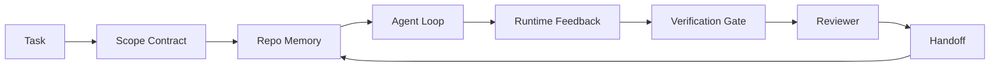

# 智能体工作台工程:能干的模型为什么仍然失败

> 模型能干还不够。可靠的智能体需要一个工作台(workbench):指令、状态、范围、反馈、验证、评审和交接。把这些剥掉,即便是前沿模型,产出的东西也不敢交付。

**类型:** 学习 + 动手构建
**编程语言:** Python(标准库)
**前置要求:** 第 14 阶段 · 01(智能体循环),第 14 阶段 · 26(失效模式)
**预计耗时:** 约 45 分钟

## 学习目标

- 把模型能力与执行可靠性分开
- 说出决定智能体能否交付的七个工作台表面(surface)
- 在一个小仓库任务上,对比纯提示词运行与工作台引导的运行
- 产出一份失效模式报告,把每个缺失的表面映射到它引发的症状

## 问题

你把一个前沿模型丢进真实仓库,让它加输入校验。它打开四个文件,写出貌似合理的代码,宣布成功,然后停了。你一跑测试:两个失败;还有一个被改的文件跟校验毫无关系;没有任何记录说明智能体假设了什么、先试了什么、还剩什么没做。

模型不懂的不是 Python,而是*工作*。它不知道什么算做完、允许写哪里、哪些测试算数、下一个会话该怎么接手。

这不是模型的 bug,是工作台的 bug:智能体周围的表面缺了那些部件,而正是它们把一次性生成变成可靠、可恢复的工程。

## 概念

工作台是任务期间包裹模型的操作环境,它有七个表面:

| 表面 | 承载什么 | 缺失时的失效 |
|---------|-----------------|----------------------|
| 指令(Instructions) | 启动规则、禁止动作、完成定义 | 智能体靠猜理解什么叫交付 |
| 状态(State) | 当前任务、动过的文件、阻塞点、下一步动作 | 每个会话从零重来 |
| 范围(Scope) | 允许的文件、禁止的文件、验收标准 | 修改泄漏到无关代码 |
| 反馈(Feedback) | 捕获进循环的真实命令输出 | 智能体在 400 上宣布成功 |
| 验证(Verification) | 测试、lint、冒烟运行、范围检查 | "看着不错"进了 main |
| 评审(Review) | 用另一个角色的第二遍检查 | 建造者给自己的作业打分 |
| 交接(Handoff) | 改了什么、为什么、还剩什么 | 下个会话重新发现一切 |

工作台独立于模型:你可以换模型、保留这些表面;但你换不掉这些表面、还指望保住可靠性。



循环闭合在状态文件上,而不是聊天历史上。聊天是易失的,仓库才是记录系统(system of record)。

### 工作台 vs 提示词工程

提示词告诉模型*这一轮*你要什么;工作台告诉模型*跨轮次、跨会话*如何工作。大多数智能体失败故事,都是穿着提示词工程外衣的工作台失败。

### 工作台 vs 框架

框架给你运行时(LangGraph、AutoGen、Agents SDK);工作台给智能体一个在运行时内部工作的地方。两个都需要。这个小系列讲的是第二个。

### 从原语推理,而不是从厂商分类法推理

眼下关于"harness 工程"的写作很多:Addy Osmani、OpenAI、Anthropic、LangChain、Martin Fowler、MongoDB、HumanLayer、Augment Code、Thoughtworks、walkinglabs 的 awesome 清单,以及 Medium 和 Hacker News 上接连不断的文章都在谈。他们对 harness 的边界、什么在范围内、用哪套词汇,各执一词。我们不需要选边:七个表面是一个 UX 层;每个工作台底下,都是撑起任何可靠后端的那同一套分布式系统原语。

暂时把"智能体"这个标签撕掉:一次智能体运行,是跨越时间、进程和机器的计算。要让它可靠,你需要的就是任何生产系统都需要的那些原语。

| 原语 | 是什么 | 为智能体承载什么 |
|-----------|------------|------------------------------|
| 函数(Function) | 带类型的处理器,尽可能纯,拥有自己的输入输出 | 一次工具调用、一条规则检查、一步验证、一次模型调用 |
| 工作者(Worker) | 拥有一个或多个函数及生命周期的长命进程 | 建造者、评审者、验证者、一个 MCP 服务器 |
| 触发器(Trigger) | 调用函数的事件源 | 智能体循环滴答、HTTP 请求、队列消息、cron、文件变更、hook |
| 运行时(Runtime) | 决定什么在哪跑、带什么超时和资源的边界 | Claude Code 的进程、LangGraph 的运行时、一个 worker 容器 |
| HTTP / RPC | 调用者与工作者之间的线路 | 工具调用协议、MCP 请求、模型 API |
| 队列(Queue) | 触发器与工作者之间的持久缓冲:背压、重试、幂等 | 任务看板、反馈日志、评审收件箱 |
| 会话持久化(Session persistence) | 活过崩溃、重启、模型更换的状态 | `agent_state.json`、检查点、KV 存储、仓库本身 |
| 授权策略(Authorization policy) | 谁能以什么范围调用哪个函数 | 允许/禁止的文件、批准边界、MCP 能力清单 |

现在把七个工作台表面映射到这些原语上。

- **指令**——策略 + 函数元数据。规则即检查(函数);路由文件(`AGENTS.md`)是挂在运行时启动处的策略。
- **状态**——会话持久化。运行时每一步都读的键值存储:文件、KV 或数据库都行,持久化语义要紧,存储后端不要紧。
- **范围**——按任务的授权策略。允许/禁止的 glob 是一份 ACL;需要批准的动作构成一个权限格。
- **反馈**——写进队列的调用日志。每次 shell 调用都是一条持久、可重放的记录。
- **验证**——一个函数:对输入确定、任务收尾时触发、失败即关闭。
- **评审**——一个独立 worker:对建造者产物只读授权,对评审报告只写授权。
- **交接**——由会话结束触发器发出的持久记录;下个会话的启动触发器读取它。

智能体循环本身也是一个 worker:消费事件(用户消息、工具结果、定时器滴答),调用函数(模型,然后是模型选中的工具),写入记录(状态、反馈),发出触发器(验证、评审、交接)。没什么神秘的——和一个任务处理器同形。

### 流通中的模式,翻译成原语

每个流行的 harness 模式都能归约到这八个原语。翻译表:

| 厂商或社区模式 | 它实际是什么 |
|------------------------------|--------------------|
| Ralph Loop(Claude Code、Codex、agentic_harness 书)——智能体想提前收工时,把原始意图重新注入一个全新的上下文窗口 | 一个用干净上下文把任务重新入队的触发器;会话持久化把目标带下去 |
| Plan / Execute / Verify(PEV) | 三个 worker,每角色一个,经状态和队列在阶段间通信 |
| Harness-compute separation(OpenAI Agents SDK,2026 年 4 月)——控制面与执行面分离 | 重述控制面/数据面之分。比"智能体"这个标签早几十年 |
| Open Agent Passport(OAP,2026 年 3 月)——执行前对照声明式策略为每次工具调用签名并审计 | 由动作前 worker 强制执行的授权策略,加一条签名审计队列 |
| Guides and Sensors(Birgitta Böckeler / Thoughtworks)——前馈规则 + 反馈可观测性 | 授权策略 + 验证函数 + 可观测性链路 |
| 渐进式压缩,5 阶段(Claude Code 逆向,2026 年 4 月) | 一个状态管理 worker,像 cron 一样定期处理会话持久化,把它控制在预算内 |
| Hooks / middleware(LangChain、Claude Code)——拦截模型与工具调用 | 包在运行时调用路径外的触发器 + 函数 |
| Skills 即 Markdown,渐进披露(Anthropic、Flue) | 一个函数注册表,函数元数据按需即时载入上下文 |
| 沙箱智能体(Codex、Sandcastle、Vercel Sandbox) | 计算面:带隔离文件系统、网络和生命周期的运行时 |
| MCP 服务器 | 经稳定 RPC 暴露函数的 worker,以能力清单为授权 |

表里每一条,都是智能体社区走到一个分布式系统里早有名字的原语面前,然后给它起了个新名字。做营销是好标签,做工程词汇没用。

### 收据上实际写了什么

"harness 重于模型"这个主张,如今有数字撑腰了。值得知道,因为它们也是反驳"等更聪明的模型就行"的唯一诚实论据。

- Terminal Bench 2.0——同一个模型,只换 harness,一个编程智能体从 30 名开外升到第 5(LangChain,《Anatomy of an Agent Harness》)。
- Vercel——删掉智能体 80% 的工具,成功率从 80% 跳到 100%(MongoDB)。
- Harvey——法律智能体仅靠 harness 优化,准确率翻倍还多(MongoDB)。
- 88% 的企业 AI 智能体项目走不到生产。失败集中在运行时,而不是推理(preprints.org,《Harness Engineering for Language Agents》,2026 年 3 月)。
- 一项 2025 年跨三个流行开源框架的基准研究报告任务完成率约 50%;长上下文条件下 WebAgent 从 40–50% 崩到 10% 以下,主要死于死循环和目标丢失(2026 年初被多篇报道广泛引用)。

要点不是"harness 永远赢"——模型确实会随时间吸收 harness 的技巧。要点是:今天,承重的工程在模型*周围*,不在模型*里面*;而扛起这份重量的原语,正是每个生产系统从来都需要的那些。

### 厂商文章停在了哪里

这一部分你不必客气。

- LangChain 的《Anatomy of an Agent Harness》列举了十一个组件——提示词、工具、hook、沙箱、编排、记忆、skills、子智能体,还有一个"傻瓜循环"运行时。它没提队列、没提作为部署单元的 worker、没提触发语义、没提作为独立关切的会话持久化、没提授权策略。它把 harness 当作一个你要*配置*的对象,而不是一个你要*部署*的系统。
- Addy Osmani 的《Agent Harness Engineering》立住了 `Agent = Model + Harness` 的框架和 ratchet 模式,但说到 harness 由什么建成就停笔了。读起来是姿态,不是规格。
- Anthropic 和 OpenAI 在表面上走得最深,但都留在自家运行时里。2026 年 4 月 Agents SDK 那篇"harness-compute separation"公告,是第一篇明确背书控制面/数据面分离的厂商文章。那是个原语级的旧思想,不是新东西。
- agentic_harness 书把 harness 当配置对象(Jaymin West《Agentic Engineering》第 6 章),里面最有力的一句是"harness 是智能体系统中的首要安全边界"。那只是授权策略的复述。
- Hacker News 的讨论不断抵达同一个地方:2026 年 4 月的帖子《The agent harness belongs outside the sandbox》主张 harness 应该"更像一个坐在一切之外、按上下文和用户授权访问的 hypervisor"。这依然是把授权策略当作独立平面。

你不必反对这些文章中的任何一篇,也能注意到那个缺口:他们在为一个已经存在的系统写 UX 描述,我们在写这个系统本身。系统建对了,七个表面自然从原语里掉出来;建错了,多少 `AGENTS.md` 的打磨也补不上缺失的队列。

所以当你别处听到"harness engineering",翻回原语:提示词与规则是策略和函数;脚手架是运行时;护栏是授权 + 验证;hook 是触发器;记忆是会话持久化;Ralph Loop 是重新入队;子智能体是 worker;沙箱是计算面。词汇在变,工程不变。工作台是面向智能体的 UX;而能在下一轮厂商话术翻新后幸存下来的那个 harness,是函数、工作者、触发器、运行时、队列、持久化和策略被正确地接在一起。

```figure
wb-seven-surfaces
```

## 动手构建

`code/main.py` 把一个小仓库任务跑两遍:第一遍纯提示词,第二遍接好七个表面。同一个模型,同一个任务。脚本数出失败运行缺了哪些表面,打印失效模式报告。

仓库任务故意做小:给一个单文件 FastAPI 风格处理器加输入校验,并写出一个通过的测试。

运行:

```
python3 code/main.py
```

输出:两次运行的并排日志、一份总结纯提示词运行的 `failure_modes.json`,以及工作台运行的一行结论。

智能体是个极小的规则化桩——重点在表面,不在模型。在这个小系列剩下的课里,你会把每个表面重建成真实、可复用的工件。

## 投入使用

三个地方已经有工作台表面存在,只是没人这么叫:

- **Claude Code、Codex、Cursor。** `AGENTS.md` 和 `CLAUDE.md` 是指令表面;斜杠命令是范围;hook 是验证。
- **LangGraph、OpenAI Agents SDK。** 检查点和会话存储是状态表面;handoff 是交接表面。
- **真实仓库上的 CI。** 测试、lint、类型检查是验证;PR 模板是交接;CODEOWNERS 是评审。

工作台工程这门手艺,就是把这些表面做成显式、可复用的东西,而不是让每个团队各自重新发明一遍。

## 交付

`outputs/skill-workbench-audit.md` 是一个可移植的技能:审计一个现有仓库的七个工作台表面,报告哪些缺失、哪些残缺、哪些健康。把它放到任何智能体配置旁边,它会告诉你先修什么。

## 练习

1. 挑一个你已经在跑智能体的仓库,给七个表面从 0(缺失)到 2(健康)打分。你最弱的表面是哪个?
2. 扩展 `main.py`,让纯提示词运行也产出一个假的"成功"声明。验证闸门本来能抓住它吗?
3. 为你自己的产品加第八个表面。论证为什么它不能并入现有七个之一。
4. 换一个会幻觉出额外文件写入的桩智能体重跑脚本。哪个表面最先抓住它?
5. 把第 14 阶段 · 26 的五种行业高频失效模式映射到七个表面上:每个表面是为吸收哪种模式而设计的?

## 关键术语

| 术语 | 别人的说法 | 实际含义 |
|------|----------------|------------------------|
| 工作台(Workbench) | "那套配置" | 模型周围让工作可靠的工程化表面 |
| 表面(Surface) | "一份文档"或"一个脚本" | 智能体每轮都读或写的、命名的、机器可读的输入 |
| 记录系统(System of record) | "那些笔记" | 聊天历史消失后,智能体当作真相对待的那个文件 |
| 完成定义(Definition of done) | "验收" | 一份智能体伪造不了的、客观的、以文件为凭的检查单 |
| 工作台审计(Workbench audit) | "仓库就绪检查" | 开工前扫一遍七个表面、标出缺失件的过程 |

## 延伸阅读

把这些当作数据点读,别当权威。每一篇都只是部分分类法。决定是否采纳某个概念之前,先把它翻译回原语(函数、工作者、触发器、运行时、HTTP/RPC、队列、持久化、策略)。

厂商框架:

- [Addy Osmani, Agent Harness Engineering](https://addyosmani.com/blog/agent-harness-engineering/)——`Agent = Model + Harness` 与 ratchet 模式;基础设施着墨少
- [LangChain, The Anatomy of an Agent Harness](https://blog.langchain.com/the-anatomy-of-an-agent-harness/)——十一个组件:提示词、工具、hook、编排、沙箱、记忆、skills、子智能体、运行时;漏了队列、部署、授权
- [OpenAI, Harness engineering: leveraging Codex in an agent-first world](https://openai.com/index/harness-engineering/)——Codex 团队视角下的运行时周边表面
- [OpenAI, Unrolling the Codex agent loop](https://openai.com/index/unrolling-the-codex-agent-loop/)——智能体循环归约为一个函数调用上的 `while`
- [Anthropic, Effective harnesses for long-running agents](https://www.anthropic.com/engineering/effective-harnesses-for-long-running-agents)——特定运行时内的长程表面
- [Anthropic, Harness design for long-running application development](https://www.anthropic.com/engineering/harness-design-long-running-apps)——应用设计笔记
- [LangChain Deep Agents harness capabilities](https://docs.langchain.com/oss/python/deepagents/harness)——运行时配置表面

有可用细节的实践者文章:

- [Martin Fowler / Birgitta Böckeler, Harness engineering for coding agent users](https://martinfowler.com/articles/harness-engineering.html)——guides(前馈)+ sensors(反馈);最干净的控制论框架
- [HumanLayer, Skill Issue: Harness Engineering for Coding Agents](https://www.humanlayer.dev/blog/skill-issue-harness-engineering-for-coding-agents)——"不是模型问题,是配置问题"
- [MongoDB, The Agent Harness: Why the LLM Is the Smallest Part of Your Agent System](https://www.mongodb.com/company/blog/technical/agent-harness-why-llm-is-smallest-part-of-your-agent-system)——收据:Vercel 80% 到 100%、Harvey 准确率 2 倍、Terminal Bench 30 名外到第 5
- [Augment Code, Harness Engineering for AI Coding Agents](https://www.augmentcode.com/guides/harness-engineering-ai-coding-agents)——约束先行的走查
- [Sequoia podcast, Harrison Chase on Context Engineering Long-Horizon Agents](https://sequoiacap.com/podcast/context-engineering-our-way-to-long-horizon-agents-langchains-harrison-chase/)——运行时关切优先于模型关切

书籍、论文与参考实现:

- [Jaymin West, Agentic Engineering — Chapter 6: Harnesses](https://www.jayminwest.com/agentic-engineering-book/6-harnesses)——书长度论述,把 harness 当作首要安全边界
- [preprints.org, Harness Engineering for Language Agents (March 2026)](https://www.preprints.org/manuscript/202603.1756)——以控制 / 能动性 / 运行时的学术框架
- [walkinglabs/awesome-harness-engineering](https://github.com/walkinglabs/awesome-harness-engineering)——跨上下文、评估、可观测性、编排的精选书单
- [ai-boost/awesome-harness-engineering](https://github.com/ai-boost/awesome-harness-engineering)——另一份精选清单(工具、eval、记忆、MCP、权限)
- [andrewgarst/agentic_harness](https://github.com/andrewgarst/agentic_harness)——生产可用的参考实现,带 Redis 支撑的记忆与 eval 套件
- [HKUDS/OpenHarness](https://github.com/HKUDS/OpenHarness)——内置个人智能体的开源 agent harness

值得为分歧而非共识去读的 Hacker News 讨论:

- [HN: Effective harnesses for long-running agents](https://news.ycombinator.com/item?id=46081704)
- [HN: Improving 15 LLMs at Coding in One Afternoon. Only the Harness Changed](https://news.ycombinator.com/item?id=46988596)
- [HN: The agent harness belongs outside the sandbox](https://news.ycombinator.com/item?id=47990675)——主张把授权作为独立平面

本课程内部的交叉引用:

- 第 14 阶段 · 23——OpenTelemetry GenAI 约定:sensors 文献指向的那层可观测性
- 第 14 阶段 · 26——七个表面被设计来吸收的那些失效模式目录
- 第 14 阶段 · 27——坐在授权策略原语上的提示词注入防御
- 第 14 阶段 · 29——生产运行时(队列、事件、cron):本课原语在部署中的居所
