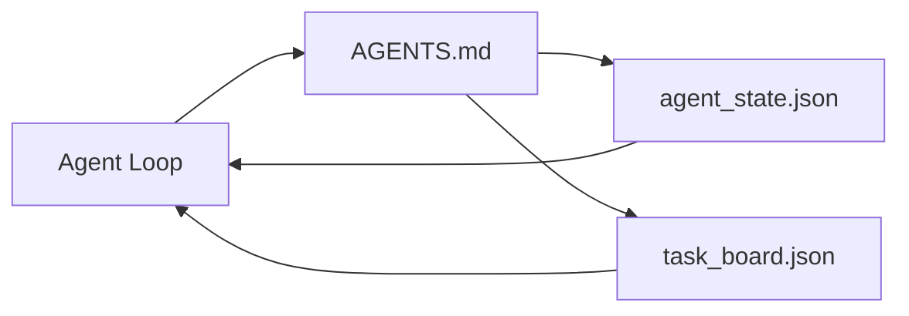

# 最小智能体工作台

> 最小可用的工作台只有三个文件:一个根指令路由、一个状态文件、一个任务看板。其余一切都叠在上面。一个仓库若连这三个文件都承载不了,什么模型也救不了它。

**类型:** 动手构建
**编程语言:** Python(标准库)
**前置要求:** 第 14 阶段 · 31(能干的模型为什么仍然失败)
**预计耗时:** 约 45 分钟

## 学习目标

- 定义构成最小可行工作台的三个文件
- 解释为什么短的根路由胜过长的单块 `AGENTS.md`
- 构建一个智能体每轮可读、收尾可写的状态文件
- 构建一个不依赖聊天历史也能撑过多会话工作的任务看板

## 问题

大多数团队搭工作台的方式,是写一份 3000 行的 `AGENTS.md` 然后宣布完工。模型加载它,忽略掉它概括不了的部分,然后在它一贯失败的那些表面上继续失败。

你需要的是反面:一个极小的根文件,只在相关时把智能体引向更深的文件;智能体行动前必读、行动后必写的持久状态;一块说明什么在进行、什么被阻塞、什么排接下来的任务看板。

三个文件,各有分工,每个都机器可读,日后都能演化成真正的系统。

## 概念



### AGENTS.md 是路由,不是说明书

好的 `AGENTS.md` 很短。它把智能体指向:

- 状态文件(你在哪)。
- 任务看板(还剩什么)。
- 更深的规则(`docs/agent-rules.md` 下)。
- 验证命令(怎么知道成了)。

更长的内容放进更深的文档,需要时才加载。长说明书会被无视,短路由会被遵循。

### agent_state.json 是记录系统

状态承载:进行中的任务 id、动过的文件、做过的假设、阻塞点和下一步动作。智能体每轮读它;下个会话读它,而不是重放聊天记录。

状态住在文件里,因为聊天历史不可靠:会话会死,对话会被裁剪,文件不会。

### task_board.json 是队列

任务看板承载所有任务,状态为 `todo | in_progress | done | blocked`。状态为空时,智能体从这里领活;你想知道智能体在不在轨道上时,读的也是它。

看板上的一个任务有 id、目标、属主(`builder`、`reviewer` 或 `human`)和验收标准。看板故意做小:当它长到超过一屏,那是你的规划出了问题,不是看板的问题。

### 三个文件是地板,不是天花板

后面的课会加范围契约、反馈运行器、验证闸门、评审清单和交接包。这里的三个文件,是它们全都依赖的前提。

```figure
wb-three-files
```

## 动手构建

`code/main.py` 把最小工作台写进一个空仓库,并演示一个智能体轮次:

1. 读 `agent_state.json`。
2. 状态为空时,从 `task_board.json` 领下一个任务。
3. 在范围内动一个文件。
4. 写回更新后的状态。

运行:

```
python3 code/main.py
```

脚本在自身旁边创建 `workdir/`,铺好三个文件,跑一轮,打印 diff。再跑一次,看第二轮如何接上第一轮停下的地方。

## 投入使用

生产智能体产品里,同样的三个文件以不同名字出现:

- **Claude Code:** `AGENTS.md` 或 `CLAUDE.md` 是路由,`.claude/state.json` 式存储是状态,hook 是看板。
- **Codex / Cursor:** workspace rules 是路由,会话记忆是状态,聊天侧栏的排队任务是看板。
- **自定义 Python 智能体:** 就是你刚写的那三个文件。

名字在变,形状不变。

## 野外的生产模式

最小工作台要在真实 monorepo 里活下来,需要往上叠三个模式。它们相互独立,挑你仓库真正需要的。

**嵌套 `AGENTS.md`,就近优先。** OpenAI 在主仓库里放了 88 个 `AGENTS.md`,每个子组件一个。Codex、Cursor、Claude Code 和 Copilot 都从工作文件向仓库根目录走,把沿途找到的每个 `AGENTS.md` 拼起来:子目录文件扩展根文件。Codex 另有 `AGENTS.override.md` 用于替换而非扩展——override 机制是 Codex 专属,跨工具协作时避开它。Augment Code 的实测才是金句:最好的 `AGENTS.md` 带来的质量跃升相当于从 Haiku 升级到 Opus;最差的让输出比没有文件还糟。

**即便看起来像覆盖了也要拒绝的反模式。** 冲突的指令会静默地把智能体从交互模式打成贪心模式(ICLR 2026 AMBIG-SWE:解决率 48.8% → 28%)——要给优先级编号,而不是平铺。无法验证的风格规则("遵循 Google Python 风格指南")又没有执行命令,只会让智能体虚构合规——每条风格规则都配上确切的 lint 命令。先写风格后写命令会埋掉验证路径——命令在前,风格在后。为人类而不是为智能体写作会浪费上下文预算——简洁是特性。

**跨工具符号链接。** 一个根文件加符号链接(`ln -s AGENTS.md CLAUDE.md`、`ln -s AGENTS.md .github/copilot-instructions.md`、`ln -s AGENTS.md .cursorrules`),让每个编程智能体共享同一事实来源。Nx 的 `nx ai-setup` 能从一份配置自动为 Claude Code、Cursor、Copilot、Gemini、Codex 和 OpenCode 生成这些。

## 交付

`outputs/skill-minimal-workbench.md` 为任何新仓库生成三文件工作台:针对项目调优的 `AGENTS.md` 路由、键位正确的 `agent_state.json`,以及预填当前待办的 `task_board.json`。

## 练习

1. 给 `agent_state.json` 加 `last_run` 时间戳:文件超过 24 小时,除非运维确认,否则拒绝运行。
2. 给任务看板加 `priority` 字段,把领活逻辑改成永远取优先级最高的 `todo`。
3. 把 `task_board.json` 迁到 JSON Lines:每任务一行,版本控制里的 diff 更干净。
4. 写一个 `lint_workbench.py`:`AGENTS.md` 超过 80 行,或引用了不存在的文件,就失败。
5. 决定三个文件里丢了哪个最疼。为它辩护。

## 关键术语

| 术语 | 别人的说法 | 实际含义 |
|------|----------------|------------------------|
| 路由(Router) | `AGENTS.md` | 把智能体指向更深文档与文件的短根文件 |
| 状态文件(State file) | "那些笔记" | 记录智能体位置的机器可读文件,每轮写入 |
| 任务看板(Task board) | "那个待办" | 带状态、属主、验收标准的工作 JSON 队列 |
| 记录系统(System of record) | "事实来源" | 聊天消失后,工作台当作权威对待的那个文件 |

## 延伸阅读

- [agents.md — the open spec](https://agents.md/)——已被 Cursor、Codex、Claude Code、Copilot、Gemini、OpenCode 采纳
- [Augment Code, A good AGENTS.md is a model upgrade. A bad one is worse than no docs at all](https://www.augmentcode.com/blog/how-to-write-good-agents-dot-md-files)——实测的质量跃升
- [Blake Crosley, AGENTS.md Patterns: What Actually Changes Agent Behavior](https://blakecrosley.com/blog/agents-md-patterns)——经验上什么有效、什么无效
- [Datadog Frontend, Steering AI Agents in Monorepos with AGENTS.md](https://dev.to/datadog-frontend-dev/steering-ai-agents-in-monorepos-with-agentsmd-13g0)——实践中的嵌套优先级
- [Nx Blog, Teach Your AI Agent How to Work in a Monorepo](https://nx.dev/blog/nx-ai-agent-skills)——一份配置生成六个工具
- [The Prompt Shelf, AGENTS.md Best Practices: Structure, Scope, and Real Examples](https://thepromptshelf.dev/blog/agents-md-best-practices/)——经得起评审的章节排序
- [Anthropic, Claude Code subagents](https://code.claude.com/docs/en/sub-agents)
- 第 14 阶段 · 31——这个最小工作台要吸收的失效模式
- 第 14 阶段 · 34——本课预告的持久状态 schema
