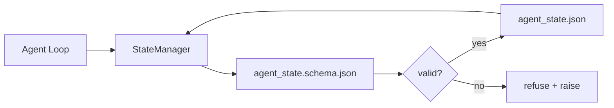

# 仓库记忆与持久状态

> 聊天历史是易失的,仓库是持久的。工作台把智能体状态存进纳入版本管理的文件,让下一个会话、下一个智能体、下一个评审者,都读同一个事实来源。

**类型:** 动手构建
**编程语言:** Python(标准库 + 可选 `jsonschema`)
**前置要求:** 第 14 阶段 · 32(最小工作台)
**预计耗时:** 约 60 分钟

## 学习目标

- 界定什么属于仓库记忆,什么属于聊天历史
- 为 `agent_state.json` 和 `task_board.json` 编写 JSON Schema
- 构建一个能原子地加载、校验、修改、持久化状态的状态管理器
- 用 schema 在坏写入腐蚀工作台之前拒绝它们

## 问题

智能体结束一个会话,聊天关闭。下个会话打开,问从哪开始。模型说"我看看文件",读到陈旧笔记,把已完成的工作重做一遍。更糟的是,它重写完一个已完成的文件——因为没人告诉它那个文件已经完成了。

工作台的修法是仓库记忆:状态住在仓库里的 JSON 文件中,按 schema 写入,原子持久化,在代码评审里 diff 友好。聊天是转瞬即逝的订阅流,仓库才是记录系统。

## 概念



### 什么属于仓库记忆

| 属于 | 不属于 |
|---------|-----------------|
| 进行中的任务 id | 原始聊天记录 |
| 本会话动过的文件 | token 级推理轨迹 |
| 智能体做过的假设 | "用户好像有点不耐烦" |
| 未决的阻塞点 | 采样出的补全文本 |
| 下一步动作 | 厂商特定的模型 id |

测试标准是耐久性:三个月后,在 CI 重跑里它还有用吗?有,进仓库;没有,进遥测。

### Schema 先行的状态

JSON Schema 是契约。没有它,每个智能体都发明新字段,每个评审者都要学一种新形状,每个 CI 脚本都得给历史版本写特例。有了它,坏写入就是被拒绝的写入。

schema 覆盖:

- 必需键。
- 允许的 `status` 值。
- 禁止值(如数组为 `null`)。
- 模式约束(任务 id 匹配 `T-\d{3,}`)。
- 用于迁移的 version 字段。

### 原子写入

状态写入要扛得住部分失败:写临时文件、fsync、重命名覆盖目标。状态文件是事实来源——写了一半的文件,比没有文件还糟。

### 迁移

schema 变更时,随 schema 升级一起交付迁移脚本。状态文件携带 `schema_version` 字段;管理器拒绝加载它无法迁移的版本。

```figure
wb-state-persist
```

## 动手构建

`code/main.py` 实现:

- `agent_state.schema.json` 和 `task_board.schema.json`。
- 一个纯标准库校验器(JSON Schema 子集:required、type、enum、pattern、items)。
- 带临时文件-重命名原子写入的 `StateManager.load`、`StateManager.update`、`StateManager.commit`。
- 一个演示:修改状态、持久化、重新加载,证明往返一致。

运行:

```
python3 code/main.py
```

脚本写出 `workdir/agent_state.json` 和 `workdir/task_board.json`,跨两轮修改它们,并在每步打印校验后的状态。

## 野外的生产模式

四个模式,把本课的最小实现变成多智能体 monorepo 扛得住的东西。

**原子临时文件-重命名不是可选项。** 2026 年 3 月 Hive 项目的一份 bug 报告把这个失效模式记得很干净:`state.json` 用 `write_text()` 写入,异常被捕获并吞掉。部分写入让会话对着损坏的状态恢复,毫无信号。修法永远是:在目标同目录 `tempfile.mkstemp`、写入、`fsync`、`os.replace`(POSIX 和 Windows 上都是原子重命名)。本课的 `atomic_write` 做的正是这件事。

**给每个非幂等工具调用配幂等键。** 如果智能体在调用工具之后、把结果写进检查点之前崩溃,恢复时会重试这次工具调用:对读操作安全,对发邮件、数据库插入、文件上传危险。模式:执行前把每个工具调用 ID 记进 `pending_calls.jsonl`;重试时先查 ID,存在就跳过调用、用缓存结果。Anthropic 和 LangChain 在 2026 年指南中都点名了它;LangGraph 的检查点器持久化 pending writes 也是同理。

**大工件与状态分离。** 别把 CSV、长转录、生成的文件塞进 `agent_state.json`。工件另存为单独文件(或传到对象存储),状态里只留路径。检查点保持小巧快速,工件独立长大。

**事件溯源做审计,快照做恢复。** 每次修改追加一条事件日志(`state.events.jsonl`),定期快照到 `state.json`:恢复时读快照,再重放快照时间戳之后的事件。磁盘代价更高,但能让你逐字重放智能体的决策——调试长程运行时必不可少。形状与 Postgres 内部的 WAL 相同。

**schema 迁移,否则拒绝加载。** `schema_version` 整数就是契约:管理器读到未知版本的文件就拒绝。迁移脚本随 schema 升级一起交付;`tools/migrate_state.py` 在每次启动时幂等运行。

## 投入使用

生产中:

- **LangGraph 检查点器。** 同一个思想,换个存储:把图状态持久化到 SQLite、Postgres 或自定义后端。本课教的 schema,是检查点器挂了、你需要徒手读状态时够得着的东西。
- **Letta 记忆块。** 带结构化 schema 的持久块(第 14 阶段 · 08),同一套纪律,作用于长命人设。
- **OpenAI Agents SDK 会话存储。** 可插拔后端,感知 schema。本课的状态文件就是它的本地文件后端。

## 交付

`outputs/skill-state-schema.md` 生成项目专属的 JSON Schema 对(状态 + 看板)、一个接好原子写入的 Python `StateManager`,以及一个迁移脚手架——让下一次 schema 升级不再弄坏工作台。

## 练习

1. 加 `last_human_touch` 时间戳:人类编辑后 5 秒内的任何智能体写入一律拒绝。
2. 扩展校验器支持 `oneOf`:任务可以是构建任务或评审任务,各有不同的必需字段。
3. 加 `schema_version` 字段,写出 v1 到 v2 的迁移(把 `blockers` 改名 `risks`)。
4. 把存储后端从本地文件换成 SQLite,保持 `StateManager` API 不变。
5. 让两个智能体对同一个状态文件制造 50ms 写入竞态。会出什么问题?原子重命名如何救你?

## 关键术语

| 术语 | 别人的说法 | 实际含义 |
|------|----------------|------------------------|
| 仓库记忆(Repo memory) | "笔记文件" | 按 schema 存在仓库受跟踪文件中的状态 |
| Schema 先行(Schema-first) | "校验输入" | 先定契约再写,拒绝漂移 |
| 原子写入(Atomic write) | "重命名而已" | 写临时文件、fsync、重命名,让部分失败无法造成腐蚀 |
| 迁移(Migration) | "schema 升级" | 把 vN 状态变成 v(N+1) 状态的脚本 |
| 记录系统(System of record) | "事实来源" | 工作台当作权威对待的那个工件 |

## 延伸阅读

- [JSON Schema specification](https://json-schema.org/specification.html)
- [LangGraph checkpointers](https://langchain-ai.github.io/langgraph/concepts/persistence/)
- [Letta memory blocks](https://docs.letta.com/concepts/memory)
- [Fast.io, AI Agent State Checkpointing: A Practical Guide](https://fast.io/resources/ai-agent-state-checkpointing/)——schema 先行、带幂等的检查点
- [Fast.io, AI Agent Workflow State Persistence: Best Practices 2026](https://fast.io/resources/ai-agent-workflow-state-persistence/)——并发控制、TTL、事件溯源
- [Hive Issue #6263 — non-atomic state.json writes silently ignored](https://github.com/aden-hive/hive/issues/6263)——真实项目中的这个失效模式
- [eunomia, Checkpoint/Restore Systems: Evolution, Techniques, Applications](https://eunomia.dev/blog/2025/05/11/checkpointrestore-systems-evolution-techniques-and-applications-in-ai-agents/)——OS 史上的 CR 原语应用到智能体
- [Indium, 7 State Persistence Strategies for Long-Running AI Agents in 2026](https://www.indium.tech/blog/7-state-persistence-strategies-ai-agents-2026/)
- [Microsoft Agent Framework, Compaction](https://learn.microsoft.com/en-us/agent-framework/agents/conversations/compaction)——厂商的检查点管理器
- 第 14 阶段 · 08——记忆块与睡眠时计算
- 第 14 阶段 · 32——本课为之立 schema 的三文件最小集
- 第 14 阶段 · 40——读同一个 schema 的交接包
