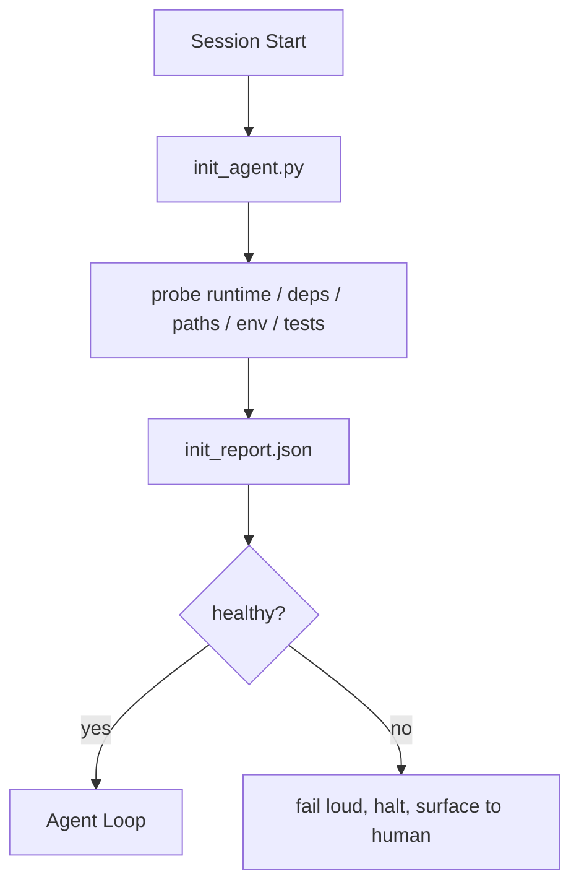

# 智能体初始化脚本

> 每个冷启动的会话都要交一笔税:智能体读同样的文件、重试同样的探测、重新发现同样的路径。初始化脚本把这笔税一次交清,把答案写进状态。

**类型:** 动手构建
**编程语言:** Python(标准库)
**前置要求:** 第 14 阶段 · 32(最小工作台),第 14 阶段 · 34(仓库记忆)
**预计耗时:** 约 45 分钟

## 学习目标

- 识别智能体永远不该在每个会话重做的那类工作
- 构建一个探测运行时、依赖和仓库健康状况的确定性初始化脚本
- 把探测结果持久化,让智能体读结果而不是重跑检查
- 初始化失败时,大声、快速、在唯一的地方报错

## 问题

打开一个会话。智能体猜 Python 版本、猜测试命令、把仓库根目录列了五遍才找到入口、试着 import 一个没装的包、问用户配置文件在哪。等它真正开始改代码,上万 token 已经花在了本该一个脚本搞定的准备工作上。

修法是:在智能体动手之前先跑一个初始化脚本,写出一份智能体启动时读取的 `init_report.json`。

## 概念



### 初始化脚本探测什么

| 探测 | 为什么重要 |
|-------|----------------|
| 运行时版本 | Python 或 Node 版本不对,意味着静默的错误版本 bug |
| 依赖可用性 | 现在抓到一个缺失的包,代价是之后才发现的十分之一 |
| 测试命令 | 智能体必须知道怎么验证;命令缺失意味着工作台是坏的 |
| 仓库路径 | 硬编码路径会漂移;解析一次,钉住 |
| 环境变量 | 缺 `OPENAI_API_KEY` 是一个失败面,不是运行时悬案 |
| 状态 + 看板新鲜度 | 崩溃会话留下的陈旧状态是个脚枪 |
| 最近已知良好提交 | 会话结束时交接 diff 的锚点 |

### 大声失败、快速失败、在一处失败

探测失败意味着停下并报给人类。没有"智能体自己会搞定的"——初始化的全部意义,就是在工作台坏掉时拒绝开工。

### 幂等

连跑两次:第二次除时间戳外应该是无操作。幂等让你能把这个脚本接进 CI、hook 或任务前的斜杠命令。

### 初始化 vs 启动规则

规则(第 14 阶段 · 33)描述行动前什么必须为真;初始化是确立"这些规则可以被检查"的那个脚本。有规则无初始化,规则退化成"要小心";有初始化无规则,得到的只是一次精致的失败。

```figure
wb-init-probes
```

## 动手构建

`code/main.py` 实现了 `init_agent.py`:

- 五个探测:Python 版本、经 `importlib.util.find_spec` 列出的依赖、测试命令可解析性、必需环境变量、状态文件新鲜度。
- 每个探测返回 `(name, status, detail)`。
- 脚本写出含全部探测结果的 `init_report.json`,任何一个 block 级探测失败就以非零码退出。

运行:

```
python3 code/main.py
```

脚本打印探测表格、写出 `init_report.json`,顺利路径退出码为 0,否则非零并列出失败的探测。

## 野外的生产模式

三个模式,把有用的初始化脚本和走形式的仪式分开。

**最近已知良好提交锚定。** 拿当前提交与上次成功合并时写入的 `LKG` 文件对比:diff 超过预算(默认 50 个文件)就拒绝开工,要人类批准新基线。Cloudflare 的 AI Code Review 正是用它给评审智能体定界:每个评审会话锚定同一个最近已知良好,跨会话不累计漂移。

**带 TTL 的锁文件。** 首次探测全过后写一份 `prereqs.lock`:之后 N 小时(默认 24)内的运行信任锁文件,跳过昂贵探测。初始化脚本先读锁:新鲜且依赖清单哈希匹配,就短路跳过。这与 Docker 的层缓存同型:幂等探测 + 内容哈希 = 跳过。

**热路径上:无网络、无 LLM、无意外。** 初始化探测是确定性的管道工活。一个要调 LLM 给失败分类、或要打外部服务查许可证的探测不是探测,是工作流。干跑一次探测超过三秒,就当工作台异味处理:要么挪出初始化,要么缓存其结果。

## 投入使用

生产中:

- **Claude Code hooks。** `pre-task` hook 调用初始化脚本,失败就拒绝启动智能体。
- **GitHub Actions。** 一个 `setup-agent` job 跑初始化脚本;智能体 job 依赖它。
- **Docker entrypoint。** 智能体容器在 exec 智能体运行时之前先跑初始化脚本,失败时日志浮出水面。

初始化脚本可移植,因为它不调用任何特定框架。Bash、Make 或任务文件都能包它。

## 交付

`outputs/skill-init-script.md` 访谈项目,把它的准备工作归类成探测,产出项目专属的 `init_agent.py` 和一份在任何智能体步骤之前运行它的 CI 工作流。

## 练习

1. 加一个探测:对比当前提交与最近已知良好提交,改动超过 50 个文件就拒绝开工。
2. 让脚本写 `prereqs.lock` 文件,锁超过七天就拒绝开工。
3. 加 `--fix` 旗标:自动安装缺失的开发依赖,但未经批准绝不改动运行时依赖。
4. 把探测从硬编码函数迁到 YAML 注册表。为这个取舍辩护。
5. 给每个探测加时间预算:超过三秒的探测视为工作台异味。

## 关键术语

| 术语 | 别人的说法 | 实际含义 |
|------|----------------|------------------------|
| 探测(Probe) | "一项检查" | 返回 `(name, status, detail)` 的确定性函数 |
| 初始化报告(Init report) | "设置输出" | 写在状态旁边、装着探测结果的 JSON |
| 幂等(Idempotent) | "重跑安全" | 连跑两次,除时间戳外报告完全相同 |
| 大声失败(Fail loud) | "别吞掉" | 停下并报给人类;没有静默兜底 |
| 准备税(Setup tax) | "引导成本" | 智能体每个会话重新发现显而易见之事所花的 token |

## 延伸阅读

- [Anthropic, Effective harnesses for long-running agents](https://www.anthropic.com/engineering/effective-harnesses-for-long-running-agents)
- [GitHub Actions, composite actions for setup](https://docs.github.com/en/actions/sharing-automations/creating-actions/creating-a-composite-action)
- [microservices.io, GenAI dev platform: guardrails](https://microservices.io/post/architecture/2026/03/09/genai-development-platform-part-1-development-guardrails.html)——pre-commit + CI 检查即初始化
- [Augment Code, How to Build Your AGENTS.md (2026)](https://www.augmentcode.com/guides/how-to-build-agents-md)——初始化预期
- [Codex Blog, Codex CLI Context Compaction](https://codex.danielvaughan.com/2026/03/31/codex-cli-context-compaction-architecture/)——会话启动即感知压缩的初始化
- 第 14 阶段 · 33——这个脚本所支撑的规则集
- 第 14 阶段 · 34——这个脚本所播种的状态文件
- 第 14 阶段 · 38——初始化脚本喂给的验证闸门
- 第 14 阶段 · 40——消费初始化报告里最近已知良好的交接
