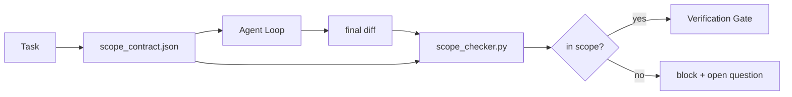

# 范围契约与任务边界

> 模型不知道工作在哪里结束。范围契约是一个按任务存放的文件,写明工作从哪里开始、在哪里结束、溢出时如何回滚。契约把"待在范围内"从愿望变成检查。

**类型:** 动手构建
**编程语言:** Python(标准库)
**前置要求:** 第 14 阶段 · 32(最小工作台),第 14 阶段 · 33(规则即约束)
**预计耗时:** 约 50 分钟

## 学习目标

- 写出智能体在任务开始时读、验证者在任务结束时读的范围契约
- 规定允许的文件、禁止的文件、验收标准、回滚计划和批准边界
- 实现一个把 diff 与契约对比、标记违规的范围检查器
- 让范围蔓延可见、自动、可评审

## 问题

智能体会蔓延。任务是"修登录 bug",diff 却动了登录路由、邮件助手、数据库驱动、README 和发布脚本。每一处改动当下都有貌似合理的理由,合在一起,却不是被评审过的那个改动了。

范围蔓延是智能体工作中最缺乏监控的失效模式,因为智能体总是善意地叙述每一步。解法不是更严的提示词,而是磁盘上的一份契约写明承诺了什么,加上一个把结果与承诺对比的检查。

## 概念



### 范围契约里写什么

| 字段 | 用途 |
|-------|---------|
| `task_id` | 关联看板上的任务 |
| `goal` | 评审者能核验的一句话 |
| `allowed_files` | 智能体可以写的 glob |
| `forbidden_files` | 智能体即便意外也不得碰的 glob |
| `acceptance_criteria` | 证明完成的测试命令或断言行 |
| `rollback_plan` | 需要中止时,运维可执行的一段落 |
| `approvals_required` | 范围之外、需要人类明确签字批准的动作 |

没有 `forbidden_files` 的契约是不完整的:负空间是契约的一半。

### 用 glob,不用裸路径

真实仓库会移动文件。把契约钉在 glob 上(`app/**/*.py`、`tests/test_signup*.py`),这样会话之间的一次重构不会让契约失效。

### 回滚是范围的一部分

写明如何回滚,会逼着契约作者思考什么可能出错。一份无法回滚的契约,就是一份不该批准的契约。

### 范围检查是 diff 检查

智能体写出 diff;检查器读 diff、允许的 glob、禁止的 glob,以及跑过的验收命令清单。每个违规都是一条带标签的发现,验证闸门可以凭它拒绝。

### 两个高度的范围:特性清单与任务契约

范围契约约束的是一个任务,不是一个项目。智能体可以完美地待在登录修复的契约里,然后下一轮就决定项目还需要一个设置页、一个暗色模式开关和一次路由重写。契约从未被问过"项目的哪些工作在范围内",它只回答"任务的哪些文件在范围内"。

第二个高度需要自己的原语:智能体在会话开始时读取的 `feature_list.json`。它是机器可读、有序的项目待办清单:智能体恰好挑选一个 `status` 为 `todo` 的特性,把它的 `id` 写进当前范围契约,并被禁止在同一会话开始第二个特性。"一次一个特性"不再是提示词里一句可以被智能体合理化绕开的话,而是它从磁盘读到的值,和闸门强制执行的检查。

```json
{
  "project": "knowledge-base",
  "active": "import-pdf",
  "features": [
    { "id": "import-pdf",   "status": "in_progress", "goal": "import a PDF into the library",        "done_when": "pytest tests/test_import.py && a sample PDF appears in the library view" },
    { "id": "full-text-search", "status": "todo",     "goal": "search document text and rank hits",   "done_when": "query returns ranked results with snippets" },
    { "id": "cite-answers", "status": "todo",         "goal": "answers carry source citations",        "done_when": "every answer renders at least one clickable citation" }
  ]
}
```

| 字段 | 用途 |
|-------|---------|
| `active` | 当前会话唯一可碰的特性;为空表示挑一个并设置它 |
| `features[].id` | 范围契约 `task_id` 指向的稳定 slug |
| `features[].status` | `todo`、`in_progress`、`done`、`blocked`;同时最多一个 `in_progress` |
| `features[].goal` | 评审者能核验的一句话 |
| `features[].done_when` | 把 `in_progress` 翻转为 `done` 的验收行 |

两条规则让清单承重而不是装饰。第一,"最多一个 `in_progress`"这条不变量本身就是一项启动检查(第 14 阶段 · 33):清单里出现两个,会话拒绝开工,直到人类解决。第二,特性清单是文件,不是聊天消息——聊天会滚出上下文,文件会跨会话、跨智能体存续。交接(第 14 阶段 · 40)把完成特性的状态写回 `done`,让下个会话打开时看到准确的看板,而不是重新推导还剩什么。

契约与清单按最小特权组合,即下文所述的合并规则:任务契约的 `allowed_files` 必须落在当前特性所触及的范围内,绝不越界。

```figure
wb-scope-bounce
```

## 动手构建

`code/main.py` 实现:

- `scope_contract.json` schema(JSON Schema 子集,glob 数组)。
- 一个 diff 解析器:把触碰文件清单和跑过的命令清单转成 `RunSummary`。
- 一个 `scope_check`:对照契约返回 `(violations, in_scope, off_scope)`。
- 两个演示运行:一个待在范围内,一个蔓延。检查器用确切的文件和原因标出蔓延。

运行:

```
python3 code/main.py
```

输出:契约、两次运行、逐次裁决,以及保存的 `scope_report.json`。

## 野外的生产模式

一位实践者在用"specsmaxxing"(调智能体之前先写 YAML 范围契约)后报告:不改变智能体,三周内地鼠洞(rabbit-hole)率从 52% 降到 21%。干活的是契约,不是模型。三个模式让收益站稳。

**违规预算,不是二元失败。** `agent-guardrails`(Claude Code、Cursor、Windsurf、Codex 经 MCP 使用的 OSS 合并闸门)为每个任务提供 `violationBudget`:预算内的轻微范围越界只报警告;超出预算,合并闸门才拒绝。搭配 `violationSeverity: "error" | "warning"`。预算,是一道能上线的闸门和一道被讨厌它的团队关掉的闸门之间的差别。

**按路径家族的严重级不对称。** 越界写入 `docs/**` 通常是 `warn`;越界写入 `scripts/**`、`migrations/**`、`config/prod/**` 永远是 `block`。这种不对称必须住在契约里,而不是运行时里——它是项目特定的,而且随任务变化。

**文件预算旁边再放时间与网络预算。** `time_budget_minutes` 字段约束墙钟时间,超时后未经重新批准,运行时拒绝继续。`network_egress` 主机名白名单,防止智能体悄悄访问任务之外的外部 API。这些也是范围维度——文件 glob 是必要的,不是充分的。

**多契约合并语义(最小特权)。** 两份范围契约同时适用时(如项目级契约加任务级契约),合并规则:`allowed_files` 取**交集**(两份都必须允许该路径);`forbidden_files` 取**并集**(任一禁止即禁止);`time_budget_minutes` 取最严(min);`approvals_required` 累加。`network_egress` 为 `None` 表示不强制,`[]` 表示全拒,`[...]` 为白名单;合并时 `None` 让位给另一方,两个清单取交集,全拒保持全拒。把这些写进契约 schema,让合并过程机械化、可评审。

## 投入使用

生产模式:

- **Claude Code 斜杠命令。** `/scope` 命令写出契约并钉为会话上下文;子智能体行动前先读契约。
- **GitHub PR。** 契约作为 JSON 文件放进 PR 正文或作为入库工件;CI 对合并 diff 跑范围检查器。
- **LangGraph interrupts。** 范围违规触发 interrupt;处理器问人类:契约该扩大,还是智能体该收手。

契约随任务同行。任务关闭时,契约归档到 `outputs/scope/closed/` 下。

## 交付

`outputs/skill-scope-contract.md` 为一段任务描述生成范围契约,以及一个在 CI 中对每次智能体 diff 运行的 glob 感知检查器。

## 练习

1. 加 `network_egress` 字段,列出允许的外部主机:触碰其他主机的运行一律拒绝。
2. 扩展检查器:对 `docs/**` 软失败,对 `scripts/**` 硬失败。为这种不对称辩护。
3. 让契约用静态规则集(不用 LLM)从 `goal` 字段推导 `allowed_files`。第一个边缘情况会出什么问题?
4. 加 `time_budget_minutes`,墙钟超时即拒绝继续。
5. 对同一个 diff 应用两份契约。两者同时适用时,正确的合并语义是什么?

## 关键术语

| 术语 | 别人的说法 | 实际含义 |
|------|----------------|------------------------|
| 范围契约(Scope contract) | "任务简报" | 按任务的 JSON,列出允许/禁止文件、验收、回滚 |
| 范围蔓延(Scope creep) | "它还顺手动了……" | 同一任务里改动了契约之外的文件 |
| 回滚计划(Rollback plan) | "我们能还原" | 中止时运维用的一段落 runbook |
| 批准边界(Approval boundary) | "需要签字" | 契约中列为需要人类明确批准的动作 |
| diff 检查(Diff check) | "路径审计" | 把触碰的文件与契约 glob 对比 |

## 延伸阅读

- [LangGraph human-in-the-loop interrupts](https://langchain-ai.github.io/langgraph/concepts/human_in_the_loop/)
- [OpenAI Agents SDK tool approval policies](https://platform.openai.com/docs/guides/agents-sdk)
- [logi-cmd/agent-guardrails — merge gates and scope validation](https://github.com/logi-cmd/agent-guardrails)——违规预算、严重级分层
- [Dev|Journal, Preventing AI Agent Configuration Drift with Agent Contract Testing](https://earezki.com/ai-news/2026-05-05-i-built-a-tiny-ci-tool-to-keep-ai-agent-configs-from-drifting-in-my-repo/)——无外部依赖的 `--strict` 模式
- [Agentic Coding Is Not a Trap (production logs)](https://dev.to/jtorchia/agentic-coding-is-not-a-trap-i-answered-the-viral-hn-post-with-my-own-production-logs-33d9)——specsmaxxing 收据:52% → 21%
- [OpenCode permission globs](https://opencode.ai/docs/agents/)——细粒度的按权限范围
- [Knostic, AI Coding Agent Security: Threat Models and Protection Strategies](https://www.knostic.ai/blog/ai-coding-agent-security)——范围作为最小特权的一部分
- [Augment Code, AI Spec Template](https://www.augmentcode.com/guides/ai-spec-template)——三层边界体系(must/ask/never)
- 第 14 阶段 · 27——与范围锁搭配的提示词注入防御
- 第 14 阶段 · 33——本契约为每个任务具体化的规则集
- 第 14 阶段 · 38——检查器汇报给的验证闸门
