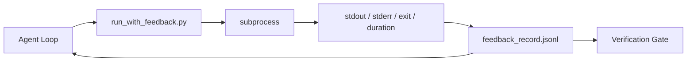

# 运行时反馈循环

> 看不到真实命令输出的智能体只能靠猜。反馈运行器把 stdout、stderr、退出码和耗时捕获成结构化记录,供下一轮读取。从此,智能体对事实作出反应,而不是对它自己预测的事实作出反应。

**类型:** 动手构建
**编程语言:** Python(标准库)
**前置要求:** 第 14 阶段 · 32(最小工作台),第 14 阶段 · 35(初始化脚本)
**预计耗时:** 约 50 分钟

## 学习目标

- 区分运行时反馈与可观测性遥测
- 构建一个包裹 shell 命令并持久化结构化记录的反馈运行器
- 确定性地截断过大的输出,让循环保持在 token 预算内
- 反馈缺失时,拒绝推进循环

## 问题

智能体说"现在跑测试",下一条消息说"全部通过"。现实是:根本没有测试跑过——智能体想象了输出;或者它跑了命令却从没读结果;或者它读了结果,却悄悄截断了失败的那一行。

反馈运行器堵上这个缺口:每个命令都过运行器;每条记录都携带命令、捕获的 stdout 和 stderr、退出码、墙钟时长,以及一行智能体备注。智能体下一轮读这条记录;验证闸门在任务结束时读所有记录。

## 概念



### 反馈记录里放什么

| 字段 | 为什么重要 |
|-------|----------------|
| `command` | 精确的 argv,没有 shell 展开的意外 |
| `stdout_tail` | 最后 N 行,确定性截断 |
| `stderr_tail` | 最后 N 行,与 stdout 分开 |
| `exit_code` | 毫不含糊的成功信号 |
| `duration_ms` | 让慢探测和失控进程现形 |
| `started_at` | 供重放的时间戳 |
| `agent_note` | 智能体写下的、关于它预期什么的一行 |

### 截断是确定性的

一份 50MB 的日志会毁掉循环。运行器截头截尾,中间留 `...truncated N lines...` 标记——确定性意味着同样的输出永远产生同样的记录。不采样:智能体需要看的部分(最后的错误、最后的摘要)都在尾部。

### 反馈 vs 遥测

遥测(第 14 阶段 · 23,OTel GenAI 约定)是给跨时间评审运行的人类运维看的;反馈是给*本次运行*的下一轮看的。两者字段有重叠,但住在不同文件里,保留策略也不同。

### 没有反馈,拒绝前进

如果运行器在捕获退出码之前就出错,记录会带 `exit_code: null` 和 `error: <reason>`。智能体循环必须拒绝在 `null` 退出码上宣称成功:没有退出码,就没有进展。

```figure
wb-feedback-loop
```

## 动手构建

`code/main.py` 实现:

- `run_with_feedback(command, agent_note)`:包裹 `subprocess.run`,捕获 stdout/stderr/exit/duration,确定性截断,追加到 `feedback_record.jsonl`。
- 一个小加载器,把 JSONL 流式读成 Python 列表。
- 一个演示:跑三个命令(成功、失败、慢速),打印每个命令的最后一条记录。

运行:

```
python3 code/main.py
```

输出:追加到 `feedback_record.jsonl` 的三条反馈记录,每个命令的最后一条内联打印。重跑后 tail 这个文件,看循环如何累积。

## 野外的生产模式

三个模式,把运行器加固到能交付的程度。

**写时脱敏,不是读时脱敏。** 任何碰到 stdout 或 stderr 的记录都可能泄漏秘密。运行器在追加 JSONL 之前过一道脱敏:剥掉匹配 `^Bearer `、`password=`、`api[_-]?key=`、`AKIA[0-9A-Z]{16}`(AWS)、`xox[baprs]-`(Slack)的行。读时脱敏是脚枪——攻击者够得着的是磁盘上的文件。每季度对照生产运行时观察到的秘密格式,审计一次脱敏模式。

**轮转策略,不是单文件。** `feedback_record.jsonl` 每文件封顶 1MB;溢出后轮转成 `.1`、`.2`,丢弃 `.5`。智能体循环只读当前文件,运行时成本因此有界;CI 工件存储拿完整的轮转集合。没有轮转,这个文件会成为每次加载调用的瓶颈。

**重试链上的父命令 ID。** 每条记录带 `command_id`;重试携带指向上一次尝试的 `parent_command_id`。评审者的"失败尝试"清单(第 14 阶段 · 40)和验证闸门的审计,都沿这条链走。没有这条链,重试看起来像独立的成功,审计就把失败历史藏了起来。

## 投入使用

生产模式:

- **Claude Code 的 Bash 工具。** 它已经捕获 stdout、stderr、exit 和 duration。本课的运行器是任意智能体产品都能用的框架无关等价物。
- **LangGraph 节点。** 把任何 shell 节点包进运行器,让记录存到图状态之外。
- **CI 日志。** 把 JSONL 接进你的 CI 工件存储;评审者不重跑会话就能重放任何命令。

运行器是一层薄包装,却因为握着记录的形状,能活过每一次框架迁移。

## 交付

`outputs/skill-feedback-runner.md` 生成项目专属的 `run_with_feedback.py`:截断预算恰当、JSONL 写入器接好工作台,以及智能体每轮读取的加载器。

## 练习

1. 给每条记录加 `cwd` 字段,让不同目录下运行的同一命令可区分。
2. 加 `redaction` 步骤,剥掉匹配 `^Bearer ` 或 `password=` 的行。在一条测试记录上验证。
3. 把 `feedback_record.jsonl` 总大小封顶 1MB,溢出后轮转成 `.1`、`.2` 文件。为这个轮转策略辩护。
4. 加 `parent_command_id`,让重试链可见:哪条命令产出的输入被下一条命令消费了。
5. 把 JSONL 接进一个小 TUI,高亮最新的非零退出。列出这个 TUI 在评审中有用必须展示的八个特性。

## 关键术语

| 术语 | 别人的说法 | 实际含义 |
|------|----------------|------------------------|
| 反馈记录(Feedback record) | "运行日志" | 带命令、输出、退出码、时长的结构化 JSONL 条目 |
| 尾部截断(Tail truncation) | "修剪日志" | 确定性的头+尾捕获,让记录装进 token 预算 |
| 空值即拒绝(Refuse-on-null) | "缺数据就拦" | `exit_code` 为 null 时,循环不得前进 |
| 智能体备注(Agent note) | "预期标签" | 智能体在读结果之前写下的那行预测 |
| 遥测分离(Telemetry split) | "两个日志文件" | 反馈给下一轮,遥测给运维 |

## 延伸阅读

- [OpenTelemetry GenAI semantic conventions](https://opentelemetry.io/docs/specs/semconv/gen-ai/)
- [Anthropic, Effective harnesses for long-running agents](https://www.anthropic.com/engineering/effective-harnesses-for-long-running-agents)
- [Guardrails AI x MLflow — deterministic safety, PII, quality validators](https://guardrailsai.com/blog/guardrails-mlflow)——作为回归测试的脱敏模式
- [Aport.io, Best AI Agent Guardrails 2026: Pre-Action Authorization Compared](https://aport.io/blog/best-ai-agent-guardrails-2026-pre-action-authorization-compared/)——工具前/后捕获
- [Andrii Furmanets, AI Agents in 2026: Practical Architecture for Tools, Memory, Evals, Guardrails](https://andriifurmanets.com/blogs/ai-agents-2026-practical-architecture-tools-memory-evals-guardrails)——可观测性表面
- 第 14 阶段 · 23——遥测一侧的 OTel GenAI 约定
- 第 14 阶段 · 24——智能体可观测性平台(Langfuse、Phoenix、Opik)
- 第 14 阶段 · 33——要求先有反馈才能宣布完成的那条规则
- 第 14 阶段 · 38——读这份 JSONL 的验证闸门
