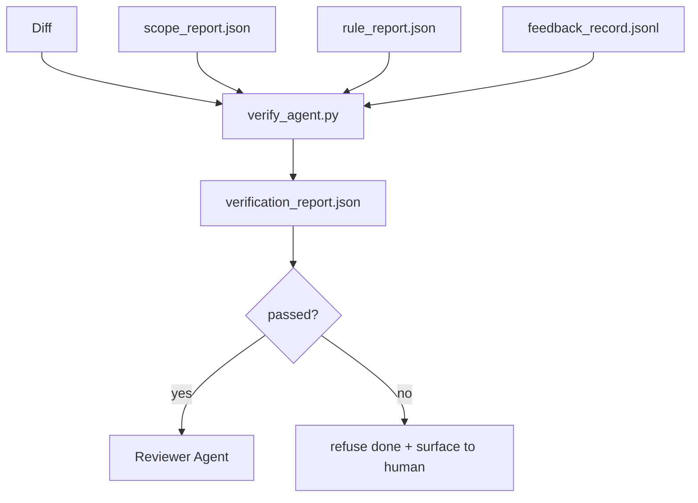

# 验证闸门

> 智能体无权给自己的工作盖上"完成"。验证闸门读取范围契约、反馈日志、规则报告和 diff,只回答一个问题:这个任务真的完成了吗?闸门说不,任务就没完——无论聊天里怎么说。

**类型:** 动手构建
**编程语言:** Python(标准库)
**前置要求:** 第 14 阶段 · 33(规则),第 14 阶段 · 36(范围),第 14 阶段 · 37(反馈)
**预计耗时:** 约 55 分钟

## 学习目标

- 把验证闸门定义为工作台工件上的确定性函数
- 把规则报告、范围报告、反馈记录和 diff 合成单一裁决
- 发出评审智能体和 CI 都能读的 `verification_report.json`
- 任何 block 级失败都拒绝推进任务,没有例外

## 问题

智能体宣布成功宣布得太容易了。三种失败形状占主导:

- "看着不错。"模型读了自己的 diff,断定它是对的。
- "测试通过了。"说得信心满满,却没有测试真的跑过的记录。
- "验收达标。"验收标准被解释得松到"任何长得像完成的东西"都算数。

工作台的修法是:一道单一的验证闸门,读取智能体已经产出的工件,作出裁决。闸门是确定性的,纳入版本控制,接进 CI——智能体贿赂不了它。

## 概念



### 闸门检查什么

| 检查 | 来源工件 | 严重级 |
|-------|-----------------|----------|
| 所有验收命令都跑过 | `feedback_record.jsonl` | block |
| 所有验收命令退出码为零 | `feedback_record.jsonl` | block |
| 范围检查无禁止写入 | `scope_report.json` | block |
| 范围检查无越界写入 | `scope_report.json` | block 或 warn |
| 所有 block 级规则通过 | `rule_report.json` | block |
| 反馈中无 `null` 退出码 | `feedback_record.jsonl` | block |
| 触碰文件匹配 `scope.allowed_files` | 两者 | warn |

`warn` 发现给裁决加注解;`block` 发现阻止 `passed: true`。

### 确定性,不是概率性

同一组工件,闸门必须每次都产出同样的裁决。不用 LLM 裁判——LLM 裁判属于评审一侧(第 14 阶段 · 39),那里的目标是定性评价,不是状态判定。

### 一份报告,一条路径

闸门在每次任务收尾时发出一份 `verification_report.json`,写在 `outputs/verification/<task_id>.json`。CI 消费同一条路径。多道闸门、多条路径,就是把事实来源掰岔。

### 拒绝,没有例外

block 级发现不能被智能体推翻,只能被人类推翻——而且要记录 `override_reason` 和 `overridden_by` 用户 id。override 是一次签了名的变更,不是智能体的决定。

```figure
wb-gate-sequence
```

## 动手构建

`code/main.py` 实现:

- 每个输入工件的加载器,全部本地打桩,本课自足。
- 纯函数 `verify(task_id, artifacts) -> VerdictReport`。
- 一个打印器,展示逐检查结果和最终通过/失败。
- 三个任务场景的演示:干净通过、范围蔓延、验收缺失。

运行:

```
python3 code/main.py
```

输出:三份裁决报告,各保存在脚本旁边。

## 野外的生产模式

四个模式,把闸门从"又一个 lint 任务"提升为"做决定的那道边"。

**纵深防御,不是单一闸门。** pre-commit hook → CI 状态检查 → 工具前授权 hook → 合并前闸门。每层都是确定性的,一层漏掉的由下一层接住。microservices.io 2026 年 3 月的 playbook 说得很白:pre-commit hook 不可绕过,因为它不像模型侧的 skill 那样依赖智能体遵守指令。验证闸门坐在 CI / 合并前那一层。

**确定性检查守底,模型裁判只管细腻处。** Anthropic 2026 年的 Hybrid Norm 搭配:可验证奖励(单元测试、schema 检查、退出码)回答"代码解决问题了吗";LLM 评分细则回答"代码可读、安全、合风格吗"。闸门跑第一类,评审者(第 14 阶段 · 39)跑第二类。混在一起,信号就塌了。

**签名的 override 日志,不是 Slack 线程。** 每次 override 在 `outputs/verification/overrides.jsonl` 里写一行:时间戳、发现代码、理由、签名用户、当前 HEAD 提交。缺签名的 override,运行时一律拒绝;审计轨迹纳入 git 跟踪。这是 override 政策与 override 表演之间的界线。

**覆盖率下限作为一等检查。** 一份 `coverage_report.json` 喂给 `coverage_floor`(默认 80%)检查:实测覆盖率低于下限,或比上一次合并的下限低超过 1 个百分点,闸门就失败。没有这项检查,智能体会悄悄删掉失败的测试,而验证报告一片绿。

**`--strict` 模式把 warn 提升为 block。** 发布分支、阻断交付的 PR 或事故后 triage 时,`--strict` 让每个警告都成硬失败。这个旗标按分支开启,不做全局默认——万事皆严会腐蚀日常节奏。

## 投入使用

生产模式:

- **CI 步骤。** 一个 `verify_agent` job 对智能体的最终工件跑闸门;没有 `passed: true`,合并保护拒绝放行。
- **交接前 hook。** 智能体运行时在生成交接文档之前调闸门:没有绿色裁决,就没有交接。
- **人工 triage。** 智能体宣称成功而人类存疑时,运维读这份报告。

闸门是工作台流程中做决定的那道边,其他所有表面都在它上游。

## 交付

`outputs/skill-verification-gate.md` 把闸门接进一个具体项目:哪些验收命令喂给它、哪些规则是 block 级、容忍哪些越界写入、override 审计日志怎么存。

## 练习

1. 加 `coverage_floor` 检查:测试命令必须产出覆盖率不低于 80% 的报告。决定由哪个工件携带下限。
2. 支持 `--strict` 模式,把每个 `warn` 提升为 `block`。写清哪些情况该默认开 strict。
3. 让闸门在 JSON 之外再产出一份 Markdown 摘要。论证哪些字段该进摘要。
4. 加 `time_since_last_human_touch` 检查:人类击键 60 秒内编辑的文件,豁免越界标记。
5. 对你产品里一次真实的智能体 diff 跑闸门。发现里多少是真的、多少是噪声?闸门需要在哪里生长?

## 关键术语

| 术语 | 别人的说法 | 实际含义 |
|------|----------------|------------------------|
| 验证闸门(Verification gate) | "拦东西的那道检查" | 工作台工件上的确定性函数,产出通过/失败裁决 |
| block 严重级(Block severity) | "硬失败" | 阻止 `passed: true`、需要签名 override 的发现 |
| override 日志(Override log) | "为什么放它过去" | 带理由和用户 id 的签名条目,供评审审计 |
| 验收命令(Acceptance command) | "那份证明" | 退出码为零即代表 `done` 的 shell 命令 |
| 一条报告路径(One report path) | "事实来源" | `outputs/verification/<task_id>.json`,CI 与人类共用 |

## 延伸阅读

- [Anthropic, Harness design for long-running application development](https://www.anthropic.com/engineering/harness-design-long-running-apps)
- [OpenAI Agents SDK guardrails](https://openai.github.io/openai-agents-python/guardrails/)
- [microservices.io, GenAI dev platform: guardrails](https://microservices.io/post/architecture/2026/03/09/genai-development-platform-part-1-development-guardrails.html)——pre-commit 与 CI 之间的纵深防御
- [ICMD, The 2026 Playbook for Agentic AI Ops](https://icmd.app/article/the-2026-playbook-for-agentic-ai-ops-guardrails-costs-and-reliability-at-scale-1776661990431)——批准闸门阶梯(草稿 → 批准 → 阈值内自动)
- [Type-Checked Compliance: Deterministic Guardrails (arXiv 2604.01483)](https://arxiv.org/pdf/2604.01483)——Lean 4 作为确定性设闸的上限
- [logi-cmd/agent-guardrails — merge gate spec](https://github.com/logi-cmd/agent-guardrails)——范围 + 变异测试闸门
- [Guardrails AI x MLflow](https://guardrailsai.com/blog/guardrails-mlflow)——作为 CI 打分器的确定性验证器
- [Akira, Real-Time Guardrails for Agentic Systems](https://www.akira.ai/blog/real-time-guardrails-agentic-systems)——工具前/后闸门
- 第 14 阶段 · 27——提示词注入防御(闸门的对抗面)
- 第 14 阶段 · 36——这道闸门强制执行的范围契约
- 第 14 阶段 · 37——这道闸门打分的反馈日志
- 第 14 阶段 · 39——闸门交接给的评审智能体
