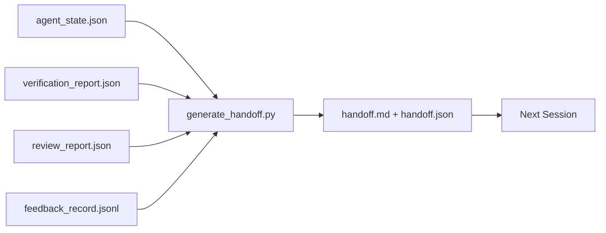

# 多会话交接

> 会话总会结束,工作不会。交接包(handoff packet)是把"智能体干了一小时"变成"下个会话第一分钟就有产出"的那个工件。要刻意构建它,别当事后补丁。

**类型:** 动手构建
**编程语言:** Python(标准库)
**前置要求:** 第 14 阶段 · 34(仓库记忆),第 14 阶段 · 38(验证),第 14 阶段 · 39(评审者)
**预计耗时:** 约 50 分钟

## 学习目标

- 识别每个交接包都需要的七个字段
- 从工作台工件自动生成交接,而不是手写散文
- 把巨大的反馈日志修剪成交接大小的摘要
- 让下个会话的第一个动作是确定的

## 问题

会话结束,智能体说"很好,有进展"。下个会话打开,下一个智能体问"我们做到哪了?"——上一个智能体的答案已经没了。下一个智能体重新发现一切,重跑同样的命令,向人类重问同样的问题,烧掉三十分钟,只为找回上个会话最后三十秒。

一次糟糕交接的代价,在任务的整个生命周期里每个会话都要付一遍。修法是:会话结束时自动生成一个包——改了什么、为什么、试过什么、什么失败了、还剩什么、下次先做什么。

## 概念



### 每个交接包携带的七个字段

| 字段 | 它回答的问题 |
|-------|---------------------|
| `summary` | 做了什么的一段落 |
| `changed_files` | 一瞥即知的 diff |
| `commands_run` | 实际执行了什么 |
| `failed_attempts` | 试过什么、为什么没成 |
| `open_risks` | 什么可能咬到下个会话,带严重级 |
| `next_action` | 下个会话迈出的第一个具体步骤 |
| `verdict_pointer` | 验证 + 评审报告的路径 |

`next_action` 是承重字段:什么都有、唯独没有 `next_action` 的交接,是状态报告,不是交接。

### 交接是生成的,不是写的

手写的交接,是日子一难就会被跳过的交接。生成器读工作台工件,吐出交接包。智能体的职责是把工作台留在生成器能总结的状态里,而不是亲自写总结。

### 两种形态:人读与机读

`handoff.md` 给人读,`handoff.json` 给下一个智能体加载。两者来自同一批源工件。若两者不一致,以 JSON 为准。

### 反馈日志修剪

完整的 `feedback_record.jsonl` 可能有几百条。交接只带最后 K 条,外加所有非零退出的条目。下个会话需要时可以去加载完整日志,但交接包保持小巧。

### 留下干净的状态

交接描述工作,干净的状态让工作可恢复。两者不是一回事:一份完美的 `handoff.md`,在下个会话打开时看到半应用的 diff、智能体忘了的临时文件、一条迷途分支和还没跑就先报错的测试时,一文不值。下一个智能体得先花十分钟给上一个擦屁股,而不是开工——这个代价在任务的整个生命周期里每个会话都在复利。

所以,会话不在特性跑通时结束,而在工作台处于生成器能总结、下个会话能信任的状态时结束。清理是独立的一个阶段,在交接之前运行;它是一项检查,不是一个习惯——因为习惯正是日子一难就会被跳过的那个东西。

| 检查 | 干净意味着 | 脏会阻塞是因为 |
|-------|-------------|----------------------|
| 工作树 | 所有改动已提交,或带注释显式 stash | 半应用的 diff 在下一个智能体眼里像是有意的工作 |
| 临时工件 | 不遗留 `*.tmp`、草稿目录、调试打印或注释掉的代码块 | 杂散文件污染 diff 和下一个智能体的心智模型 |
| 测试 | 全绿;或全红但失败已写进 `open_risks` | 沉默的红测试是下个会话会踩中的陷阱 |
| 特性看板 | `feature_list.json` 的状态反映现实(第 14 阶段 · 36) | 陈旧的看板会把下个会话引向已完成的工作 |
| 分支 | 在预期分支上,无游离 HEAD,无孤儿分支 | 分支错了,下个会话的第一个提交就落错地方 |

清理阶段产出一份列出阻塞问题的 `clean_state.json`;空清单是交接生成器在写包之前断言的前提。建在脏树上的交接不是交接,是转发出去的一团糟。两份工件成对:清理证明工作台可以安全离开,交接证明下个会话知道从哪开始。

```figure
wb-handoff-packet
```

## 动手构建

`code/main.py` 实现:

- 一个加载器,把状态、裁决、评审和反馈收进单个 `WorkbenchSnapshot`。
- 函数 `generate_handoff(snapshot) -> (markdown, payload)`。
- 一个过滤器:取最后 K 条反馈,外加所有非零退出。
- 一个演示运行,把 `handoff.md` 和 `handoff.json` 写到脚本旁边。

运行:

```
python3 code/main.py
```

输出:打印出的交接正文,以及磁盘上的两个文件。

## 野外的生产模式

Codex CLI、Claude Code 和 OpenCode 各自交付了不同的压缩方案;结构化交接包坐在三者之上。

**压缩策略各不相同,包的 schema 不变。** Codex CLI 的 POST /v1/responses/compact 是服务端不透明的 AES blob(OpenAI 模型的快路径);兜底是本地的"交接摘要",作为 `_summary` 的 user 角色消息追加。Claude Code 在上下文 95% 处跑五阶段渐进压缩。OpenCode 做基于时间戳的消息隐藏加一份五标题的 LLM 摘要。三种机制,同一个需求:把压缩后幸存的东西序列化成可移植的工件。交接包就是那个工件。

**新会话交接不是压缩。** 压缩延长一个会话;交接干净地关闭一个、开启下一个。Hermes Issue #20372 的框架(2026 年 4 月)是对的:就地压缩开始退化时,智能体应该写出紧凑的交接、结束会话、在全新上下文中恢复。交接包让这次切换变便宜。错误的做法是压到质量崩塌为止;正确的做法是预留预算,趁早做一次干净的交接。

**每个分支每个主题只有一份活跃交接。** 多智能体协调死在陈旧交接上的次数,比死在坏模型输出上多。永远带上 `branch`、`last_known_good_commit`,以及 `active | superseded | archived` 的 `status`:陈旧交接归档,只有活跃的那份驱动下个会话。这是"交接当笔记"与"交接当状态"的差别。

**在 50–75% 上下文时收尾,别撞墙。** 手写模式 playbook(CLAUDE.md + HANDOVER.md)报告:在上下文预算 50–75% 时结束会话效果最好。趁压缩工件污染源状态之前,交接包生成器跑得干干净净。上下文完整时写它很便宜;模型已经找不到北时再写,代价高昂。

## 投入使用

生产模式:

- **会话结束 hook。** 用户关闭聊天时,运行时触发生成器;交接包进 `outputs/handoff/<session_id>/`。
- **PR 模板。** 生成器的 markdown 同时就是 PR 正文:评审者不用打开另外五个文件就能读完。
- **跨智能体交接。** 用一个产品(Claude Code)构建,用另一个(Codex)继续。交接包是通用语。

交接包小巧、规整、生产成本低廉。节省的成本随每个会话复利。

## 交付

`outputs/skill-handoff-generator.md` 产出一个按项目工件路径调优的生成器、一个在会话结束时运行它的 hook,以及下个智能体启动时读取的 `handoff.json` schema。

## 练习

1. 加 `assumptions_to_validate` 字段:浮现建造者记下、但评审者没给到 1 分以上的所有假设。
2. 对失败运行与通过运行用不同的反馈摘要修剪方式。为这种不对称辩护。
3. 加"要问人类的问题"清单。一个问题进交接包 vs 进聊天消息的阈值是什么?
4. 让生成器幂等:跑两次产出同一个包。要做到这一点,什么必须稳定?
5. 加"下个会话前置条件"一节:列出下个会话行动前必须加载的工件,一个不落。

## 关键术语

| 术语 | 别人的说法 | 实际含义 |
|------|----------------|------------------------|
| 交接包(Handoff packet) | "会话摘要" | 携带七个字段的生成工件,markdown 与 JSON 双形态 |
| 下一动作(Next action) | "先做什么" | 开启下个会话的那一个具体步骤 |
| 反馈修剪(Feedback trim) | "日志摘要" | 最后 K 条记录,外加所有非零退出 |
| 状态报告(Status report) | "我们做了什么" | 缺 `next_action` 的文档;有用,但不是交接 |
| 裁决指针(Verdict pointer) | "收据" | 指向验证 + 评审报告的路径,供追溯 |

## 延伸阅读

- [Anthropic, Effective harnesses for long-running agents](https://www.anthropic.com/engineering/effective-harnesses-for-long-running-agents)
- [OpenAI Agents SDK handoffs](https://openai.github.io/openai-agents-python/handoffs/)
- [Codex Blog, Codex CLI Context Compaction: Architecture, Configuration, Managing Long Sessions](https://codex.danielvaughan.com/2026/03/31/codex-cli-context-compaction-architecture/)——POST /v1/responses/compact 与本地兜底
- [Justin3go, Shedding Heavy Memories: Context Compaction in Codex, Claude Code, OpenCode](https://justin3go.com/en/posts/2026/04/09-context-compaction-in-codex-claude-code-and-opencode)——三家厂商压缩对比
- [JD Hodges, Claude Handoff Prompt: How to Keep Context Across Sessions (2026)](https://www.jdhodges.com/blog/ai-session-handoffs-keep-context-across-conversations/)——CLAUDE.md + HANDOVER.md,50–75% 上下文预算
- [Mervin Praison, Managing Handoffs in Multi-Agent Coding Sessions: Fresh Context Without Losing Continuity](https://mer.vin/2026/04/managing-handoffs-in-multi-agent-coding-sessions-fresh-context-without-losing-continuity/)——分布式系统框架
- [Hermes Issue #20372 — automatic fresh-session handoff when compression becomes risky](https://github.com/NousResearch/hermes-agent/issues/20372)
- [Hermes Issue #499 — Context Compaction Quality Overhaul](https://github.com/NousResearch/hermes-agent/issues/499)——Codex CLI 中面向交接的提示词
- [Microsoft Agent Framework, Compaction](https://learn.microsoft.com/en-us/agent-framework/agents/conversations/compaction)
- [OpenCode, Context Management and Compaction](https://deepwiki.com/sst/opencode/2.4-context-management-and-compaction)
- [LangChain, Context Engineering for Agents](https://www.langchain.com/blog/context-engineering-for-agents)
- 第 14 阶段 · 34——生成器读取的状态文件
- 第 14 阶段 · 38——交接包指向的验证裁决
- 第 14 阶段 · 39——打进交接包的评审报告
