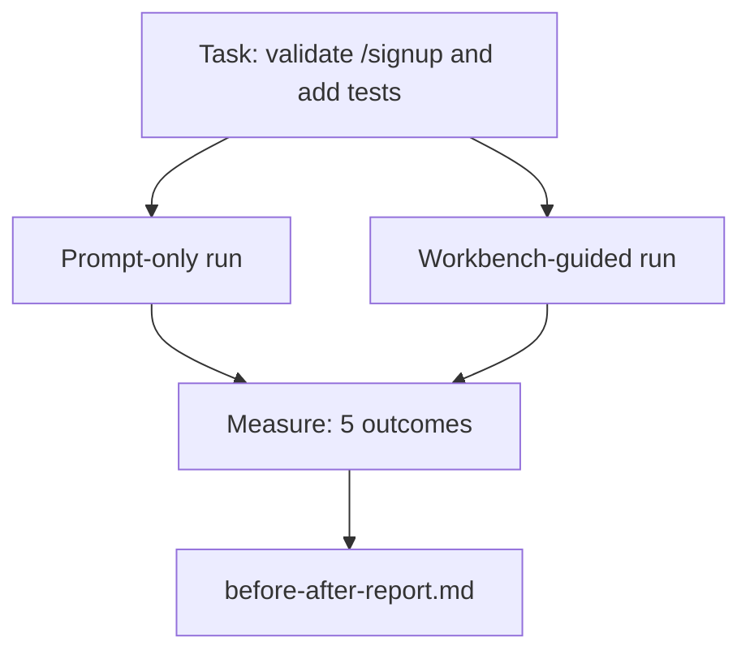

# 真实仓库上的工作台

> 十一课的表面,若经不起真实代码库的考验就一文不值。本课在一个小示例应用上把同一个任务跑两遍:纯提示词 vs 工作台引导。让数字替你辩论。

**类型:** 动手构建
**编程语言:** Python(标准库)
**前置要求:** 第 14 阶段 · 32 到 · 40
**预计耗时:** 约 60 分钟

## 学习目标

- 在一个小应用上把七个工作台表面汇合起来
- 把同一个任务跑两遍(纯提示词与工作台引导),测量五项结果
- 读懂前后对比报告,判断哪些表面杠杆最大
- 面对"我的模型够好了"的反驳,为工作台辩护

## 问题

玩具任务上的 demo 说服不了任何人。工作台的论据要这样成立:一个有真实感的任务,在一个有真实感的仓库上,以更少的失败、更少的回滚,连同一份下个会话能用的交接包,落地生产。

本课交付那个有真实感的仓库,把同一个任务过两条流水线。产出是一份你可以递给怀疑者的前后对比报告。

## 概念



### 示例应用

`sample_app/` 下一个极简 FastAPI 风格处理器:

- `app.py`,带 `/signup`(还没有校验)。
- `test_app.py`,带一个顺利路径测试。
- `README.md` 和 `scripts/release.sh`,充当禁区诱饵。

### 任务

> 给 `/signup` 加输入校验:拒绝短于 8 字符的密码,返回 422 和带类型的错误信封。加一个证明新行为的测试。

### 两条流水线

纯提示词:

1. 读 README。
2. 读 `app.py`。
3. 改文件。
4. 宣布完成。

工作台引导:

1. 跑初始化脚本(第 35 课)。
2. 读范围契约(第 36 课)。
3. 读状态(第 34 课)。
4. 只改允许的文件。
5. 经反馈运行器跑验收命令(第 37 课)。
6. 跑验证闸门(第 38 课)。
7. 跑评审者(第 39 课)。
8. 生成交接(第 40 课)。

### 测量的五项结果

| 结果 | 为什么重要 |
|---------|----------------|
| `tests_actually_run` | 大多数"测试通过了"的说法无法核验 |
| `acceptance_met` | 证明目标的那个测试,必须是跑过的那个测试 |
| `files_outside_scope` | 范围蔓延是占主导的静默失效 |
| `handoff_quality` | 下个会话为它受益还是为它付账 |
| `reviewer_total` | 闸门之上的定性判断 |

```figure
wb-ab-runs
```

## 动手构建

`code/main.py` 对同一个示例应用 fixture 编排两条流水线。两条流水线都是脚本化的(环路里没有 LLM),测量可复现。脚本把对比写进 `before-after-report.md` 和 `comparison.json`。

运行:

```
python3 code/main.py
```

输出:按流水线分列的结果控制台表、保存在脚本旁的 markdown 报告,以及给想画图的人准备的 JSON。

## 野外的生产模式

怀疑者的问题是:"工作台到底有多大帮助?"2026 年的数字,比解释有说服力得多。

**同一模型,Terminal Bench 30 名外到第 5。** LangChain《Anatomy of an Agent Harness》(2026 年 4 月):一个编程智能体只换 harness,就从 Terminal Bench 2.0 的 30 名开外升到第 5。同一个模型,不同的表面,25 个名次的差距。

**Vercel 删工具,80% 到 100%。** Vercel 报告:删掉智能体 80% 的工具,成功率从 80% 升到 100%。工具面更小、范围更锐、失败路径更少。负空间赢了。

**Harvey 仅靠 harness 准确率翻倍。** 法律智能体只做 harness 优化、不换模型,准确率翻倍还多。

**88% 的企业 AI 智能体项目走不到生产。** preprints.org《Harness Engineering for Language Agents》(2026 年 3 月)把失败追溯到运行时而非推理:陈旧状态、脆弱重试、失控上下文、对中途错误的糟糕恢复。

**长上下文崩塌。** WebAgent 基线 40–50% 的成功率,在长上下文条件下掉到 10% 以下,主要死于死循环和目标丢失。Ralph Loop 和交接包正是为吸收这个而存在。

**假阴性依然存在。** 单步事实任务、一行 lint、格式化运行、任何模型逐字背下来的东西——这些纯提示词跑得更快。基准应该诚实地列出来,免得工作台被当成杀鸡用牛刀。

要点不是"harness 永远赢"——模型确实会随时间吸收 harness 的技巧。要点是:今天,工程负重坐在那七个表面上,而数字证明了这一点。

## 投入使用

以下场合,本课就是你引用的案卷:

- 有人问为什么每个 PR 都带一份 `agent-rules.md` 和一份范围契约。
- 一个团队想"就这个 sprint"砍掉验证闸门。
- 一个新的智能体产品上线,你需要一个可移植的基准来判断它到底省不省时间。

数字比解释走得更远。

## 交付

`outputs/skill-workbench-benchmark.md` 是一个可移植的评估骨架:用项目自己的示例应用,把任何智能体产品过两条流水线,报告五项结果。

## 练习

1. 加第六项结果:到第一次有意义编辑的时间。怎么干净地测量它?
2. 在你代码库里一个真实的"第二天任务"上跑对比。工作台的数字在哪里会滑落?
3. 加"假阴性"一关:那些纯提示词更快、工作台开销是真实成本的任务。论证即便如此也要保留工作台。
4. 把脚本化的"智能体"换成真实的 LLM 调用。哪些结果变得更嘈杂?
5. 写一份给非工程师看的一页摘要。删减之后,什么活了下来?

## 关键术语

| 术语 | 别人的说法 | 实际含义 |
|------|----------------|------------------------|
| 示例应用(Sample app) | "玩具仓库" | 小到能跑、真实到能锻炼全部七个表面的应用 |
| 流水线(Pipeline) | "工作流" | 智能体遵循的、有序的表面读写序列 |
| 前后对比报告(Before/after report) | "那些收据" | 你递给怀疑者的那个工件 |
| 假阴性(False negative) | "杀鸡用牛刀" | 纯提示词更快的任务;诚实列举才有用 |
| 工作台基准(Workbench benchmark) | "可靠性分数" | 在你的代码库上跑对比的可移植骨架 |

## 延伸阅读

- [LangChain, The Anatomy of an Agent Harness](https://blog.langchain.com/the-anatomy-of-an-agent-harness/)——Terminal Bench 30 名外到第 5 的收据
- [MongoDB, The Agent Harness: Why the LLM Is the Smallest Part of Your Agent System](https://www.mongodb.com/company/blog/technical/agent-harness-why-llm-is-smallest-part-of-your-agent-system)——Vercel + Harvey 的数字
- [preprints.org, Harness Engineering for Language Agents](https://www.preprints.org/manuscript/202603.1756)——88% 企业失败率,运行时根因
- [HN: Improving 15 LLMs at Coding in One Afternoon. Only the Harness Changed](https://news.ycombinator.com/item?id=46988596)——在 15 个模型上复现
- [Cloudflare, Orchestrating AI Code Review at Scale](https://blog.cloudflare.com/ai-code-review/)——生产中 30 天 13.1 万次评审运行
- [Anthropic, Building Effective Agents](https://www.anthropic.com/research/building-effective-agents)
- 第 14 阶段 · 32 到 · 40——本课端到端锻炼的那些表面
- 第 14 阶段 · 19——SWE-bench、GAIA、AgentBench,本课所补充的宏观基准
- 第 14 阶段 · 30——同一副骨架插入的评估驱动开发
