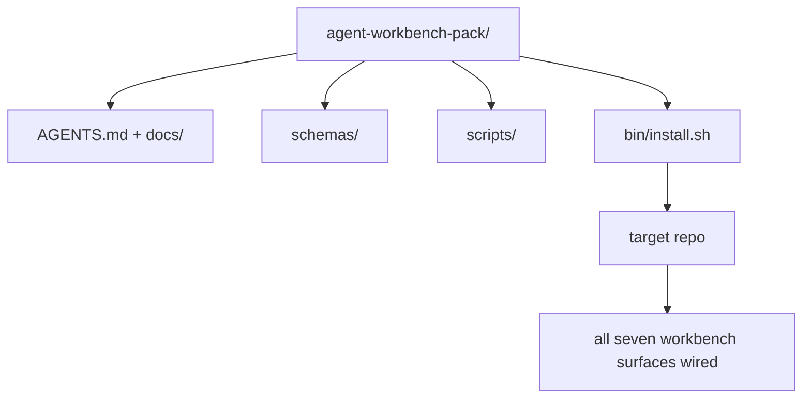

# 毕业设计:交付一个可复用的智能体工作台包

> 这个小系列的终点,是一个你能丢进任何仓库的包:十一课的表面,压缩成一个 `cp -r` 就能用、第二天早上智能体就能可靠干活的目录。毕业设计,就是这套课程赖以立身的那个工件。

**类型:** 动手构建
**编程语言:** Python(标准库)
**前置要求:** 第 14 阶段 · 31 到 · 41
**预计耗时:** 约 75 分钟

## 学习目标

- 把七个工作台表面打包成一个即插即用的目录
- 钉住 schema、脚本和模板,让新仓库拿到一个已知良好的基线
- 加一个幂等铺设这个包的单一安装脚本
- 决定什么留在包里、什么留在外,并为每一刀辩护

## 问题

活在 Google Doc、聊天记录和三个记不太清的脚本里的工作台,是每个季度都会被重建一遍的工作台。解药是一个版本化的包:一个装着表面、schema、脚本和一条命令安装器的仓库或目录。

本课结束时,你磁盘上会有交付好的 `outputs/agent-workbench-pack/`,以及一个能把它丢进任何目标仓库的 `bin/install.sh`。

## 概念



### 包的布局

```
outputs/agent-workbench-pack/
├── AGENTS.md
├── docs/
│   ├── agent-rules.md
│   ├── reliability-policy.md
│   ├── handoff-protocol.md
│   └── reviewer-rubric.md
├── schemas/
│   ├── agent_state.schema.json
│   ├── task_board.schema.json
│   └── scope_contract.schema.json
├── scripts/
│   ├── init_agent.py
│   ├── run_with_feedback.py
│   ├── verify_agent.py
│   └── generate_handoff.py
├── bin/
│   └── install.sh
└── README.md
```

### 什么留下,什么出去

留下:

- 表面 schema。它们是契约。
- 上面那四个脚本。它们是运行时。
- 那四份文档。它们是规则和评分细则。

出去:

- 项目特定任务。任务属于目标仓库的看板,不属于包。
- 厂商 SDK 调用。包是框架无关的。
- 入职散文。包住在团队现有入职文档旁边,不住在它里面。

### 安装器

一个简短的 `bin/install.sh`(或 `bin/install.py`):

1. 不带 `--force` 时,拒绝覆盖已存在的包。
2. 把包复制进目标仓库。
3. 若存在 `.github/workflows/`,接好 CI。
4. 打印下一步:填看板、设验收命令、跑初始化脚本。

### 版本化

包携带一个 `VERSION` 文件:需要迁移的 schema 升级和脚本变更升 major;仅文档变更升 patch。目标仓库的 `agent_state.json` 记录它初始化时对应的包版本。

```figure
wb-pack-install
```

## 动手构建

`code/main.py` 把包组装到本课旁边的 `outputs/agent-workbench-pack/`,预填本小系列前几课的 schema 和脚本,以及你已经写好的文档。

运行:

```
python3 code/main.py
```

脚本复制并钉住各表面,写出 README,打印包目录树,以零码退出。重跑幂等。

## 野外的生产模式

包的价值,取决于它能否活过 fork、更新和不友好的上游。四个模式让它成立。

**`VERSION` 是契约,不是营销。** major 升级需要状态迁移;minor 升级需要重跑检查器;patch 升级仅限文档。安装器每次安装都把 `.workbench-version` 写进目标仓库;`lint_pack.py` 在目标锁与包的 `VERSION` 不一致时拒绝交付。这就是 `npm`、`Cargo` 和 `pyproject.toml` 活过十年变迁的方式——智能体改变不了规则。

**跨工具分发的单一源头。** Nx 交付一条 `nx ai-setup`:从一份配置铺下 `AGENTS.md`、`CLAUDE.md`、`.cursor/rules/`、`.github/copilot-instructions.md` 和一个 MCP 服务器。包也该如此:安装器发出符号链接(`ln -s AGENTS.md CLAUDE.md`),让单一事实来源扇出到每个编程智能体。为支持某个工具而 fork 包,是一种失效模式。

**拒绝带非平凡状态的 `uninstall.sh`。** 卸载包绝不能删掉用户的 `agent_state.json`、`task_board.json` 或 `outputs/`。卸载器只移除 schema、脚本、文档和 `AGENTS.md`(可用 `--keep-agents-md` 选择保留),且状态文件有任何未提交改动时拒绝执行。状态属于用户,包不拥有它。

**技能即可发布物:SkillKit 式分发。** 包以 SkillKit 技能的形式交付:`skillkit install agent-workbench-pack` 从单一源头把它铺到 32 个 AI 智能体上。包仓库是事实来源,SkillKit 是分发渠道。厂商锁定瓦解,七个表面不变。

## 投入使用

包的三种交付方式:

- **作为丢进仓库的目录。** `cp -r outputs/agent-workbench-pack /path/to/repo`。
- **作为公开模板仓库。** fork 后定制,用 `VERSION` 控制漂移。
- **作为 SkillKit 技能。** 接进你的智能体产品,一条命令铺好。

包是配方,每次安装是一份上桌的菜。

## 交付

`outputs/skill-workbench-pack.md` 生成按项目调优的包:规则按团队历史磨利、范围 glob 匹配该仓库、细则维度扩入一个领域专属条目。

## 练习

1. 决定哪份可选的第五文档值得晋升进 经典 包。为这一刀辩护。
2. 把安装器用 Python 重写,加 `--dry-run` 旗标。与 bash 版比较人体工学。
3. 加 `bin/uninstall.sh`:安全移除包,状态文件有非平凡历史时拒绝。什么算非平凡?
4. 加 `lint_pack.py`:包与 `VERSION` 漂移时失败。把它接进包自己仓库的 CI。
5. 写一份从手搓工作台迁移到这个包的 runbook。怎样的操作顺序能把停机时间压到最小?

## 关键术语

| 术语 | 别人的说法 | 实际含义 |
|------|----------------|------------------------|
| 工作台包(Workbench pack) | "新手包" | 携带全部七个表面的版本化目录 |
| 安装器(Installer) | "安装脚本" | 幂等铺设包的 `bin/install.sh` |
| 包版本(Pack version) | "VERSION" | schema/脚本变更升 major,仅文档升 patch |
| 即插即用包(Drop-in pack) | "cp -r 就跑" | 第一天无需按仓库定制就能工作的包 |
| 可 fork 模板(Forkable template) | "GitHub 模板" | GitHub "Use this template" 能克隆的公开仓库 |

## 延伸阅读

- 第 14 阶段 · 31 到 · 41——这个包打包的每一个表面
- [SkillKit](https://github.com/rohitg00/skillkit)——把这个技能装进 32 个 AI 智能体
- [Nx Blog, Teach Your AI Agent How to Work in a Monorepo](https://nx.dev/blog/nx-ai-agent-skills)——跨六个工具的单一源头生成器
- [agents.md — the open spec](https://agents.md/)——你的包的路由必须实现的东西
- [HKUDS/OpenHarness](https://github.com/HKUDS/OpenHarness)——与包等价的参考实现
- [andrewgarst/agentic_harness](https://github.com/andrewgarst/agentic_harness)——带 eval 套件的 Redis 支撑参考
- [Augment Code, A good AGENTS.md is a model upgrade](https://www.augmentcode.com/blog/how-to-write-good-agents-dot-md-files)——包文档的质量线
- [Anthropic, Effective harnesses for long-running agents](https://www.anthropic.com/engineering/effective-harnesses-for-long-running-agents)
- [Anthropic, Harness design for long-running application development](https://www.anthropic.com/engineering/harness-design-long-running-apps)
- 第 14 阶段 · 30——消费包的验证闸门的评估驱动开发
- 第 14 阶段 · 41——这个包在其上改进的前后对比基准
