# 通信协议

> 说不了同一种语言的智能体不是团队,只是一群对着虚空喊话的陌生人。

**类型:** 动手构建
**编程语言:** TypeScript
**前置要求:** 第 14 阶段(智能体工程)、第 16.01 课(为什么要多智能体)
**预计耗时:** 约 120 分钟

## 学习目标

- 实现 MCP 工具发现与调用,让智能体能使用外部服务器暴露的工具
- 构建 A2A 智能体卡片和任务端点,让一个智能体可以经 HTTP 把工作委派给另一个
- 比较 MCP(工具访问)、A2A(智能体对智能体)、ACP(企业审计)和 ANP(去中心化信任),并解释每个协议解决什么问题
- 在单个系统中把多种协议接起来:智能体经 MCP 发现工具,经 A2A 委派任务

## 问题

你把系统拆成了多个智能体:一个研究员、一个程序员、一个评审。各自的活都干得很好。但现在你需要它们真的说上话。

你的第一次尝试很显然:传字符串。研究员返回一大坨文本,程序员怎么顺手怎么解析。它能凑合用——直到程序员误解了研究摘要,或两个智能体互相等死锁,或你需要两个不同团队构建的智能体协作。突然之间,"传字符串就行"就塌了。

这就是通信协议问题。没有一份共享契约来约定智能体如何交换信息,多智能体系统就是脆弱的、不可审计的,而且规模超不过你亲手写的那几个。

AI 生态的回应是四个协议,各解决这个问题的一片:

- **MCP** 管工具访问
- **A2A** 管智能体对智能体的协作
- **ACP** 管企业级可审计性
- **ANP** 管去中心化身份与信任

本课往深里讲。你会读到每个规范真实的线格式,构建能跑的实现,并把四个协议接进一个统一系统。

## 概念

### 协议版图

把这四个协议想成四层,各回答一个不同的问题:

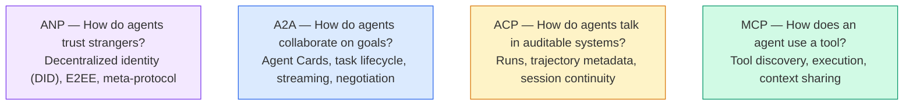

它们不是竞争对手。它们在不同层面解决不同问题。

### MCP(回顾)

MCP 在第 13 阶段已深入讲过。快速回顾:MCP 标准化了 LLM 如何连接外部工具和数据源。它是**客户端-服务器**协议,智能体(客户端)发现并调用服务器暴露的工具。

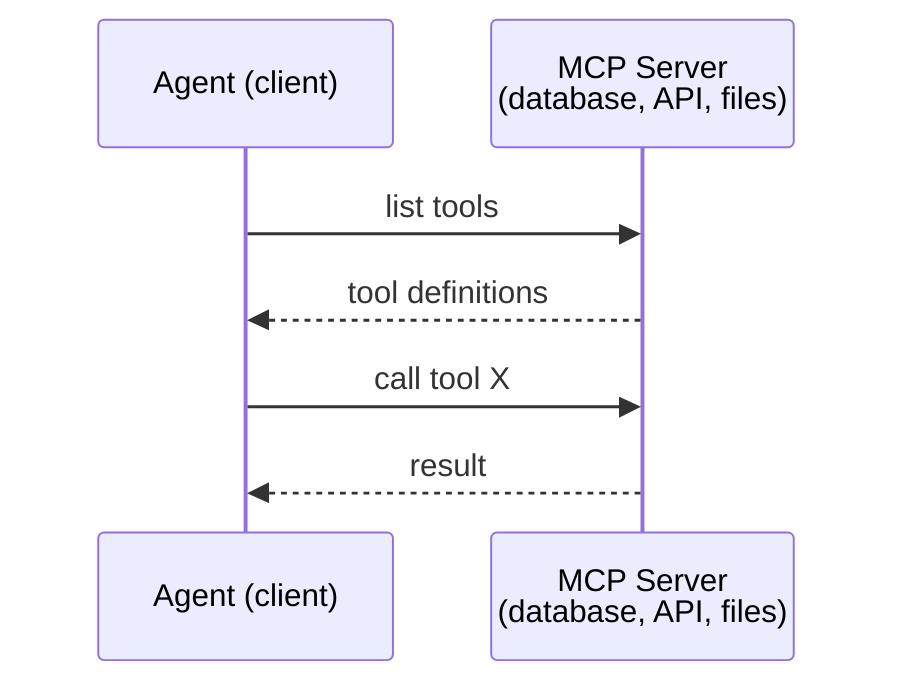

MCP 是**智能体对工具**的通信。它帮不了智能体之间互相对话。

### A2A(Agent2Agent 协议)

**创建者:** Google(现归 Linux 基金会,名为 `lf.a2a.v1`)
**规范版本:** 1.0.0
**问题:** 自治智能体如何相互协作、协商和委派任务?

A2A 是**点对点智能体协作**的协议。MCP 把智能体连到工具,A2A 把智能体连到其他智能体。每个智能体在一个众所周知的 URL 发布一张 **Agent Card**,其他智能体发现它、与它协商、向它委派任务。

#### A2A 如何工作

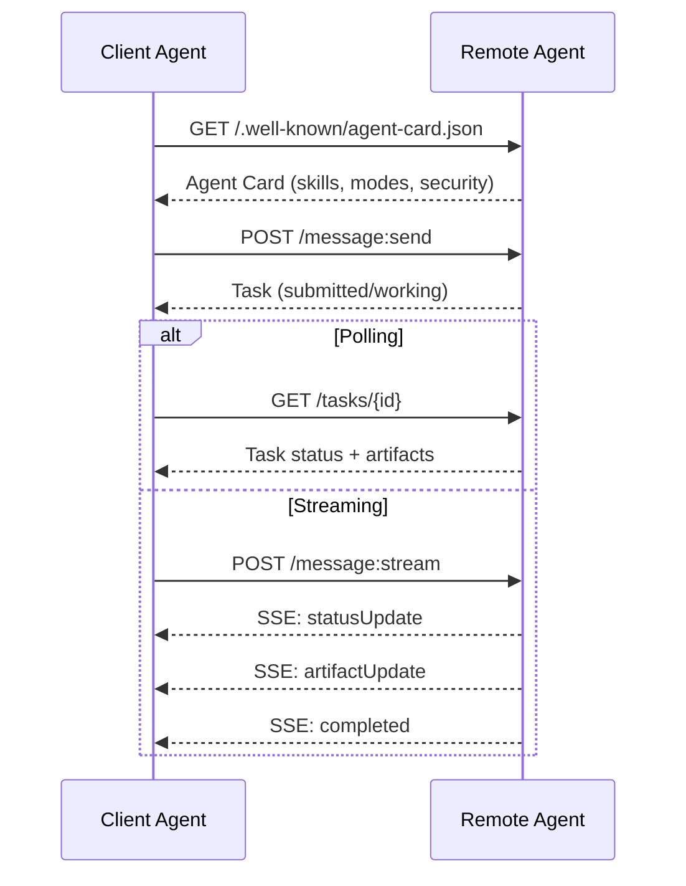

#### 真实的 Agent Card

这就是野外的 A2A Agent Card 真实长什么样。挂在 `GET /.well-known/agent-card.json`:

```json
{
  "name": "Research Agent",
  "description": "Searches documentation and summarizes findings",
  "version": "1.0.0",
  "supportedInterfaces": [
    {
      "url": "https://research-agent.example.com/a2a/v1",
      "protocolBinding": "JSONRPC",
      "protocolVersion": "1.0"
    },
    {
      "url": "https://research-agent.example.com/a2a/rest",
      "protocolBinding": "HTTP+JSON",
      "protocolVersion": "1.0"
    }
  ],
  "provider": {
    "organization": "Your Company",
    "url": "https://example.com"
  },
  "capabilities": {
    "streaming": true,
    "pushNotifications": false
  },
  "defaultInputModes": ["text/plain", "application/json"],
  "defaultOutputModes": ["text/plain", "application/json"],
  "skills": [
    {
      "id": "web-research",
      "name": "Web Research",
      "description": "Searches the web and synthesizes findings",
      "tags": ["research", "search", "summarization"],
      "examples": ["Research the latest changes in React 19"]
    },
    {
      "id": "doc-analysis",
      "name": "Documentation Analysis",
      "description": "Reads and analyzes technical documentation",
      "tags": ["docs", "analysis"],
      "inputModes": ["text/plain", "application/pdf"],
      "outputModes": ["application/json"]
    }
  ],
  "securitySchemes": {
    "bearer": {
      "httpAuthSecurityScheme": {
        "scheme": "Bearer",
        "bearerFormat": "JWT"
      }
    }
  },
  "security": [{ "bearer": [] }]
}
```

要注意的关键点:
- **Skills** 是智能体能做什么。每个技能有 ID、标签和支持的输入/输出 MIME 类型。客户端智能体凭此判断这个远程智能体能不能处理它的请求。
- **supportedInterfaces** 列出多个协议绑定。一个智能体可以同时说 JSON-RPC、REST 和 gRPC。
- **Security** 内置在卡片里。客户端在发出第一个请求之前,就知道需要什么认证。

#### 任务生命周期

Task 是 A2A 中的核心工作单元。它们在定义好的状态间流转:

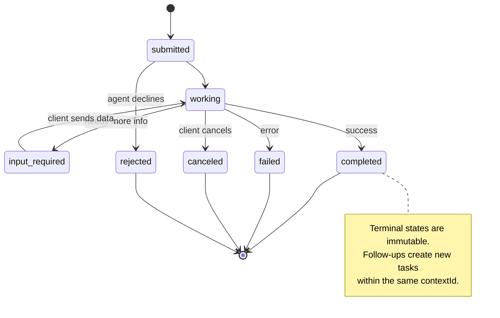

全部 8 个状态(规范还定义了 `UNSPECIFIED` 作为哨兵,此处略):

| 状态 | 终态? | 含义 |
|---|---|---|
| `TASK_STATE_SUBMITTED` | 否 | 已确认收到,尚未处理 |
| `TASK_STATE_WORKING` | 否 | 正在处理中 |
| `TASK_STATE_INPUT_REQUIRED` | 否 | 智能体需要客户端提供更多信息 |
| `TASK_STATE_AUTH_REQUIRED` | 否 | 需要认证 |
| `TASK_STATE_COMPLETED` | 是 | 成功完成 |
| `TASK_STATE_FAILED` | 是 | 出错结束 |
| `TASK_STATE_CANCELED` | 是 | 完成前被取消 |
| `TASK_STATE_REJECTED` | 是 | 智能体拒绝了任务 |

任务到达终态后就不可变。不再有后续消息。跟进事项在同一个 `contextId` 下创建新任务。

#### 线格式

A2A 用 JSON-RPC 2.0。真实的消息交换长这样:

**客户端发送任务:**
```json
{
  "jsonrpc": "2.0",
  "id": 1,
  "method": "SendMessage",
  "params": {
    "message": {
      "messageId": "msg-001",
      "role": "ROLE_USER",
      "parts": [{ "text": "Research React 19 compiler features" }]
    },
    "configuration": {
      "acceptedOutputModes": ["text/plain", "application/json"],
      "historyLength": 10
    }
  }
}
```

**智能体返回任务:**
```json
{
  "jsonrpc": "2.0",
  "id": 1,
  "result": {
    "task": {
      "id": "task-abc-123",
      "contextId": "ctx-xyz-789",
      "status": {
        "state": "TASK_STATE_COMPLETED",
        "timestamp": "2026-03-27T10:30:00Z"
      },
      "artifacts": [
        {
          "artifactId": "art-001",
          "name": "research-results",
          "parts": [{
            "data": {
              "findings": [
                "React 19 compiler auto-memoizes components",
                "No more manual useMemo/useCallback needed",
                "Compiler runs at build time, not runtime"
              ]
            },
            "mediaType": "application/json"
          }]
        }
      ]
    }
  }
}
```

**经 SSE 流式:**
```text
POST /message:stream HTTP/1.1
Content-Type: application/json
A2A-Version: 1.0

data: {"task":{"id":"task-123","status":{"state":"TASK_STATE_WORKING"}}}

data: {"statusUpdate":{"taskId":"task-123","status":{"state":"TASK_STATE_WORKING","message":{"role":"ROLE_AGENT","parts":[{"text":"Searching documentation..."}]}}}}

data: {"artifactUpdate":{"taskId":"task-123","artifact":{"artifactId":"art-1","parts":[{"text":"partial findings..."}]},"append":true,"lastChunk":false}}

data: {"statusUpdate":{"taskId":"task-123","status":{"state":"TASK_STATE_COMPLETED"}}}
```

### ACP(智能体通信协议)

**创建者:** IBM / BeeAI
**规范版本:** 0.2.0(OpenAPI 3.1.1)
**状态:** 正在并入 Linux 基金会旗下的 A2A
**问题:** 智能体如何在完全可审计、会话连续、轨迹可追踪的前提下通信?

ACP 是**企业级协议**。与许多摘要的说法不同,ACP **并不**使用 JSON-LD。它就是一个经 OpenAPI 定义的直白 REST/JSON API。它的特别之处在于 **TrajectoryMetadata**:每个智能体响应都可以携带一份详尽的日志,记录产出该响应的推理步骤和工具调用。

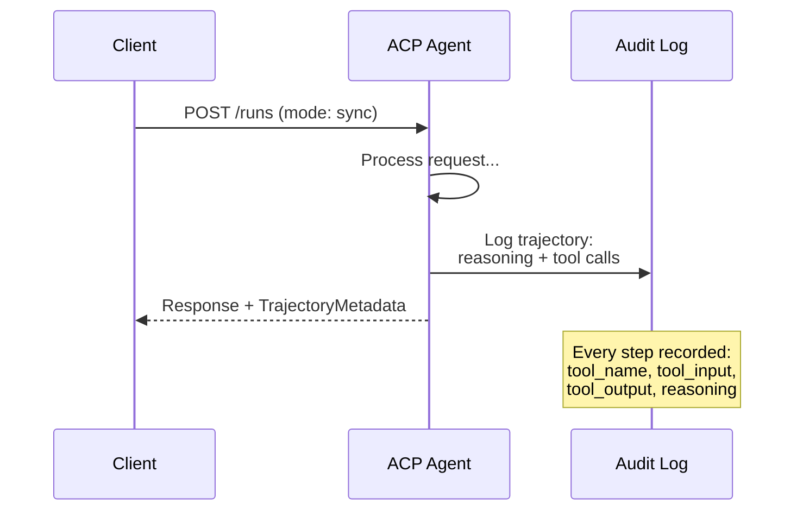

#### ACP 中的智能体发现

ACP 定义了四种发现方式:

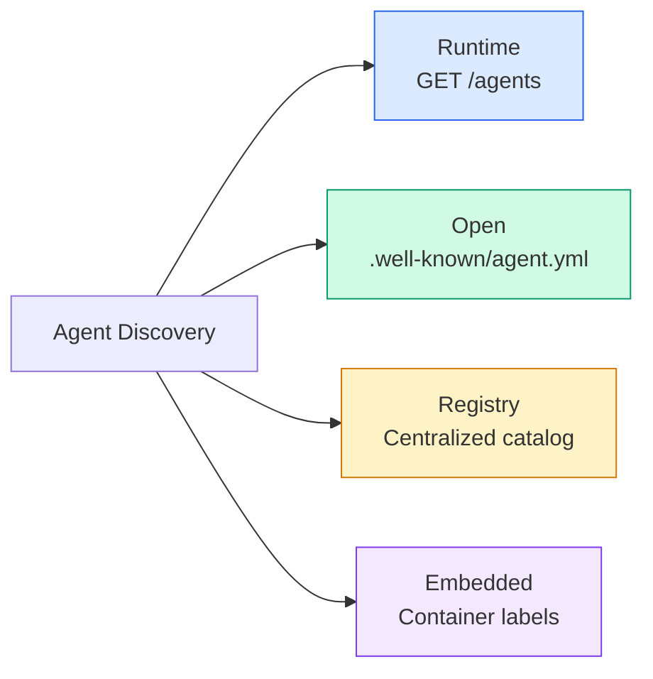

**AgentManifest** 比 A2A 的 Agent Card 简单:

```json
{
  "name": "summarizer",
  "description": "Summarizes documents with source citations",
  "input_content_types": ["text/plain", "application/pdf"],
  "output_content_types": ["text/plain", "application/json"],
  "metadata": {
    "tags": ["summarization", "RAG"],
    "framework": "BeeAI",
    "capabilities": [
      {
        "name": "Document Summarization",
        "description": "Condenses long documents into key points"
      }
    ],
    "recommended_models": ["llama3.3:70b-instruct-fp16"],
    "license": "Apache-2.0",
    "programming_language": "Python"
  }
}
```

#### Run 生命周期

ACP 用 "Run" 而不是 "Task"。Run 是一次智能体执行,有三种模式:

| 模式 | 行为 |
|---|---|
| `sync` | 阻塞。响应包含完整结果。 |
| `async` | 立即返回 202。轮询 `GET /runs/{id}` 查状态。 |
| `stream` | SSE 流。智能体工作时事件不断发出。 |

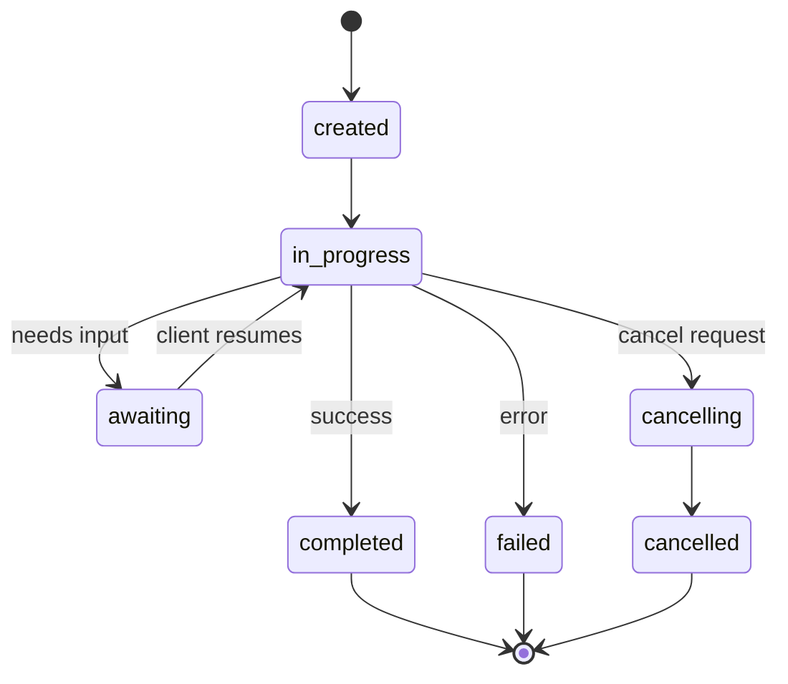

#### TrajectoryMetadata(审计轨迹)

这是 ACP 的关键差异点。每个消息部分都可以携带元数据,精确展示智能体做了什么:

```json
{
  "role": "agent/researcher",
  "parts": [
    {
      "content_type": "text/plain",
      "content": "The weather in San Francisco is 72F and sunny.",
      "metadata": {
        "kind": "trajectory",
        "message": "I need to check the weather for this location",
        "tool_name": "weather_api",
        "tool_input": { "location": "San Francisco, CA" },
        "tool_output": { "temperature": 72, "condition": "sunny" }
      }
    }
  ]
}
```

对受监管行业来说,这是金子。每个答案都带着一条可证明的推理链:调了哪些工具、用了什么输入、收到什么输出。没有黑盒。

ACP 还支持用于来源标注的 **CitationMetadata**:

```json
{
  "kind": "citation",
  "start_index": 0,
  "end_index": 47,
  "url": "https://weather.gov/sf",
  "title": "NWS San Francisco Forecast"
}
```

### ANP(智能体网络协议)

**创建者:** 开源社区(GaoWei Chang 发起)
**仓库:** [github.com/agent-network-protocol/AgentNetworkProtocol](https://github.com/agent-network-protocol/AgentNetworkProtocol)
**问题:** 来自不同组织的智能体,如何在没有中心权威的情况下互相信任?

ANP 是**去中心化身份协议**。它用 W3C 去中心化标识符(DID)和端到端加密构建信任。与 A2A 通过已知端点发现智能体不同,ANP 让智能体用密码学证明自己的身份。

ANP 有三层:

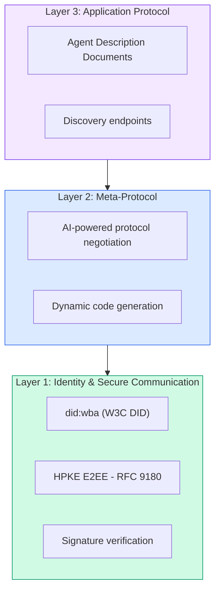

#### DID 文档(真实结构)

ANP 使用一个自定义 DID 方法 `did:wba`(Web-Based Agent)。DID `did:wba:example.com:user:alice` 解析到 `https://example.com/user/alice/did.json`:

```json
{
  "@context": [
    "https://www.w3.org/ns/did/v1",
    "https://w3id.org/security/suites/jws-2020/v1",
    "https://w3id.org/security/suites/secp256k1-2019/v1"
  ],
  "id": "did:wba:example.com:user:alice",
  "verificationMethod": [
    {
      "id": "did:wba:example.com:user:alice#key-1",
      "type": "EcdsaSecp256k1VerificationKey2019",
      "controller": "did:wba:example.com:user:alice",
      "publicKeyJwk": {
        "crv": "secp256k1",
        "x": "NtngWpJUr-rlNNbs0u-Aa8e16OwSJu6UiFf0Rdo1oJ4",
        "y": "qN1jKupJlFsPFc1UkWinqljv4YE0mq_Ickwnjgasvmo",
        "kty": "EC"
      }
    },
    {
      "id": "did:wba:example.com:user:alice#key-x25519-1",
      "type": "X25519KeyAgreementKey2019",
      "controller": "did:wba:example.com:user:alice",
      "publicKeyMultibase": "z9hFgmPVfmBZwRvFEyniQDBkz9LmV7gDEqytWyGZLmDXE"
    }
  ],
  "authentication": [
    "did:wba:example.com:user:alice#key-1"
  ],
  "keyAgreement": [
    "did:wba:example.com:user:alice#key-x25519-1"
  ],
  "humanAuthorization": [
    "did:wba:example.com:user:alice#key-1"
  ],
  "service": [
    {
      "id": "did:wba:example.com:user:alice#agent-description",
      "type": "AgentDescription",
      "serviceEndpoint": "https://example.com/agents/alice/ad.json"
    }
  ]
}
```

要注意的关键点:
- **密钥分离**是强制的。签名密钥(secp256k1)与加密密钥(X25519)分开。
- **`humanAuthorization`** 是 ANP 独有。这些密钥在使用前需要显式的人类批准(生物识别、密码、HSM)。转账这类高风险操作走这条路。
- **`keyAgreement`** 密钥用于 HPKE 端到端加密(RFC 9180)。
- **service** 段链接到智能体描述文档。

#### ANP 中的信任如何运作

ANP **不**使用信任网络或背书图谱。信任是双边的,按交互逐次验证:

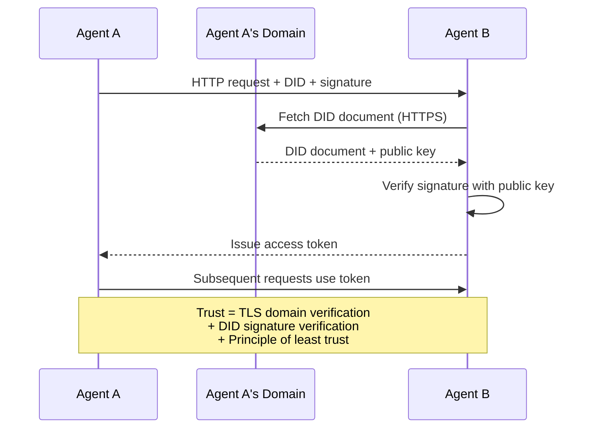

信任来自三个来源:
1. **域名级 TLS** 验证 DID 文档的宿主
2. **DID 密码学签名** 验证智能体身份
3. **最小信任原则** 只授予最低权限

没有基于 gossip 的信任传播,也没有 PageRank 打分。你通过每个智能体的 DID 直接验证它。

#### 元协议协商

这是 ANP 最新颖的特性。两个来自不同生态的智能体相遇时,不需要预先约定数据格式。它们用自然语言协商:

```json
{
  "action": "protocolNegotiation",
  "sequenceId": 0,
  "candidateProtocols": "I can communicate using:\n1. JSON-RPC with hotel booking schema\n2. REST with OpenAPI 3.1 spec\n3. Natural language over HTTP",
  "modificationSummary": "Initial proposal",
  "status": "negotiating"
}
```

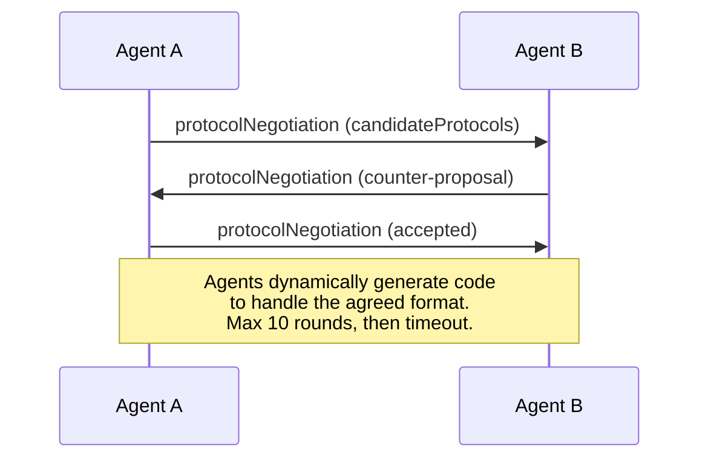

智能体来回协商(最多 10 轮)直到就格式达成一致,然后动态生成代码来处理它。状态值:`negotiating`、`rejected`、`accepted`、`timeout`。

这意味着两个素未谋面的智能体,可以在没有任何人预定义共享 schema 的情况下,自己琢磨出怎么通信。

### 对比(勘正后)

| | MCP | A2A | ACP | ANP |
|---|---|---|---|---|
| **创建者** | Anthropic | Google / Linux 基金会 | IBM / BeeAI | 社区 |
| **规范格式** | JSON-RPC | JSON-RPC / REST / gRPC | OpenAPI 3.1(REST) | JSON-RPC |
| **主要用途** | 智能体对工具 | 智能体对智能体 | 智能体对智能体 | 智能体对智能体 |
| **发现** | 工具列表 | `/.well-known/agent-card.json` | `GET /agents`、`/.well-known/agent.yml` | `/.well-known/agent-descriptions`、DID 服务端点 |
| **身份** | 隐式(本地) | 安全方案(OAuth、mTLS) | 服务器级 | W3C DID(`did:wba`)带 E2EE |
| **审计轨迹** | 无 | 基础(任务历史) | TrajectoryMetadata(工具调用、推理) | 未正式规定 |
| **状态机** | 无 | 9 个任务状态 | 7 个 run 状态 | 无 |
| **流式** | 无 | SSE | SSE | 传输无关 |
| **独门特性** | 工具 schema | Agent Card + 技能 | 轨迹审计 | 元协议协商 |
| **最适合** | 工具与数据 | 动态协作 | 受监管行业 | 跨组织信任 |
| **状态** | 稳定 | 稳定(v1.0) | 并入 A2A | 活跃开发中 |

### 它们如何协同

这些协议并不互斥。一个现实的企业系统会同时用多个:

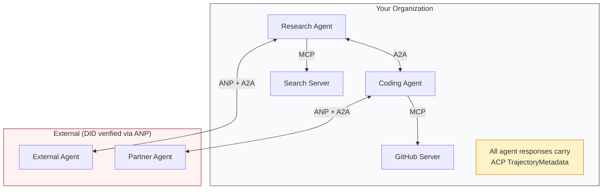

- **MCP** 把每个智能体连到它的工具
- **A2A** 处理智能体之间的协作(内部与外部)
- **ACP** 把响应包进轨迹元数据,保证可审计
- **ANP** 为你控制不了的智能体提供身份验证

```figure
swarm-message-bus
```

## 动手构建

### 第 1 步:核心消息类型

每个多智能体系统都从一个消息格式开始。我们定义映射到真实协议所用的类型:

```typescript
import crypto from "node:crypto";

type MessageRole = "user" | "agent";

type MessagePart =
  | { kind: "text"; text: string }
  | { kind: "data"; data: unknown; mediaType: string }
  | { kind: "file"; name: string; url: string; mediaType: string };

type TrajectoryEntry = {
  reasoning: string;
  toolName?: string;
  toolInput?: unknown;
  toolOutput?: unknown;
  timestamp: number;
};

type AgentMessage = {
  id: string;
  role: MessageRole;
  parts: MessagePart[];
  trajectory?: TrajectoryEntry[];
  replyTo?: string;
  timestamp: number;
};

function createMessage(
  role: MessageRole,
  parts: MessagePart[],
  replyTo?: string
): AgentMessage {
  return {
    id: crypto.randomUUID(),
    role,
    parts,
    replyTo,
    timestamp: Date.now(),
  };
}

function textMessage(role: MessageRole, text: string): AgentMessage {
  return createMessage(role, [{ kind: "text", text }]);
}
```

注意:`MessagePart` 是多模态的(文本、结构化数据、文件),与真实的 A2A 和 ACP 规范一致。`TrajectoryEntry` 捕获推理链,对应 ACP 的 TrajectoryMetadata。

### 第 2 步:A2A Agent Card 与注册表

构建与真实 A2A 规范一致的智能体发现:

```typescript
type Skill = {
  id: string;
  name: string;
  description: string;
  tags: string[];
  inputModes: string[];
  outputModes: string[];
};

type AgentCard = {
  name: string;
  description: string;
  version: string;
  url: string;
  capabilities: {
    streaming: boolean;
    pushNotifications: boolean;
  };
  defaultInputModes: string[];
  defaultOutputModes: string[];
  skills: Skill[];
};

class AgentRegistry {
  private cards: Map<string, AgentCard> = new Map();

  register(card: AgentCard) {
    this.cards.set(card.name, card);
  }

  discoverBySkillTag(tag: string): AgentCard[] {
    return [...this.cards.values()].filter((card) =>
      card.skills.some((skill) => skill.tags.includes(tag))
    );
  }

  discoverByInputMode(mimeType: string): AgentCard[] {
    return [...this.cards.values()].filter(
      (card) =>
        card.defaultInputModes.includes(mimeType) ||
        card.skills.some((skill) => skill.inputModes.includes(mimeType))
    );
  }

  resolve(name: string): AgentCard | undefined {
    return this.cards.get(name);
  }

  listAll(): AgentCard[] {
    return [...this.cards.values()];
  }
}
```

这比一个简单的名字到能力的映射丰富得多。你可以按技能标签、按输入 MIME 类型或按名字发现智能体,正如真实 A2A 规范所支持的。

### 第 3 步:A2A 任务生命周期

构建完整的任务状态机:

```typescript
type TaskState =
  | "submitted"
  | "working"
  | "input-required"
  | "auth-required"
  | "completed"
  | "failed"
  | "canceled"
  | "rejected";

const TERMINAL_STATES: TaskState[] = [
  "completed",
  "failed",
  "canceled",
  "rejected",
];

type TaskStatus = {
  state: TaskState;
  message?: AgentMessage;
  timestamp: number;
};

type Artifact = {
  id: string;
  name: string;
  parts: MessagePart[];
};

type Task = {
  id: string;
  contextId: string;
  status: TaskStatus;
  artifacts: Artifact[];
  history: AgentMessage[];
};

type TaskEvent =
  | { kind: "statusUpdate"; taskId: string; status: TaskStatus }
  | {
      kind: "artifactUpdate";
      taskId: string;
      artifact: Artifact;
      append: boolean;
      lastChunk: boolean;
    };

type TaskHandler = (
  task: Task,
  message: AgentMessage
) => AsyncGenerator<TaskEvent>;

class TaskManager {
  private tasks: Map<string, Task> = new Map();
  private handlers: Map<string, TaskHandler> = new Map();
  private listeners: Map<string, ((event: TaskEvent) => void)[]> = new Map();

  registerHandler(agentName: string, handler: TaskHandler) {
    this.handlers.set(agentName, handler);
  }

  subscribe(taskId: string, listener: (event: TaskEvent) => void) {
    const existing = this.listeners.get(taskId) ?? [];
    existing.push(listener);
    this.listeners.set(taskId, existing);
  }

  async sendMessage(
    agentName: string,
    message: AgentMessage,
    contextId?: string
  ): Promise<Task> {
    const handler = this.handlers.get(agentName);
    if (!handler) {
      const task = this.createTask(contextId);
      task.status = {
        state: "rejected",
        timestamp: Date.now(),
        message: textMessage("agent", `No handler for ${agentName}`),
      };
      return task;
    }

    const task = this.createTask(contextId);
    task.history.push(message);
    task.status = { state: "submitted", timestamp: Date.now() };

    this.processTask(task, handler, message).catch((err) => {
      task.status = {
        state: "failed",
        timestamp: Date.now(),
        message: textMessage("agent", String(err)),
      };
    });
    return task;
  }

  getTask(taskId: string): Task | undefined {
    return this.tasks.get(taskId);
  }

  cancelTask(taskId: string): boolean {
    const task = this.tasks.get(taskId);
    if (!task || TERMINAL_STATES.includes(task.status.state)) return false;
    task.status = { state: "canceled", timestamp: Date.now() };
    this.emit(taskId, {
      kind: "statusUpdate",
      taskId,
      status: task.status,
    });
    return true;
  }

  private createTask(contextId?: string): Task {
    const task: Task = {
      id: crypto.randomUUID(),
      contextId: contextId ?? crypto.randomUUID(),
      status: { state: "submitted", timestamp: Date.now() },
      artifacts: [],
      history: [],
    };
    this.tasks.set(task.id, task);
    return task;
  }

  private async processTask(
    task: Task,
    handler: TaskHandler,
    message: AgentMessage
  ) {
    task.status = { state: "working", timestamp: Date.now() };
    this.emit(task.id, {
      kind: "statusUpdate",
      taskId: task.id,
      status: task.status,
    });

    try {
      for await (const event of handler(task, message)) {
        if (TERMINAL_STATES.includes(task.status.state)) break;

        if (event.kind === "statusUpdate") {
          task.status = event.status;
        }
        if (event.kind === "artifactUpdate") {
          const existing = task.artifacts.find(
            (a) => a.id === event.artifact.id
          );
          if (existing && event.append) {
            existing.parts.push(...event.artifact.parts);
          } else {
            task.artifacts.push(event.artifact);
          }
        }
        this.emit(task.id, event);
      }
    } catch (err) {
      task.status = {
        state: "failed",
        timestamp: Date.now(),
        message: textMessage("agent", String(err)),
      };
      this.emit(task.id, {
        kind: "statusUpdate",
        taskId: task.id,
        status: task.status,
      });
    }
  }

  private emit(taskId: string, event: TaskEvent) {
    for (const listener of this.listeners.get(taskId) ?? []) {
      listener(event);
    }
  }
}
```

这实现了真实的 A2A 任务生命周期:submitted、working、input-required、终态。处理器是异步生成器,产出事件(状态更新与工件块),与 SSE 流式模型一致。

### 第 4 步:ACP 风格审计轨迹

用轨迹追踪包装通信:

```typescript
type AuditEntry = {
  runId: string;
  agentName: string;
  input: AgentMessage[];
  output: AgentMessage[];
  trajectory: TrajectoryEntry[];
  status: "created" | "in-progress" | "completed" | "failed" | "awaiting";
  startedAt: number;
  completedAt?: number;
  sessionId?: string;
};

class AuditableRunner {
  private log: AuditEntry[] = [];
  private handlers: Map<
    string,
    (input: AgentMessage[]) => Promise<{
      output: AgentMessage[];
      trajectory: TrajectoryEntry[];
    }>
  > = new Map();

  registerAgent(
    name: string,
    handler: (input: AgentMessage[]) => Promise<{
      output: AgentMessage[];
      trajectory: TrajectoryEntry[];
    }>
  ) {
    this.handlers.set(name, handler);
  }

  async run(
    agentName: string,
    input: AgentMessage[],
    sessionId?: string
  ): Promise<AuditEntry> {
    const entry: AuditEntry = {
      runId: crypto.randomUUID(),
      agentName,
      input: structuredClone(input),
      output: [],
      trajectory: [],
      status: "created",
      startedAt: Date.now(),
      sessionId,
    };
    this.log.push(entry);

    const handler = this.handlers.get(agentName);
    if (!handler) {
      entry.status = "failed";
      return entry;
    }

    entry.status = "in-progress";
    try {
      const result = await handler(input);
      entry.output = structuredClone(result.output);
      entry.trajectory = structuredClone(result.trajectory);
      entry.status = "completed";
      entry.completedAt = Date.now();
    } catch (err) {
      entry.status = "failed";
      entry.trajectory.push({
        reasoning: `Error: ${String(err)}`,
        timestamp: Date.now(),
      });
      entry.completedAt = Date.now();
    }
    return entry;
  }

  getFullAuditLog(): AuditEntry[] {
    return structuredClone(this.log);
  }

  getAuditLogForAgent(agentName: string): AuditEntry[] {
    return structuredClone(
      this.log.filter((e) => e.agentName === agentName)
    );
  }

  getAuditLogForSession(sessionId: string): AuditEntry[] {
    return structuredClone(
      this.log.filter((e) => e.sessionId === sessionId)
    );
  }

  getTrajectoryForRun(runId: string): TrajectoryEntry[] {
    const entry = this.log.find((e) => e.runId === runId);
    return entry ? structuredClone(entry.trajectory) : [];
  }
}
```

每次智能体执行都产出一条完整审计记录:进去了什么、出来了什么,以及中间完整的工具调用与推理步骤轨迹。可以按智能体、按会话或按单次 run 查询。

### 第 5 步:ANP 风格身份验证

构建基于 DID 的身份与验证:

```typescript
type VerificationMethod = {
  id: string;
  type: string;
  controller: string;
  publicKeyDer: string;
};

type DIDDocument = {
  id: string;
  verificationMethod: VerificationMethod[];
  authentication: string[];
  keyAgreement: string[];
  humanAuthorization: string[];
  service: { id: string; type: string; serviceEndpoint: string }[];
};

type AgentIdentity = {
  did: string;
  document: DIDDocument;
  privateKey: crypto.KeyObject;
  publicKey: crypto.KeyObject;
};

class IdentityRegistry {
  private documents: Map<string, DIDDocument> = new Map();

  publish(doc: DIDDocument) {
    this.documents.set(doc.id, doc);
  }

  resolve(did: string): DIDDocument | undefined {
    return this.documents.get(did);
  }

  verify(did: string, signature: string, payload: string): boolean {
    const doc = this.documents.get(did);
    if (!doc) return false;

    const authKeyIds = doc.authentication;
    const authKeys = doc.verificationMethod.filter((vm) =>
      authKeyIds.includes(vm.id)
    );

    for (const key of authKeys) {
      const publicKey = crypto.createPublicKey({
        key: Buffer.from(key.publicKeyDer, "base64"),
        format: "der",
        type: "spki",
      });
      const isValid = crypto.verify(
        null,
        Buffer.from(payload),
        publicKey,
        Buffer.from(signature, "hex")
      );
      if (isValid) return true;
    }
    return false;
  }

  requiresHumanAuth(did: string, operationKeyId: string): boolean {
    const doc = this.documents.get(did);
    if (!doc) return false;
    return doc.humanAuthorization.includes(operationKeyId);
  }
}

function createIdentity(domain: string, agentName: string): AgentIdentity {
  const did = `did:wba:${domain}:agent:${agentName}`;
  const { publicKey, privateKey } = crypto.generateKeyPairSync("ed25519");

  const publicKeyDer = publicKey
    .export({ format: "der", type: "spki" })
    .toString("base64");

  const keyId = `${did}#key-1`;
  const encKeyId = `${did}#key-x25519-1`;

  const document: DIDDocument = {
    id: did,
    verificationMethod: [
      {
        id: keyId,
        type: "Ed25519VerificationKey2020",
        controller: did,
        publicKeyDer,
      },
      {
        id: encKeyId,
        type: "X25519KeyAgreementKey2019",
        controller: did,
        publicKeyDer,
      },
    ],
    authentication: [keyId],
    keyAgreement: [encKeyId],
    humanAuthorization: [],
    service: [
      {
        id: `${did}#agent-description`,
        type: "AgentDescription",
        serviceEndpoint: `https://${domain}/agents/${agentName}/ad.json`,
      },
    ],
  };

  return { did, document, privateKey, publicKey };
}

function signPayload(identity: AgentIdentity, payload: string): string {
  return crypto
    .sign(null, Buffer.from(payload), identity.privateKey)
    .toString("hex");
}
```

这镜像了真实的 ANP 身份模型:智能体持有 DID 文档,认证、密钥协商和人类授权密钥各自分离。`IdentityRegistry` 模拟 DID 解析(生产中这将是对智能体域名的 HTTP 拉取)。

### 第 6 步:协议网关

把四个协议接进一个统一系统:

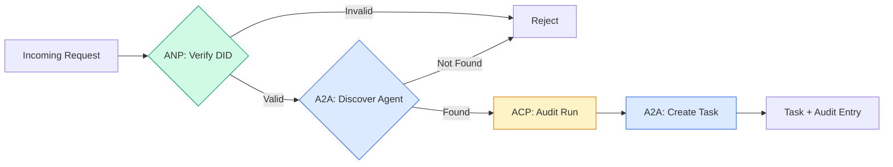

```typescript
class ProtocolGateway {
  private registry: AgentRegistry;
  private taskManager: TaskManager;
  private auditRunner: AuditableRunner;
  private identityRegistry: IdentityRegistry;

  constructor(
    registry: AgentRegistry,
    taskManager: TaskManager,
    auditRunner: AuditableRunner,
    identityRegistry: IdentityRegistry
  ) {
    this.registry = registry;
    this.taskManager = taskManager;
    this.auditRunner = auditRunner;
    this.identityRegistry = identityRegistry;
  }

  async delegateTask(
    fromDid: string,
    signature: string,
    targetAgent: string,
    message: AgentMessage,
    sessionId?: string
  ): Promise<{ task: Task; audit: AuditEntry } | { error: string }> {
    if (!this.identityRegistry.verify(fromDid, signature, message.id)) {
      return { error: "Identity verification failed" };
    }

    const card = this.registry.resolve(targetAgent);
    if (!card) {
      return { error: `Agent ${targetAgent} not found in registry` };
    }

    const audit = await this.auditRunner.run(
      targetAgent,
      [message],
      sessionId
    );
    const task = await this.taskManager.sendMessage(targetAgent, message);

    return { task, audit };
  }

  discoverAndDelegate(
    fromDid: string,
    signature: string,
    skillTag: string,
    message: AgentMessage
  ): Promise<{ task: Task; audit: AuditEntry } | { error: string }> {
    const candidates = this.registry.discoverBySkillTag(skillTag);
    if (candidates.length === 0) {
      return Promise.resolve({
        error: `No agents found with skill tag: ${skillTag}`,
      });
    }
    return this.delegateTask(
      fromDid,
      signature,
      candidates[0].name,
      message
    );
  }
}
```

网关在一次调用里做四件事:
1. **ANP**:经 DID 签名验证调用方身份
2. **A2A**:发现目标智能体并检查能力
3. **ACP**:把执行包进带轨迹的审计轨迹
4. **A2A**:创建带完整生命周期跟踪的任务

### 第 7 步:把一切接起来

```typescript
async function protocolDemo() {
  const registry = new AgentRegistry();
  registry.register({
    name: "researcher",
    description: "Searches and summarizes findings",
    version: "1.0.0",
    url: "https://researcher.local/a2a/v1",
    capabilities: { streaming: true, pushNotifications: false },
    defaultInputModes: ["text/plain"],
    defaultOutputModes: ["text/plain", "application/json"],
    skills: [
      {
        id: "web-research",
        name: "Web Research",
        description: "Searches the web",
        tags: ["research", "search", "summarization"],
        inputModes: ["text/plain"],
        outputModes: ["application/json"],
      },
    ],
  });
  registry.register({
    name: "coder",
    description: "Writes code from specs",
    version: "1.0.0",
    url: "https://coder.local/a2a/v1",
    capabilities: { streaming: false, pushNotifications: false },
    defaultInputModes: ["text/plain", "application/json"],
    defaultOutputModes: ["text/plain"],
    skills: [
      {
        id: "code-gen",
        name: "Code Generation",
        description: "Generates code",
        tags: ["coding", "generation"],
        inputModes: ["text/plain", "application/json"],
        outputModes: ["text/plain"],
      },
    ],
  });

  const taskManager = new TaskManager();
  const auditRunner = new AuditableRunner();

  const researchTrajectory: TrajectoryEntry[] = [];

  taskManager.registerHandler(
    "researcher",
    async function* (task, message) {
      yield {
        kind: "statusUpdate" as const,
        taskId: task.id,
        status: { state: "working" as const, timestamp: Date.now() },
      };

      researchTrajectory.push({
        reasoning: "Searching for React 19 documentation",
        toolName: "web_search",
        toolInput: { query: "React 19 compiler features" },
        toolOutput: {
          results: ["react.dev/blog/react-19", "github.com/react/react"],
        },
        timestamp: Date.now(),
      });

      researchTrajectory.push({
        reasoning: "Extracting key findings from search results",
        toolName: "doc_analysis",
        toolInput: { url: "react.dev/blog/react-19" },
        toolOutput: {
          summary:
            "React 19 compiler auto-memoizes, no manual useMemo needed",
        },
        timestamp: Date.now(),
      });

      yield {
        kind: "artifactUpdate" as const,
        taskId: task.id,
        artifact: {
          id: crypto.randomUUID(),
          name: "research-results",
          parts: [
            {
              kind: "data" as const,
              data: {
                findings: [
                  "React 19 compiler auto-memoizes components",
                  "No more manual useMemo/useCallback needed",
                  "Compiler runs at build time, not runtime",
                ],
                sources: ["react.dev/blog/react-19"],
              },
              mediaType: "application/json",
            },
          ],
        },
        append: false,
        lastChunk: true,
      };

      yield {
        kind: "statusUpdate" as const,
        taskId: task.id,
        status: { state: "completed" as const, timestamp: Date.now() },
      };
    }
  );

  auditRunner.registerAgent("researcher", async () => ({
    output: [
      textMessage("agent", "React 19 compiler auto-memoizes components"),
    ],
    trajectory: researchTrajectory,
  }));

  const identityRegistry = new IdentityRegistry();

  const coderIdentity = createIdentity("coder.local", "coder");
  const researcherIdentity = createIdentity("researcher.local", "researcher");

  identityRegistry.publish(coderIdentity.document);
  identityRegistry.publish(researcherIdentity.document);

  const gateway = new ProtocolGateway(
    registry,
    taskManager,
    auditRunner,
    identityRegistry
  );

  console.log("=== Protocol Demo ===\n");

  console.log("1. Agent Discovery (A2A)");
  const researchAgents = registry.discoverBySkillTag("research");
  console.log(
    `   Found ${researchAgents.length} agent(s):`,
    researchAgents.map((a) => a.name)
  );

  console.log("\n2. Identity Verification (ANP)");
  const message = textMessage("user", "Research React 19 compiler features");
  const signature = signPayload(coderIdentity, message.id);
  const verified = identityRegistry.verify(
    coderIdentity.did,
    signature,
    message.id
  );
  console.log(`   Coder DID: ${coderIdentity.did}`);
  console.log(`   Signature verified: ${verified}`);

  console.log("\n3. Task Delegation (A2A + ACP + ANP)");
  const result = await gateway.delegateTask(
    coderIdentity.did,
    signature,
    "researcher",
    message,
    "session-001"
  );

  if ("error" in result) {
    console.log(`   Error: ${result.error}`);
    return;
  }

  console.log(`   Task ID: ${result.task.id}`);
  console.log(`   Task state: ${result.task.status.state}`);
  console.log(`   Artifacts: ${result.task.artifacts.length}`);

  console.log("\n4. Audit Trail (ACP)");
  console.log(`   Run ID: ${result.audit.runId}`);
  console.log(`   Status: ${result.audit.status}`);
  console.log(`   Trajectory steps: ${result.audit.trajectory.length}`);
  for (const step of result.audit.trajectory) {
    console.log(`     - ${step.reasoning}`);
    if (step.toolName) {
      console.log(`       Tool: ${step.toolName}`);
    }
  }

  console.log("\n5. Full Audit Log");
  const fullLog = auditRunner.getFullAuditLog();
  console.log(`   Total runs: ${fullLog.length}`);
  for (const entry of fullLog) {
    const duration = entry.completedAt
      ? `${entry.completedAt - entry.startedAt}ms`
      : "in-progress";
    console.log(`   ${entry.agentName}: ${entry.status} (${duration})`);
  }
}

protocolDemo().catch((err) => {
  console.error("Protocol demo failed:", err);
  process.exitCode = 1;
});
```

## 会出什么问题

协议解决的是 happy path。生产中会坏的是这些:

**Schema 漂移。** 智能体 A 发布的 Agent Card 广告 `application/json` 输出,但 JSON schema 在版本间变了。智能体 B 按旧格式解析,拿到垃圾。修法:给技能和输出 schema 加版本。A2A 规范在 Agent Card 上支持 `version` 字段,正是为此。

**状态机违规。** 一个智能体处理器产出了 `completed` 事件,然后又试图产出更多工件。任务已不可变。你的代码要么静默丢弃这些更新,要么抛错。修法:产出前检查终态。上面的 `TaskManager` 用终态后的 `break` 强制执行了这一点。

**信任解析失败。** 智能体 A 要验证智能体 B 的 DID,但 B 的域名挂了,DID 文档拉不到。你是 fail open(接受未验证的智能体)还是 fail closed(全部拒绝)?ANP 推荐 fail closed,遵循最小信任原则。

**轨迹膨胀。** ACP 的轨迹日志强大但昂贵。一个每次 run 调 200 次工具的复杂智能体,会产出巨大的审计记录。修法:按可配置的详细级别记录轨迹。合规场景记录工具名和 IO;非监管负载跳过推理步骤。

**发现时的惊群。** 50 个智能体在启动时同时查询 `GET /agents`。修法:给 Agent Card 加 TTL 缓存、错开发现间隔,或改用推送式注册代替轮询。

## 投入使用

### 真实实现

**A2A** 最成熟。Google 的[官方规范](https://github.com/google/A2A)在 Linux 基金会下开源,有 Python 和 TypeScript 的 SDK。如果你的智能体需要动态发现与协作,从这里开始。

**ACP** 正在并入 A2A。IBM 的 [BeeAI 项目](https://github.com/i-am-bee/acp)把 ACP 作为 REST 优先的替代方案创建,但轨迹元数据这个概念正在被吸收进 A2A 生态。即使你传输层用 A2A,也应该用 ACP 的模式(轨迹日志、run 生命周期)。

**ANP** 最具实验性。[社区仓库](https://github.com/agent-network-protocol/AgentNetworkProtocol)有 Python SDK(AgentConnect)。元协议协商这个概念是真正的新意。跨组织的智能体部署,值得关注。

**MCP** 第 13 阶段已经讲过。要让智能体使用工具,MCP 就是标准。

### 选对协议

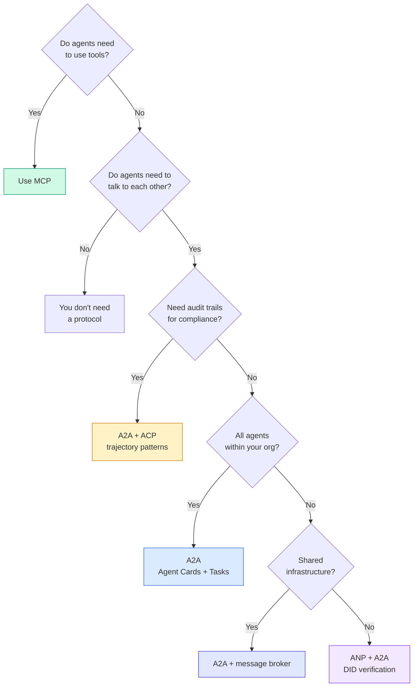

## 交付

本课产出:
- `code/main.ts` -- 全部四种协议模式的完整实现
- `outputs/prompt-protocol-selector.md` -- 一个帮你为系统选择协议的提示词

## 练习

1. **多跳任务委派。** 扩展 `TaskManager`,让智能体处理器可以把子任务委派给其他智能体。研究员接到任务,把"搜索"和"总结"两个子任务委派给两个专家智能体,等两者完成,再把结果合并进自己的工件。

2. **流式审计轨迹。** 修改 `AuditableRunner` 支持流式模式。不再等完整结果,而是在轨迹条目增加时实时产出 `AuditEntry` 更新。用一个产出审计快照的异步生成器。

3. **DID 轮换。** 给 `IdentityRegistry` 加密钥轮换。智能体应能发布带更新密钥的新 DID 文档,同时保留 `previousDid` 引用。验证方应在宽限期内同时接受当前密钥和上一个密钥的签名。

4. **协议协商。** 实现 ANP 的元协议概念。两个智能体交换 `protocolNegotiation` 消息,各自给出候选格式(如"我能说 JSON-RPC" vs "我偏好 REST")。最多 3 轮后,它们就格式达成一致或超时。商定的格式决定它们使用哪个 `TaskManager` 或 `AuditableRunner`。

5. **限速发现。** 加一个 `RateLimitedRegistry` 包装:按可配置的 TTL 缓存 Agent Card 查找,并限制每个智能体每秒的发现查询数。模拟 100 个智能体启动时互相发现的惊群,测量差异。

## 关键术语

| 术语 | 大家口头的说法 | 实际含义 |
|------|----------------|----------------------|
| MCP | "AI 工具的协议" | 智能体发现和使用工具的客户端-服务器协议。智能体对工具,不是智能体对智能体。 |
| A2A | "Google 的智能体协议" | Linux 基金会旗下的点对点智能体协作协议。经 Agent Card 发现,9 态任务生命周期,SSE 流式。支持 JSON-RPC、REST 和 gRPC 绑定。 |
| ACP | "企业级智能体消息" | IBM/BeeAI 的智能体 run REST API,带 TrajectoryMetadata:每个响应携带完整的推理与工具调用链。正在并入 A2A。 |
| ANP | "去中心化智能体身份" | 社区协议,用 `did:wba`(DID)做密码学身份、HPKE 做端到端加密、AI 驱动的元协议协商,让素未谋面的智能体也能通信。 |
| Agent Card | "智能体的名片" | 挂在 `/.well-known/agent-card.json` 的 JSON 文档,描述技能、支持的 MIME 类型、安全方案和协议绑定。 |
| DID | "去中心化 ID" | W3C 标准,可密码学验证的身份,托管在智能体自己的域名上。ANP 用 `did:wba` 方法。 |
| TrajectoryMetadata | "审计回执" | ACP 的机制:把推理步骤、工具调用及其输入输出附在每个智能体响应上。 |
| 元协议 | "智能体协商怎么说话" | ANP 的做法:智能体用自然语言动态商定数据格式,然后生成代码来处理。 |
| Task | "工作单元" | A2A 的有状态对象,跟踪工作从提交到完成。到达终态后不可变。 |

## 延伸阅读

- [Google A2A specification](https://github.com/google/A2A) -- 官方规范与 SDK(v1.0.0,Linux 基金会)
- [IBM/BeeAI ACP specification](https://github.com/i-am-bee/acp) -- 智能体 run 与轨迹元数据的 OpenAPI 3.1 规范
- [Agent Network Protocol](https://github.com/agent-network-protocol/AgentNetworkProtocol) -- 基于 DID 的身份、E2EE、元协议协商
- [Model Context Protocol docs](https://modelcontextprotocol.io/) -- Anthropic 的 MCP 规范(第 13 阶段已讲)
- [W3C Decentralized Identifiers](https://www.w3.org/TR/did-core/) -- ANP 底层的身份标准
- [RFC 9180 (HPKE)](https://www.rfc-editor.org/rfc/rfc9180) -- ANP 用于 E2EE 的加密方案
- [FIPA Agent Communication Language](http://www.fipa.org/specs/fipa00061/SC00061G.html) -- 现代智能体协议的学术前身
