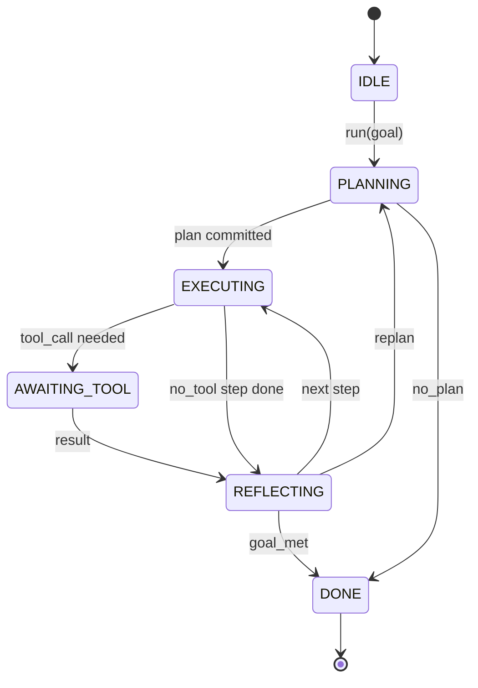

# 智能体外壳循环契约

> 外壳即智能体,模型只是协处理器。本课冻结一份循环契约,任何模型都能接进来。

**类型:** 动手构建
**编程语言:** Python
**前置要求:** 第 13 阶段第 01–07 课,第 14 阶段第 01 课
**预计耗时:** 约 90 分钟

## 学习目标
- 把智能体外壳循环定义为一台带显式转移的确定性状态机。
- 实现十个生命周期钩子主题,供运维者接入策略、遥测与护栏。
- 定义两个拉取点:循环在此处把控制权交还调用方,等新输入到来再恢复。
- 强制每会话预算(轮数、工具调用数、墙钟秒数),超额时不泄漏半截状态。
- 发出十一种事件类型的带类型事件流,下游 UI 与 tracer 无需窥视循环内部即可订阅。

```figure
cf-loop-contract
```

## 框架

一个无人值守跑四十轮的编程智能体,不是聊天循环。它是一台状态机:节点允许运维者拦截,边允许运维者审计。契约一旦写下来,换模型、换工具、换策略就不再是重构,而是一次注册调用。

本课就建这份契约。我们命名六个状态、十个钩子主题、两个拉取点、十一种事件类型和一个预算封套。外壳里的其他一切(工具注册表、JSON-RPC 传输、派发器、规划器)都插进这个形状里。

## 状态

循环有六个状态。五个是活跃的,一个是终态。



`IDLE` 是唯一合法入口,`DONE` 是唯一合法出口。`AWAITING_TOOL` 是唯一让出拉取点的状态。其余转移都是内部的。

状态机是确定性的。给定相同的事件日志,外壳会重新进入相同的状态。正是这个性质,让你可以重放会话做调试,而不必重新调用模型。

## 钩子主题

钩子是运维者切入循环的接缝。外壳触发十个主题。每个主题接受任意数量的订阅者,按注册顺序触发。订阅者可以修改 payload、抛异常中止本轮,或返回哨兵值跳过下一步。

```text
before_plan         after_plan
before_tool_call    after_tool_call
before_step         after_step
on_error
on_pause
on_budget_exceeded
on_complete
```

这个形状正是 Claude Code、Cursor、OpenCode 在 2025 年年中收敛到的样子。名字按功能起,不带品牌。拦截 `rm -rf` 的钩子挂在 `before_tool_call`;发 OpenTelemetry span 的钩子挂在 `after_step`;恢复暂停会话的钩子挂在 `on_pause`。

## 拉取点

循环两次让出控制权。第一次在 `AWAITING_TOOL`:没有工具结果就无法推进。第二次在 `on_pause`:预算耗尽,或某个钩子显式要求人工审查。

拉取点不是异常,是返回。调用方检查外壳状态,取来外壳索要的东西,调用 `resume(payload)`。外壳从停下的地方接着走。形状与 Python 生成器相同。拉取点上的传输由你选:TUI 里是按键,MCP 上是 `tools/call`,队列上是任务轮询。

## 事件流

循环在契约规定的时点向一条带类型事件流追加事件。流仅追加,订阅者可从任意偏移重放。已实现的十一种事件类型:

- `session.start` —— `run(goal)` 被调用时发出一次
- `plan.draft` —— 规划器返回草稿计划时发出
- `plan.commit` —— 草稿被提交为当前计划后发出
- `step.start` —— 每个执行步骤开始时发出
- `step.end` —— 每个执行步骤结束时发出
- `tool.call` —— 需要工具的步骤把控制权交给调用方时发出
- `tool.result` —— 带着工具结果恢复时发出
- `tool.error` —— 带着错误恢复,或钩子中止该调用时发出
- `budget.warn` —— 触及某项预算上限时发出
- `session.pause` —— 循环因暂停(预算或钩子)让出时发出
- `session.complete` —— 循环到达 `DONE` 时发出一次

事件不复制钩子 payload。钩子是命令式的(修改、中止),事件是观测性的(记录、外发)。把它们当作正交的两套东西。

## 预算封套

一个会话携带三条限额:轮数、工具调用数、墙钟秒数。每轮轮数加一,每次工具调用计数加一,墙钟在每次状态转移时检查。任一限额触顶时,循环触发 `on_budget_exceeded`,发出 `budget.warn`,然后转回 `IDLE`,并在下一个拉取点带上预算超额的原因。

预算不是熔断开关,而是让出。由调用方决定:追加预算并恢复,还是关闭会话。

## 本课不做什么

不调模型,不注册真实工具,不实现传输。那是接下来四课的事。本课把契约钉死,让后面四课插进来时不用重写。

`main.py` 里的确定性规划器是个替身:它返回一份硬编码的三步计划,其中两步需要工具结果。重点在循环,不在计划。

## 怎么读这份代码

`HarnessLoop` 是主类:持有状态、触发钩子、发出事件。`Budget` 跟踪限额。`Event` 是流上的带类型信封。`HookRegistry` 是派发表。`_transition` 是唯一改状态的函数,状态机的不变量就收敛在这一处。

把 `main.py` 从头读到尾,然后读 `code/tests/test_loop.py`。测试钉死了每一次转移和每一次钩子触发的顺序。

## 更进一步

在生产里造外壳,最难的不是状态机,而是让契约可强制。契约得扛住规划器热重载,扛住返回畸形 JSON 的工具,扛住一个四十轮会话跑到三分之二时在 `before_tool_call` 里抛异常的钩子。本课的测试覆盖了这些失败模式。跑它们,搞坏它们,加用例。

下一课加工具注册表,再之后是 JSON-RPC 传输,再之后是派发器。到第二十四课,这份文件里的循环将跑在真实计划上,调真实工具,受真实预算约束。
