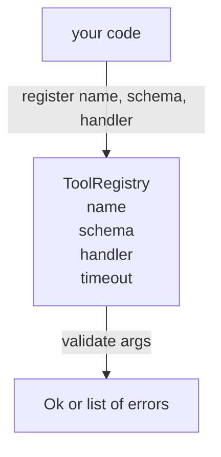

# 带 Schema 校验的工具注册表

> 智能体校验不了的工具,就是智能体调不了的工具。先造注册表和 schema 检查器,再造工具。

**类型:** 动手构建
**编程语言:** Python
**前置要求:** 第 13 阶段第 01–07 课,第 14 阶段第 01 课
**预计耗时:** 约 90 分钟

## 学习目标
- 维护一张"工具名 → schema → 处理器"的带类型注册表,派发器问一次,之后尽可信。
- 实现 JSON Schema 2020-12 的一个子集,覆盖九成工具调用真正用到的关键字。
- 返回精确的、JSON Pointer 形状的错误路径,让模型一次往返就能自我修正。
- 默认拒绝重复注册,除非显式 override——静默覆盖正是生产工具目录漂移的温床。
- 校验器保持纯函数(无 I/O、无时间、无全局量),以便在重放日志上重跑。

```figure
cf-registry-validate
```

## 为什么注册表先于工具

2026 年的编程智能体,注册的工具比模型单个上下文窗口装得下的多。一个不敷衍的外壳会注册两百个工具,每轮只露出十到四十个。注册表是三个问题的唯一事实来源:"有哪些工具"、"参数长什么样"、"该调哪个处理器"。这三个答案一旦钉死,外壳的其余部分就不用再猜了。

我们要避开的错误是:发了处理器却没 schema,或发了 schema 却不校验。两者都常见,两者都会把下一层(第二十三课的派发器)变成猜谜游戏——唯一的失败模式是处理器里炸出一条堆栈。

## 工具记录长什么样

```text
ToolRecord
  name        : str          (unique, lowercase alphanumeric and underscore segments separated by dots, e.g., snake_case.segment.case)
  description : str          (one line, shown to the model)
  schema      : dict         (JSON Schema 2020-12 subset)
  handler     : Callable     (async or sync, returns Any)
  idempotent  : bool         (dispatcher uses this for retry decisions)
  timeout_ms  : int          (override per-tool dispatcher default)
```

schema 是校验器唯一碰的字段,处理器对它是透明的。这是刻意分开的:schema 是数据,处理器是代码。混在一起,你就会忍不住把校验逻辑写进处理器——那正是我们要杜绝的 bug。

## JSON Schema 2020-12 子集

完整的 2020-12 规范是一篇论文。我们只需要八个关键字。

```text
type           string / number / integer / boolean / object / array / null
properties     map of property name -> schema
required       list of property names
enum           list of allowed primitive values
minLength      integer, applies to strings
maxLength      integer, applies to strings
pattern        ECMA-262-compatible regex, applies to strings
items          schema applied to every array element
```

这些已足够覆盖工具 API 的实际需要。我们不加的关键字(oneOf、anyOf、allOf、$ref、条件式)在生产 schema 里都合法,但会把校验器变成一台带环的树遍历器。我们造的是注册表,不是 JSON Schema 引擎。

## JSON Pointer 错误路径

校验失败时,校验器返回错误列表。每个错误携带一条指向输入内部的 JSON Pointer 路径——以斜杠开头的属性名与数组下标序列。

```text
{"a": {"b": [1, 2, "x"]}}
                    ^
                    /a/b/2
```

模型读错误路径比读句子在行。如果 schema 要求 `args.user.email` 而模型传了整数,错误应该是 `/user/email` 加 `expected_type: string`。模型下一次调用就能修好,用不着一轮自然语言解释。

## 注册与覆盖

`register(name, schema, handler, **opts)` 默认拒绝重复注册,调用方必须传 `override=True` 才能替换。这是运维卫生:代码库里两处静默注册同名工具,是那种要在生产里查一个星期的 bug。

注册表暴露三个读方法:`get(name)` 返回记录或抛异常;`validate(name, args)` 返回 `Ok` 或错误列表;`names()` 按注册顺序返回工具名。

## 校验器是什么、不是什么

它是对 schema 树的单次递归遍历,纯函数。它不调处理器,不做类型强转(字符串 `"42"` 过不了 number schema),不静默截断。

它不是安全边界:校验通过后,恶意处理器照样能干坏事。第二十三课的派发器会补上超时与沙箱层,注册表只管形状。

## 形状



## 怎么读这份代码

`code/main.py` 定义了 `ToolRegistry`、`ToolRecord`、`ValidationError` 和八个校验器函数。校验器按 `schema["type"]` 分派(带 `enum` 的 schema 视为无类型的枚举检查)。每个类型校验器返回空列表或 `ValidationError` 列表。顶层遍历器在下沉时拼接错误并前缀路径段。

`code/tests/test_registry.py` 覆盖注册、覆盖、校验成功、带路径的校验失败,以及子集里的每个关键字。

## 更进一步

本课落地后你会想要的两个扩展:对本地 definitions 块做 `$ref` 解析,以及用 `additionalProperties: false` 做严格形状。两个都不大,工具目录长到五十个以上时都很常见。我们把它们留在课外,好让这份文件一次读完。

下一课(二十二)造 JSON-RPC stdio 传输,把这张注册表暴露给模型客户端。再下一课(二十三)把两者包进一个带超时与重试的派发器。
