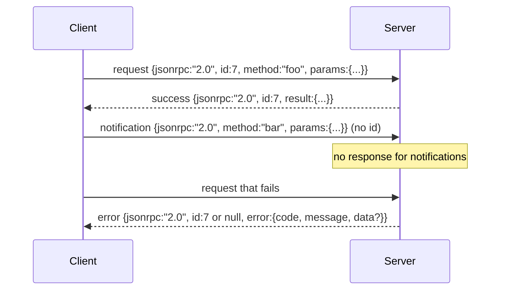

# 基于换行分隔 stdio 的 JSON-RPC 2.0

> 模型客户端与工具服务器之间的传输,是跑在 stdio 上的 JSON-RPC。亲手造一遍,你就明白每个分帧层花钱买来的是什么。

**类型:** 动手构建
**编程语言:** Python
**前置要求:** 第 13 阶段第 01–07 课,第 14 阶段第 01 课
**预计耗时:** 约 90 分钟

## 学习目标
- 用换行分隔 JSON 在 stdin 与 stdout 上讲 JSON-RPC 2.0。
- 映射五个标准错误码(-32700、-32600、-32601、-32602、-32603),并以正确语义抛出。
- 不发明新信封字段,就能区分请求、响应、通知与批处理。
- 一行一个解析错误,不污染流的其余部分。
- 用 io.BytesIO 搭一个自我终结的演示,整课无需拉起子进程即可运行。

```figure
cf-jsonrpc-frames
```

## 为什么 JSON-RPC 仍是通用语

2026 年的编程智能体,一个会话要和十二来个工具服务器对话。每个服务器是独立进程或远程端点。线上格式自 2013 年没变过:JSON-RPC 2.0,一份两页的规范。它能活下来,是因为替代品(gRPC、一调用一 HTTP、自定义二进制)都要做 JSON-RPC 不用做的取舍:流式、批处理、传输耦合,三者只能选边。JSON-RPC 在 stdio、socket、websocket、HTTP 上对称可用;只要双方都守规范,客户端就能驱动一台从未见过的服务器。

本课造的是 stdio 变体:换行分隔 JSON。一个请求一行,一个响应一行,传输边界就是 `\n`。

## 线上形状

信封有四种形状。客户端讲两种,服务器讲两种。



通知没有 `id`,服务器不得回复。如果服务器给通知回了响应,客户端没法把它挂回任何调用点。就这一条规则,保住了分帧算术的简单。

批处理是一个由请求或通知组成的 JSON 数组。服务器回一个响应数组,顺序任意,每个非通知条目对应一个响应。若批里全是通知,服务器什么都不回。

## 五个错误码

```text
-32700  Parse error      JSON could not be parsed
-32600  Invalid Request  Envelope shape is wrong
-32601  Method not found
-32602  Invalid params
-32603  Internal error
```

-32000 到 -32099 之间保留给服务器自定义错误,其余由应用自定义。本课只用这五个。处理器抛异常时,传输层包成 -32603,异常类名放进 `data.exception`。

解析错误有一条特殊规则:响应里的 `id` 是 `null`,因为请求根本没解析到能取出 id 的程度。

## 换行分帧与 BytesIO 演示

传输层一次读一行。一行是直到 `\n`(含)的字节。某行解析不了,传输层就写一条 `id: null` 的 -32700 响应,然后继续。流不会中毒,下一行照样全新解析。

课里我们用一对 `io.BytesIO` 充当 stdin 和 stdout。服务器读请求直到 EOF,逐个写响应,然后返回;客户端把响应读回来。不拉进程,不设超时。传输行为与真实子进程管道完全一致,因为 Python 的 `io` 接口提供同样的 `.readline()` 与 `.write()` 契约。

## 方法分派

传输层不知道有哪些方法。它把工作交给外壳提供的可调用 `handler(method, params)`。handler 返回结果或抛异常。三个异常类对应特定错误码。

```text
MethodNotFound -> -32601
InvalidParams  -> -32602
Anything else  -> -32603 with exception name in data
```

传输层永远看不到工具注册表——注册表藏在 handler 后面。这正是我们要的分层:传输层讲 JSON-RPC,注册表讲工具形状,派发器(第二十三课)把两者缝起来。

## 出错时的流行为

```text
client writes              server reads             server writes
---------------            -----------              -------------
{...valid request...}      parses ok                {...response, id matches...}
{...broken json...         parse fails              {id:null, error: -32700}
{...valid request...}      parses ok                {...response, id matches...}
{...missing method...}     invalid envelope         {id:X, error: -32600}
```

坏掉的 JSON 行停不了循环,缺 `method` 字段停不了循环,处理器异常也停不了循环。传输层一直读到 EOF 为止。

## 通知与非对称流

通知是发了就忘。外壳用通知传进度事件、取消信号和日志行。长时运行的工具想流式汇报状态而不必逐条往返,靠的就是通知。

本课实现一个出站通知助手 `write_notification`。服务器在请求处理途中用它发进度。演示呈现这个模式:请求进来,处理器发两条进度通知,然后写最终响应。

## 怎么读这份代码

`code/main.py` 定义了 `StdioTransport`、解析助手(`parse_request`)、三个写出助手(`write_response`、`write_error`、`write_notification`),以及分派循环 `serve`。错误码常量在模块作用域。

`code/tests/test_transport.py` 覆盖:五个错误码、通知(不写响应)、批处理(数组进、数组出、通知跳过)、坏 JSON(解析错误后继续),以及处理器在调用中途写通知的非对称流。

## 更进一步

这套传输足够支撑后续课程。生产级传输会再加三样:一个能扛住转发的关联 id 字段(你的 `id` 已经是了,但在网格环境里还需要外层 trace id);一个取消通道(比如带在途调用 id 的 `$/cancelRequest` 通知);以及一次内容类型协商握手,让同一个 socket 既能讲 JSON-RPC 也能讲 Streamable HTTP。这些都不改线上格式,只是加元数据。
