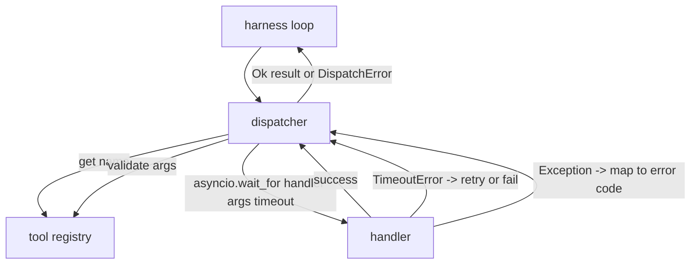
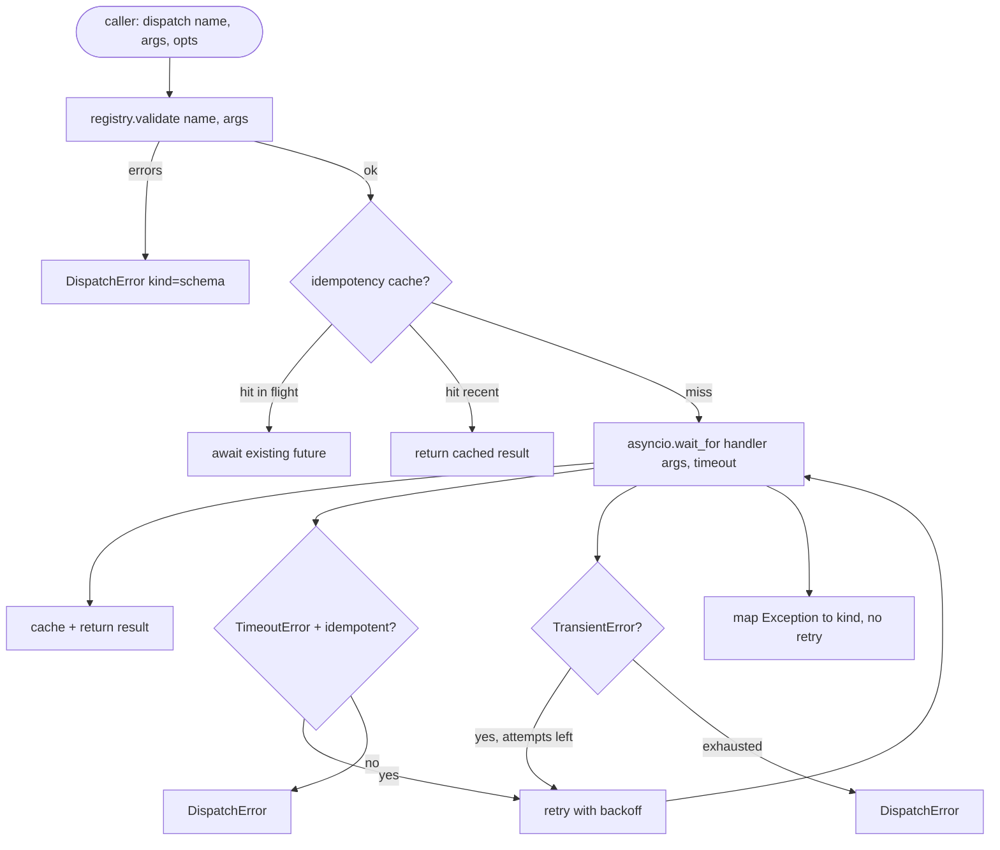

# 函数调用派发器

> schema 许下的每个承诺,都要在派发器这里兑现。超时、重试、去重、错误映射,全在这一道接缝上。

**类型:** 动手构建
**编程语言:** Python
**前置要求:** 第 13 阶段第 01–07 课,第 14 阶段第 01 课
**预计耗时:** 约 90 分钟

## 学习目标
- 给工具处理器包一层逐次调用的超时,返回带类型错误,而不是把循环吊死。
- 实现带抖动与最大尝试次数的指数退避重试。
- 按幂等键给重试去重:与慢吞吞的原始调用赛跑的重试,不该再跑一遍。
- 把处理器异常与传输故障映射到外壳循环已经认得的统一错误信封。
- 用并发上限约束并行派发,四十个工具调用的扇出不至于拖垮事件循环。

```figure
cf-dispatch-retry
```

## 派发器坐在哪

在外壳循环(第二十课)与工具注册表(第二十一课)之间。传输层(第二十二课)喂循环,循环把工具调用交给派发器,派发器问注册表、跑处理器,返回结果或一个 JSON-RPC 形状的错误信封。



派发器是唯一知道计时器、重试与幂等性的层。循环不知道,注册表不知道,处理器也不知道。这份隔离正是设计意图。

## 超时

每个工具有默认超时,注册表记录里带 `timeout_ms`。外壳传入逐次调用覆盖值时,派发器用覆盖值。实现用 `asyncio.wait_for`:超时即取消处理器任务,派发器返回 `DispatchError(kind="timeout")`。

对非幂等工具,超时默认不可重试。一个超时的 `db.write` 可能提交了也可能没提交,重试就是重复写。派发器尊重注册表记录里的 `idempotent` 标记:幂等工具重试,非幂等工具不重试。

## 指数退避重试

重试策略最多三次,退避指数带抖动。

```text
attempt 1  -> delay 0
attempt 2  -> delay 0.1s * (1 + random[0..0.5])
attempt 3  -> delay 0.4s * (1 + random[0..0.5])
```

只有 `timeout` 与 `transient` 错误会重试。`schema` 错误、`not_found`、`internal` 错误不重试——schema 错误是确定性的,重试改变不了结果,只烧预算。

重试循环尊重外壳的预算:调用方剩余工具调用数为零时,派发器第一次尝试就快速失败,返回 `kind="budget_exceeded"`。

## 幂等键去重

原始调用还在途时触发的重试,是真实生产 bug。第一次调用挂在 4.9 秒(刚好低于超时),重试在第 5 秒发出,两个请求赛跑打向同一个后端。如果这个工具是 `payments.charge`,你就扣了两次款。

派发器接受可选的 `idempotency_key`。同键调用在途时,派发器等待在途 future 并返回其结果。完成后键在缓存里保留六十秒,吸收迟到的重试。

键由调用方负责。外壳从规划器推导:`f"{step_id}:{tool_name}:{hash(args)}"`。派发器不自造键——光靠参数推导,会让两次语义不同的调用看起来一样。

## 错误信封

失败的派发只返回一种形状。

```text
DispatchError
  kind        : "timeout" | "transient" | "schema" | "not_found" | "internal" | "budget_exceeded"
  message     : str
  attempts    : int
  jsonrpc_code: int   (one of -32601, -32602, -32603)
```

外壳循环把 `kind` 映射到下一状态:`schema` 与 `not_found` 进 `on_error` 并触发重新规划;`timeout` 与 `transient` 进 `on_error`,视尝试次数决定是否重规划;`budget_exceeded` 触发 `on_budget_exceeded`。

## 扇出的并发上限

`gather(*calls)` 让所有协程同时跑。四十个工具调用就是四十条打开的 socket 或四十根子进程管道,多数后端不喜欢单个客户端并发四十条连接。

派发器给 `gather` 套一个信号量。默认并发上限八。每次调用先拿信号量再派发,完成即释放。调用方看到的输出形状与 `gather` 一致,但实际调度是有界的。

## 单次调用全流程



## 怎么读这份代码

`code/main.py` 定义了 `Dispatcher`、`DispatchError`、`TransientError`。派发器构造时接收注册表。异步方法 `dispatch(name, args, ...)` 是唯一入口。逐次尝试的超时在 `_run_with_retries` 内联用 `asyncio.wait_for` 实现。`gather_bounded(calls)` 按并发上限跑多个派发。

`code/tests/test_dispatcher.py` 覆盖:超时触发、transient 重试、schema 错误不重试、幂等去重(同键两个并发调用收敛为一次处理器执行)、并发限制(信号量生效)。

测试用 `asyncio.sleep(0)` 与基于 `Counter` 的确定性处理器,毫秒级跑完,不依赖墙钟计时。

## 更进一步

生产派发器常加两个扩展。其一,每次状态转移的结构化日志(循环的事件流已经给了,但派发器也应发 `dispatch.attempt` 与 `dispatch.retry` 事件)。其二,熔断器:窗口内失败 N 次后,工具进入冷却期,期间派发立即返回 `kind="circuit_open"`,不再尝试处理器。两者都能叠在这份派发器上,不改契约。

第二十四课把派发器粘到一个"规划—执行"智能体上,四块零件就能看到同场运转了。
