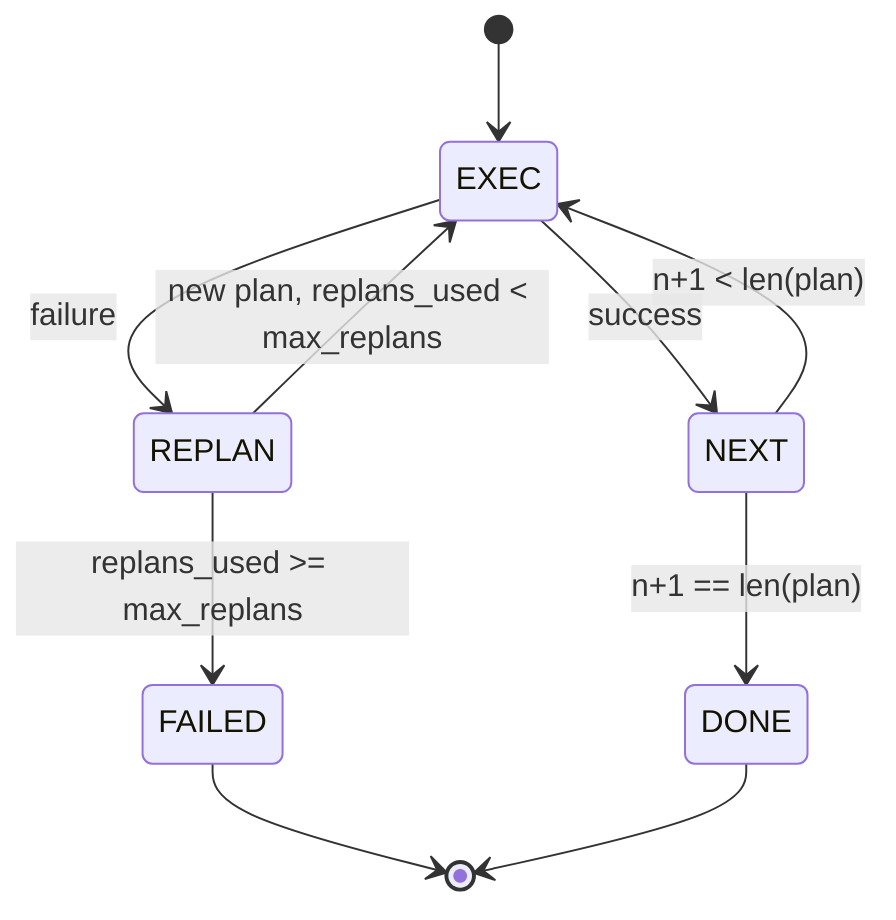

# 规划—执行控制流

> 扛不住失败的计划只是脚本,会重规划的脚本才是智能体。先把重规划器造出来。

**类型:** 动手构建
**编程语言:** Python
**前置要求:** 第 13 阶段第 01–07 课,第 14 阶段第 01 课
**预计耗时:** 约 90 分钟

## 学习目标
- 把计划表示为带类型步骤的有序列表,让执行器能推理进度与结果。
- 顺序执行步骤,失败时以受控方式交还给规划器。
- 从当前游标重规划,把上一次错误放进上下文,让下一份计划有据可依。
- 每次修订都发出计划 diff,让下游 tracer 或 UI 能展示计划为何而变。
- 执行两条预算:硬性步骤上限与硬性重规划上限。

```figure
cg-plan-replan
```

## 规划—执行,而非思维链

思维链智能体一路吐 token,靠循环去猜工具调用的边界在哪。规划—执行智能体先产出结构化计划,再确定性地逐条执行。计划是外壳可以内省的数据,执行是外壳把这份数据跑过派发器。

两块零件:一个产计划的规划器,一个跑计划的执行器。有意思的活儿在执行器撞上失败时。三个选项:

```text
1. Abort         (return failed, surface the error)
2. Skip          (mark step failed, continue with the rest)
3. Replan        (hand the error to the planner, get a new plan from the cursor)
```

其中"重规划"这一项,把脚本变成智能体。

## Step 的形状

```text
Step
  id              : int           (monotonic within a plan revision)
  tool_name       : str
  args            : dict
  expected_outcome: str           (planner's stated success condition)
  result          : Any | None
  error           : str | None
```

`expected_outcome` 是规划器随步骤附上的一句话。执行器不强校验它,它有两个用途:重规划器修订计划时读它;事件流发出它,让 tracer 能显示"这一步本该做 X"。

## 规划器的形状

```python
def planner(goal: str, history: list[Step], last_error: str | None) -> list[Step]:
    ...
```

一个纯函数。`goal` 是用户目标,`history` 是已执行的步骤(填好了结果与错误),`last_error` 首次调用时为 None,之后每次为最近一次失败信息。规划器返回从游标开始的新计划。

规划器不知道执行器的存在,不知道重试,不知道超时。它只产计划,仅此而已。

## 执行器

执行器是一台小状态机。每个步骤过派发器,结果是三种之一:成功、可重规划失败、致命失败。可重规划失败交还规划器;致命失败(预算超额、重规划触顶)返回 `FAILED` 会话结果。



## 修订时的计划 diff

规划器在失败后返回新计划时,执行器发出一个 `plan.diff` 事件,带三个字段。

```text
removed: list of step ids that were in the old plan and are not in the new
added  : list of step ids in the new plan that were not in the old
revised: list of step ids whose tool_name or args changed
```

tracer 或 UI 可以把它渲染成:被删步骤加删除线,新增步骤加高亮。重点不在 diff 格式,而在修订是一个可见事件,不是静默改写。

## 两条预算,都是硬顶

`max_steps` 限制整个会话(含重规划)的总步骤执行数,默认十二。一份五步线性计划重规划两次、每次多加三步,就是十六次执行,会超预算——执行器将拒绝重规划并返回 FAILED。

`max_replans` 限制首份计划之后规划器被调用的次数,默认五。这条更要紧:一个连着五次返回同一份坏计划的规划器,否则会转到步骤预算兜底才停。卡住重规划次数,失败来得更快,原因也更清楚。

## 本课的确定性规划器

本课不调模型,随课附带一个按 `last_error` 选计划的确定性规划器。

```text
last_error is None    -> emit a four-step plan
last_error matches X  -> emit a three-step plan that routes around X
last_error matches Y  -> emit a two-step plan that gives up gracefully
otherwise             -> return [] (signals nothing to replan)
```

这已足够测遍执行器的每条转移路径:成功、重规划一次、重规划两次、重规划耗尽、步骤预算耗尽。

## 结果形状

```text
SessionResult
  status      : "completed" | "failed"
  reason      : str     ("goal_met" | "step_budget" | "replan_budget" | "no_plan")
  history     : list[Step]
  revisions   : list[PlanDiff]
  events      : list[Event]
```

第二十课的外壳循环可以直接读它;第二十三课的派发器执行每个步骤;第二十一课的注册表校验每步参数;第二十二课的传输层则会把这整套流程经 JSON-RPC 呈现给模型客户端。

## 怎么读这份代码

`code/main.py` 定义了 `PlanExecuteAgent`、`Step`、`PlanDiff`、`SessionResult` 和确定性规划器。执行器就是单个 `run(goal)` 方法,返回 `SessionResult`。计划 diff 通过比对步骤 id 与 `(tool_name, args)` 元组算出。

`code/tests/test_agent.py` 覆盖:线性成功、计划中途失败后重规划一次、重规划耗尽返回 `failed:replan_budget`、步骤预算耗尽,以及计划 diff 事件格式。

## 更进一步

接上真实模型后,你会想要两个扩展。其一,部分计划缓存:六步计划前三步成功、第四步失败时,你不想重跑前三步——执行器已经留了 history,规划器只需读它。其二,并行分支:当前执行器严格顺序执行;规划器若产出独立分支(用 `gather_step` 而非 `next_step`),就能经派发器并发跑两个工具调用。

两者都会带来真实的复杂度,也都更适合在线性执行器钉死之后再添加——这正是本课做的事。
