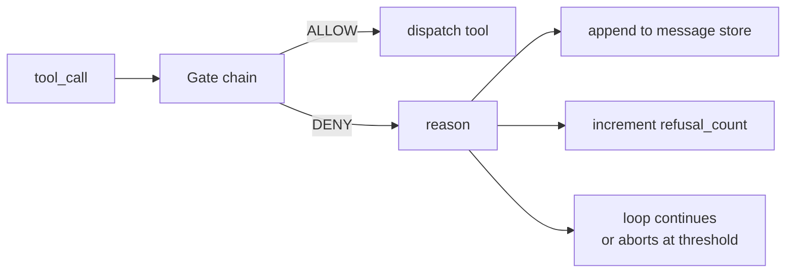
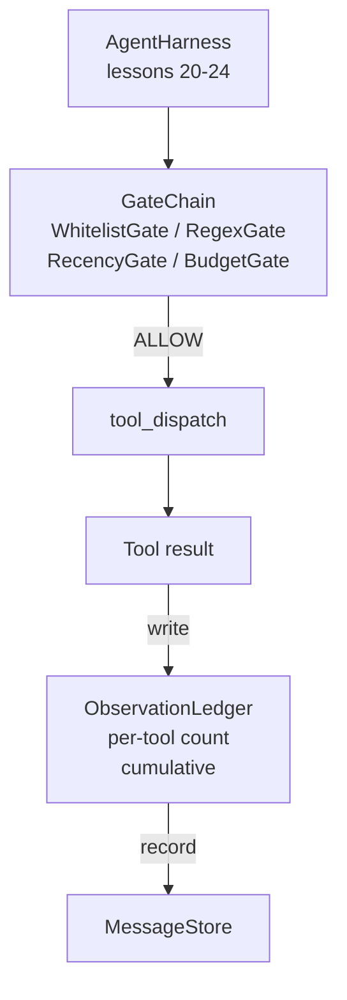

# 结课项目第 25 课:校验门与观察预算

> 没有校验层的智能体框架,就像披着风衣的许愿。本课要构建一条确定性的门链:它决定一次工具调用是否放行、智能体能看多少输出,以及当它读得太多时循环何时必须叫停。这条链由一组小而有名字的门组成,外加一本观察账本,记录模型被展示过的每一个 token。

**类型:** 动手构建
**编程语言:** Python (stdlib)
**前置要求:** 第 19 阶段 · 20-24(Track A1:智能体循环、工具注册表、消息存储、提示词构建器、模型路由器),第 14 阶段 · 33(指令即约束),第 14 阶段 · 36(作用域契约),第 14 阶段 · 38(校验门)
**预计耗时:** 约 90 分钟

## 学习目标

- 构建一个带确定性 `evaluate(call)` 方法的 `VerificationGate` 协议。
- 把预算门、新近性门、白名单门、正则门组合成一条带短路语义的门链。
- 用按工具和轮次建索引的 `ObservationLedger` 追踪每一条观察。
- 当累计观察预算将被超出时,拒绝这次工具调用。
- 产出结构化的 `GateDecision` 记录,供下游可观测性系统消费。

## 问题

当智能体框架放任模型随意调用工具时,真实使用的第一小时内就会冒出三类 bug。

第一类是无边界的观察。对一个 20 万行的仓库跑一次 grep,五十万 token 的输出就灌进了下一轮。模型每千字节才看到一条匹配,剩下的上下文全浪费了。token 账单很可观,而智能体完成任务的能力不升反降。

第二类是陈旧的新近性。一个长时间运行的任务攒下了五十次工具调用。模型把第三轮那次 read_file 的结果当成实时状态重读。第四十七轮做的修改却始终看不到,因为提示词构建器把最早的观察排在了最前面。

第三类是权限蠕变。一个调研任务从调用 `web_search` 开始,最后不知怎么就跑起了 `shell`——因为模型凭空造了个工具名,而框架默认放行。等有人翻看轨迹时,/tmp 里已经躺着一个垃圾文件,一次 curl 已经打到了内部 API 上。

校验门就是框架里那个说"不"的组件。它不是模型,也不是裁判。它是一个以 `(call, history, ledger)` 为输入的确定性函数,返回 ALLOW 或 DENY 并附上理由。理由会进日志,模型会被告知,循环据此继续或中止。

## 概念



所谓门,就是任何实现了 `evaluate(call, ctx) -> GateDecision` 方法的东西。门链是一个有序列表。求值在第一个 deny 处短路。顺序很重要:便宜的结构化门排在前面,昂贵的数 token 的门排在后面。

本课交付四个门:

- `WhitelistGate`。允许的工具名是一个显式集合,集合之外一律拒绝。这是最便宜的门,第一个跑。
- `RegexGate`。用正则匹配工具参数。适合拒绝参数里带 `rm -rf` 的 shell 调用,或发往内网 IP 的 HTTP 调用。它只看调用载荷,无副作用。
- `RecencyGate`。模型只能看到最近 N 轮的观察,更早的观察被屏蔽。如果一次工具调用的结果会撑破一个已经过期的观察窗口,该门就拒绝这次调用。
- `BudgetGate`。模型在整个会话中读到的累计 token 数有上限。账本显示上限已到,之后所有工具调用一律拒绝。

观察账本是这里的簿记。每次成功的工具调用写入一行:工具名、轮次、产生的 token 数、累计值。账本回答两个问题:模型一共看了多少?模型在工具 X 上看了多少?预算门读第一个数。按工具划分的预算门读第二个数——这将作为练习由你来写。

```figure
cg-gate-chain
```

## 架构



框架向门链提问,门链要么点头要么拒绝。点头,工具执行,账本记一笔,结果追加进消息存储。拒绝,模型会收到一条以系统消息形式给出的拒绝说明,循环决定是重试还是中止。

## 你要构建什么

实现是一个 `main.py` 加一组测试。

1. `Observation` 和 `ToolCall` 两个 dataclass 定义线上传输的数据形状。
2. `ObservationLedger` 记录 `(turn, tool, tokens)` 行,并回答 `cumulative()` 和 `per_tool(name)`。
3. `GateDecision` 携带 `(allow, reason, gate_name)`。
4. `VerificationGate` 是协议,每个门实现 `evaluate(call, ctx)`。
5. `GateChain` 包着一个有序列表。它依次调用每个门,返回第一个 deny;全部通过则返回 allow。
6. 演示跑一个迷你的合成智能体循环,共三轮。第三轮触发预算门,循环给出一次干净的拒绝,拒绝计数非零。

token 计数器故意用最笨的 `len(text) // 4` 启发式。本课的重点是门的管线,不是分词器。生产环境请换成真正的分词器。

## 为什么门链顺序很重要

deny 比 allow 便宜。`WhitelistGate` 是 O(1) 哈希查询;`RegexGate` 是 O(pattern * argv);`RecencyGate` 只读消息存储的一小片;`BudgetGate` 要读整本账本。按成本升序排列,被拒绝的调用才能在做昂贵工作之前就短路掉。

还要按爆炸半径排序。白名单是最强的断言:这个工具不在契约里。正则门其次:这个参数不在契约里。新近性门再往后:框架仍然关心,但这次调用结构上合法。预算门排最后,因为按定义,它只有在其他门都通过后才会触发。

## 如何与 Track A 其余部分组合

前面的课给了你循环、工具注册表、消息存储、提示词构建器和模型路由器。本课加上的,是模型与工具之间的那一层。第 26 课交付沙箱:门链说 ALLOW 之后,调度器把工具调用交给它。第 27 课交付评测框架:把拒绝计数记录为质量信号。第 28 课把门决策接进 OpenTelemetry span。第 29 课把所有这些缝合成一个能跑的编程智能体。

## 运行方式

```bash
cd phases/19-capstone-projects/25-verification-gates-observation-budget
python3 code/main.py
python3 -m pytest code/tests/ -v
```

演示打印逐轮轨迹,包含每一次门决策,并以零退出码结束。测试覆盖账本、每个门的单测、门链短路,以及合成循环的端到端流程。
