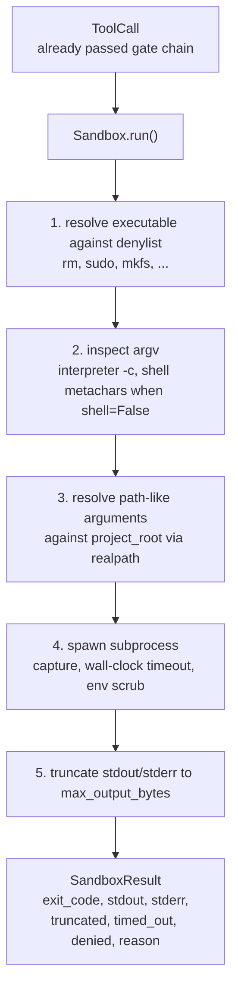
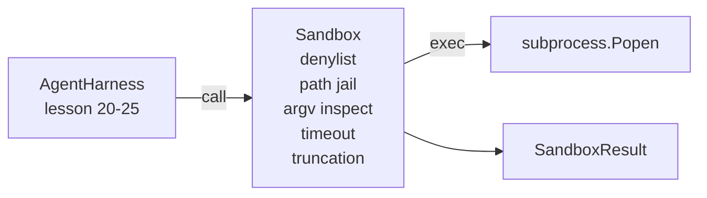

# 结课项目第 26 课:带拒绝名单与路径牢笼的沙箱运行器

> 校验门决定一次工具调用该不该跑,沙箱决定它跑起来之后会发生什么。本课交付一个子进程运行器:拒绝危险的可执行文件、拒绝危险的 argv 形态、把每个文件路径都关进项目根目录、截断超大输出,并在墙钟超时后杀掉失控进程。它是夹在模型与操作系统之间的两层防护中的第二层。

**类型:** 动手构建
**编程语言:** Python (stdlib)
**前置要求:** 第 19 阶段 · 25(校验门与观察预算),第 14 阶段 · 33(指令即约束),第 14 阶段 · 38(校验门)
**预计耗时:** 约 90 分钟

## 学习目标

- 构建一个包装 `subprocess.run` 的 `Sandbox` 类,带超时、输出捕获和截断。
- 按名字用拒绝名单拒绝命令,按结构用 argv 检查器拒绝命令。
- 拒绝任何解析后落在声明的项目根目录之外的路径参数。
- 在非 shell 模式下拒绝 shell 元字符。
- 返回结构化的 `SandboxResult`,供下游可观测性系统和评测框架消费。

## 问题

一个能开 shell 的编程智能体,一轮之内就能装后门、外泄密钥、变砖开发者的笔记本、把云账单刷爆。成本最低的防御是根本不给它 shell,次低的是一个能对一份精确模式清单说"不"的沙箱。

智能体轨迹里反复出现三类失败。

第一类是危险可执行文件。一个被逼着修路径问题的模型会尝试 `sudo`、`chmod -R 777`、`rm -rf`、`mkfs`、`dd`。这些都不该出现在智能体的运行里。拒绝名单按名字和别名把它们拦下。

第二类是 argv 花招。被告知不许用 shell 的模型会把攻击借道解释器管道送出去:`python3 -c "import os; os.system('rm -rf /')"`、`bash -c '...'`、`node -e '...'`、`perl -e '...'`。沙箱必须明白:任何带 `-c` 类标志运行的解释器,都只是多绕了几步的 shell 调用。

第三类是路径逃逸。模型被要求读 `./src/main.py`,结果读的是 `../../etc/passwd`。沙箱把每个路径参数都关进牢笼:用 `os.path.realpath` 解析,再断言前缀。

沙箱不是操作系统意义上的安全边界。铁了心的攻击者拿到代码执行能力后仍然能逃出去。沙箱是开发期的护栏:它让常见失败模式变得响亮,拦住智能体因为纯粹的无能而造成破坏。

## 概念



沙箱有四条拒绝轴:名字、argv、路径、结构。每条轴都是调用的纯函数,此时还没起子进程。所有轴都通过之后,子进程才会启动。

`SandboxResult` 的退出码是约定俗成的那套:0 成功,非零失败,外加三个哨兵码——denied(-100)、timed_out(-101),以及 truncated(退出码是真实退出码,但会置一个标志位)。后续课程读这个结构化结果,而不是去解析 stderr。

```figure
cg-path-jail
```

## 架构



拒绝名单是一个可执行文件 basename 的 frozenset。别名(`/bin/rm`、`/usr/bin/rm`)都解析到同一个 basename。argv 检查器认得解释器形态:argv[0] 是解释器、且后面任何参数以 `-c` 或 `-e` 开头的 argv 一律拒绝。当调用没有显式请求 shell 时,shell 元字符(`;`、`|`、`&`、`>`、`<`、反引号、`$()`)导致拒绝。

路径牢笼是最微妙的一块。沙箱在构造时接受一个 `project_root`。任何看起来像路径的参数(含 `/` 或能匹配到现存文件)都经过 `os.path.realpath` 规范化,然后与项目根目录的 realpath 比对。解析后的目标不在根目录之下,拒绝。符号链接逃逸(项目根目录里一个指向外部的符号链接)会被挡住,因为检查的是 realpath,不是字面路径。

## 你要构建什么

实现是 `main.py` 加一个测试目录。

1. `SandboxResult` dataclass:exit_code、stdout、stderr、truncated、timed_out、denied、reason、duration_ms。
2. `SandboxConfig` dataclass:project_root、max_output_bytes、timeout_seconds、denylist、interpreter_block。
3. `Sandbox` 类:`run(argv, *, shell=False, cwd=None)` 返回一个 `SandboxResult`。
4. 内部拒绝辅助函数:`_check_executable_denylist`、`_check_argv_interpreter`、`_check_shell_metachars`、`_check_path_jail`。
5. 输出截断,带清晰的 `truncated` 标志,并在捕获流里加一行标记。
6. 文件底部的演示:一串合法调用和对抗性调用,各自带结果展示。

沙箱默认用 `subprocess.run` 配 `shell=False` 和 `capture_output=True`。墙钟超时用 `timeout` 参数;撞上 `TimeoutExpired` 时,沙箱杀掉整个进程组并合成一个 SandboxResult。

## 为什么这不是真沙箱

本课的沙箱没有用 namespace、cgroup、seccomp、gVisor、Firecracker,也没用任何内核级隔离。子进程能做的事,沙箱都能做。防护是结构性的:最常见的那批危险调用被拒绝,响亮的拒绝会进可观测性系统,而不是悄无声息地跑掉。

生产级智能体还要往上叠层:在非特权 Docker 容器里跑、在 microVM 里跑、drop capabilities、把项目根目录只读挂载、给临时目录读写挂载、对内存和 CPU 设 ulimit、把环境变量清洗成一份已知安全的白名单。第 29 课会做其中一部分。操作系统级隔离超出本课范围。

## 运行方式

```bash
cd phases/19-capstone-projects/26-sandbox-runner-denylist
python3 code/main.py
python3 -m pytest code/tests/ -v
```

演示创建一个临时目录,往里放一个干净的文件,然后跑一连串调用。合法调用成功;被拒绝的调用返回 `denied=True` 且带理由的 SandboxResult;超时返回 `timed_out=True`;截断会置 `truncated=True`。演示打印一张 JSON 结果表,并以零退出码结束。

## 如何与 Track A 其余部分组合

第 25 课产出了门链,第 26 课是门链 ALLOW 之后接棒的执行器。第 27 课的评测框架把沙箱结果与每个任务的期望退出码比对。第 28 课在每次 `Sandbox.run` 调用外围发出一个 `gen_ai.tool.execution` span。第 29 课的端到端演示让一个真实的编程智能体同时穿过这两层。
